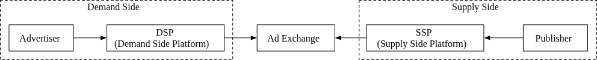

### Chapter: Ad Click Event Aggregation (System Design Interview Vol 2)

Tracking ad click events is critical for measuring campaign effectiveness (CTR, CVR) and, most importantly, for billing advertisers. While the Real-Time Bidding (RTB) process happens in sub-second latency, the aggregation of these clicks for reporting and billing usually permits a few minutes of delay.

#### Background: Real-Time Bidding (RTB)
RTB is the process by which ad inventory is bought and sold in a split-second auction as a page loads.
*   **Advertiser:** Initiates the request to buy space.
*   **DSP (Demand-Side Platform):** Helps advertisers buy inventory.
*   **Ad Exchange:** The marketplace hub.
*   **SSP (Supply-Side Platform):** Helps publishers sell space.
*   **Publisher:** Offers the ad space.

#### Step 1 - Understand the Problem and Establish Design Scope

**Data attributes for a click event:**
`ad_id`, `click_timestamp`, `user_id`, `ip`, `country`.

**Functional Requirements:**
1.  **Count by ad_id:** Aggregate clicks for a specific ad in the last $M$ minutes.
2.  **Top 100 ads:** Return the top 100 most clicked ads every minute (configurable).
3.  **Filtering:** Support filtering by `ip`, `user_id`, or `country`.
4.  **Scale:** Google/Facebook scale (billions of clicks per day).

**Non-Functional Requirements:**
1.  **Accuracy:** Critical for billing.
2.  **Edge Cases:** Handle delayed events (late arrivals) and duplicate events.
3.  **Robustness:** Resilience to partial system failures.
4.  **Latency:** End-to-end latency within a few minutes.

#### Back-of-the-Envelope Estimation

*   **DAU:** 1 billion users.
*   **Volume:** Assume 1 ad click per user per day $\rightarrow$ **1 billion ad click events per day**.
*   **QPS:** 
    *   Average: $10^9 \text{ events} \div 10^5 \text{ seconds} = 10,000 \text{ QPS}$.
    *   Peak: $5 \times \text{Average} = 50,000 \text{ QPS}$.
*   **Storage:** 
    *   Per event: $\sim 0.1 \text{ KB}$.
    *   Daily: $1 \text{ billion} \times 0.1 \text{ KB} = 100 \text{ GB}$.
    *   Monthly: $\sim 3 \text{ TB}$.

*(Awaiting the next parts of the chapter for API design, high-level architecture, and deep dive...)*
