### Chapter: Ad Click Event Aggregation (System Design Interview Vol 2)

Tracking ad click events is critical for measuring campaign effectiveness (CTR, CVR) and, most importantly, for billing advertisers. While the Real-Time Bidding (RTB) process happens in sub-second latency, the aggregation of these clicks for reporting and billing usually permits a few minutes of delay.

#### Background: Real-Time Bidding (RTB)
RTB is the process by which ad inventory is bought and sold in a split-second auction as a page loads.
*   **Advertiser:** Initiates the request to buy space.
*   **DSP (Demand-Side Platform):** Helps advertisers buy inventory.
*   **Ad Exchange:** The marketplace hub.
*   **SSP (Supply-Side Platform):** Helps publishers sell space.
*   **Publisher:** Offers the ad space.

#### Step 1 - Understand the Problem and Establish Design Scope

**Data attributes for a click event:**
`ad_id`, `click_timestamp`, `user_id`, `ip`, `country`.

**Functional Requirements:**
1.  **Count by ad_id:** Aggregate clicks for a specific ad in the last $M$ minutes.
2.  **Top 100 ads:** Return the top 100 most clicked ads every minute (configurable).
3.  **Filtering:** Support filtering by `ip`, `user_id`, or `country`.
4.  **Scale:** Google/Facebook scale (billions of clicks per day).

**Non-Functional Requirements:**
1.  **Accuracy:** Critical for billing.
2.  **Edge Cases:** Handle delayed events (late arrivals) and duplicate events.
3.  **Robustness:** Resilience to partial system failures.
4.  **Latency:** End-to-end latency within a few minutes.

#### Back-of-the-Envelope Estimation

*   **DAU:** 1 billion users.
*   **Volume:** Assume 1 ad click per user per day $\rightarrow$ **1 billion ad click events per day**.
*   **QPS:** 
    *   Average: $10^9 \text{ events} \div 10^5 \text{ seconds} = 10,000 \text{ QPS}$.
    *   Peak: $5 \times \text{Average} = 50,000 \text{ QPS}$.
*   **Storage:** 
    *   Per event: $\sim 0.1 \text{ KB}$.
    *   Daily: $1 \text{ billion} \times 0.1 \text{ KB} = 100 \text{ GB}$.
    *   Monthly: $\sim 3 \text{ TB}$.

---

### Step 2 - Propose High-Level Design and Get Buy-In

#### Query API Design

These APIs are used by the dashboard clients (data scientists, product managers) to query the aggregation service. By passing a `filter` parameter, we consolidate the search requirements into just two APIs:

**API 1: Aggregate count by ad_id**
*   `GET /v1/ads/{ad_id}/aggregated_count`
*   **Request Params:** `from` (minute), `to` (minute), `filter` (e.g., `001` for US-only).
*   **Response:** `{ "ad_id": "ad001", "count": 125 }`

**API 2: Top N popular ads**
*   `GET /v1/ads/popular_ads`
*   **Request Params:** `count` (Top N), `window` (M minutes), `filter`.
*   **Response:** `{ "ad_ids": ["ad005", "ad002", "ad089"] }`

#### Data Model: Raw vs. Aggregated Data

The system must handle two fundamentally different types of data:
1.  **Raw Data:** Unprocessed click logs from application servers.
2.  **Aggregated Data:** Periodically processed summaries (e.g., clicking counts broken down by minute and filter ID).

| Feature | Raw Data | Aggregated Data |
| :--- | :--- | :--- |
| **Pros** | Contains the full dataset; guarantees nothing is lost. Can be used to recalculate aggregations if bugs occur. | Much smaller data set. Optimized for lightning-fast queries. |
| **Cons** | Huge storage footprint. Directly querying it is incredibly slow. | Data loss (derived data). It merges multiple rows into abstract counts. |
| **Role** | **Backup Data:** Moved to cold storage. Only queried for data science or recalculating corrupted aggregates. | **Active Data:** Tuned heavily for query performance. Feeds the dashboard. |

**The Verdict:** We must store **both**.

#### Choosing the Right Database

**1. Database for Raw Data**
*   **Characteristics:** Massively write-heavy (10,000 to 50,000 QPS). Extremely low read volume. No transaction support needed.
*   **Choice:** A write-heavy NoSQL database like **Cassandra** or **InfluxDB**. Alternatively, raw files can be pushed to **Amazon S3** in columnar formats (ORC, Parquet, AVRO) rotated by size cap.

**2. Database for Aggregated Data**
*   **Characteristics:** Time-series data. Highly read-heavy (auto-refreshing dashboards for 2M ads) and highly write-heavy (minute-by-minute aggregation updates). 
*   **Choice:** A NoSQL database optimized for both high-throughput writes and time-range reads like **Cassandra** is equally suitable here.

#### High-Level Architecture (Asynchronous)

Processing unbound data streams strictly synchronously directly from log watchers to databases will cause out-of-memory crashes during traffic spikes (e.g., peak hours). 

**The Asynchronous Pipeline (Decoupling via Kafka):**
To ensure the system survives massive traffic spikes and allows producers/consumers to scale independently, **Message Queues (like Kafka)** sit between every major component.

1.  **Log Watcher $\rightarrow$ Message Queue 1:** Raw click events are pushed here.
2.  **MQ 1 $\rightarrow$ Aggregation Service:** Pulls raw data and executes the stream processing logic to calculate metrics.
3.  **MQ 1 $\rightarrow$ Raw Database Writer:** A separate consumer that purely archives raw events for backup.
4.  **Aggregation Service $\rightarrow$ Message Queue 2:** Pushes minute-by-minute derived metrics (Counts, Top 100).
5.  **MQ 2 $\rightarrow$ Aggregated Database Writer:** Drains the queue and persists metrics for the dashboard to query.

*Note: Placing a message queue after the aggregation service guarantees **exactly-once semantics** (atomic commits).*

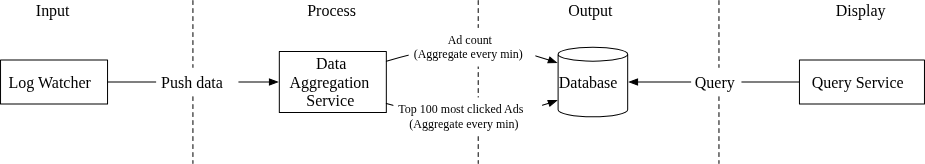
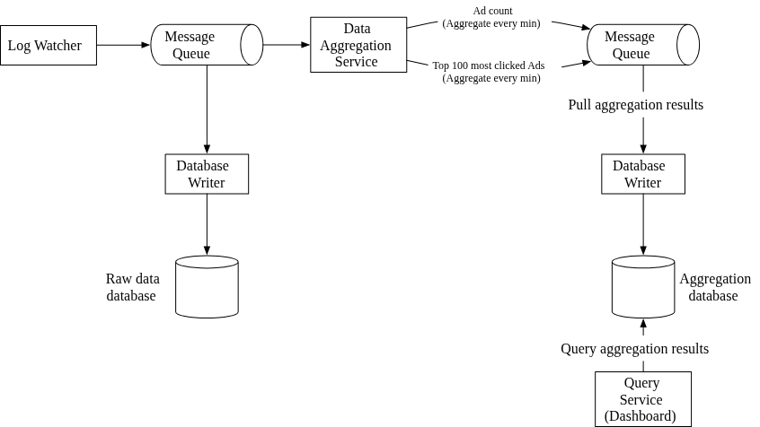
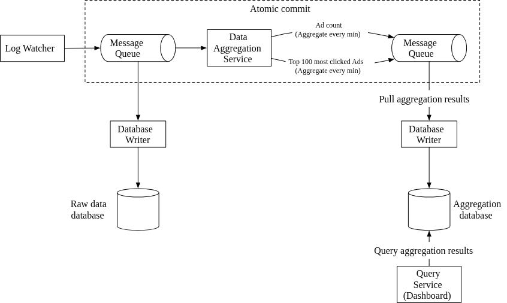

#### The Aggregation Service (MapReduce DAG)

The aggregation service handles real-time big data processing utilizing a Directed Acyclic Graph (DAG) model, conceptually identical to **MapReduce**. It breaks the system into small computing units (Map, Aggregate, Reduce nodes).

**The Nodes:**
1.  **Map Node:** Reads from MQ 1, cleans/normalizes data, and partitions it (e.g., `ad_id % N`) so events for the same ad reach the same storage/processing node.
    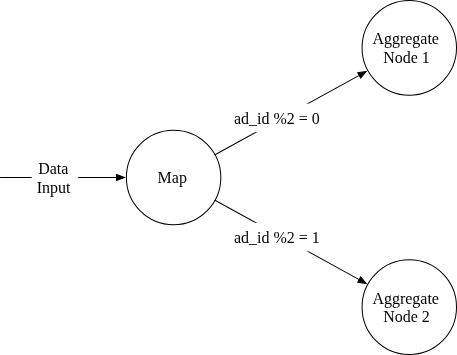
2.  **Aggregate Node:** Counts ad click events by `ad_id` in memory every minute. This is essentially the first level of "Reduce" in the Map-Reduce-Reduce paradigm.
3.  **Reduce Node:** Reduces aggregated results from all "Aggregate" nodes to a final consolidated result (e.g., merging top lists).
    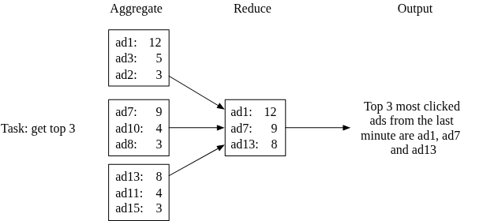

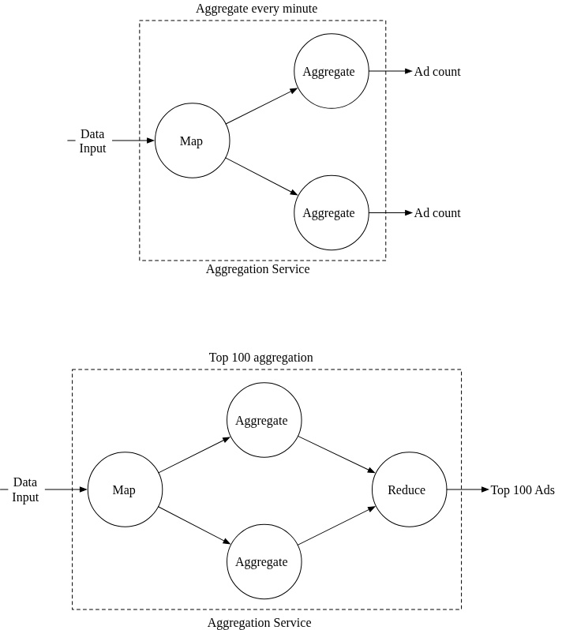

#### Main Use Cases

**Use Case 1: Aggregate the Number of Clicks**
Input events are partitioned by `ad_id` in Map nodes and then counted in in-memory Aggregation nodes every minute.
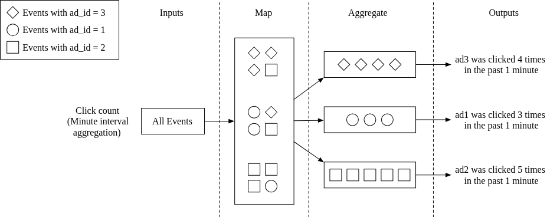

**Use Case 2: Return Top N Most Clicked Ads**
Each Aggregate node maintains a local heap data structure to find the top $N$ ads within its specific partition. A final Reduce node then gathers these local $N$ results and reduces them to the global top $N$.
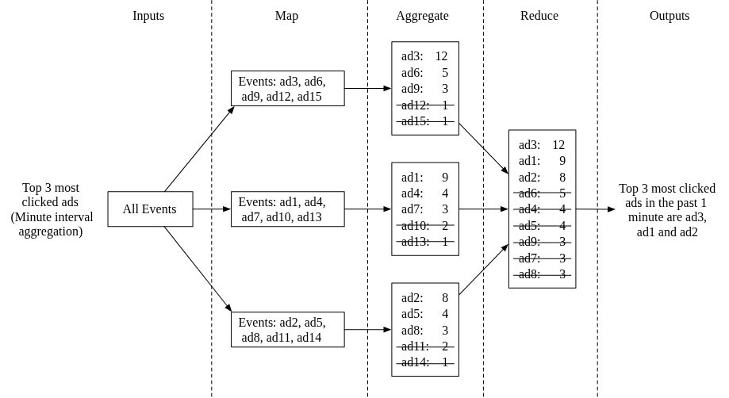

**Use Case 3: Data Filtering (Star Schema)**
To support high-speed filtering (e.g., clicks from USA only), the system uses a **Star Schema** approach. Pre-defined filtering criteria (dimensions) are pre-calculated during the aggregation process.
*   **Dimensions:** Fields like `country`, `ip`, or `user_id`.
*   **Pros:** Extremely fast read access since results are pre-calculated.
*   **Cons:** Increases the number of storage buckets/records significantly as dimensions grow.

---

### Step 3 - Design Deep Dive

#### Streaming vs Batching Architecture

An aggregation system usually runs multiple processing paths to handle both instant live data and massive historical data recalculations.

**Lambda Architecture vs. Kappa Architecture**
*   **Lambda Architecture:** Maintains two entirely separate codebases and processing paths. A streaming layer handles live traffic, while a batch layer processes historical data. It is notoriously difficult to maintain perfectly consistent logic across both paths.
*   **Kappa Architecture:** A single stream-processing engine handles *both* real-time data and continuous historical reprocessing.
*   **Design Choice:** We utilize the **Kappa Architecture**.

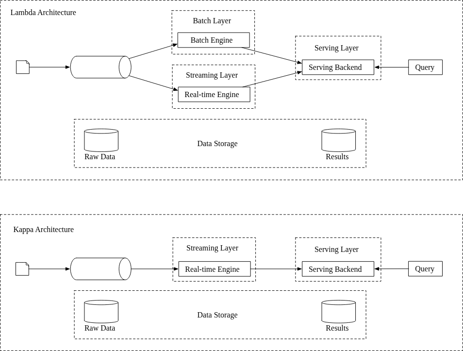

#### Data Recalculation (Historical Replay)
When a major bug corrupts the aggregated metrics, we must mathematically rebuild them from the immutable raw data. 

Because we use the Kappa Architecture, the recalculation process reuses the exact same aggregation service logic, just executing as a batched job from a different source.
1.  A dedicated recalculation service pulls logs from the raw data database.
2.  It uses the same MapReduce logic but runs on an isolated cluster so live traffic isn't impacted.
3.  The corrected metrics are pushed to the output message queue, overwriting the corrupted database rows.

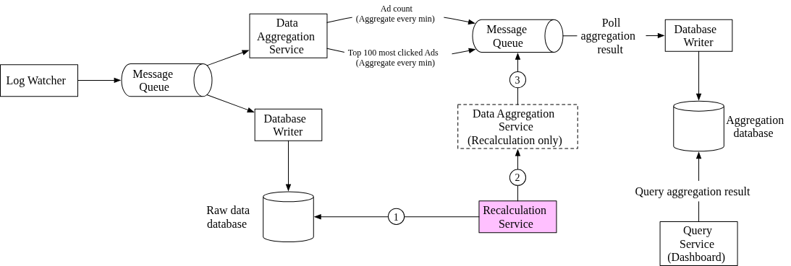

#### Event Time vs Processing Time (The Delayed Event Problem)

Calculating "when" a click happened is surprisingly complex due to network delays.

| Time Source | Description | Trade-offs |
| :--- | :--- | :--- |
| **Event Time** | Generated by the client when they actually click the ad. | Highly accurate for billing, but relies on untrusted client clocks (malicious users/wrong timezones). Subject to massive delays (e.g., user clicked offline, syncs 5 hours later). |
| **Processing Time** | Generated by the server when the event hits the aggregation service. | Highly reliable (server clocks are trusted), but highly inaccurate for correlation if network lag delays the packet by 3 minutes. |

**Verdict:** Because ad billing requires strict accountability, **Event Time** must be used. But this creates a flaw: What happens to delayed events?

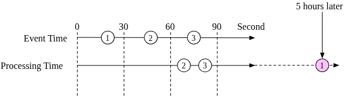
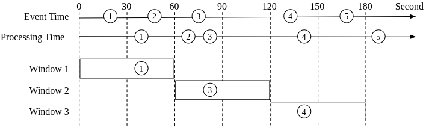

**Handling Delayed Events: The Watermark Technique**
Since we aggregate data in 1-minute blocks (tumbling windows), an event arriving 15 seconds late would ordinarily miss its window entirely.

To fix this, we apply a **Watermark**. A watermark extends the processing window artificially (e.g., waiting an extra 15 seconds after the minute closes before finalizing the bucket).
*   **Long Watermark:** Highly accurate data, but heavily increases reporting latency.
*   **Short Watermark:** Fast reporting, but drops late data, causing slight inaccuracies. 
*   *Note:* Extremely late data (e.g., 5 hours delayed) is generally dropped by the real-time pipeline and cleaned up via an end-of-day batch reconciliation job.

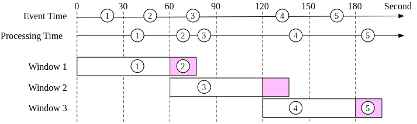

#### Aggregation Window

Based on data-intensive application design principles, there are four types of window functions. Our system heavily relies on two of them:

1.  **Tumbling Window (Fixed Window):** Time is chunked into same-length, strictly *non-overlapping* blocks. 
    *   *Usage:* Perfect for Use Case 1 (aggregating absolute click counts within a specific 1-minute interval).
    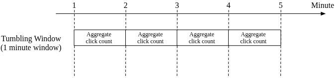

2.  **Sliding Window:** Time is grouped within a window that slides across the data stream, meaning consecutive windows will *overlap*.
    *   *Usage:* Required for Use Case 2 (continuously getting the "Top N ads from the *last M minutes*" recalculated every single minute).
    

#### Delivery Guarantees (Exactly-Once Processing)

Message queues (like Kafka) typically offer three delivery semantics: At-most once, At-least once, and Exactly-once.

Because this aggregation data controls advertiser billing, a discrepancy of just a few percent can lead to millions of dollars in inaccurate charges. Thus, standard *At-least once* processing is unacceptable. The system demands **Exactly-once delivery**.

**Data Deduplication**
Duplicates usually originate from two sources:
1.  **Client-Side:** A user resends the same event maliciously or via a glitch. This is generally ignored by the pipeline and handled by dedicated ad fraud/risk control components.
2.  **Server Outage:** The aggregator crashes while processing. 

**The Distributed Offset Problem:**
Aggregators track their progress by storing an "offset" in the upstream Kafka queue. If the aggregator processes events from offset 100 to 110, writes them downstream, but crashes *before* it can acknowledge and update the upstream offset to 110, the replacement node will consume 100 to 110 again. This creates duplicate data.
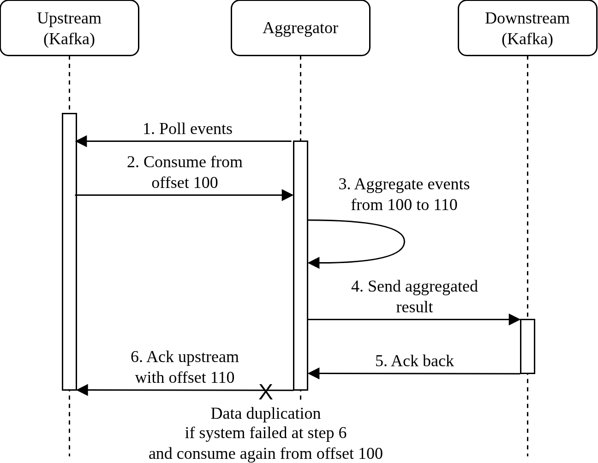

**Attempted Fix 1 (Save offset before downstream):** Save the offset in an external storage like HDFS/S3 *before* sending data downstream.
*   *Flaw:* If it saves the offset as 110, but crashes before pushing data downstream, those events are permanently lost.
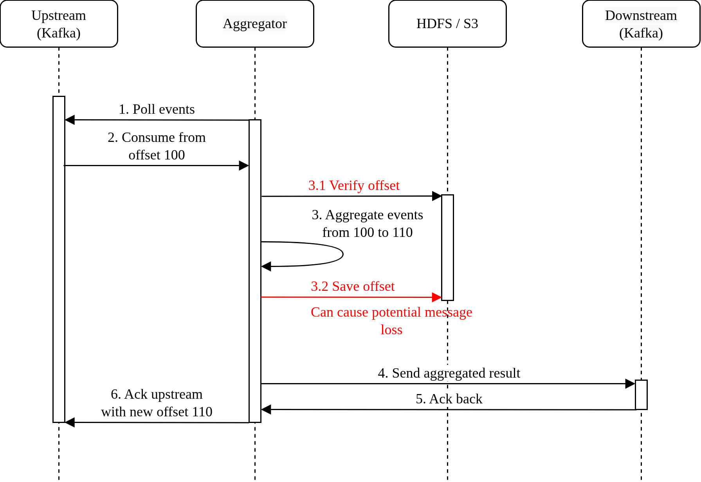

**Attempted Fix 2 (Save offset after downstream Ack):** Save the offset *after* the downstream system acknowledges receipt.
*   *Flaw:* If it crashes after the downstream Ack but before saving the offset to HDFS, the replacement node pulls the data again, recreating the duplication bug.
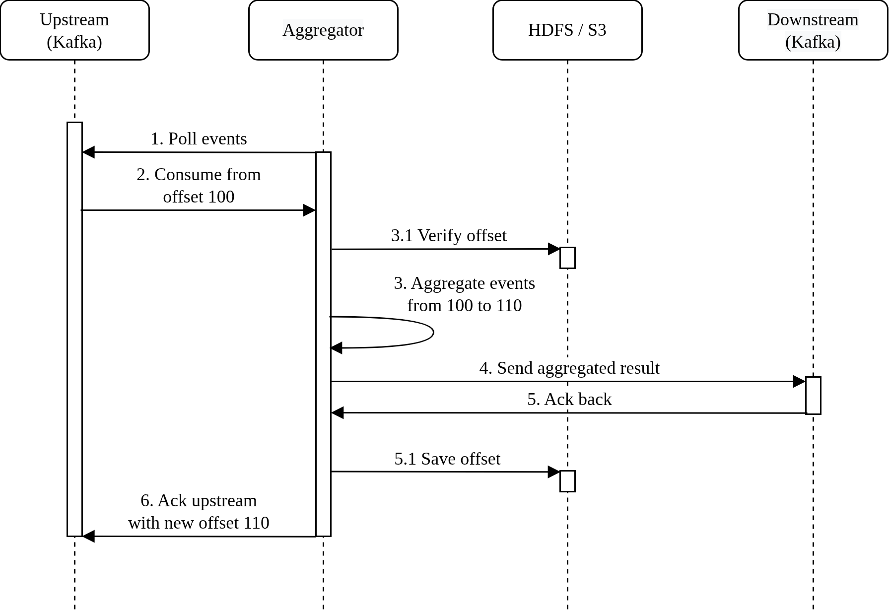

**The True Solution (Distributed Transactions):**
To achieve pure Exactly-once processing, sending the data downstream and saving the offset to HDFS must be bundled into a **Distributed Transaction**. If either the downstream send fails or the HDFS save fails, the entire transaction is rolled back, guaranteeing the data is never double-counted or lost.
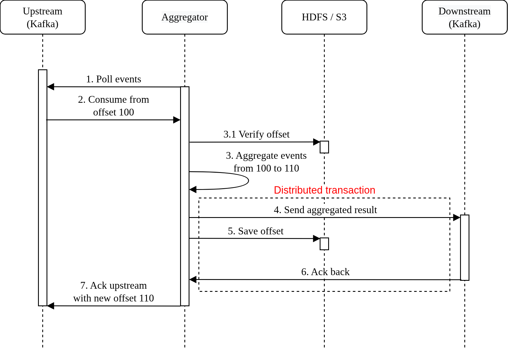

#### Scaling the System (30% YoY Growth)

Since the architecture is heavily decoupled through message queues, every layer can be scaled independently.

**1. Scaling the Message Queue (Kafka)**
*   **Consumers:** The system scales processing throughput by adding consumer nodes to a consumer group, which triggers a rebalance. Because rebalancing hundreds of nodes can stall the queue for minutes, this must be scheduled during off-peak hours.
    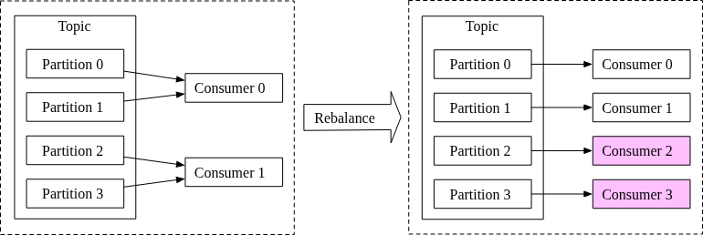
*   **Hashing Key:** Event partitioning *must* use `ad_id` as the hashing key. This guarantees that all clicks for a specific ad end up on the exact same partition/consumer, which is necessary for accurate counting.
*   **Pre-allocation:** Avoid dynamically adding partitions to a live topic, as it changes the mapping formula and break the `ad_id` hashing rule. Pre-allocate vastly more partitions than currently needed.
*   **Topic Routing:** To prevent massive singular topics, shard the topics physically by geography (`topic_north_america`) or business type.

**2. Scaling the Aggregation Service**
Scaling the MapReduce nodes can be done horizontally.
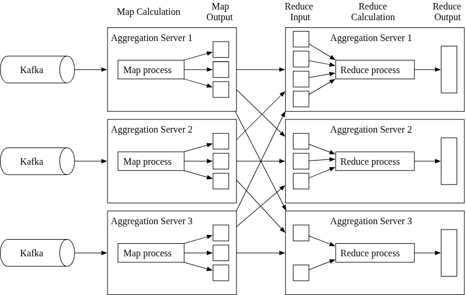

How to increase the throughput of an individual aggregation tier:
*   **Option 1 (Multi-threading):** A single aggregation node receives events for multiple `ad_id`s. It spins up separate threads internally, dedicating one thread to each `ad_id`.
    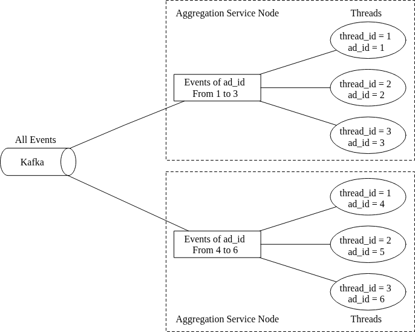
*   **Option 2 (Multi-processing / YARN):** Deploy nodes on a distributed resource provider cluster like Apache Hadoop YARN. This scales by throwing more distributed computing resources at the problem, which is the preferred industry standard over manual multi-threading.

**3. Scaling the Database (Cassandra)**
Cassandra natively handles horizontal scaling using a consistent hashing ring equipped with **Virtual Nodes**. 
*   Data is distributed around the ring. By using virtual nodes, data volume is spread remarkably evenly across physical nodes.
*   When a new node spins up, the cluster immediately and automatically rebalances the virtual nodes without requiring manual resharding.
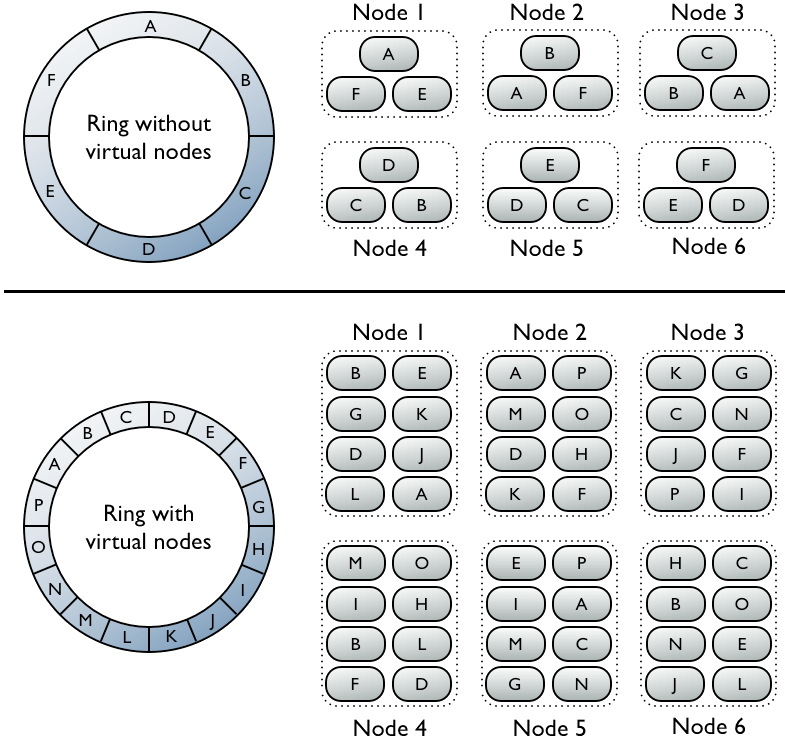

#### Handling Hotspots
In the advertising industry, massive companies run extreme ad campaigns (e.g., a Super Bowl commercial). Since the Map Node assigns traffic purely by `ad_id`, the singular Aggregation Node receiving the Super Bowl ad will drown in traffic and crash.

**Mitigation Strategy (Global-Local Aggregation):**
When a node realizes it is receiving more traffic than it can handle (e.g., gets 300 events but can only handle 100):
1.  It queries the internal Resource Manager for extra computing resources.
2.  The Resource Manager allocates 2 temporary helper nodes.
3.  The original node splits the traffic, sending 100 events to itself and 100 to each helper.
4.  It then acts as a local `Reduce` node to consolidate the math from the helpers before passing the final result downstream.
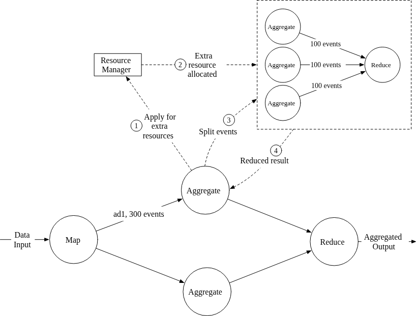

#### Fault Tolerance (Snapshots)
Because the Aggregation Nodes maintain metrics (like counting arrays and Top N heaps) entirely **in-memory**, a hard crash wipes out all progress. 

Relying purely on Kafka to replay from the beginning of the day is far too slow for real-time recovery. 
*   **The Snapshot Solution:** Nodes periodically save their "system status" to external storage. Crucially, a snapshot stores both the current *Kafka Offset* and the actual *current arrays/heaps* (like the state of the Top 3 list).
    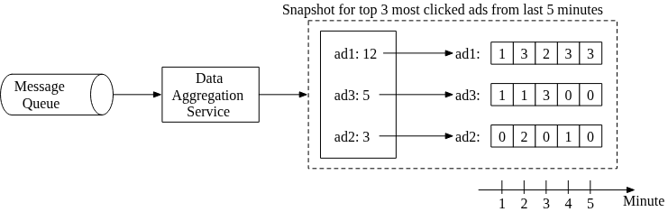
*   **Recovery:** When the primary node dies, a new node spins up, downloads the latest snapshot from storage, and then polls the upstream Kafka broker *only* for the small handful of events that arrived after the snapshot was saved.
    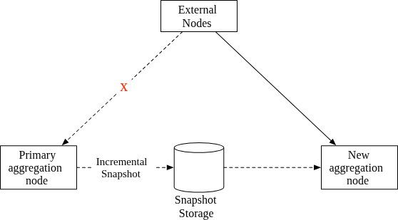

#### Data Monitoring and Correctness

Because the aggregated numbers are directly tied to revenue, the system must be strictly monitored.

**1. Continuous Monitoring**
*   **Latency:** Track the timestamp as the event moves through each stage (Queue $\rightarrow$ Map $\rightarrow$ Aggregate $\rightarrow$ Queue) to find bottlenecks.
*   **Queue Size (Records Lag):** In Kafka, monitor the "records-lag" metric. A spiking lag means the Aggregation Nodes are falling behind and need to be scaled up.
*   **System Resources:** Standard CPU, Memory, and JVM metrics.

**2. Reconciliation**
Unlike banking, the ad network has no third-party truth to compare against. Therefore, "reconciliation" means comparing the output of the fast, real-time pipeline against the output of the slow, ultra-accurate batch pipeline.
*   Every night, a batch job runs across the entire day's raw data archive, re-sorting and calculating exact totals.
*   These totals are compared to the active Aggregated database. 
*   *Note:* Even with perfect code, discrepancies will exist due to the Watermark dropping severely delayed events in the real-time pipe.

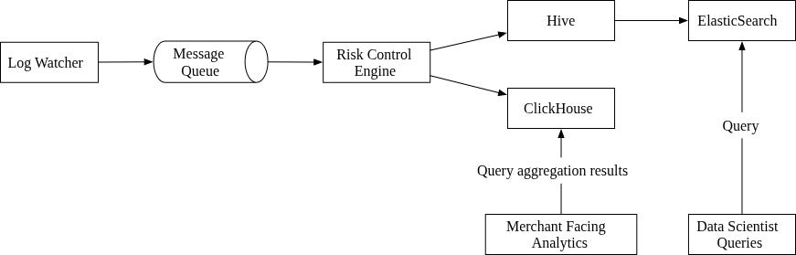

#### Alternative Design (OLAP)
In the real world, instead of writing custom MapReduce logic and using raw Cassandra, companies often rely on specialized Big Data toolchains.

*   **Raw Data Pipeline:** Events flow from Kafka into **Hive** (data warehouse), which is indexed by **ElasticSearch** for complex data scientist querying.
*   **Aggregated Analytics:** Events flow into an **OLAP database** (Online Analytical Processing) like **ClickHouse** or **Druid**. These databases natively handle high-speed stream ingestion and instant aggregation for Merchant-Facing Analytics, effectively replacing our custom Aggregation Service architecture entirely.

---

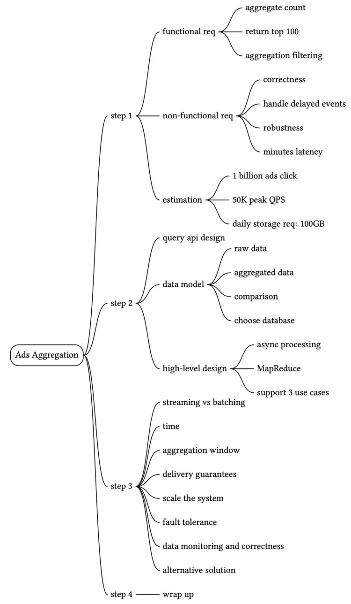

Reference Materials
[1] Clickthrough rate (CTR): Definition: https://support.google.com/google-ads/answer/2615875?hl=en

[2] Conversion rate: Definition: https://support.google.com/google-ads/answer/2684489?hl=en

[3] OLAP functions:
https://docs.oracle.com/database/121/OLAXS/olap_functions.htm#OLAXS169

[4] Display Advertising with Real-Time Bidding (RTB) and Behavioural Targeting:
https://arxiv.org/pdf/1610.03013.pdf

[5] LanguageManual ORC:
https://cwiki.apache.org/confluence/display/hive/languagemanual+orc

[6] Parquet: https://databricks.com/glossary/what-is-parquet

[7] What is avro: https://www.ibm.com/topics/avro

[8] Big Data: https://www.datakwery.com/techniques/big-data/

[9] DAG model https://en.wikipedia.org/wiki/Directed_acyclic_graph

[10] Java stream: https://docs.oracle.com/javase/8/docs/api/java/util/stream/Stream.html

[11] Understand star schema and the importance for Power BI:
https://docs.microsoft.com/en-us/power-bi/guidance/star-schema

[12] Martin Kleppmann, “Designing Data-Intensive Applications”, 2017

[13] Apache Flink: https://flink.apache.org/

[14] Lambda architecture: https://databricks.com/glossary/lambda-architecture

[15] Kappa architecture: https://hazelcast.com/glossary/kappa-architecture/

[16] Martin Kleppmann, “Stream Processing, Designing Data-Intensive Applications”, 2017

[17] End-to-end Exactly-once Aggregation Over Ad Streams:
https://www.youtube.com/watch?v=hzxytnPcAUM

[18] Ad traffic quality: https://www.google.com/ads/adtrafficquality

[19] An Overview of End-to-End Exactly-Once Processing in Apache Flink:
https://flink.apache.org/features/2018/03/01/end-to-end-exactly-once-apache-flink.html

[20] Understanding MapReduce in Hadoop: https://www.section.io/engineering-education/understanding-map-reduce-in-hadoop/

[21] Flink on Apache Yarn
https://ci.apache.org/projects/flink/flink-docs-release-1.13/docs/deployment/resource-providers/yarn/

[22] How data is distributed across a cluster (using virtual nodes):
https://docs.datastax.com/en/cassandra-oss/3.0/cassandra/architecture/archDataDistributeDistribute.html

[23] Flink performance tuning:
https://nightlies.apache.org/flink/flink-docs-master/docs/dev/table/tuning/

[24] ClickHouse: https://clickhouse.com/

[25] Druid: https://druid.apache.org/

[26] Real-Time Exactly-Once Ad Event Processing with Apache Flink, Kafka, and Pinot:
https://eng.uber.com/real-time-exactly-once-ad-event-processing/

