### Chapter: Design a Digital Wallet - Summary

This chapter covers the backend design of a **Digital Wallet**. Digital wallets allow clients to store money (e.g., deposited from a bank card) and spend it later on e-commerce sites seamlessly.

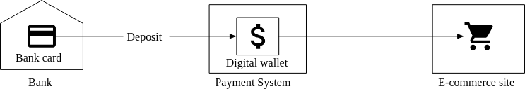

Beyond just spending money, digital wallets (like PayPal) uniquely support direct **cross-wallet balance transfers**. Compared to traditional bank-to-bank transfers, direct wallet transfers are significantly faster and typically do not charge extra fees. 

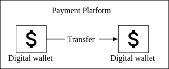

---

### 1. Requirements and Scope

In this design, we focus entirely on the backend architecture supporting cross-wallet balance transfers.

*   **Core Feature:** Support balance transfer operations between two digital wallets.
*   **Scale / TPS:** Must support **1,000,000 Transactions Per Second (TPS)**.
*   **Reliability / Availability:** At least 99.99%.
*   **Foreign Exchange:** Out of scope for this design.

#### Non-Functional & Correctness Requirements
*   **Transactional Guarantees:** Strict correctness is mandatory. Financial transactions must be backed by true database transactional guarantees (ACID).
*   **Reproducibility:** Correctness in financial systems is usually verifiable only *after* a transaction is complete (e.g., via reconciliation with bank statements). However, reconciliation only flags discrepancies, it doesn't explain *how* they occurred. Therefore, the system must be designed with **reproducibility**—the ability to reconstruct historical balances reliably by replaying data events from the very beginning.

#### Back-of-the-Envelope Estimation

When targeting 1,000,000 TPS on a transactional database, the scale requires a robust distributed system.
*   **The true TPS load:** Every single transfer operation technically requires *two* transactions: deducting from account A and depositing to account B. Therefore, supporting 1,000,000 transfers per second equates to **2,000,000 operations per second**.
*   **Node calculation:** Typical data center relational database nodes can support ~1,000 TPS. 
    *   `2,000,000 total TPS / 1,000 TPS per node = 2,000 database nodes`.
*   **Impact of Per-Node TPS:**

| Per-node TPS | Node Number needed (for 2M operations) |
| :--- | :--- |
| 100 | 20,000 |
| 1,000 | 2,000 |
| 10,000 | 200 |

*   **Design Goal:** The more transactions a single node can efficiently process, the exponentially fewer nodes required (resulting in massive hardware cost savings). Therefore, a key architectural focus is to optimize the exact mechanism used to perform single-node transactions, maximizing **per-node TPS**.

#### API Design

Following standard RESTful conventions, the focus of this design interview requires only one primary endpoint.

*   `POST /v1/wallet/balance_transfer`
    *   **Description:** Transfers a specified balance from one digital wallet to another.
    *   **Request Parameters:**
        *   `from_account` (string): The debit account.
        *   `to_account` (string): The credit account.
        *   `amount` (string): The amount of money to transfer.
        *   `currency` (string): The currency type (e.g., ISO 4217 format).
        *   `transaction_id` (uuid): A unique ID used strictly for deduplication (idempotency).
    *   **Sample Response Body:**
        ```json
        {
          "Status": "success",
          "Transaction_id": "01589980-2664-11ec-9621-0242ac130002"
        }
        ```
    *   *Design Note on the `amount` field:* Storing and transmitting financial amounts as a `string` (rather than a `double` or `float`) avoids dangerous precision loss and floating-point errors inherent to most programming languages. While many systems *do* use `double` out of convenience, it inherently carries precision-loss risks that are catastrophic in financial environments.

#### In-Memory Sharding Solution (Initial Concept)

To scale, a simple architecture involves putting user balances into an in-memory key-value store mapping `<user, balance>`.

*   **Redis Cluster:** A single Redis node cannot handle 1,000,000 TPS. Therefore, the balances must be evenly distributed (partitioned/sharded) across a cluster of multiple Redis nodes.
*   **Routing Logic:** The cluster determines the destination partition by calculating the hash of the user account ID and taking the modulo of the partition count (e.g., `accountID.hashCode() % partitionNumber`).
*   **Zookeeper:** Used as highly available centralized configuration storage to hold the logical partition count and physical addresses of all Redis nodes.

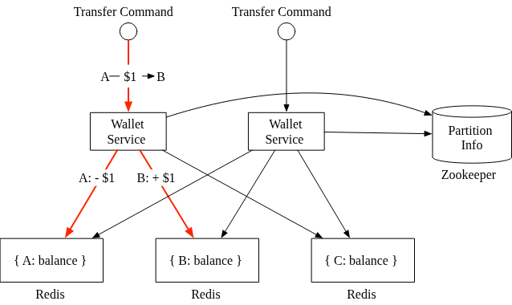

*   **Stateless Wallet Service:** A fleet of stateless wallet services processes the transfer commands. 
    1.  Receives the command (User A -> User B).
    2.  Validates the command.
    3.  Queries Zookeeper for partition routing info.
    4.  Updates the balances across the specific Redis nodes storing User A's and User B's respective data.

**Fatal Flaw: Distributed Transaction Failure**

While extremely fast, this purely in-memory partitioned architecture **fails the correctness requirement**. 

Because User A and User B will almost certainly reside on different Redis nodes, the Wallet Service must push two separate update commands over the network. There is no atomic guarantee that both updates will succeed. If the wallet service crashes right after deducting money from User A, but before depositing the money to User B, it results in an incomplete transfer and lost funds. 

To solve this, both database updates must be strictly bounded within a single atomic distributed transaction.

#### Distributed Transactions

**1. Database Sharding (Relational)**
The first step to solving the atomic transaction issue is to replace the purely in-memory Redis nodes with transactional **Relational Database** nodes, while maintaining the Zookeeper partition sharding.

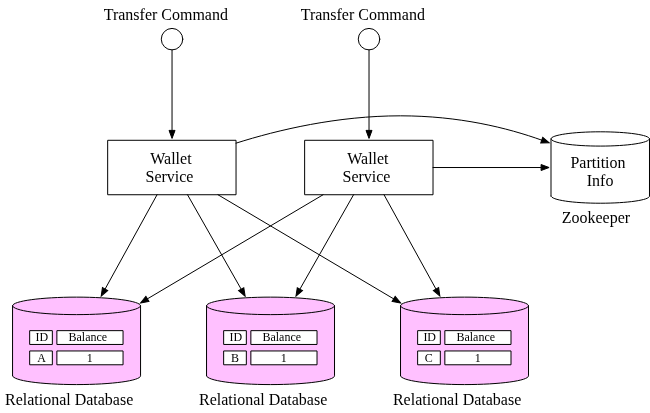

While standard relational databases provide ACID guarantees locally on a single node, this alone does not solve the distributed problem. If a transfer touches Account A (Database 1) and Account B (Database 2), the Wallet Service must still issue two distinct updates over the network. If the service crashes midway, the accounts remain unsynchronized. We require a **Distributed Transaction**.

**2. Distributed Transaction: Two-Phase Commit (2PC)**

The most common low-level solution for distributed transactions implemented by databases themselves is the **Two-Phase Commit (2PC)** algorithm (often coordinated via the X/Open XA standard). 

As the name implies, it breaks the transaction into two phases, utilizing the Wallet Service as the central **Coordinator**:

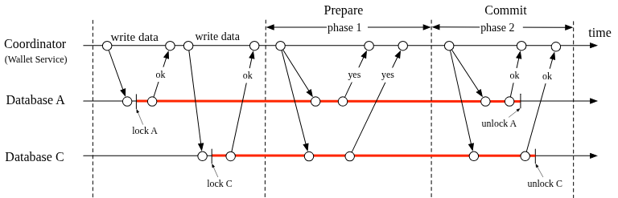

*   **Phase 1 (Prepare):** The coordinator asks all participating databases to *prepare* the transaction. The databases lock the required rows and reply with a "yes" (ready) or "no" (cannot proceed).
*   **Phase 2 (Commit or Abort):** The coordinator collects the replies.
    *   If *all* databases reply “yes”, the coordinator commands all databases to truly **commit** the transaction.
    *   If *any* database replies “no”, the coordinator commands all databases to **abort** and rollback.

**Drawbacks of 2PC:**
1.  **Poor Performance:** Databases hold locks on the data rows for the entire duration of the wait time (from Phase 1 until they receive the Phase 2 command over the network). This blocks other operations and cripples throughput.
2.  **Single Point of Failure (SPOF):** The Coordinator is a SPOF. If the Coordinator crashes mid-transaction (e.g., after Phase 1 but before sending the Phase 2 commit/abort signal), the databases are left hanging indefinitely holding locks.

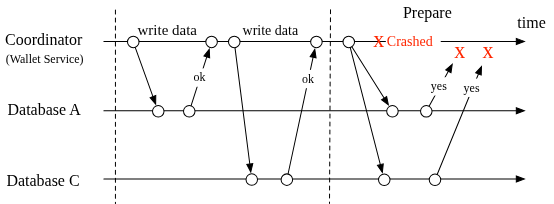

**3. Distributed Transaction: Try-Confirm/Cancel (TC/C)**

TC/C is a modern **compensating transaction** pattern. Unlike 2PC, where both phases are wrapped tightly in a single locked transaction, TC/C executes each phase as a completely separate, independent local database transaction.

It consists of two distinct phases:
*   **Phase 1 (Try):** The coordinator asks all participating databases to locally reserve the necessary resources.
*   **Phase 2 (Confirm or Cancel):** The coordinator gathers replies.
    *   **Confirm:** If all reply "yes", the coordinator commands a standard confirm execution.
    *   **Cancel:** If *any* reply "no", the coordinator issues explicitly crafted **Cancel** transactions (compensating transactions) to reverse the work done in the Try phase.

**TC/C Example Walkthrough ($1 transfer from A to C)**

| Phase | Operation | Account A | Account C |
| :--- | :--- | :--- | :--- |
| **1** | **Try** | Balance change: -$1 | Do nothing (NOP) |
| **2** | **Confirm** | Do nothing (NOP) | Balance change: +$1 |
| *(alt)* | **Cancel** | Balance change: +$1 | Do nothing (NOP) |

**First Phase: Try**
The Wallet Service (Coordinator) sends the transaction demands.
*   Database A starts a local transaction lowering the balance by $1.
*   Database C is given a NOP (No Operation), yielding a success message immediately with no lock holding.

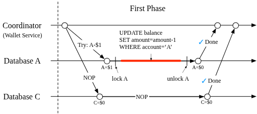

**Second Phase: Confirm (Happy Path)**
If Phase 1 largely succeeded, the Coordinator fires Phase 2.
*   Database A receives a NOP (because its funds were already successfully deducted during Phase 1).
*   Database C receives the actual command to increment its balance by $1.

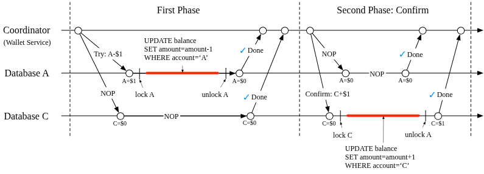

**Second Phase: Cancel (Failure Path)**
If the `Try` phase fails on C's end (e.g., C's account is legally frozen), the transaction must be cleaned up. Because Database A *already completed* its local transaction in Phase 1, the Coordinator cannot "rollback" the database. It must issue a brand new **compensating transaction** to A.
*   Database A receives a new operation adding +$1 back to its balance.
*   Database C receives a NOP.

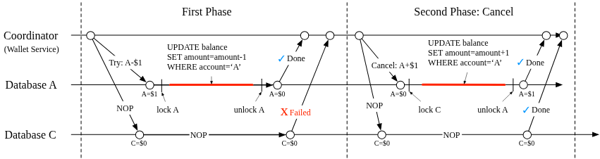

#### Comparison Between 2PC and TC/C

TC/C is a high-level solution implemented in the **business logic** (application layer), making it database-agnostic. 2PC is a low-level algorithm reliant on the databases themselves.

| Feature | 2PC (Two-Phase Commit) | TC/C (Try-Confirm/Cancel) |
| :--- | :--- | :--- |
| **First Phase** | Local transactions are *not done* (locks are held). | All local transactions are *completed* (either committed or canceled). |
| **Second Phase: Success** | Commit all local transactions. | Execute new local transactions if needed. |
| **Second Phase: Fail** | Cancel/Abort all local transactions. | Reverse the side effects of the committed transactions ("undo" / compensating transaction). |

#### Phase Status Table (Recovering from Coordinator Crashes)

What happens if the Wallet Service (Coordinator) restarts in the middle of a TC/C workflow? In a purely stateless design, previous operation history is lost and the system wouldn't know how to recover.

To fix this, the system must store the progress of the TC/C operation in a transactional database table. 
*   **Where to store it?** The phase status table is typically stored in the same database shard that contains the wallet account from which money is being *deducted*.
*   **What it stores:**
    *   ID and content of the distributed transaction.
    *   Status of the Try phase for every database (e.g., "not sent", "has been sent", "response received").
    *   Name of the second phase (Confirm vs. Cancel).
    *   Status of the second phase.
    *   An out-of-order flag.

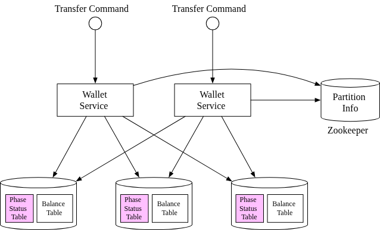

#### The Unbalanced State in TC/C

A characteristic of TC/C is that between the Try phase and the Confirm phase, the system exists in an **unbalanced state**.
*   After the Try phase deducts $1 from Account A and issues a NOP to Account C, $1 mathematically "vanishes" from the system's total balance. This temporarily violates strict accounting rules.
*   The transactional guarantee in TC/C is maintained by the application layer. Data discrepancies exist in plain sight during execution, but the application is designed to reliably "heal" this state during the subsequent Confirm Phase (which adds the $1 to Account C).

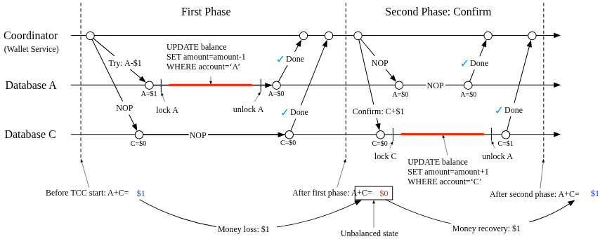

#### Valid Operation Orders for Try Phase

During the Try phase, developers mathematically have three choices. Only one of them is safely valid for system integrity:

| Choice | Account A (Sender) | Account C (Receiver) | Validity | Reason |
| :--- | :--- | :--- | :--- | :--- |
| **Choice 1** | -$1 | NOP | **Valid** | Debiting the sender first safely secures the funds. |
| **Choice 2** | NOP | +$1 | **Invalid** | If the Try fails on A, we must Cancel. But the +$1 on C might have *already been spent* and transferred away concurrently. |
| **Choice 3** | -$1 | +$1 | **Invalid** | Doing both concurrently introduces race conditions and massive complexity if one localized transaction fails while the other succeeds. |

**Conclusion:** The only valid flow is to completely secure the debit (sender) during Phase 1 (`Try`), and execute the credit (receiver) during Phase 2 (`Confirm`).

#### Handling Out-of-Order Execution

A complex side effect of the TC/C distributed model is the risk of **out-of-order execution** due to network latency. 

**The Scenario:**
Consider the early example transferring $1 from Account A to Account C. 
1.  The Try phase correctly begins and hits Account A. Account A fails for some reason and returns an error to the Coordinator.
2.  The Coordinator instantly fires Phase 2 (Cancel) to both Account A and Account C to clean up.
3.  Due to network jitter, the database for Account C receives the `Cancel` instruction *before* it has even received the initial `Try` instruction (which is lagging).

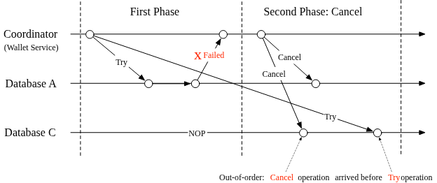

When an out-of-order Cancel instruction arrives at a database node with nothing yet to cancel, the system handles it gracefully using the `out-of-order flag`:
1.  **Flagging:** The database simply accepts the Cancel instruction, does nothing to the balance, but records a flag inside its Phase Status Table indicating: *“I've received a Cancel operation, but I am still waiting to see the Try operation.”*
2.  **Dropping the Lagging Try:** When the extremely-delayed Try operation eventually arrives hours or milliseconds later, the database checks the status table, sees the out-of-order flag, and safely rejects/drops the Try operation so it doesn't accidentally execute.

**4. Distributed Transaction: Saga**

Saga goes hand-in-hand with microservice architectures. Unlike TC/C, Saga enforces **linear order execution**.

*   All operations are sequenced. Executing one operation triggers the next.
*   If an operation fails, the process triggers a cascade of reverse operations—**compensating transactions**—working backwards to the first step.
*   If a workflow has *n* operations, developers must natively prepare *2n* operations (*n* normal, *n* compensating).

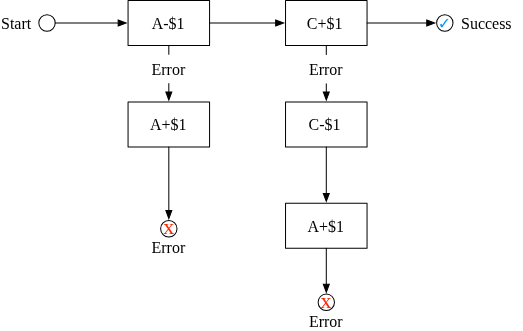

**Saga Coordination Models:**
1.  **Choreography:** Fully decentralized. Services subscribe to events asynchronously and react. Hard to scale and manage because every service must maintain complex local state machines.
2.  **Orchestration (Preferred):** A central coordinator instructs all services what to do in the correct order. Highly preferred for digital wallets because it groups complexity neatly in one place.

#### Comparison Between TC/C and Saga

Both are application-level distributed transaction workflows. 

| Feature | TC/C | Saga |
| :--- | :--- | :--- |
| **Compensating Action** | In the Cancel phase | In the Rollback phase |
| **Central Coordination** | Yes | Yes (in Orchestration mode) |
| **Execution Order** | Any | strictly **Linear** |
| **Parallel Execution?** | **Yes** (operations can fire simultaneously) | No (linear step-by-step) |
| **Visible Inconsistencies?** | Yes | Yes |

*   **When to use Saga:** When following standard microservice design trends and latency via sequential execution isn't a strict bottleneck.
*   **When to use TC/C:** When the system is highly latency-sensitive. Because TC/C supports parallel execution during the Try/Confirm phases, it is much faster for complex transfers hitting many services at once.

#### The Need for Auditing and Traceability

While TC/C or Saga solve the database transaction problem, they do not solve human/application errors (e.g., the application itself logic tells the database to transfer the wrong amount). To trace the root cause of these issues, the system requires an immutable **Auditing** log of all account operations. 

#### Event Sourcing

Auditors frequently ask three challenging questions:
1.  Do we know the precise account balance at any historical given time?
2.  How do we *mathematically prove* the historical and current balances are correct?
3.  How do we prove the system logic is correct even after a recent code change?

The architectural design philosophy that systematically resolves these questions is **Event Sourcing** (a technique native to *Domain-Driven Design (DDD)*).

Event Sourcing relies on four foundational concepts:

**1. Command**
A command is an *intention* from the outside world (e.g., "Transfer $1 from A to C").
*   Because it is only an intention, it can be invalid (e.g., A doesn't have $1).
*   Commands are placed into a strict FIFO queue to guarantee ordered execution.
*   *Note:* The generation of a command can involve I/O or randomness.

**2. Event**
An event is a command that has passed validation and been fulfilled. It is a **deterministic historical fact**.
*   **Past Tense:** Because they are facts, events are always named in the past tense (e.g., *"Transferred $1 from A to C"*).
*   **Deterministic:** Unlike Commands, Events contain zero randomness and no external I/O.
*   *1-to-N:* A single command can generate zero events (if it fails validation) or multiple events.
*   Events are also stored immutably in a FIFO queue.

**3. State**
State is the actual data that gets mutated when an event is applied. In the wallet system, the state is the map of all client account balances.

**4. State Machine**
The State Machine is the deterministic engine driving Event Sourcing. It serves two functions:
1.  Validate commands and generate the resulting Events.
2.  Apply the resulting Events to update the State.
*   *Rule:* The state machine must **never** contain randomness or I/O. When applying an event to a given state, it must mathematically guarantee the exact same resulting state every single time it runs.

**Visualizing Event Sourcing**

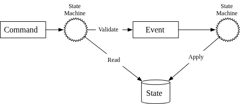
*Figure 14: The static view. The State Machine reads the state to validate the command, outputs an event, and then applies the event to mutate the State.*

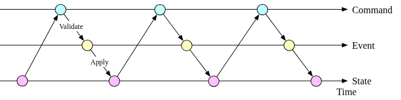
*Figure 15: The dynamic view across time. A continuous flow of Commands validates into Events, which systematically mutates State over time.*

#### Wallet Service Example (Applying Event Sourcing)

To implement this logic in the digital wallet service, we rely on distributed tools like **Kafka** and relational databases.

**The Command Queue**
When a balance transfer request comes in, it acts as a Command. It is immediately appended to a FIFO (First-In, First-Out) message queue. A popular industry choice for this is **Kafka**.

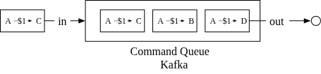

**The State Machine Workflow**
Assuming the actual State (account balances) is stored in a relational database, the State Machine executes a strict 5-step loop for every incoming command:

1.  **Read Command:** Actively poll and pull the next unvalidated command from the Kafka Command Queue.
2.  **Read State:** Read the current account balances from the relational database.
3.  **Validate & Emit:** Check if the intention is valid (e.g., *Does the sender have sufficient balance?*). If valid, generate the deterministic resultant events (e.g., “A:-$1” and “C:+$1”) and place them into the Event Queue. 
4.  **Read Event:** The secondary function of the state machine reads the next chronological Event from the Event Queue.
5.  **Apply Event:** The state machine applies the event by mathematically updating the exact balance back into the relational database.

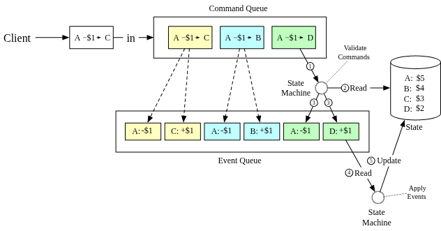

#### Reproducibility

The most powerful advantage of Event Sourcing over other architectures is **Reproducibility**. 

In standard distributed transaction designs, only the *resulting state* (the final balance) is persisted. Historical balance information is permanently overwritten and lost with each update. With Event Sourcing, **no state is ever permanently stored** — only the immutable, ordered sequence of events. The database merely reflects the *current view* derived from replaying all events.

Because:
*   The **event list is immutable** (append-only, never changed), and
*   The **state machine is deterministic** (same input always yields same output),

You can always replay the entire event history and be mathematically guaranteed to reproduce the exact same sequence of historical states.

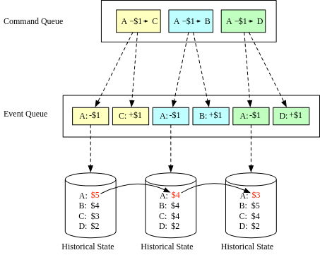

**Answering the Auditor's Questions:**

| Auditor Question | Answer via Reproducibility |
| :--- | :--- |
| *Do we know the account balance at any given time?* | Replay all events from the start up to that specific point in time. |
| *How do we know historical balances are correct?* | Recalculate (replay) the balance independently from the raw event list and verify it matches. |
| *How do we prove system logic is correct after a code change?* | Run both the old code version and new code version against the same event list and verify the outputs are identical. |

Because of this audit capability, **Event Sourcing is the de facto solution** for wallet services.

---

#### Command-Query Responsibility Segregation (CQRS)

Event Sourcing solves writes. But how does a client *read* their balance? 

Rather than exposing the internal state directly, Event Sourcing **publishes all events externally**. The outside world rebuilds any customized view of state they need. This pattern is called **CQRS**.

*   **Write Path:** A single authoritative state machine handles all validated command-to-event processing and updates the canonical state.
*   **Read Path:** Multiple independent **read-only state machines** consume from the same event queue and build specialized query-optimized views (e.g., current balance, balance at a specific historical point, double-charge investigation reports).
*   **Consistency:** Read-only state machines lag slightly behind the write path but always eventually catch up. The architecture is **eventually consistent**.

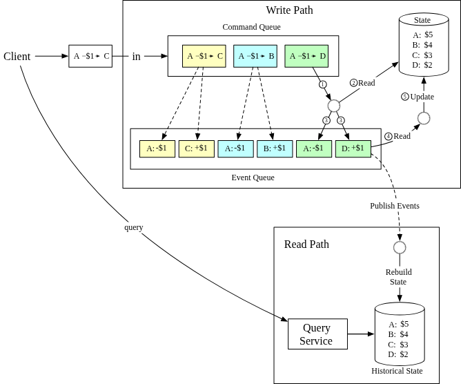

**Key design insight:** By keeping read and write concerns fully separate, the system achieves high scalability on the query side without burdening the write path, while maintaining a single immutable source of truth in the Event Queue.

> **Next Challenge from Interviewer:** The current event sourcing design processes one event at a time and communicates with several external systems. Can we make it faster?

### Step 3 - Design Deep Dive

In this section, we focus on techniques for achieving high performance, reliability, and scalability for the digital wallet system.

#### High-performance event sourcing

While the initial design used Kafka, further optimizations can be made to handle extreme throughput (1,000,000 TPS).

**1. File-based command and event list**
*   **Local Disk Persistence:** Instead of saving commands and events to a remote store like Kafka (which incurs network transit time), they are saved to a local disk.
*   **Sequential Writes:** The event list is an append-only data structure. Sequential disk access is significantly faster than random access, potentially rivaling or exceeding random memory access speeds.
*   **Memory Caching:** Recent commands and events are cached in memory immediately after persistence to avoid reloading them from the disk.

**2. mmap Optimization**
The `mmap` technique is used to implement these optimizations. It maps a disk file into memory as an array, allowing the operating system to:
*   Cache frequently accessed file sections in memory.
*   Perform extremely fast reads and writes for append-only operations, as data is essentially maintained in memory.

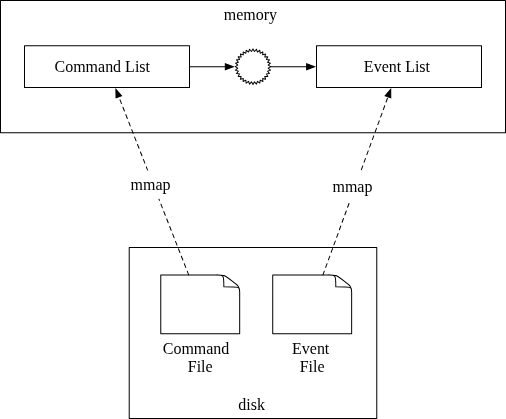

**3. File-based State**
The state (balance information) can also be optimized by moving it from a remote stand-alone server (which requires network access) to a local disk-based data store.
*   **Options:** SQLite (file-based relational database) or **RocksDB** (file-based key-value store).
*   **RocksDB Selection:** RocksDB is typically preferred because it uses a **log-structured merge-tree (LSM)**, making it highly optimized for write operations. To maintain read performance, recent data is cached in memory.
*   **Benefits:** By keeping the command, event, and state files on the local disk, we eliminate network transit time for all three core components.

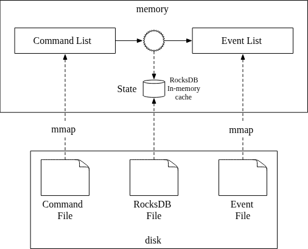

**4. Snapshot**
To accelerate the reproducibility process, the state machine periodically saves its current state to an immutable snapshot file.
*   **Faster Recovery:** Once a snapshot exists, the state machine no longer has to replay every single event from the beginning of time. Instead, it can load the latest snapshot and resume processing only the events that occurred *after* that snapshot was taken.
*   **Audit Support:** Financial teams often require a snapshot (e.g., at midnight) for daily transaction verification.
*   **Storage:** Snapshots are typically large binary files stored in an object storage solution like **HDFS**.

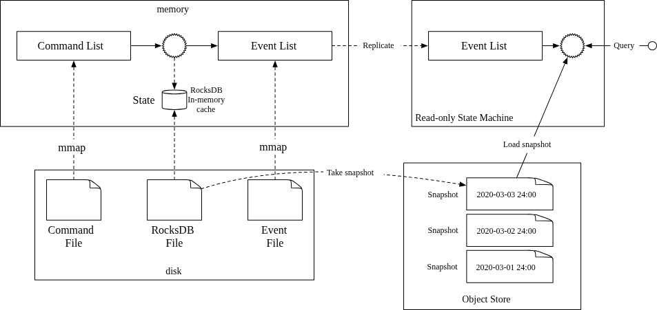

#### High-Reliability Design

The shift from remote Kafka/database nodes to a local file-based solution significantly increases performance but introduces a new problem: **a stateful server is now a single point of failure.** If the local storage node fails, the data could be lost.

> **Next Challenge:** How can we improve the reliability of this stateful, file-based system?

#### Reliability Analysis

The reliability of the system is primarily defined by the **reliability of its data**, as computation results can always be recovered by rerunning the same code on another node if the data is durable.

Our system maintains four types of data:
1.  **File-based commands**
2.  **File-based events**
3.  **File-based state**
4.  **State snapshots**

**Data Reliability Breakdown:**
*   **State & Snapshots:** These can always be regenerated by replaying the **event list**. Thus, ensuring the event list is reliable implicitly secures the state and snapshots.
*   **Commands:** While events are generated from commands, commands alone cannot guarantee reproducibility. Event generation may involve **non-deterministic factors** (e.g., random numbers, external I/O). Therefore, replaying a command might not yield identical events.
*   **Events:** Events represent confirmed, immutable historical facts (e.g., "A's balance was changed"). They are the definitive source used to rebuild the state.

**Conclusion:** The **Event data** is the only data type that requires a high-reliability guarantee to ensure system integrity.

#### Consensus-Based Replication

To achieve high reliability and prevent data loss, the event list must be replicated across multiple nodes. The replication process must guarantee that:
1.  **No data loss** occurs.
2.  **Relative order** of data remains identical across all nodes.

To achieve this, **Consensus algorithms** like **Raft** are used. 

**Raft Overview:**
*   **Majority Rule:** The system remains operational and consistent as long as more than half (a majority) of the nodes are online.
    *   3-node cluster: can tolerate 1 failure.
    *   5-node cluster: can tolerate 2 failures.
*   **Roles:** Nodes alternate between three roles: **Leader**, **Candidate**, and **Follower**.
*   **Leader:** Only one leader exists at a time, responsible for receiving external commands and replicating the data reliably across the cluster.


#### Reliable Solution with Raft

By combining file-based event sourcing with the Raft consensus algorithm, we eliminate individual single points of failure. This architecture uses a cluster of event sourcing nodes (e.g., a 3-node cluster).

**How it Works:**
*   **Leader Operations:** The leader node accepts incoming commands, converts them into events, appends them to its local event list, and uses Raft to replicate them to the followers.
*   **Follower Operations:** Followers sync their event lists with the leader. All nodes (including followers) independently process the same event list to maintain an identical state.
*   **Safety Guarantee:** Raft ensures identical event lists across nodes, and deterministic event sourcing ensures identical states generated from those lists.

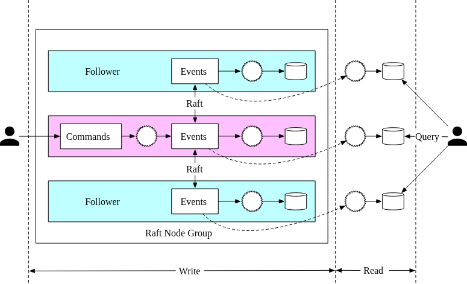

**Failure Handling:**
*   **Leader Crash:** Raft automatically elects a new leader. Clients might timeout or see errors and must resend original commands to the new leader.
*   **Follower Crash:** Raft retries replication indefinitely until the follower recovers or is replaced.

> **Next Challenge:** While reliable, a single leader-based cluster cannot handle 1,000,000 TPS. How can we make this system **scalable**?

#### Distributed Event Sourcing

To overcome the latency and capacity limitations of a single Raft group, we explore further architectural enhancements.

**1. Pull vs. Push Models for Result Notification**
In a CQRS design, clients need to know when their transaction has been processed. Three models are common:

*   **Naive Pull Model:** External users periodically poll the read-only state machine for status. 
    *   *Cons:* Not real-time, high polling frequencies can overload the service.
    
    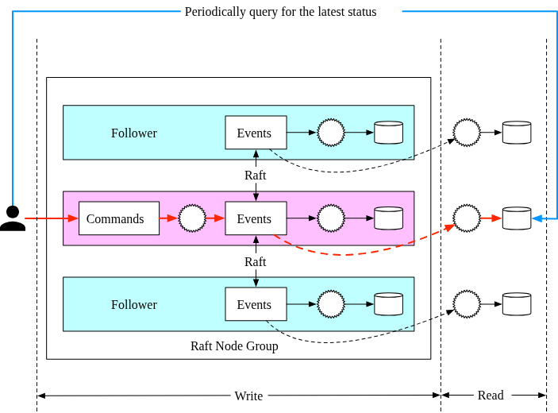

*   **Pull Model with Reverse Proxy:** A reverse proxy is introduced to handle the command and then take over the periodic polling on behalf of the client.
    *   *Pros:* Simplifies client logic.
    *   *Cons:* Still not truly real-time.
    
    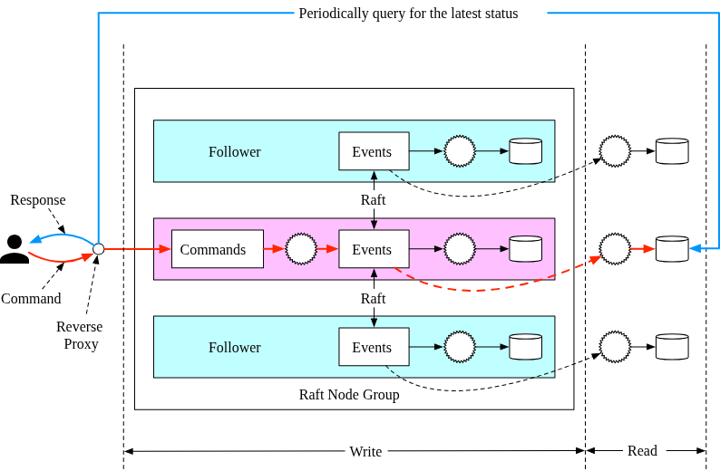

*   **Push Model (Real-Time):** The read-only state machine is modified to push the execution status back to the reverse proxy as soon as the event is received.
    *   *Pros:* Provides a real-time, low-latency response to the user.
    
    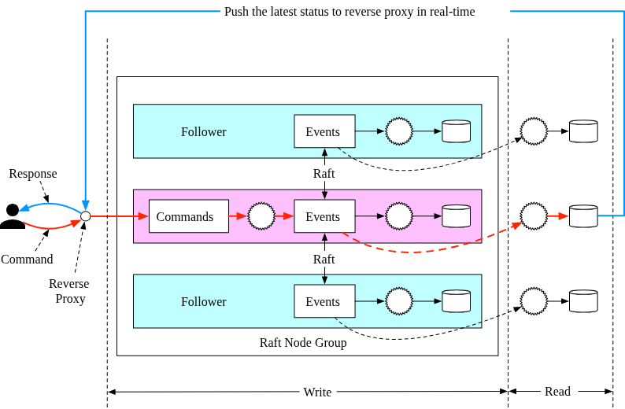

**2. Sharding and Distributed Transactions**
Once each Raft node group operates synchronously, the system can scale by partitioning the data (e.g., by hashing keys) and using a distributed transaction model like **TC/C** or **Saga** to coordinate across partitions.

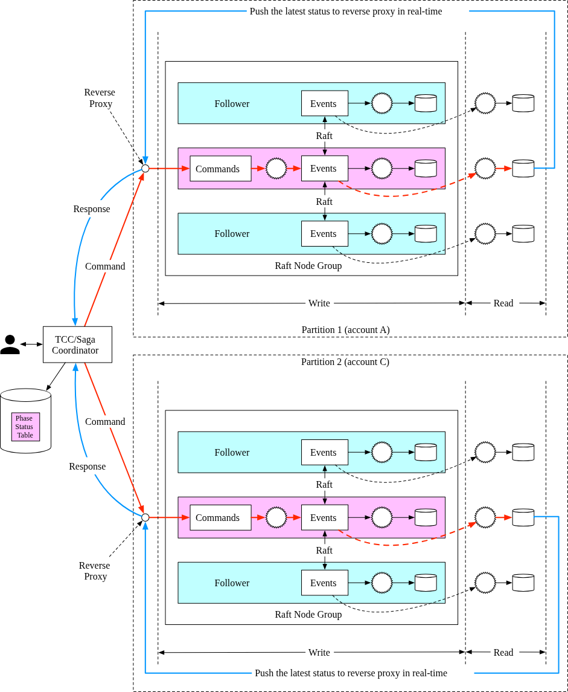

#### Final Design: Saga Workflow Walkthrough
This final architecture leverages a **Saga Coordinator** to manage multi-partition transfers (e.g., moving $1 from Account A in Partition 1 to Account C in Partition 2).

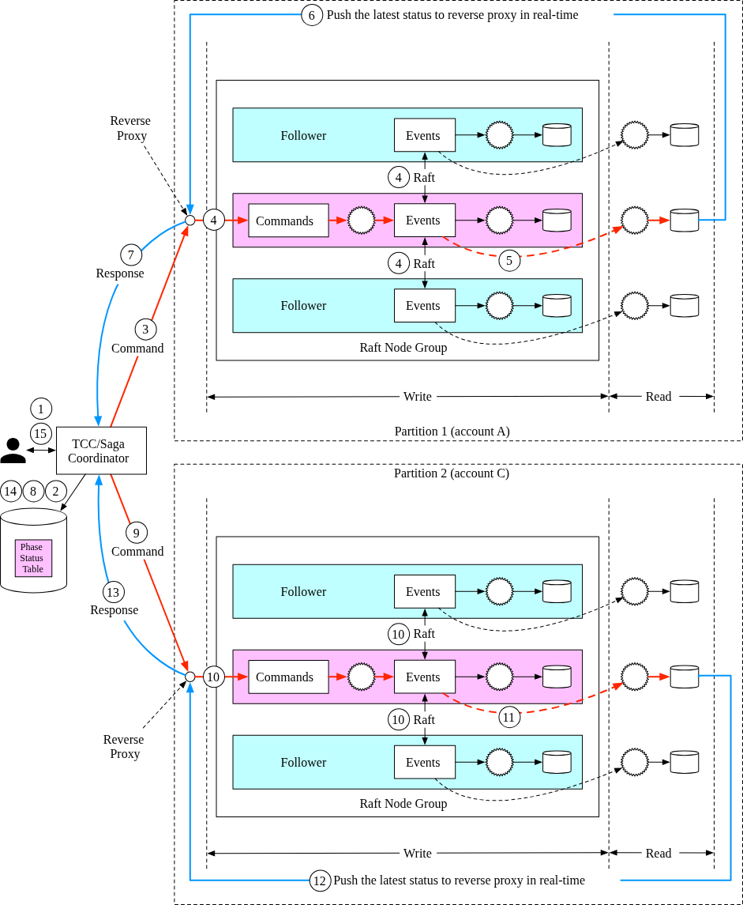

**Happy Path Sequence (A-$1 to C+$1):**
1.  **Distributed Transaction Start:** User A sends a distributed transaction request (A-$1, C+$1) to the **Saga Coordinator**.
2.  **Phase Logging:** Saga coordinator creates a record in the **phase status table** to track the transaction's lifecycle.
3.  **Initiate Partition 1:** Saga coordinator examines the operations and sends the first command (A-$1) to **Partition 1**.
4.  **Partition 1 Command Handling:** Partition 1’s Raft leader receives the command, stores it, validates it, and converts it into an event.
5.  **Synchronization:** The Raft consensus algorithm synchronizes the event data across all nodes in Partition 1.
6.  **Event Execution:** After synchronization, the event (deducting $1 from account A) is executed.
7.  **Read Path Update:** Partition 1’s event sourcing framework synchronizes the data to the read path (CQRS).
8.  **Status Push:** Partition 1’s read path reconstructs the execution status and pushes it back to the Saga coordinator.
9.  **Receive Partition 1 Success:** Saga coordinator receives the success status from Partition 1.
10. **Log Partition 1 Progress:** Saga coordinator records the successful completion of the first operation in the phase status table.
11. **Initiate Partition 2:** Coordinator proceeds to the second operation (C+$1), sending it as a command to **Partition 2**.
12. **Partition 2 Processing:** Partition 2’s Raft leader validates and converts the command into an event, synchronizing it across its cluster.
13. **Partition 2 Update:** After synchronization, Partition 2’s read path is updated via CQRS.
14. **Final Status Push:** Partition 2’s read path pushes the success status back to the Saga coordinator.
15. **Transaction Complete:** Saga coordinator receives the final success status, records it in the phase status table, and responds to the original caller.

**Wrap Up**

In this chapter, we designed a wallet service that is capable of processing over 1 million payment commands per second. After a back-of-the-envelope estimation, we concluded that a few thousand nodes are required to support such a load.

In the first design, a solution using in-memory key-value stores like Redis is proposed. The problem with this design is that data isn't durable.

In the second design, the in-memory cache is replaced by transactional databases. To support multiple nodes, different transactional protocols such as 2PC, TC/C, and Saga are proposed. The main issue with transaction-based solutions is that we cannot conduct a data audit easily.

Next, event sourcing is introduced. We first implemented event sourcing using an external database and queue, but it’s not performant. We improved performance by storing command, event, and state in a local node.

A single node means a single point of failure. To increase the system reliability, we use the Raft consensus algorithm to replicate the event list onto multiple nodes.

The last enhancement we made was to adopt the CQRS feature of event sourcing. We added a reverse proxy to change the asynchronous event sourcing framework to a synchronous one for external users. The TC/C or Saga protocol is used to coordinate Command executions across multiple node groups.

Congratulations on getting this far! Now give yourself a pat on the back. Good job!

*(Awaiting the next parts of the chapter for further details...)*
