# Distributed Email Service

## Step 1 - Understand the Problem and Establish Design Scope

### Requirements
*   **Users:** 1 billion active users.
*   **Protocols:** HTTP is used for client-server communication (ignoring legacy SMTP, POP, IMAP for the client-side connection).
*   **Core Features:**
    *   Send and receive emails.
    *   Fetch all emails.
    *   Filter emails by read/unread status.
    *   Search emails by subject, sender, and body.
    *   Anti-spam and anti-virus filtering.
    *   Attachment support.

### Non-Functional Requirements
*   **Reliability:** Strict no data loss requirements for email content.
*   **Availability:** Automatic data replication across multiple nodes to ensure the system survives partial failures.
*   **Scalability:** Performance must not degrade as users and email volumes rapidly increase.
*   **Flexibility:** Legacy protocols (POP/IMAP) are too rigid. The system requires custom HTTP protocols to enable rapid feature iteration.

### Back-of-the-Envelope Estimations (Storage Challenges)
*   **Send QPS:** Assuming 10 emails sent/day/user $\rightarrow$ 100,000 QPS.
*   **Receive Volume:** Assuming 40 emails received/day/user.
*   **Metadata Storage:** Assuming 50KB metadata per email $\rightarrow$ 730 Petabytes per year.
*   **Attachment Storage:** Assuming 20% of emails include a 500KB attachment $\rightarrow$ 1,460 Petabytes per year.

*Conclusion:* Email is fundamentally an incredibly **storage-heavy** application. The volume of over 2 Exabytes of data per year demands an extremely robust distributed database architecture.

## Step 2 - Propose High-Level Design and Get Buy-In

### Email 101: Core Protocols
Historically, email systems relied on specialized legacy protocols to move messages.
*   **SMTP (Simple Mail Transfer Protocol):** The standard protocol for *sending* emails (either from a client to a server, or traversing from one server to another).
*   **POP (Post Office Protocol):** An older protocol for *receiving* emails. It downloads the entire email and then immediately deletes it from the server. This restricts a user from accessing their emails across multiple devices.
*   **IMAP (Internet Mail Access Protocol):** The modern standard for *receiving* emails. It strictly syncs with the server (downloading headers first, holding emails on the server), allowing multiple devices to perfectly sync the exact same inbox.
*   **HTTPS:** Often used by modern web/mobile clients (e.g., Microsoft Outlook's ActiveSync) to connect to cloud mailboxes, bypassing POP/IMAP entirely for the user-client connection.

### DNS & Attachments
*   **DNS (MX Records):** When an Outlook server needs to send an email to a `gmail.com` address, it queries a Domain Name System (DNS) for the recipient's **Mail Exchanger (MX) records**. The DNS returns a list of mail servers with priority scores; the sender attempts to connect to the server with the lowest priority number first.
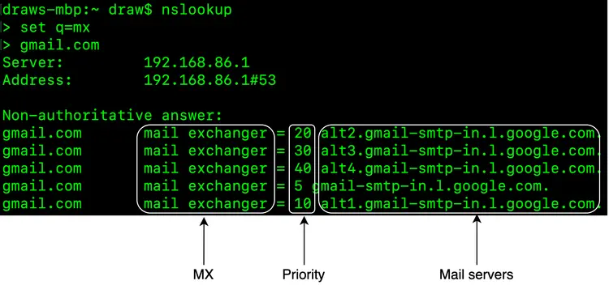
*   **Attachments:** Appended to emails via the **MIME** specification, heavily relying on Base64 encoding.

### The Traditional Mail Server Architecture
In early internet days, thousands of users could be handled by a single monolithic server per domain.

**The Traditional Flow:**
1.  Alice uses her client (SMTP) to send an email to her own Mail Server (Outlook).
2.  The Outlook Server queries DNS for Gmail's MX records.
3.  The Outlook Server transfers the email to the target Gmail SMTP Server.
4.  The Gmail Server parses and stores the email locally.
5.  Bob logs into his client, which connects to his server via IMAP/POP to retrieve the email.

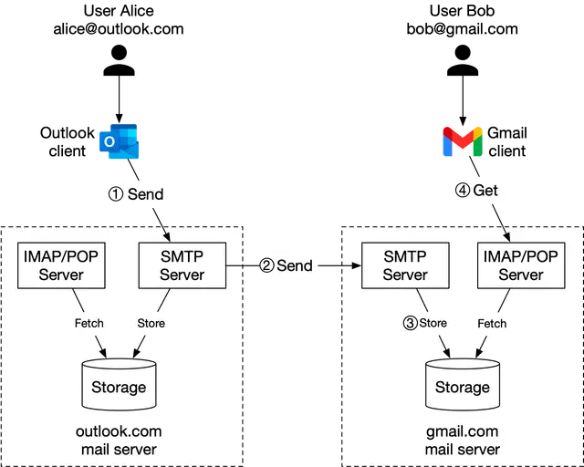

**Traditional Storage (Maildir)**
Traditionally, emails were simply written to the local server hard drive as individual raw files. The **Maildir** format structured these local directories by user (e.g., `/home/user_id/Maildir/new`).
*   *The Bottleneck:* File directories work great for thousands of files, but spectacularly crash for billions. As file volume surges, **Disk I/O** becomes a catastrophic bottleneck. Storing emails locally on a single disk also creates a massive single point of failure.

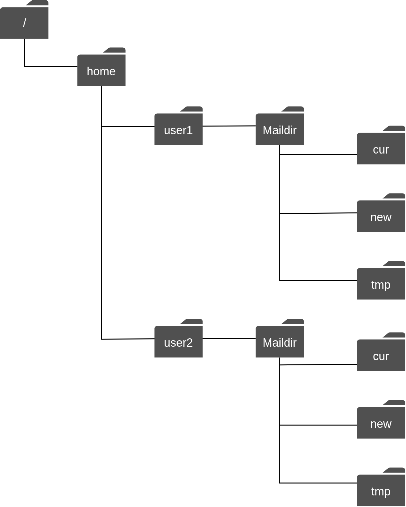

### Distributed Mail Server Architecture

To scale beyond a single monolithic server, modern email providers utilize microservices, distributed databases, and custom RESTful APIs instead of exposing legacy protocols to the client.

**Core Email APIs (REST over HTTP)**
Modern webmail utilizes standard REST.
1. `POST /v1/messages` - Sends an email.
2. `GET /v1/folders` - Returns default folders (All, Archive, Junk, Sent, etc.).
3. `GET /v1/messages/{:message_id}` - Gets specific metadata (sender, recipients, body, is_read).

**Architectural Components**
*   **Web Servers:** Stateless public-facing APIs handling standard requests (login, fetching folders, sending emails).
*   **Real-time Servers:** Stateful servers utilizing long-lived **WebSockets** (or long-polling fallbacks) to push live updates (e.g., new email popups) directly to online clients.
*   **Metadata DB:** Stores mail subject, sender, body text, etc.
*   **Attachment Store:** Highly scalable Object Storage (e.g., AWS S3). Distributed NoSQL databases (like Cassandra) are avoided for attachments because their practical Blob limits are too small (<1MB) and massive attachments destroy database row-cache performance.
*   **Distributed Cache:** Extremely fast in-memory store (e.g., Redis) caching the most recent emails for rapid inbox loading.
*   **Search Store:** A distributed document store utilizing an *inverted index* for lightning-fast full-text search.

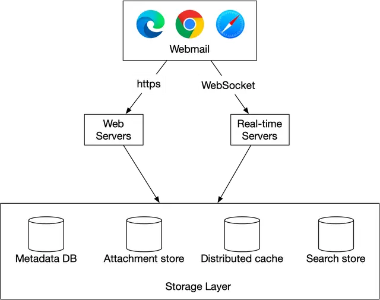

#### 1. Email Sending Flow
When a user clicks "Send" on the web UI:
1.  **Web Server Validation:** The load-balanced web server verifies rate limits and basic rules (e.g., attachment size). If the email is internal (e.g., Gmail $\rightarrow$ Gmail), the server bypasses SMTP entirely and just injects it directly into the receiver's inbox database.
2.  **Message Queue:** If external (Gmail $\rightarrow$ Outlook), the email metadata is dropped into an asynchronous "Outgoing Message Queue". (If an attachment is huge, it is uploaded to S3 first, and the S3 pointer is placed in the queue).
3.  **SMTP Outgoing Workers:** Background worker nodes pull messages from the queue, scan them for viruses/spam, and then transmit the email over the internet via the legacy SMTP protocol to the recipient domain.
    *   *Resilience:* If the target server is down, the worker uses exponential backoff to retry. By decoupling the APIs from the SMTP workers via a Queue, user APIs never hang.

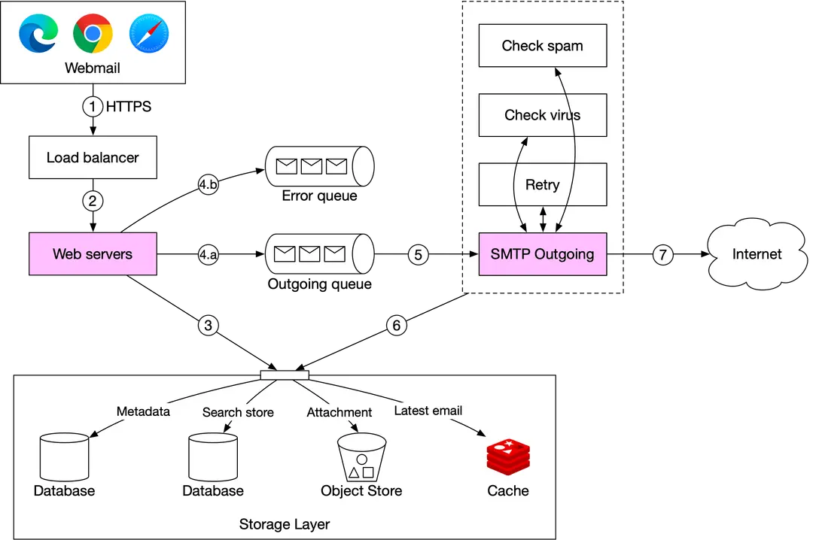

#### 2. Email Receiving Flow
When an external SMTP server drops an email at our front door:
1.  **SMTP Entry:** The email hits the SMTP Load Balancer and is routed to a fleet of receiving SMTP Servers. Early bounce rules are applied to drop invalid emails.
2.  **Message Queue:** The email is placed in an "Incoming Queue". This is critical to buffer the backend systems against massive spam traffic surges.
3.  **Mail Processing Workers:** Background workers pull the raw email, run aggressive Anti-Spam / Anti-Virus filters, and parse the data. 
4.  **Storage:** Clean, processed data is saved simultaneously into the Metadata DB, Object Store (attachments), and Search Index.
5.  **Live Delivery:** If the user is currently online, a payload is sent to the **Real-time Servers**, which instantly push the new email to the user's browser via WebSocket. (If the user is offline, the client simply fetches it from the Web Servers the next time they log in).

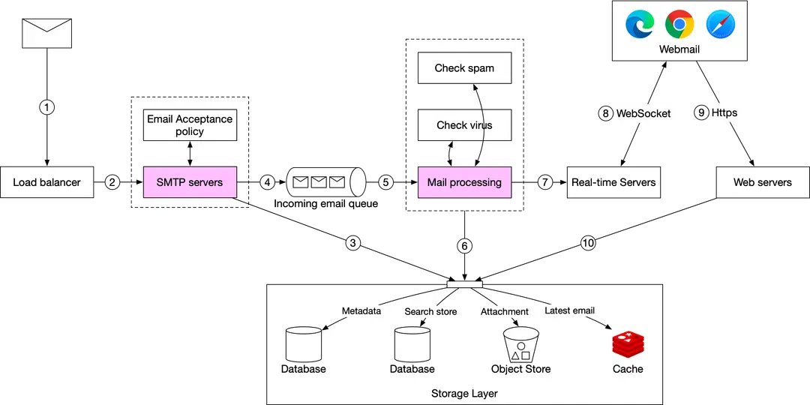

---

### Step 3 - Design Deep Dive

#### 1. The Metadata Database (Choosing the Right DB)
Email metadata is aggressively constrained by disk I/O.
*   **Data Characteristics:** Email headers are accessed constantly. Email bodies are practically never re-read. **82% of queries target emails younger than 16 days.** Correctness is absolute (0% data loss).
*   **Why Relational Fails:** Searching through raw HTML/unstructured BLOBs in PostgreSQL is extremely inefficient, and relational DBs struggle with high-throughput massive insertions.
*   **Why S3 Fails:** Pure object storage has no mechanisms to efficiently mark 10,000 files as "read" or search through them rapidly.
*   **The Reality:** Giants like Google custom-build their databases (e.g., Bigtable). For this design, we assume a custom distributed NoSQL column-family store (similar to Cassandra) expressly tuned to radically minimize Disk I/O.

#### 2. The NoSQL Data Model
To achieve massive scale, queries must hit exactly one partition. We define the database schemas based strictly on the required access patterns:

*   **Query 1: Get all folders:** `folders_by_user` table. 
    *   Partition Key: `user_id`. (All user folders live evenly on one node).
*   **Query 2: Display emails in a folder:** `emails_by_folder` table.
    *   Partition Key: `(user_id, folder_id)`
    *   Clustering Key: `email_id` (A `TIMEUUID` that physically sorts emails chronologically on disk).
*   **Query 3: Fetch Read / Unread:** Standard NoSQL completely rejects queries like `WHERE is_read=true` because it is not a partition key. Filtering a million emails in memory on the application layer destroys scale.
    *   *Solution:* **Denormalization**. We intentionally duplicate data into two completely separate tables: `read_emails` and `unread_emails`. Marking an email as read requires deleting it from the unread table and inserting it into the read table.

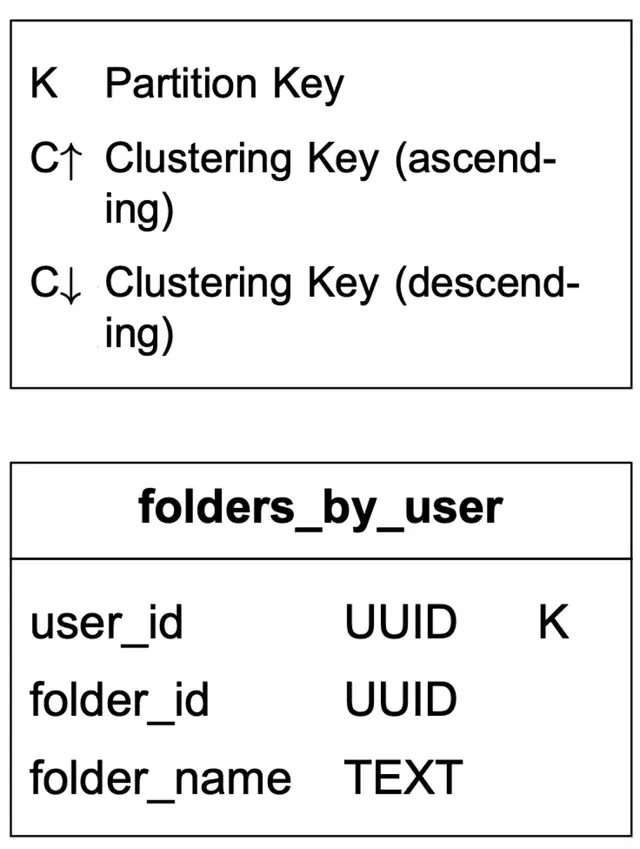
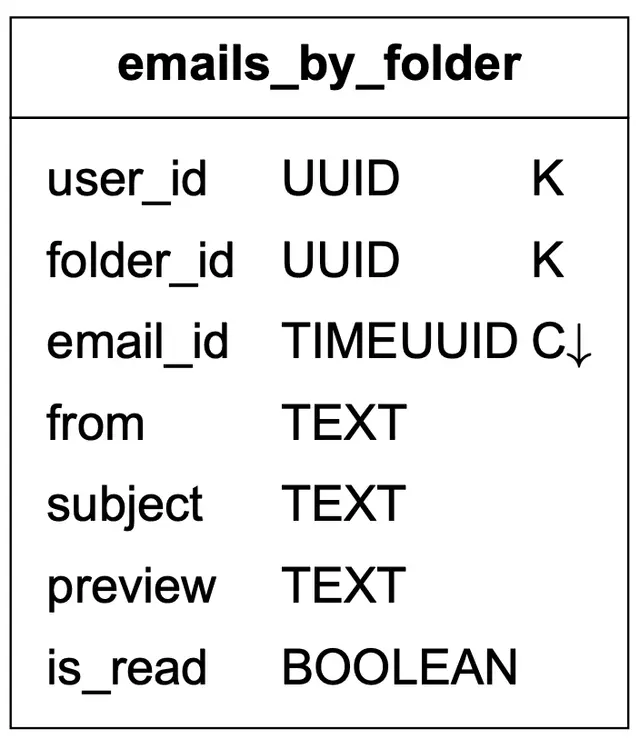
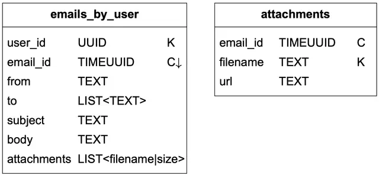
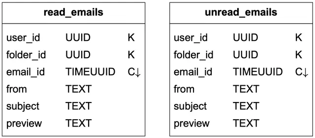

#### 3. Conversation Threads
Grouping emails (so replies do not scatter randomly across the inbox) uses the legacy **JWZ Algorithm**. Every email sent inherently includes three critical Headers: `Message-Id` (the unique ID), `In-Reply-To` (the parent ID), and `References` (the thread history). By pulling these headers, the client logically reconstructs the conversation tree locally.

#### 4. The Consistency Trade-off
Under the CAP Theorem, email is strictly a **CP system (Consistency over Availability)**. Mailbox correctness is everything. If the primary database node goes down, the client's inbox sync is explicitly paused (sacrificing availability) until the failover gracefully completes, guaranteeing the user never sees disjointed, duplicated, or corrupted mailbox states.

#### 5. Email Deliverability
Building an SMTP server is easy; actually getting an ISP (like Google or Yahoo) to put your email in a user's inbox instead of the spam folder is extremely hard. Over 50% of the internet's emails are spam.
*   **IP Reputation:** Use dedicated IP addresses. New IPs must be "warmed up" slowly over 2-6 weeks to build trust with receiving ISPs.
*   **Feedback Loops:** Set up strict webhook loops with ISPs to actively monitor:
    *   *Hard Bounces:* Email address doesn't exist.
    *   *Soft Bounces:* Temporary issue (e.g., ISP server is too busy).
    *   *Complaints:* The user clicked "Report Spam". Senders causing complaints must be banned instantly before the ISP destroys the sending IP's reputation.
*   **Email Authentication (Anti-Phishing):** Emails must be cryptographically signed and structurally verified by combining **SPF**, **DKIM**, and **DMARC** headers.

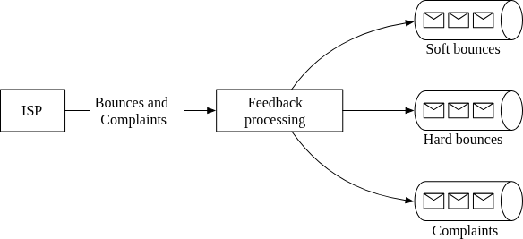

#### 6. Search (Elasticsearch vs Custom Engine)
Unlike Google Search (which indexes the whole internet but tolerates delay), Email search is restricted strictly to one user's mailbox, but mandates near real-time accuracy and sorting by custom metadata (unread, has attachment).

*   **Option 1: Elasticsearch (For smaller scales)**
    *   As email actions (send/delete) happen, Kafka queues trigger asynchronous reindexing jobs in an Elasticsearch cluster.
    *   *Pros:* Easy to implement.
    *   *Cons:* Requires maintaining two entirely separate massive systems (The Primary NoSQL Metadata DB + The Elasticsearch Cluster), guaranteeing painful data-sync/consistency bugs over time.
    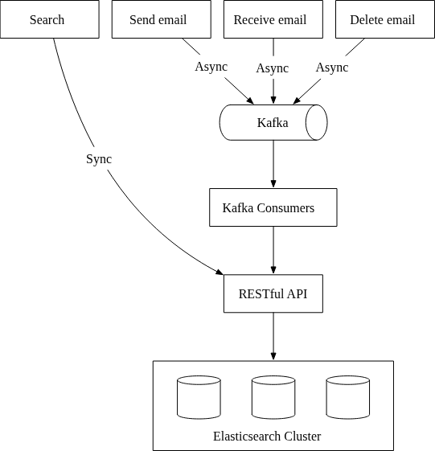

*   **Option 2: Custom Search Engine (At Gmail/Outlook scale)**
    *   At the Petabyte-scale, maintaining two complete copies of data is financially and architecturally prohibitive. Mega-providers embed search natively into their custom datastores using **Log-Structured Merge-Trees (LSM)**.
    *   LSM trees heavily optimize write-heavy indexing by structuring data in hierarchical disk chunks (Level 0 Memory $\rightarrow$ Level 1 Disk, etc.), radically minimizing random disk I/O.
    

#### 7. Scalability and Availability
Because User A's inbox data has absolutely no relational overlap with User B's inbox, the entire system is perfectly primed for horizontal scaling. Mailboxes are replicated across multiple geographic Datacenters (Active-Active). If the US Datacenter goes down entirely, DNS routes the user to the European Datacenter, which holds a synced replica of their metadata and attachments.

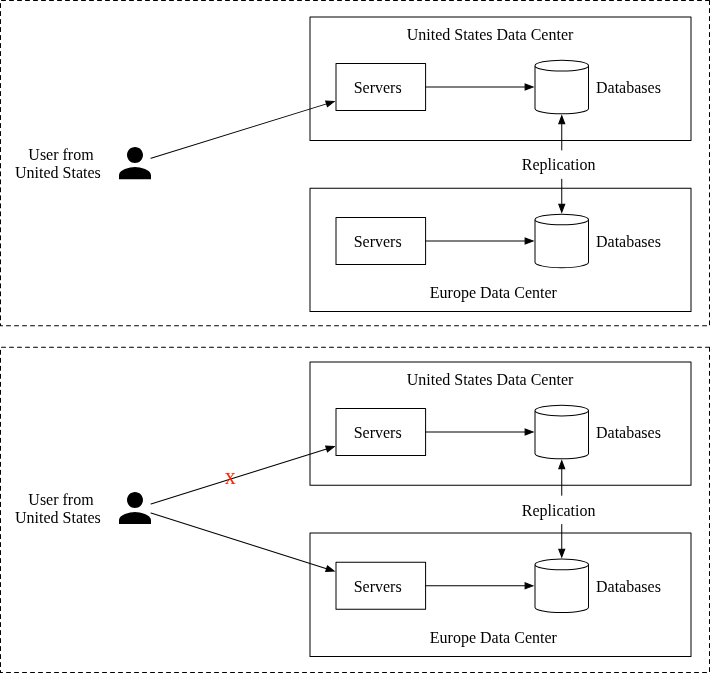

---

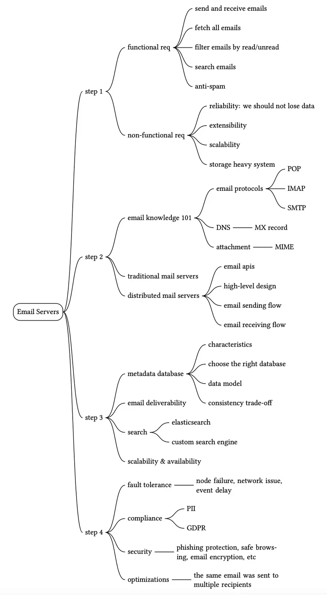

Reference Materials
[1] Number of Active Gmail Users: https://financesonline.com/number-of-active-gmail-users/

[2] Outlook: https://en.wikipedia.org/wiki/Outlook.com

[3] How Many Emails Are Sent Per Day in 2021?:
https://review42.com/resources/how-many-emails-are-sent-per-day/

[4] RFC 1939 - Post Office Protocol - Version 3: http://www.faqs.org/rfcs/rfc1939.html

[5] ActiveSync: https://en.wikipedia.org/wiki/ActiveSync

[6] Email attachment: https://en.wikipedia.org/wiki/Email_attachment

[7] MIME: https://en.wikipedia.org/wiki/MIME

[8] Threading: https://en.wikipedia.org/wiki/Conversation_threading

[9] IMAP LIST Extension for Special-Use Mailboxes: https://datatracker.ietf.org/doc/html/rfc6154

[10] Apache James: https://james.apache.org/

[11] A JSON Meta Application Protocol (JMAP) Subprotocol for WebSocket:
https://datatracker.ietf.org/doc/rfc8887/

[12] Cassandra Limitations:
https://cwiki.apache.org/confluence/display/CASSANDRA2/CassandraLimitations

[13] Inverted index: https://en.wikipedia.org/wiki/Inverted_index

[14] Exponential backoff: https://en.wikipedia.org/wiki/Exponential_backoff

[15] QQ Email System Optimization (in Chinese): https://www.slideshare.net/areyouok/06-qq-5431919

[16] IOPS: https://en.wikipedia.org/wiki/IOPS

[17] UUID and timeuuid types: https://docs.datastax.com/en/cql-oss/3.3/cql/cql_reference/uuid_type_r.html

[18] Message threading: https://www.jwz.org/doc/threading.html

[19] Global spam volume: https://www.statista.com/statistics/420391/spam-email-traffic-share/

[20] Warming up dedicated IP addresses:
https://docs.aws.amazon.com/ses/latest/dg/dedicated-ip-warming.html

[21] 2018 Data Breach Investigations Report:
https://enterprise.verizon.com/resources/reports/DBIR_2018_Report.pdf

[22] Sender Policy Framework: https://en.wikipedia.org/wiki/Sender_Policy_Framework

[23] DomainKeys Identified Mail: https://en.wikipedia.org/wiki/DomainKeys_Identified_Mail

[24] Domain-based Message Authentication, Reporting & Conformance: https://dmarc.org/

[25] DB-Engines Ranking of Search Engines: https://db-engines.com/en/ranking/search+engine

[26] Refactoring practice: build full-text search of QQ mailbox based on Tencent Cloud Elasticsearch: https://www.programmersought.com/article/24097547237/

[27] Log-structured merge-tree: https://en.wikipedia.org/wiki/Log-structured_merge-tree

[28] Microsoft Exchange Conference 2014 Search in Exchange:
https://www.youtube.com/watch?v=5EXGCSzzQak&t=2173s

[29] General Data Protection Regulation:
https://en.wikipedia.org/wiki/General_Data_Protection_Regulation

[30] Lawful interception: https://en.wikipedia.org/wiki/Lawful_interception

[31] Email safety: https://safety.google/intl/en_us/gmail/