# Distributed Message Queue

In modern distributed systems, message queues act as the essential glue that enables independent components to communicate reliably and asynchronously.

## Core Benefits of Message Queues
*   **Decoupling:** Eliminates tight dependencies between services, allowing them to evolve and be updated independently.
*   **Improved Scalability:** Producers (senders) and Consumers (receivers) can be scaled vertically or horizontally in isolation based on real-time traffic load.
*   **Increased Availability:** Decouples systems such that if a consumer goes offline, the queue buffers messages until the consumer recovers, preventing data loss.
*   **Better Performance:** Enables asynchronous processing; producers can "fire and forget" messages without waiting for computationally expensive downstream tasks to complete.

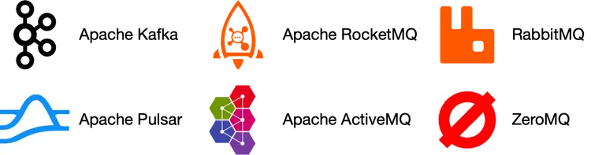

## Message Queues vs. Event Streaming Platforms
The distinction between traditional message queues (e.g., RabbitMQ, ActiveMQ) and event streaming platforms (e.g., Apache Kafka, Pulsar) is increasingly blurred:

| Feature | Traditional Message Queue | Event Streaming Platform |
| :--- | :--- | :--- |
| **Persistence** | Typically deletes messages after consumption. | Long-term data retention (days, weeks, or forever). |
| **Consumption** | Usually single-consumer per message (once it's gone, it's gone). | Repeated consumption (multiple different consumers can read the same message). |
| **Logic** | Focused on task distribution and flow control. | Focused on an append-only log of events/state changes. |

*Note: The design in this chapter focuses on a hybrid approach—a high-performance distributed queue that supports "streaming" features like long retention and repeated consumption.*

## Step 1 - Understand the Problem and Establish Design Scope

### Functional Requirements
*   **Producer/Consumer:** Standard message sending and retrieval.
*   **Repeated Consumption:** Messages can be read by multiple different consumer groups repeatedly (unlike traditional MQ where messages disappear after first acknowledgement).
*   **Persistence & Retention:** Data is persisted for a configurable period (assuming **2 weeks**). 
*   **Ordering:** Messages must be consumed in the **same order** they were produced (FIFO).
*   **Delivery Semantics:** Supporting configurable semantics:
    *   *At-least-once* (Required).
    *   *At-most-once*.
    *   *Exactly-once*.
*   **Message Size:** Generally in the **Kilobyte (KB)** range; text-only.

### Non-Functional Requirements
*   **Performance:** High throughput for log aggregation but also low latency for standard messaging.
*   **Scalability:** Distributed architecture that scales horizontally to handle ingestion surges.
*   **Durability:** Data must be persisted to disk and replicated across nodes to prevent data loss.

### Traditional MQ vs. This Design
A traditional MQ (like RabbitMQ) focuses on transient data (memory-first, short retention, limited ordering). This design aims for a more robust **Event Streaming** model supporting persistence and strict ordering, which adds complexity to the storage and partitioning layer.

## Step 2 - Propose High-Level Design and Get Buy-In

### Key Components
*   **Producer:** Sends messages to the queue.
*   **Consumer:** Subscribes to topics and consumes messages.
*   **Broker (Message Queue):** The central server that decouples producers and consumers but also handles storage and distribution.

### Messaging Models

#### 1. Point-to-Point (P2P)
In a traditional P2P model, a message is consumed by **exactly one** consumer. Once acknowledged, the message is physically deleted from the queue. This is primarily for one-to-one task distribution.

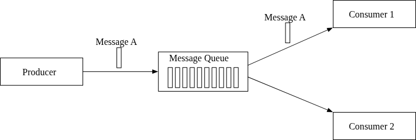

#### 2. Publish-Subscribe (Pub-Sub)
Messages are organized into **Topics**. A message sent to a topic is delivered to **all** subscribers of that topic. This is a one-to-many model.

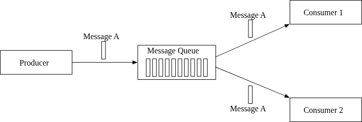

*Our design targets the **Pub-Sub model**, but will support P2P logic via **Consumer Groups**, allowing multiple consumers to share the workload of a single topic subscription.*

### Topics, Partitions, and Brokers

To scale beyond the limits of a single server, a **Topic** is divided into multiple **Partitions** (sharding).

*   **Brokers:** These are the physical servers in the cluster. Partitions are distributed evenly across brokers to maximize throughput and storage capacity.
*   **Partitions & FIFO:** Each partition operates as an independent FIFO queue. Ordering is strictly guaranteed **within a partition**, but not necessarily across an entire topic.
*   **Offsets:** Every message in a partition is assigned a unique, incremental ID called an **offset**.
*   **Message Routing:**
    *   **With a Key:** Messages with the same key (e.g., `user_id`) are always routed to the same partition, ensuring sequential processing for that specific entity.
    *   **Without a Key:** Messages are distributed randomly or via round-robin across available partitions.

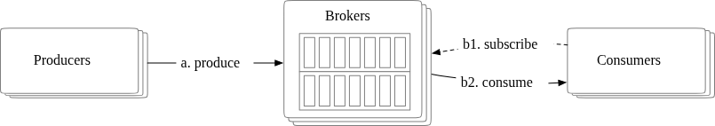

### Consumer Groups

A **Consumer Group** is a set of consumers that work together to consume messages from one or more topics. 

#### 1. Independent Consumption (The Pub-Sub Model)
Different consumer groups are completely isolated from one another. For example, if both a "Billing Group" and an "Analytics Group" subscribe to Topic-A, they will BOTH receive every single message in Topic-A. This achieves the **Publish-Subscribe** behavior.

#### 2. Cooperative Consumption (The P2P Simulation)
Within a single consumer group, the work is shared.
*   **The Ordering Constraint:** To maintain FIFO ordering, a single partition can be consumed by **exactly one consumer** within a group. This ensures that messages in that partition are processed sequentially.
*   **Parallelism:** Multiple consumers in one group can read from different partitions simultaneously, increasing throughput.
*   **Scaling Limit:** If a cluster has more consumers than partitions, the extra consumers will sit idle. Therefore, the number of partitions determines the maximum parallelism of a single consumer group.

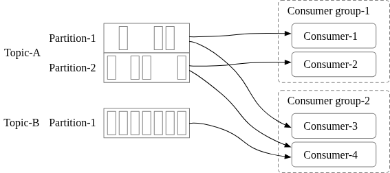

*By putting all consumers into exactly one group, the system effectively simulates a **Point-to-Point** model, where each message is delivered and handled only once across the entire pool of consumers.*

### High-Level Architecture
The integrated design brings together clients, storage layers, and coordination services into a unified cluster.

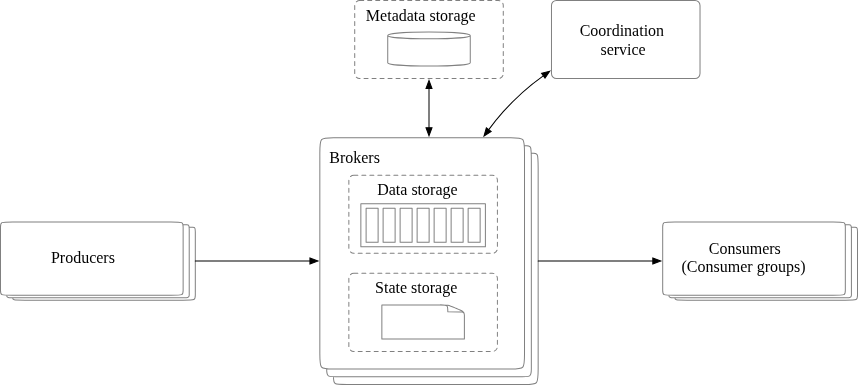

#### 1. Components & Clients
*   **Producer:** Pushes messages to specific topics.
*   **Consumer Group:** Subscribes to topics and consumes messages asynchronously.
*   **Brokers:** The worker nodes that host and manage partitions.

#### 2. Storage Layers
*   **Data Storage:** The primary on-disk storage where raw messages are persisted within partitions for a defined retention period.
*   **State Storage:** Manages the **Consumer State** (e.g., the last read offset for each consumer group).
*   **Metadata Storage:** Stores configuration details like topic properties, partition mapping, and user permissions.

#### 3. Coordination Service
To maintain cluster health and consistency, a specialized coordination layer (e.g., **Apache Zookeeper** or **etcd**) is required for:
*   **Service Discovery:** Monitoring which brokers are currently alive and available for work.
*   **Leader Election:** Selecting one broker as the **Active Controller**. This controller is the "brain" responsible for managing partition assignments across the cluster.

---

## Step 3 - Design Deep Dive

To achieve massive throughput and long-term retention, the system is built on three core design principles:
1.  **Sequential On-Disk Access:** Leveraging the fact that sequential disk I/O (even on rotational HDDs) is extremely fast and integrates perfectly with the OS Page Cache.
2.  **Zero-Copy (Immutable Data):** Messages are never modified as they move from Producer $\rightarrow$ Broker $\rightarrow$ Consumer. This eliminates expensive CPU/Memory copy operations.
3.  **Aggressive Batching:** "Small I/O is the enemy." Messages are batched at the producer, on the broker disk, and during consumer fetching to maximize IOPS efficiency.

### 1. Data Storage (The WAL Approach)
While traditional databases are versatile, they are suboptimal for the "write-heavy, no-update, sequential-only" traffic of a message queue.

#### Write-Ahead Log (WAL) & Segments
Instead of a database, we use an **Append-only Log (WAL)**.
*   **The Log:** Each partition is conceptually a single infinite log. New messages are simply appended to the end, assigned a monotonically increasing **Offset**.
*   **Segments:** To prevent log files from growing indefinitely, a partition is physically divided into **Segments** (e.g., 1GB files). 
    *   Only the **Active Segment** accepts writes.
    *   Older segments are **Inactive** (Read-only).
    *   Once a segment reaches the retention age (e.g., 2 weeks), it is simply deleted from the filesystem.

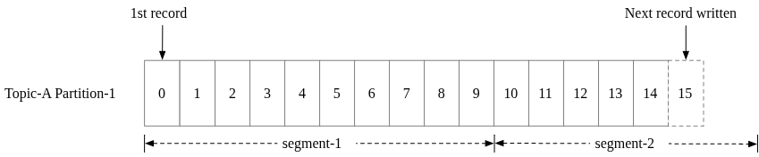
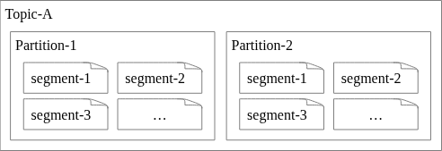

#### Disk Performance & OS Caching
The system exploits the **Sequential Access** property of modern disks, which can reach hundreds of MB/s. Furthermore, by utilizing the **OS Page Cache**, as long as consumers stay "caught up" with producers, they are essentially reading from memory rather than physical disk, drastically reducing latency.

### 2. Message Data Structure
A unified, immutable data structure is the "contract" between Producers, Brokers, and Consumers. By keeping this structure identical across the entire journey, the system achieves high performance through **Zero-Copy**, as no expensive re-serialization or mutation is required.

#### The Message Schema
| Field Name | Type | Description |
| :--- | :--- | :--- |
| **Key** | `byte[]` | Optional. Used for partitioning logic (`hash(key) % num_partitions`). |
| **Value** | `byte[]` | The actual message payload (binary or text). |
| **Topic** | `string` | The topic name. |
| **Partition** | `int` | The unique ID of the partition. |
| **Offset** | `long` | The position of the message within the partition. |
| **Timestamp** | `long` | When the message was stored. |
| **Size** | `int` | Length of the message. |
| **CRC** | `int` | Cyclic Redundancy Check to ensure data integrity. |

*   **Partitioning logic:** The `Key` serves a business purpose (e.g., `user_id`) while the `Partition` is an internal infrastructure concept. A good mapping algorithm ensures even distribution and maintains sequential ordering for keys.
*   **Locating Messages:** Any specific message in the cluster can be uniquely retrieved via the triplet: **(Topic, Partition, Offset)**.
*   **Integrity:** The **CRC** field is critical for detecting silent data corruption during transmission or disk storage.

### 3. Batching (The Throughput Engine)
Batching is pervasive across the entire design (Producer, Broker, Consumer) and is the primary driver for high throughput.

*   **Network Efficiency:** Grouping messages into a single network request amortizes the expensive overhead of network round-trips.
*   **Disk Efficiency:** Writing in large chunks allows the OS to maintain larger contiguous blocks of sequential writes and disk cache, significantly boosting disk throughput.
*   **The Trade-off (Throughput vs. Latency):**
    *   **High Throughput:** Use larger batch sizes. Ideal for log aggregation and event streaming.
    *   **Low Latency:** Use smaller batch sizes. Ideal for traditional message queue use cases where immediate delivery is prioritized over raw bandwidth.

### 4. Producer Flow
A producer must determine which broker hosts the **Leader Replica** of the target partition.

#### External vs. Client-side Routing
*   **External Routing Layer:** A dedicated proxy service handles routing. While simple for the client, it adds an extra network hop (higher latency) and makes efficient cross-network batching difficult.
*   **Client-side Routing (The Improved Design):** The routing logic and a metadata cache are embedded directly into the **Producer Client Library**. 
    *   **Direct-to-Broker:** The producer talks directly to the correct Lead Broker, eliminating extra hops.
    *   **Client-side Buffering:** Messages are held in a local buffer to accumulate large batches before being sent over the wire. This maximizes throughput.

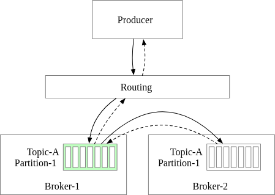
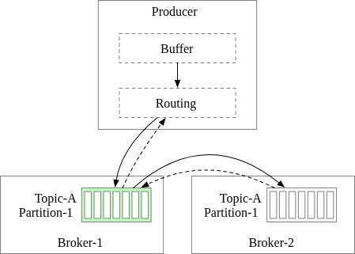

#### The Batching Trade-off
Producers can tune the batch size based on their specific performance profile:
*   **Large Batches:** Higher throughput, but increased latency (waiting for the buffer to fill).
*   **Small Batches:** Lower latency, but reduced throughput due to frequent network overhead.

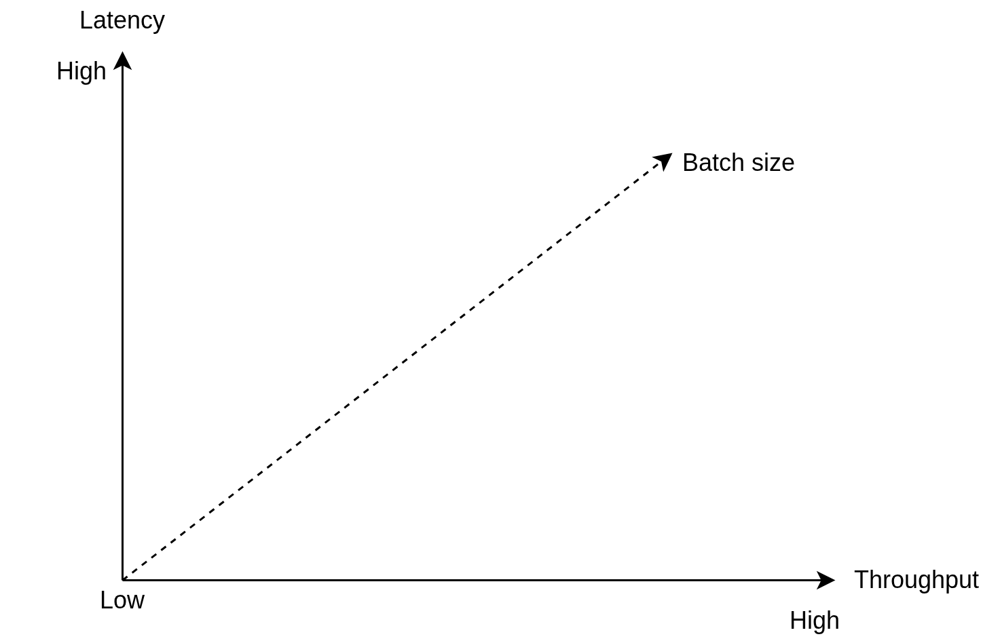

### 5. Consumer Flow
Consumers retrieve messages by specifying an offset and requesting a chunk of data.

#### Push vs. Pull
The choice between Brokers pushing data or Consumers pulling data is a fundamental design decision.

| Model | Pros | Cons |
| :--- | :--- | :--- |
| **Push** | **Low Latency:** Messages reach consumers immediately. | **Risk of Overwhelming:** Slow consumers can be flooded if production exceeds consumption. Hard to handle diverse processing speeds. |
| **Pull** | **Consumer Control:** Each consumer group processes data at its own pace. Enables aggressive batching. Suitable for diverse workloads (batch vs. real-time). | **Resource Waste:** Consumers might poll empty queues repeatedly. (Mitigated by **Long Polling**). |

*Our design (and most modern systems like Kafka) utilizes the **Pull Model** to ensure consumers stay healthy and can scale independently.*

#### Pull Workflow & Coordination
1.  **Group Joining:** A new consumer joins a group by connecting to a **Group Coordinator** (a broker chosen via hashing the group name).
2.  **Partition Assignment:** The Coordinator assigns specific partitions to the new consumer (e.g., Partition 2 of Topic-A).
3.  **Fetch & Commit:**
    *   The consumer fetches data from the last saved **Offset** (retrieved from State Storage).
    *   After processing the batch, the consumer **commits** the new offset back to the broker.

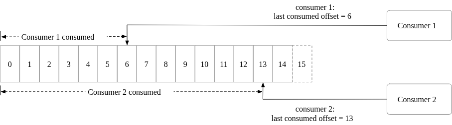
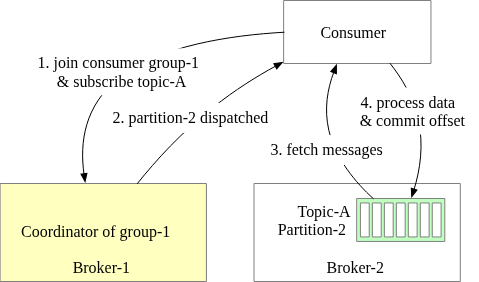

### 6. Consumer Rebalancing
Rebalancing is the process of redistributing partition ownership among consumers in a group. It is triggered when a consumer joins/leaves, a consumer crashes (missed heartbeats), or the topic's partition count changes.

#### The Role of the Group Coordinator
The **Group Coordinator** is a specific broker (determined by hashing the group name) that manages the group's lifecycle.
*   **Heartbeats:** Consumers send regular heartbeats to the coordinator. If heartbeats stop, the broker considers the consumer dead and triggers a rebalance.
*   **Rebalance Trigger:** The coordinator notifies consumers to "rejoin" the group (typically via a heartbeat response).

#### The Rebalancing Workflow
1.  **Rejoin:** All consumers in the group stop consuming and send a `JoinGroup` request to the coordinator.
2.  **Leader Election:** The coordinator selects one consumer as the **Leader** and the rest as **Followers**.
3.  **Dispatch Plan:** 
    *   The **Leader consumer** is responsible for generating the **Partition Dispatch Plan** (mapping partitions to consumers) to avoid broker-side bottlenecks.
    *   The Leader sends this plan back to the coordinator.
4.  **Sync:** The coordinator broadcasts the assignment plan to all followers. Consumers then begin fetching from their newly assigned partitions.

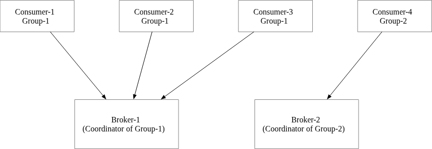

#### Rebalance Scenarios
*   **New Member Joins:** Coordinator triggers a rebalance to give the new member a fair share of partitions.
*   **Member Leaves/Crashes:** Partitions previously owned by the dead member are reassigned to the remaining active consumers.

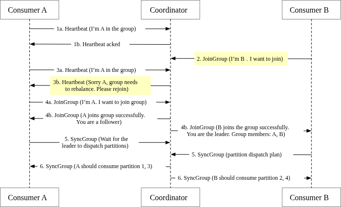
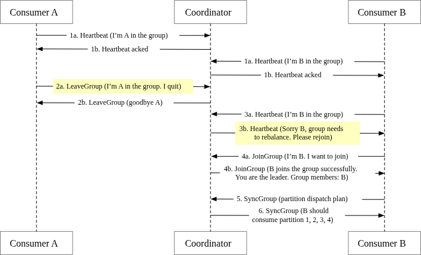
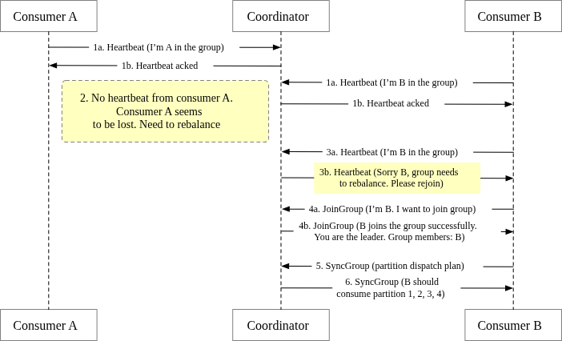

### 7. State Storage
State storage manages the "bookkeeping" of the cluster, specifically tracking which consumers own which partitions and their respective progress.

#### Key Data Managed
*   **Partition Assignment:** The mapping identifying which specific consumer is currently responsible for which partition.
*   **Offsets:** The last consumed offset for each **Consumer Group** per partition. This allows a new consumer to resume exactly where a crashed instance left off.

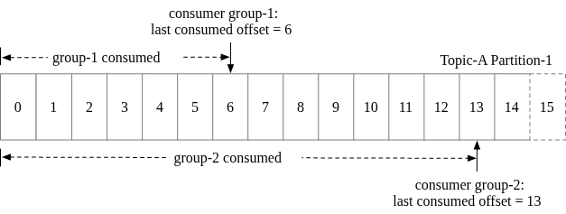

#### Access Patterns & Requirements
Unlike the *Data Storage* (Sequential WAL), *State Storage* has very different characteristics:
*   **Random Access:** Reading/writing specific offsets for different consumer groups synchronously.
*   **Frequent Updates:** Every offset "commit" is an update.
*   **High Consistency:** If state is lost or inconsistent, messages might be double-processed or skipped entirely.
*   **Low Volume:** Even with million-TPS throughput, the number of consumer groups and partitions is relatively small compared to the message data itself.

#### Storage Options
*   **Apache Zookeeper:** A common choice due to its high consistency and reliability for small Metadata/State.
*   **Internal Broker Storage:** Modern Kafka implementations move offset storage into internal, highly-available topics within the brokers themselves to improve scalability and reduce external dependencies.

### 8. ZooKeeper: The Orchestrator
ZooKeeper is a hierarchical key-value store that provides essential synchronization services for distributed systems. In our design, it acts as the central brain, simplifying the broker's responsibilities.

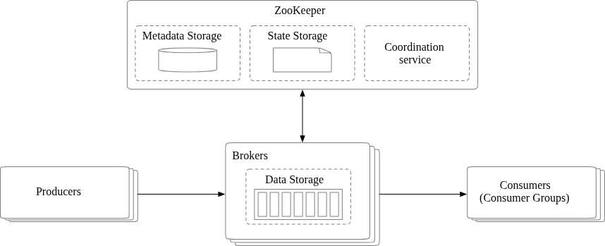

#### Architectural Simplifications
By integrating ZooKeeper, we shift critical but non-data responsibilities away from the brokers:
*   **Offloaded Storages:** Both **Metadata Storage** (topic/partition configs) and **State Storage** (consumer offsets) are moved to ZooKeeper.
*   **Specialized Brokers:** Brokers can now focus strictly on the high-performance throughput of **Data Storage** (message logs).
*   **Cluster Coordination:**
    *   **Leader Election:** ZooKeeper is used to elect the "Active Controller" of the broker cluster.
    *   **Service Discovery:** Tracking which brokers are online and their current health status.

### 9. Replication
To ensure high availability and protect against hardware failure, the system replicates partitions across multiple broker nodes.

#### Leader-Follower Model
*   **Leader Replica:** Every partition has one designated leader. All write and read requests from producers/consumers are handled **exclusively** by the leader to ensure consistency.
*   **Follower Replicas:** These replicas do not handle client requests directly. Instead, they continuously pull new messages from the leader to stay synchronized.
*   **Acknowledgements:** The leader only sends an ACK back to the producer once a message has been successfully copied to "enough" replicas (see ISR section).

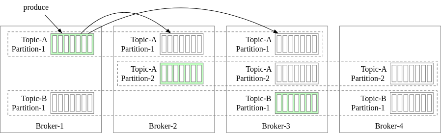

#### Replica Distribution Plan
The mapping of which brokers host which leaders/followers is finalized in the **Replica Distribution Plan**.
1.  **Generation:** The **Active Controller** (the lead broker elected via ZooKeeper) generates the plan.
2.  **Storage:** The plan is persisted in **Metadata Storage (ZooKeeper)**.
3.  **Cross-Broker Distribution:** Replicas are strategically placed across different physical racks or brokers to minimize the impact of a single rack/node failure.

### 10. In-Sync Replicas (ISR)
ISR is the set of replicas (including the Leader) that are currently "caught up" with the Leader's log based on a configurable threshold (e.g., `replica.lag.max.messages`).

#### How ISR Works
*   **Committed Offset:** A message is considered **Committed** only after it has been replicated to **every single member** of the current ISR set. This ensures that even if the leader crashes, any other ISR member can take over without data loss.
*   **Dynamic Membership:** 
    *   If a follower lags too far behind (exceeds the configured lag time or message count), it is removed from the ISR.
    *   Once the lagging follower catches up, it is re-added to the ISR.
*   **Leader as Default:** The leader is always a member of the ISR.

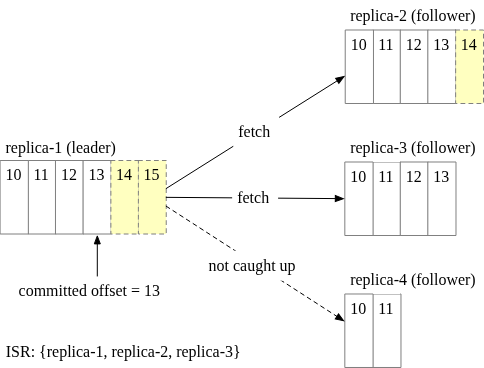

#### The Durability vs. Performance Trade-off
The size of the ISR and the producer's acknowledgment settings determine the system's guarantees:
*   **High Durability:** Requiring many ISRs to receive a message before returning an ACK. Safest against crashes but slowest (bottlenecked by the slowest ISR).
*   **High Performance:** Requiring fewer (or only the leader) to ACK. Fastest performance but risks losing data if the leader crashes before replication finishes.

### 11. Producer Acknowledgment (ACK) Levels
The `ack` setting allows producers to explicitly trade off throughput and latency against data durability.

*   **ACK=all (Strongest Durability):** 
    *   The producer receives an acknowledgment only after the message is persisted by the leader **and synchronized to all other members of the ISR**. 
    *   *Trade-off:* Highest latency (waiting for the slowest ISR) but ensures no data is lost during a leader failover.
*   **ACK=1 (Balanced):** 
    *   The producer receives an acknowledgment as soon as the **Leader** persists the message. 
    *   *Trade-off:* Improved latency, but if the leader crashes before the followers can synchronize the data, the message is lost. 
*   **ACK=0 (Lowest Latency):** 
    *   The producer sends messages without waiting for any response and never retries. 
    *   *Trade-off:* Lowest possible latency and highest throughput. Suitable for non-critical high-volume data like logs or metrics where occasional loss is acceptable.

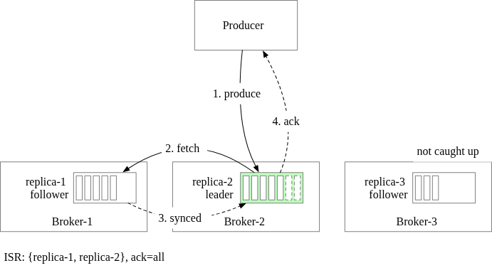
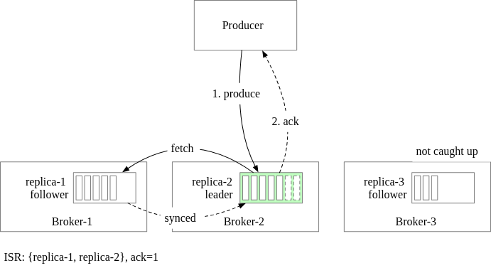
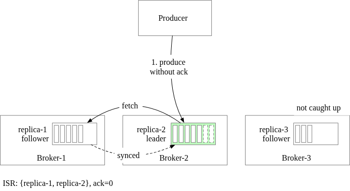

#### Where do Consumers Read From?
*   **Primary Rule (Leader Read):** By default, consumers read from the **Leader Replica**. This simplifies the system and ensures that even if a consumer is slightly behind, it always interacts with the most up-to-date source.
*   **Edge Case (Locality):** In geographically distributed (multi-region) clusters, consumers may be configured to read from the **closest ISR** follower to minimize cross-data-center latency.

### 12. Scalability & Fault Tolerance

#### Scaling Clients
*   **Producers:** Conceptually simple to scale. Since they are independent and stateless regarding group coordination, instances can be added/removed as needed.
*   **Consumers:** Scaled via **Consumer Groups**. The **Rebalancing** mechanism automatically redistributes partitions whenever a consumer joins, leaves, or crashes.

#### Broker Scalability (The Over-Replication Strategy)
When adding a new broker to a cluster, we must move partitions to it without causing data loss or downtime.
1.  **Add New Replica:** The Broker Controller assigns a new replica to the newly added broker.
2.  **Catch-Up:** The new replica pulls data from the Leader until it is fully synchronized and joins the **ISR**.
3.  **Graceful Removal:** Once the new replica is in sync, the redundant old replica (on a different broker) is safely removed.

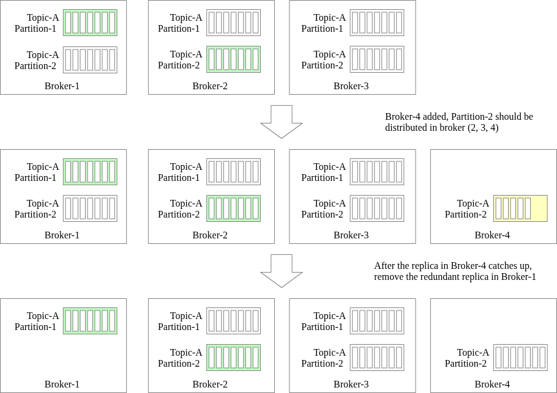

#### Fault Tolerance & Recovery
*   **Broker Crash:** When a broker fails, the **Active Controller** detects the loss and generates a new **Replica Distribution Plan**. If the failed broker was a partition leader, a new leader is elected from the remaining ISR members.
*   **Anti-Affinity:** Replicas of the same partition are strictly distributed across different physical brokers (and ideally different racks) to survive hardware failures.
*   **Minimum ISR:** A safety threshold ensuring that a message is only "committed" if it has reached a minimum number of healthy replicas.

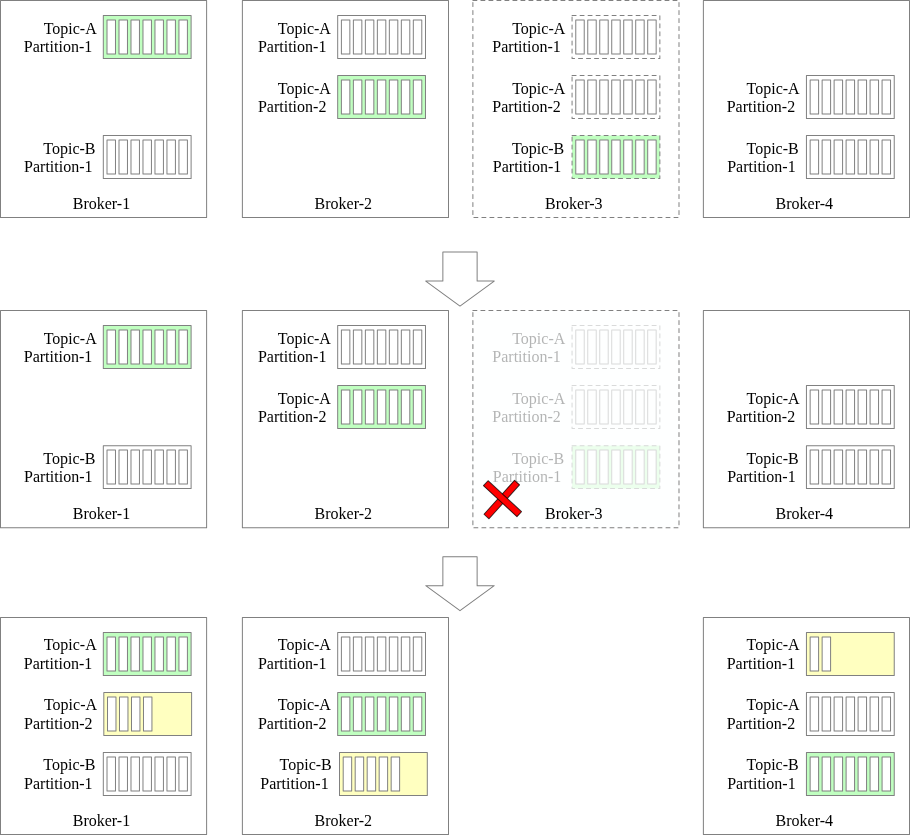

### 13. Partition Scaling
Changing the number of partitions is a common way to tune throughput or adjust storage capacity.

#### Upscaling (Increasing Partitions)
Increasing the number of partitions is straightforward and **requires no data migration**.
*   **Data Placement:** Existing messages remain in their original partitions. Only *new* messages are distributed across the expanded set of partitions (including the new ones).
*   **Rebalancing:** Producers are notified by brokers of the new count, and consumer groups automatically trigger a rebalance to start reading from the new partitions.

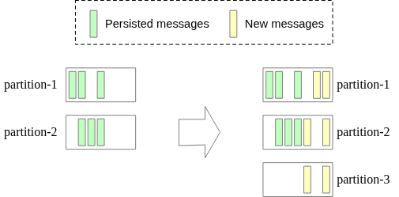

#### Downscaling (Decreasing Partitions)
Reducing the partition count is more complex and occurs in phases to prevent data loss:
1.  **Decommissioning:** The target partition stops accepting new messages from producers immediately.
2.  **Grace Period:** Consumers continue to read from the decommissioned partition until all existing messages have been processed or the **Retention Period** expires.
3.  **Removal:** Only after the storage is truncated and the partition is empty of viable data can it be fully removed from the cluster metadata, triggering a final consumer rebalance.

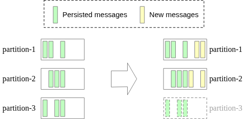

### 14. Message Delivery Semantics
The guarantee levels for data delivery define how the system handles potential failures during the produce/consume lifecycle.

#### At-Most Once (Best Effort)
*   **Logic:**
    *   **Producer:** Sends messages with `ack=0`. No retries if delivery fails.
    *   **Consumer:** Commits the offset **immediately after fetching**, before processing the data.
*   **Outcome:** Messages may be lost but will never be duplicated.
*   **Use Cases:** Non-critical high-volume data like logging or metrics.

#### At-Least Once (No Loss, Potential Duplicates)
*   **Logic:**
    *   **Producer:** Uses `ack=1` or `ack=all` and keeps retrying until success.
    *   **Consumer:** Commits the offset **only after processing** is successful.
*   **Outcome:** No data is ever lost, but duplicates can occur if a consumer processes a message then crashes before committing the offset.
*   **Use Cases:** Most standard system designs where consistency is important and the downstream can handle idempotency (e.g., via unique keys).

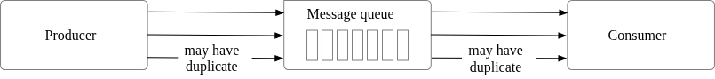

#### Exactly Once (Strict Consistency)
*   **Logic:** The most complex semantic to achieve. It requires coordination between the producer, broker, and consumer (often via transaction IDs and idempotency markers).
*   **Outcome:** Every message is guaranteed to be processed exactly once, with no loss and no duplicates.
*   **Use Cases:** Financial systems (payments, trading, accounting) where duplication is catastrophic.

---

## Advanced Features

While the core of a message queue is throughput and persistence, several advanced localized features improve efficiency and user experience.

### 1. Message Filtering
Topics are broad abstractions, but many consumers only care about a subset of events (e.g., a "Payment" consumer only needs "Success" events from a "Transactions" topic).

#### Architecture Strategies
*   **Naive Choice (Consumer Filtering):** Fetch all data and discard locally. Consumes unnecessary bandwidth and increases costs.
*   **The Problem with Dedicated Topics:** Creating a unique topic for every consumer subtype leads to redundant storage, high management overhead, and tight coupling between producer logic and consumer needs.
*   **The Best Choice (Metadata Tags):**
    *   **Implementation:** Producers attach one or more **tags** to the message metadata.
    *   **Broker-side Efficiency:** The broker reads only the metadata (avoiding expensive payload decryption/deserialization) and selectively fetches blocks that match the consumer's subscribed tags.
    *   **Security:** Keeps the payload data opaque to the broker while allowing efficient routing.

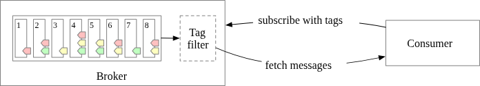

### 2. Delayed & Scheduled Messages
Certain business workflows require messages to be hidden from consumers for a specific duration (e.g., "retry check after 30 minutes").

#### Implementation Workflow
Rather than sending these messages directly to the target topic, they undergo a two-step process:
1.  **Temporary Storage:** The broker intercepts the message and stores it in specialized internal topics (hidden from the normal consumer view).
2.  **Timing Function:** A background process monitors these messages and "delivers" them to the actual user topics only when the specified time expires or the scheduled timestamp is reached.

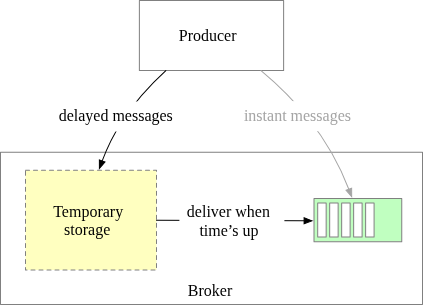

#### Timing Strategies
Two common implementations for the delivery trigger:
*   **Predefined Delay Levels:** (e.g., used by RocketMQ) Messages can only be delayed by specific fixed intervals (1s, 5m, 1h). This is simple to implement and very high-performance.
*   **Hierarchical Time Wheel:** A more advanced data structure that allows for arbitrary delay precision and high scalability.

---

## Step 4 - Wrap Up

The design covers the transition from a traditional transient queue to a high-throughput **Event Streaming Platform** capable of petabyte-scale persistence and parallel processing. 

### Additional Talking Points
*   **Communication Protocols:** The underlying protocol (e.g., **AMQP** or **Kafka Protocol**) must efficiently handle high volumes, manage heartbeats for group coordination, and include verification checks (CRC) for data integrity.
*   **Retry Mechanisms:** To prevent blocking a partition with a "poison pill" message, failed events can be routed to a dedicated **Retry Topic**. This allows the consumer to keep moving forward while dealing with errors asynchronously.
*   **Historical Data Archiving:** While the main log has a retention period (e.g., 2 weeks), historical data can be archived to lower-cost, high-capacity storage like **S3, HDFS, or GCS**. This enables replaying very old data without bloating the high-speed broker disks.

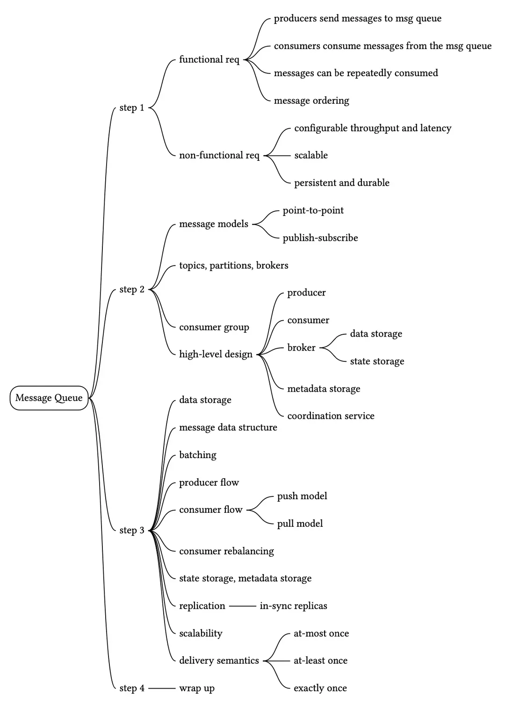

Reference Materials
[1] Queue Length Limit: https://www.rabbitmq.com/docs/maxlength

[2] Apache ZooKeeper - Wikipedia:
https://en.wikipedia.org/wiki/Apache_ZooKeeper

[3] etcd: https://etcd.io/

[4] Comparison of disk and memory performance:
https://deliveryimages.acm.org/10.1145/1570000/1563874/jacobs3.jpg

[5] Cyclic redundancy check: https://en.wikipedia.org/wiki/Cyclic_redundancy_check

[6] Push vs. pull: https://kafka.apache.org/documentation/#design_pull

[7] Kafka 2.0 Documentation:
https://kafka.apache.org/20/documentation.html#consumerconfigs

[8] Kafka No Longer Requires ZooKeeper:
https://towardsdatascience.com/kafka-no-longer-requires-zookeeper-ebfbf3862104

[9] Martin Kleppmann. (2017). ‘Replication’ in Designing Data-Intensive Applications. O'Reilly Media. pp. 151-197

[10] ISR in Apache Kafka:
https://www.cloudkarafka.com/docs/dictionary.html

[11] Apache Kafka allow consumers fetch from closest replica:
https://cwiki.apache.org/confluence/display/KAFKA/KIP-392%3A+Allow+consumers+to+fetch+from+closest+replica

[12] Hands-free Kafka Replication:
https://www.confluent.io/blog/hands-free-kafka-replication-a-lesson-in-operational-simplicity/

[13] Kafka high watermark: https://rongxinblog.wordpress.com/2016/07/29/kafka-high-watermark/

[14] Kafka mirroring: https://cwiki.apache.org/confluence/pages/viewpage.action?pageId=27846330

[15] Message filtering in RocketMQ: https://partners-intl.aliyun.com/help/doc-detail/29543.htm

[16] Scheduled messages and delayed messages in Apache RocketMQ:
https://partners-intl.aliyun.com/help/doc-detail/43349.htm

[17] Hashed and hierarchical timing wheels:
http://www.cs.columbia.edu/~nahum/w6998/papers/sosp87-timing-wheels.pdf

[18] Advanced Message Queuing Protocol: https://en.wikipedia.org/wiki/Advanced_Message_Queuing_Protocol

[19] Kafka protocol guide: https://kafka.apache.org/protocol

Footnotes
The distribution of replicas for each partition is called a replica distribution plan ↩

