# System Design: Google Maps

## Step 1 - Understand the Problem and Establish Design Scope

### Target Scope & Features
The design focuses on the core functionality of a navigation mapping service (similar to Google Maps), with the mobile phone as the primary target device.
*   **Target Scale:** 1 Billion Daily Active Users (DAU).
*   **Key Features:**
    1.  User location updates.
    2.  Navigation service (routing from A to B) including accurate ETA calculations.
    3.  Map rendering.
*   **Out of Scope:** Multi-stop routing, business data (places, photos).
*   **Data Inputs:** Access to Terabytes of raw road network data and real-time traffic conditions.

### Non-Functional Requirements
*   **Accuracy:** Navigation paths must be correct; users should never be misdirected.
*   **Client Experience (Smooth Rendering):** Panning and zooming the map should feel seamless on mobile devices.
*   **Resource Efficiency:** Battery and data consumption must be optimized, which is critical for mobile apps.
*   **Reliability:** High availability and highly scalable infrastructure.

---

## Technical Foundations (Map 101)

Before diving into the architecture, several core GIS (Geographic Information System) concepts must be established:

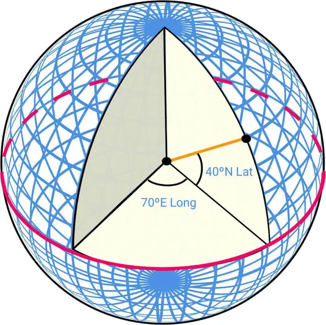

### 1. Positioning & Map Projection
*   **Latitude & Longitude:** The coordinate system used to pinpoint locations on the 3D globe.
*   **Projection:** The mathematical process of flattening a 3D sphere onto a 2D plane. Navigational apps commonly use a modified Mercator projection called **Web Mercator**. (Note: All projections introduce geographic distortion, but Mercator preserves local angles, making it useful for local navigation).

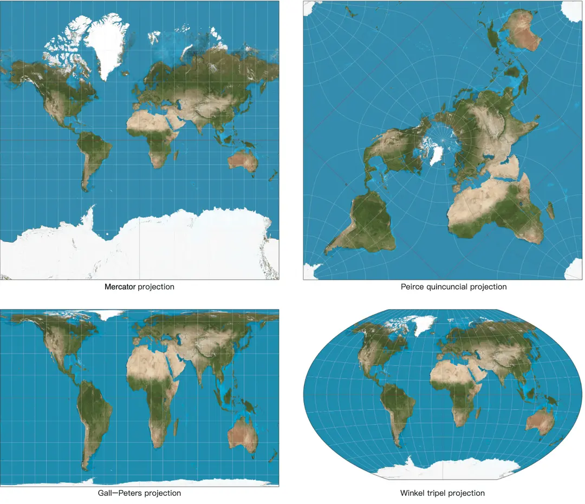

### 2. Geocoding
*   **Geocoding:** Translating human-readable addresses (e.g., "1600 Amphitheatre Parkway") into Lat/Long coordinates. Often implemented via interpolation against street network GIS data.
*   **Reverse Geocoding:** Translating Lat/Long coordinates back into human-readable locations.

### 3. Geohashing
A spatial indexing technique that flattens the world and recursively divides it into a grid system.
*   The globe is broken into quadrants, and each quadrant is subdivided into 4 sub-quadrants recursively until the desired precision (grid size) is reached.
*   It yields a short string representing a specific geographic bounding box, which is highly efficient for geospatial database lookups and map tiling.

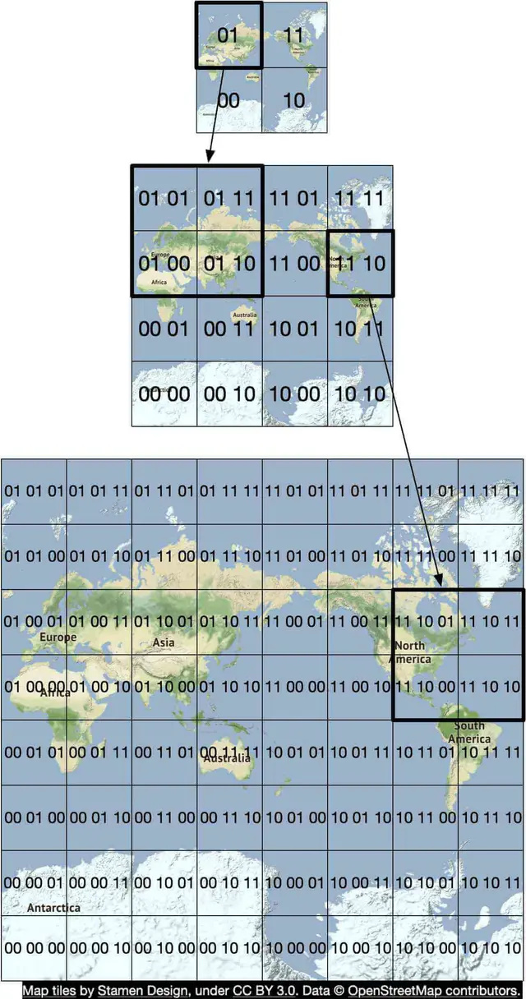

### 4. Map Rendering & Tiling
Instead of rendering one massive image of the world, maps are rendered using **Tiles**.
*   The map is pre-sliced into small, square image tiles (e.g., 256x256 pixels).
*   **Zoom Levels:** The system maintains multiple sets of tiles at varying zoom levels. Zoomed out entirely, the whole world might be a single tile. Zoomed in, the world is represented by millions of tiles.
*   The client calculates which tiles intersect its current viewport and zoom level, fetches them, and stitches them together for a seamless display. *This approach saves massive amounts of mobile bandwidth.*

### 5. Road Data & Routing Tiles
Navigation relies on pathfinding algorithms (like Dijkstra or A*), which require a Graph data structure (Intersections = Nodes, Roads = Edges).

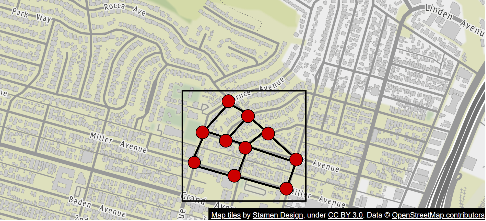

*   **The Problem:** Storing the entire global road network in memory as a single graph is impossible.
*   **The Solution (Routing Tiles):** Similar to image map tiles, the road network is broken down into geographical grids. Each **Routing Tile** is a binary file containing the road graph for that specific area, plus "pointers" to edges in adjacent tiles.

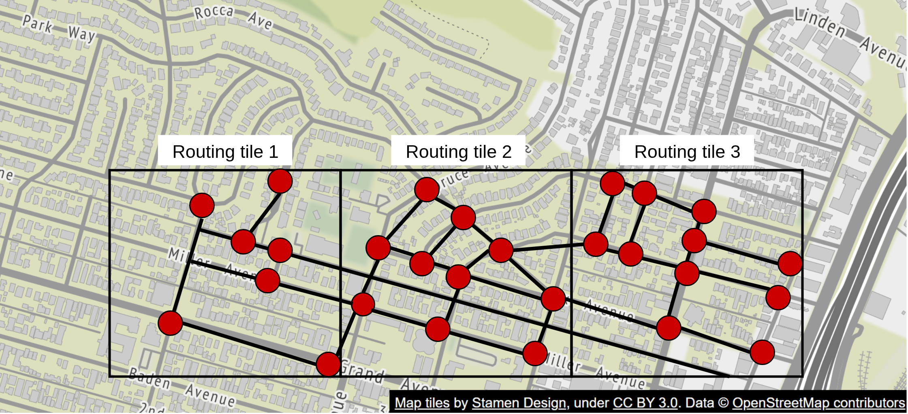

*   **Hierarchical Routing Tiles:** Pathfinding over long distances using local street tiles is too slow. Therefore, routing tiles are built at different levels of detail:
    1.  *Local/High Zoom:* Every residential street.
    2.  *Arterial/Medium Zoom:* District connecting roads.
    3.  *Highway/Low Zoom:* Major freeways connecting states/cities.
*   Routing algorithms can now load only the necessary tiles into memory on-demand, linking local nodes to highway nodes to calculate long-distance routes efficiently.

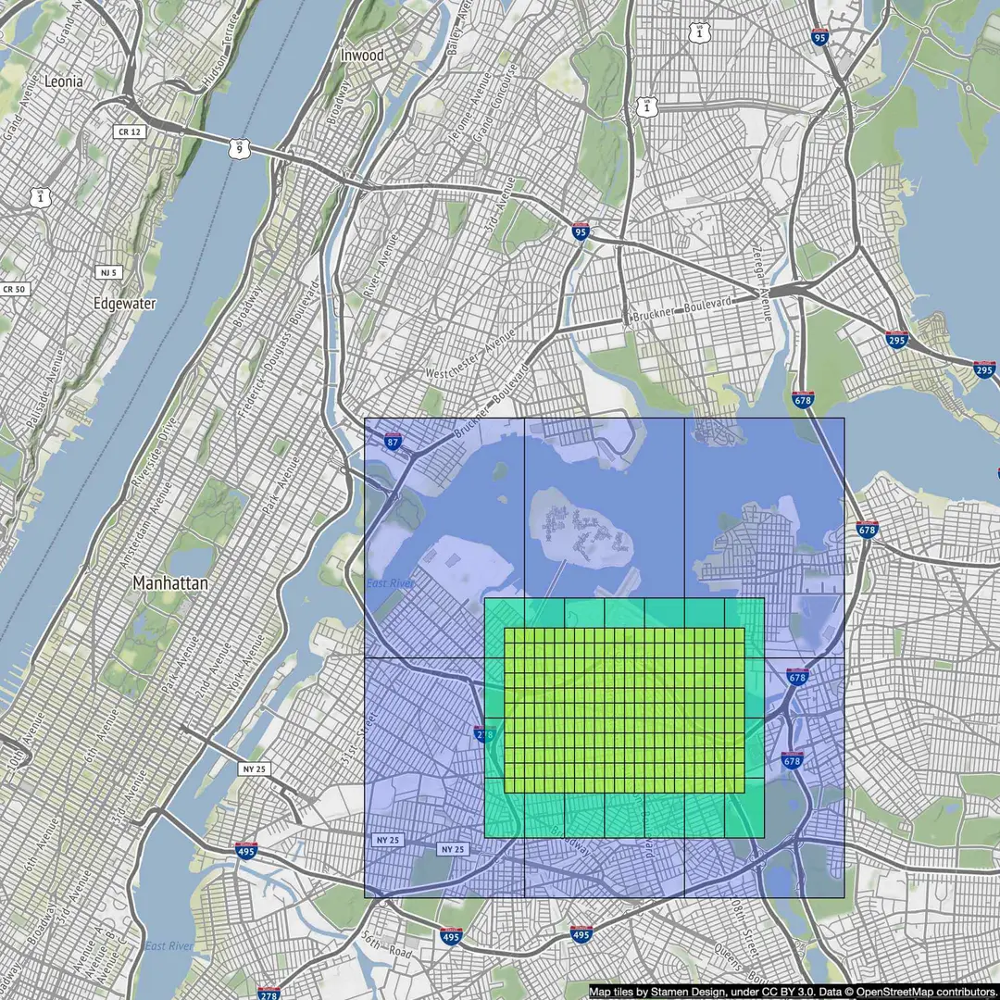

---

## Step 2 - Back-of-the-Envelope Estimation

Because the primary device is mobile, **data usage and battery consumption** must be heavily optimized through batching and compression.

### 1. Storage Usage Estimation
We must store the global map images (Map Tiles) and the road network graphs (Routing Tiles).

*   **Road Info / Routing Tiles:** Derived from Terabytes of raw external data. The compiled routing tiles will also total several **Terabytes**.
*   **Map of the World (Image Tiles):**
    *   At the highest zoom level (Zoom 21), there are roughly **4.4 Trillion tiles**.
    *   Uncompressed, at ~100KB per tile, this would require 440 PB.
    *   *Optimization:* 90% of the world is uninhabited (oceans, deserts). These tiles compress extremely well. We conservatively reduce the requirement by ~80%, bringing Zoom 21 to roughly **50 PB**.
    *   Each zoom level zooming out reduces the tile count by a factor of 4 ($50 + 50/4 + 50/16...$).
    *   **Total Estimated Storage:** Roughly **~100 PB** globally for all image tiles.

### 2. Server Throughput (QPS)
The system handles two main request types: Navigation Initialization and Location Updates. Let's estimate Location Updates.

*   **Users & Usage:** 1 Billion DAU. Assume average usage is 35 minutes per week ($5 Billion minutes per day`).
*   **Naive Approach (1 ping / sec):** $5B \times 60$ seconds = $300$ Billion requests/day $\approx \mathbf{3}$ **Million QPS**.
*   **Optimized Approach (Client Batching):** Pinging the server every second kills mobile batteries. Instead, the client batches GPS points and sends them every 15 seconds. 
    *   $3$ Million QPS / $15$ = $\mathbf{200,000}$ **Average QPS**.
*   **Peak Load:** Assuming a standard $5x$ peak-to-average multiplier.
    *   **Peak QPS:** $\mathbf{1,000,000}$ **QPS**.

---

## Step 3 - High-Level Design

### 1. Navigation Service
Responsible for calculating the route from origin to destination and estimating the ETA. Accuracy is extremely critical here, while a slight latency in calculating the initial path is tolerable.

*   **API Design:** `GET /v1/nav?origin=1355+market+street,SF&destination=Disneyland`
*   **Response payload:** A JSON object containing the overall `duration`, `distance`, array of turn-by-turn `html_instructions`, and the `polyline` (the encoded path to draw on the map).

 *(Note: Re-routing and live traffic updates are handled via a separate "Adaptive ETA" service).*

### 2. Map Rendering (The CDN Approach)
Serving petabytes of map images dynamically is impossible. We must use a **Static, Pre-generated** approach.

*   **The Problem with Dynamic Rendering:** Generating a custom tile for every location/zoom combination on the fly requires massive server compute and destroys the ability to cache images.
*   **The Pre-computed Solution:** The map is pre-sliced into static grids based on **Geohashes**. Because these tiles are static, they can be pushed to a **Content Delivery Network (CDN)**.
*   **Performance:** A CDN caches the tiles at Points of Presence (POPs) globally. Users fetch tiles from their nearest POP with ~10ms latency instead of hitting the origin server (~300ms).

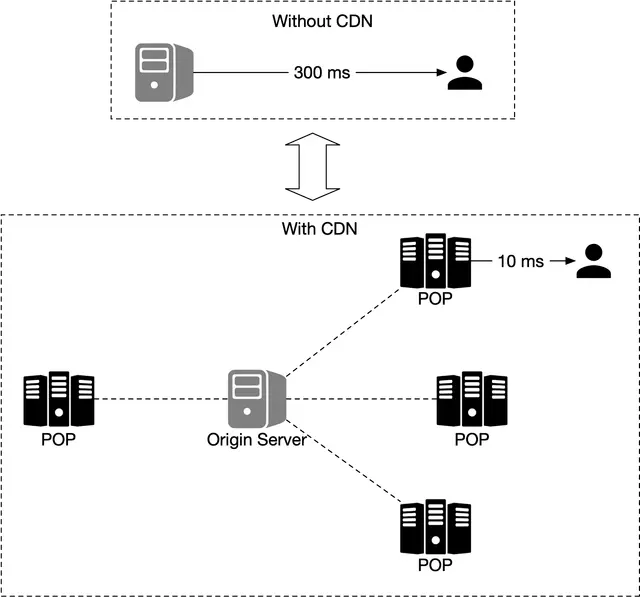

#### Data Usage & Network Traffic
*   **Client Data Usage:** At 30 km/h, a mobile user consumes roughly **1.25 MB per minute** downloading map tiles (assuming ~100KB per tile). This is highly manageable, especially with localized client-side caching of frequent routes.
*   **CDN Traffic:** Serving 5 Billion minutes of navigation daily translates to roughly **~62.5 GB/s** of global CDN traffic. Distributed across ~200 POPs globally, each POP handles a very highly manageable ~300 MB/s.

### 3. The Map Tile Service (Fetching the URLs)
How does the client know *which* CDN URL to request based on its current position?

*   **Option A (Client-side Math):** The client calculates the geohash locally based on lat/lng/zoom and builds the URL. 
    *   *Drawback:* Hardcoding this algorithm into mobile binaries means transitioning to a new spatial index structure in the future would require a massive app update migration.
*   **Option B (Map Tile Service Intermediary):** The client hits a lightweight service with its `(lat, lng, zoom)`. The service returns the precise CDN URLs for the center tile and its 8 surrounding neighbors.
    *   *Advantage:* Completely decouples the mobile client from the underlying spatial indexing algorithm (Geohash vs. S2, etc.).

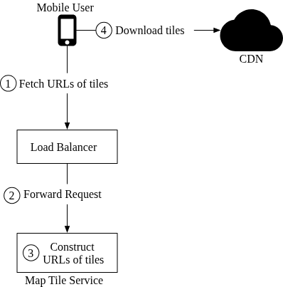

---

## Step 4 - Design Deep Dive

### 1. Data Model Strategy
The system manages four distinct categories of data, each requiring completely different database configurations due to divergent read/write patterns.

#### A. Routing Tiles (S3 Object Storage)
The graph data required for routing algorithms is derived from an offline, periodic **Routing Tile Processing Service** that transforms massive raw road datasets into optimized, hierarchical graph adjacency lists.
*   **Storage Decision:** Relational databases are inefficient for bulk binary graph data. Instead, adjacency lists are serialized into binary files and stored in **Object Storage (AWS S3)**.
*   **Indexing:** Files are organized in S3 using **Geohashes** as keys, allowing the routing service to rapidly download and cache the specific tiles it needs into memory.

#### B. User Location Data (Cassandra)
As millions of users navigate simultaneously, their devices blast constant GPS updates to the server. This data is critical for real-time traffic mapping.
*   **Storage Decision:** This is an extremely **Write-Heavy** workload. A NoSQL wide-column database like **Apache Cassandra** is chosen for its horizontal write scalability and lack of single-node bottlenecks.
*   **Schema Snippet:** `user_id` | `timestamp` | `user_mode` | `driving_mode` | `location (lat/lng)`

#### C. Geocoding Database (Redis)
Converts string addresses into exact (lat/lng) coordinates.
*   **Storage Decision:** The address-to-coordinate mapping represents a high-volume **Read-Heavy** workload with relatively infrequent updates. A fast, in-memory Key-Value store like **Redis** is ideal.

#### D. Precomputed Image Tiles (S3 + CDN)
As discussed in the High-Level design, rendering maps is computationally heavy.
*   **Storage Decision:** Images are pre-generated offline for all zoom levels, stored durably in **Amazon S3**, and served entirely through a **Global CDN** edge network.

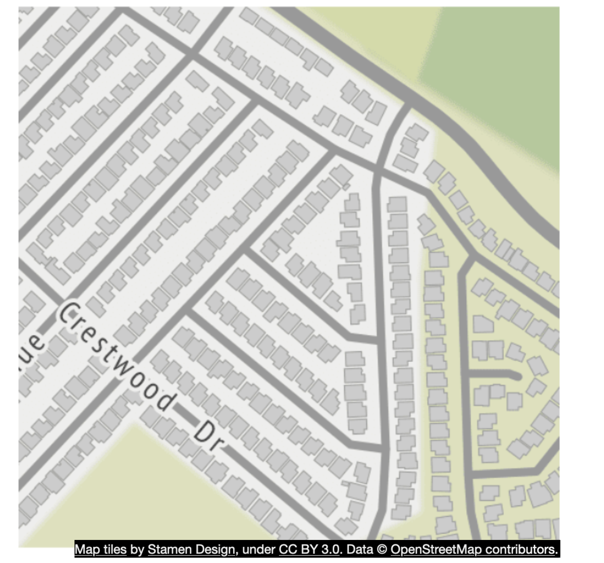

### 2. Location Service Deep Dive
The Location Service handles the massive 1M QPS influx of real-time GPS pings from mobile clients. 

#### Database Schema & Trade-offs
*   **CAP Theorem Application:** Because GPS points become stale within seconds, the system prioritizes **Availability and Partition Tolerance (AP)** over strict Consistency. 
*   **Cassandra Schema:** 
    *   **Partition Key:** `user_id`. This groups all records for a specific user onto the same physical node.
    *   **Clustering Key:** `timestamp`. This sorts the user's data chronologically on disk, making it extremely fast to perform range queries or fetch the "latest" known location.

#### Kafka Event Stream Integration
The raw GPS data is extremely valuable for more than just tracking individual users. The Location Service acts as a publisher, pushing incoming location updates into a high-throughput message queue (**Apache Kafka**).

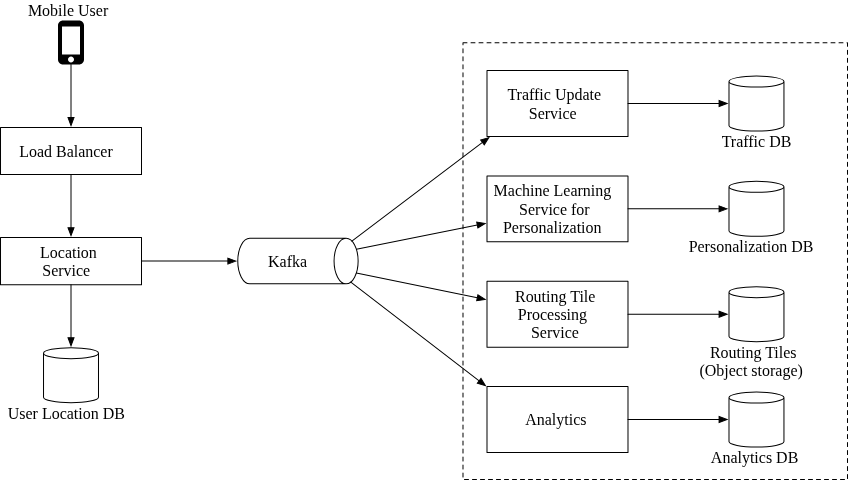

By using a streaming architecture, multiple backend services can consume the firehose of GPS data simultaneously without impacting the database:
1.  **Traffic Update Service:** Analyzes aggregated speeds across road segments to update the **Live Traffic Database**.
2.  **Routing Tile Processing Service:** Detects anomalies (like cars driving where there is no mapped road, or zero cars going across a bridge) to automatically deduce new road construction or road closures.
3.  **Machine Learning / Personalization:** Analyzes user commutes to suggest ETAs before the user asks.
4.  **Analytics Service:** Derives macro-level system metrics.

### 3. Map Rendering Deep Dive (The Vector Optimization)
While originally relying on precomputed static PNG images (rasterized tiles), modern map systems (utilizing WebGL) have transitioned to **Vector Tiles**.
*   **Bandwidth Efficiency:** Instead of sending an image, the server sends the mathematical paths and polygons of the roads and landmasses. Vector data compresses far better than PNGs.
*   **Smooth UX:** When a user zooms in on a raster image, it becomes stretched and pixelated until the next zoom-level tile loads. Vector tiles scale mathematically, providing a perfectly smooth, infinite-zoom experience on the client device.

### 4. Navigation Service Deep Dive
The Navigation Service is not a single monolith; it acts as an orchestrator that calls multiple specialized sub-services.

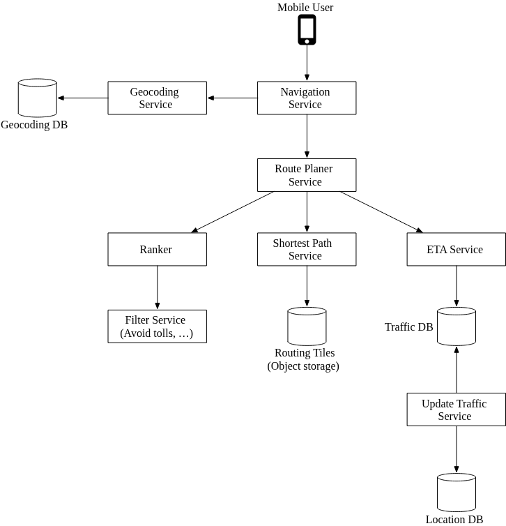

#### A. Geocoding Service
Before any math can happen, the user's string input (e.g., "1600 Amphitheatre Parkway") must be converted into physical coordinates. The Navigation Service calls the Geocoding API (backed by the Redis DB) to get the exact origin and destination Lat/Long pairs.

#### B. Route Planner Service
This is the core orchestrator. Once it has the coordinates, it kicks off the routing pipeline.

#### C. Shortest-Path Service
This service calculates the top-k structurally shortest paths from A to B.
*   **Static Data:** It computes paths mathematically based *only* on the road geometry, explicitly **ignoring traffic**.
*   **Highly Cacheable:** Because physical roads rarely move, the structural shortest paths between two city blocks can be heavily cached.
*   **Algorithm Execution:** It uses a variation of the **A* pathfinding algorithm**. 
    *   It inputs the origin Geohash and loads the local **Routing Tile** from S3.
    *   As the algorithm expands its search, it dynamically hydrates neighboring routing tiles.
    *   For long routes, it utilizes **Hierarchical Tiles** by jumping onto "highway" nodes, ignoring local street calculations until it nears the destination.

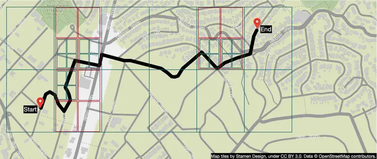

#### D. ETA Service
Once the structural paths are found, the ETA service takes over. It uses Machine Learning models backed by the **Traffic DB** to predicting how long the route will take, factoring in both current live traffic and historical predicted traffic for that time of day.

#### E. Ranker & Filter Service
The Ranker takes the routes and their ETAs and applies user-defined filters (e.g., "Avoid Tolls", "Avoid Highways"). It sorts the remaining valid routes from fastest to slowest and returns the Top-K options to the user.

### 5. Adaptive ETA & Rerouting
Navigation isn't static. If an accident happens 20 minutes into a 1-hour drive, the system must detect it and propose a faster route.

#### The State Management Challenge
How does the system know *which* of the millions of navigating users are affected by a crash in routing tile `r_2`?
*   **Naive Approach:** Loop cleanly through all active users and check if `r_2` is in their route array. Time complexity is `O(n * m)`. Way too slow.
*   **Optimized Approach (Hierarchical Filtering):** The database stores active routes hierarchically representing the zoom levels (e.g., Tile `r_1` belongs to County Tile `super(r_1)` which belongs to State Tile `super(super(r_1))`). If the accident is in California, the system instantly filters out the millions of active drivers in New York because their "Super Tile" does not match.

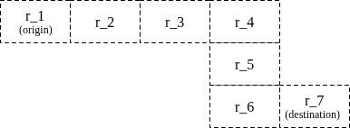
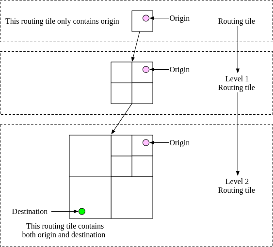

#### Client-Server Delivery Protocol
To push real-time traffic updates and new routes to the mobile app while driving:
*   **Mobile Push Notifications:** Rejected. The payload limit (e.g., 4KB on iOS) is too small for routing polygons.
*   **Long-Polling:** Rejected. Heavy footprint on the connection servers.
*   **Final Choice (WebSockets):** WebSockets are chosen over Server-Sent Events (SSE). While both push data efficiently, WebSockets provide bi-directional communication with low overhead, allowing the client to continuously stream GPS pings back on the exact same open connection.

---

## Final Architecture Wrap-Up

The final architecture seamlessly blends offline batch processing (Routing Tiles), Real-time Stream Processing (Kafka/Cassandra state mapping), and Edge Caching (Map Rendering CDN).

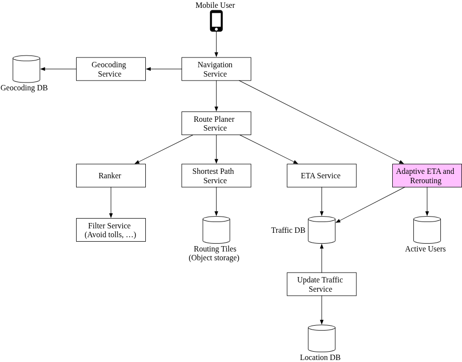

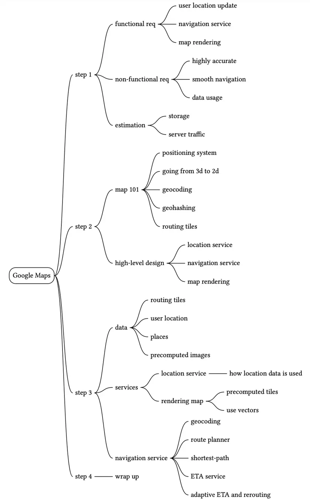

Reference Materials
[1] Google Maps: https://developers.google.com/maps?hl=en_US

[2] Google Maps Platform: https://cloud.google.com/maps-platform/

[3] Stamen Design: http://maps.stamen.com

[4] OpenStreetMap: https://www.openstreetmap.org

[5] Prototyping a Smoother Map:
https://medium.com/google-design/google-maps-cb0326d165f5

[6] Mercator projection: https://en.wikipedia.org/wiki/Mercator_projection

[7] Peirce quincuncial projection:
https://en.wikipedia.org/wiki/Peirce_quincuncial_projection

[8] Gall–Peters projection: https://en.wikipedia.org/wiki/Gall–Peters_projection

[9] Winkel tripel projection: https://en.wikipedia.org/wiki/Winkel_tripel_projection

[10] Address geocoding: https://en.wikipedia.org/wiki/Address_geocoding

[11] Geohashing:
https://kousiknath.medium.com/system-design-design-a-geo-spatial-index-for-real-time-location-search-10968fe62b9c

[12] HTTP keep-alive: https://en.wikipedia.org/wiki/HTTP_persistent_connection

[13] Directions API: https://developers.google.com/maps/documentation/directions/start?hl=en_US

[14] Adjacency list: https://en.wikipedia.org/wiki/Adjacency_list

[15] CAP theorem: https://en.wikipedia.org/wiki/CAP_theorem

[16] ETAs with GNNs:
https://deepmind.com/blog/article/traffic-prediction-with-advanced-graph-neural-networks

[17] Google Maps 101: How AI helps predict traffic and determine routes:
https://blog.google/products/maps/google-maps-101-how-ai-helps-predict-traffic-and-determine-routes/