### Chapter: Hotel Reservation System (System Design Interview Vol 2)

This chapter focuses on designing a hotel reservation system for a large hotel chain. The architectural patterns discussed here are also applicable to other booking systems like Airbnb, flight reservations, and movie ticket booking.

#### Step 1 - Understand the Problem and Establish Design Scope

**Requirements Gathered:**
*   **Scale:** 5,000 hotels and 1 million total rooms.
*   **Payment:** Customers pay in full when making the reservation.
*   **Channels:** Booking happens exclusively via the hotel website or app.
*   **Cancellations:** Supported.
*   **Overbooking:** Supported. The system allows booking up to 110% capacity to account for expected cancellations.
*   **Pricing:** Dynamic pricing is supported (prices change daily based on anticipated demand).
*   **Out of Scope:** Search functionality.

**Functional Requirements:**
1.  Show hotel-related pages.
2.  Show hotel room-related detail pages.
3.  Reserve a room.
4.  Admin panel to add/remove/update hotel or room info.
5.  Support the 10% overbooking feature.

**Non-Functional Requirements:**
1.  **High Concurrency:** Capable of handling massive surges during peak seasons or event days.
2.  **Moderate Latency:** Must be reasonably fast, though processing a reservation could take a few seconds if necessary.

#### Back-of-the-Envelope Estimation

*   **Total Inventory:** 5,000 hotels $\rightarrow$ 1,000,000 rooms.
*   **Utilization:** Assume 70% occupancy with an average stay of 3 days.
*   **Daily Reservations:** $(1,000,000 \times 0.70) \div 3 = \sim 240,000$ daily reservations.
*   **Reservation TPS (Transactions Per Second):** $240,000 \div 10^5 \text{ seconds} = \sim 3 \text{ TPS}$.
    *   *Observation:* The average write transaction rate is extremely low.

**The Reservation Funnel (QPS Distribution):**
The typical workflow acts as a 10% conversion funnel:
1.  **View Detail Page:** User browses listings $\rightarrow \sim 300 \text{ QPS}$.
2.  **View Booking Page:** User confirms details/payment $\rightarrow \sim 30 \text{ QPS}$ (10% of View).
3.  **Reserve Room:** User submits transaction $\rightarrow \sim 3 \text{ TPS}$ (10% of Booking Page).

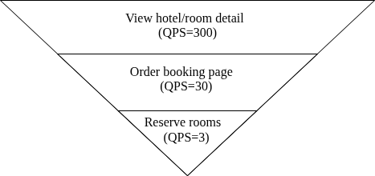

---

### Step 2 - Propose High-Level Design and Get Buy-In

#### API Design

The APIs follow standard REST conventions. Search APIs are excluded as they form a separate architectural challenge.

**1. Hotel APIs (Admin focus)**
*   `GET /v1/hotels/{ID}`: Details about a hotel.
*   `POST /v1/hotels`: Create hotel.
*   `PUT /v1/hotels/{ID}`: Update hotel.
*   `DELETE /v1/hotels/{ID}`: Delete hotel.

**2. Room APIs (Admin focus)**
*   `GET /v1/hotels/{ID}/rooms/{ID}`
*   `POST /v1/hotels/{ID}/rooms`
*   `PUT /v1/hotels/{ID}/rooms/{ID}`
*   `DELETE /v1/hotels/{ID}/rooms/{ID}`

**3. Reservation APIs (Client focus)**
*   `GET /v1/reservations`: Get logged-in user's history.
*   `GET /v1/reservations/{ID}`: Specific reservation details.
*   `POST /v1/reservations`: Make a new reservation.
*   `DELETE /v1/reservations/{ID}`: Cancel reservation.

**POST /v1/reservations payload example:**
```json
{
  "startDate": "2021-04-28",
  "endDate": "2021-04-30",
  "hotelID": "245",
  "roomID": "U12354673389",
  "reservationID": "13422445" 
}
```
*Note:* The `reservationID` parameter is generated by the client and sent in the payload to act as an **idempotency key** to prevent double-charging or double-booking during network retries.

#### Data Model

**Database Choice: Relational Database (RDBMS)**
A relational database like MySQL or PostgreSQL is the optimal choice for a reservation system for three reasons:
1.  **Read-Heavy Workload:** The volume of users browsing the hotel site is orders of magnitude higher than those making reservations. RDBMS handles read-heavy loads exceptionally well.
2.  **ACID Guarantees:** A reservation system hinges on accuracy. Without Atomicity, Consistency, Isolation, and Durability, the system is exposed to negative balances, double-charges, and double-bookings.
3.  **Data Structure:** The relationships between Hotels, Rooms, Guests, and Reservations are highly structured and strictly relational.

**Initial Schema Design (The Flawed Approach)**

A natural first instinct is to design four tables:
1.  `hotel` (hotel_id, name, address, location)
2.  `room_type_rate` (hotel_id, date, rate)
3.  `guest` (guest_id, first_name, last_name, email)
4.  `reservation` (reservation_id, hotel_id, **room_id**, start_date, end_date, status, guest_id)

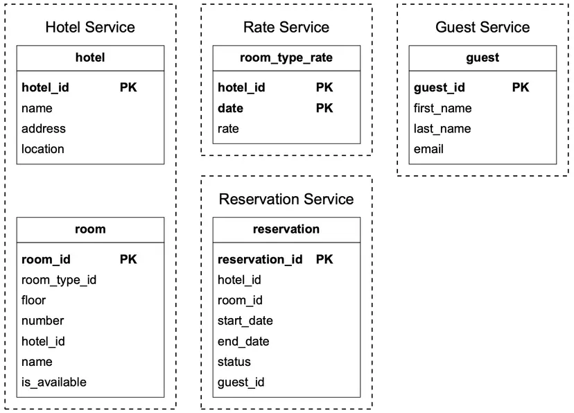

The `status` field follows a standard state machine:
`Pending -> Paid -> (Refunded)` or `Pending -> Canceled / Rejected`

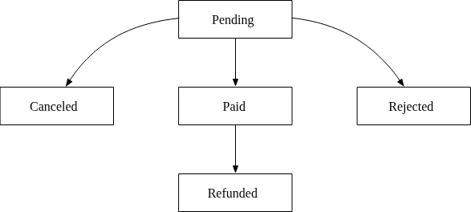

**The Flaw in this Schema:**
This schema requires a `room_id` when making a reservation. This works seamlessly for Airbnb (where you book a specific physical house/listing), but **hotels do not book specific physical rooms at checkout**. You reserve a *Room Type* (e.g., "Standard King Bed"), and the specific physical room number (`room_id`) is only assigned at the front desk during check-in.

The schema must be fundamentally altered to track overlapping *inventory counts for room types* rather than specific room IDs.

#### High-Level Design

The system relies on a **Microservice Architecture**—a standard, high-scalability approach used by Amazon, Netflix, and Uber.

**Core Architecture Components:**

1.  **CDN (Content Delivery Network):** Caches all static assets (HTML, JS, CSS, images) near the user's geographic location to minimize load times.
2.  **Public API Gateway:** 
    *   Acts as the public entry point.
    *   Handles Rate Limiting, Authentication, and Request Routing.
    *   Routes to the correct microservice (e.g., booking requests map strictly to the Reservation Service).
3.  **Internal APIs:**
    *   Accessible only to authorized staff through VPNs or secure internal software.
    *   Connects admins to the Hotel Management Service.
4.  **Microservices:**
    *   **Hotel Service:** Serves details about hotels and room types. Data is relatively static and sits behind a `Hotel Cache`.
    *   **Rate Service:** Provides the dynamic room rates for future dates (prices change based on anticipated occupancy).
    *   **Reservation Service:** Tracks room inventory and executes reservation logic.
    *   **Payment Service:** Processes transactions and updates the system state (`Paid` or `Rejected`).
    *   **Hotel Management Service (Admin):** Allows staff to force-override the system (e.g., manually cancel a reservation, refund a customer, or block off out-of-order rooms).

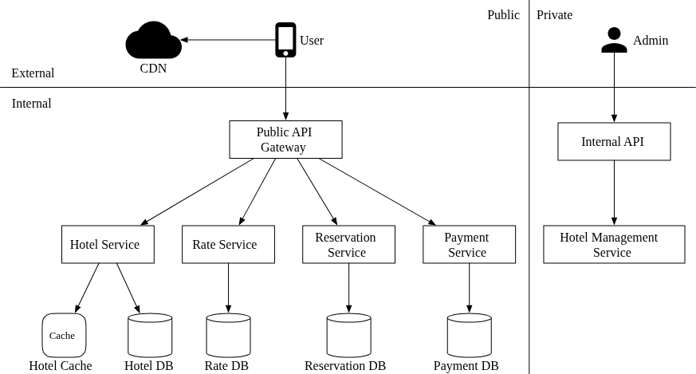

**Inter-Service Communication:**
The microservices communicate with one another under the hood. While Figure 4 shows them as isolated, they are heavily intertwined. 
*   *Example:* The Reservation Service must call the Rate Service to calculate the final bill before hitting the Payment Service.
*   *Implementation:* High-performance Remote Procedure Call (RPC) frameworks like **gRPC** are standard for this internal communication to reduce latency overhead.

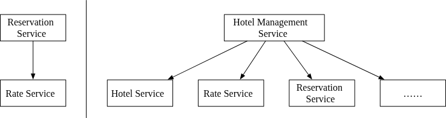

---

### Step 3 - Design Deep Dive

#### Improved Data Model

The key insight: hotels book **Room Types**, not specific physical rooms. The API and schema must reflect this.

**Updated API payload:**
```json
{
  "startDate": "2021-04-28",
  "endDate": "2021-04-30",
  "hotelID": "245",
  "roomTypeID": "12354673389",
  "roomCount": "3",
  "reservationID": "13422445"
}
```

**Updated Schema (Key Tables):**

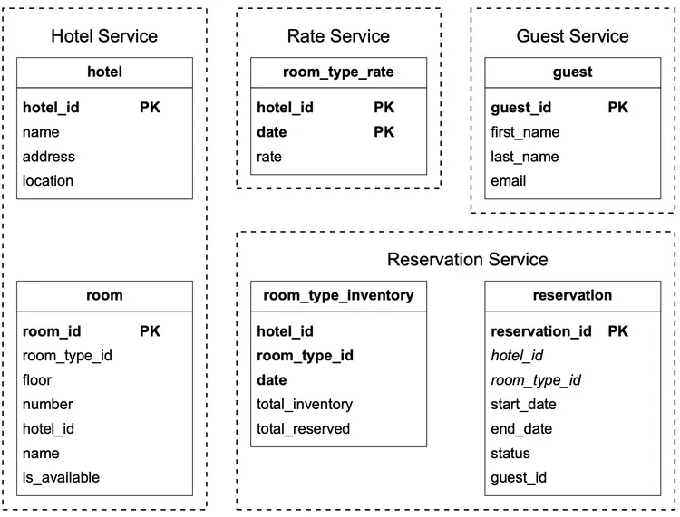

1.  `room`: Physical room info (`room_id`, `room_type_id`, `floor`, `number`, `hotel_id`, `is_available`).
2.  `room_type_rate`: Dynamic pricing per room type per day (`hotel_id`, `date`, `rate`).
3.  `reservation`: Updated to use `room_type_id` instead of `room_id` (`reservation_id`, `hotel_id`, `room_type_id`, `start_date`, `end_date`, `status`, `guest_id`).
4.  **`room_type_inventory`** *(Most Critical Table)*:
    *   **Composite PK:** (`hotel_id`, `room_type_id`, `date`)
    *   `total_inventory`: Total rooms of this type minus those pulled for maintenance.
    *   `total_reserved`: The count of rooms already booked for this specific (hotel, type, date) tuple.
    *   **Pre-populated:** Rows are generated for all dates within 2 years into the future. A daily cron job extends this window as days pass.

**Sample `room_type_inventory` Data:**

| hotel_id | room_type_id | date | total_inventory | total_reserved |
| :--- | :--- | :--- | :--- | :--- |
| 211 | 1001 | 2021-06-01 | 100 | 80 |
| 211 | 1001 | 2021-06-02 | 100 | 82 |
| 211 | 1001 | 2021-06-03 | 100 | 86 |
| 211 | 1002 | 2021-06-01 | 200 | 16 |
| 2210 | 101 | 2021-06-01 | 30 | 23 |

**Reservation Availability Check:**
```sql
SELECT date, total_inventory, total_reserved
FROM room_type_inventory
WHERE room_type_id = ${roomTypeId} AND hotel_id = ${hotelId}
  AND date BETWEEN ${startDate} AND ${endDate}
```
For each row returned, the application checks:
```
if (total_reserved + numberOfRoomsToReserve) <= total_inventory
```
**Supporting 10% Overbooking** is trivially easy with this schema:
```
if (total_reserved + numberOfRoomsToReserve) <= 1.10 * total_inventory
```

**Storage Estimation:**
$5,000 \text{ hotels} \times 20 \text{ room types} \times 730 \text{ days (2 years)} = 73 \text{ million rows}$. 
This comfortably fits a single database, but replicas across regions/availability zones are needed for high availability.

**Scaling Strategies (if data grows too large):**
1.  **Archive Historical Data:** Only store current and future reservations in the hot database. Move past reservations to cold storage.
2.  **Database Sharding:** Use `hash(hotel_id) % N` as the shard key, since both making and looking up reservations always start with selecting a hotel.

#### Concurrency Issues

Two distinct concurrency problems must be solved:
1.  **Same user clicks "Book" multiple times** (double-booking by one user).
2.  **Multiple users book the same room type at the same time** (race condition).

##### Problem 1: Double-Clicking the "Book" Button

If a user clicks "Complete my booking" twice rapidly, the system could insert two identical reservation rows.

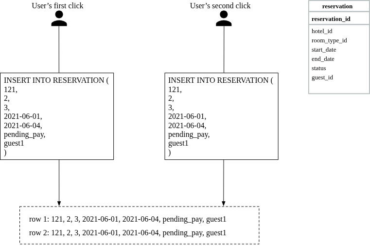

**Solutions:**
1.  **Client-Side:** Disable/gray out the submit button after the first click. Unreliable (users can disable JavaScript).
2.  **Idempotent API (Server-Side, Recommended):** Use the `reservation_id` as an **idempotency key** and as the **primary key** of the `reservation` table. The flow:
    1.  User fills in details and clicks "Continue."
    2.  The Reservation Service generates a globally unique `reservation_id` and returns it to the UI as part of the confirmation page.
    3.  User clicks "Complete my booking." The `reservation_id` is sent with the `POST` request.
    4.  If the user clicks again, the same `reservation_id` is sent. The database rejects the second `INSERT` because of the **unique constraint violation** on the primary key.

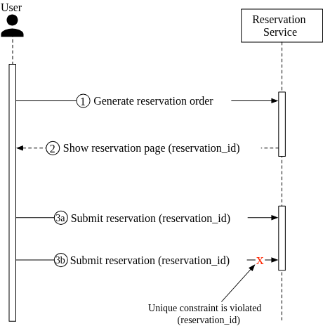
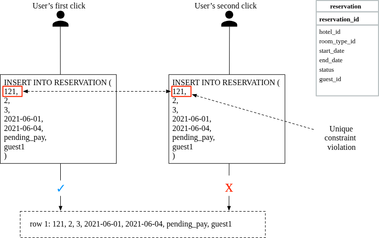

##### Problem 2: Race Condition (Last Room, Two Users)

Consider: 100 rooms of a type exist, 99 are reserved, and User 1 and User 2 both try to book the last room simultaneously.

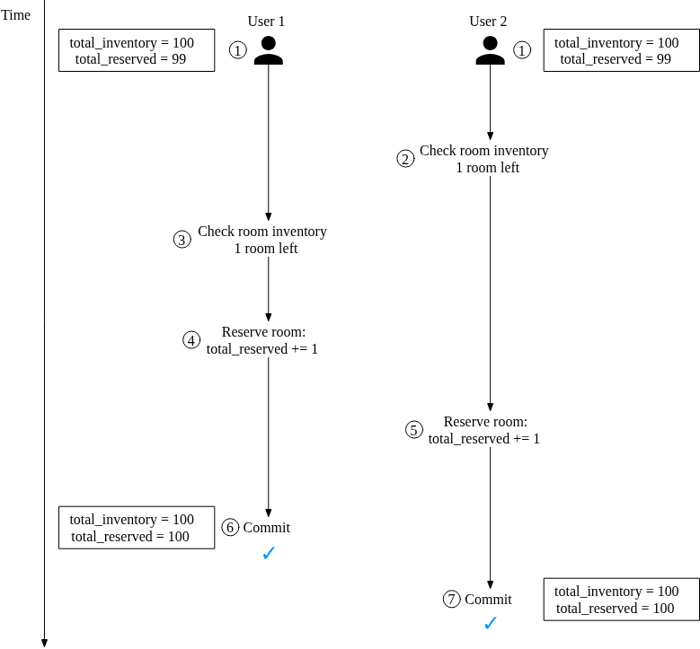

**The Race Condition Step-by-Step:**
1.  Both Transaction 1 (User 1) and Transaction 2 (User 2) read `total_reserved = 99`.
2.  Both check: $(99 + 1) \leq 100$ → `true`. Both see 1 room available.
3.  Transaction 1 updates `total_reserved = 100` and commits.
4.  Transaction 2 **still sees the old snapshot** (`total_reserved = 99`) due to database isolation. It also updates `total_reserved = 100` and commits.
5.  **Result:** Both users "successfully" book the room. The system has overbooked beyond the allowed limit.

**The SQL Pseudo-Code (Vulnerable Version):**
```sql
-- Step 1: Check room inventory
SELECT date, total_inventory, total_reserved
FROM room_type_inventory
WHERE room_type_id = ${roomTypeId} AND hotel_id = ${hotelId}
  AND date BETWEEN ${startDate} AND ${endDate};

-- Application-level check (for each row):
-- if (total_reserved + numberOfRoomsToReserve) > 1.10 * total_inventory → Rollback

-- Step 2: Reserve rooms
UPDATE room_type_inventory
SET total_reserved = total_reserved + ${numberOfRoomsToReserve}
WHERE room_type_id = ${roomTypeId}
  AND date BETWEEN ${startDate} AND ${endDate};

COMMIT;
```

The fundamental issue is the **check-then-act** pattern: the `SELECT` (check) and `UPDATE` (act) are not atomic. Three locking strategies can fix this:
1.  **Pessimistic Locking**
2.  **Optimistic Locking**
3.  **Database Constraints**

##### Locking Strategy 1: Pessimistic Locking
Pessimistic locking prevents simultaneous updates by placing an exclusive lock on the database row during the `SELECT` phase, holding it until the transaction commits.

*   **Implementation:** Append `FOR UPDATE` to the `SELECT` statement.
*   **Behavior:** If Transaction 1 selects the row, Transaction 2 must wait until Transaction 1 commits before its `SELECT` query returns.
*   **Pros:** Serializes updates perfectly. Very safe.
*   **Cons:** 
    *   Creates a massive bottleneck. Transactions waiting on locks degrade database throughput significantly.
    *   High risk of deadlocks if multiple resources are locked in different orders.
*   **Verdict:** **Not recommended** for this system due to negative impact on scalability.

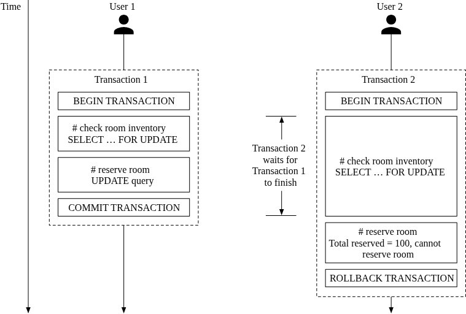

##### Locking Strategy 2: Optimistic Locking
Optimistic concurrency control assumes conflicts are rare. It allows concurrent reads but prevents concurrent writes if the underlying data has changed.

*   **Implementation:** Add a `version` column to the table.
    *   Read the row, noting its `version`.
    *   Update the row *only if* the `version` hasn't changed, and increment the `version`.
    *   If the version changed, the update fails and the application must retry.
*   **Pros:** Fast under normal loads because there are no database locks to manage.
*   **Cons:** Degrades rapidly under heavy contention. If 100 people try to book the last room, 1 succeeds and 99 fail and trigger retry loops, thrashing the application servers.
*   **Verdict:** **Recommended**. Since hotel booking QPS is generally low, conflicts are rare enough that the performance benefits outweigh the retry penalties.

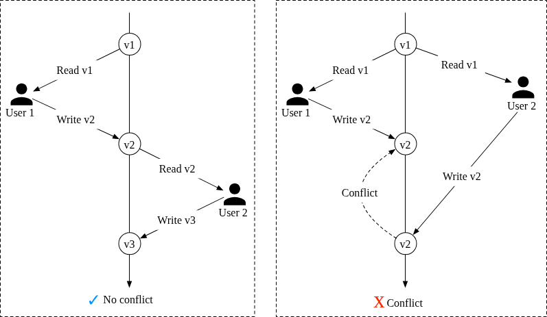

##### Locking Strategy 3: Database Constraints
A highly elegant approach that offloads the logic to the database engine via a mathematical constraint.

*   **Implementation:** Add a schema constraint ensuring inventory never drops below zero.
    ```sql
    CONSTRAINT `check_room_count` CHECK((`total_inventory - total_reserved` >= 0))
    ```
*   **Behavior:** Both transactions read the same data and fire `UPDATE` statements simultaneously. The database engine executes them sequentially. The first one pushes `total_reserved` to the max limit. When the second `UPDATE` fires, the constraint evaluates to false and the database natively throws an error, rolling back the second transaction.
*   **Pros:** Extremely easy to implement. Works incredibly well with low contention.
*   **Cons:** 
    *   Like optimistic locking, high contention generates a massive volume of failures.
    *   Constraints are harder to version control than application code.
    *   Not universally supported across all database engines (can complicate migrations).
*   **Verdict:** **Recommended**. A very viable and simple alternative to Optimistic Locking for low-QPS systems like hotel reservations.

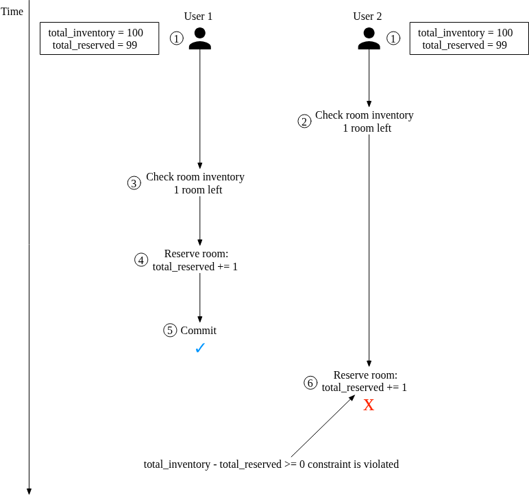

#### Scaling the System (Booking.com / Expedia Scale)

If the system must handle the traffic of a global travel aggregator (where QPS could easily be 1000x higher than a single hotel chain), the database will quickly become the bottleneck. 

##### 1. Database Sharding
To scale the relational database, we must split the data across multiple database servers (shards).
*   **Sharding Key:** `hotel_id`. Almost every query in the system starts by filtering down to a specific hotel.
*   **Routing Logic:** Use modulo routing (e.g., `hash(hotel_id) % 16`).
*   **Result:** If peak QPS is 30,000, splitting across 16 shards reduces the load to $\sim 1,875 \text{ QPS}$ per shard, which is well within the acceptable read/write limits of a standard MySQL server.

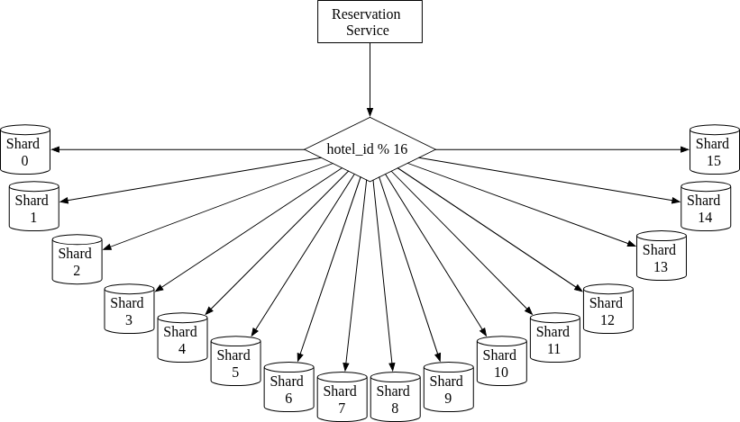

##### 2. Caching (Redis)
Since users only book rooms in the *future*, historical inventory data is irrelevant to the live booking flow. Furthermore, booking systems are massively read-heavy (checking availability) and rarely write-heavy.

We can place a **Redis Cache** in front of the database:
*   **Data Structure:** Key-Value store.
    *   `key`: `hotelID_roomTypeID_{date}`
    *   `value`: integer (number of available rooms)
*   **Eviction:** Use TTL (Time-To-Live) to automatically expire data once the date passes. Combine with LRU (Least Recently Used) to manage memory efficiently.
*   **Flow:** 
    1. Check inventory hits Redis $\rightarrow$ Sub-millisecond response.
    2. Reserve room hits the persistent Database (Source of Truth).
    3. The database update propagates asynchronously back up to Redis.

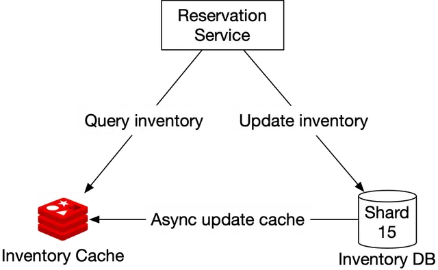

##### The Cache Consistency Challenge
Because the database is updated first and the cache is updated asynchronously (either via application-level hooks or CDC/Change Data Capture via Debezium), there is a brief window of **Data Inconsistency**.

*   *Scenario:* Redis says 1 room is available. Two users try to book it. 
*   *Outcome:* Both requests hit the database. The database executes the constraint check (`total_inventory - total_reserved >= 0`). Only the first transaction succeeds. The second user receives an error.
*   *Conclusion:* **It doesn't matter if the cache is eventually consistent**, as long as the relational database acts as the ultimate gatekeeper and final source of truth. The slight UX hit of a user receiving a "Room no longer available" error during heavy contention is a worthwhile trade-off for the massive scalability gains of the cache.

#### Data Consistency in Microservices

In a **Monolithic Architecture**, maintaining consistency is simple: different operations (e.g., updating inventory and creating a reservation record) can be wrapped in a single, atomic database transaction. If any part fails, the entire transaction rolls back.

This is why, pragmatically, this system design chose a hybrid approach: the Reservation Service manages *both* the reservation tables and the inventory tables inside the same underlying relational database. This allows us to use traditional ACID capabilities.

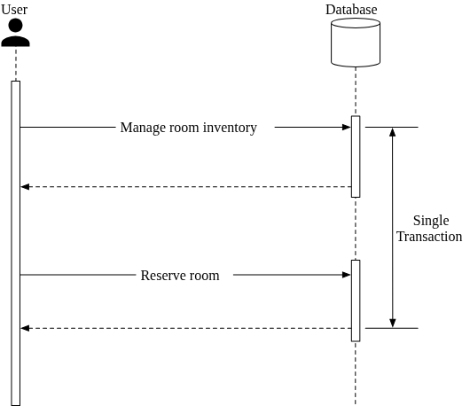

##### The Pure Microservice Conundrum
If an interviewer is a "microservice purist," they will argue that the Reservation Service and Inventory Service must be decoupled, meaning they must operate on **separate, isolated databases**. 

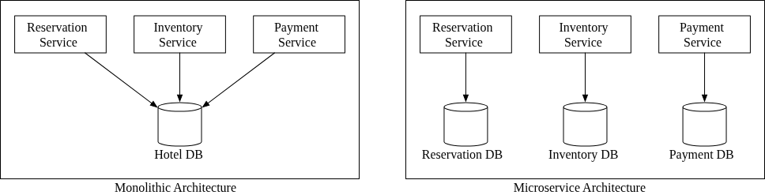

This introduces severe data consistency risks. An operation spanning multiple services cannot utilize a standard database transaction. If the Reservation Database updates successfully, but the network drops before the Inventory Database can be updated, the system falls out of sync.

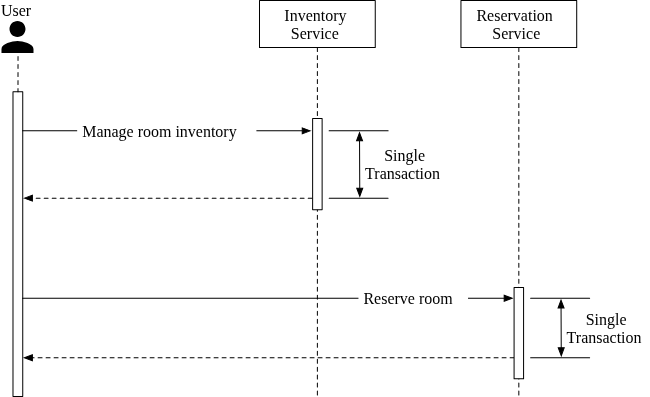

**Industry Solutions for Distributed Transactions:**
If forced into a pure microservice architecture, you must manage distributed transactions using two main patterns:

1.  **Two-Phase Commit (2PC):** A protocol that guarantees atomic commits across multiple nodes.
    *   *Flaw:* It is a blocking protocol. If a single node fails, it blocks progress until recovered. It is highly non-performant and rarely used in modern scalable systems.
2.  **Saga Pattern:** A sequence of local transactions. Each transaction step publishes an event/message triggering the next step.
    *   *Flaw:* If a step fails mid-sequence, the system must execute **compensating transactions** to explicitly undo the previous steps. It relies on *eventual consistency* rather than strict ACID compliance, and exponentially increases system complexity.

**Verdict:** Distributed transactions add massive engineering complexity. For a hotel reservation system, breaking microservice purist rules by sharing the underlying database is the pragmatic, recommended approach.

---

### Step 4 - Wrap Up

This chapter designed a Real-Time Hotel Reservation System capable of handling millions of rooms and high-concurrency event bookings.

**Key Takeaways:**
*   **Data Modeling:** Switching from `room_id` to `room_type_id` and pre-populating an `inventory` table is critical for hotel logic.
*   **Concurrency:** Demonstrated the danger of check-then-act race conditions, solving them using **Database Constraints** (and discussing **Optimistic Locking**). Double-bookings were handled via **API Idempotency** (`reservation_id`).
*   **Scalability:** Discussed modulo **Database Sharding** and fronting the read-heavy DB with a TTL-enabled **Redis Cache**.
*   **Microservices:** Outlined the architecture while making a pragmatic case *against* pure distributed databases to avoid the operational nightmare of Sagas and 2PC.

---
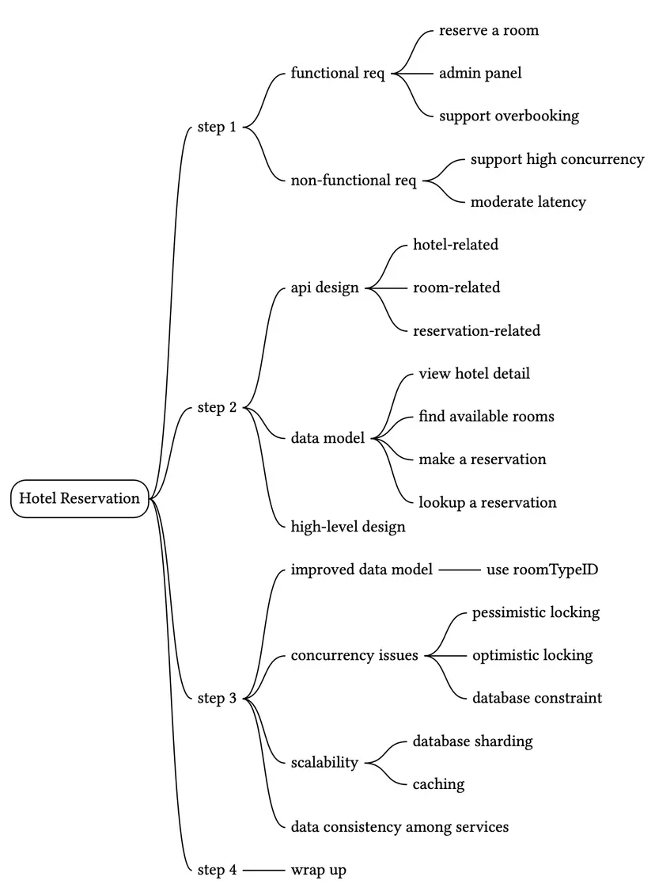

Reference Material
[1] Microservices: https://en.wikipedia.org/wiki/Microservices

[2] What Are The Benefits of Microservices Architecture?:
https://www.appdynamics.com/topics/benefits-of-microservices

[3] gRPC: https://www.grpc.io/docs/what-is-grpc/introduction/

[4] Source: Booking.com iOS app

[5] Serializability: https://en.wikipedia.org/wiki/Serializability

[6] Optimistic and pessimistic record locking: https://www.ibm.com/docs/en/rational-clearquest/10.0.7?topic=clearquest-optimistic-pessimistic-record-locking

[7] Optimistic concurrency control: https://en.wikipedia.org/wiki/Optimistic_concurrency_control

[8] Change data capture: https://docs.oracle.com/cd/B10500_01/server.920/a96520/cdc.htm

[9] Debezium: https://debezium.io/

[10] Redis sink: https://debezium.io/documentation/reference/stable/operations/debezium-server.html

[11] Monolithic Architecture: https://microservices.io/patterns/monolithic.html

[12] Two-phase commit protocol: https://en.wikipedia.org/wiki/Two-phase_commit_protocol

[13] Saga: https://microservices.io/patterns/data/saga.html


