### Chapter: Real-time Gaming Leaderboard (System Design Interview Vol 2)

This chapter focuses on designing a real-time leaderboard for an online mobile game. A leaderboard ranks competitors (players or teams) based on their scores (points).

#### Step 1 - Understand the Problem and Establish Design Scope

**Requirements Gathered:**
*   **Scoring Mechanism:** Users earn 1 point per match won. Simple point accumulation.
*   **Participants:** All users are included in the leaderboard.
*   **Timeframe:** Leaderboards are reset monthly (new tournament every month).
*   **Display:**
    *   Top 10 users overall.
    *   The specific rank of the inquiring user.
    *   Bonus: Display 4 users above and 4 beneath the inquiring user.
*   **Scale:**
    *   5 million Daily Active Users (DAU).
    *   25 million Monthly Active Users (MAU).
    *   Average 10 matches played per user per day.
*   **Ties:** Users with the same score share the same rank (tie-breaking strategies can be discussed later).
*   **Real-time:** Updates must be reflected in real-time or near real-time. Batched historical results are not acceptable.

**Functional Requirements:**
1.  Display top 10 players.
2.  Show a specific user's rank.
3.  Display players +4 and -4 places relative to a desired user.

**Non-Functional Requirements:**
1.  **Real-time Updates:** Scores must update in real-time.
2.  **Scalability:** Must handle 5M DAU / 25M MAU computing and retrieving ranks.
3.  **Availability & Reliability:** Standard high-availability constraints for a large-scale gaming platform.

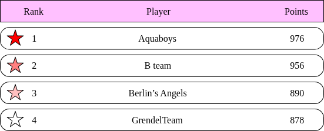

#### Back-of-the-Envelope Estimation

*   **Users per Second:**
    *   $5,000,000 \text{ DAU} \div 10^5 \text{ seconds/day} = \sim 50 \text{ average users/sec}$.
    *   **Peak Users:** Assume peak load is $5\times$ the average $\rightarrow 250 \text{ peak users/sec}$.
*   **Update Score QPS:**
    *   Average QPS: $50 \text{ users/sec} \times 10 \text{ games/day} = \sim 500 \text{ QPS}$.
    *   Peak QPS: $500 \times 5 = 2,500 \text{ QPS}$.
*   **Fetch Leaderboard QPS:**
    *   Assuming top 10 is fetched once per day per user (on game load): $\sim 50 \text{ QPS}$.

---

### Step 2 - Propose High-Level Design and Get Buy-In

#### API Design

We need three main APIs to drive the leaderboard:

**1. `POST \/v1\/scores`**
*   **Purpose:** Updates a user’s position on the leaderboard when they win a game.
*   **Security:** This must be an **internal API** called by game servers, not directly by clients (to prevent cheating).
*   **Parameters:** `user_id`, `points`.
*   **Response:** `200 OK` or `400 Bad Request`.

**2. `GET \/v1\/scores`**
*   **Purpose:** Fetches the top 10 players from the leaderboard.
*   **Response payload:**
```json
{
  "data": [
    { "user_id": "user_id1", "user_name": "alice", "rank": 1, "score": 12543 },
    { "user_id": "user_id2", "user_name": "bob", "rank": 2, "score": 11500 }
  ],
  "total": 10
}
```

**3. `GET \/v1\/scores\/{user_id}`**
*   **Purpose:** Fetches the exact rank and score of a specific user.
*   **Response payload:**
```json
{
    "user_info": {
        "user_id": "user5",
        "score": 1000,
        "rank": 6
    }
}
```

#### High-Level Architecture

The system consists of two primary microservices: the **Game Service** and the **Leaderboard Service**.

**The Execution Flow:**
1.  **Win a Game:** When a player wins a game, their client sends a request to the Game Service.
2.  **Validate & Notify:** The Game Service validates the win. If valid, the Game Service sends an "Update Score" internal request to the Leaderboard Service.
3.  **Persist Score:** The Leaderboard Service updates the user's score in the Leaderboard Store (database).
4.  **Fetch Data:** For displaying the data, the client securely queries the Leaderboard Service directly to get:
    *   (a) The Top 10 Leaderboard.
    *   (b) The specific player's rank.

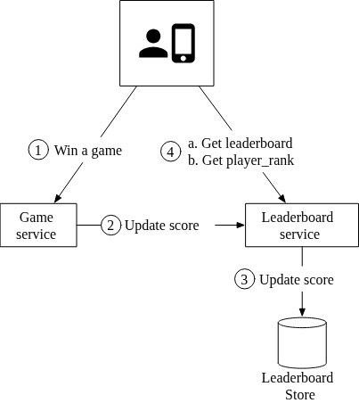

**Design Alternatives Considered & Rejected:**

1.  **Why can't the client talk to the Leaderboard Service directly to set scores?**
    *   If the client directly hits a `POST /v1/scores` endpoint on the Leaderboard Service, it is extremely vulnerable to **Man-In-The-Middle (MITM) attacks** and packet sniffing/proxying. Users could easily forge score updates. 
    *   *Rule of Thumb:* Client sets score = Vulnerable. Server sets score = Secure.
    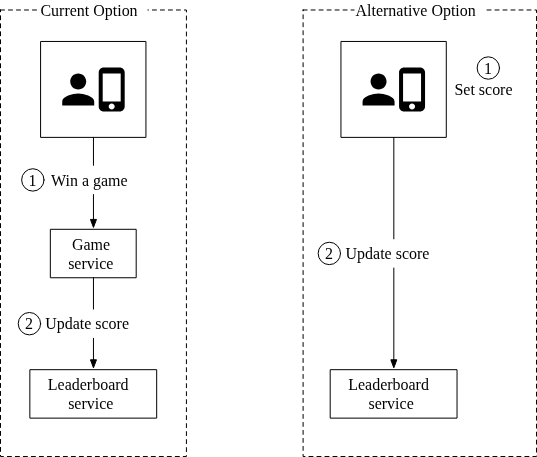

2.  **Do we need a Message Queue (Kafka) between the Game Service and Leaderboard Service?**
    *   If the score data is *only* used for this leaderboard, an explicit API call is simpler and sufficient.
    *   However, if the win event needs to trigger multiple distinct downstream behaviors (e.g., Leaderboard Service, Analytics Service, Push Notification Service for multiplayer interactions), introducing a message queue like **Apache Kafka** is highly recommended. For the scope of this baseline interview question, it's considered over-engineering unless multiple downstream consumers are explicitly required.
    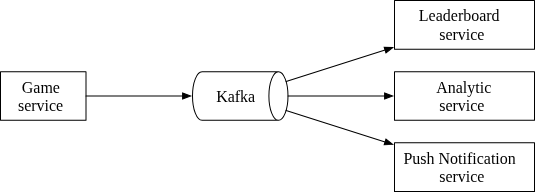

#### Data Models: Relational Database Solution (Naive Approach)

Before jumping to scalable solutions like Redis or NoSQL, it's helpful to explore the simplest approach: a Relational Database System (RDS).

**Schema:**
A simple table representing the current month's leaderboard.
*   `user_id` (varchar)
*   `score` (int)

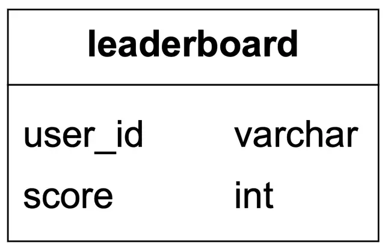

**Scoring a Point:**
When a user wins, we either insert a new record or update an existing one.
```sql
-- First time win
INSERT INTO leaderboard (user_id, score) VALUES ('mary1934', 1);

-- Subsequent wins
UPDATE leaderboard SET score = score + 1 WHERE user_id = 'mary1934';
```


**Fetching Ranking:**
To fetch the leaderboard, we must sort the entire table by score.
```sql
SELECT (@rownum := @rownum + 1) AS rank, user_id, score
FROM leaderboard
ORDER BY score DESC;
-- We can add LIMIT 10 to optimize fetching the top 10 players.
```


**Why RDS Fails at Scale:**
*   **Performance:** Sorting millions of rows takes 10s of seconds, which violates the real-time requirement.
*   **Table Scans:** Figuring out the rank of an arbitrary user (e.g., heavily ranked in the middle) requires scanning massive amounts of data because the DB must correctly position them relative to every other user.
*   **High Write Load:** The DB cannot cache the sorted list efficiently because the data (scores) is constantly changing with thousands of updates per second.

An RDS works for a *batched* leaderboard calculation (e.g., computing once a day), but not for a real-time, highly concurrent leaderboard.

#### Data Models: Redis Solution

To achieve predictable performance for millions of users with sub-millisecond retrieval, an in-memory data store like **Redis** is ideal. Redis offers a specific data structure perfect for this: **Sorted Sets**.

##### What are Sorted Sets?
A sorted set is a variant of a standard set where each member is associated with a **score**. 
*   **Members:** Must be unique (e.g., `user_id`).
*   **Scores:** May repeat and are used to rank the members.

Under the hood, a Redis Sorted Set uses two data structures:
1.  **Hash Table:** Maps members to scores.
2.  **Skip List:** Maps scores to members.

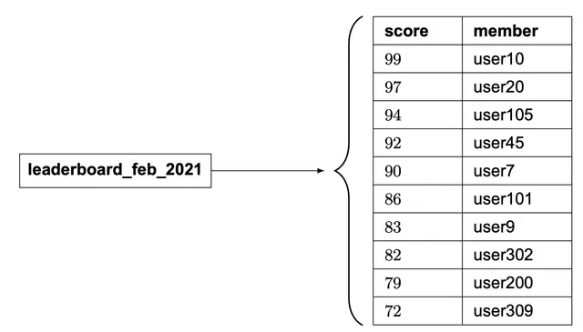

##### Understanding the Skip List
A **Skip List** allows logarithmic `O(log(n))` search, insertion, and removal (similar to binary search) over a sorted linked list. It achieves this by adding multi-level indexes that "skip" nodes.
*   The base level is a standard sorted linked list.
*   Level 1 skips every other node.
*   Level 2 skips every other node of Level 1.
*   This hierarchy allows fast traversal to the middle of the list.

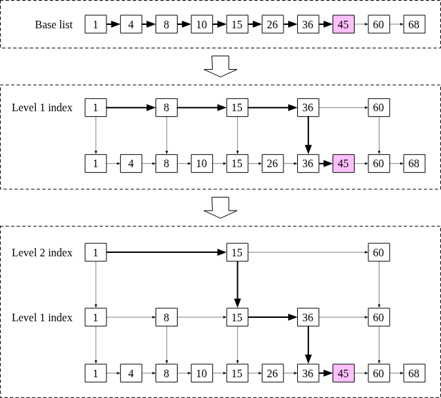
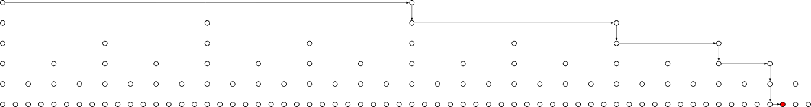

##### Redis Operations for Leaderboards

Sorted sets naturally calculate rankings during inserts/updates, making operations incredibly fast `O(log(n))`, compared to the table-scan approach of an RDS.

*   `ZADD`: Insert a user if they don't exist, or update their score if they do.
*   `ZINCRBY`: Increment a user's score by a specified amount (starts at 0 if the user doesn't exist).
*   `ZRANGE` / `ZREVRANGE`: Fetch a range of users sorted by score (Ascending / Descending).
*   `ZRANK` / `ZREVRANK`: Fetch the exact rank position of a user (Ascending / Descending).

##### Workflow with Redis Sorted Sets

**1. A User Scores a Point:**
When 'mary1934' wins a game, we increment her score by 1 on the current month's leaderboard.
```bash
ZINCRBY leaderboard_feb_2021 1 'mary1934'
```


**2. Fetch the Top 10 Global Leaderboard:**
We want the highest scores, so we use `ZREVRANGE` (descending) and request members from index 0 to 9, pulling the actual scores as well.
```bash
ZREVRANGE leaderboard_feb_2021 0 9 WITHSCORES
```


**3. Fetch a Specific User's Leaderboard Position:**
Retrieve the exact mathematical rank for 'mary1934'.
```bash
ZREVRANK leaderboard_feb_2021 'mary1934'
```


**4. Fetch the Relative Position (Bonus +4 / -4):**
If 'Mallow007' is rank 361, we can fetch their immediate competitors above and below them by asking for ranks 357 through 365.
```bash
ZREVRANGE leaderboard_feb_2021 357 365
```
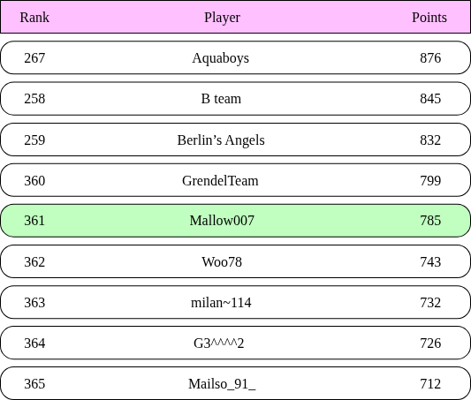

#### Storage Requirements & Persistence

To determine if Redis is feasible for our scale, we must calculate the memory required.

**Memory Size Estimation:**
*   Maximum Monthly Active Users: 25 million.
*   Worst-case scenario: All MAUs win at least one game (putting them on the leaderboard).
*   Entry Size: 
    *   24-character string (`user_id`)
    *   16-bit integer/2 bytes (`score`)
    *   Total raw size = 26 bytes per entry.
*   Raw Storage: $26 \text{ bytes} \times 25,000,000 \text{ users} \approx 650 \text{ MB}$.
*   With overhead (Skip List and Hash Table overhead for sorted sets usually doubles footprint): $\sim 1.3 \text{ GB}$.

**Hardware Feasibility:**
*   A single modern Redis server easily holds 1.3 GB of memory.
*   Our estimated peak update rate of 2,500 QPS is extremely minimal for Redis (which can handle 100k+ ops/sec).

**Data Persistence & Recovery:**
*   While Redis offers AOF/RDB persistence, recovering a large instance from disk can be slow. 
*   **High Availability:** Configure Redis with a **Read Replica**. If the master fails, the replica is instantly promoted.
*   **Source of Truth (Relational Database):** Redis should be treated as a *view* of the data. The actual canonical source of truth should be backed by an RDS (like MySQL) using two tables:
    1.  `user` table: Stores `user_id` and display metadata.
    2.  `point` table: Stores `user_id`, `score`, and `timestamp` representing each win log.
    This relational data acts as an audit trail (play history) and can be used to fully reconstruct the Redis leaderboard if the entire Redis cluster is somehow destroyed.

**Optimization:**
Caching the metadata (e.g., display name, avatar) of the Top 10 players locally or closer to the edges since they are requested most frequently.

---

### Step 3 - Design Deep Dive

Once the data model (Redis + MySQL) is selected, the next phase is determining the infrastructure topology.

#### Option A: Manage Our Own Services
In a traditional self-managed deployment, traffic hits a load-balanced set of Web/API servers. 
*   These servers execute the business logic.
*   They update scores by mutating the Redis sorted set.
*   They fetch complete leaderboards by querying Redis for IDs, and querying MySQL to hydrate user metadata (name, avatar, etc.).
*   **Optimization:** A secondary Redis cache specifically for caching the metadata of the Top 10 users.

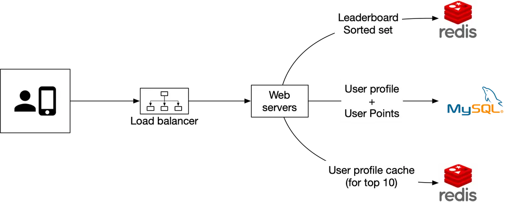

#### Option B: Build on the Cloud (Serverless Architecture)
If building from the ground up, leveraging cloud-native serverless technologies (like **AWS Lambda** and **Amazon API Gateway**) is highly recommended due to automatic scaling.

**API to Lambda Mapping:**
*   `GET /v1/scores` $\rightarrow$ `LeaderboardFetchTop10` (Lambda)
*   `GET /v1/scores/{user_id}` $\rightarrow$ `LeaderboardFetchPlayerRank` (Lambda)
*   `POST /v1/scores` $\rightarrow$ `LeaderboardUpdateScore` (Lambda)

AWS Lambda executes code only when triggered by API Gateway, scaling instantly with traffic spikes (e.g., massive evening gaming hours) without provisioning persistent servers.

**Workflow: Scoring a Point (Serverless)**
1.  Game Server hits internal endpoint.
2.  Triggers `LeaderboardUpdateScore` Lambda.
3.  Lambda calls `ZINCRBY` against Amazon ElastiCache (Redis).
4.  Lambda asynchronously writes point log to Amazon RDS (MySQL).

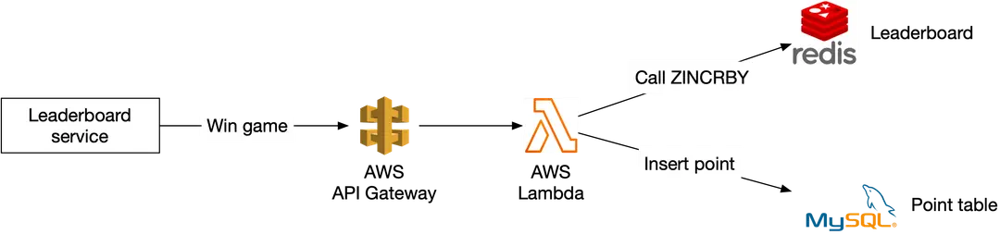

**Workflow: Retrieving Leaderboard (Serverless)**
1.  Client hits external API Gateway endpoint.
2.  Triggers `LeaderboardFetchTop10` Lambda.
3.  Lambda calls `ZREVRANGE` against Redis to get the raw ranks and scores.
4.  Lambda concurrently queries MySQL (or a secondary metadata cache) to fetch user details.
5.  Lambda aggregates the JSON payload and returns the response.

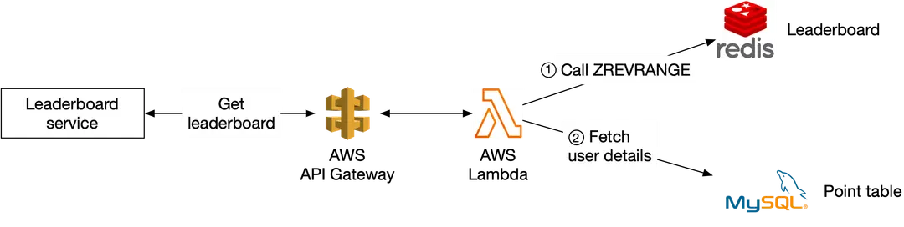

#### Scaling Redis (100x Growth)

If the scale increases drastically—for example, to **500 million DAU**—the requirements jump to $65 \text{ GB}$ of RAM and $250,000 \text{ QPS}$. At this scale, a single Redis node is insufficient, requiring a **Data Sharding** solution.

There are two primary ways to shard this data:

##### 1. Fixed Partition (Recommended for Leaderboards)
Data is broken up by a defined range of scores. For example, if scores range from 1 to 1000, we might create 10 shards (Shard 1: 1-100, Shard 2: 101-200, etc.).

*   **Application-Level Sharding:** The application code is responsible for routing the user to the correct shard.
*   **Shard Migration:** If a user scores a point and moves out of the bounds of their current shard (e.g., scoring 101), the application must explicitly remove them from Shard 1 and add them to Shard 2.
*   **Fetching Top 10:** Extremely efficient. Just query the shard containing the highest scores (e.g., Shard 10).
*   **Fetching Specific Rank:** To find a user's global rank, calculate their *local rank* in their current shard, then add the total number of users in all shards with higher score ranges (easily retrieved using Redis `info keyspace`).

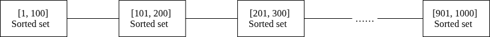

##### 2. Hash Partition (Redis Cluster)
Redis Cluster shards data automatically using hash slots. It hashes the key (e.g., `CRC16(key) % 16384`) to assign it to one of the 16,384 available slots distributed across multiple nodes.

*   **Updating Scores:** Simple and fast; Redis routes the update to the correct node automatically.
*   **Fetching Top 10 (Scatter-Gather):** The application must query the top 10 from *every* shard, gather all the results, and sort them in the application layer.
*   **Drawbacks:**
    *   Latency is determined by the slowest partition.
    *   Scatter-gather is very slow if you need the top `K` results where `K` is a large number.
    *   **Fatal Flaw:** It is mathematically extremely difficult to determine the exact rank of an arbitrary specific user without massive cross-shard queries.

Due to the difficulty of finding a specific user's rank, **Fixed Partitioning is the preferred approach for leaderboards.**

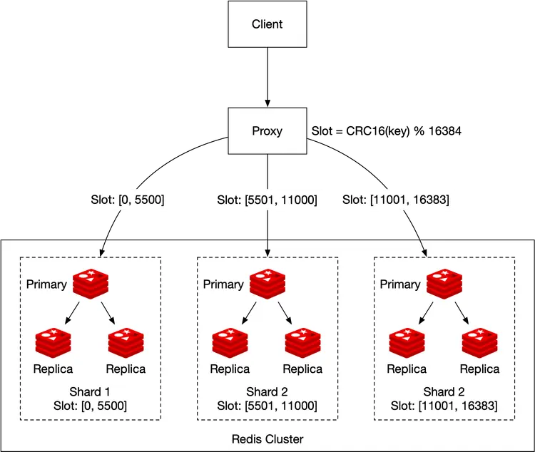
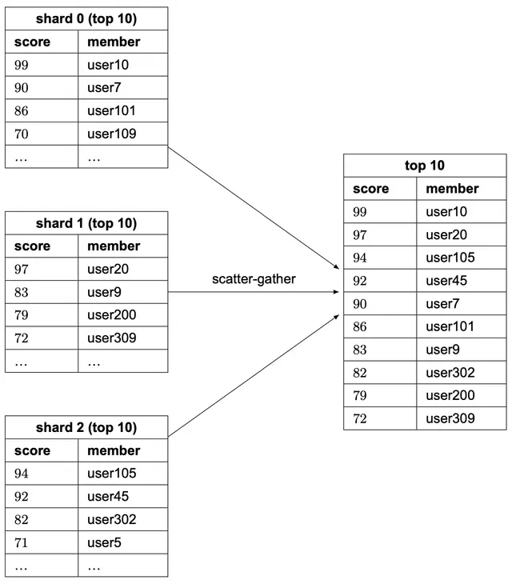

#### Sizing a Redis Node
When sizing individual Redis nodes, **write-heavy** applications act differently than read-heavy ones.
*   Because Redis occasionally saves snapshots to disk (RDB persistence), it requires extra memory for the copy-on-write process.
*   **Rule of Thumb:** Allocate *twice* the amount of memory needed for write-heavy applications to prevent crashes during snapshotting.
*   Use `redis-benchmark` to simulate load on your specific hardware before going into production.

#### Alternative Solution: NoSQL (DynamoDB)

If we wish to avoid managing Redis clusters and memory sizing explicitly, a fully managed NoSQL solution like **Amazon DynamoDB** (or Cassandra/MongoDB) is a viable alternative.

**Ideal NoSQL Properties:**
1.  Highly optimized for write operations.
2.  Able to efficiently sort items within the same partition by a specific score score.

In this model, DynamoDB replaces both Redis and MySQL. The Leaderboard service runs on ECS/Lambda, hitting DynamoDB directly.


##### 1. Denormalized Table Design
A NoSQL approach favors denormalization. A single table includes everything needed to render the leaderboard (Score, User Details, Rank context).

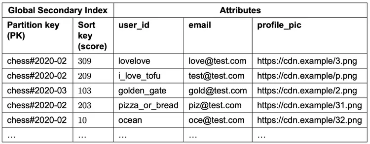

##### 2. Global Secondary Indexes (GSIs)
To sort efficiently without scanning the entire table, a **Global Secondary Index (GSI)** is required.
*   **Initial Setup:**
    *   **Partition Key (PK):** `game_name#{year-month}` (e.g., `chess#2020-02`)
    *   **Sort Key (SK):** `score`
*   **The "Hot Partition" Problem:** Because DynamoDB shards data based on the PK, *all* traffic for the current month will hit a single physical node, causing extreme throttling/hotspots.


##### 3. Write Sharding (Solving the Hotspot)
To distribute the load, we must break the single PK into $N$ partitions using **Write Sharding**.
*   **Updated Partition Key:** `game_name#{year-month}#p{partition_number}`
*   *Example:* Determine the partition by calculating `hash(user_id) % N`.

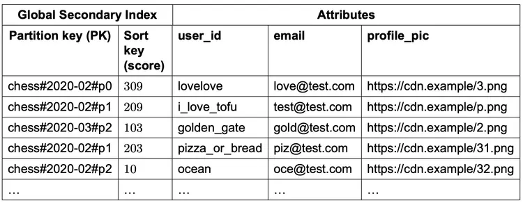

**The Scatter-Gather Trade-off:**
Write sharding perfectly solves the write bottleneck, but makes reads significantly more complex. To fetch the top 10 players, the service must perform a **Scatter-Gather** operation:
1.  Query the top 10 from *every single partition* (`p0`, `p1`, `p2`...).
2.  Bring all result sets back into application memory.
3.  Sort them and return the absolute top 10.

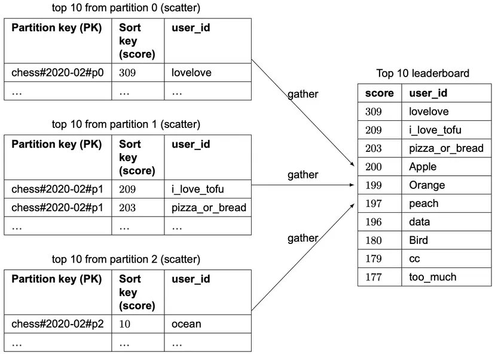

##### The Exact Rank Problem & Percentiles
Just like the Redis Hash Partitioning approach, write sharding in DynamoDB makes it practically impossible to calculate the exact, absolute numerical rank of an arbitrary user (e.g., finding exactly who is rank 1,200,001).

**Solution - Percentiles:** 
Instead of specific numerical ranks, large-scale systems calculate the user's **Percentile**. A background cron job periodically analyzes the score distribution and caches score-to-percentile thresholds.
```
10th percentile: score < 100
20th percentile: score < 500
...
90th percentile: score < 6500
```
Telling a player they are in the "Top 10%" is computationally cheap (a simple lookup) and often provides better user experience than showing an exact, massive number.

---

### Step 4 - Wrap Up & Bonus Topics

The final architecture successfully handles a real-time leaderboard for millions of active users by migrating from a slow Relational Database (table scans) to highly-optimized **Redis Sorted Sets** (or a globally distributed **DynamoDB with Write Sharding**).

If extra time remains in an interview, consider discussing these advanced optimizations:

#### Faster Retrieval & Tie-Breakers
*   **Faster Metadata Retrieval:** Instead of hitting MySQL for every user profile read (avatar, name), leverage a **Redis Hash** that maps `user_id` to a JSON object of the user's profile metadata. This keeps the entire read flow in-memory.
*   **Breaking Ties:** If two players have the exact same score, rank them by *who achieved the score first*. Store a secondary map (e.g., in a Redis Hash) of `user_id` $\rightarrow$ `timestamp_of_last_win`. When comparing tied scores, the older timestamp wins.

#### System Failure Recovery & Disaster Protocol
*   If the entire Redis cluster experiences a catastrophic failure and data is lost:
    1.  Provision a new Redis cluster.
    2.  Write a script that pulls all historical win events from the MySQL `point` table (which has logged every single win and its timestamp).
    3.  Iterate through the logs, issuing `ZINCRBY` commands to reconstruct the exact leaderboard state offline before routing live traffic back to the new cluster.

---
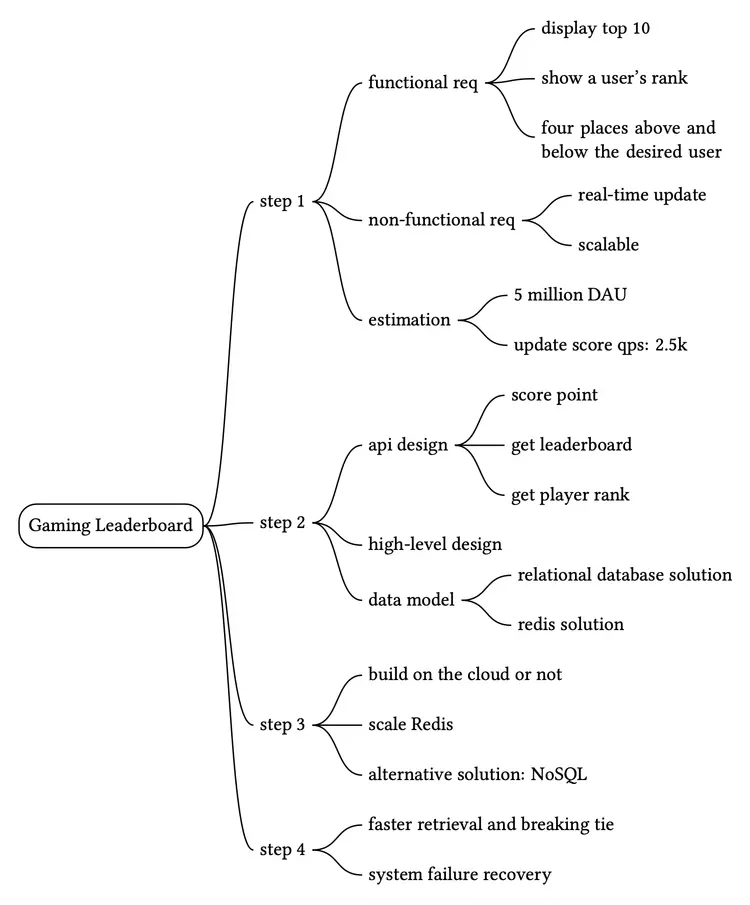

Reference Material
[1] Redis Sorted Set source code:
https://github.com/redis/redis/blob/unstable/src/t_zset.c

[2] Geekbang:
https://static001.geekbang.org/resource/image/46/a9/46d283cd82c987153b3fe0c76dfba8a9.jpg

[3] Building real-time Leaderboard with Redis:
https://medium.com/@sandeep4.verma/building-real-time-leaderboard-with-redis-82c98aa47b9f

[4] Build a real-time gaming leaderboard with Amazon ElastiCache for Redis:
https://aws.amazon.com/blogs/database/building-a-real-time-gaming-leaderboard-with-amazon-elasticache-for-redis

[5] How we created a real-time Leaderboard for a million Users:
https://levelup.gitconnected.com/how-we-created-a-real-time-leaderboard-for-a-million-users-555aaa3ccf7b

[6] Leaderboards: https://redislabs.com/solutions/use-cases/leaderboards/

[7] Lambda: https://aws.amazon.com/lambda/

[8] Google Cloud Functions: https://cloud.google.com/functions

[9] Azure Functions: https://azure.microsoft.com/en-us/services/functions/

[10] Info command: https://redis.io/commands/INFO

[11] Why redis cluster only have 16384 slots:
https://stackoverflow.com/questions/36203532/why-redis-cluster-only-have-16384-slots

[12] Cyclic redundancy check: https://en.wikipedia.org/wiki/Cyclic_redundancy_check

[13] Choosing your node size:
https://docs.aws.amazon.com/AmazonElastiCache/latest/red-ug/nodes-select-size.html

[14] How fast is Redis?: https://redis.io/topics/benchmarks

[15] Using Global Secondary Indexes in DynamoDB:
https://docs.aws.amazon.com/amazondynamodb/latest/developerguide/GSI.html.

[16] Leaderboard & Write Sharding: https://www.dynamodbguide.com/leaderboard-write-sharding/


