# Metrics Monitoring and Alerting System

## Step 1 - Understand the Problem and Establish Design Scope

### Requirements
*   **Target Audience:** An internal infrastructure monitoring system for a large-scale corporation (similar to an internal Prometheus/Datadog cluster), not an external commercial SaaS.
*   **Data Types:** Strictly limited to **operational system metrics** (e.g., CPU load, memory usage, disk I/O, requests per second). 
    *   *Out of scope:* Application logs (e.g., ELK stack) and Distributed System Tracing (e.g., Zipkin/Tempo).
*   **Scale:** Massive. 100 million Daily Active Users. Monitoring 1,000 server pools $\times$ 100 machines per pool $\times$ 100 metrics per machine $\rightarrow$ **~10 million distinct metrics** flowing constantly.
*   **Data Retention Policy (Rollups):** 1-year total retention with tiered downsampling to save disk space.
    *   *0 - 7 days:* Raw, unaggregated data.
    *   *7 - 30 days:* Roll up into 1-minute resolution buckets.
    *   *30 days - 1 year:* Roll up into 1-hour resolution buckets.
*   **Alerting Channels:** Email, SMS/Phone, PagerDuty, and HTTP Webhooks.

### Non-Functional Requirements
*   **Scalability:** Must horizontally scale as engineering teams deploy more servers and generate more metrics.
*   **Low Latency:** Queries powering live dashboards and triggering alerts must evaluate and resolve near-instantly.
*   **Reliability:** The system cannot drop critical metrics. Silently failing means missing catastrophic infrastructure outages.
*   **Flexibility:** The ingestion pipeline must be decoupled enough to easily support new technologies and metric formats in the future.

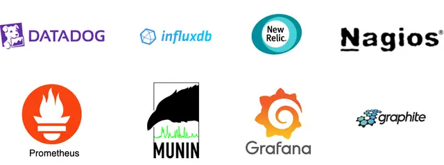

## Step 2 - Propose High-Level Design

### The 5 Core Components
A robust metrics system consists of five decoupled stages:
1. **Data Collection:** Retrieving metrics from the infrastructure.
2. **Data Transmission:** The network transportation layer to move data reliably.
3. **Data Storage:** The core database organizing the incoming flood of data.
4. **Alerting:** Continuously evaluating data against thresholds and pushing notifications.
5. **Visualization:** Dashboards (e.g., Grafana) for software engineers to identify trends.

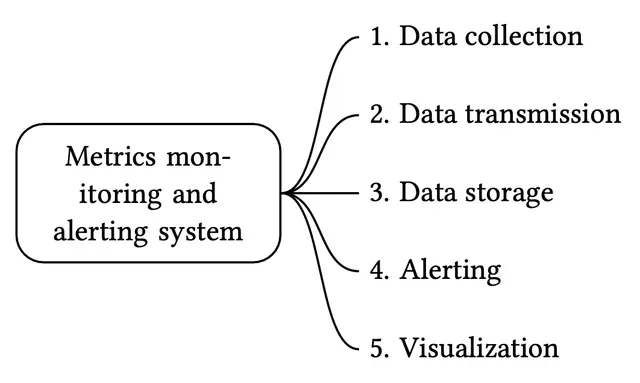

### The Data Model
Metrics are inherently recorded as **Time-Series Data**. A time-series is uniquely identified by its *Name* and an optional set of *Labels* (Tags).
*   **Metric Name:** e.g., `cpu.load`
*   **Labels (Key-Value pairs):** e.g., `host:i631, env:prod`
*   **Data Points:** An array of `<timestamp, value>` pairs.

**Line Protocol:** Many modern monitoring systems input data using a flat string format known as the *Line Protocol*:
`CPU.load host=webserver01,region=us-west 1613707265 50`

### Data Access Patterns
*   **Write Load: Extremely Heavy and Constant.** With 10 million distinct metrics reporting repeatedly every minute, the database must ingest a relentless, massive write throughput.
*   **Read Load: Spiky.** Read queries generally only occur when humans open dashboards or when the backend Alerting engine evaluates threshold rules on a cron schedule.

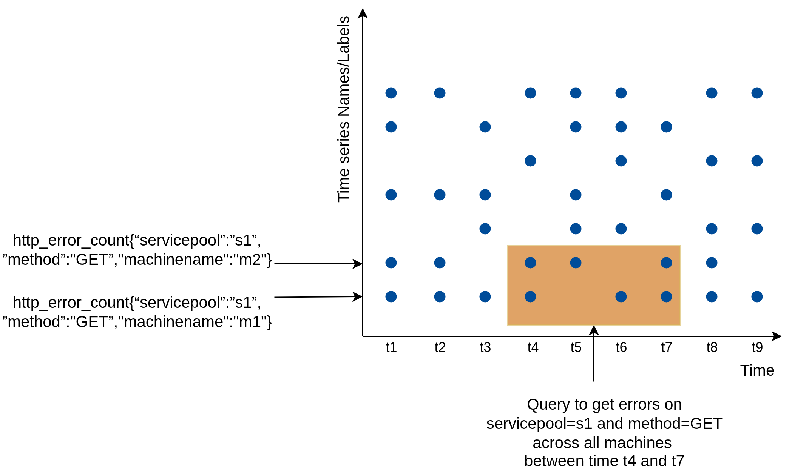

### The Data Storage System (Why TSDBs?)
The Storage layer is the heart of the system.
*   **Why General-Purpose Relational DBs Fail:** Standard SQL tables are not optimized for computing rolling-window averages. Maintaining separate relational indexes for every custom metric *Label* will completely shatter write performance at scale.
*   **Why General-Purpose NoSQL Fails:** While Cassandra or BigTable *could* store time-series data, building a performant schema to handle grouping, windowing, and label aggregation requires extreme expert-level tuning.
*   **The Solution: Time-Series Databases (TSDB)**
    *   Purpose-built databases like **InfluxDB** or **Prometheus** are strictly optimized for time-series aggregation.
    *   An 8-core InfluxDB server can handle over **250,000 writes per second**.
    *   TSDBs natively build highly optimized indexes on Labels, provided the labels remain "low-cardinality" (meaning a relatively limited set of possible values, e.g., `region=us-west`, rather than millions of permutations like `user_id=194857`).

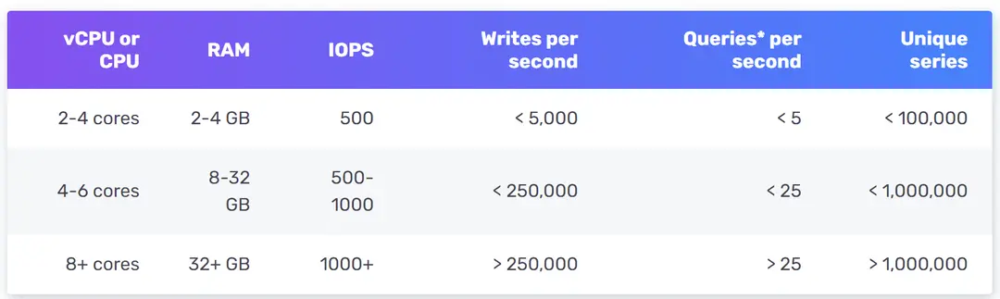

### High-Level Architecture
The system consists of a pipeline:
1.  **Metrics Source:** App servers, databases, and message queues generating raw data.
2.  **Metrics Collector:** Gathers data from the sources and writes it to the TSDB.
3.  **Time-Series DB:** Stores metrics and explicitly maintains indexes on tags.
4.  **Query Service:** A thin wrapper (or the native TSDB API) to rapidly retrieve aggregated data.
5.  **Alerting System & Visualization System:** Downstream consumers polling the Query Service.

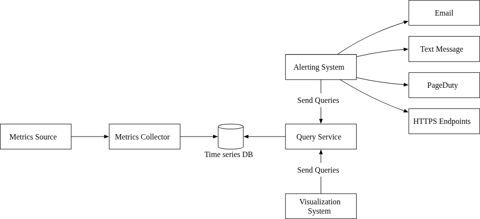

---

## Step 3 - Design Deep Dive

### 1. Metrics Collection (Pull vs. Push)
For metrics collection (e.g., CPU counters), occasional data loss is acceptable, allowing for asynchronous fire-and-forget mechanisms.
The mechanism of moving data from the *Source* to the *Collector* is fiercely debated. There are two primary paradigms: Pull (Prometheus) and Push (CloudWatch/Graphite).

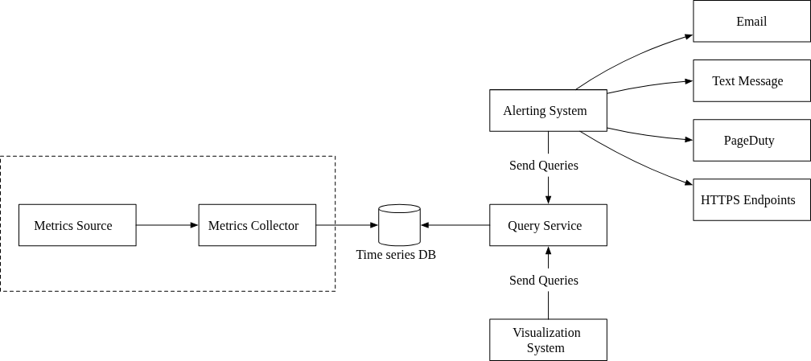

#### The Pull Model
In the simplest Pull model, dedicated Metric Collectors periodically request (pull) metrics from running applications over HTTP. 


*   **Service Discovery:** Because hardcoding cluster IPs is impossible in auto-scaling environments, the Pull Collector relies entirely on Service Discovery (e.g., etcd, Zookeeper). These registries contain rules and metadata about when and where to pull data.

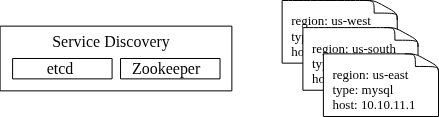

The full Pull workflow requires the Collector to first query Zookeeper/etcd for active IPs, then pull the metrics from the exposed endpoint (e.g., `/metrics`).
*   **Scaling Collectors:** To monitor 100,000 servers, a single Collector will bottleneck. We need a pool of Collectors. We use **Consistent Hashing** to explicitly map Target Servers to specific Collector nodes strictly to prevent duplicate data-pulling.

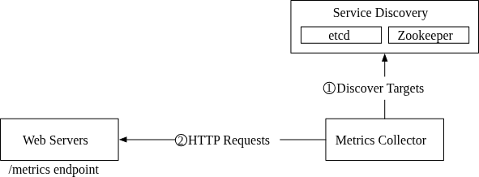


#### The Push Model
The Metrics Source runs a background Daemon/Agent that actively pushes metrics to the Collector over the network.
*   **Aggregation:** The local agent can forcefully aggregate high-frequency counters locally before pushing, saving huge amounts of network bandwidth.
*   **Scaling:** The Collectors simply sit behind a standard Auto-Scaling Load Balancer.

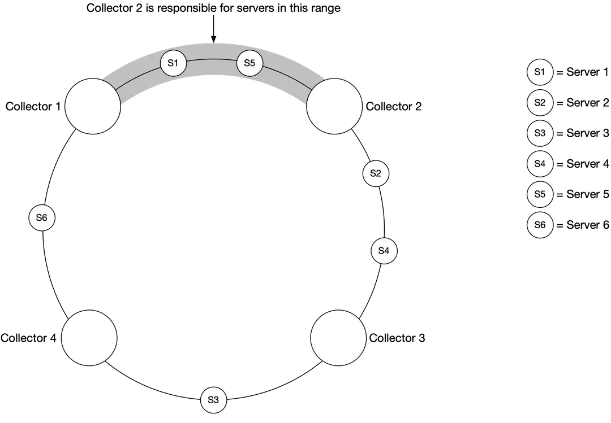

#### Pull vs Push Comparison

| Feature | Pull (e.g., Prometheus) | Push (e.g., CloudWatch) |
| :--- | :--- | :--- |
| **Debugging** | **Pull Wins.** You can manually hit `/metrics` on your laptop to see if the server is actively emitting data. | Harder. If data doesn't arrive, you don't know if the Agent crashed or Network failed. |
| **Health Checks** | **Pull Wins.** If the pull HTTP request fails, the Collector immediately knows the target server is dead or completely hanging. | If push stops, it could just be harmless network latency. |
| **Short-Lived Jobs** | Fails. Batch jobs might spin up and die before the Collector's polling interval triggers. | **Push Wins.** The job pushes its result immediately before cleanly terminating. |
| **Complex Networks** | Requires opening painful firewall ports to let central Collectors bypass VPCS and access every internal server. | **Push Wins.** Agents just need outbound internet access to a central LB. |
| **Authenticity** | **Pull Wins.** The Collector strictly chooses where to pull from based on trusted Service Discovery. | Any malicious client can spam the Push LB unless strict authentication is enforced. |

*Conclusion:* Massive organizations usually implement both. Push is absolutely mandatory for serverless environments (where inbound Pull ports do not exist), while Pull is heavily preferred for classical Kubernetes clusters.

### 2. Scaling the Metrics Transmission Pipeline
Regardless of Push or Pull, the system must safely transport 10 million constantly mutating metrics. If the Time-Series DB (TSDB) goes down for maintenance or crashes under load, we risk catastrophic data loss.

*   **Introducing Kafka:** To radically decouple the Collectors from the Storage, we introduce a distributed message queue (Kafka). 
    *   Collectors write the incoming stream data to Kafka.
    *   Stream processors (Flink/Storm) or TSDB consumers read from Kafka and write to the DB.
    *   If the TSDB is completely offline, Kafka safely retains the data. Kafka partitions can be organically sharded by `metric_name` or `tags` to horizontally scale downstream consumption.

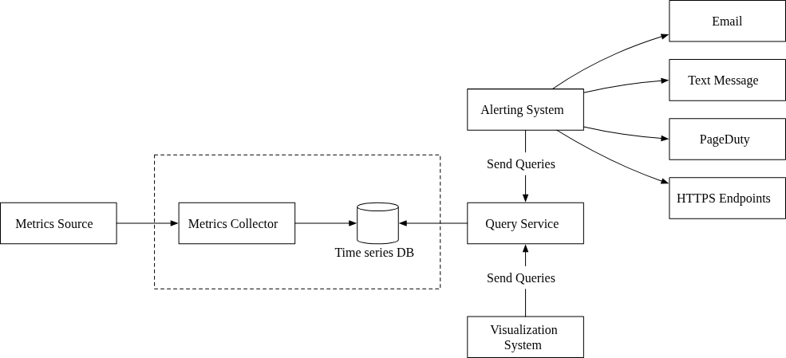


*   *Alternative:* Systems like Facebook's Gorilla bypass Kafka entirely by using an in-memory TSDB explicitly designed to never reject writes during partial network failures.

#### Where Data Aggregation Occurs
To handle PB-scale data volume, aggregations (e.g., raw counters to 1-minute rates) can happen at three distinct phases:
1.  **Collection Agent (Client-side):** The agent calculates rolling metrics locally and only pushes 1-minute summaries over the network. This severely cuts network payload and ingestion costs.
2.  **Ingestion Pipeline:** Stream processors (Flink) read from Kafka, aggregate the data in transit, and push only the *calculated results* to the TSDB. Reduces DB size but irreversibly destroys raw data precision.
3.  **Query Side:** The TSDB stores all raw data. The aggregation math happens purely when a dashboard calculates the graph. Much slower query performance, but ensures zero raw data loss.

### 3. The Query Service & TSDB Query Languages
A dedicated querying cluster stands between the Storage and the end-user (Alerting/Visualization), often heavily caching frequently-run dashboard queries.

*   **Why not SQL?** Standard SQL fails spectacularly at time-series analysis. For example, computing an *Exponential Moving Average* requires 15+ lines of highly unreadable, heavily nested window functions (`OVER PARTITION BY`) in PostgreSQL. Modern TSDBs abandon SQL entirely for custom languages (like InfluxDB's *Flux*) to solve this natively:
    ```javascript
    from(db:"telegraf")
      |> range(start:-1h)
      |> filter(fn: (r) => r._measurement == "foo")
      |> exponentialMovingAverage(size:-10s)
    ```

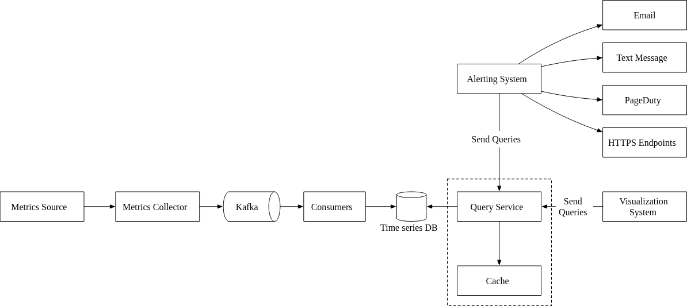

### 4. Storage Layer Deep Dive
According to Facebook's Facebook’s Gorilla research, **85% of all operational queries hit data less than 26 hours old.** Modern TSDBs natively exploit this property to pin "hot" recent data in memory and offload "cold" data to disk. 

To overcome the PB-scale storage requirements, three techniques are heavily enforced:
1.  **Data Encoding (Double-Delta):** Instead of storing redundant 32-bit absolute timestamp integers (e.g., `1610087371`, `1610087381`), the DB stores only the *delta time difference* (+10, +10). A +10 value takes only 4 bits to store, massively compressing the payload. 
2.  **Downsampling:** A background job continuously converts high-resolution (10-second) raw data into low-resolution (1-hour) bucketed averages as data gracefully ages past 7 days.
3.  **Cold Storage:** Archiving incredibly old data directly to cheap, slow object storage (like S3).


### 5. Alerting System
A reliable alerting system must detect anomalies and notify engineers without "alert fatigue."

**Alerting Flow:**
1.  **Rule Configuration:** Rules are defined in YAML config files (e.g., `cpu > 80% for 5m`) and loaded into a cache.
2.  **Alert Manager:** A central service that periodically polls the **Query Service** based on the cached rules. 
3.  **Deduplication & Merging:** If 10 individual disks on one server trigger a "Disk Full" event simultaneously, the manager merges them into a single "Server X: Multiple Disks Full" alert to prevent notification storms.
4.  **Alert Store:** A persistent key-value store (e.g., Cassandra) that tracks the state of alerts (`inactive`, `pending`, `firing`, `resolved`). 
5.  **Kafka & Consumers:** Valid alerts are dropped into Kafka; specialized consumers then route the notification to the target channel (Email, Slack, PagerDuty, Webhooks).

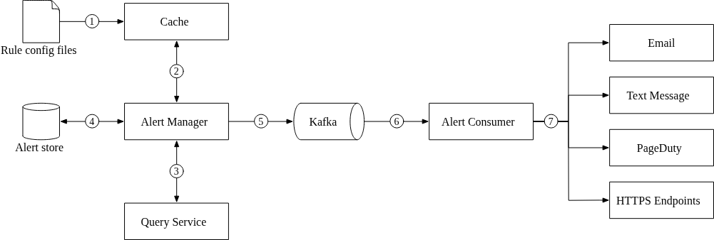
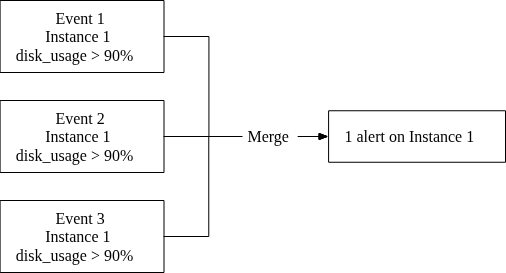

### 6. Visualization System
Visualization provides the human-readable visibility needed to diagnose production issues.
*   **The Case for "Buy" (Grafana):** Building a custom, high-performance UI for time-series graphing is an enormous engineering undertaking. Most companies use **Grafana**, which provides native plugins for nearly all major TSDBs (Prometheus, InfluxDB, etc.).
*   **Dashboards:** Provide real-time views of server requests, memory/CPU utilization, and traffic patterns across various time scales.

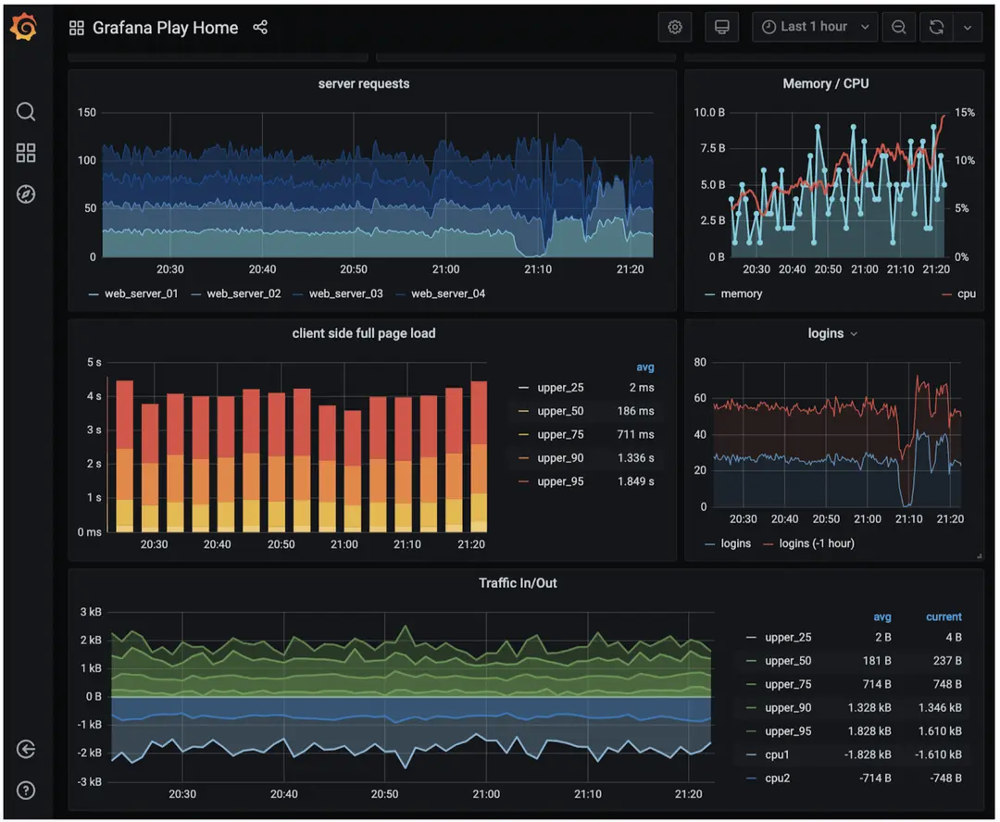

---

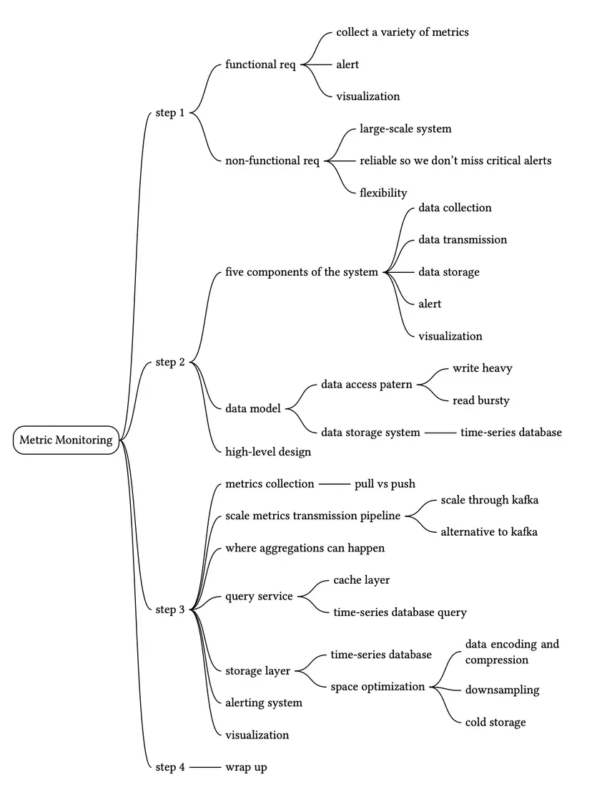


Reference Materials
[1] Datadog: https://www.datadoghq.com/

[2] Splunk: https://www.splunk.com/

[3] Elastic stack: https://www.elastic.co/elastic-stack

[4] Dapper, a Large-Scale Distributed Systems Tracing Infrastructure:
https://research.google/pubs/pub36356/

[5] Distributed Systems Tracing with Zipkin:
https://blog.twitter.com/engineering/en_us/a/2012/distributed-systems-tracing-with-zipkin.html

[6] Prometheus: https://prometheus.io/docs/introduction/overview/

[7] OpenTSDB - A Distributed, Scalable Monitoring System: http://opentsdb.net/

[8] Data model: : https://prometheus.io/docs/concepts/data_model/

[9] Schema design for time-series data | Cloud Bigtable Documentation
https://cloud.google.com/bigtable/docs/schema-design-time-series

[10] MetricsDB: TimeSeries Database for storing metrics at Twitter:
https://blog.twitter.com/engineering/en_us/topics/infrastructure/2019/metricsdb.html

[11] Amazon Timestream: https://aws.amazon.com/timestream/

[12] DB-Engines Ranking of time-series DBMS: https://db-engines.com/en/ranking/time+series+dbms

[13] InfluxDB: https://www.influxdata.com/

[14] etcd: https://etcd.io

[15] Service Discovery with Zookeeper
https://cloud.spring.io/spring-cloud-zookeeper/1.2.x/multi/multi_spring-cloud-zookeeper-discovery.html

[16] Amazon CloudWatch: https://aws.amazon.com/cloudwatch/

[17] Graphite: https://graphiteapp.org/

[18] Push vs Pull: http://bit.ly/3aJEPxE

[19] Pull doesn’t scale - or does it?:
https://prometheus.io/blog/2016/07/23/pull-does-not-scale-or-does-it/

[20] Monitoring Architecture:
https://developer.lightbend.com/guides/monitoring-at-scale/monitoring-architecture/architecture.html

[21] Push vs Pull in Monitoring Systems:
https://giedrius.blog/2019/05/11/push-vs-pull-in-monitoring-systems/

[22] Pushgateway: https://github.com/prometheus/pushgateway

[23] Building Applications with Serverless Architectures
https://aws.amazon.com/lambda/serverless-architectures-learn-more/

[24] Gorilla: A Fast, Scalable, In-Memory Time Series Database:
http://www.vldb.org/pvldb/vol8/p1816-teller.pdf

[25] Why We’re Building Flux, a New Data Scripting and Query Language:
https://www.influxdata.com/blog/why-were-building-flux-a-new-data-scripting-and-query-language/

[26] InfluxDB storage engine: https://docs.influxdata.com/influxdb/v2.0/reference/internals/storage-engine/

[27] YAML: https://en.wikipedia.org/wiki/YAML

[28] Grafana Demo: https://play.grafana.org/


