# System Design: Nearby Friends

## Step 1 - Understand the Problem and Establish Design Scope

The "Nearby Friends" feature allows an opt-in user to see a list of their friends who are geographically close to them currently. 

**Difference from standard Proximity Services (like Yelp):** 
In a standard proximity service, the entities being searched (e.g., restaurants) are static. In "Nearby Friends," both the searcher and the targets are highly dynamic, actively moving mobile users.

### Requirements & Scope
*   **Definition of "Nearby":** Within a configurable radius (e.g., 5 miles). Calculated as a straight-line distance.
*   **Target Scale:** 
    *   1 Billion total users. 
    *   10% use the feature $\rightarrow$ **100 Million DAU**.
    *   Concurrent users assumed to be 10% of DAU $\rightarrow$ **10 Million concurrent active users**.
*   **Friend limits:** Average user has 400 friends.
*   **Activity Window:** If a friend has been inactive for > 10 minutes, they should disappear from the nearby list.
*   **Location History:** Must be retained for Machine Learning and analytics purposes.
*   **UI Constraints:** Shows 20 friends per page, with distance and last updated timestamp. Refreshing every few seconds.

### Non-Functional Requirements
*   **Low Latency:** When a friend moves, the update should quickly reflect on the client.
*   **Reliability:** General reliability is required, but occasional data point loss is acceptable.
*   **Eventual Consistency:** Strict consistency is not required for backend locational data; a few seconds delay replicating across data centers is acceptable.

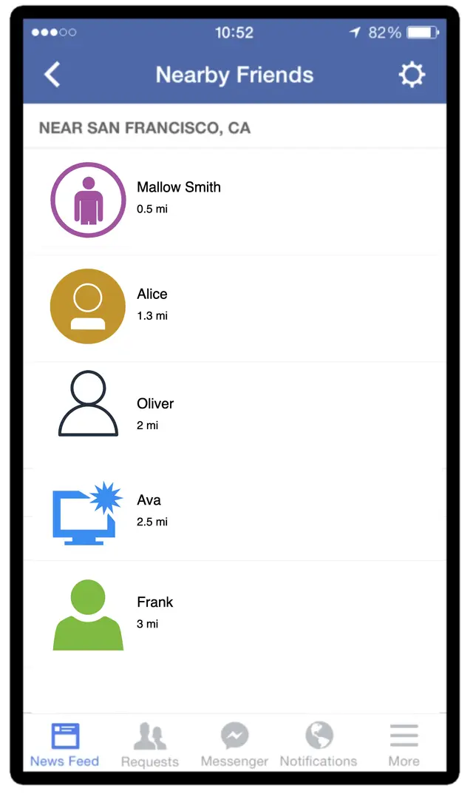

---

## Step 2 - Back-of-the-Envelope Estimation

The defining characteristic of this system is the sheer volume of location coordinate updates hitting the backend.

### QPS Estimation
*   **Concurrent Users:** 10 Million.
*   **Refresh Interval:** 30 seconds. (Reasoning: Average human walking speed is slow (~3-4 mph), so moving for 30 seconds doesn't noticeably alter proximity on a 5-mile scale).
*   **Location Update QPS:** $\frac{10,000,000 \text{ users}}{30 \text{ seconds}} \approx \mathbf{334,000 \text{ QPS}}$.

---

## Step 3 - High-Level Design

### The Core Challenge: The "Forwarding" Multiplier
We cannot use a Peer-to-Peer (P2P) mesh network because maintaining hundreds of persistent connections on a mobile phone will drain the battery and handle network drops poorly. We must use a **Shared Backend**.

However, the shared backend faces a massive fan-out issue. 
*   Updates per second: 334K.
*   Average friends: 400.
*   Assume 10% of friends are online.
*   Total forwards per second: $334,000 * 400 * 10\% \approx \mathbf{14 \text{ Million updates/second}}$.

### System Components

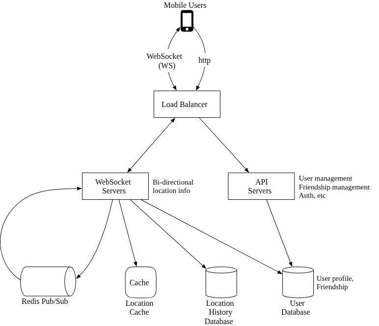

To handle this throughput, the backend separates standard stateless API traffic from stateful persistent location streams.

#### 1. RESTful API Servers (Stateless)
Handles traditional request/response data: Authentication, adding/removing friends, and updating user profiles.
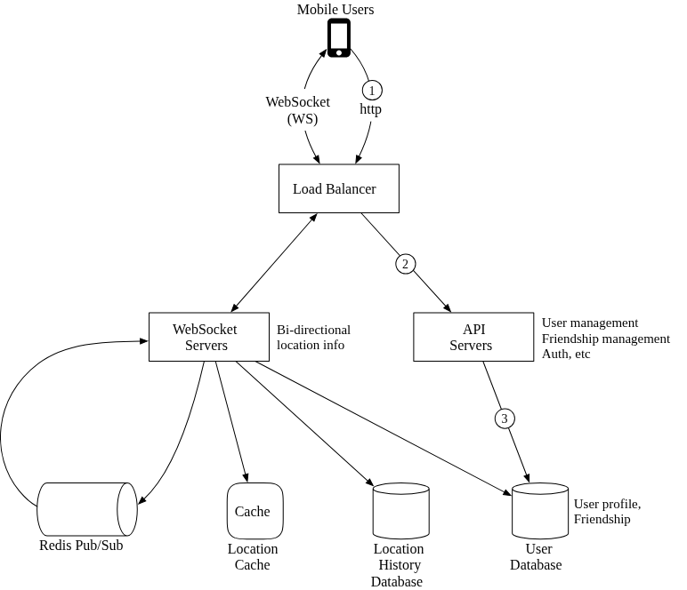

#### 2. WebSocket Servers (Stateful)
Because the server needs to actively *push* data to the client whenever a friend moves, HTTP is insufficient. The system uses a cluster of stateful **WebSocket Servers** to maintain a persistent, bidirectional connection with every active mobile client.

#### 3. Redis Location Cache
Stores only the *most recent* location coordinates for an active user. 
*   **TTL (Time-To-Live):** Configured to 10 minutes. Every time a user updates their location, the TTL resets. If a user drops offline, their data naturally expires from the cache, strictly enforcing the "10-minute inactivity" requirement.

#### 4. Redis Pub/Sub Cluster
This is the heart of the 14 Million QPS fan-out architecture. Redis Pub/Sub is an extremely lightweight message bus where creating millions of channels is inexpensive.
*   **The Paradigm:** Every active user receives their own dedicated Redis Channel.
*   **Publishing:** User A sends their location to the WebSocket server, which publishes it to `Channel_A`.
*   **Subscribing:** When User B (User A's friend) comes online, B's WebSocket handler subscribes to `Channel_A`. 
*   When a message hits `Channel_A`, the WebSocket server calculates the distance. If it's within 5 miles, it pushes the update to User B's device.

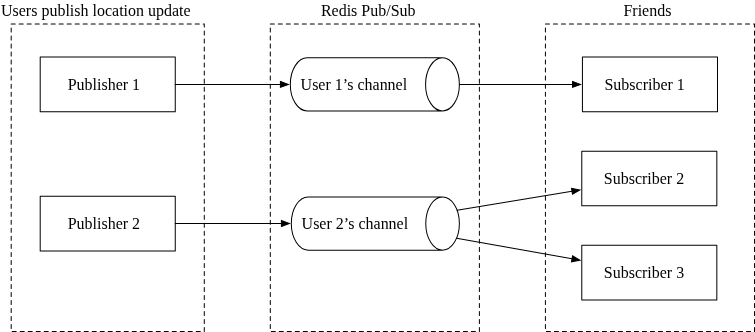

### Location Update Architecture (Step-by-Step Flow)

When a user's phone generates a location ping every 30 seconds, the following high-speed orchestration occurs:

1.  **Ingestion:** The mobile client sends the new coordinate tuple `(lat, lng, timestamp)` to the **Load Balancer**, which routes it to holding the persistent persistent **WebSocket server** connection.
2.  **Persistence & Caching (Parallel):** 
    *   The WebSocket server writes the raw coordinate to the **Location History Database**.
    *   The WebSocket server updates the user's latest location in the **Redis Location Cache**, resetting the 10-minute TTL.
    *   It updates the location inside the user's active WebSocket connection handler object (used later for distance calculation).
3.  **Broadcasting:** The WebSocket Server publishes the new coordinate to the user's personal channel in the **Redis Pub/Sub Server**.
4.  **Fan-out:** Redis Pub/Sub broadcasts the message to all current subscribers (these are the WebSocket connection handlers holding open connections to the user's *online friends*).
5.  **Distance Calculation (Server Side):** Upon receiving the broadcast, each friend's WebSocket handler calculates the physical distance between the friend's resting location and the sender's new location.
6.  **Push:** If the calculated distance is less than the radius threshold (e.g., 5 miles), the payload is sent down the friend's active WebSocket connection to their screen.

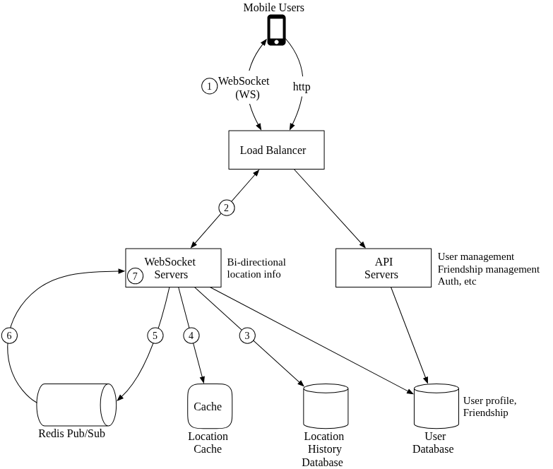
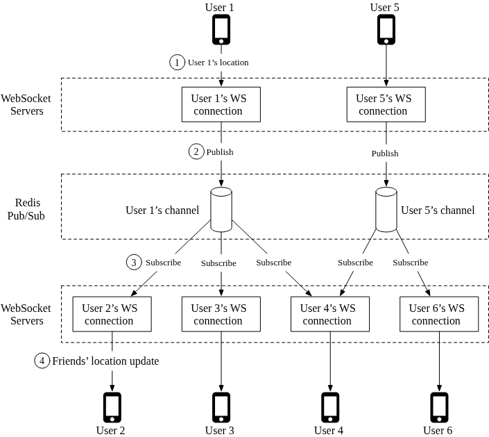

---

## API Design (WebSocket)

Because location updates require a bi-directional persistence model, standard HTTP is only used for auxiliary tasks (updating profiles). Core features operate entirely over **WebSockets**.

1.  **Periodic Location Update (Client $\rightarrow$ Server)** 
    *   Payload: `latitude, longitude, timestamp`.
2.  **Receive Location Update (Server $\rightarrow$ Client)**
    *   Payload: `friend_id, friend_lat, friend_lng, timestamp`.
3.  **WebSocket Initialization**
    *   Client sends their current initial location. Server performs the complex DB lookup to find and return all currently online, nearby friends to hydrate the UI.
4.  **Subscribe / Unsubscribe Events (Server $\rightarrow$ Client)**
    *   Signals pushed to the client when a friend comes online (Subscribe) or drops offline/TTL expires (Unsubscribe).

---

## Data Model Details

### 1. Redis Location Cache (The Active State)
Stores the absolute latest known coordinate for a user.
*   **Schema:** `Key: user_id` $\rightarrow$ `Value: {lat, lng, timestamp}`
*   **Why not a Database?** The "Nearby Friends" UI only cares about *right now*. Redis provides microsecond read/write access. Furthermore, the cache is non-durable and ephemeral. If the Redis node crashes, it is an acceptable trade-off: a new empty node replaces it, and within 30 seconds, 10 million incoming user pings will naturally repopulate the cache.

### 2. Location History Database (The Persistent State)
Stores the immutable trail of breadcrumbs for ML and Analytics.
*   **Schema:** `user_id | lat | lng | timestamp`
*   **Storage Decision:** Expecting over 334,000 Writes-per-second, this requires a highly horizontally scalable NoSQL wide-column database like **Cassandra** (partitioned by `user_id`), capable of absorbing massive write loads without locking.

---

## Step 4 - Scaling Deep Dive

At 10 Million concurrent users, the naive high-level design will hit bottlenecks. Here is how we scale the individual components to survive.

### 1. Scaling the Servers
*   **API Servers:** Stateless. Easily auto-scaled based on standard CPU/Memory thresholds.
*   **WebSocket Servers:** Stateful. Auto-scaling and deployments are difficult because dropping a server breaks active connections. The load balancer must use **Connection Draining** to stop sending new traffic to a node and wait for existing connections to naturally close before the node is decommissioned.

### 2. Client Initialization (The Boot-up Sequence)
When the app opens, it must hydrate the UI with nearby friends immediately. The WebSocket connection handler performs a heavy lift:
1.  Updates the user's location in the **Redis Cache** and the local handler variable.
2.  Fetches the user's entire friend list from the **User DB**.
3.  Performs a **Batched Query** against the **Redis Location Cache** to fetch the last known coordinates of all friends simultaneously. (Inactive friends simply miss the cache).
4.  Calculates distances and pushes any friend within 5 miles to the client to render the UI.
5.  **The Subscription Engine:** The handler subscribes to the Redis Pub/Sub channel for *every single friend*, including offline ones. (Empty channels consume almost zero memory and zero CPU until the friend boots up).
6.  Finally, it publishes the user's starting location to their own channel.

### 3. Scaling the Databases & Caches
*   **User DB:** Standard horizontal sharding by `user_id` handles the heavy graph traversal of friendships. At Facebook scale, this is likely abstracted behind an internal Graph API microservice anyway.
*   **Redis Location Cache:** 
    *   *Memory is fine:* 10 Million users $\times$ 100 bytes $\approx$ 1 GB. This easily fits in one Redis node.
    *   *Compute is the bottleneck:* 334,000 updates/second will overwhelm a single node's I/O threading.
    *   *The Fix:* We horizontally shard the Redis Cache by `user_id` to distribute the write-load. We also attach Standby Replica nodes to ensure high availability during crashes.

### 4. Scaling the Redis Pub/Sub Cluster
This is the core nervous system of the feature.

#### CPU vs. Memory Bottleneck
*   **Memory:** Assigning a channel for 100 million users, each tracking 100 subscribers (tracked via small internal hash tables/linked lists) takes roughly $\sim 200 \text{ GB}$ of RAM. This could fit on 2 or 3 high-end servers.
*   **CPU:** Pushing 14 Million messages per second is the real issue. A high-end Redis node handling 100,000 pushes/second means we need an array of **$\sim 140 \text{ Redis Pub/Sub servers}$** to handle the processing load.

#### Distributed Service Discovery (Consistent Hashing)
With 140+ Redis servers, how does a WebSocket server know which specific Redis node holds `Channel_A`?
1.  **Service Discovery (etcd / Zookeeper):** Maintains a **Consistent Hash Ring** of all 140 active Redis Pub/Sub nodes. 
2.  **In-Memory Routing:** Every WebSocket server maintains an automatically updating, local cache of this hash ring. 
3.  When publishing or subscribing, the WebSocket server hashes the `user_id` against the ring to find exactly which Redis node to connect to.

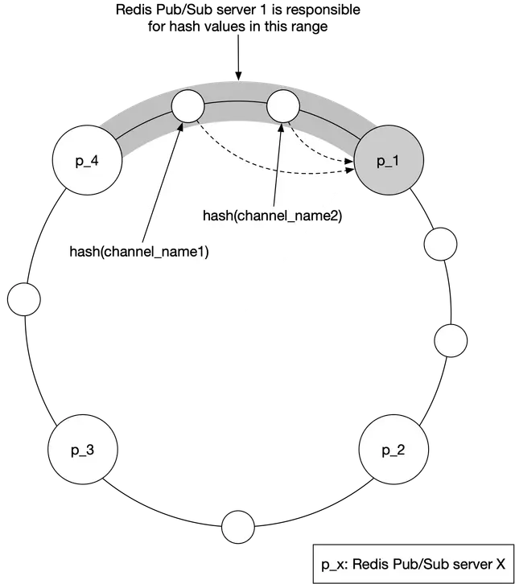
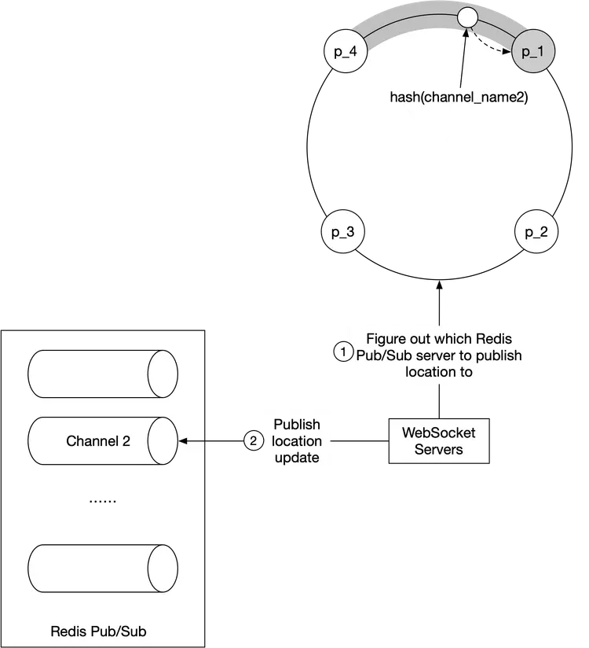

#### Operational Rule: Avoid Dynamic Auto-Scaling
Typically, large web clusters dynamically scale up and down throughout the day to save costs. **Do not dynamically autoscale this Redis Pub/Sub Cluster.**
*   *Why?* While the messages passing through are stateless, the **Subscriptions are stateful**.
*   *The Danger:* If you remove or add a node, the Consistent Hash Ring shifts. Millions of channels immediately remap to new servers. All WebSocket servers must instantly drop old connections and mass-resubscribe to the new target servers. This triggers a catastrophic CPU spike and causes dropped location updates.
*   *Best Practice:* Over-provision the 140-node cluster to handle the daily peak load. Only manually resize the cluster during off-peak maintenance windows.

### 5. Node Failures & Operations
While dynamic scaling is bad, replacing a single dead node is manageable.
*   When `Redis Node P1` crashes, the monitoring system updates the Service Discovery hash ring to point to `Node P1_Standby`.
*   The WebSocket servers see the specific hash ring change. Unlike an auto-scaling event that shifts the entire ring, only the channels that specifically lived on `P1` are moved. The WebSocket servers resubscribe those specific channels to the standby node.

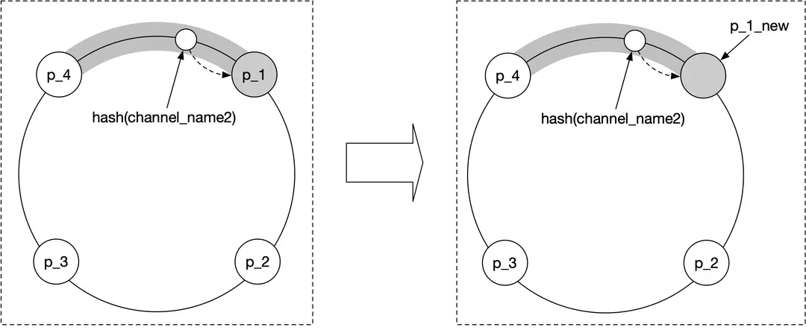

---

## Step 5 - Edge Cases & Alternative Architectures

### 1. Adding/Removing Friends Live
When a user adds or removes a friend in the main application, a callback is fired. This callback executes a command on the user's active WebSocket connection handler, instructing it to immediately `Subscribe` or `Unsubscribe` to the targeted friend's Redis Pub/Sub channel.

### 2. "Whale" Users (Thousands of friends)
Does a user with 5,000 friends create a hotspot? No. Because Consistent Hashing randomly distributes channels across 140 Redis nodes, a user with 5,000 friends will be subscribed to channels scattered evenly across the entire cluster. No single pub/sub node will be overwhelmed.

### 3. Bonus Feature: "Nearby Random Person"
If the app wants to show random strangers nearby (removing the friendship graph completely), the architecture shifts to **Geohashes**.
*   Instead of each *User* getting a Redis channel, each *Geohash Sector* gets a Redis channel.
*   When a user moves, they publish their coordinate to the channel covering their current Geohash.
*   To discover nearby random people, the user's WebSocket handler subscribes to their own Geohash channel **plus the 8 surrounding Geohash channels** (to catch people right across the border).

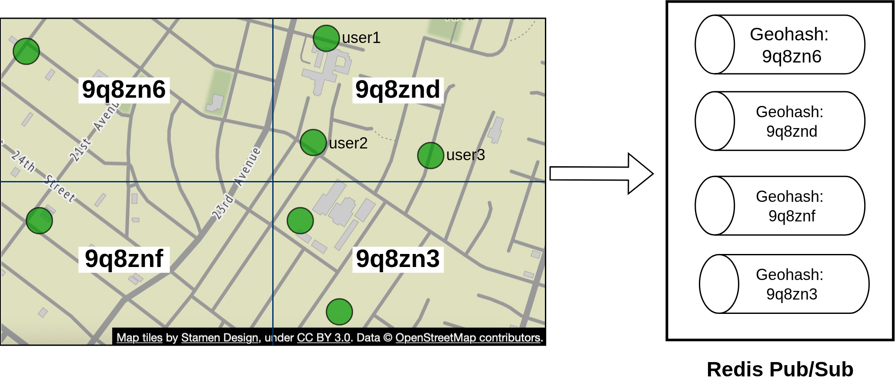
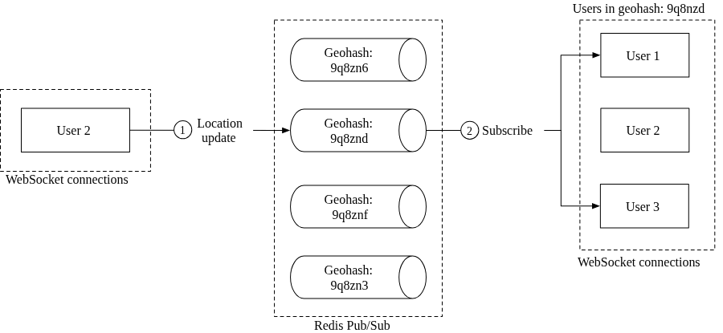
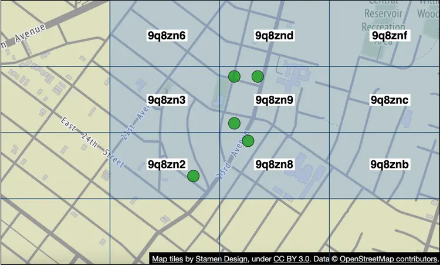

### 4. The Nuclear Alternative: Erlang 
Is there an alternative to maintaining a highly volatile 140-node Redis Pub/Sub infrastructure? Yes. **Erlang/Elixir.**

Erlang (running on the BEAM Virtual Machine via OTP libraries) is designed specifically for millions of concurrent, lightweight, stateful threads.
*   **Architecture Shift:** The WebSocket Servers and the Redis Pub/Sub cluster are conceptually merged into a single Erlang-based distributed backend.
*   **The Erlang Process:** Each of the 10 Million active users is modeled natively as an individual "Erlang Process". These processes are microscopic (taking as little as 300 bytes of RAM) and consume zero CPU when idle. 
*   Because Erlang was designed for telecom switching, it handles millions of cross-process subscription streams natively without requiring a bolt-on message bus like Redis.
*   *The Catch:* Finding and hiring engineers who can expertly wield Erlang/Elixir at scale is very difficult.

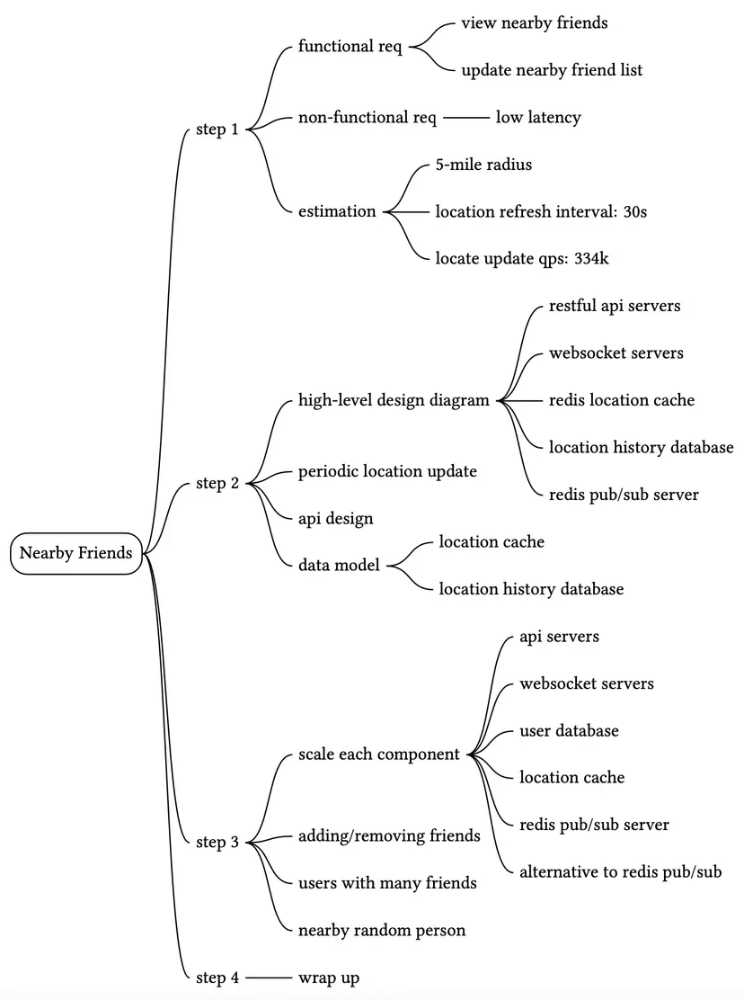

Reference Materials
[1] Facebook Launches “Nearby Friends”: https://techcrunch.com/2014/04/17/facebook-nearby-friends/

[2] Redis Pub/Sub: https://redis.io/topics/pubsub

[3] Redis Pub/Sub under the hood: https://jameshfisher.com/2017/03/01/redis-pubsub-under-the-hood/

[4] etcd: https://etcd.io/

[5] Zookeeper: https://zookeeper.apache.org/

[6] Consistent hashing: https://www.toptal.com/big-data/consistent-hashing

[7] OpenStreetMap: www.openstreetmap.org

[8] Erlang: https://www.erlang.org/

[9] Elixir: https://elixir-lang.org/

[10] A brief introduction to BEAM: https://www.erlang.org/blog/a-brief-beam-primer/

[11] OTP: https://www.erlang.org/doc/design_principles/des_princ.html