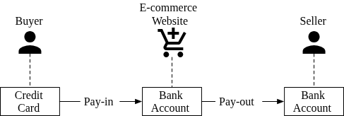
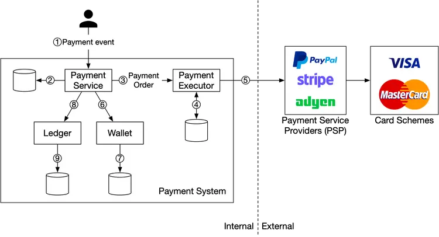
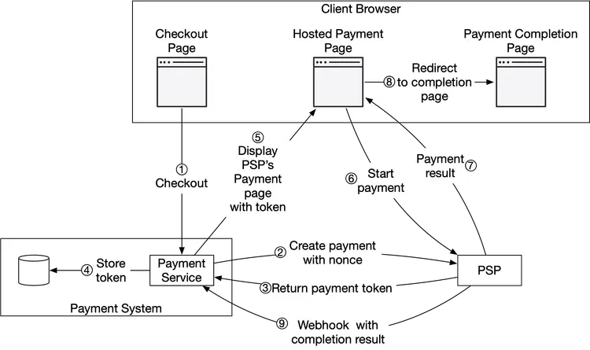
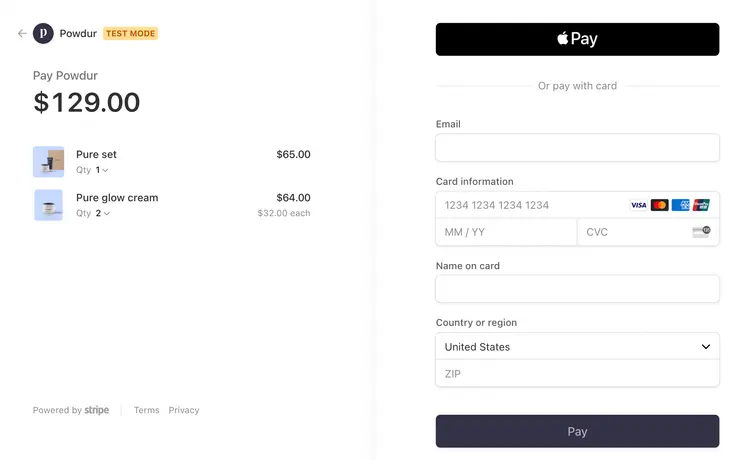
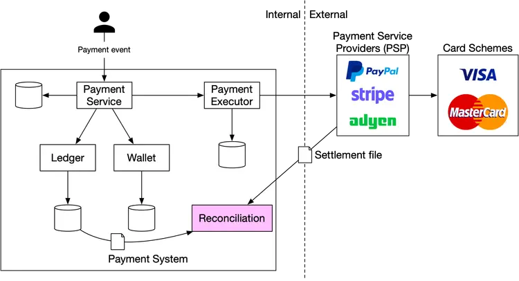
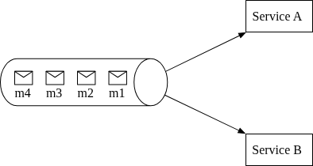
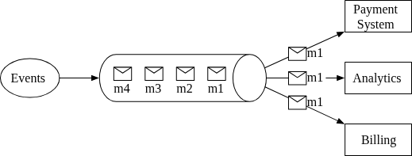
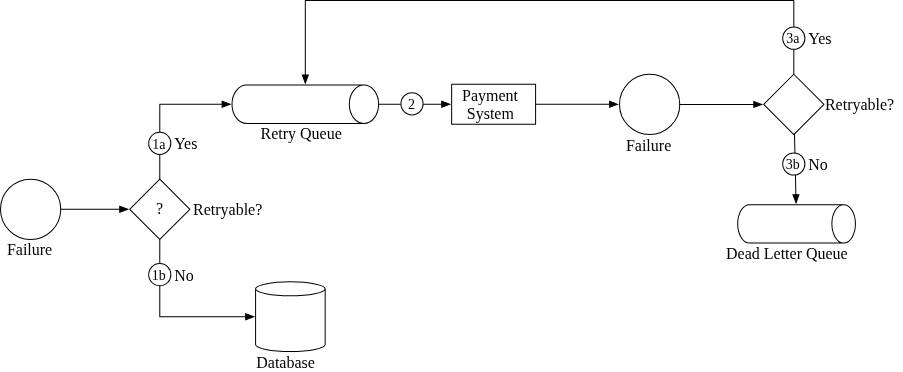
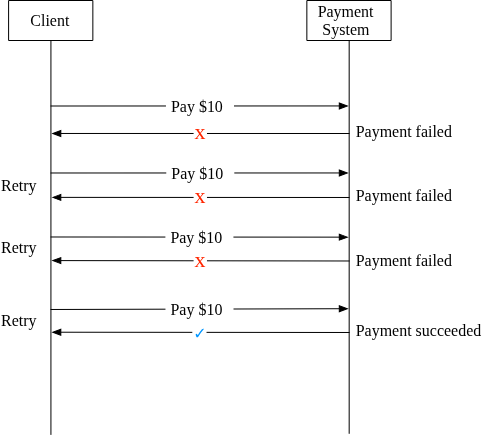
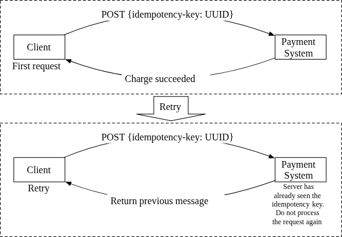

### Chapter: Design a Payment System - Summary

This chapter provides a comprehensive guide to designing a payment system, which is essential for e-commerce and financial applications to settle financial transactions through the transfer of monetary value. These systems must be highly reliable, scalable, and flexible, as even small slips can cause significant revenue loss and destroy user credibility. 

The design starts by separating the system into two primary workflows: the **pay-in flow** (receiving money from buyers) and the **pay-out flow** (sending money to sellers). An example use case is an Amazon-like e-commerce platform, which works as a money custodian and relies on third-party payment processors for handling sensitive credit card data. The system must also robustly handle failures and perform process reconciliation across internal and external systems to handle inconsistent states.

---

### 1. Requirements and Scope

*   **Core Features:**
    *   **Pay-in flow:** The payment system receives money from customers on behalf of sellers.
    *   **Pay-out flow:** The payment system sends money to sellers around the world.
*   **Payment Options:** Support credit cards (via third parties like Stripe, Braintree), PayPal, bank cards, etc.
*   **Storage of Card Data:** No direct storage of credit card numbers in the system due to high security/compliance requirements.
*   **Scope details:** Global application, single currency assumed for simplicity.
*   **Scale:** 1 million transactions per day.
*   **Non-functional requirements:**
    *   **Reliability and Fault Tolerance:** High reliability; failed payments carefully handled.
    *   **Reconciliation:** An asynchronous process is required to verify that payment information across internal services (payment systems, accounting) and external services (PSPs) is consistent.

#### Back-of-the-Envelope Estimation
*   **Total Transactions:** 1 million transactions per day.
*   **Transactions Per Second (TPS):** 1,000,000 transactions / 10^5 seconds = **10 TPS**.
*   **Note:** 10 TPS is relatively low for modern databases. The focus of this system design is on correct handling and accuracy of payment transactions, fault tolerance, and consistency, rather than extreme high throughput.

---

### 2. High-Level Design

At a high level, money movement is broken down into two flows:
1. **Pay-in flow:** Money flows from the buyer's credit card/bank to the e-commerce website's bank account.
2. **Pay-out flow:** The balance (minus fees) flows from the e-commerce website's bank account to the seller's bank account once the product is delivered and money is released.

#### Pay-in Flow Components

The high-level design relies on several key components interacting to process a single payment event securely and reliably. Let's take a look at each component of the system.

*   **Detailed Components:**
    *   **Payment Service:** Accepts payment events from users and coordinates the payment process. Performs initial risk checks (evaluating for AML/CFT compliance, money laundering, etc.) using highly specialized third-party providers.
    *   **Payment Executor:** Executes a single payment order via a registered Payment Service Provider (PSP). *(Note: One payment event from a checkout process might generate multiple payment orders if products are from multiple sellers).*
    *   **Payment Service Provider (PSP):** A third-party service (e.g., Stripe, PayPal, Adyen) that moves money from account A to account B (e.g., pulling funds from the buyer's credit card).
    *   **Card Schemes:** Organizations processing credit card operations (e.g., Visa, MasterCard, Discover).
    *   **Ledger:** The core financial record of the payment transaction. Essential for post-payment analysis, calculating total revenues, and forecasting. (e.g., "debit $1 from user, credit $1 to seller").
    *   **Wallet:** Keeps track of the account balances for merchants (and potentially how much a user has paid in total).

#### Typical Pay-in Flow execution

1.  The user clicks the “place order” button, generating a **payment event** sent to the **Payment Service**.
2.  The **Payment Service** stores this payment event in its database.
3.  If a single checkout contains items from multiple sellers, the payment event may contain several **payment orders**. The Payment Service calls the **Payment Executor** for each individual payment order.
4.  The **Payment Executor** stores the payment order in its database.
5.  The **Payment Executor** calls an external **PSP** to process the actual credit card payment.
6.  Once the payment is successfully processed by the PSP, the Payment Service updates the **Wallet** to reflect the new balance of the seller.
7.  The **Wallet Server** stores the updated balance information in the database.
8.  After the wallet successfully updates the balance, the Payment Service calls the **Ledger** to update the financial records.
9.  The **Ledger Service** appends the new transaction information to its database.

#### APIs for Payment Service

The payment service uses a standard RESTful API convention.

*   `POST /v1/payments`: Executes a payment event. A single event may contain multiple orders.
    *   **Request parameters:**
        *   `buyer_info` (json): Information of the buyer.
        *   `checkout_id` (string): A globally unique ID for this checkout.
        *   `credit_card_info` (json): Encrypted credit card info or a payment token (PSP-specific).
        *   `payment_orders` (list): A list of the specific payment orders.
    *   **Inside `payment_orders`:**
        *   `seller_account` (string): Which seller will receive the money.
        *   `amount` (string): The transaction amount. 
        *   `currency` (string): e.g., ISO 4217 format.
        *   `payment_order_id` (string): A globally unique ID for this payment order. This is used by the PSP as the **deduplication ID** (or **idempotency key**).
    *   *Design Note on the `amount` field:* Storing financial amounts as `string` is preferred over `double`. This avoids serialization/deserialization floating-point rounding errors across different hardware/software protocols, and seamlessly supports extremely large (e.g., Japan's GDP in Yen) and extremely small (e.g., fractional Bitcoin/Satoshi) values. Numbers are only parsed to numeric types when required for display or calculation.

*   `GET /v1/payments/{:id}`: Returns the execution status of a single payment order (based on `payment_order_id`).

#### Data Model for Payment Service

When selecting a storage solution for a payment system, **performance is usually secondary**. The primary factors are:
1.  **Proven stability:** Has a strong track record at big financial firms with many years of positive feedback.
2.  **Richness of supporting tools:** Robust monitoring and investigation tools.
3.  **Maturity of the DBA job market:** Can you recruit experienced DBAs to maintain it.

Therefore, a **traditional relational database with ACID transaction support** is preferred over NoSQL/NewSQL.

Two core tables are used:
1.  **Payment Event Table:** 
    *   *Stores details about the overall checkout event.*
    *   `checkout_id` (string PK)
    *   `buyer_info` (string)
    *   `seller_info` (string)
    *   `credit_card_info` (depends on provider)
    *   `is_payment_done` (boolean)
2.  **Payment Order Table:** 
    *   *Stores the execution status of each individual order within the checkout.*
    *   `payment_order_id` (string PK)
    *   `buyer_account` (string)
    *   `amount` (string)
    *   `currency` (string)
    *   `checkout_id` (string FK)
    *   `payment_order_status` (string/enum)
    *   `ledger_updated` (boolean)
    *   `wallet_updated` (boolean)

**Data Model Background & State Updates:**
*   **Pay-in Focus:** The money is transferred from the buyer directly to the e-commerce website’s bank account, not the seller's. Hence, we only need the buyer's card information in this phase.
*   **Payment Order Status Update Logic:** (Status enum: `NOT_STARTED`, `EXECUTING`, `SUCCESS`, `FAILED`)
    1.  Initial state: `NOT_STARTED`.
    2.  Sent to Payment Executor: Updated to `EXECUTING`.
    3.  Response from Executor: Updated to `SUCCESS` or `FAILED`.
    4.  If `SUCCESS`: Payment service calls Wallet service; updates `wallet_updated` to TRUE.
    5.  Payment service then calls Ledger service; updates `ledger_updated` to TRUE.
*   **Completion:** When *all* payment orders under the same `checkout_id` are processed successfully, the Payment Event's `is_payment_done` is updated to TRUE.
*   **Monitoring:** A scheduled job continuously monitors in-flight payment orders (ones that don't finish within a threshold) and alerts engineers for investigation.

#### Double-Entry Ledger System

A fundamental design principle for any accurate payment system is the **double-entry bookkeeping** (accounting) concept. 

*   **Core Principle:** Every transaction is recorded into two separate ledger accounts with the exact same amount. One account is debited, and the other is credited. 
*   **Zero-Sum Game:** The sum of all transaction entries must always equal 0. (e.g., Buyer: Debit $1; Seller: Credit $1).
*   **Why it's important:** It provides end-to-end traceability and ensures absolute consistency throughout the payment cycle. If one cent is lost, it must mean someone else gained a cent, allowing anomalies to be quickly identified.

#### Hosted Payment Page

To avoid the massive regulatory overhead of handling raw credit card data (like PCI DSS compliance in the US), companies typically do not store or directly handle credit card information. 

Instead, they rely on **hosted payment pages** provided directly by the PSPs:
*   **For Websites:** This often takes the form of a widget or an iframe.
*   **For Mobile Apps:** It may be a pre-built page originating from the payment provider’s SDK.

By using a hosted payment page, the PSP captures the customer's sensitive card information directly, completely bypassing our backend payment service.

#### Pay-out Flow

The architecture of the pay-out flow closely mirrors the pay-in flow, but in reverse.
*   **Difference:** Instead of using a PSP to move money *from* the buyer's credit card *to* the e-commerce website's bank account, the pay-out flow uses a **third-party pay-out provider** (like Tipalti) to move money *from* the e-commerce website's bank account *to* the seller's bank account.
*   **Compliance:** Similar to pay-ins, pay-outs have numerous bookkeeping and strict regulatory requirements that these third-party providers handle on our behalf.

---

### 3. Design Deep Dive

In a distributed system, errors and failures (like a user pressing "pay" multiple times or network drops) are common. This section focuses on making the system faster, more robust, and secure by addressing these edge cases. 

Key topics covered in the deep dive:
*   PSP integration
*   Reconciliation
*   Handling payment processing delays
*   Communication among internal services
*   Handling failed payments
*   Exact-once delivery
*   Consistency
*   Security

#### PSP Integration

Directly connecting to banks or card schemes (Visa/MasterCard) is highly complex, heavily specialized, and mostly reserved for massive corporations. Most companies integrate with a Payment Service Provider (PSP) in one of two ways:
1.  **API Integration:** If the company meets strict security compliance (e.g., PCI DSS), they can build the payment pages, securely handle the card data, and communicate with the PSP via API.
2.  **Hosted Payment Page:** The company offloads the burden of security compliance by using a hosted payment page provided by the PSP. The PSP collects and stores card details directly. **This is the most common approach.**

#### Hosted Payment Flow

Here is the detailed architecture of the Hosted Payment Flow using a PSP.

*(Note: Payment executor, ledger, and wallet components are omitted in this diagram for simplicity. The payment service orchestrates the process.)*

1.  **Checkout:** The user clicks the “checkout” button. The client browser calls the **Payment Service** with the payment order information.
2.  **Payment Registration:** The payment service sends a registration request to the PSP (including amount, currency, expiration, and redirect URL). It includes a UUID (usually the `payment_order_id`) acting as a **nonce** to ensure exactly-once registration.
3.  **Token Return:** The PSP returns a **token**—a UUID on the PSP side that uniquely identifies this payment registration.
4.  **Store Token:** The payment service stores this token in its internal database.
5.  **Display Payment Page:** The client displays the PSP-hosted payment page (via iframe, widget, or SDK). The PSP's library uses the stored token to retrieve payment details (like the amount to collect) and the redirect URL.

6.  **Start Payment:** The user fills in sensitive payment details directly on the PSP's secure page and clicks pay. The PSP processes the payment.
7.  **Payment Result:** The PSP returns the payment status to the client application.
8.  **Redirect:** The user's browser is redirected to the redirect URL (e.g., the e-commerce store's confirmation page). The payment status is typically appended to the URL (e.g., `?payResult=X324FSa`).
9.  **Webhook Delivery:** Asynchronously, the PSP calls the **Payment Service** via a pre-registered **webhook** to securely deliver the definitive payment status. The payment service updates the `payment_order_status` in its internal database.

*Note: In reality, any of these 9 steps could fail due to unreliable networks. The systematic way to handle failure cases is via reconciliation.*

#### Reconciliation

In modern payment systems, components communicate asynchronously to increase performance. Because cross-network messages can be lost or responses delayed, there is no guarantee of delivery for any single asynchronous message. 

**Reconciliation** is the last line of defense. It is the practice of periodically comparing states among related services to ensure they agree.
*   **External Reconciliation:** Every night, the PSP or bank sends a **settlement file** containing the bank account balance and all transactions for the day. The internal reconciliation system parses this file and compares it against the internal ledger system.
*   **Internal Reconciliation:** It can also be used internally to verify consistency (e.g., verifying that the internal Ledger and Wallet states have not diverged).

When mismatches are found, they are typically handled by the finance team through manual adjustments. Mismatches are categorized into three buckets:
1.  **Classifiable & Automatable:** The root cause is known, the fix is known, and it is cost-effective to engineer an automated script to handle future adjustments.
2.  **Classifiable but Non-automatable:** The cause and fix are known, but writing an automated fallback isn't cost-effective. The task is piped to a special job queue for the finance team to handle manually.
3.  **Unclassifiable:** The root cause is unknown. The mismatch is flagged and placed into a special investigation queue for the finance team to review manually.

#### Handling Payment Processing Delays

An end-to-end payment request usually completes in seconds, but there are certain situations where a request stalls (hours or even days):
*   **High Risk:** The PSP identifies the payment as high-risk and requires manual human review.
*   **Additional Protection (e.g., 3D Secure):** The credit card triggers a 3D Secure Authentication, demanding the cardholder verify the purchase via an external portal (like their banking app or SMS code).

Our payment service must be resilient to these long-running delays. When using a hosted payment page, the PSP manages delays gracefully:
1.  **Pending Status:** The PSP immediately returns a "pending" status rather than failing. The client application displays a pending state to the user and offers a status-check page.
2.  **Webhook Notification:** The PSP tracks the stalled payment on our behalf. Once the status finally resolves (completed or rejected), the PSP pings the Payment Service via the registered webhook.
3.  **Alternative to Webhooks (Polling):** Instead of a webhook push model, some PSPs require our Payment Service to actively poll their API periodically for updates on pending payment requests.

#### Communication Among Internal Services

Internal services communicate using either synchronous or asynchronous patterns.

**Synchronous Communication**
(e.g., HTTP requests) Works well for small-scale systems but suffers heavily as scale increases due to long request/response cycles dependent on many services.
*   **Drawbacks:**
    *   **Low performance:** If one service in the chain lags, the whole system slows down.
    *   **Poor failure isolation:** If a PSP or internal service fails, the client receives no response.
    *   **Tight coupling:** The sender must know the exact details of the recipient.
    *   **Hard to scale:** Without a buffer (like a queue), dealing with sudden spikes in traffic is difficult.

**Asynchronous Communication**
Trades design simplicity and consistency for massive scalability and failure resilience. It is divided into two categories:

1.  **Single Receiver:** Each request (message) is processed by only one receiver. Usually implemented via a shared message queue. Multiple subscribers can exist, but once a message is processed by *one* service, it is removed from the queue.

*(Note: Initial state of the message queue distributing to Service A and Service B).*

*(Note: m1 and m2 are consumed and removed from the queue).*

2.  **Multiple Receivers:** Each request (message) is processed by *multiple* receivers simultaneously. Technologies like Kafka work well here. When a consumer receives a message, it is *not* removed from the queue. This is heavily utilized in payment systems because a single payment event triggers multiple side effects (updating billing, triggering analytics, sending a push notification).

**Conclusion:** For a large-scale payment system with complex business logic and numerous third-party dependencies, asynchronous communication is the preferred choice to preserve autonomy and overall performance.

#### Handling Failed Payments

Reliability and fault tolerance are key requirements for every payment system. Properly handling failed transactions involves specific techniques:

**1. Tracking Payment State**
Having a definitive payment state at any stage of the payment cycle is crucial. If a failure occurs, the system must know the definitive current state to decide whether to trigger a retry or issue a refund. 
*   **Best Practice:** The state changes should be persisted in an **append-only database table** to maintain a perfect, auditable history of the transaction.

**2. Retry Queue and Dead Letter Queue**
To gracefully handle failures, the system routes messages to specialized queues.

*   **Failure Handling Flow:**
    1.  When a failure occurs, the system checks if the failure is retryable.
        *   **1a.** Retryable (transient) failures are sent to a **Retry Queue**.
        *   **1b.** Non-retryable failures (e.g., invalid input) are immediately stored/logged in a database and halted.
    2.  The payment system consumes events from the **Retry Queue** and attempts to process them again.
    3.  If the transaction fails *again* after the retry:
        *   **3a.** If the retry count is under the threshold, it goes back into the **Retry Queue**.
        *   **3b.** If the retry count exceeds the threshold, the event is moved to a **Dead Letter Queue (DLQ)**. 
*   **Dead Letter Queue (DLQ):** The final resting place for permanently failed messages. It is extremely useful for debugging and isolating problematic messages so engineers can inspect why they consistently failed to process. *(Uber's payment system notably utilizes Kafka for these queues to ensure fault tolerance).*

#### Exactly-Once Delivery

A catastrophic problem for any payment system is double-charging a customer. Therefore, we must guarantee that the payment system executes a payment order **exactly-once**.

Mathematically, to achieve "exactly-once," two conditions must be met simultaneously:
1.  Executed **at-least-once** (typically achieved via retry mechanisms).
2.  Executed **at-most-once** (typically achieved via idempotency checks).

#### Retry (At-Least-Once Guarantee)

Retries are required to handle transient network errors or timeouts. By retrying, we guarantee that the request will eventually reach the system (at-least-once).

**Common Retry Strategies:**
*   **Immediate retry:** Client immediately resends a request.
*   **Fixed intervals:** Wait a consistent, fixed amount of time between retry attempts.
*   **Incremental intervals:** Wait a short time for the first retry, and then steadily increase the wait time for subsequent retries.
*   **Exponential backoff:** Double the waiting time between retries after each failure (e.g., wait 1s, then wait 2s, then wait 4s). This is heavily recommended if the network issue is unlikely to be immediately resolved, as it prevents overloading the target service.
*   **Cancel:** Stop retrying entirely if the failure is identified as permanent or unlikely to succeed.

*Best Practice:* Server responses should include an error code alongside a `Retry-After` header to instruct the client when exactly it is safe to retry.

**The Risk of Retrying: Double Payments**
Retrying blindly introduces the risk of double-charging the customer. Common scenarios include:
*   **Scenario 1:** The client rapidly clicks the "pay" button twice.
*   **Scenario 2:** The PSP successfully processes the payment, but the "success" response fails to reach our internal server due to a network glitch. Thinking it failed, the client/system retries the payment request.

To avoid double charging during a retry, the transaction must be guaranteed to execute **at-most-once**. This property is known as **idempotency**.

#### Idempotency (At-Most-Once Guarantee)

Idempotency ensures that clients can make the same call repeatedly and produce the exact same result without changing the state beyond the initial application. This solves the double-payment issue entirely.
*   **API Implementation:** Clients send a unique value (often a UUID) in the HTTP header: `<idempotency-key: key_value>`. For e-commerce systems, this is often the ID of the shopping cart prior to checkout.

**How Idempotency Solves Double Payments:**
*   **Scenario 1 (Double Clicking "Pay"):** The client sends the first request with an idempotency key. The system processes it. The user clicks again, sending the exact same key. The system recognizes the key, intercepts the request, and simply returns the latest status of the previous execution (avoiding duplicate charging). If concurrent requests happen, one is processed; the others receive `429 Too Many Requests`.
    *   *Implementation Strategy:* Use database unique key constraints. The primary key of the database table acts as the idempotency key. A successful insert = first time. A failed insert (Primary Key constraint violation) = seen before.
*   **Scenario 2 (PSP Success, Network Failure to Client):** The Payment Service securely sent the PSP a nonce, and the PSP returned a token. This token uniquely maps to the payment order. When the user retries, the system resends the same token. Since PSPs also use tokens as idempotency keys, the PSP intercepts the redundant request and simply returns the previous status.

#### Consistency

A payment execution spans several stateful services that independently hold data (Payment Service, Ledger, Wallet, PSP). In a distributed environment, any network hop can fail, risking data inconsistency.
*   **Internal Consistency:** Ensure exactly-once processing (Retry + Idempotency) between internal services.
*   **Internal vs External Consistency:** Rely heavily on idempotency when making external PSP calls. But because we can never assume external systems are perfectly accurate, we still require **Reconciliation** as an asynchronous fallback.
*   **Database Replication Lag:** If using active replicas, lag can cause inconsistent reads.
    1.  *Option 1:* Serve all reads and writes straight from the Primary database (sacrifices read scalability).
    2.  *Option 2:* Ensure all replicas are always strictly in-sync using consensus algorithms (Paxos, Raft) or use specialized distributed databases (YugabyteDB, CockroachDB).

#### Payment Security

Securing the payment system from cyberattacks and theft is vital.

| Security Problem | Solution |
| :--- | :--- |
| **Request/response eavesdropping** | Use HTTPS / TLS. |
| **Data tampering** | Enforce encryption and data integrity monitoring. |
| **Man-in-the-middle attack** | Use SSL with certificate pinning. |
| **Data loss** | Database replication across multiple regions and snapshotting. |
| **DDoS Attacks** | Rate limiting and firewalls. |
| **Card theft** | **Tokenization:** Never store raw cards. Store and use tokens instead. |
| **PCI compliance** | Adhere strictly to the PCI DSS information security standard. |
| **Fraud** | Address Verification, CVV integration, and automated user behavior analysis. |

---
*End of Chapter Summary*
