# System Design: Proximity Service (Yelp / Google Maps Nearby)

## Step 1 - Understand the Problem and Establish Design Scope

A Proximity Service allows users to discover static points of interest (restaurants, hotels, theaters, gas stations) based on their current geographic location. 

**Difference from "Nearby Friends":** In a proximity service, the targets (businesses) are geographically static, while the searcher is dynamic. The write volume is incredibly low compared to continuous user location tracking.

### Requirements & Scope
*   **Search Radiuses:** Configurable options (e.g., 0.5km, 1km, 2km, 5km, 20km max).
*   **Business Operations:** Business owners can Add/Update/Delete their business profiles. These changes do **not** need to be reflected in real-time (next-day batch processing is acceptable).
*   **Target Scale:** 
    *   100 Million Daily Active Users (DAU).
    *   200 Million total businesses in the system.
*   **Functional Requirements:**
    *   Return a list of businesses based on a provided (latitude, longitude) and radius.
    *   View detailed information about a specific business.
    *   CRUD operations for business profiles.
*   **Non-Functional Requirements:**
    *   **Low Latency:** Searches must return rapidly.
    *   **Data Privacy:** Must comply with location privacy regulations (GDPR, CCPA).
    *   **High Availability:** Must survive regional traffic spikes (e.g., lunchtime in dense urban areas).

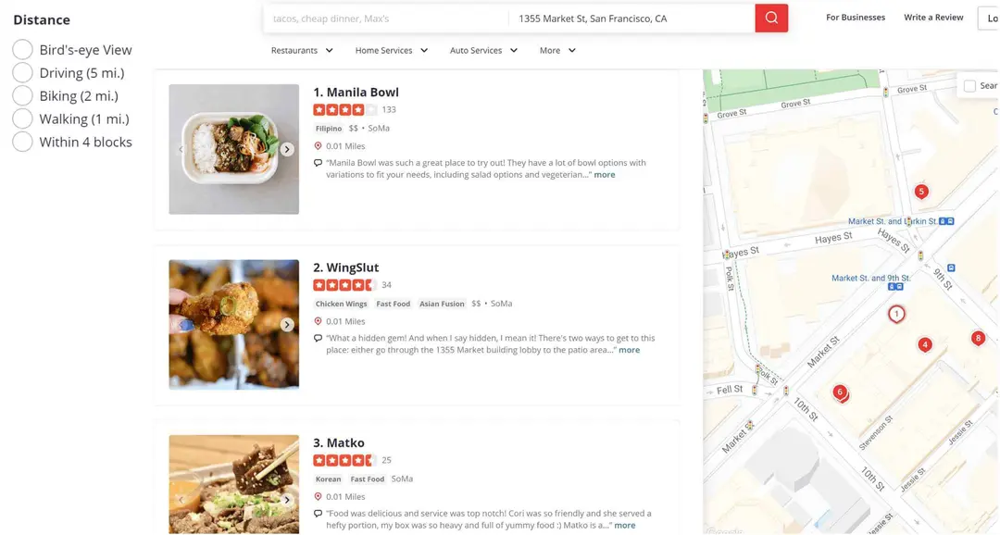

---

## Step 2 - Back-of-the-Envelope Estimation

This system is inherently **Read-Heavy**.

### QPS Estimation
*   **DAU:** 100 Million.
*   **Searches:** Assume 5 search queries per user per day.
*   **Search QPS:** $\frac{100,000,000 \times 5}{100,000 \text{ seconds/day}} = \mathbf{5,000 \text{ QPS}}$.

---

## Step 3 - High-Level Design

### API Design
The service uses standard RESTful conventions.

**1. Search API**
*   `GET /v1/search/nearby`
*   **Params:** `latitude` (decimal), `longitude` (decimal), `radius` (int, default 5000m).
*   **Response:** Paginated list of basic business objects (enough to render a map/list view).

**2. Business APIs**
*   `GET /v1/businesses/{id}` (Fetch full details, photos, reviews)
*   `POST /v1/businesses` (Create)
*   `PUT /v1/businesses/{id}` (Update)
*   `DELETE /v1/businesses/{id}` (Delete)

### Data Model & Schema
Because the system is heavily skewed towards reads with very infrequent writes, a mature Relational Database like **MySQL or PostgreSQL** is an excellent choice.

**1. Business Table**
Holds the core metadata for rendering the details page.

| Column | Key |
| :--- | :--- |
| `business_id` | **PK** |
| `address` | |
| `city` | |
| `state` | |
| `country` | |
| `latitude` | |
| `longitude` | |

*Table 3 Business table*

**2. Geospatial (Geo) Index Table**
A standard relational table is extremely inefficient at querying 2D spatial relationships. A dedicated Geo Index table (using Geohashes or similar spatial indexing) is required to power the `/search/nearby` endpoint efficiently.

### System Architecture
The backend is decoupled into two independent, stateless services to handle the radically different traffic patterns.

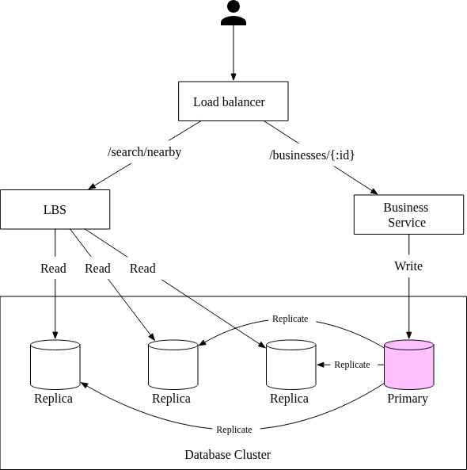

#### 1. Location-Based Service (LBS)
This is the read-heavy core of the system.
*   **Purpose:** Exclusively handles the `GET /search/nearby` spatial queries.
*   **Characteristics:** Extremely high QPS, especially during urban meal times. It is entirely stateless, allowing it to rapidly auto-scale horizontally to absorb traffic spikes.

#### 2. Business Service
This handles the administration and detailed views.
*   **Purpose:** Handles Business Owner CRUD operations (Writes) and Customer detail views (Reads).
*   **Characteristics:** Much lower QPS than the LBS. Also stateless and auto-scalable.

### Database Replication Strategy
Because the system is overwhelmingly read-heavy, it utilizes a classic **Primary-Secondary (Master-Slave)** database cluster.
*   **Primary Node:** The Business Service sends all write operations (adding/editing businesses) to the single Primary node.
*   **Replica Nodes:** The Primary node asynchronously replicates data to multiple Read Replicas. The LBS cluster exclusively queries these Read Replicas.
*   *Note on Consistency:* Replication delay means a newly added business might not appear in LBS searches for a few seconds (or minutes). This eventual consistency is perfectly acceptable given the business requirements.

---

## Step 4 - Spatial Indexing Algorithms Deep Dive

To query nearby locations quickly, we must efficiently query a database using both Latitude and Longitude.

### 1. The Problem: Two-Dimensional Search (Standard SQL)
The naive approach is to draw a bounding box around the user and query the database for all rows that fall within the boundaries.

```sql
SELECT business_id, latitude, longitude FROM business
WHERE (latitude BETWEEN {my_lat} - radius AND {my_lat} + radius) 
AND (longitude BETWEEN {my_long} - radius AND {my_long} + radius)
```

**Why this fails at scale:**
Even if you place standard database B-Tree indexes on the `latitude` and `longitude` columns, standard indexes only optimize searching in **one dimension**. 
As shown in Figure 4, querying for a longitude slice returns a massive vertical strip of the earth (Dataset 2), and querying a latitude slice returns a massive horizontal strip (Dataset 1). The database is forced to load two gigantic datasets into memory to compute the intersection. This is far too slow for 5,000 QPS.

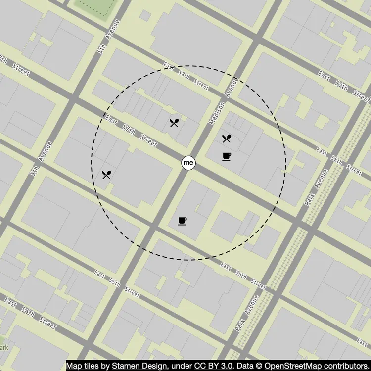
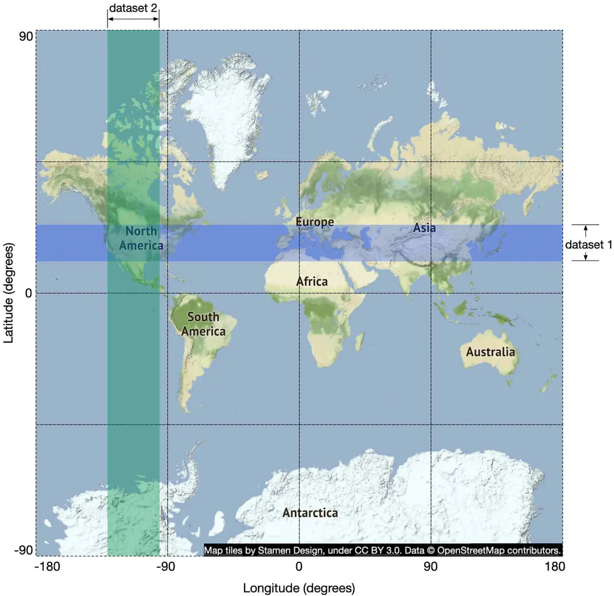

### 2. The Solution: Mapping 2D to 1D
To make database lookups fast, we must translate a 2-Dimensional coordinate (lat, lng) into a 1-Dimensional string or number that a standard database index can sort and search efficiently. 

At a high level, all geospatial algorithms accomplish this by recursively dividing the map into smaller areas/grids and assigning an identifier to each grid. 

There are two primary families of algorithms:
1.  **Hash-based:** Even Grid, **Geohash**, Cartesian Tiers.
2.  **Tree-based:** **Quadtree**, **Google S2**, RTree.

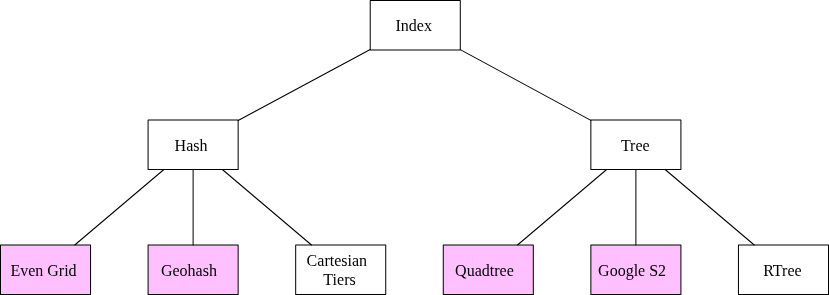

### 3. Hash-Based Approaches

#### A. Even Grid
The simplest approach is to slice the world map into a static grid of identically sized squares.
*   **The Flaw:** Business distribution is not even. A single square covering downtown Manhattan will contain tens of thousands of businesses, while a square covering the ocean will contain zero. This uneven data distribution makes index querying inefficient.

#### B. Geohash
Geohash improves upon the Even Grid by recursively dividing the world into quadrants, alternating between latitude and longitude divisions.
1.  **Divide:** The world is split into 4 quadrants (represented by `00`, `01`, `10`, `11`).
2.  **Recurse:** Each quadrant is split into 4 smaller quadrants.
3.  **Base32:** The resulting binary string is converted into a base32 string.

**Example:**
*   Google HQ: `1001 10110... (binary)` $\rightarrow$ **`9q9hvu`**
*   Facebook HQ: `1001 10110... (binary)` $\rightarrow$ **`9q9jhr`**

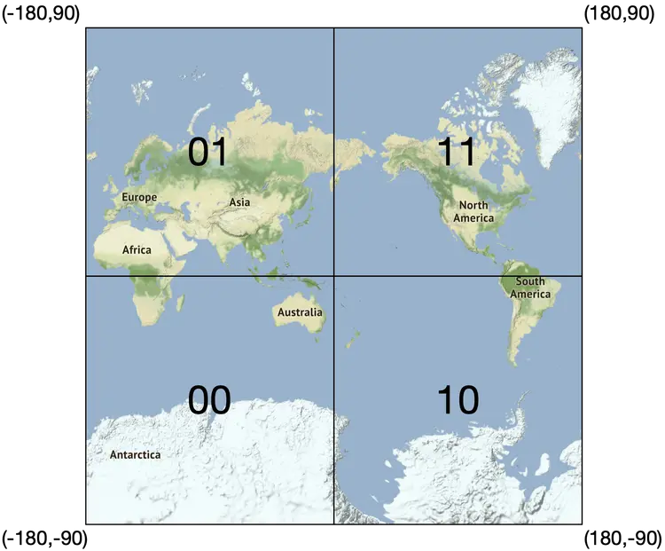
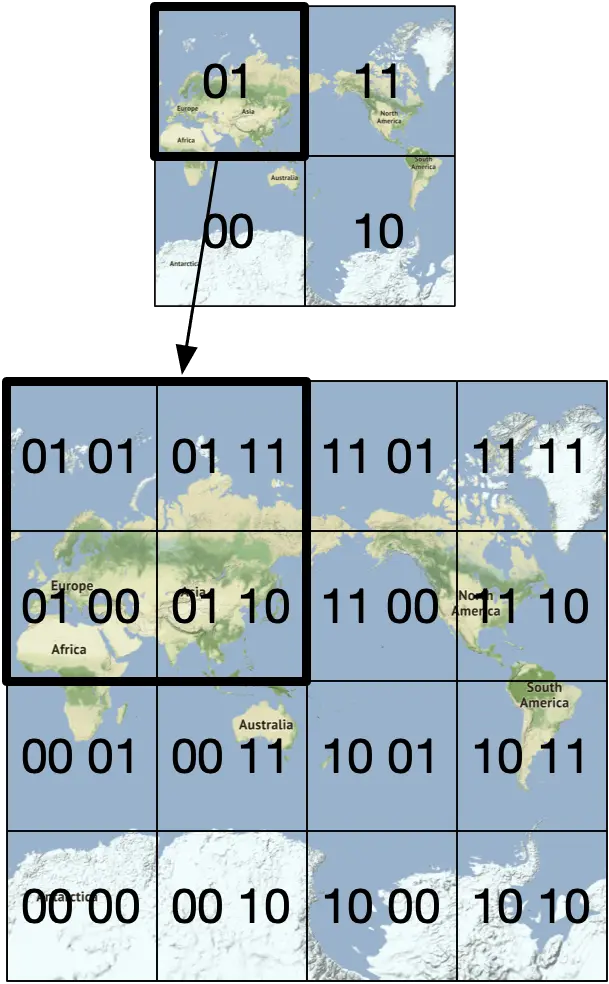

**Precision Levels:**
The length of the geohash string determines the size of the geographic grid. In a database, finding nearby businesses simply becomes a string prefix-matching operation (`LIKE '9q9h%'`). 

We dynamically choose the geohash length based on the user's requested search radius:
*   **Radius 0.5 km:** Use Geohash Length **6** (Grid: $\sim 1.2\text{km} \times 600\text{m}$)
*   **Radius 1 - 2 km:** Use Geohash Length **5** (Grid: $\sim 4.9\text{km} \times 4.9\text{km}$)
*   **Radius 5 - 20 km:** Use Geohash Length **4** (Grid: $\sim 39\text{km} \times 19\text{km}$)

#### C. Geohash Edge Cases (Boundary Issues)

Geohash guarantees that if two strings share a long prefix, they are physically close. However, the reverse is **not** true.

1.  **The Equator/Meridian Split:** Two locations can be extremely close (e.g., 30km apart) but sit on opposite sides of the equator or prime meridian. Because the very first bit of a Geohash divides the hemisphere, their resulting Geohashes will share **zero** prefixes.
2.  **Local Grid Borders:** A user standing on the absolute edge of Geohash Grid A might be physically closer to a restaurant just across the border in Grid B than a restaurant located in the center of Grid A.

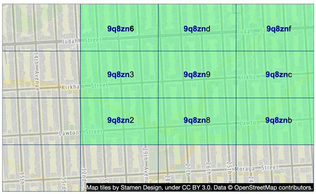
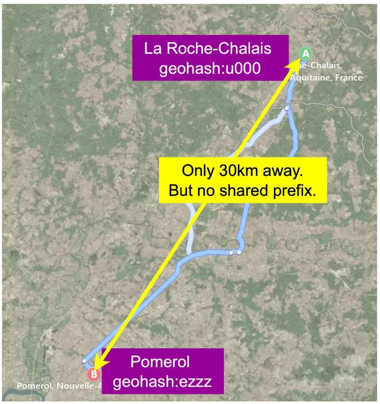
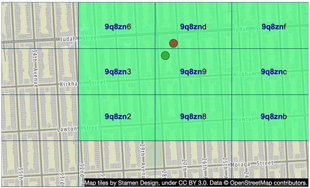

**The Solution to Boundary Issues:** 
When querying the database, the backend must not just query the user's current Geohash. It must calculate the Geohash strings for the **8 surrounding neighbor grids** (which can be done in constant time) and query all 9 grids simultaneously.

#### D. Expanding the Search (Handling Sparse Results)
If a user searches in a rural area, the initial 9 grids might return zero businesses. 

To dynamically expand the search radius, the system simply **removes the last character** of the current Geohash string and re-queries. Removing a character bumps the precision level down, exponentially increasing the physical size of the search grid. The system repeats this process until enough results are found.

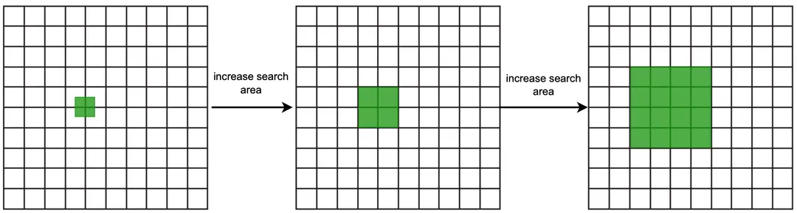

### 4. Tree-Based Approaches

#### A. Quadtree
Unlike Geohash, which is implemented as a string index within a standard Database, a Quadtree is an **in-memory data structure** built directly on the application servers (the LBS nodes).

1.  **The Algorithm:** The root node represents the entire world map. It is recursively divided into 4 quadrants.
2.  **The Stopping Criteria:** The tree stops subdividing a node when the number of businesses inside that quadrant drops below a threshold (e.g., $\le 100$ businesses).

This elegantly solves the uneven distribution problem. Dense areas (like downtown Manhattan) will result in a very deep tree with tiny, highly granular physical grids. Sparse areas (like the ocean) will remain massive, shallow grids.

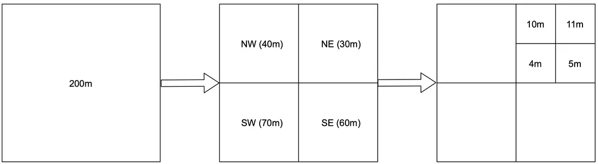
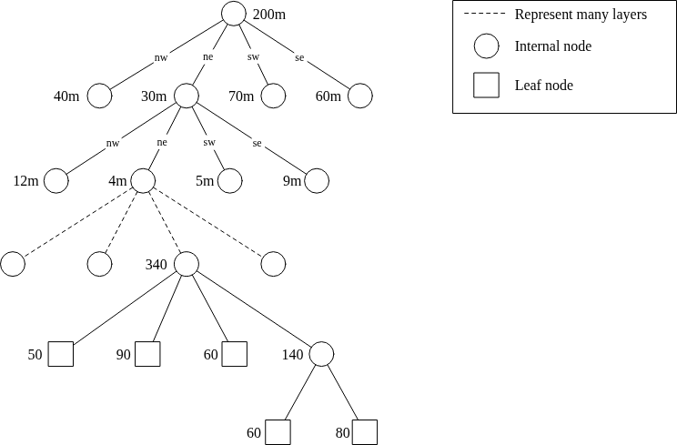

**Memory Calculations**
Is it feasible to store 200 million businesses in RAM on every LBS server? Yes.
*   **Leaf Nodes:** $\sim 200 \text{M} / 100 \text{ limit} = 2 \text{ Million}$ leaf nodes. Each leaf stores coordinates and an array of 100 IDs ($\sim 832 \text{ bytes}$).
*   **Internal Nodes:** Mathematically, internal nodes are $\sim \frac{1}{3}$ of leaf nodes ($\sim 0.67 \text{ Million}$). Each stores pointers to 4 children ($\sim 64 \text{ bytes}$).
*   **Total RAM:** $2\text{M} \times 832\text{B} + 0.67\text{M} \times 64\text{B} \approx \mathbf{1.71 \text{ GB}}$. This easily fits in the memory of any modern server.

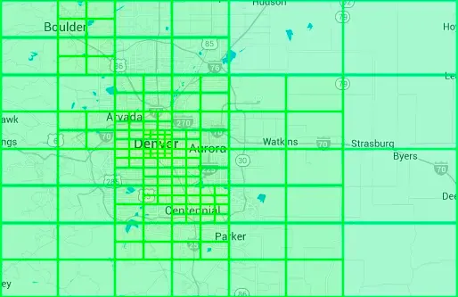

#### Operational Considerations for Quadtrees
While Quadtrees are blazing fast for reads, their in-memory nature introduces severe operational complexities compared to Geohash:

1.  **Slow Server Startup:** An LBS server cannot serve traffic immediately upon booting. It takes several minutes to fetch 200M rows from the database and construct the tree in RAM. Deployments must be rolled out very slowly to avoid taking the whole cluster offline (Service Brownout).
2.  **Live Updates are Hard:** Updating a live, multi-threaded Quadtree structure as businesses are added/deleted requires complex locking mechanisms. 
3.  **The Compromise:** Since the business requirements state that updates only need to reflect by the next day, the optimal operational path is to construct a new Quadtree entirely offline via a nightly batch job, and have the LBS servers cleanly pull the new tree into memory once a day.

#### B. Google S2 Geometry Library
S2 is an incredibly powerful, industry-standard in-memory geospatial library used by Google, Tinder, and others.

Instead of dividing the world into flat squares, S2 projects the 3D sphere of the Earth onto a cube, and then uses a **Hilbert Curve** (a mathematical, space-filling fractal curve) to map the 2D surface into a 1D index.
*   **The Hilbert Property:** The primary mathematical benefit of the Hilbert curve is that two points that are close to each other on the curve are mathematically close to each other in 1D space. This makes 1D searching incredibly efficient.

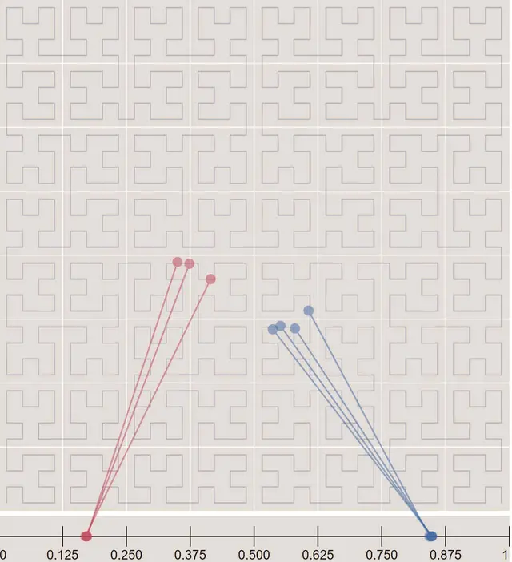

**Advantages of S2 over Geohash/Quadtree:**
1.  **Geofencing (Arbitrary Boundaries):** Geohash strictly queries square grids. S2 excels at Geofencing—defining custom, irregular polygonal boundaries (e.g., "Find restaurants strictly within the city limits of Seattle", or mapping a specific school zone). 
2.  **Region Cover Algorithm:** Geohash forces you into rigid precision levels (you must choose exactly Level 4 or Level 5). S2's Region Cover algorithm is flexible. You provide it a complex polygon and max cell count, and it covers that exact shape with a dynamic mix of tiny, medium, and large cells to optimize the query perfectly.

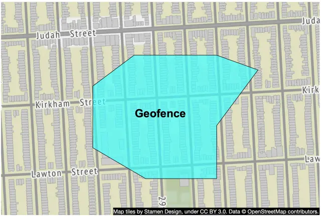

---

## Step 5 - Comparison & Final Recommendations

In an interview setting, **Geohash** or **Quadtree** are the recommended architectures to propose, as S2 is often too mathematically complex to whiteboard in 45 minutes.

Here is how the industry utilizes these algorithms:
*   **Geohash:** Redis, MongoDB, Lyft
*   **Quadtree:** Yext
*   **Both:** Elasticsearch
*   **S2:** Google Maps, Tinder

### Geohash vs. Quadtree (The Trade-offs)

When choosing between the two, it comes down to the specific query requirements and operational capacity.

#### 1. Geohash (The Database Approach)
*   **Pros:** 
    *   Incredibly easy to implement and scale via standard databases.
    *   Updates and Deletions are trivial. To remove a business, you simply delete the row from the database table. No locking required.
*   **Cons:** 
    *   Grid size is fixed by the precision level. It cannot dynamically shrink or grow based on population density.

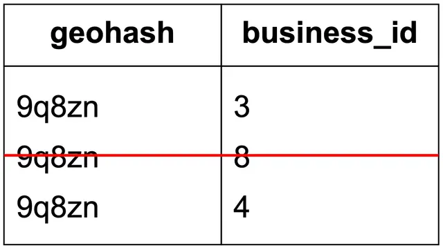

#### 2. Quadtree (The In-Memory Approach)
*   **Pros:**
    *   **K-Nearest Queries:** Quadtree dominates at K-Nearest neighbor searches (e.g., *"Find the 5 closest gas stations, regardless of how far away they are"*). The algorithm simply walks up the tree until 5 results are found. Geohash struggles with this.
    *   Dynamically handles population density perfectly.
*   **Cons:**
    *   Much harder to build and operate.
    *   Updating or deleting a business requires traversing the tree $O(\log n)$ and executing complex multi-threaded locking to prevent data corruption. Furthermore, if a leaf node fills up, the tree must execute a complex rebalancing operation.

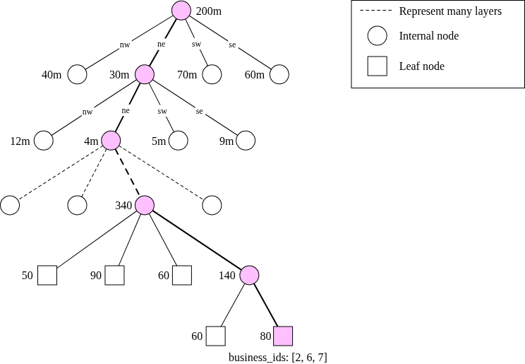

---

## Step 6 - Database Scaling Deep Dive

### Scaling the Business Table
The massive table holding business metadata (descriptions, photos) is a prime candidate for standard **Horizontal Sharding** by `business_id`. This evenly distributes the storage load.

### Scaling the Geohash Index Table
If using the Geohash Database approach, there are critical considerations for schema design and scaling.

#### 1. Schema Design (Avoid JSON Arrays)

**Option 1 (Bad): JSON Array**
Storing a JSON array of businesses per grid.

| geospatial_index |
| :--- |
| `geohash` |
| `list_of_business_ids` (JSON array) |

*Table 9 list_of_business_ids is a JSON array*

Updating or removing a business requires fetching the entire array, parsing it, modifying it, and saving it back. This causes severe locking and race condition issues.

**Option 2 (Good): Compound Key**
Storing a 1-to-1 mapping. Create a compound primary key of `(geohash, business_id)`.

| geohash | business_id |
| :--- | :--- |

*Table 10 business_id is a single ID*

If a grid has multiple businesses, there are separate rows. Adding or removing a business is a simple, lock-free `INSERT` or `DELETE` operation.

| geohash | business_id |
| :--- | :--- |
| `32feac` | `343` |
| `32feac` | `347` |
| `f3lcad` | `112` |
| `f3lcad` | `113` |

*Table 11 Sample rows of the geospatial index table*

#### 2. Scaling Strategy (Do NOT Shard)
A common interview trap is to immediately suggest sharding the Geohash index table.
*   **The Reality of Data Size:** The entire Geohash index for 200 million businesses takes less than **2 GB** of disk space. It effortlessly fits into the working memory of a single modern database server.
*   **The Real Bottleneck:** The bottleneck is read volume (CPU and Network I/O), not storage capacity.
*   **The Solution:** Do not introduce the massive complexity of application-layer sharding. Simply scale by adding **Read Replicas**. The Primary node handles the low-volume writes, and an array of Replica nodes absorbs the massive read QPS.

---

## Step 7 - Caching Deep Dive

### 1. Do we really need a Cache?
In a system design interview, do not blindly throw Redis at the problem without justification. 
Because the Geohash index is so small ($\sim 2$ GB), the database will inherently cache the entire dataset in its own working RAM. DB queries will not be I/O bound. Therefore, DB Read Replicas might be sufficient on their own.

However, if read throughput is overwhelmingly high and cost analysis justifies it, we can introduce a caching layer.

### 2. Cache Key Selection (Avoid GPS Coordinates)
**Never use raw Latitude/Longitude as a cache key.** GPS coordinates fluctuate slightly even when a user is standing perfectly still. This will result in constant cache misses.

Instead, use the **Geohash String** as the cache key. Because a Geohash represents a static geographic grid, any user standing within that grid will generate the exact same Geohash string, guaranteeing a cache hit.

### 3. What Data to Cache

We separate the cache into two distinct buckets:

#### Bucket A: The Geohash Cache
*   **Key:** `geohash` (e.g., `9q8z`)
*   **Value:** List of `business_id`s in that grid.
*   **Precision Strategy:** Because users can request varying radiuses, we pre-compute and cache the Geohashes at all 3 required precision levels (Lengths 4, 5, and 6).
*   **Memory Footprint:** $8 \text{ bytes (per ID)} \times 200 \text{ Million businesses} \times 3 \text{ precision levels} = \mathbf{\sim 5 \text{ GB}}$.
*   **Scaling:** 5 GB easily fits in a single Redis server. To achieve global low latency, we deploy full replicas of this 5 GB Redis cache to every geographic data center.

#### Bucket B: The Business Info Cache
*   **Key:** `business_id`
*   **Value:** The full Business Object (name, address, photo URLs, reviews).
*   **Strategy:** This is standard object caching to rapidly render the frontend UI once the Geohash cache returns the relevant IDs.

---

## Step 8 - Global Deployment & Follow-Up Questions

### 1. Multi-Region Deployment
Because location services are globally utilized, deploying the LBS to multiple physical regions (US West, Europe, Asia) provides massive advantages:

*   **Latency:** Physical proximity drops latency dramatically (e.g., 10ms for a local query vs 140ms for cross-continent).
*   **Load Distribution:** Extremely dense populations (like Japan) can have their own dedicated data centers to isolate the load.
*   **Data Privacy (Compliance):** To comply with strict data sovereignty laws (like GDPR), DNS routing can guarantee that a European citizen's location data never leaves the European data center.

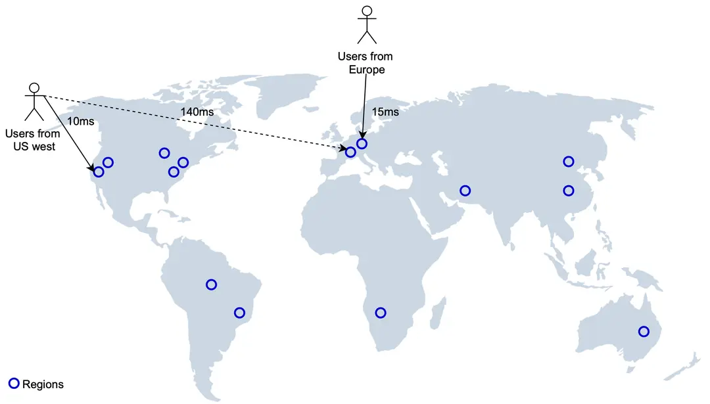

### 2. Interview Follow-Up: Filtering Results
**Interviewer:** *"How do we handle advanced filters, like 'Only show Italian restaurants' or 'Only show places open right now'?"*

**Candidate Answer:** Do **not** bake complex filtering logic into the Geospatial Index (Geohash/Quadtree). The Geospatial index serves one purpose: rapidly finding a small list of IDs within a geographic grid. 
Because the grids are physically small, the number of returned IDs is very low (e.g., a few dozen). The system should simply fetch those few dozen full Business Objects from the database/cache, and perform the category/time filtering entirely in the application layer memory before returning the final list to the user.

---

## Step 9 - Final Architecture & Request Flow

The final architecture fully integrates the decoupled Location-Based Service (LBS), the Business Administration Service, the highly scalable Read-Replica Database, and the dual-bucket Redis caching layer.

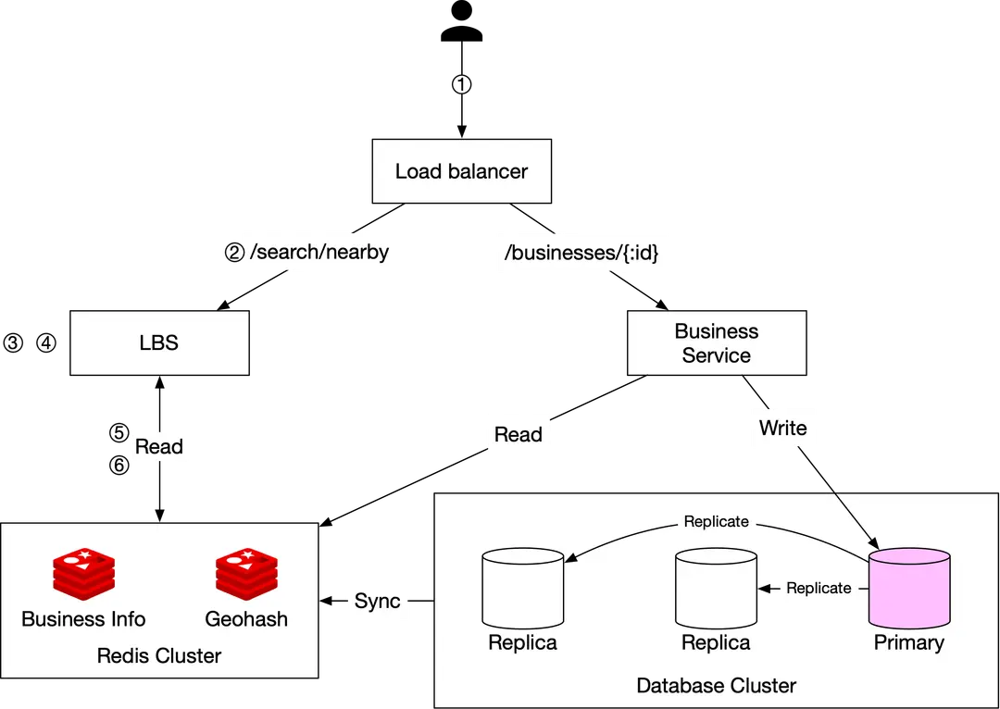

### End-to-End Read Flow: "Find nearby restaurants"
1.  **Request:** The user opens the app. The client sends `lat=37.776, lng=-122.416, radius=500m` to the Load Balancer.
2.  **Routing:** The Load Balancer routes the read query to an available stateless **LBS node**.
3.  **Calculate Grid:** The LBS evaluates the 500m radius and determines it must use **Geohash length 6**. It computes the user's current Geohash, plus the 8 neighboring Geohashes.
4.  **Fetch IDs (Cache Bucket A):** The LBS makes parallel requests to the **Redis Geohash Cache** for all 9 grids, retrieving a list of raw `business_id`s.
5.  **Hydrate Objects (Cache Bucket B):** The LBS queries the **Redis Business Info Cache** using the retrieved IDs to fetch the fully hydrated business JSON objects (names, photos).
6.  **Filter & Rank:** The LBS calculates the exact physical distance between the user and each business, applies any user filters (e.g., "Restaurants Only"), ranks them by distance, and returns the final JSON to the client.

### End-to-End Write Flow: "Update my business hours"
1.  **Request:** A restaurant owner updates their profile. The Load Balancer routes the write request to the **Business Service**.
2.  **Database Write:** The Business Service executes an `UPDATE` directly against the **Primary Database Node**.
3.  **Cache Invalidation:** Because the requirements stated that updates only need to take effect the next day, the system does not need complex distributed cache-invalidation locks. A simple offline **Nightly Batch Job** synchronizes the Primary Database updates into the Redis Caches.

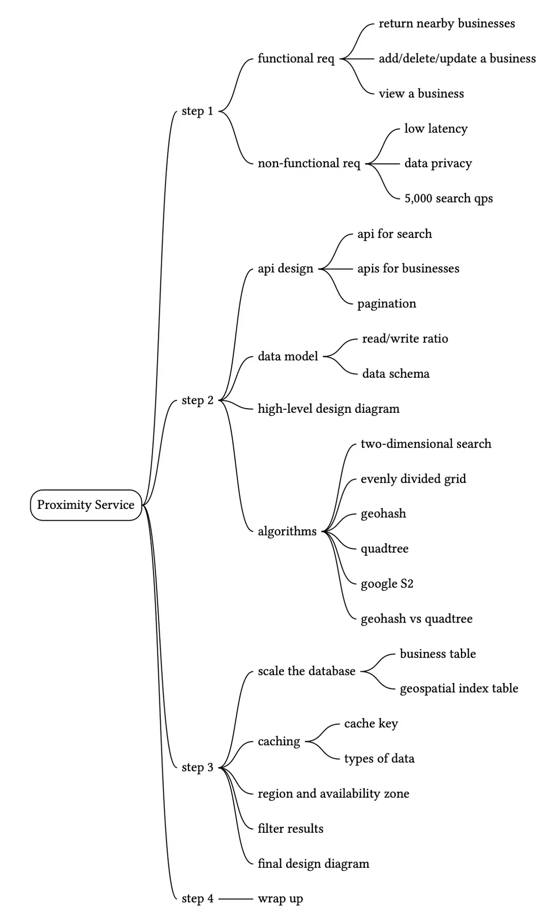

Reference Materials
[1] Yelp: https://www.yelp.com/

[2] Map tiles by Stamen Design:
http://maps.stamen.com/

[3] OpenStreetMap: https://www.openstreetmap.org

[4] GDPR: https://en.wikipedia.org/wiki/General_Data_Protection_Regulation

[5] CCPA: https://en.wikipedia.org/wiki/California_Consumer_Privacy_Act

[6] Pagination in the REST API:
https://developer.atlassian.com/server/confluence/pagination-in-the-rest-api/

[7] Google places API: https://developers.google.com/maps/documentation/places/web-service/search

[8] Yelp reservation API:
https://docs.developer.yelp.com/docs/reservation

[9] Regions and Zones:
https://docs.aws.amazon.com/AWSEC2/latest/UserGuide/using-regions-availability-zones.html

[10] Redis GEOHASH: https://redis.io/commands/GEOHASH

[11] POSTGIS: https://postgis.net/

[12] Cartesian tiers: http://www.nsshutdown.com/projects/lucene/whitepaper/locallucene_v2.html

[13] R-tree: https://en.wikipedia.org/wiki/R-tree

[14] Global map in a Geographic Coordinate Reference System:
https://bit.ly/3DsjAwg

[15] Base32: https://en.wikipedia.org/wiki/Base32

[16] Geohash grid aggregation: https://bit.ly/3kKl4e6

[17] Geohash: https://www.movable-type.co.uk/scripts/geohash.html

[18] Quadtree: https://en.wikipedia.org/wiki/Quadtree

[19] How many leaves has a quadtree:
https://stackoverflow.com/questions/35976444/how-many-leaves-has-a-quadtree

[20] Blue green deployment: https://martinfowler.com/bliki/BlueGreenDeployment.html

[21] Yext: Maps and Location Support:
https://www.yext.com/platform/features/maps-and-location-support

[22] S2: http://s2geometry.io/

[23] Hilbert curve: https://en.wikipedia.org/wiki/Hilbert_curve

[24] Hilbert mapping: http://bit-player.org/extras/hilbert/hilbert-mapping.html

[25] Geo-fence: https://en.wikipedia.org/wiki/Geo-fence

[26] Region cover: http://s2geometry.io/devguide/s2cell_hierarchy

[27] Bing map: https://bit.ly/30ytSfG

[28] MongoDB: https://docs.mongodb.com/manual/tutorial/build-a-2d-index/

[29] Geospatial Indexing: The 10 Million QPS Redis Architecture Powering Lyft:
https://www.youtube.com/watch?v=cSFWlF96Sds&t=2155s

[30] Geo Shape Type:
https://www.elastic.co/guide/en/elasticsearch/reference/1.6/mapping-geo-shape-type.html

[31] Geosharded Recommendations Part 1: Sharding Approach:
https://medium.com/tinder-engineering/geosharded-recommendations-part-1-sharding-approach-d5d54e0ec77a

[32] Get the last known location:
https://developer.android.com/training/location/retrieve-current#Challenges


