### Chapter: S3-like Object Storage (System Design Interview Vol 2)

In this chapter, we design an object storage service similar to Amazon Simple Storage Service (S3) which provides storage through a RESTful API.

#### Storage System 101

Storage systems fall into three broad categories:

**1. Block Storage (1960s)**
*   The rawest, most versatile form of storage (e.g., HDD, SSD physically attached to servers, or network-attached like Fibre Channel/iSCSI).
*   Presents raw hardware blocks to the server, allowing the server or application to format and manage them directly for maximum performance.
*   *Ideal for:* Virtual machines (VMs) and high-performance databases.

**2. File Storage**
*   Built on top of block storage, offering a higher-level abstraction.
*   Data is stored as files within a hierarchical directory structure.
*   Accessible by multiple servers using protocols like SMB/CIFS and NFS.
*   *Ideal for:* General-purpose file systems and sharing files/folders within an organization.

**3. Object Storage (Modern)**
*   Makes a deliberate trade-off: sacrifices raw performance for **high durability, vast scalability, and low cost**.
*   Requires no hierarchical directory structure; data is stored in a flat structure.
*   Data access is primarily via RESTful APIs.
*   *Ideal for:* Archival, backup, binary data, and unstructured "cold" data.

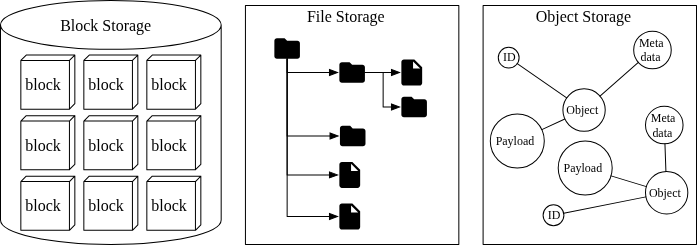

#### Storage Comparison Summary

| Feature | Block Storage | File Storage | Object Storage |
| :--- | :--- | :--- | :--- |
| **Mutable Content** | Yes | Yes | No (In-place updates not supported; versioning is). |
| **Cost** | High | Medium to High | Low |
| **Performance** | Medium to Very High | Medium to High | Low to Medium |
| **Consistency** | Strong | Strong | Strong |
| **Data Access** | SAS, iSCSI, FC | CIFS/SMB, NFS | RESTful API |
| **Scalability** | Medium | High | Vast |

#### Core Terminology

To design an S3-like system, we must establish the core concepts:
1.  **Bucket:** A logical container for objects. The bucket name must be globally unique across the entire system.
2.  **Object:** An individual piece of data stored in a bucket. It consists of the **Payload** (the raw bytes of data) and **Metadata** (name-value pairs describing the data).
3.  **Versioning:** A bucket-level feature keeping multiple distinct variants of the same object to recover from accidental deletions or overwrites.
4.  **Uniform Resource Identifier (URI):** Each resource (bucket or object) is uniquely addressed via RESTful API URIs.
5.  **Service-Level Agreement (SLA):** A contract guaranteeing performance. (e.g., AWS S3 Standard promises 99.999999999% durability and 99.9% availability).

#### Step 1 - Understand the Problem and Establish Design Scope

**Functional Requirements:**
*   Bucket creation.
*   Object upload, download, and versioning.
*   Listing objects within a bucket (similar to `aws s3 ls`).

**Non-Functional Requirements:**
*   **Scale:** 100 Petabytes (PB) of data per year.
*   **Data Durability:** 6 nines (99.9999%).
*   **Service Availability:** 4 nines (99.99%).
*   **Efficiency:** High performance at a minimized storage cost.

**Back-of-the-envelope estimation:**
*   Assuming a distribution of Small (0.5MB), Medium (32MB), and Large (200MB) objects at a 40% usage ratio.
*   Storing 100 PB requires indexing roughly **0.68 billion objects**. 
*   Assuming 1KB of metadata per object: **$\sim$ 0.68 TB just for metadata**.
*   *Key Takeaway:* Metadata is small enough to fit in distributed SSD clusters, but the payloads require massive disk scale-out.

#### Step 2 - Propose High-Level Design and Get Buy-In

Before architecting the system, we must establish its core behavioral principles:

1.  **Object Immutability:** Objects cannot be modified incrementally. You can only delete them or replace them entirely with a new version.
2.  **Key-Value Structure:** The object's URI acts as the key, and the file payload is the value. Data retrieval is purely RESTful (e.g., `GET /bucket1/object1.txt`).
3.  **Write Once, Read Many:** Over 95% of operations in object storage are read requests. The architecture must be deeply optimized for read-heavy workloads.
4.  **Separation of Data and Metadata:** Modeled directly after the UNIX file system, where filenames/permissions are stored in mutable *inodes*, while the actual file bytes are scattered across immutable disk blocks.
    *   **MetaStore:** Stores the *mutable* metadata (bucket policies, URIs, mappings to object IDs).
    *   **DataStore:** Stores the *immutable* binary payloads, accessible via network requests using abstract object IDs.
    *   *Benefits:* This separation allows independent scaling, independent tuning, and the use of completely different underlying database technologies for each store.

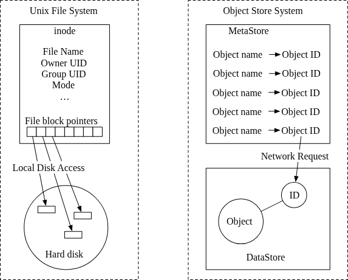
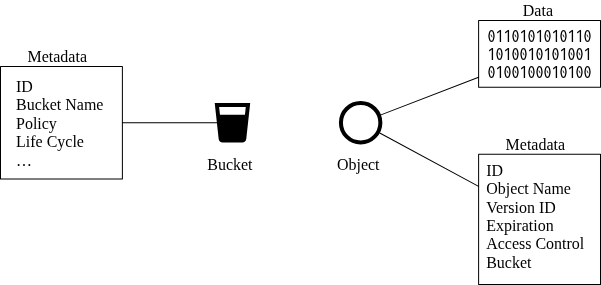

#### High-Level Architecture
The system relies on decoupled stateless services communicating with dedicated storage clusters.
*   **Load Balancer:** Distributes REST API requests.
*   **API Service:** A stateless orchestrator that coordinates remote procedure calls to IAM, Metadata, and Data services.
*   **IAM (Identity and Access Management):** Handles Authentication (who you are) and Authorization (what you are allowed to do with a specific bucket).
*   **Metadata Store:** A database exclusively for mutable object metadata (mapping filenames to internal UUIDs).
*   **Data Store:** The immutable blob storage cluster. It operates purely on internal UUIDs and is completely blind to user-facing object names.

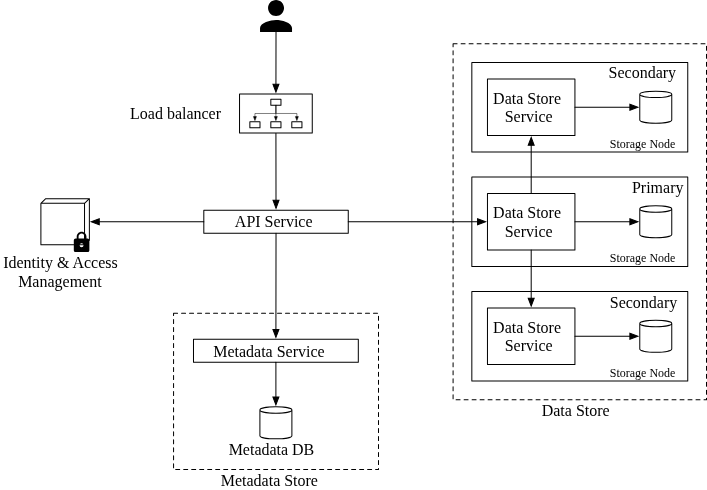

#### Core Workflows

**1. Uploading an Object**
To upload an object (e.g., `script.txt` to `bucket-to-share`):
1.  Client sends a `PUT` to create the bucket. The API Service verifies permissions with IAM, then creates the bucket entry in the Metadata Store.
2.  Client sends `PUT /bucket-to-share/script.txt` containing the binary payload.
3.  API Service validates IAM `WRITE` permissions.
4.  API Service streams the payload to the **Data Store**, which saves the immutable bytes and returns a generated UUID (e.g., `239D5...`).
5.  API Service writes a new row to the **Metadata Store** linking the user's `object_name` (`script.txt`) to the data store's `object_id` (`239D5...`).

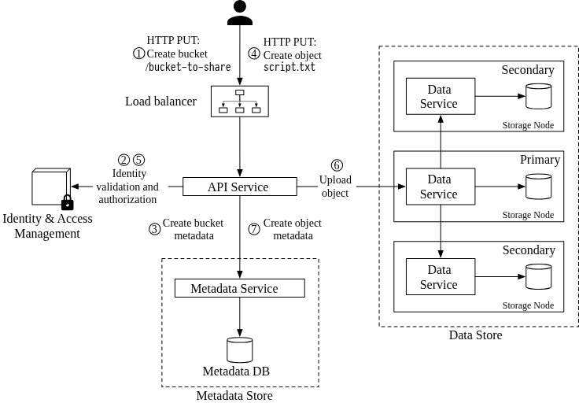

**2. Downloading an Object**
Buckets do not actually have a directory hierarchy. Filenames like `images/cat.jpg` are just flat strings.
1.  Client sends `GET /bucket-to-share/script.txt`.
2.  API Service validates IAM `READ` permissions.
3.  API Service queries the **Metadata Store** to resolve the object name `script.txt` into its underlying data `object_id` (UUID).
4.  API Service retrieves the binary payload from the **Data Store** using the UUID.
5.  API Service streams the payload back to the client.

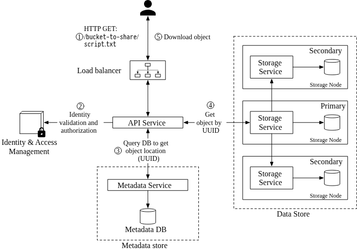

---

### Step 3 - Design Deep Dive

#### Data Store (Deep Dive)
While the Metadata DB strictly maps names to UUIDs, the **Data Store** cluster is responsible for persisting the actual physical bytes using those UUIDs. 

It is constructed of three main components:

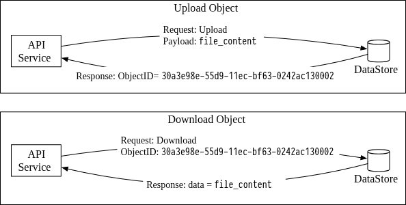
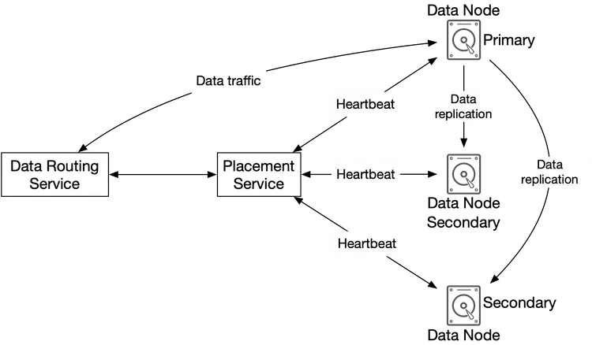

**1. Data Routing Service**
A stateless service (exposing REST/gRPC APIs) that sits in front of the Data Node cluster. It handles the heavy data streaming.
*   Acts as the intermediary, fetching bytes from or writing bytes to Data Nodes.
*   Queries the Placement Service to ask "Which Data Nodes should I stream this payload to?"

**2. Placement Service**
The "brain" of the Data Store cluster. It dictates exactly where objects should be physically saved.
*   **Virtual Cluster Map:** It maintains a topographical map of the entire physical network (e.g., Datacenter 1 $\rightarrow$ Rack 2 $\rightarrow$ Host 4 $\rightarrow$ Drive A).
*   **Placement Logic:** Uses the virtual cluster map to ensure replicas of an object are physically separated across different datacenters to guarantee high durability (protecting against a datacenter burning down).
*   **Health Monitoring:** Receives continuous heartbeats from all data nodes. If a node fails to report for 15 seconds, it is marked as "down".
*   *Implementation:* Because the Data Store collapses if this service dies, it is built as a tightly coupled 5 or 7 node cluster using the **Paxos** or **Raft** consensus protocol (guaranteeing survival as long as >50% of the nodes are alive).

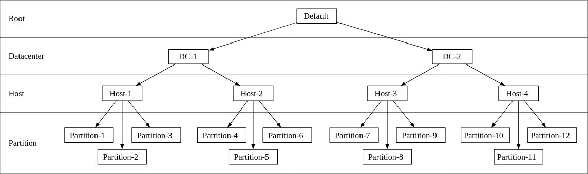

**3. Data Nodes**
The actual physical servers running the hard drives (HDDs/SSDs) that permanently store the payload.
*   A "Data Service Daemon" runs on every node, sending persistent heartbeats to the Placement Service.
*   The heartbeat contains vital metrics: How many drives the node manages, and how much disk space is currently free on each drive.
*   Upon connecting to the cluster, the Placement Service assigns the node a unique ID and tells it where it should replicate its data.

#### Data Persistence Flow
When the API Service streams a payload to the Data Store, it follows a strict sequence:
1.  **Generate ID:** The Data Routing Service generates a UUID for the object.
2.  **Determine Primary Node:** The Data Routing Service queries the Placement Service. The Placement Service calculates (via *consistent hashing*) which replication group should own the data and returns the location of the Primary Data Node.
3.  **Stream Data:** The Data Routing Service streams the bytes directly to the Primary Node.
4.  **Replication:** The Primary Node saves it locally, then pushes it to two Secondary Nodes. 
5.  **Acknowledge:** Once properly replicated, the Primary node responds with a success to the Data Routing service, which returns the UUID to the API Service.

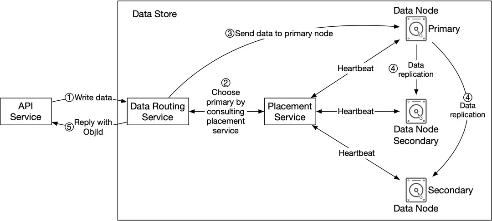

**Consistency vs. Latency Trade-offs**
Step 4 highlights a classic distributed systems trade-off regarding when the Primary Node sends the success Ack:
1.  **Strong Consistency (High Latency):** Primary waits for an Ack from *both* secondaries before returning an Ack to the user.
2.  **Medium Eventual Consistency (Medium Latency):** Primary waits for an Ack from *at least one* secondary.
3.  **Low Eventual Consistency (Low Latency):** Primary acks immediately after writing locally, replicating to secondaries purely in the background.

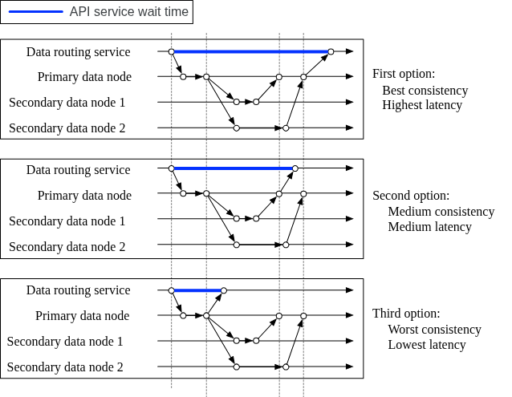

#### Managing Small Objects (Disk & Inode Optimization)
Storing millions of 10KB files on an OS creates two catastrophic problems:
1.  **Block Waste:** Standard file systems write in discrete 4KB blocks. Small files leave massive amounts of space trapped and unusable inside partially filled blocks.
2.  **Inode Exhaustion:** Operating systems enforce a strict hard limit on the total number of file `inodes` (the system records of where files physically begin). If you create a billion tiny files, you will completely run out of inodes and crash the driver, even if the disk is 99% empty.

**Solution: Write-Ahead Logs (Merge into Big Files)**
Instead of allowing the OS to map 1 Object to 1 OS File, the data node combines thousands of objects into a single large (e.g., a 2GB) `read-write` physical file. 
*   Incoming objects are appended to the file sequentially, much like a Write-Ahead Log.
*   Once a file hits 2GB, it is flipped to an immutable `read-only` state, and a new active file is created.
*   *Multithreading bottleneck:* Because writes to a single file must be strictly serialized, write throughput will drop. To bypass this, we provide dedicated `read-write` files to every independent core on the server processing incoming requests.

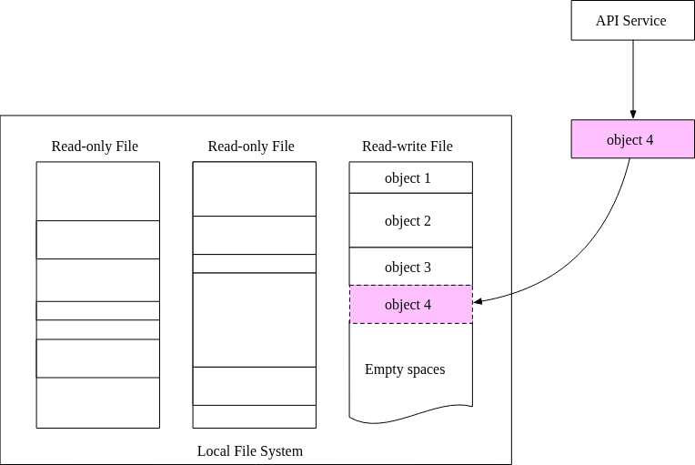

**Optimized Object Lookup (SQLite)**
Since thousands of objects are now sandwiched inside a single OS file, the Data Node must internally maintain a mapping schema (`object_id`, `file_name`, `start_offset_bytes`, `object_size_bytes`).

*   **RocksDB vs Relational:** RocksDB (SSTables) has extremely fast writes, but slower reads. Because object storage is 95% read operations, we need a B+ Tree powered relational database.
*   **The Database Engine:** Since this specific mapping table is purely local and only matters to this specific isolated node, running a heavy PostgreSQL cluster is massive overkill. A highly efficient, file-based relational database like **SQLite** is the optimal choice.

#### Data Durability & Erasure Coding

To achieve 6 to 11 nines of durability, object storage requires highly resilient data redundancy architecture.

**Failure Domains:**
A single disk will inevitably fail. A network switch may die, knocking out a server rack. An entire datacenter (Availability Zone / AZ) might flood. 
To guarantee data survives disasters, replicas must be placed across strictly isolated physical failure domains (e.g., streaming replicas to entirely separated AZs with independent power grids).
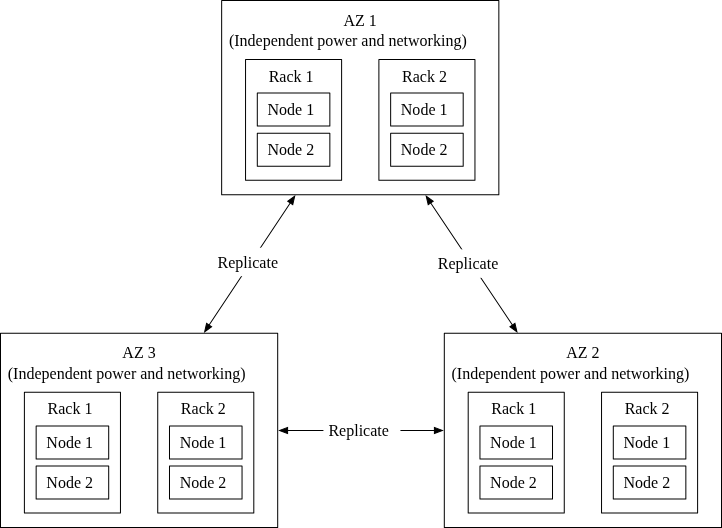

**Replication vs. Erasure Coding**
To create redundancy, data nodes use two distinct strategies:

1.  **3-Copy Replication:** The Data Node makes 3 full, identical copies of the object. 
    *   *Overhead:* 200%. (Storing a 1GB file costs 3GB of total disk space).
    *   *Speed:* Extremely fast for reads. The router just fetches the entire file from the closest single healthy node. No computation required.
2.  **Erasure Coding:** Designed specifically to slash storage costs. It mathematically fragments data and generates *parity bits*. For example, an (8+4) setup splits data into 8 chunks and calculates 4 parity chunks. If anywhere up to 4 nodes die simultaneously, the system can use the surviving fragments and mathematical formula to reconstruct the lost data instantly.
    *   *Overhead:* 50%. (A massive infrastructure cost savings compared to 3-Copy replication).
    *   *Speed:* High Latency. To read a file, the router must fetch fragments from 8 different nodes simultaneously. If a node is down, the system burns heavy CPU resources mathematically calculating the reconstruction.
    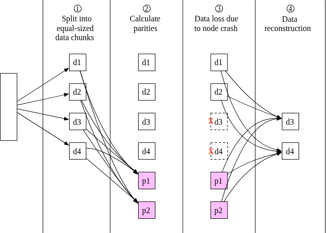
    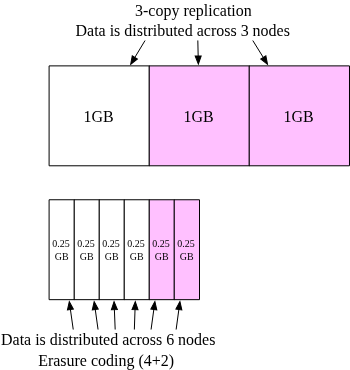

*Design Verdict:* While Erasure Coding mathematically guarantees up to 11 nines of durability and halts spiraling storage costs, its latency and CPU-overhead severely complicate the Data Node design. Latency-sensitive environments may stick to standard Replication.

#### Data Correctness (Checksums)

While erasure coding solves the problem of completely dead disks, it does not fix silent in-memory data corruption (bit flips).
To guarantee correctness, the system relies on strict Checksum verification.
*   **Checksum Generation:** Before a file is written or marked read-only, an MD5 hash of the payload is calculated.
*   **Verification on Read:** When a file is fetched by the Data Router, the router recalculates the MD5 of the fetched bytes. If the calculated hash does not perfectly match the appended MD5 checksum, the data is corrupt and must be immediately reconstructed from other replicas.
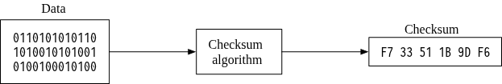
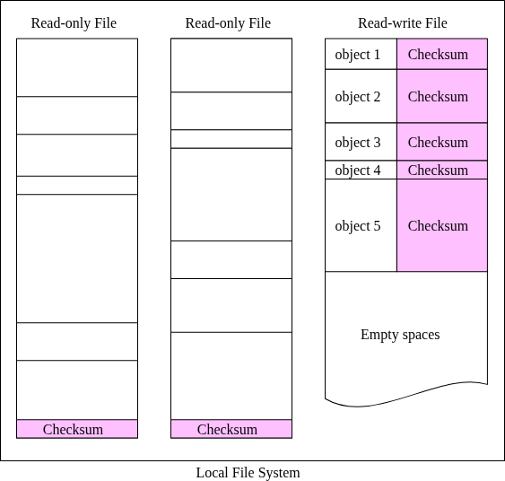

#### Metadata Store Data Model

The Metadata database manages two primary tables: `bucket` and `object`.
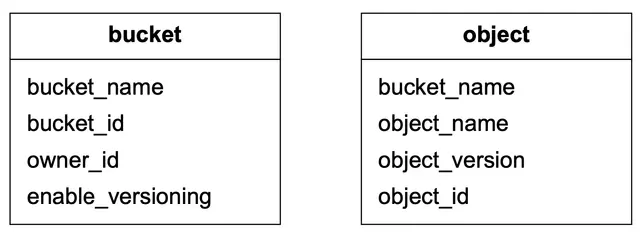

**Scaling the Metadata DB**
*   **Bucket Table:** Extremely small. For example, 1 million users $\times$ 10 buckets $\times$ 1KB = 10GB. The entirety of the world's buckets could fit on a single modern DB server. (It uses read-replicas for load balancing).
*   **Object Table:** Absolutely massive. It requires heavy sharding.
    *   *Bad Shard Key (Bucket ID):* Causes massive hotspots. One mega-bucket might hold billions of objects, overloading a single database instance.
    *   *Bad Shard Key (Object ID):* Distributes load perfectly, but ruins standard queries because the API looks up files by their URI name, not their UUID.
    *   *Ideal Shard Key:* Target the hash of `(bucket_name, object_name)`. This perfectly balances the load while keeping URI-based `GET`/`PUT` lookups mathematically instant.

#### The Object Listing Problem (`aws s3 ls`)

Because S3 uses a flat key-value architecture, **there are no directories**. 
A file stored at `s3://mybucket/CA/cities/la.txt` is just a long string name. The "directories" are simulated purely using string **prefixes** (e.g., `CA/cities/`).

To list simulated directories, the database runs a `LIKE` query:
`SELECT * FROM object WHERE bucket_id="123" AND object_name LIKE 'CA/%'`

**The Distributed Pagination Dilemma**
Paginating results (e.g., `LIMIT 10 OFFSET 0`) across a deeply sharded database is incredibly complex. 
*   If the Object table is split across 100 database shards, the API would have to run the `LIKE` query on all 100 nodes, pull back 1,000 overlapping results, sort them in memory, return 10 to the user, and somehow track 100 unique offset cursors for the next page.
*   **The Practical Trade-off:** Object storage is built for immense scale, not blazing-fast directory browsing. To bypass this pagination nightmare, the system maintains a completely separate, denormalized **Listing Table** that is sharded strictly by `bucket_id`. 
*   This ensures all objects for a specific bucket live on a single database purely for the sake of the `LS` command. It allows a standard, simple pagination query at the cost of sub-optimal performance for mega-buckets.

#### Object Versioning & Delete Markers

In a versioned bucket, modifying or overwriting a file (e.g., `script.txt`) does not replace the old record in the Metadata DB.
*   **Updates:** The API Service creates a brand new row in the Metadata DB with the exact same `bucket_id` and `object_name`, but maps it to the new `object_id` payload. It uses a `TIMEUUID` as the `object_version`. To find the current version, the DB simply queries the row with the largest `TIMEUUID`.
*   **Deletions:** Deleting a file does *not* erase it. Instead, a new row is inserted where the payload `object_id` is marked as a **Delete Marker**. If a user issues a `GET` request and the highest `TIMEUUID` is a Delete Marker, the API returns a `404 Not Found`.

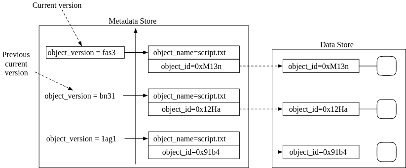
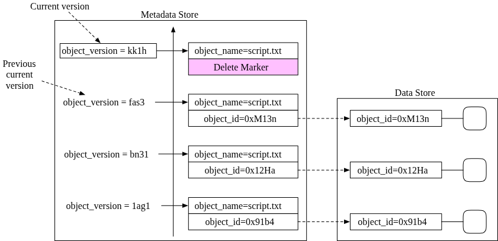

#### Multipart Uploads

Streaming a massive 10GB file in a single HTTP request is fragile. If the user's internet drops at 99%, the entire upload is lost. S3 solves this via Multipart Chunking.
1.  **Initiation:** The client asks to initiate an upload. The Data Store returns a unique `uploadID`.
2.  **Upload:** The client splits the file into chunks (e.g., 200MB each) and uploads them independently (in parallel) using the `uploadID`.
3.  **ETag Return:** As each chunk arrives, the Data Store calculates its MD5 checksum and returns it to the client as an `ETag`.
4.  **Completion:** Once all chunks complete, the client sends a final request listing every `ETag` in order. The Data Store then spends a few minutes mathematically reassembling the individual chunks into the final massive object.

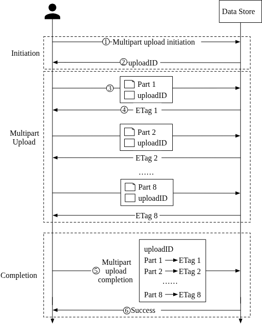

#### Garbage Collection (File Compaction)

Because S3 uses `read-only` WAL files and lazy deletion (Delete Markers), files are never physically erased from the hard drives synchronously. Over time, those massive 2GB files become padded with dead space (deleted versions, corrupted bits, orphaned multipart blobs).

**The Compaction Process:**
1.  A background Garbage Collector scans through old, inactive `read-only` files.
2.  It copies *only* the objects that are still actively marked as "alive" in the Metadata DB into a brand new `read-write` active file.
3.  It updates the `start_offset` byte mappings in the SQLite database to point to the new location (wrapped in a strict transaction).
4.  Once all live objects are safely moved, the entire old 2GB `read-only` file is permanently wiped from the disk.

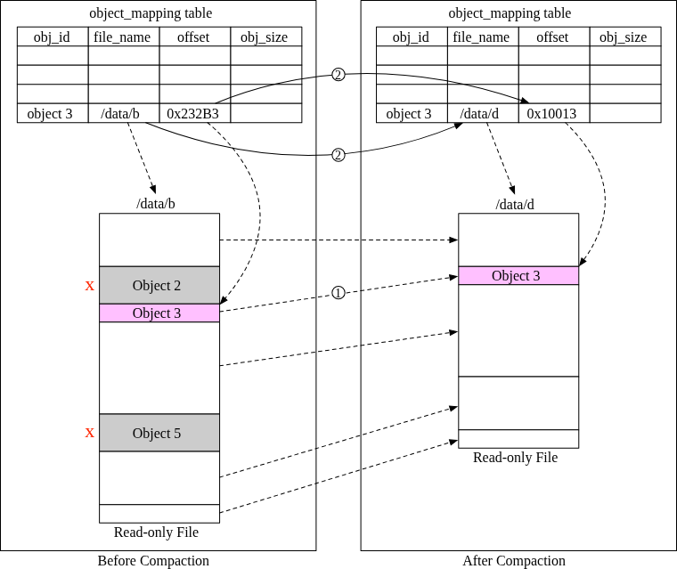

---

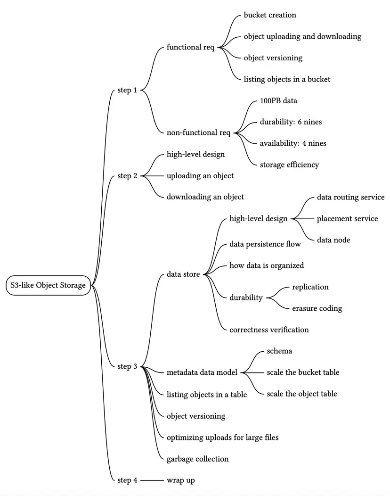

Reference Material
[1] Fibre channel: https://en.wikipedia.org/wiki/Fibre_Channel

[2] iSCSI: https://en.wikipedia.org/wiki/ISCSI

[3] Server Message Block: https://en.wikipedia.org/wiki/Server_Message_Block

[4] Network File System: https://en.wikipedia.org/wiki/Network_File_System

[5] Amazon S3 Strong Consistency: https://aws.amazon.com/s3/consistency/

[6] Serial Attached SCSI: https://en.wikipedia.org/wiki/Serial_Attached_SCSI

[7] AWS CLI ls command: https://docs.aws.amazon.com/cli/latest/reference/s3/ls.html

[8] Amazon S3 Service Level Agreement: https://aws.amazon.com/s3/sla/

[9] Ambry: LinkedIn’s Scalable Geo-Distributed Object Store:
https://assured-cloud-computing.illinois.edu/files/2014/03/Ambry-LinkedIns-Scalable-GeoDistributed-Object-Store.pdf

[10] inode: https://en.wikipedia.org/wiki/Inode

[11] Ceph’s Rados Gateway: https://docs.ceph.com/en/pacific/radosgw/index.html

[12] grpc: https://grpc.io/

[13] Paxos: https://en.wikipedia.org/wiki/Paxos_(computer_science)

[14] Raft: https://raft.github.io/

[15] Consistent hashing: https://www.toptal.com/big-data/consistent-hashing

[16] RocksDB: https://github.com/facebook/rocksdb

[17] SSTable: https://www.igvita.com/2012/02/06/sstable-and-log-structured-storage-leveldb/

[18] B+ tree: https://en.wikipedia.org/wiki/B%2B_tree

[19] SQLite: https://www.sqlite.org/index.html

[20] Data Durability Calculation: https://www.backblaze.com/blog/cloud-storage-durability/

[21] Rack: https://en.wikipedia.org/wiki/19-inch_rack

[22] Erasure Coding: https://en.wikipedia.org/wiki/Erasure_code

[23] Reed–Solomon error correction: https://en.wikipedia.org/wiki/Reed%E2%80%93Solomon_error_correction

[24] Erasure Coding Demystified: https://www.youtube.com/watch?v=Q5kVuM7zEUI

[25] Checksum:https://en.wikipedia.org/wiki/Checksum

[26] Md5: https://en.wikipedia.org/wiki/MD5

[27] Sha1: https://en.wikipedia.org/wiki/SHA-1

[28] Hmac: https://en.wikipedia.org/wiki/HMAC

[29] TIMEUUID: https://docs.datastax.com/en/cql-oss/3.3/cql/cql_reference/timeuuid_functions_r.html

