### Chapter: Design a Stock Exchange - Summary

A stock exchange facilitates efficient matching between buyers and sellers. This chapter focuses on designing a modern, electronic exchange system for stocks with high performance and robustness.

![Figure 1 Largest stock exchanges (Source: [5])](figure-1.png)

---

### Step 1 - Understand the Problem and Establish Design Scope

#### Functional Requirements
*   **Trading Asset:** Stocks only.
*   **Order Operations:** Support placing and canceling limit orders.
*   **Real-time Matching:** Match trades and update users in real-time.
*   **Order Book:** Provide a real-time order book (list of buy/sell orders).
*   **Risk Checks:** Implement simple risk checks (e.g., max 1 million shares of a particular stock per day).
*   **Wallet Management:** Ensure users have sufficient funds; withhold funds for orders in the order book.
*   **Scale:** Support tens of thousands of concurrent users, at least 100 symbols, and billions of orders per day.

#### Non-functional Requirements
*   **Availability:** 99.99% minimum.
*   **Fault Tolerance:** Essential for fast recovery in production incidents.
*   **Latency:** Millisecond-level round-trip latency (from order entry to filled execution), with a strong focus on the **99th percentile**.
*   **Security:** Account management, KYC (Know Your Client) compliance, and DDoS prevention.

---

### Back-of-the-envelope Estimation

We assume a trading day modeled after NYSE (6.5 hours).

*   **Symbols:** 100
*   **Order Volume:** 1 billion orders per day.
*   **System Scale:**
    *   **Average QPS:** `1,000,000,000 / 6.5 hours / 3,600 seconds` ≈ **43,000 QPS**.
    *   **Peak QPS:** `43,000 * 5` ≈ **215,000 QPS** (modeling high traffic at market open/close).

### Business Knowledge 101

To design an exchange, it is essential to understand core industry concepts:

#### 1. Key Actors
*   **Brokers:** Retail gateways (e.g., Robinhood, Fidelity) that provide a user interface for regular traders.
*   **Institutional Clients:** Professional entities (pension funds, hedge funds) trading in massive volumes. Some require **market-making** capabilities with ultra-low latency, while others (like pension funds) use **order splitting** to minimize market impact.

#### 2. Order Types
*   **Limit Order:** A buy/sell order with a fixed price. May not find a match immediately.
*   **Market Order:** No price specified; execution occurs immediately at the current market price, sacrificing cost for speed.

#### 3. Market Data Levels
*   **L1 (Level 1):** Provides the **best bid** (highest price a buyer is willing to pay) and **best ask** (lowest price a seller is willing to sell) and their quantities.
    *   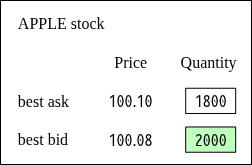
*   **L2 (Level 2):** Provides additional price depth beyond L1.
    *   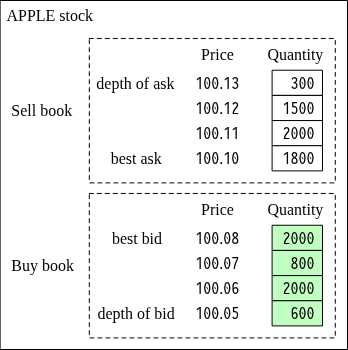
*   **L3 (Level 3):** Provides full price levels and the specific queued quantities at each price level.
    *   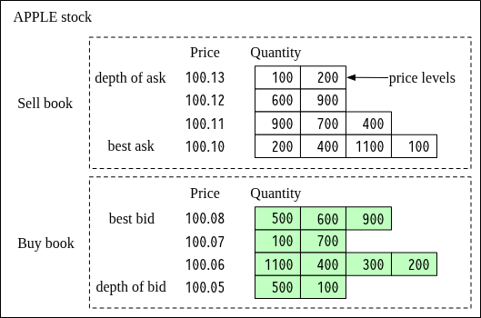

#### 4. Candlestick Chart
A visual representation of stock price over time intervals (1m, 5m, 1h, 1d). Each candlestick shows the:
*   **Open** & **Close** price (the "Real Body").
*   **High** & **Low** price (the "Shadows").
    *   

#### 5. FIX Protocol
**Financial Information eXchange (FIX)** is the industry-neutral communications protocol used for exchanging securities transaction information. 

Sample:

8=FIX.4.2 | 9=176 | 35=8 | 49=PHLX | 56=PERS | 52=20071123-05:30:00.000 | 11=ATOMNOCCC9990900 | 20=3 | 150=E | 39=E | 55=MSFT | 167=CS | 54=1 | 38=15 | 40=2 | 44=15 | 58=PHLX EQUITY TESTING | 59=0 | 47=C | 32=0 | 31=0 | 151=15 | 14=0 | 6=0 | 10=128 |

### High-level Design

The architecture of a modern exchange is divided into three major flows: the **Trading Flow**, the **Market Data Flow**, and the **Reporting Flow**.

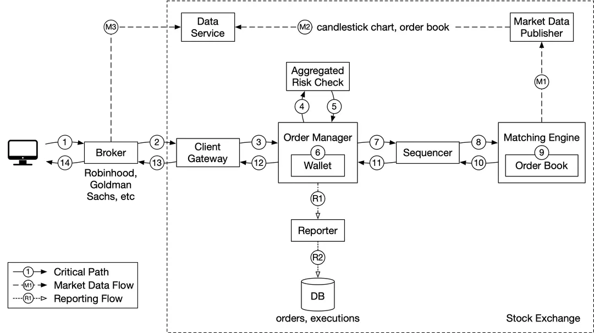

#### 1. Trading Flow (The Critical Path)
This is the most time-sensitive path. Every component must operate with ultra-low latency.

1.  **Client/Broker:** Client places a limit order through the broker’s application.
2.  **Client Gateway:** Performs authentication, rate limiting, and input validation.
3.  **Order Manager:** Conducts **Risk Checks** (e.g., daily share limits) and verifies the user's **Wallet** for sufficient funds or shares.
4.  **Sequencer:** Assigns a sequence number to the order/execution to ensure deterministic results.
5.  **Matching Engine:** Matches buy and sell orders. If a match occurs, it generates two **executions (fills)**—one for each side.
6.  **Return Path:** The execution status is returned via the gateway back to the client.

#### 2. Market Data Flow
This flow provides the "eyes" of the market to all participants via asynchronous data streams.

*   **Market Data Publisher:** Consumes the execution stream from the matching engine and builds **Candlestick charts** and the **Order Book**.
*   **Data Service:** Stores the market data for real-time analytics and serves it to brokers and clients.

#### 3. Reporting Flow
This handles post-trade auditing and historical record-keeping. It is not on the latency-sensitive critical path.

*   **Reporter:** Aggregates order data (IDs, prices, types, remaining quantities) and writes them into a persistent database for future compliance and auditing.

### Step 3 - Design Deep Dive

#### 1. Trading Flow: The Matching Engine

The matching engine (also called the **cross engine**) is the core of the trading flow. It has three primary responsibilities:
1.  **Order Book Maintenance:** Maintains a list of buy and sell orders for each symbol.
2.  **Order Matching:** Efficiently matches buy and sell orders. Each match generates two **executions (fills)**—one for the buyer and one for the seller.
3.  **Execution Stream Distribution:** Publishes the resulting matches as a market data stream.

**Critical Requirement: Determinism**
To achieve high availability and disaster recovery, the matching engine must be **deterministic**. This means that given an identical sequence of input orders, it MUST produce the exact same sequence of executions (fills) every time it is replayed. This enables a reliable system that can be rebuilt from historical order sequences.

#### 2. Trading Flow: The Sequencer

The Sequencer is the critical component that enforces **determinism** in the Matching Engine by assigning unique, sequential IDs to every input and output.

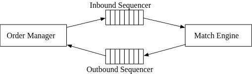

*   **Inbound Sequencer:** Stamps every incoming order with a unique ID before it is processed by the matching engine.
*   **Outbound Sequencer:** Stamps every pair of resulting executions (fills) with their own sequence IDs.
*   **Purpose of Sequence IDs:**
    1.  **Timeliness & Fairness:** Ensures orders are processed in the exact order they were received.
    2.  **Fast Recovery / Replay:** Essential for reconstructing system state from a specific point in time by replaying ordered logs.
    3.  **Exactly-once Guarantee:** Helps prevent duplicate processing of the same order.

**A Unified Message Queue:**
The sequencer acts as both a **message queue** and an **event store**. It provides high-speed communication between the Order Manager and the Matching Engine. While it functions similarly to Kafka, a specialized low-latency implementation is required to meet exchange performance requirements.

#### 3. Trading Flow: The Order Manager

The Order Manager acts as the orchestrator of an order's lifecycle, managing state transitions and acting as the gateway between the client and the core exchange logic.

**Core Responsibilities:**
1.  **Risk Checks:** Verifies that orders comply with daily limits (e.g., maximum $1M daily volume).
2.  **Wallet Management:** Confirms the user has sufficient funds or stock shares. It withholds these assets for open orders to prevent overspending.
3.  **Command Preparation:** Minimizes data transmission size by stripping orders to only the attributes essential for the matching engine before sending them to the sequencer.
4.  **Execution Feedback:** Receives completed fills from the matching engine (via the sequencer) and forwards them back to brokers through the client gateway.

**State Management Complexity**
The major challenge for the Order Manager is correctly handling **state transitions**. In a production exchange, there are tens of thousands of edge cases for how an order's state can change. To handle this complexity reliably, the Order Manager is frequently designed using **Event Sourcing**, enabling high-speed, deterministic state reconstruction.


#### 4. Trading Flow: The Client Gateway

The Client Gateway acts as the first line of defense for the exchange, providing critical gatekeeping functions while staying as lightweight as possible to minimize latency.

**Key Components:**
*   **Authentication (Auth):** Verifies the identity of the user or system placing the order.
*   **Validation:** Basic input validation to ensure the order format is correct.
*   **Rate Limiting:** Throttles incoming traffic to prevent system overload.
*   **Normalization:** Transforms data into the internal exchange format.
*   **FIXT Support:** Provides compatibility for the Financial Information eXchange protocol.

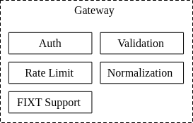

**Design Strategy:**
Keep the gateway as lightweight as possible. Avoid complex operations and delegate them to other components (like the matching engine or order manager).

**Tiered Connectivity:**
1.  **Retail Gateway:** Serves web/mobile apps via HTTP (higher latency).
2.  **API Gateway:** Serves brokers and other institutional clients (using FIX/Non-FIX protocols).
3.  **Colocation (Colo) Engine:** Some market makers place their trading software on servers within the exchange’s data center to achieve the absolute lowest possible latency.

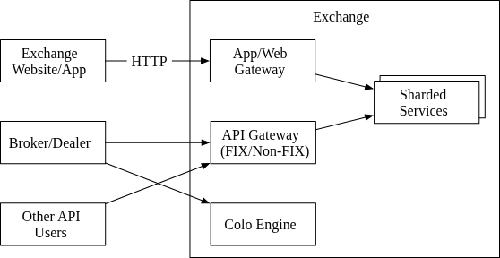

#### 5. Market Data Flow: The Market Data Publisher (MDP)

The Market Data Publisher (MDP) provides the real-time "vision" for the exchange, translating matching engine executions into meaningful visual data.

**How it Works:**
*   **Execution Input:** The MDP receives a high-speed stream of matching results (executions/fills) directly from the matching engine.
*   **Building Visuals:** It takes these raw fills and constructs the **Order Books** and **Candlestick Charts** (collectively referred to as market data).
*   **Persistence & Delivery:** This generated data is persisted for historical purposes and sent to the **Data Service**, where it is consumed by brokers and other subscribers.

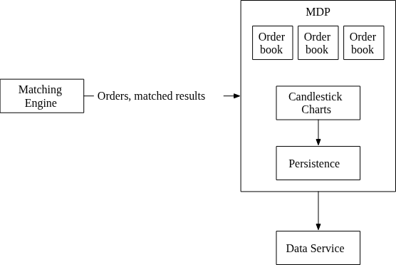

#### 6. Reporting Flow: The Reporter

The Reporter handles all non-critical path data aggregation for auditing, compliance, and historical tracking.

**Core Responsibilities:**
*   **Data Aggregation:** Merges attributes from **incoming orders** (client details, order types) and **outgoing executions** (price, quantity, fill status).
*   **Compliance & Audit:** Generates records for tax reporting, settlements, and legal compliance.
*   **Accuracy over Latency:** While the trading flow prioritizes millisecond speed, the reporting flow prioritizes absolute data precision and regulatory completeness.

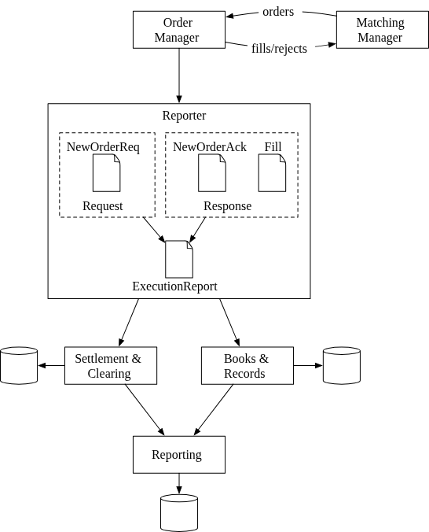

---

### Step 2 - Propose High-Level Design (Continued)

*Note: In this chapter, API design and data models come after the initial high-level introduction to ensure the architectural concepts are established first.*

### API Design

The exchange provides a RESTful interface for brokers to interact with the system. While institutional clients may use specialized binary protocols for lower latency, the following basic functionality must be supported across all interfaces.

#### 1. Orders
*   **POST `/v1/order`**: Places a new limit order.
    *   **Parameters:** `symbol`, `side` (buy/sell), `price` (Long), `orderType` (limit), `quantity` (Long).
    *   **Response:** Includes `id`, `creationTime`, `filledQuantity`, `remainingQuantity`, and `status` (new/canceled/filled).

#### 2. Executions
*   **GET `/execution`**: Queries execution (fill) information for a symbol and order ID within a specific time range.
    *   **Parameters:** `symbol`, `orderId` (optional), `startTime`, `endTime`.
    *   **Response:** An array of execution objects containing `price`, `quantity`, and `side`.

#### 3. Market Data
*   **Order Book (L2):** 
    *   **GET `/marketdata/orderBook/L2`**: Queries Level 2 order book depth for a specific symbol.
    *   **Parameters:** `symbol`, `depth`.
    *   **Response:** Arrays of `bids` and `asks` with their respective prices and sizes.
*   **Candlestick Charts:**
    *   **GET `/marketdata/candles`**: Queries historical price data for a given time range and resolution (e.g., 1m, 5m).
    *   **Parameters:** `symbol`, `resolution`, `startTime`, `endTime`.
    *   **Response:** An array of candle objects containing `open`, `close`, `high`, and `low` prices.

### Data Models

There are three main categories of data in an exchange: **Products/Orders/Executions**, **Order Books**, and **Candlestick Charts**.

#### 1. Product, Order, and Execution
*   **Product:** Static attributes of a traded symbol (lot size, tick size, settlement currency). Highly cacheable and used for UI display.
*   **Order:** The inbound buy/sell instruction.
*   **Execution (Fill):** The matched result from the matching engine. One match generates two executions (buy-side and sell-side).

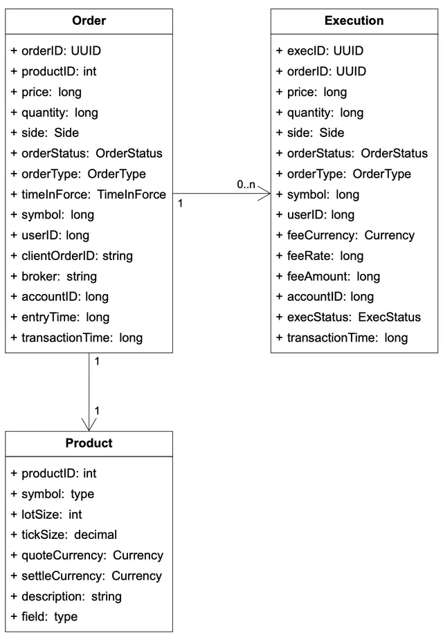

**Data Storage Strategy:**
*   **Critical Path:** Orders and executions are NOT stored in a database during live trading. Instead, they are processed **in-memory** and persisted to the **Sequencer** (on disk/shared memory) for fast failure recovery.
*   **Reporting:** The **Reporter** persists this data into a traditional database for historical record-keeping, auditing, and tax compliance.
*   **Market Data:** Executions are forwarded to the **Market Data Publisher** to reconstruct the public order book and chart visibility.

#### 2. Order Book
An order book is a performance-critical data structure used by the matching engine to maintain the list of buy and sell orders for each security, organized by price level.

**Design Requirements:**
*   **Constant lookup time:** For volumes at or between price levels.
*   **O(1) complexity:** For placing (Add), matching (Delete from head), and canceling (Delete from anywhere) orders.
*   **Fast updates:** For replacing existing orders.
*   **Query best bid/ask:** Immediate access to the top of the book.

**The O(1) Data Structure Solution:**
To achieve O(1) for all operations, the order book combines a **Map (HashMap/TreeMap)** and **Doubly-Linked Lists**:
1.  **Map<Price, PriceLevel>:** Maps a specific price to its corresponding `PriceLevel` object.
2.  **Doubly-Linked List (within PriceLevel):** Stores orders at that price level.
    *   **Add (O(1)):** Append the new order to the tail of the linked list.
    *   **Match (O(1)):** Remove matched orders from the head of the linked list.
3.  **Map<OrderID, Order>:** An global index to immediately locate any order in the book.
    *   **Cancel (O(1)):** Use the index to find the order, then use the doubly-linked list’s `prev` and `next` pointers to remove it without traversing the list.

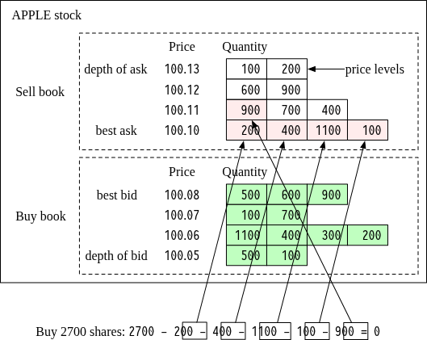
*Figure 13: A market buy order for 2700 shares sequentially exhausting sell volume across multiple price levels.*

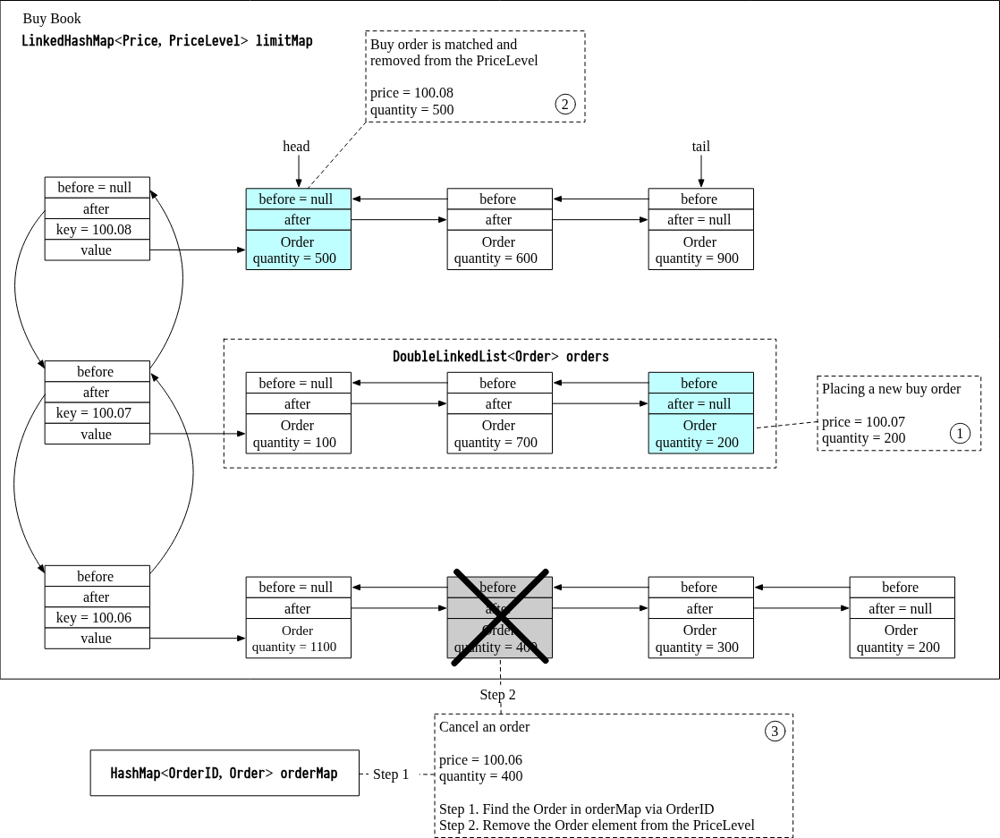
*Figure 14: Using a HashMap + Doubly-Linked List to ensure O(1) performance.*

**Model Implementation:**
```java
class PriceLevel {
    private Price limitPrice;
    private long totalVolume;
    private List<Order> orders; // Ideally a Doubly-LinkedList for O(1) delete
}

class Book<Side> {
    private Side side;
    private Map<Price, PriceLevel> limitMap;
}

class OrderBook {
    private Book<Buy> buyBook;
    private Book<Sell> sellBook;
    private PriceLevel bestBid;
    private PriceLevel bestOffer;
    private Map<OrderID, Order> orderMap;
}
```

#### 3. Candlestick Chart
The Candlestick Chart is a secondary key data structure in the market data processor used to track and visualize price history (Open, Close, High, Low) over specific intervals.

**Model Implementation:**
```java
class Candlestick {
    private long openPrice;
    private long closePrice;
    private long highPrice;
    private long lowPrice;
    private long volume;
    private long timestamp;
    private int interval;
}

class CandlestickChart {
    private LinkedList<Candlestick> sticks;
}
```

**Memory Optimization Strategies:**
Tracking price history for thousands of symbols across multiple time intervals (1m, 5m, 1h, etc.) is memory-intensive. Optimizations include:
1.  **Pre-allocated Ring Buffers:** Reuse objects to reduce the overhead of constant garbage collection and new object allocation.
2.  **In-memory Limits:** Maintain only the most recent sticks in memory and persist older ones to disk.
3.  **Columnar Databases:** Real-time analytics are typically served using an in-memory columnar database (e.g., **KDB**).

### Step 3 - Design Deep Dive

#### 1. Performance: Achieving Ultra-Low Latency

In modern exchanges, the **99th percentile latency** is the primary measure of success. Improving latency involves two strategies: **decreasing tasks** on the critical path and **shortening the time** of each task.

**Evolution: From Network to Single-Server**
Traditional distributed models (multiple servers connected via the network) often add milliseconds of latency due to network hops (~500µs each) and disk access (ms). Low-latency exchanges eliminate these by:
1.  **Consolidating Components:** Putting all critical path components (Gateway, Order Manager, Sequencer, Matching Engine) on a **single gigantic server**.
2.  **Removing Non-Essential Tasks:** Moving logging, reporting, and non-immediate risk checks off the critical path.

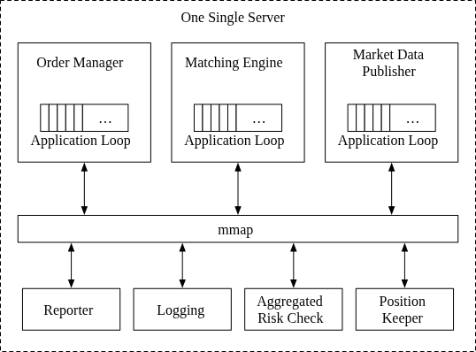

**Application Loops and CPU Pinning**
To achieve sub-microsecond performance, components use **Application Loops**—while loops that poll for tasks and execute them.
*   **Single-Threaded:** Each component process is single-threaded.
*   **CPU Pinning:** The thread is "pinned" to a dedicated CPU core. 
    *   **Pros:** Eliminates **context switching** and **lock contention**, resulting in predictable performance.
    *   **Cons:** Coding complexity increases; tasks must be extremely efficient to avoid blocking the main loop.

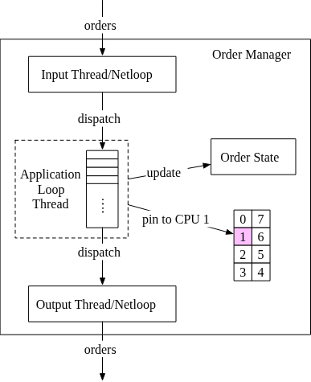

**Shared Memory (mmap) Message Bus**
Instead of network sockets or slow disk persistence, components communicate via **Shared Memory** using the `mmap` system call.
*   **Zero-Disk I/O:** By mapping files in `/dev/shm` (a memory-backed file system), `mmap` allows for high-performance data sharing with zero-latency disk access.
*   **Event Store:** This shared memory acts as an ultra-fast event store and message bus, reducing inter-process communication time to the sub-microsecond level.

#### 2. Event Sourcing for Modern Exchanges

Event sourcing maintains an **immutable log of all state-changing events** rather than just storing the current state. This provides a "golden source of truth" for auditing and system recovery.

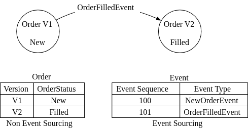

**Design Optimization in a Single-Server Environment**
By combining `mmap` and event sourcing, a modern exchange can function like a high-speed, localized Kafka system.

*   **FIX to SBE:** The Gateway converts external **FIX** messages into **Simple Binary Encoding (SBE)** for ultra-fast and compact internal transmission.
*   **Embedded Order Manager:** Instead of a central service (which would add latency), the Order Manager becomes a reusable library embedded in each component (Matching Engine, Reporter, etc.). Because the underlying event log is immutable and replayed in the same order, every component maintains an identical, deterministic state.

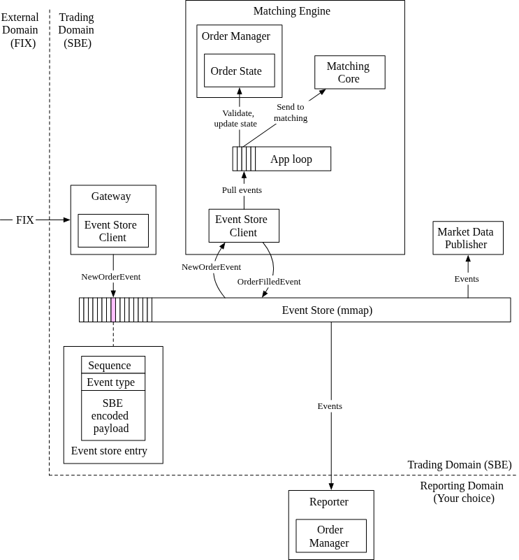

**The Evolution of the Sequencer**
In this specialized design, the sequencer serves as the **single writer** to the shared `mmap` event store to completely avoid lock contention.

*   **Data Flow:** Components write incoming events to local **ring buffers**. 
*   **The Sequencer's Role:** It pulls from these buffers, stamps each event with a monotonic sequence ID, and appends it to the global event store.
*   **Reliability:** Redundant backup sequencers can be maintained for high availability.

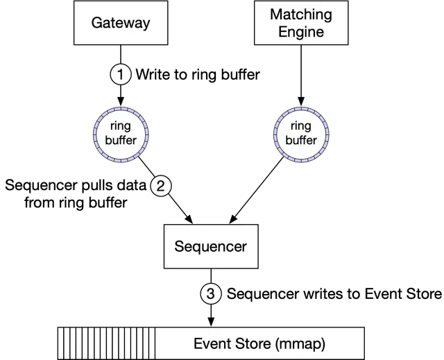

#### 3. High Availability

The goal is to achieve **99.99% availability**, permitting only 8.64 seconds of downtime per day. This requires near-immediate recovery mechanisms.

**Redundancy Strategy: Hot-Warm Architecture**
For stateful components like the **Matching Engine** and **Order Manager**, a hot-warm redundancy model is used:
*   **Hot Instance (Primary):** Processes events and writes results back to the event store.
*   **Warm Instance (Backup):** Receives and processes the *exact same* sequence of events as the hot instance but suppresses outgoing messages. 
*   **Failure Recovery:** If the hot instance fails, the warm instance immediately takes over as the primary. Upon restart, a failed backup can reconstruct its state by replaying the immutable log from the event store.

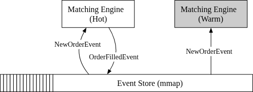

**Failure Detection:**
*   **Heartbeats:** The matching engine sends regular heartbeats. If a heartbeat is missed, the system initiates a fast failover to the backup.

**Cross-Server Replication:**
To achieve 4 nines across the entire system, the hot-warm concept must extend beyond a single server or data center.
*   **Event Log Replication:** The entire event store is replicated across servers.
*   **Reliable UDP (Aeron):** High-performance, reliable UDP protocols are used to broadcast event messages to all warm servers with minimal latency.

#### 4. Fault Tolerance

Fault tolerance prepares the system for catastrophic failures (e.g., all warm instances going down due to a natural disaster or power outage) by replicating data across multiple cities/data centers.

**Key Challenges & Solutions:**
*   **Defining "Down":** Systems can send false alarms or suffer from code bugs that bring down both primary and backup instances.
    *   **Approach:** Start with manual failovers until enough operational signals are gathered to automate the process. Use **Chaos Engineering** to uncover edge cases.
*   **Leader Election (Raft):** In a Raft cluster (e.g., 5 servers), a majority (N/2 + 1 = 3) is required to reach consensus.
    *   **Process:** The leader sends `AppendEntries` heartbeats. If missed, followers trigger an election.
    *   **Terms:** Time is divided into terms, representing periods of normal operation or elections. "Split votes" can occur if multiple candidates arise simultaneously.

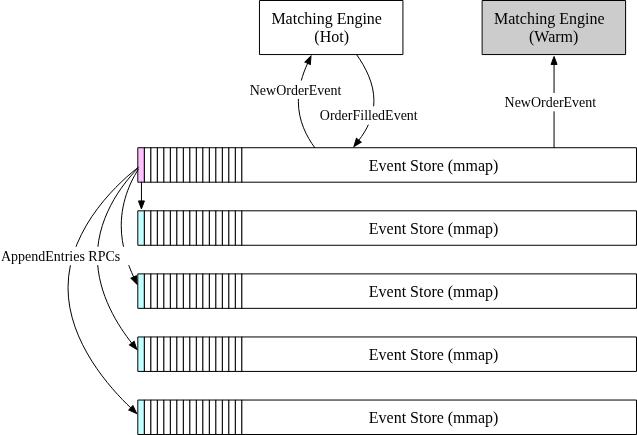

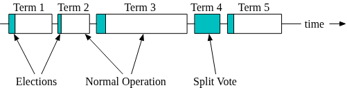

**RTO and RPO:**
*   **Recovery Time Objective (RTO):** Second-level for an exchange; requires immediate, automated failover.
*   **Recovery Point Objective (RPO):** Near zero. Data loss is unacceptable in a financial exchange. Raft ensures state consensus among cluster nodes, meaning the new leader is ready to function immediately with identical data.

#### 5. Matching Algorithms

Matching algorithms determine how buy and sell orders are paired. The most common algorithm used in standard exchanges is **FIFO (First In First Out)**—the first order at a specific price level is matched first.

**High-Level Matching Logic (Pseudo-code):**
```java
Context handleOrder(OrderBook orderBook, OrderEvent orderEvent) {
    if (orderEvent.getSequenceId() != nextSequence) {
        return Error(OUT_OF_ORDER, nextSequence);
    }

    if (!validateOrder(symbol, price, quantity)) {
        return ERROR(INVALID_ORDER, orderEvent);
    }

    Order order = createOrderFromEvent(orderEvent);
    switch (msgType):
        case NEW:
            return handleNew(orderBook, order);
        case CANCEL:
            return handleCancel(orderBook, order);
        default:
            return ERROR(INVALID_MSG_TYPE, msgType);

}

Context handleNew(OrderBook orderBook, Order order) {
    if (BUY.equals(order.side)) {
        return match(orderBook.sellBook, order);
    } else {
        return match(orderBook.buyBook, order);
    }
}

Context handleCancel(OrderBook orderBook, Order order) {
    if (!orderBook.orderMap.contains(order.orderId)) {
        return ERROR(CANNOT_CANCEL_ALREADY_MATCHED, order);
    }
    removeOrder(order);
    setOrderStatus(order, CANCELED);
    return SUCCESS(CANCEL_SUCCESS, order);
}

Context match(OrderBook book, Order order) {
    Quantity leavesQuantity = order.quantity - order.matchedQuantity;
    Iterator<Order> limitIter = book.limitMap.get(order.price).orders;
    while (limitIter.hasNext() && leavesQuantity > 0) {
        Quantity matched = min(limitIter.next.quantity, order.quantity);
        order.matchedQuantity += matched;
        leavesQuantity = order.quantity - order.matchedQuantity;
        remove(limitIter.next);
        generateMatchedFill();
    }
    return SUCCESS(MATCH_SUCCESS, order);
}

```

**Alternative Algorithms:**
While FIFO is standard, other models exist for specialized trading scenarios:
*   **FIFO with LMM (Lead Market Maker):** Allocates a certain percentage of trade volume to a Lead Market Maker before the standard FIFO queue.
*   **Dark Pools:** Used for large institutional trades that remain hidden from the public order book to prevent market impact.

#### 6. Determinism: Functional vs. Latency

A high-performance exchange must maintain two types of determinism: **functional** and **latency**.

**Functional Determinism**
Guarantees that replaying the exact same sequence of events results in the same final system state.
*   **Time Independence:** In event sourcing, the precise wall-clock time of an event is less important than its relative order. Replaying discrete events as a continuous stream allows for much faster state recovery.

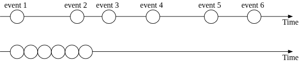

**Latency Determinism**
Refers to maintaining consistent response times (low variance) for every trade across the system. 
*   **Measurement:** This is typically measured at the **99th** or **99.99th percentile** (using tools like **HdrHistogram**).
*   **Challenges:** Large fluctuations in latency (jitter) can be caused by system "hiccups," such as Java’s **Stop-the-World (STW)** garbage collection safe points. Ensuring latency stability is as critical as achieving a low average latency.

#### 7. Market Data Publisher (MDP) Optimizations

The MDP processes raw matched results from the matching engine to reconstruct the tiered **Order Books** and **Candlestick Charts** for subscribers.

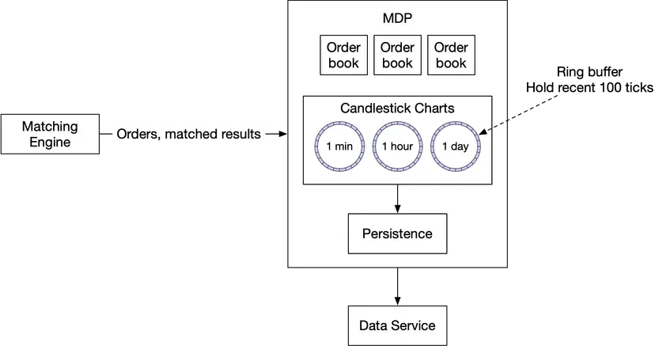

**Optimizing Performance with Ring Buffers**
To handle high-throughput market data with minimal latency and garbage collection overhead, the MDP utilizes **Ring Buffers** (Circular Buffers):
*   **Fixed-Size & Pre-allocated:** Memory is allocated upfront, eliminating the need for constant object creation and deallocation during runtime.
*   **Lock-Free:** Multiple consumers can pull data without the bottleneck of lock contention.
*   **CPU Cache Efficiency:** Techniques like **padding** are used to ensure the buffer’s sequence numbers occupy their own cache lines, preventing "false sharing" and improving processing speed.
*   **Tiered Data Levels:** The MDP can easily serve different levels of depth (e.g., L1, L2, L3) by simply filtering the amount of order book data published to specific subscribers.

#### 8. Fairness and Security

**Distribution Fairness of Market Data**
Simultaneous data delivery is critical for a regulated exchange. Participants with lower latency gain an unfair advantage. 
*   **Challenge:** Traditional publishers send data sequentially to subscribers; smart clients fight to be "first" on the list.
*   **Solutions:**
    *   **Multicast:** Using UDP-based multicast to broadcast updates to a set of hosts across different subnetworks simultaneously. While UDP is unreliable, retransmission protocols (Reliable UDP) ensure data integrity.
    *   **Randomization:** Assigning a random order to the subscriber list to prevent fixed priority.

**Colocation (Colo)**
A premium service where brokers/funds rent server space directly inside the exchange's data center. This reduces the physical distance the signal must travel (cable length), though it is considered a legitimate "VIP service" rather than a breach of fairness.

**Network Security & DDoS Mitigation**
Publicly exposed exchange interfaces are high-value targets for DDoS attacks. Mitigation strategies include:
1.  **Service Isolation:** Separating public market data layers from private trading services so that a public attack doesn't impact core execution.
2.  **Effective Caching:** Using a caching layer for infrequently updated data to protect underlying databases under heavy load.
3.  **URL Hardening:** Moving away from query-parameter heavy URLs (which are easy to exploit via unique request generation) to static, CDN-friendly endpoints like `/data/recent`.
4.  **Safelists/Blocklists & Rate Limiting:** standard perimeter defense at the gateway level.
---
Reference materials
[1] LMAX exchange was famous for its open-source Disruptor: https://www.lmax.com/exchange

[2] IEX attracts investors by “playing fair”, also is the “Flash Boys Exchange”:
https://en.wikipedia.org/wiki/IEX

[3] NYSE matched volume: https://www.nyse.com/markets/us-equity-volumes

[4] HKEX daily trading volume:
https://www.hkex.com.hk/Market-Data/Statistics/Consolidated-Reports/Securities-Statistics-Archive/Trading_Value_Volume_And_Number_Of_Deals?sc_lang=en#select1=0

[5] All of the World’s Stock Exchanges by Size:
http://money.visualcapitalist.com/all-of-the-worlds-stock-exchanges-by-size/

[6] Denial of service attack: https://en.wikipedia.org/wiki/Denial-of-service_attack

[7] Market impact: https://en.wikipedia.org/wiki/Market_impact

[8] Fix trading: https://www.fixtrading.org/

[9] Event Sourcing: https://martinfowler.com/eaaDev/EventSourcing.html

[10] CME Co-Location and Data Center Services:
https://www.cmegroup.com/trading/colocation/co-location-services.html

[11] Epoch: https://www.epoch101.com/

[12] Order book: https://www.investopedia.com/terms/o/order-book.asp

[13] Order book: https://en.wikipedia.org/wiki/Order_book

[14] How to Build a Fast Limit Order Book: https://bit.ly/3ngMtEO

[15] Developing with kdb+ and the q language: https://code.kx.com/q/

[16] Latency Numbers Every Programmer Should Know: https://gist.github.com/jboner/2841832

[17] mmap: https://en.wikipedia.org/wiki/Memory_map

[18] Context switch: https://bit.ly/3pva7A6

[19] Reliable User Datagram Protocol: https://en.wikipedia.org/wiki/Reliable_User_Datagram_Protocol

[20] Aeron: https://github.com/real-logic/aeron/wiki/Design-Overview

[21] Chaos engineering: https://en.wikipedia.org/wiki/Chaos_engineering

[22] Raft: https://raft.github.io/

[23] Designing for Understandability: the Raft Consensus Algorithm: https://raft.github.io/slides/uiuc2016.pdf

[24] Supported Matching Algorithms: https://bit.ly/3aYoCEo

[25] Dark pool: https://www.investopedia.com/terms/d/dark-pool.asp

[26] HdrHistogram: A High Dynamic Range Histogram: http://hdrhistogram.org/

[27] HotSpot (virtual machine): https://en.wikipedia.org/wiki/HotSpot_(virtual_machine)

[28] Cache line padding: https://bit.ly/3lZTFWz

[29] NACK-Oriented Reliable Multicast: https://en.wikipedia.org/wiki/NACK-Oriented_Reliable_Multicast

[30] AWS Coinbase Case Study: https://aws.amazon.com/solutions/case-studies/coinbase/