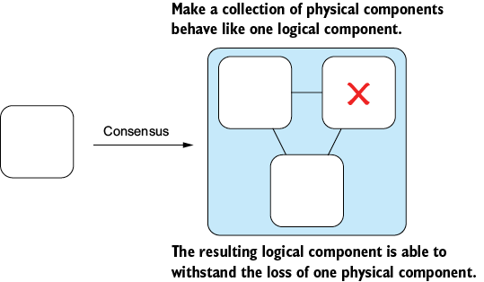
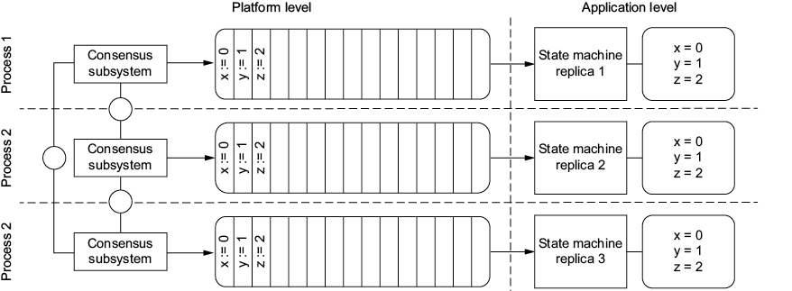
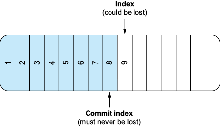
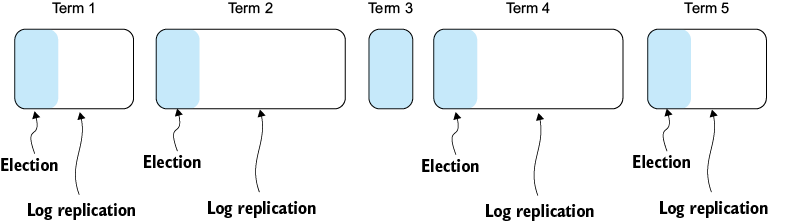
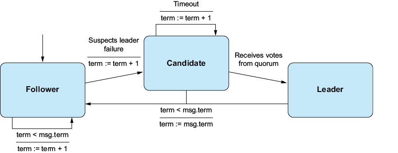
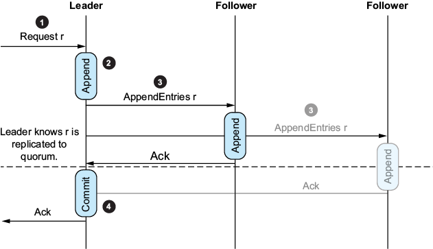
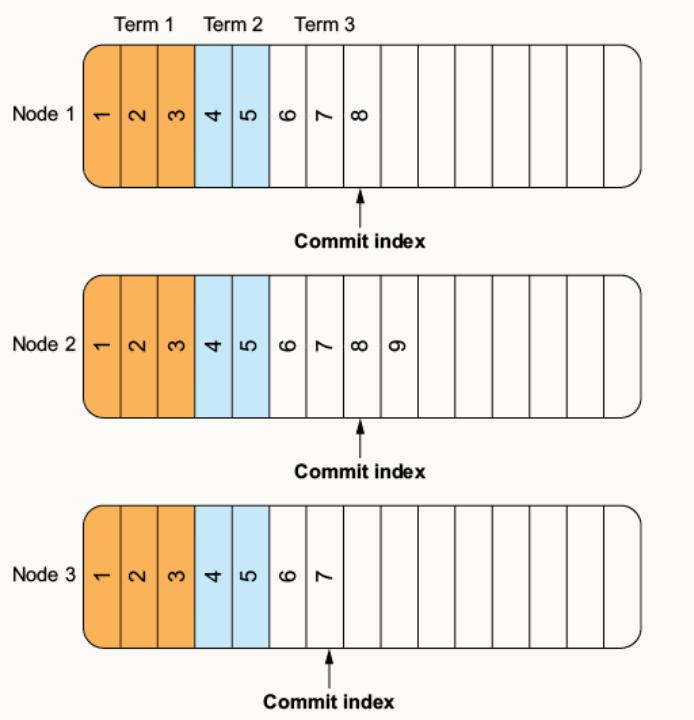
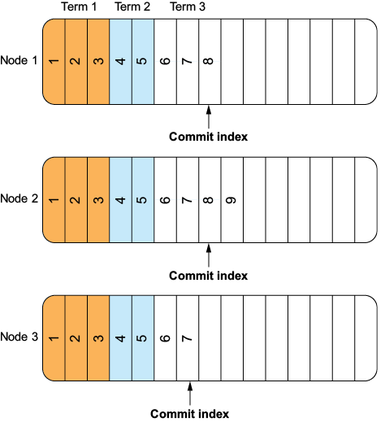
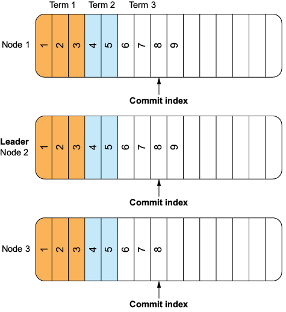
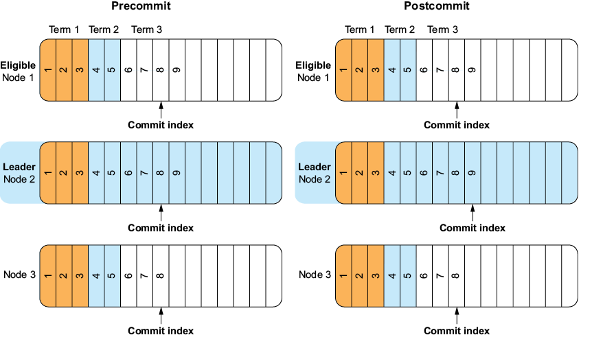

### Chapter: Distributed Consensus - Summary (Think in Distributed Systems)

Distributed consensus is a foundational abstraction in distributed systems that allows a group of redundant processes to act as a single unit, enabling some processes to compensate for the failure of others.

#### Core Concepts
*   **Consensus:** Agreement on a single value between components (processes) over a network.
*   **Significance:** Disagreement leads to catastrophic behavior (e.g., transaction confusion, lock conflicts, out-of-order operations).
*   **Challenge:** In a realistic system model, components fail and networks reorder, delay, lose, or duplicate messages.

---

### 10.1 The Challenge of Reaching Agreement

*   **Atomic Commitment vs. Consensus:** 
    *   **Atomic Commitment (2PC):** A single coordinator failure can block the entire protocol (guarantees safety but sacrifices liveness).
    *   **Consensus Algorithms:** Aim to provide—but do not guarantee—**liveness** (no single component failure brings the system to a halt), while strictly guaranteeing **safety**.

#### The FLP Impossibility Theorem
*   **The Result:** It is impossible to guarantee consensus in an **asynchronous distributed system without clocks**, even if only one node fails.
*   **AHA! MOMENT:** This theorem focuses on the limitations of liveness in purely asynchronous models. Reaching consensus **is possible** in asynchronous systems if they have access to **clocks**.

---

### 10.2 System Model

The distributed system is defined as a collection of **Processes** and **Values**. A process can **Propose(p, v)** a value and **Decide(p, v)** on it. This chapter focuses on **crash failure**—where a process simply halts.

#### Properties of a Consensus Algorithm

| Property | Type | Definition |
| :--- | :--- | :--- |
| **Agreement** | Safety | No two correct processes decide on different values. |
| **Integrity** | Safety | If a process decides on a value, that decision is permanent (no changing of mind). |
| **Validity** | Safety | Any decided value must have been proposed by some process. |
| **Termination** | Liveness | Every non-failed (alive) process eventually decides on a value. |

---

### 10.3 State Machine Replication (SMR)

Distributed consensus is the bedrock of **State Machine Replication**, a mechanical technique for transforming individual processes into a fault-tolerant group. SMR ensures that a group of processes advances in lockstep, allowing the group to compensate for any failed member.

**The Core Principle:**
If two identical, **deterministic** processes start in the **same initial state** and receive the **same inputs in the same order**, they are guaranteed to produce the same outputs and reach the exact same final state.

**Implementing a Replicated Key-Value Store:**
In practice, SMR is used to ensure all replicas in a cluster (e.g., for a key-value store) receive the same commands in the same sequence. This produces a reliable, redundant system that remains operational despite individual node crashes.

---

### 10.4 The Origin and Irony of Consensus

Leslie Lamport (Turing Award 2013) initially set out to prove that distributed consensus was impossible but instead devised the **Paxos protocol (1989)**.

*   **Paxos:** Solved consensus for a **single decision** (a set of write-once registers), ensuring all replicas agree even on an unreliable network.
*   **Multi-Paxos:** Extends Paxos to achieve consensus on a **series of decisions**, making it suitable for State Machine Replication.

#### AHA! MOMENT: Viewstamped Replication
While Paxos is more famous, **Viewstamped Replication (1988)**—published by Brian Oki and Barbara Liskov—was actually the first published algorithm to solve the problem of distributed consensus, even though it didn't explicitly use the term "consensus."

---

### 10.5 Implementing Consensus

Modern consensus algorithms (Raft, Multi-Paxos, Viewstamped Replication) typically combine a **Leader-based** approach with **Quorum-based** acknowledgments.

#### Leader-based vs. Quorum-based
*   **Leader-based (BDFL):** A single "Benevolent Dictator for Life" processes requests and broadcasts decisions. 
    *   **Fatal Flaw:** In real systems, the BDFL is a Single Point of Failure (SPOF). Network losses can also isolate the leader, causing inconsistencies.
*   **Quorum-based (Majority Rule):** Consensus is only reached when a majority of nodes ($Q > N/2$) acknowledges a decision.
    *   **Quorum Intersection:** Because any two majorities overlap, at least one node will be aware of decisions made in both quorums. This prevents **Split-brain** conditions where subsets of nodes act independently.
    *   **Failure Tolerance:** To tolerate $f$ failures, a system needs at least $2f + 1$ total nodes (ensuring $f+1$ nodes are always available for a quorum).

| Total Nodes ($N$) | Max Failures ($f$) | Quorum Size ($Q$) |
| :--- | :--- | :--- |
| 3 | 1 | 2 |
| 5 | 2 | 3 |
| 7 | 3 | 4 |

#### The Hybrid Approach
Algorithms like **Raft** use the quorum to elect a leader. That leader then proposes values and waits for a quorum of acknowledgments before "committing" them. This combines the decisiveness of a leader with the reliability of a majority.

---

### 10.6 The Raft Consensus Protocol

Raft is a consensus protocol explicitly designed for **understandability** while maintaining the complexity needed for state machine replication across a cluster. It relies on a **Leader** to orchestrate message sequencing and a **Quorum** to ensure commitment.

#### 10.6.1 The Log
The fundamental goal of Raft is to guarantee **log consistency** across all nodes. 
*   **Commit Index:** The index of the highest log entry known to be replicated across a quorum.
*   **Safety Guarantee:** Once an entry is committed, it is never lost (**State Machine Safety**) and can be safely applied to the application state machine.

#### AHA! MOMENT: Platform vs. Application Level
Raft operates on two distinct layers:
1.  **Platform Level:** Runs the core protocol (leader election, replication, commitment).
2.  **Application Level:** Receives committed log entries from the platform level and applies them to its own state machine (e.g., a key-value store). This ensures consistent application behavior across the cluster.

#### 10.6.2 Terms
In Raft, time is divided into **monotonically increasing terms**, acting as a **logical clock** critical for protocol correctness.

Each term consists of two phases:
1.  **Leader Election (Request Vote):** Ensures only one leader is active at a time and a new one is quickly elected if the existing leader fails.
2.  **Log Replication (Append Entries):** The functional phase where the leader handles client requests and propagates log entries across the cluster.

#### AHA! MOMENT: Terms as Fencing Tokens
Raft doesn't guarantee that only one node *believes* it is the leader; rather, it guarantees that only one node may **act** as the leader. The term number serves as a **fencing token**. All incoming messages are compared against the receiver's current term. 
*   **Actionable Leader:** Only the node with the highest (current) term number can successfully replicate log entries. 
*   **Rejection:** Nodes reject any message with a lower term number, which effectively prevents "stale" leaders from causing inconsistencies.

#### 10.6.3 Leader Election Protocol

A Raft node can be in one of three states: **Follower**, **Candidate**, or **Leader**.

**1. As a Follower:**
*   **Startup:** Every node begins as a Follower.
*   **Heartbeats:** Followers listen for messages from the current leader.
*   **Election Timer:** Each Follower has a randomized timeout (this reduces split votes). If no message is received before the timer expires, the node initiates an election.

**2. As a Candidate:**
*   The node increments its **current term** and votes for itself.
*   It issues **RequestVote** requests to all other nodes.
*   **Three Possible Outcomes:**
    *   **Quorum Vote:** Receives a majority of votes and becomes the **Leader**.
    *   **Split Vote:** No quorum is reached. The node initiates a new election.
    *   **Demotion:** If the candidate hears from a newer leader (higher term), it transitions back to a **Follower**.

**3. As a Leader:**
*   If the leader discovers a higher term number or a more current leader, it immediately demotes itself back to a **Follower**.

#### 10.6.4 Log Replication Protocol

The Log Replication protocol manages client requests and ensures the consistency of logs across the cluster in four main steps:

1.  **Accept:** The leader receives a new command from a client.
2.  **Append:** The leader appends this command to its own internal log.
3.  **Propagate:** The leader broadcasts the new log entry along with the current term to all other nodes in the cluster via **AppendEntries** requests.
4.  **Commit:** Followers receive the `AppendEntries` message, append the entry to their own local logs, and acknowledge back to the leader. 
    *   **Majority Rule:** Once the leader receives acknowledgments from a **quorum** (himself included), it advances the **commit index**.

#### 10.6.5 State Machine Safety

State machine safety is Raft's core guarantee: if any process has applied a log entry at a specific index to its state machine, **no other process will ever apply a different entry at that same index**.

**The Election Constraint:**
To prevent committed entries from being lost or overwritten, Raft restricts leader eligibility. Only a candidate with the **most up-to-date log** can be elected leader. 

**Determining the "Most Up-to-Date" Log:**
When comparing two logs (L1 and L2):
1.  **Term Comparison:** If the last entries have different terms, the log with the **later term** is more up-to-date.
2.  **Length Comparison:** If the last entries have the same term, the **longer log** is more up-to-date.

**The Quorum Overlap:**
Because a candidate requires a quorum of votes to become leader, and a committed entry already resides on a quorum of nodes, at least one node in any future election will have the committed entry. That node will refuse to vote for any candidate whose log is less up-to-date, ensuring the new leader always possesses all committed entries.

---

### 10.7 Raft Puzzles

To deepen understanding of the Raft protocol, consider these three puzzles in a 3-node cluster.

#### Puzzle 1: Identifying the Leader
**Scenario:** A cluster in term 3.
**Question:** Which node is the leader?
**Answer:** The node with the most advanced log. The leader is responsible for accepting and appending client requests first.

#### Puzzle 2: The Latency of Commitment
**Scenario:** Leader (Node 2) accepts Request 9, but crashes before propagating it to any followers.
**Question:** Is Request 9 lost?
**Answer:** **Yes.** Because it was never replicated to a quorum, no other node knows it exists. On leadership change (to term 4), the entry vanishes. This does **not** violate safety because the entry was never "committed."

#### Puzzle 3: The Wizard's Insight (Implicit Persistence)
**Scenario:** Leader (Node 2) replicates Request 9 to Node 1 (achieving a quorum). Node 1 acknowledges, but Node 2 crashes before it can advance its commit index or reply to the client.
**Question:** Is Request 9 lost?
**Answer:** **No.** Because the entry exists on a quorum of nodes (Node 2 and Node 1), any future leader election will result in Node 1 becoming the leader (as it has the most up-to-date log). Node 1 will then propagate Request 9 to the remaining nodes and complete the commit.
*   **The Lesson:** Once a quorum possesses a log entry, that entry is functionally persistent and becomes "the truth" for all future leaders.

*(Awaiting the final sections of the chapter...)*
