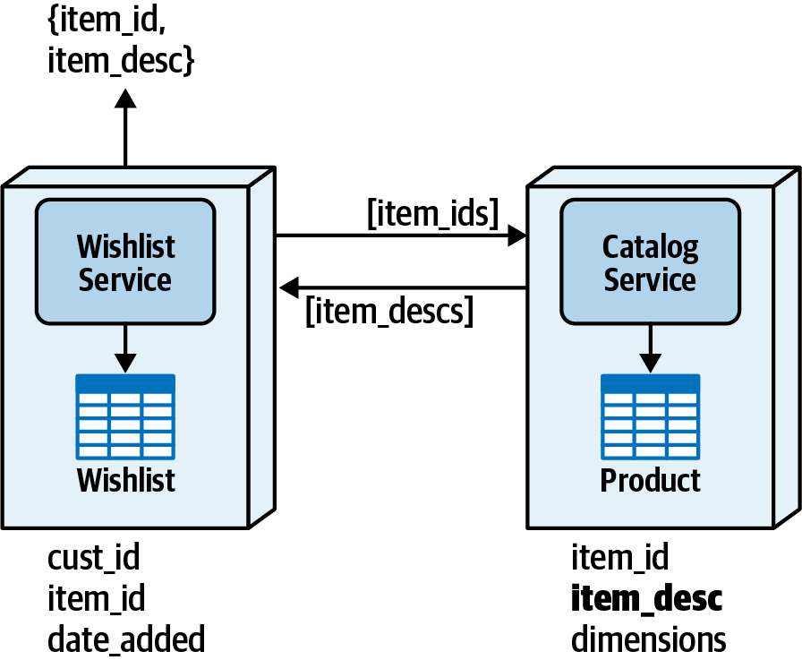
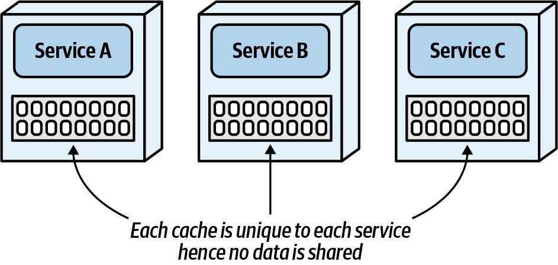
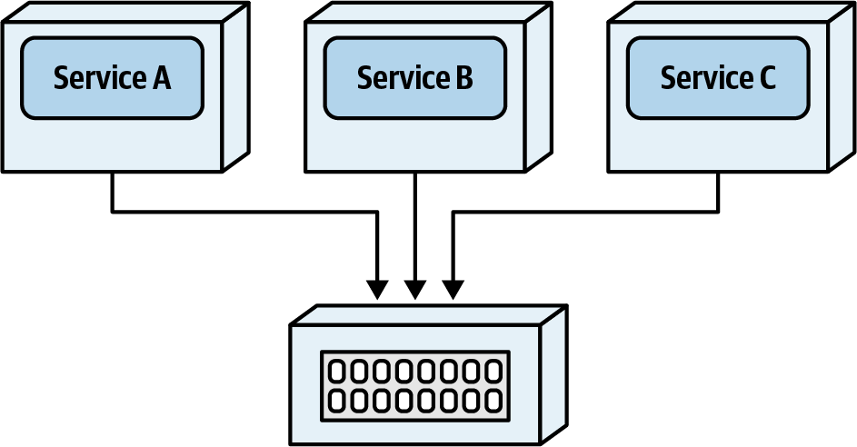
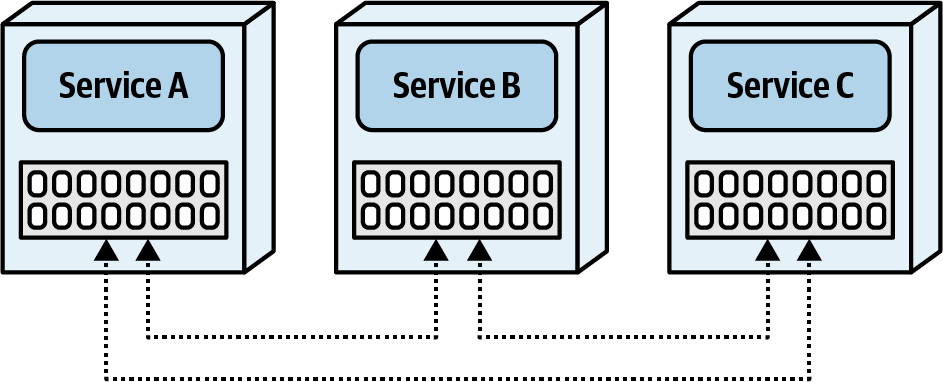
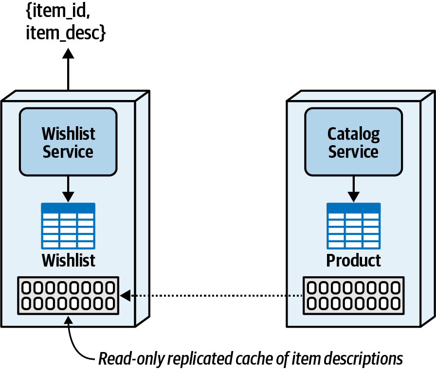
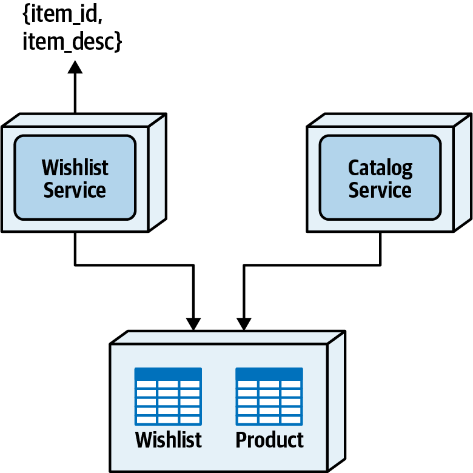

### Chapter 10: Distributed Data Access - Summary

This chapter addresses the critical problem of how services can read data they do not own in a distributed architecture. Moving away from the simplicity of SQL joins in a monolith, architects must contend with significant trade-offs when accessing data across service boundaries. The chapter presents a detailed analysis of four distinct data access patterns: **Inter-service Communication**, **Column Schema Replication**, **Replicated Caching**, and the **Data Domain pattern**.

Each pattern is evaluated through the lens of architectural trade-offs, covering performance, fault tolerance, scalability, data consistency, and data ownership. The Inter-service Communication pattern is simple but brittle. Column Replication improves performance at the cost of consistency. The Replicated Caching pattern offers an excellent solution for high-performance, read-only access to relatively static data but has limitations regarding data volume and startup dependencies. Finally, the Data Domain pattern allows for shared direct access as a last resort for tightly coupled data, resolving performance issues but creating a broader, more complex bounded context.

The chapter culminates in a Sysops Squad saga where the team methodically analyzes these trade-offs to solve a real-world data access challenge, formalizing their choice of the Replicated Caching pattern in a detailed Architecture Decision Record (ADR).

---

### The Data Access Challenge

In a distributed architecture, services need to access data owned by other services. The `Wishlist` service, for example, needs item descriptions from the `Product` table, which is owned by the `Catalog` service. This chapter explores patterns to solve this problem.

---

### 1. Inter-service Communication Pattern

This is the most common and straightforward pattern. The service needing data simply makes a remote call (e.g., REST) to the service that owns the data.

While simple, this pattern is fraught with issues.
*   **Performance:** The call suffers from network, security, and data latency, which can add up to a significant delay for the end user.
*   **Service Coupling:** The `Wishlist` service is now statically coupled to the `Catalog` service. If the `Catalog` service is down, the `Wishlist` service is also non-operational, reducing fault tolerance.
*   **Scalability:** As the `Wishlist` service scales, so must the `Catalog` service to handle the increased request load.

| Advantages                  | Disadvantages                                 |
| --------------------------- | --------------------------------------------- |
| Simplicity                  | Network, data, and security latency (performance) |
| No data volume issues       | Scalability and throughput issues             |
|                             | No fault tolerance (availability issues)      |
|                             | Requires contracts between services           |

---

### 2. Column Schema Replication Pattern

With this pattern, specific columns are replicated from the owning service's table to the requesting service's table. The `item_desc` column is added to the `Wishlist` table.

This pattern solves the performance and availability issues of the previous pattern but introduces new challenges.
*   **Data Synchronization:** A mechanism (usually asynchronous messaging) is required to propagate changes from the `Catalog` service to the `Wishlist` service to keep the replicated data consistent.
*   **Data Ownership Governance:** It can be difficult to prevent the `Wishlist` service from incorrectly updating the replicated `item_desc` data it does not own.
*   **Use Cases:** Best suited for data aggregation, reporting, or scenarios with high performance/fault tolerance requirements where other patterns are not a good fit.

| Advantages                        | Disadvantages                  |
| --------------------------------- | ------------------------------ |
| Good data access performance      | Data consistency issues        |
| No scalability and throughput issues | Data ownership issues          |
| No fault tolerance issues         | Data synchronization is required |
| No service dependencies           |                                |

---

### 3. Replicated Caching Pattern

This pattern uses a replicated in-memory cache to share data. The owning service writes to the cache, and that data is automatically replicated to read-only cache instances within other services.

#### Caching Model Comparison
*   **Single In-Memory Cache:** Each service has its own private cache. Data is not shared. Not useful for this data access problem.
    
*   **Distributed Cache:** Data is held in an external, centralized cache server. This is not ideal for data access as it simply shifts the dependency from the service to the cache server, still involving a remote call.
    
*   **Replicated Cache:** Each service hosts an in-memory replica of the same cache. Updates in one are propagated to all others. This is the model used for the data access pattern.
    

#### Applying the Pattern
The `Catalog` service owns a cache of product descriptions, and a read-only replica of this cache is maintained within the `Wishlist` service.

*   **Advantages:** Excellent performance (in-memory access), high fault tolerance (the `Wishlist` service can run even if the `Catalog` service is down after startup), and services can scale independently.
*   **Trade-offs:**
    *   **Startup Dependency:** The `Catalog` service (owner) must be running when the first `Wishlist` service instance starts up to populate the cache.
    *   **Data Volume:** Not suitable for large data volumes (e.g., >500MB), as the cache is replicated in every service instance.
    *   **Data Volatility:** Not suitable for data with a high rate of change (like inventory counts). Works best for relatively static data.
    *   **Configuration:** Can be complex to configure in cloud/containerized environments.

| Advantages                        | Disadvantages                                |
| --------------------------------- | -------------------------------------------- |
| Good data access performance      | Cloud and containerized configuration can be hard |
| No scalability and throughput issues | Not good for high data volumes               |
| Good level of fault tolerance     | Not good for high update rates               |
| Data remains consistent           | Initial service startup dependency           |
| Data ownership is preserved       |                                              |

---

### 4. Data Domain Pattern

This pattern is an extension of the one used to solve joint ownership in Chapter 9. The tables needed by multiple services are placed in a shared schema or database, forming a broader bounded context that both services can access directly.

This pattern should be used when other patterns are not feasible (e.g., due to data volume or consistency requirements).
*   **Advantages:** Excellent performance (simple SQL join), services are completely decoupled, and data remains highly consistent and integral (foreign keys can be used).
*   **Disadvantages:**
    *   **Broader Bounded Context:** It breaks the tight bounded context principle. Changes to the shared schema may now impact multiple services, increasing coordination effort, testing scope, and deployment risk.
    *   **Security:** The `Wishlist` service now has access to the entire data domain, which may be a security concern if it contains sensitive data not relevant to the wishlist function.

| Advantages                        | Disadvantages                                |
| --------------------------------- | -------------------------------------------- |
| Good data access performance      | Broader bounded context to manage data changes |
| No scalability and throughput issues | Data ownership governance                      |
| No fault tolerance issues         | Data access security                         |
| No service dependency             |                                              |
| Data remains consistent           |                                              |

---

### Sysops Squad Saga: Data Access For Ticket Assignment

*   **Problem:** The `Ticket Assignment Service` needs fast, frequent read access to the `expert profile` table, which is owned by the `User Management Service`.
*   **Analysis:**
    *   Service consolidation and shared data domain are ruled out because the services belong to completely different business domains.
    *   Inter-service communication is rejected by the development team ("We can't do that!") due to the severe performance impact on the assignment algorithms.
    *   This leaves **replicated caching**. The team analyzes the data volume (1.2MB total) and determines it is small enough for an in-memory cache. The data is also relatively static.
*   **Decision:** The team decides to use the **replicated caching** pattern. They accept the trade-offs of a startup dependency and the risk of using a new technology, which will be mitigated with research and a proof-of-concept.
*   **ADR: Use of in-memory replicated caching for expert profile data**
    *   **Context:** The Ticket Assignment Service needs continuous, high-performance access to expert profile data owned by the User Management Service.
    *   **Decision:** We will use replicated caching. The User Management Service will own the cache (writes), and the Ticket Assignment Service will have a read-only replica.
    *   **Justification:** This pattern resolves the performance and fault tolerance issues of inter-service communication. The data volume is low and the data is relatively static, making it a good fit.
    *   **Consequences:** The User Management Service must be running to start the first Ticket Assignment Service instance. Licensing costs for a caching product may be required.

---

### Actionable Tips from Chapter 10

> **1. Acknowledge That Distributed Data Access Is a Hard Problem.** Unlike a monolith with simple SQL joins, accessing data owned by other services requires careful architectural analysis and a trade-off-based decision. There is no single "best" pattern.

> **2. Understand the High Cost of Inter-service Communication.** While it's the simplest pattern to implement, synchronous remote calls for data are often a source of poor performance, low fault tolerance, and tight scalability coupling. Use it sparingly for non-critical or low-frequency data access.

> **3. Use Data Replication with Caution.** Replicating data (e.g., Column Schema Replication) solves performance and availability issues but introduces significant data consistency and synchronization challenges. Reserve this pattern for specific use cases like reporting or where eventual consistency is acceptable.

> **4. Leverage Replicated Caching for High-Performance Reads.** For relatively static, low-volume data, a replicated cache is an excellent pattern to achieve high performance and fault tolerance without creating a hard runtime dependency (after initial startup).

> **5. Do the Math Before Caching.** Before choosing the replicated cache pattern, analyze the data volume per instance, the expected number of instances, and the rate of data change. This pattern is not a good fit for large or highly volatile datasets.

> **6. Plan for the Startup Dependency of Replicated Caches.** The service owning the cache (the writer) must be running before the first instance of a consumer service (the reader) can start. Ensure your deployment scripts and startup order can accommodate this.

> **7. Consider a Shared Data Domain as a Deliberate Exception.** If services have extremely tight, high-volume data dependencies and other patterns are infeasible, sharing a schema via a Data Domain can be a pragmatic solution. However, understand that you are consciously creating a broader bounded context and accept the consequences of increased coupling for schema changes.

> **8. Formalize Your Data Access Strategy in an ADR.** The decision of how a service accesses data it doesn't own has significant consequences. Document the pattern you chose, the alternatives you considered, and the specific trade-offs (e.g., "We accepted a startup dependency to gain better performance") you are making.
