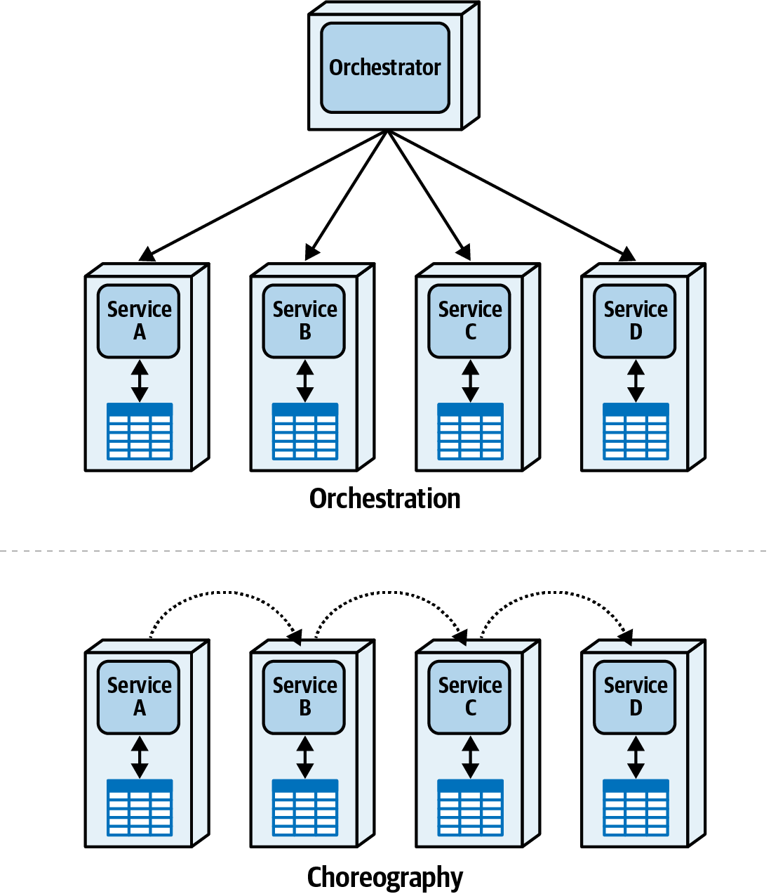
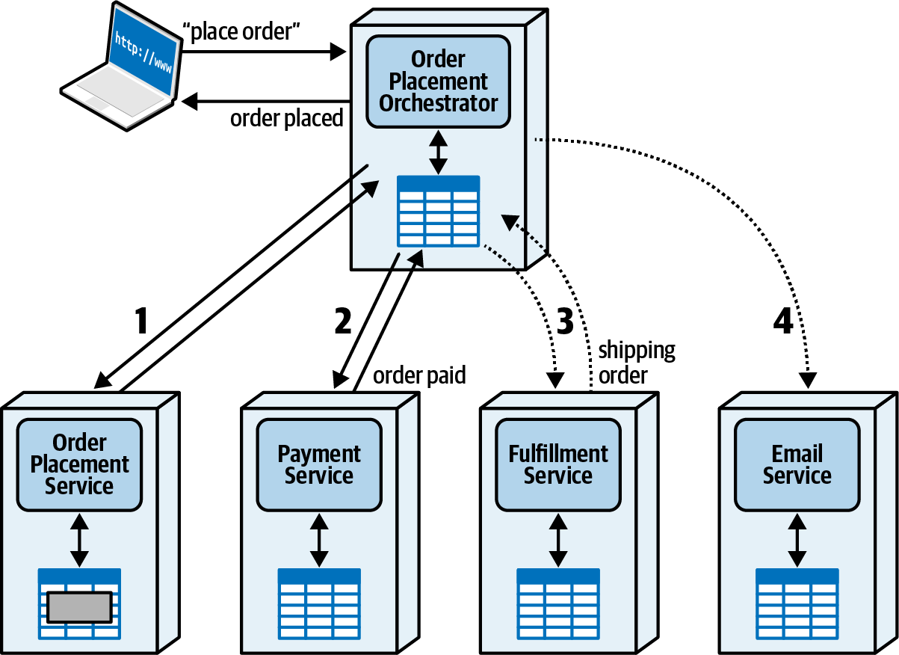

### Chapter 11: Managing Distributed Workflows - Summary

This chapter delves into the critical architectural challenge of coordinating workflows across multiple services in a distributed system. It moves beyond simplistic rules, advocating for a trade-off-based analysis of the two fundamental coordination patterns: **orchestration** and **choreography**. The chapter introduces the dimensions of dynamic coupling—communication, consistency, and **coordination**—as the theoretical basis for this analysis.

The **orchestration** pattern is detailed, showing how a central orchestrator component simplifies complex workflows, especially error handling and state management, at the cost of potential bottlenecks and tighter coupling. Conversely, the **choreography** pattern is explored as a highly decoupled and scalable alternative where services communicate directly. However, its simplicity in "happy path" scenarios quickly gives way to complex, tangled communication paths when handling errors and boundary conditions.

The chapter introduces the concept of **semantic coupling** versus **implementation coupling**, arguing that an architect's primary goal is to model the inherent complexity of a business workflow as closely as possible without adding unnecessary implementation complexity. Finally, through the Sysops Squad saga, the chapter provides a practical, step-by-step example of how to conduct a trade-off analysis between orchestration and choreography for a real-world problem, culminating in a well-justified Architecture Decision Record (ADR).

---

### Dimensions of Dynamic Coupling

In a distributed architecture, services must interact. This interaction, or dynamic coupling, has three key dimensions that architects must manage:
1.  **Communication:** (Synchronous vs. Asynchronous)
2.  **Consistency:** (Transactional vs. Eventual)
3.  **Coordination:** (Orchestration vs. Choreography)

This chapter focuses on **coordination**, which involves combining two or more services to perform a unit of work.

---

### Orchestration vs. Choreography

These are the two fundamental patterns for coordinating workflows.

---

### Orchestration Communication Style

This pattern uses a central **orchestrator** (or mediator) component to manage the workflow, including state, error handling, and alternate paths. It's like a conductor leading an orchestra.

#### Happy Path Example
Consider a customer placing an order. The orchestrator directs the flow between the `Order Placement`, `Payment`, `Fulfillment`, and `Email` services. Time-sensitive calls (like payment) are synchronous, while less critical calls (like fulfillment and email) can be asynchronous.

#### Error Handling Examples

The real value of an orchestrator becomes apparent when handling errors.
1.  **Payment Rejected:** The orchestrator receives the failure from the `Payment Service`, tells the `Email Service` to notify the customer, and updates the `Order Placement Service` to reflect the failed order status.
    

2.  **Item Backordered:** The `Fulfillment Service` reports a backorder. The orchestrator manages the compensating transactions, telling the `Payment Service` to refund the charge and updating the `Order Placement Service`.
    

#### Trade-offs for Orchestration

| Advantage          | Disadvantage     |
| ------------------ | --------------- |
| Centralized workflow | Responsiveness  |
| Error handling     | Fault tolerance |
| Recoverability     | Scalability     |
| State management   | Service coupling|

---

### Choreography Communication Style

In this pattern, there is no central coordinator. Services communicate directly with each other, like dance partners who have practiced their moves beforehand.

#### Happy Path Example
The same order placement workflow is modeled as a chain of events. The `Order Placement Service` triggers the `Payment Service`, which triggers the `Fulfillment Service`, and so on.

#### Error Handling Examples
Error handling is where choreography becomes complex.
1.  **Payment Rejected:** The `Payment Service` must now know to communicate directly with both the `Email Service` and the `Order Placement Service` to handle the failure. This adds a new communication link.
    

2.  **Item Backordered:** This is much more complex. The `Fulfillment Service` discovers the error late in the process. It must now broadcast an event or send individual messages to the `Email`, `Payment`, and `Order Placement` services so they can perform compensating actions. This adds many new communication links and distributes the workflow logic across multiple services.
    
    

---

### Semantic vs. Implementation Coupling

*   **Semantic Coupling:** The inherent complexity and number of steps required by the business domain's workflow. An architect cannot reduce this.
*   **Implementation Coupling:** The complexity added by the architectural design. An architect can make this worse.

> **Semantic Coupling:** An architect can never reduce semantic coupling via implementation, but they can make it worse.

The goal is to choose an implementation (e.g., orchestration) that closely matches the semantic coupling of the workflow without adding unnecessary complexity. Trying to force a complex, error-prone workflow into a simple choreographed implementation often leads to a tangled mess.

---

### Workflow State Management in Choreography

Without a central orchestrator, managing the state of a workflow becomes a challenge.
1.  **Front Controller Pattern:** The first service in the chain (e.g., `Order Placement Service`) is designated as the state owner. Other services must call back to it to update the workflow status. This creates a "pseudo-mediator."
    
2.  **Stateless Choreography:** No service holds the transient workflow state. To find the status of an order, a query must be sent to *all* participating services to build a real-time snapshot. This is highly scalable but complex.
3.  **Stamp Coupling:** The workflow state is added to the message contract itself. Each service updates its part of the state and passes the entire state object to the next service.

#### Trade-offs for Choreography

| Advantage        | Disadvantage          |
| ---------------- | -------------------- |
| Responsiveness   | Distributed Workflow |
| Scalability      | State Management     |
| Fault tolerance  | Error handling       |
| Service decoupling | Recoverability       |

---

### Trade-Offs: Orchestration vs. Choreography

The decision depends on the complexity of the workflow. As semantic complexity (number of steps, error conditions, alternate paths) increases, the utility of an orchestrator rises proportionally.

*   **Use Choreography for:** Simple workflows that need high responsiveness and scalability, with few and simple error conditions.
*   **Use Orchestration for:** Complex workflows with significant error handling, boundary conditions, and the need for a queryable state.

---

### Sysops Squad Saga: Managing Workflows

*   **Problem:** The team needs to choose a coordination pattern for the primary ticket workflow, which involves four services and six steps. Austen favors choreography for decoupling; Addison favors orchestration for control.
*   **Models:** They model the workflow using both patterns.
    *   **Choreography Model:**
        
    *   **Orchestration Model:**
        
*   **Analysis:** They perform a trade-off analysis based on key business requirements:
    1.  **Workflow Control (Lost Tickets):** Orchestration is better for controlling the flow and preventing lost tickets.
    2.  **State Query (Ticket Status):** Both patterns can support this, so it's a tie.
    3.  **Error Handling (Cancellations/Reassignments):** Orchestration is clearly superior for managing complex error conditions centrally.
*   **Decision:** Based on the analysis, **orchestration** is the clear winner for this specific workflow.

| Orchestration      | Choreography |
| ------------------ | ------------ |
| workflow control   |              |
| state query        | state query  |
| error handling     |              |

*   **ADR: Use orchestration for primary ticket workflow**
    *   **Context:** The primary ticket workflow requires strong control, error handling, and status tracking.
    *   **Decision:** We will use orchestration.
    *   **Justification:** The trade-off analysis showed that orchestration better handles the key requirements for workflow control and complex error handling.
    *   **Consequences:** The orchestrator could become a scalability bottleneck if requirements change significantly in the future.

---

### Actionable Tips from Chapter 11

> **1. Choose Your Pattern Based on Workflow Complexity.** Don't default to one style. Use choreography for simple, high-throughput workflows. Use orchestration for complex workflows with significant error handling, branching, or compensation logic.

> **2. Don't Let Implementation Add Complexity.** Understand the inherent (semantic) complexity of your business workflow. Your architecture should model this complexity as directly as possible, not add new layers of implementation complexity on top of it.

> **3. Make State Management a Deliberate Decision.** In choreographed systems, deciding where workflow state lives is a critical decision. Choose explicitly between a Front Controller, a stateless approach, or stamp coupling based on your needs for queryability and performance.

> **4. Recognize That Error Handling Is the Litmus Test.** The "happy path" often looks simple in any pattern. The true test of your design is how it handles error conditions, retries, and compensating transactions. This is where the cost of choreography's "simplicity" becomes apparent.

> **5. Keep Orchestrators Scoped to a Single Workflow.** Avoid creating a monolithic Enterprise Service Bus (ESB). In a microservices architecture, each complex workflow should have its own dedicated, single-purpose orchestrator.

> **6. Perform a Formal Trade-Off Analysis.** Don't let the decision be guided by dogma ("always use choreography for decoupling"). Use a structured process like the one in the Sysops Squad saga to compare the patterns against your specific business drivers and architectural characteristics.

> **7. Document Your Workflow Decision in an ADR.** The choice between orchestration and choreography has a major impact on the system's coupling, scalability, and maintainability. Record why you chose a particular pattern and the trade-offs you accepted.
