### Chapter 12: Transactional Sagas - Summary

This chapter provides a deep dive into managing transactions in distributed architectures through the **saga pattern**. It expands on the traditional definition of a saga, moving beyond simple event-chaining to present a comprehensive framework of **eight distinct saga patterns**. These patterns are derived from the intersection of the three dimensions of dynamic coupling introduced previously: **Communication** (synchronous/asynchronous), **Consistency** (atomic/eventual), and **Coordination** (orchestrated/choreographed).

The chapter meticulously analyzes each of the eight patterns (e.g., Epic Saga, Fairy Tale Saga, Anthology Saga), complete with dimensional diagrams, isomorphic workflow illustrations, and a qualitative analysis of their trade-offs regarding coupling, complexity, responsiveness, and scalability. It highlights the severe challenges of attempting to achieve true atomic consistency in a distributed system, particularly with the complex and error-prone nature of **compensating transactions**.

As a more robust alternative, the chapter advocates for managing sagas through **state machines** and **eventual consistency**. This approach improves responsiveness and decouples the end-user from system failures by handling errors asynchronously. Practical techniques for managing sagas, such as using custom annotations, are presented. The chapter concludes with a detailed Sysops Squad saga that illustrates the many pitfalls of the "classic" orchestrated atomic saga (the Epic Saga), demonstrating why relaxing the atomicity constraint is often a superior architectural choice.

---

### Transactional Saga Patterns

A saga is a sequence of local transactions distributed across multiple services. The overall consistency of the business operation is managed by the saga. There are eight canonical saga patterns, each representing a unique combination of trade-offs.


A superscript is used to denote the characteristics of each saga (in alphabetical order: **c**onsistency, **c**oordination, **c**ommunication). For example, **Epic Saga(sao)** stands for **s**ynchronous, **a**tomic, **o**rchestrated.

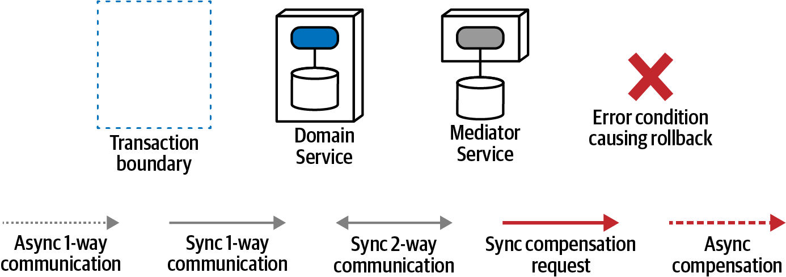

---

### 1. Epic Saga(sao) Pattern
*(Synchronous, Atomic, Orchestrated)*

This is the "traditional" saga pattern that attempts to mimic a monolithic ACID transaction in a distributed environment. It is the most tightly coupled pattern.

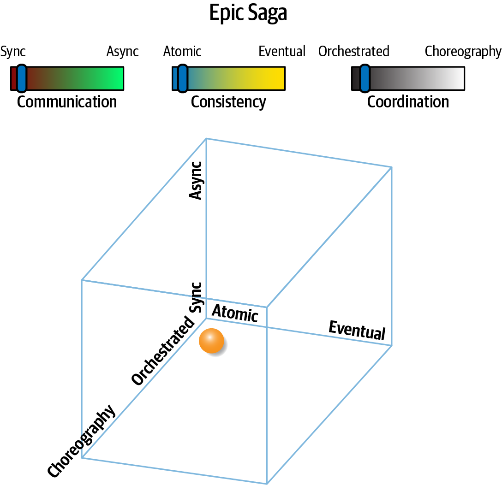

An orchestrator manages synchronous calls to services. If any service fails, the orchestrator issues **compensating transactions** to undo the previous operations, attempting to achieve atomicity.

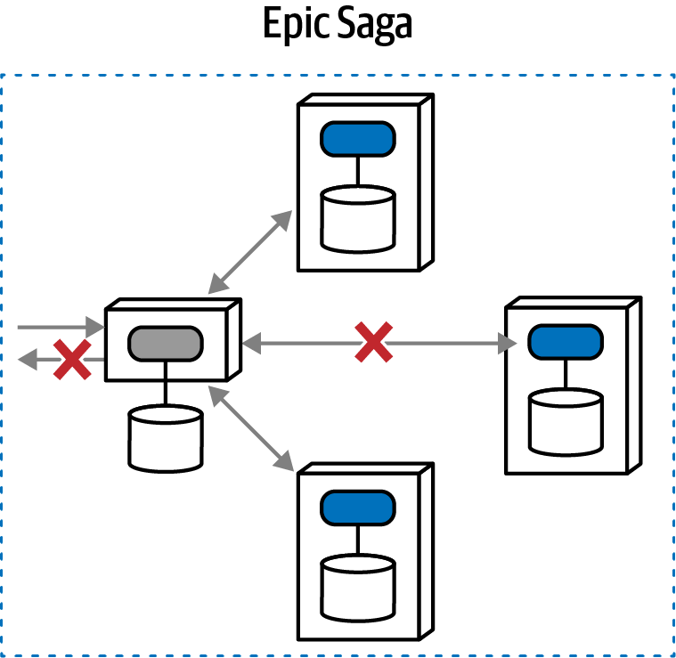

*   **Challenges:** Compensating transactions are notoriously difficult. They can fail, and they don't provide transactional isolation, leading to "side effects" where other services may act on data before it's rolled back.
*   **Best Use:** Use with extreme caution. It feels familiar to monolith developers but introduces significant complexity and has many failure modes.

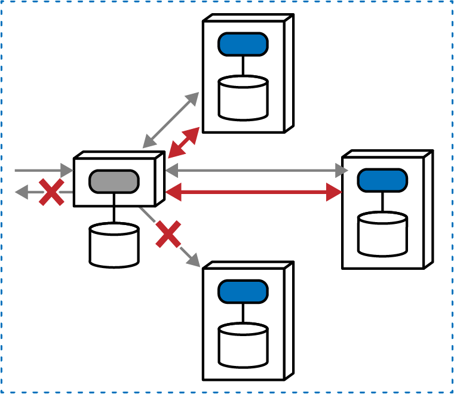

| Epic Saga(sao)              | Ratings   |
| --------------------------- | --------- |
| Coupling                    | Very high |
| Complexity                  | Low       |
| Responsiveness/availability | Low       |
| Scale/elasticity            | Very low  |

---

### 2. Phone Tag Saga(sac) Pattern
*(Synchronous, Atomic, Choreographed)*

This pattern removes the orchestrator, making the services responsible for coordinating the atomic transaction themselves.

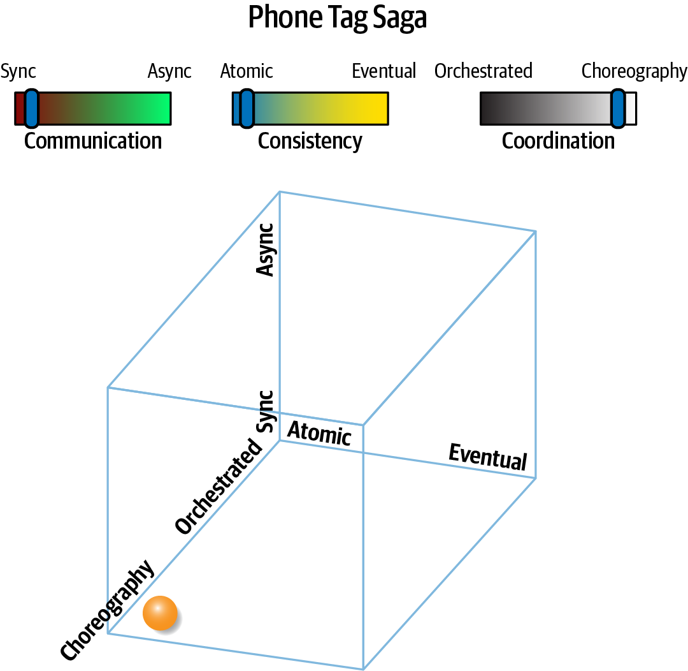

The first service in the chain acts as a "front controller." If a downstream service fails, each service in the chain is responsible for sending a compensating request back to the previous service.

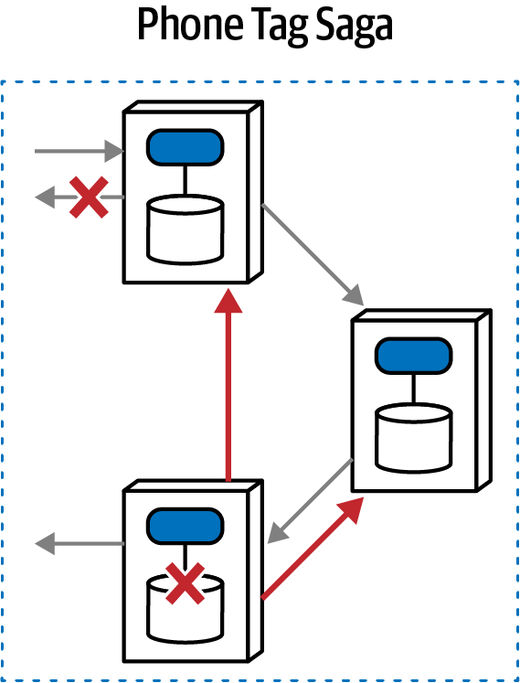

*   **Challenges:** Distributes the complex transactional logic across all participating domain services, increasing their complexity significantly. Error handling is much slower than with an orchestrator.
*   **Best Use:** Simple, linear workflows that need slightly better "happy path" scalability than the Epic Saga, but where error conditions are rare.

| Phone Tag Saga(sac)         | Ratings |
| --------------------------- | ------- |
| Coupling                    | High    |
| Complexity                  | High    |
| Responsiveness/availability | Low     |
| Scale/elasticity            | Low     |

---

### 3. Fairy Tale Saga(seo) Pattern
*(Synchronous, Eventual, Orchestrated)*

This is a very popular and pragmatic pattern. It keeps the simple, synchronous, orchestrated workflow but relaxes the consistency requirement from atomic to **eventual**.

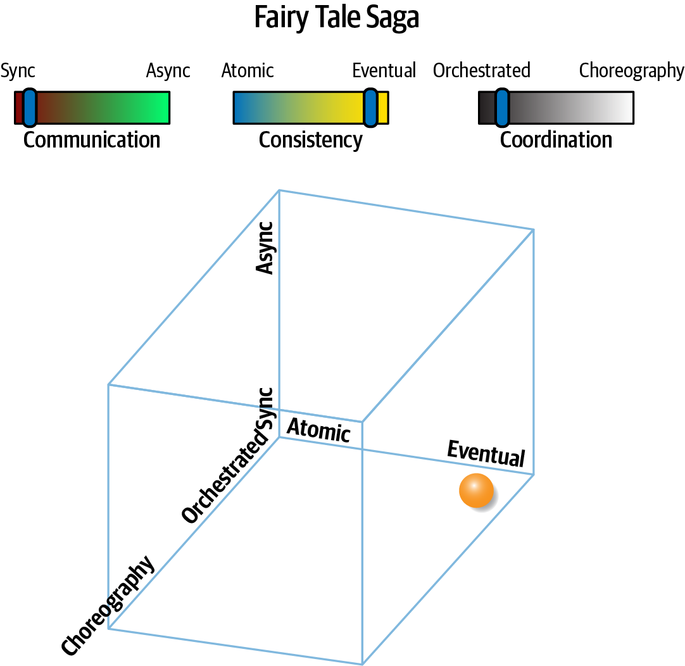

Each service manages its own local transaction. If a service fails, the orchestrator does not need to issue complex compensating transactions immediately. Instead, it can record the failed state and use retries or other background mechanisms to eventually bring the system into a consistent state.

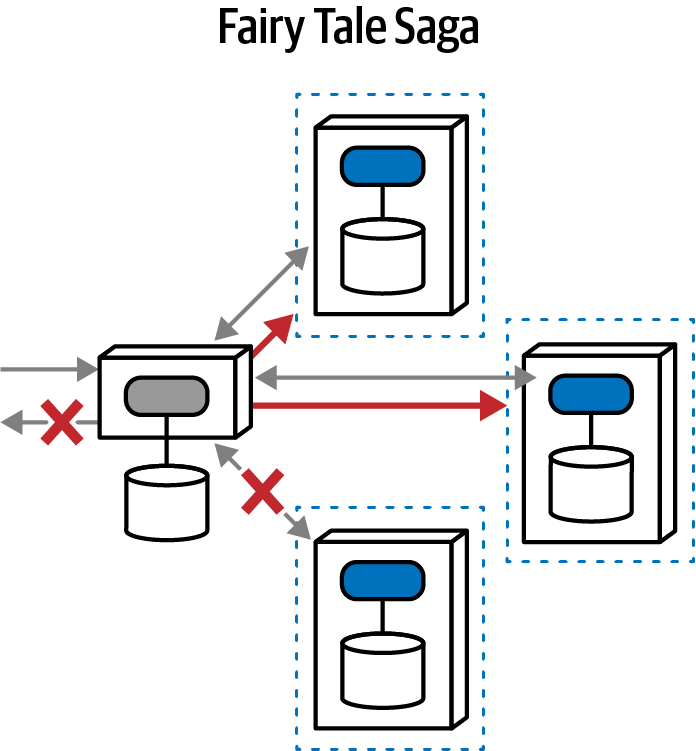

*   **Advantages:** This pattern offers a great balance. The orchestrator simplifies workflow management, synchronous calls are easy to reason about, and removing the atomic consistency requirement eliminates the most difficult challenges of distributed transactions.
*   **Best Use:** A go-to pattern for most complex workflows in a microservices architecture where immediate, perfect consistency is not a strict business requirement.

| Fairy Tale Saga(seo)        | Ratings |
| --------------------------- | ------- |
| Coupling                    | High    |
| Complexity                  | Very low|
| Responsiveness/availability | Medium  |
| Scale/elasticity            | High    |

---

### 4. Time Travel Saga(sec) Pattern
*(Synchronous, Eventual, Choreographed)*

This pattern removes the orchestrator from the Fairy Tale Saga, creating a synchronous, choreographed chain of services with eventual consistency.

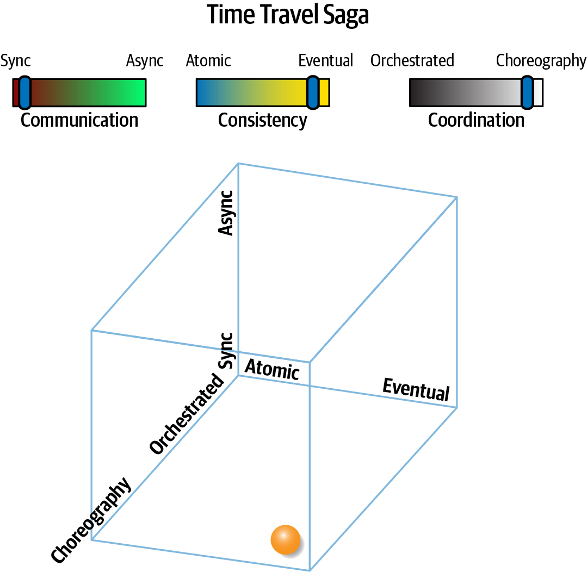

Services call each other in a synchronous chain, with each service committing its own local transaction. Error handling and workflow state must be managed by the services themselves.

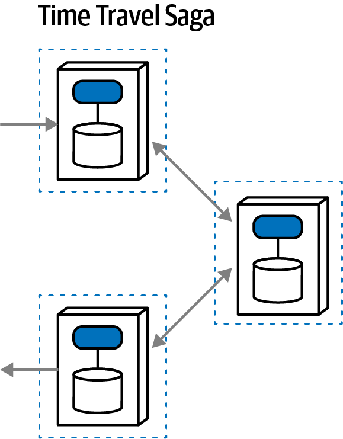

*   **Advantages:** Offers very high throughput for simple, linear, "fire and forget" style workflows like data ingestion pipelines.
*   **Best Use:** Simple, one-way workflows (like Pipes and Filters) where high throughput is needed and error handling is straightforward.

| Time Travel Saga(sec)       | Ratings |
| --------------------------- | ------- |
| Coupling                    | Medium  |
| Complexity                  | Low     |
| Responsiveness/availability | Medium  |
| Scale/elasticity            | High    |

---

### 5. Fantasy Fiction Saga(aao) Pattern
*(Asynchronous, Atomic, Orchestrated)*

This pattern attempts to improve the performance of the Epic Saga by making the communication asynchronous while trying to maintain atomic consistency. This is a difficult and often misguided combination.

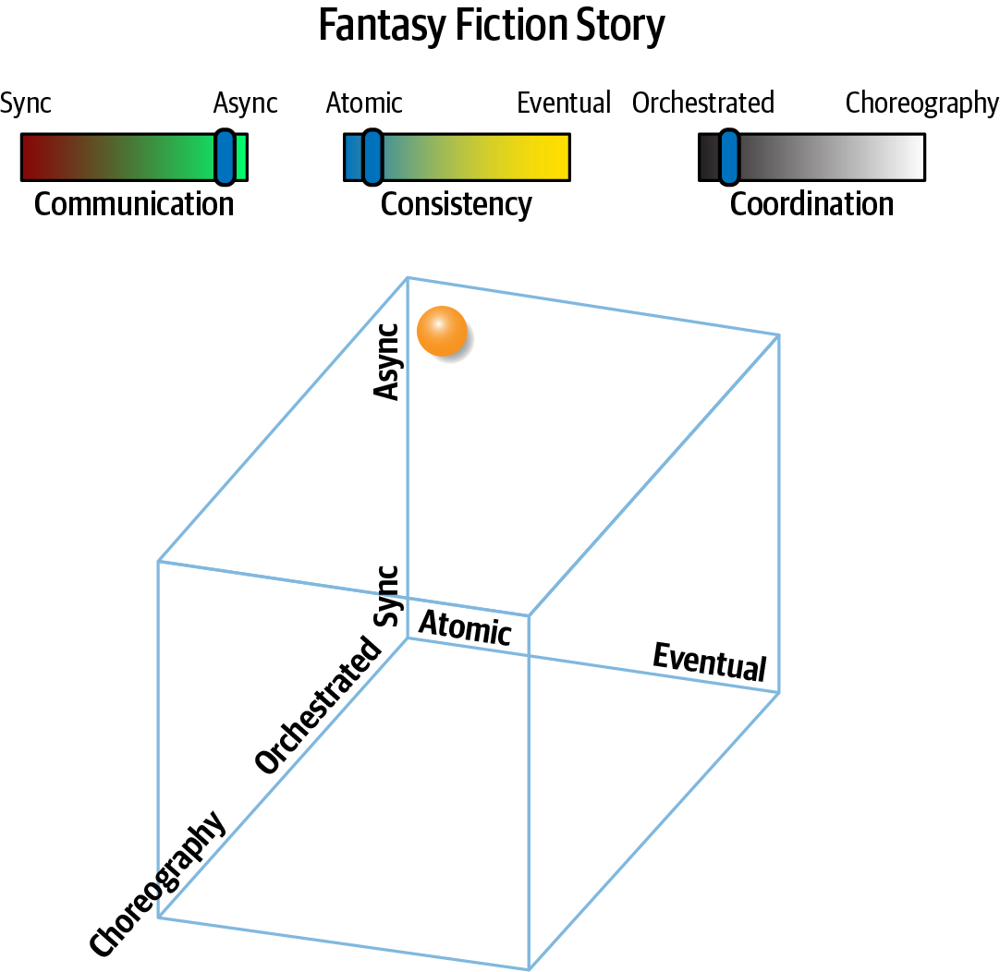

The orchestrator must now manage the state of multiple, in-flight, out-of-order atomic transactions, leading to enormous complexity (deadlocks, race conditions).

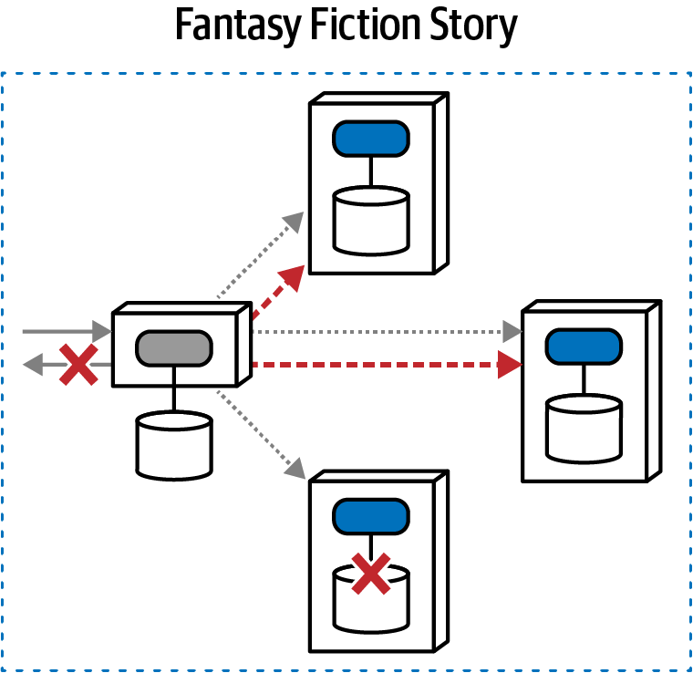

*   **Challenges:** The complexity of managing atomic consistency with asynchronous communication is immense and rarely worth the effort.
*   **Best Use:** Rarely a good choice. Architects are better off relaxing the atomicity requirement and choosing the Parallel Saga instead.

| Fantasy Fiction(aao)        | Ratings |
| --------------------------- | ------- |
| Coupling                    | High    |
| Complexity                  | High    |
| Responsiveness/availability | Low     |
| Scale/elasticity            | Low     |

---

### 6. Horror Story(aac) Pattern
*(Asynchronous, Atomic, Choreographed)*

This is the worst possible combination of forces, hence the name. It attempts to achieve atomic consistency with a fully decoupled communication style (asynchronous and choreographed).

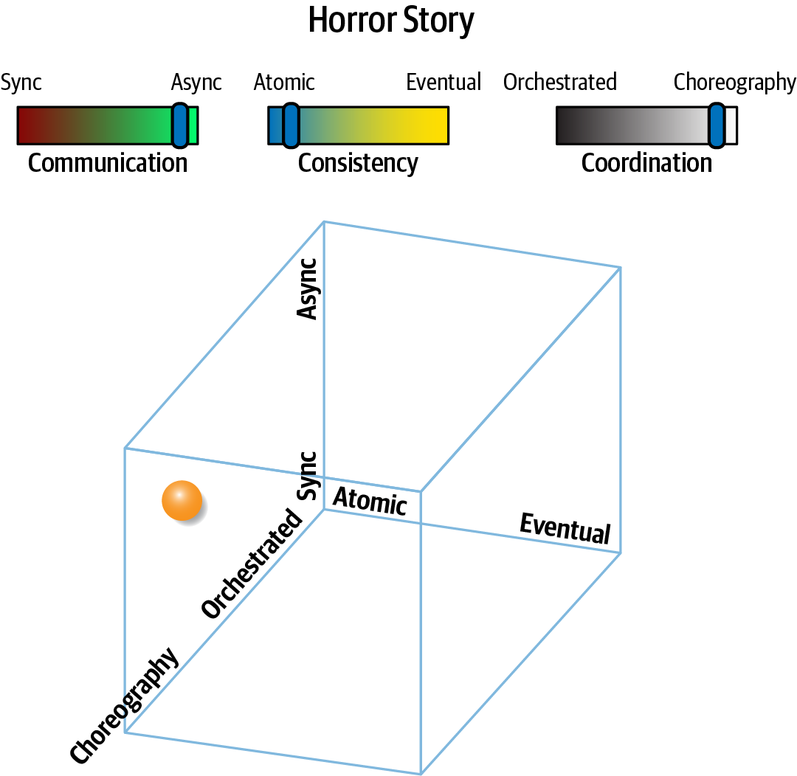

Each service must contain logic to handle multiple, out-of-order, in-flight atomic transactions and coordinate compensating actions with all other services without a central orchestrator.

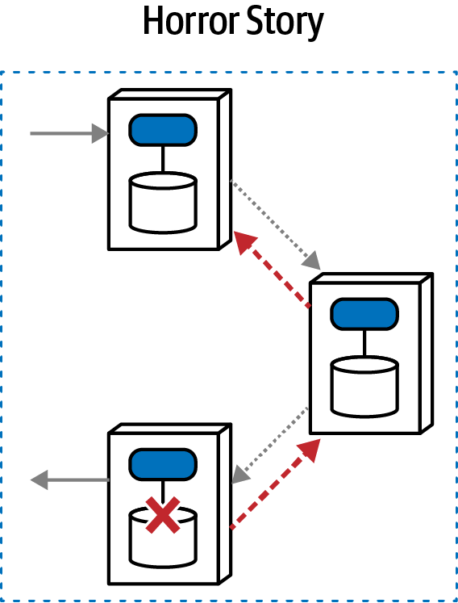

*   **Challenges:** The complexity is "truly horrific." This pattern is an anti-pattern that arises from trying to optimize an Epic Saga without understanding the dimensional trade-offs.
*   **Best Use:** Never. Avoid this pattern.

| Horror Story(aac)           | Ratings  |
| --------------------------- | -------- |
| Coupling                    | Medium   |
| Complexity                  | Very high|
| Responsiveness/availability | Low      |
| Scale/elasticity            | Medium   |

---

### 7. Parallel Saga(aeo) Pattern
*(Asynchronous, Eventual, Orchestrated)*

This pattern is an excellent choice for high-scale workflows. It is the asynchronous version of the Fairy Tale Saga.

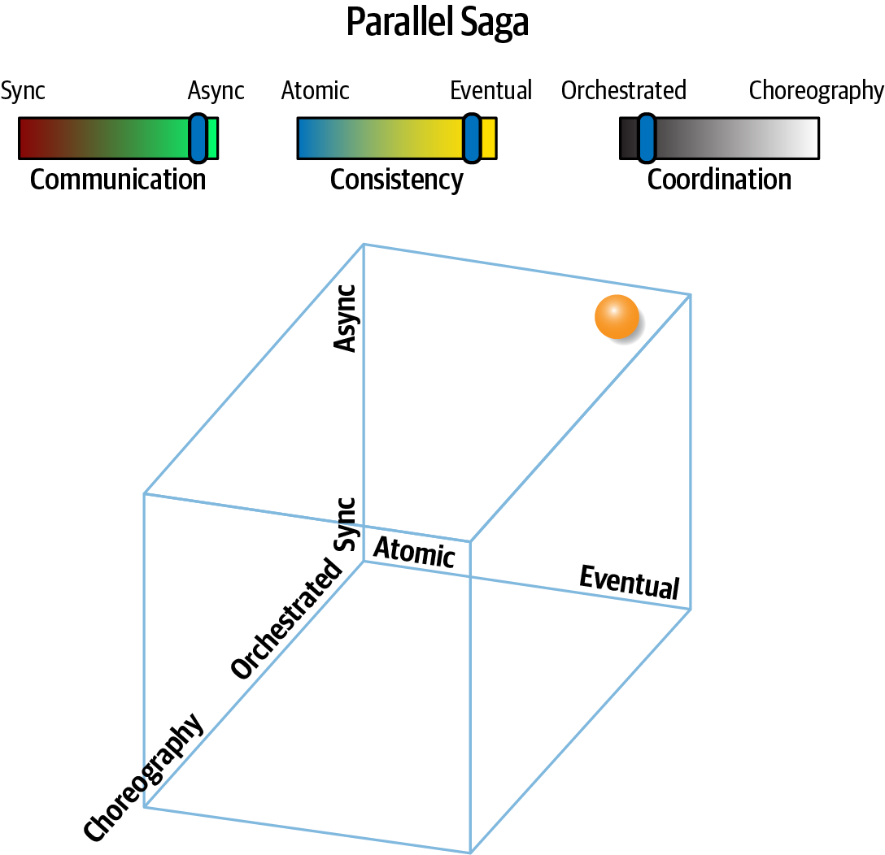

An orchestrator manages the workflow by sending asynchronous messages. Because communication is non-blocking and consistency is eventual, services can process requests in parallel, leading to high responsiveness and scalability.

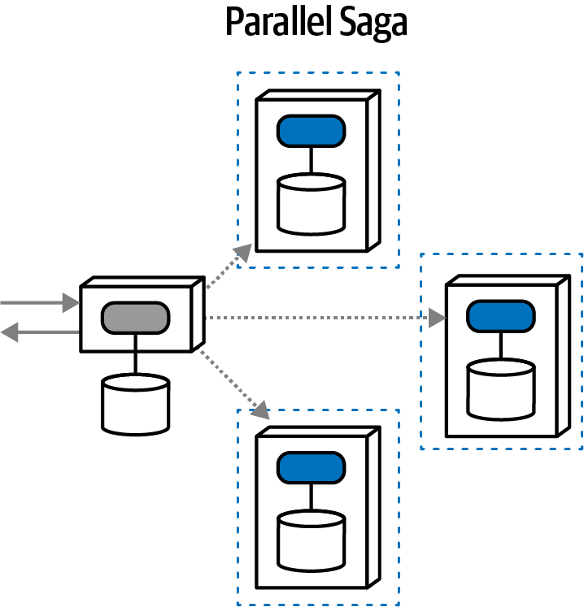

*   **Advantages:** High responsiveness and scalability, while the orchestrator keeps the management of complex workflows and error handling centralized and manageable.
*   **Best Use:** Complex workflows that require high scale and responsiveness.

| Parallel Saga(aeo)          | Ratings |
| --------------------------- | ------- |
| Coupling                    | Low     |
| Complexity                  | Low     |
| Responsiveness/availability | High    |
| Scale/elasticity            | High    |

---

### 8. Anthology Saga(aec) Pattern
*(Asynchronous, Eventual, Choreographed)*

This is the most decoupled, and potentially highest-performing, of all the saga patterns. It represents the opposite extreme of the Epic Saga.

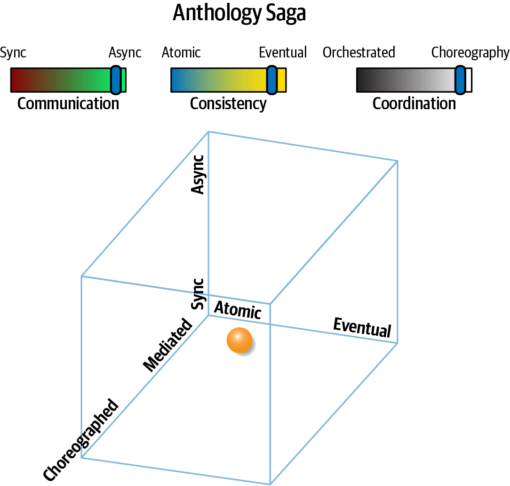

Services communicate via asynchronous messages without a central orchestrator. Each service is responsible for its own part of the workflow.

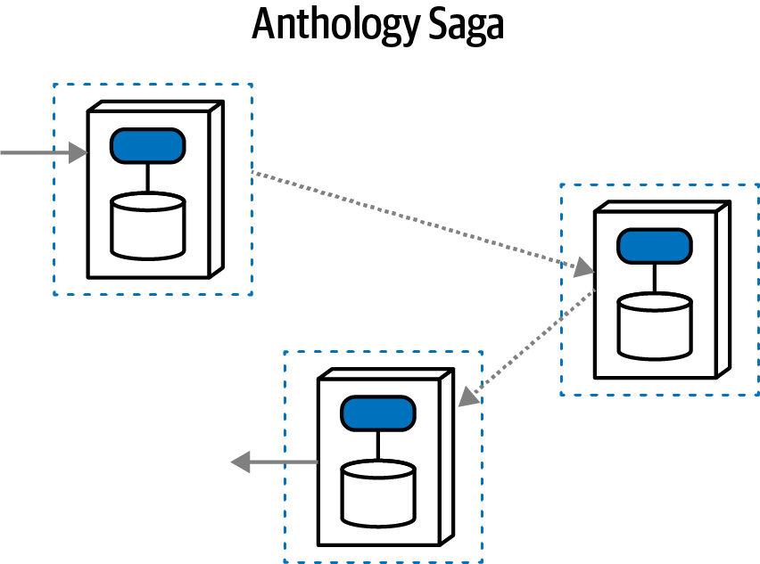

*   **Advantages:** Extremely high throughput, scalability, and elasticity due to the complete lack of bottlenecks or coupling points.
*   **Best Use:** High-throughput, simple, linear workflows where error conditions are rare or simple to handle (e.g., a Pipes and Filters architecture for data processing). Not suitable for complex, multi-step business transactions.

| Anthology Saga(aec)         | Ratings   |
| --------------------------- | --------- |
| Coupling                    | Very low  |
| Complexity                  | High      |
| Responsiveness/availability | High      |
| Scale/elasticity            | Very high |

---

### Saga State Machines

Instead of relying on complex compensating transactions, a better approach for sagas with eventual consistency (like the Fairy Tale or Parallel sagas) is to manage the workflow using a **finite state machine**.

An orchestrator tracks the current state of the saga (e.g., `CREATED`, `ASSIGNED`, `COMPLETED`). If a step fails (e.g., the `Survey Service` is down), the orchestrator simply moves the saga to an error state (e.g., `NO_SURVEY`) and responds successfully to the user. A background process can then handle retries or manual escalation to eventually correct the issue. This decouples the user from transient system failures and improves responsiveness.

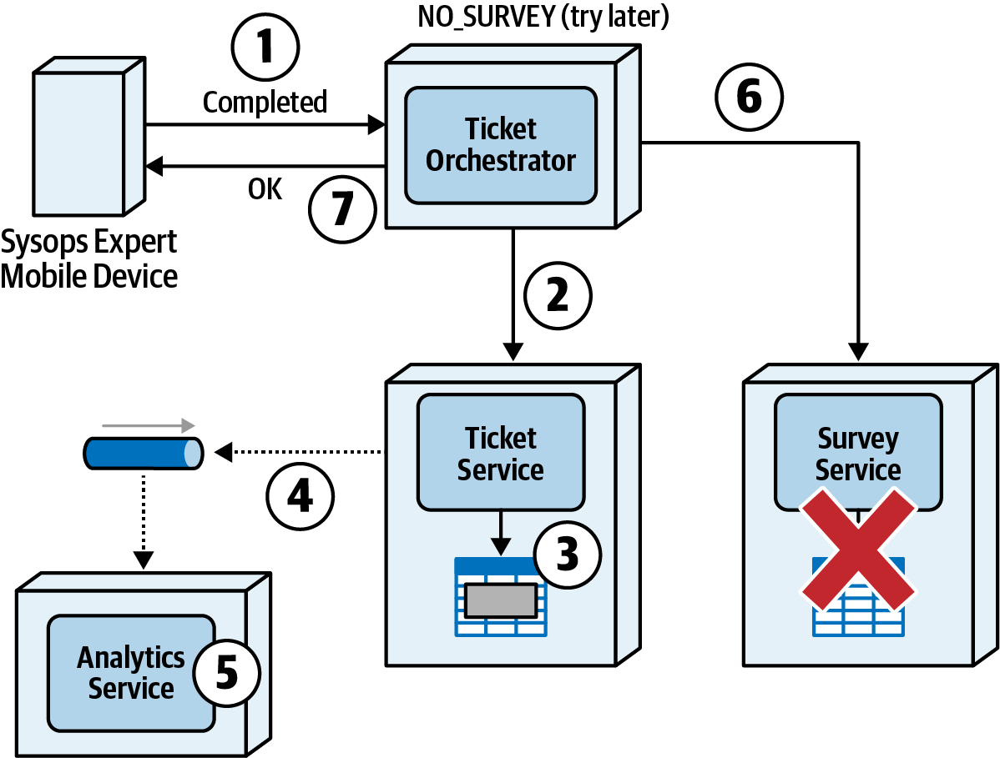
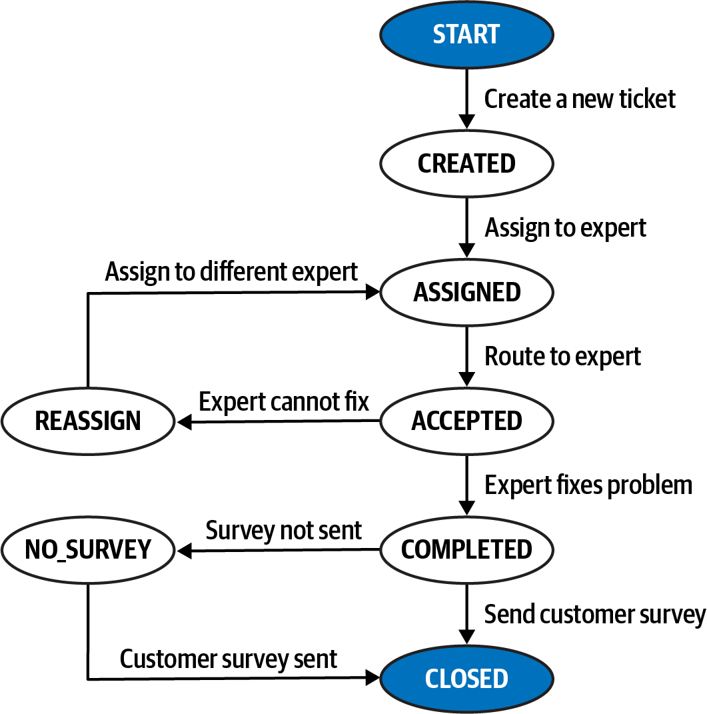

| Initiating State | Transition State | Transaction Action           |
| ---------------- | ---------------- | ---------------------------- |
| START            | CREATED          | Assign ticket to expert      |
| CREATED          | ASSIGNED         | Route ticket to assigned expert |
| ...              | ...              | ...                          |

---

### Techniques For Managing Sagas

Use custom annotations (Java) or attributes (C#) to programmatically document which services participate in which sagas. This provides a simple way to query the codebase to understand the scope and impact of a given transactional workflow.

```java
// Example 12-1: Defining a transactional saga annotation in Java
@Retention(RetentionPolicy.RUNTIME)
@Target(ElementType.TYPE)
public @interface Saga {
   public Transaction[] value();

   public enum Transaction {
      NEW_TICKET,
      CANCEL_TICKET,
      // ...
   }
}
```

```java
// Example 12-3: Applying the saga annotation to a service
@ServiceEntrypoint
@Saga({Transaction.NEW_TICKET, Transaction.CANCEL_TICKET})
public class TicketServiceAPI {
   // ...
}
```
A simple command-line tool can then be built to query this metadata:
`$ ./sagatool.sh NEW_TICKET -services`
`-> Ticket Service`
`-> Assignment Service`
`...`

---

### Sysops Squad Saga: Atomic Transactions

*   **Problem:** The team models the "mark ticket complete" workflow using an **Epic Saga(sao)**, requiring an atomic update across the `Ticket Service` and the `Survey Service`.
    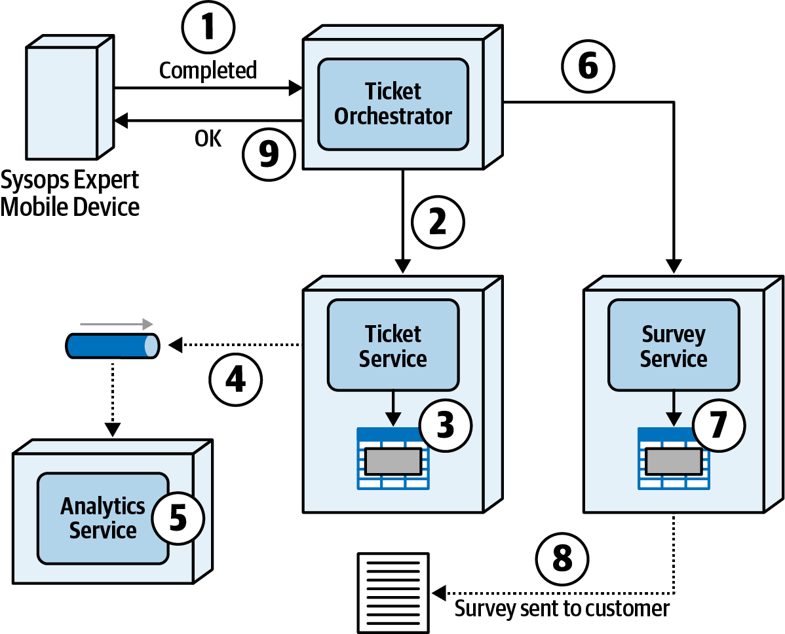
*   **Analysis of Failures:**
    1.  **Side Effects:** If the `Survey Service` fails, a compensating update is sent to the `Ticket Service`. However, the `Ticket Service` had already published an event that was consumed by the `Analytics Service`. The analytics data is now inconsistent, and reversing it is extremely difficult. This demonstrates the lack of isolation.
        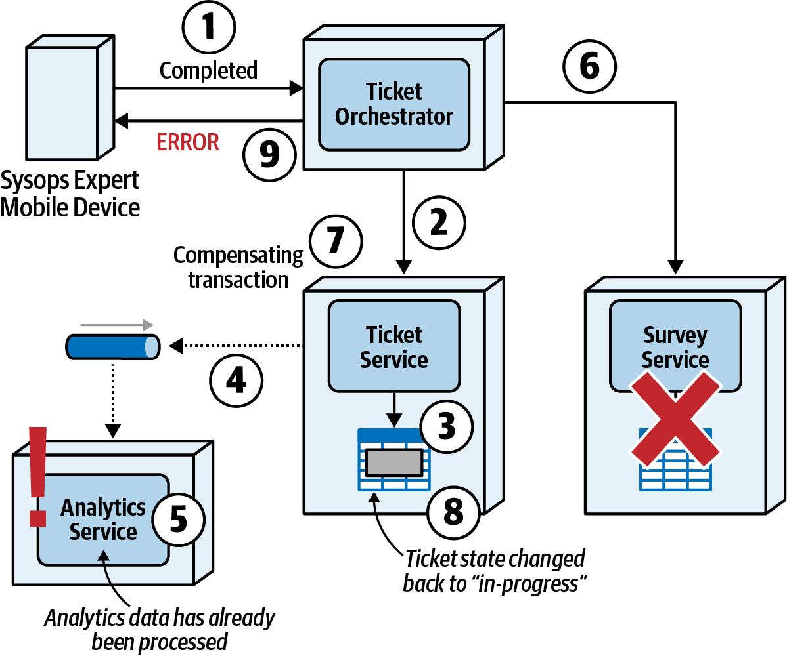
    2.  **Compensation Failure:** What if the compensating update itself fails? The system is now left in a completely inconsistent state, and the user receives a confusing error message.
        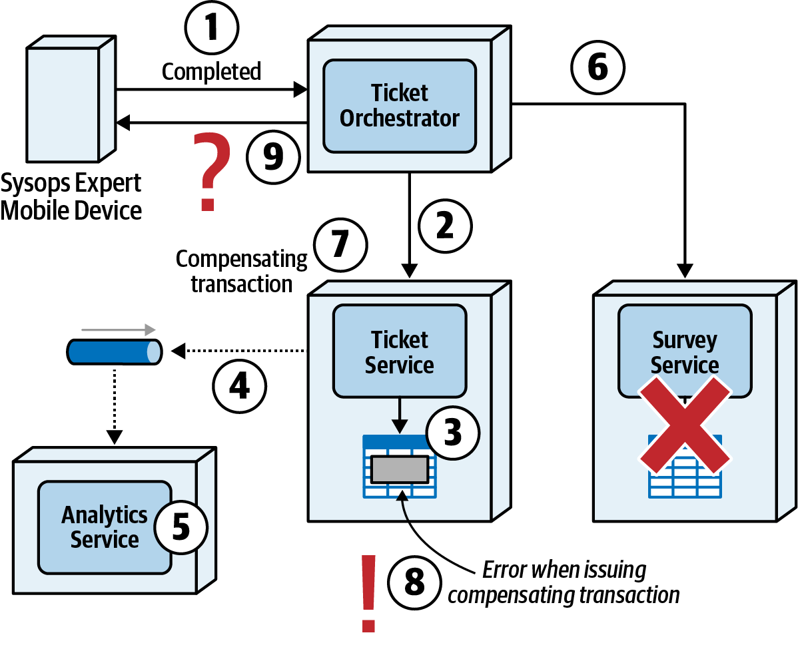
*   **Decision:** The team realizes the Epic Saga is too complex and brittle. They decide to investigate patterns that use **eventual consistency and state management** (like the Fairy Tale or Parallel sagas) as a more robust and responsive alternative.

---

### Actionable Tips from Chapter 12

> **1. Use the Eight Saga Patterns as a Design Palette.** Don't assume "saga" just means one thing. Use the matrix of eight patterns to consciously choose the right set of trade-offs for your specific workflow. Start by deciding on your required consistency level (atomic vs. eventual).

> **2. Avoid Atomic Sagas (Epic, Phone Tag, etc.) if Possible.** Attempting to achieve perfect atomic consistency across distributed services is fraught with complexity, side effects, and failure modes. Challenge business requirements that demand it and favor eventual consistency unless absolutely necessary.

> **3. Prefer Eventual Consistency with State Management.** For most distributed workflows, a saga pattern based on eventual consistency (like Fairy Tale or Parallel) combined with a state machine in an orchestrator provides the best balance of responsiveness, scalability, and manageable complexity.

> **4. Decouple the User from System Failures.** A key benefit of eventual consistency and state management is that transient downstream failures don't have to fail the entire operation for the user. The saga can enter an error state and be corrected asynchronously, leading to a much better user experience.

> **5. Understand the Horror of the "Horror Story(aac)" Pattern.** Be aware that combining atomic consistency with asynchronous, choreographed communication is a recipe for disaster. If you find yourself designing this, it's a sign that you need to re-evaluate your core architectural choices, likely by relaxing the atomicity constraint.

> **6. Use Orchestration for Complex, State-Dependent Workflows.** If your workflow has multiple steps, error conditions, and branching logic, an orchestrator (as in the Fairy Tale or Parallel sagas) is invaluable for centralizing that logic and managing state.

> **7. Use Choreography for High-Throughput, Simple Workflows.** If your workflow is a simple, linear chain and your primary driver is maximum scale and decoupling, a choreographed pattern (like Time Travel or Anthology) is a good fit.

> **8. Document Your Sagas Programmatically.** Use techniques like custom annotations or attributes to embed saga participation information directly in your service code. This creates a living document that helps developers understand the testing scope and impact of changes.


