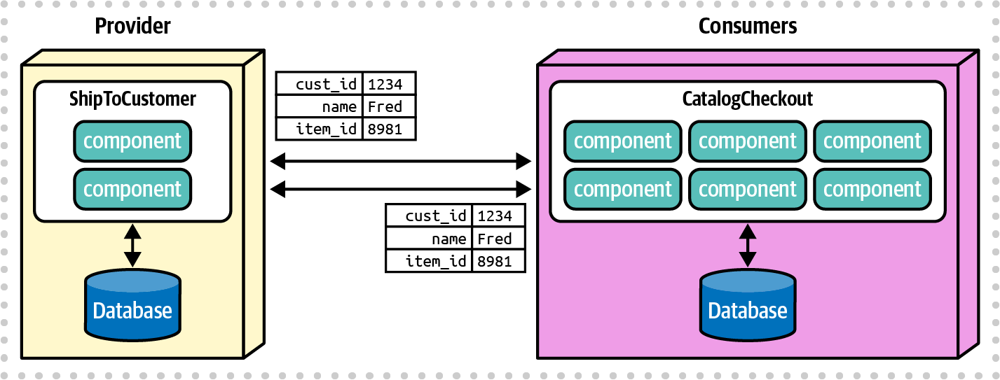
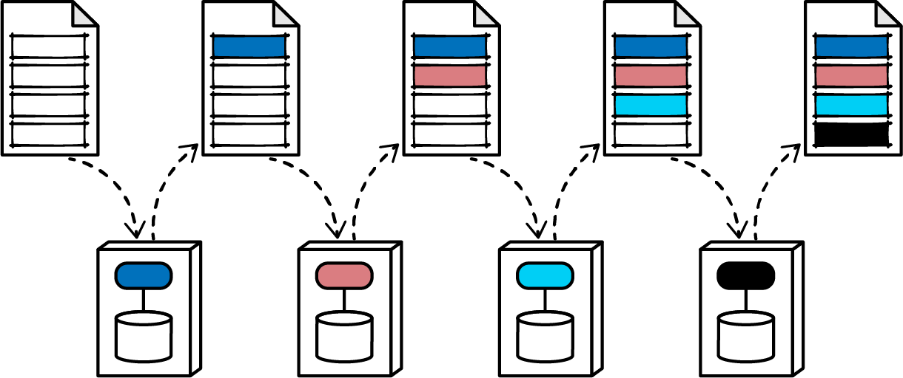

### Chapter 13: Contracts - Summary

This chapter explores one of the most pervasive, cross-cutting concerns in software architecture: **contracts**. It defines a contract broadly as the format used by any parts of an architecture to convey information or dependencies. The chapter establishes that contracts exist on a spectrum from **strict** (e.g., RPC, schema-validated JSON), which offers high fidelity at the cost of tight coupling, to **loose** (e.g., simple name/value pairs), which provides maximum decoupling but requires more sophisticated governance.

The chapter provides a detailed trade-off analysis for both strict and loose contracts, showing how architects must balance the need for contract certainty with the goal of evolvability. It introduces key patterns for managing this trade-off, most notably **consumer-driven contracts**, a technique that allows for loose coupling while ensuring contract fidelity through automated fitness functions.

It also analyzes the **Stamp Coupling** pattern, identifying it as a potential anti-pattern when it leads to over-coupling or excessive bandwidth consumption, but also as a useful technique for managing state in complex, choreographed workflows. The chapter concludes with a Sysops Squad saga where the team applies these principles to decide on the appropriate contract types for their ticketing workflow, formalizing a key decision in an ADR that balances technical ideals with real-world deployment constraints.

---

### The Nature of Contracts

Contracts are a cross-cutting concern that affects all dimensions of dynamic coupling (communication, consistency, and coordination).


> **Contract Definition:** The format used by parts of an architecture to convey information or dependencies. This includes everything from API calls to library dependencies.

---

### Strict versus Loose Contracts

Contracts exist on a spectrum. The architect's job is to choose the appropriate level of strictness for a given interaction.


#### Strict Contracts
These require exact adherence to names, types, ordering, and other details, leaving no ambiguity. Examples include RPC frameworks like gRPC and schema-validated JSON.

```json
// Example 13-1: A strict JSON contract using a schema
{
    "$schema": "http://json-schema.org/draft-04/schema#",
    "properties": {
      "acct": {"type": "number"},
      "cusip": {"type": "string"},
      "shares": {"type": "number", "minimum": 100}
   },
    "required": ["acct", "cusip", "shares"]
}
```

| Advantages                     | Disadvantages    |
| ------------------------------ | ---------------- |
| Guaranteed contract fidelity   | Tight coupling   |
| Versioned                      | Versioned (can be complex) |
| Easier to verify at build time |                  |
| Better documentation           |                  |

#### Loose Contracts
These have little to no schema information, often using simple name/value pairs. Examples include basic JSON or YAML.

```json
// Example 13-4: A loose contract using simple name/value pairs in JSON
{
  "name": "Mark",
  "status": "active",
  "joined": "2003"
}
```

Loose contracts are critical for keeping services decoupled, especially when they have different internal data models (bounded contexts).



| Advantages         | Disadvantages            |
| ------------------ | ------------------------ |
| Highly decoupled   | Contract management      |
| Easier to evolve   | Requires fitness functions |

---

### Consumer-Driven Contracts

This pattern resolves the classic microservices dilemma: how to have loosely coupled services while still guaranteeing contract fidelity. It inverts the traditional "push" model into a "pull" model.

*   **How it works:** Each **consumer** service defines a contract specifying exactly the data it needs from a **provider** service. This contract is given to the provider team, who integrates it into their build pipeline as a set of automated tests. The provider must keep these consumer contract tests "green" at all times.
*   **Benefit:** The provider can evolve its internal model freely, but the build will break if they make a change that violates a contract a consumer depends on. This allows for loose coupling (name/value pairs) with automated governance.


| Advantages                               | Disadvantages                      |
| ---------------------------------------- | ---------------------------------- |
| Allows loose contract coupling between services | Requires engineering maturity      |
| Allows variability in strictness         | Two interlocking mechanisms rather than one |
| Evolvable                                |                                    |

---

### Stamp Coupling

Stamp coupling describes passing a large data structure between services where each service only uses a small portion of that data.



#### Stamp Coupling as an Anti-Pattern
1.  **Over-Coupling:** An architect might couple a consumer to a provider's entire data structure "just in case" it needs more fields later. This is a fragile design. If the provider changes a field the consumer doesn't even use, the contract still breaks, forcing unnecessary coordinated changes.
    
2.  **Bandwidth Waste:** Passing large, unnecessary data payloads over the network can consume significant bandwidth, violating one of the fallacies of distributed computing ("bandwidth is infinite").

#### Stamp Coupling as a Useful Pattern
In complex **choreographed** workflows, stamp coupling can be used to manage workflow state without a central orchestrator.
*   **How it works:** The message contract is designed to include both the domain data and the workflow state (e.g., status, transaction ID). Each service in the chain reads the state, performs its action, updates the state in the contract, and passes the enriched contract to the next service.
*   **Benefit:** This allows for highly scalable, choreographed workflows to manage complex state, trading off higher data coupling for better throughput.


| Advantages                                       | Disadvantages                                  |
| ------------------------------------------------ | ---------------------------------------------- |
| Allows complex workflows within choreographed solutions | Creates (sometimes artificially) high coupling between collaborators |
|                                                  | Can create bandwidth issues at high scale      |

---

### Sysops Squad Saga: Managing Ticketing Contracts

*   **Problem:** The team needs to define the contract types for the new orchestrated ticketing workflow.
*   **Analysis:**
    *   **Orchestrator to Ticket Services:** The `Ticket Management` and `Ticket Assignment` services are tightly related to the orchestrator's domain. Changes are likely to be coordinated. A **strict contract** is appropriate here.
    *   **Orchestrator to Notification/Survey:** These services are more loosely related and the data changes slowly. A **loose contract** is better to avoid brittle coupling.
    *   **Orchestrator to Mobile App:** The key constraint is that the mobile app is deployed via a public App Store, which can have long and unpredictable approval times. A strict contract would be a disaster, as a backend change could break the app for weeks.
*   **Decision:** The contract with the mobile app must be a **loose, name-value pair contract** to provide maximum flexibility and tolerance for slow deployment cycles.


*   **ADR: Loose contract for Sysops Squad expert mobile application**
    *   **Context:** The mobile app deployment cycle through the App Store is slow and unpredictable.
    *   **Decision:** We will use a loose, name-value pair contract for communication between the orchestrator and the mobile application. We will also build an extension mechanism for temporary flexibility.
    *   **Consequences:** More validation logic is required in both the orchestrator and the mobile app. This decision should be revisited if the App Store deployment process becomes faster.

---

### Actionable Tips from Chapter 13

> **1. Treat Contracts as a First-Class Architectural Concern.** Contracts are the "glue" of your system. The choice between strict and loose coupling has profound impacts on evolvability, brittleness, and team autonomy.

> **2. Default to Loose Contracts, Justify Strict Ones.** In distributed architectures like microservices, loose coupling is a primary goal. Start with the assumption of a loose contract (e.g., name/value pairs) and only introduce stricter contracts when there is a clear justification, such as tightly coupled domain logic.

> **3. Use Consumer-Driven Contracts to Govern Loose Contracts.** Don't let "loose contract" mean "unreliable contract." Implement consumer-driven contracts as an architectural fitness function to get the best of both worlds: the flexibility of loose coupling with the safety of automated verification.

> **4. Design Contracts Based on Need-to-Know.** Avoid the stamp coupling anti-pattern. A consumer's contract should only specify the fields it actually needs, not the provider's entire data model. This prevents brittle changes and reduces unnecessary coupling.

> **5. Consider Real-World Constraints in Contract Design.** As the mobile app saga shows, deployment constraints can be a powerful driver for contract design. A technically "perfect" strict contract is useless if it can't be deployed effectively.

> **6. Leverage Stamp Coupling for Complex Choreography.** When you need the scalability of choreography for a complex workflow, consider using stamp coupling as a deliberate pattern to pass workflow state between services. This is a valid trade-off of data coupling for coordination.

> **7. Don't Confuse Implementation with Contract Style.** gRPC, REST, and Messaging are implementations, not contract styles in themselves. You can implement a relatively loose contract with gRPC (by using flexible message types) or a very strict one with REST (by enforcing a rigid schema). Focus on the desired level of coupling first, then choose the tool.

