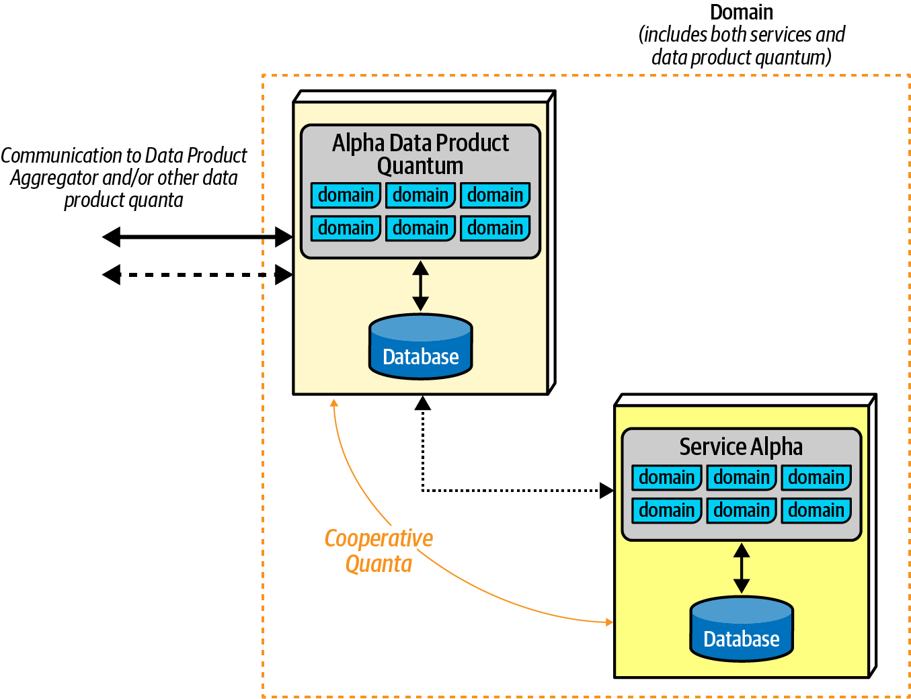
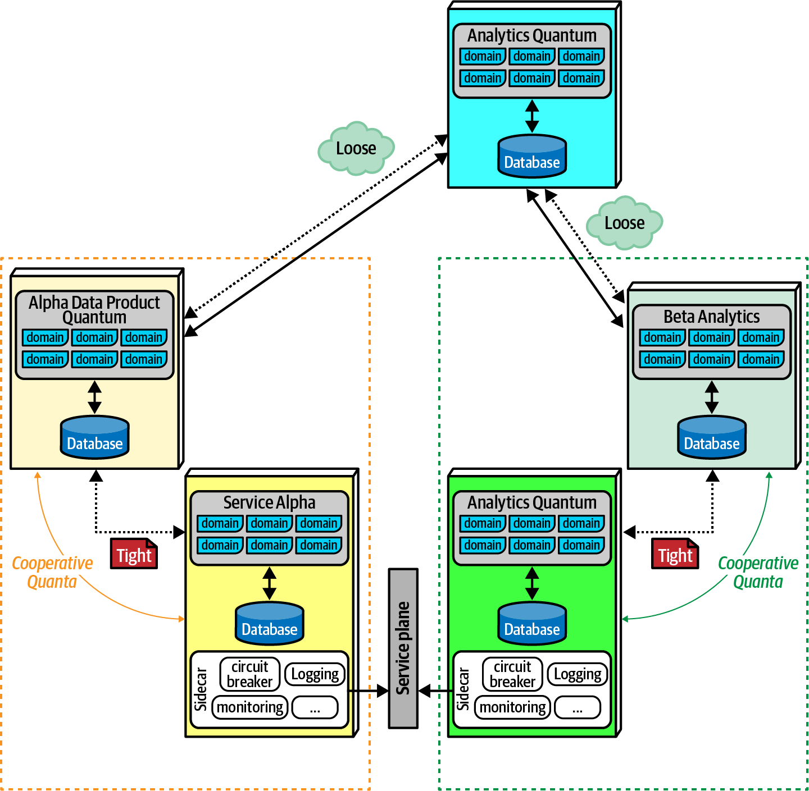
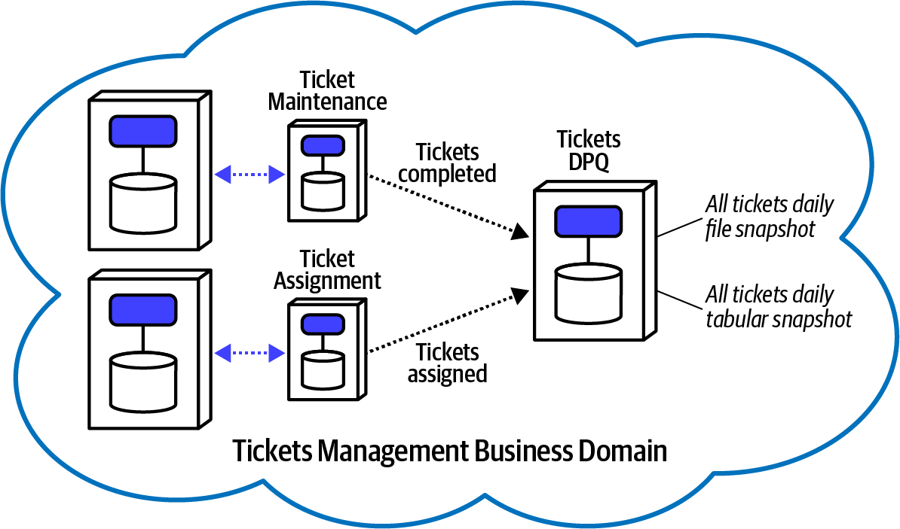
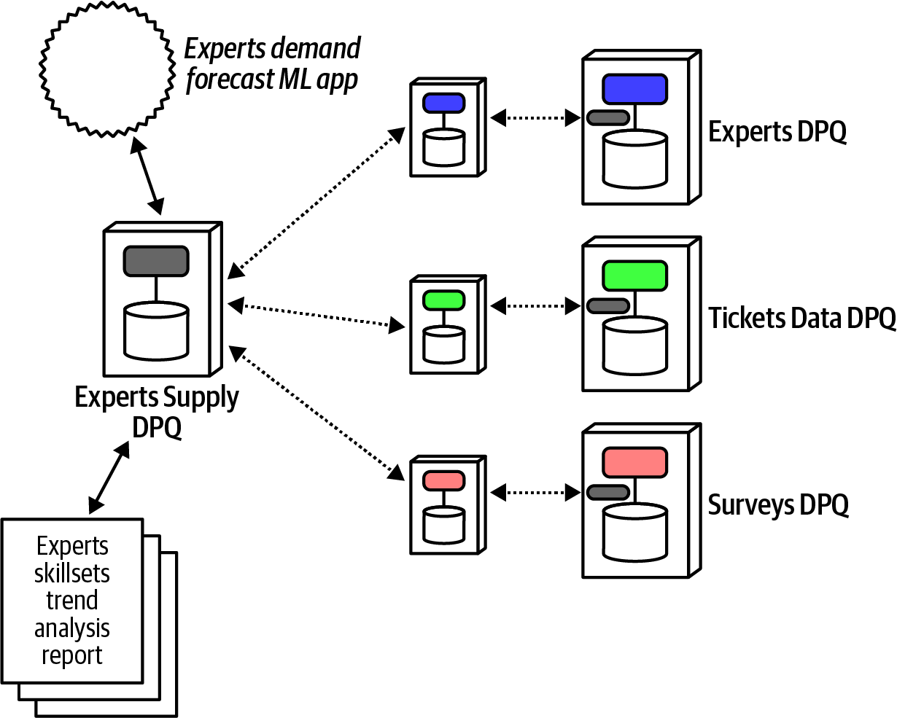

### Chapter 14: Managing Analytical Data - Summary

This chapter explores the evolution of architectural patterns for managing analytical data, contrasting traditional approaches with the modern **Data Mesh** pattern. It begins by outlining the historical context, explaining how the separation of operational and analytical data led to the development of the **Data Warehouse**. The chapter details the warehouse's characteristics, such as its ETL (Extract, Transform, Load) process and reliance on star schemas, and analyzes its significant drawbacks, including integration brittleness and the loss of domain context due to technical partitioning.

Next, it examines the **Data Lake** as a reaction to the data warehouse's rigidity. While the data lake offers more flexibility by shifting to an ELT (Extract, Load, Transform) model and storing raw data, it introduces new problems related to data discovery, governance (especially concerning PII), and still suffers from being a centralized, technically partitioned solution.

The core of the chapter introduces the **Data Mesh** as a modern, decentralized "sociotechnical" approach that aligns analytical data management with the principles of domain-driven design and distributed architectures. It is founded on four principles: **domain ownership**, **data as a product**, a **self-serve data platform**, and **computational federated governance**. The chapter details the key architectural element of the data mesh—the **Data Product Quantum (DPQ)**—a cooperative quantum that lives alongside a domain service to provide analytical data. Finally, the Sysops Squad saga illustrates a practical application of the Data Mesh, showing how the team designs a new DPQ to solve a predictive planning problem and captures the data quality requirements in an ADR.

---

### Previous Approaches

The split between operational and analytical data is a long-standing problem. As architectures evolved, so did the approaches to handling these different data needs.

#### The Data Warehouse

An early attempt to provide queryable analytical data, the Data Warehouse pattern involves extracting data from various operational sources, transforming it into a unified schema (often a Star Schema), and loading it into a massive, centralized data store for analysis.

##### Characteristics of the Data Warehouse Pattern:
*   **Data Extracted from many sources:** Data is pulled from individual operational databases.
*   **Transformed to single schema:** Data is transformed from various operational formats into a unified, denormalized schema (like a Star Schema) to simplify queries.
*   **Loaded into warehouse:** The transformed data is loaded into the central warehouse.
*   **Analysis done on the warehouse:** Heavy analytical queries are run against the warehouse, isolating operational systems from the load.
*   **Used by data analysts:** Specialized data analysts are required to build reports and business intelligence assets.
*   **BI reports and dashboards:** The output includes reports and dashboards to aid strategic decisions.
*   **SQL-ish interface:** Query tools typically provide a familiar SQL-like language.

##### The Star Schema
A popular dimensional modeling pattern that separates data into quantifiable **facts** (e.g., hourly rate, time to repair) and descriptive **dimensions** (e.g., squad member specialties, store locations). It is purposely denormalized to facilitate simpler, faster queries and aggregations.

##### Failings of the Data Warehouse
*   **Integration brittleness:** Changes to operational schemas require changes to the transformation logic, creating tight coupling.
*   **Extreme partitioning of domain knowledge:** Domain knowledge is lost in the transformation and must be recreated by specialists to build meaningful reports.
*   **Complexity:** A data warehouse is a separate, complex ecosystem that is highly coupled to operational systems.
*   **Limited functionality for intended purpose:** Often failed to deliver business value commensurate with the huge investment required.
*   **Synchronization creates bottlenecks:** The need to synchronize data from many sources creates operational and organizational bottlenecks.
*   **Operational versus analytical contract differences:** Introducing transformation in the ingestion pipeline creates contractual brittleness.

| Advantage                           | Disadvantage                                |
| ----------------------------------- | ------------------------------------------ |
| Centralized consolidation of data   | extreme partitioning of domain knowledge   |
| Dedicated analytics silo provides isolation | integration brittleness                  |
|                                     | Complexity                                 |
|                                     | Limited functionality for intended purpose |

#### The Data Lake

As a reaction to the complexity of the data warehouse, the Data Lake pattern inverts the model from "transform and load" to "load and transform." It keeps the centralized model but stores data in its raw, native format, shifting the burden of transformation to the consumer on an as-needed basis.

##### Characteristics of the Data Lake Pattern:
*   **Data Extracted from many sources:** Data is extracted from operational systems, often with less transformation.
*   **Loaded into the lake:** Data is stored in its "raw" or native form in a central repository (the lake).
*   **Used by data scientists:** Data consumers find the data and perform their own transformations to answer specific questions.

##### Limitations of the Data Lake
*   **Difficulty in discovery of proper assets:** Understanding data relationships is difficult as domain context is lost when data flows into the unstructured lake.
*   **PII and other sensitive data:** Dumping unstructured data risks exposing sensitive information that can be stitched together to violate privacy.
*   **Still technically, not domain partitioned:** Like the data warehouse, the data lake is partitioned by technical capability (ingestion, storage, serving) rather than by business domain, obscuring important domain context.

| Advantage                             | Disadvantage                              |
| ------------------------------------- | ------------------------------------------ |
| Less structured than data warehouse   | Sometimes difficult to understand relationships |
| Less up-front transformation          | Required ad-hoc transformations          |
| Better suited to distributed architectures |                                          |

---

### The Data Mesh

Data Mesh is a modern **sociotechnical** approach to managing analytical data in a decentralized fashion, aligning the architecture with business domains.

> **Definition:** Data Mesh is a sociotechnical approach to sharing, accessing and managing analytical data in a decentralized fashion. It satisfies a wide range of analytical use cases - such as reporting, ML model training, and generating insights. Contrary to the previous architecture, it does so by aligning the architecture and ownership of the data with the business domains and enabling a peer-to-peer consumption of data.

Data Mesh is founded on 4 principles:
1.  **Domain ownership of data:** Data is owned and shared by the domains most familiar with it.
2.  **Data as a Product:** Data is served as a product to delight consumers, preventing data siloing. This leads to a new architectural quantum, the **Data Product Quantum**.
3.  **Self-serve Data Platform:** A platform provides self-serve capabilities to empower domain teams to build and maintain their own data products.
4.  **Computational Federated Governance:** A federated model with automated, embedded policies ensures that organization-wide governance requirements (security, privacy, quality) are met consistently.

#### Data Product Quantum (DPQ)

The core architectural element of the data mesh. The DPQ is built adjacent but coupled to a service, acting as an interface for analytical data.

A DPQ is an operationally independent but highly coupled set of behaviors and data that serves the analytical needs of the system.

##### Types of DPQs:
*   **Source-aligned (native) DPQ:** Provides analytical data on behalf of its collaborating service.
*   **Aggregate DQP:** Aggregates data from multiple input DPQs.
*   **Fit-for-Purpose DPQ:** A custom DPQ built to serve a specific requirement (e.g., ML, BI).

##### Cooperative Quantum
A DPQ acts as a **cooperative quantum** for its service. It is operationally separate and communicates asynchronously with its cooperator, featuring tight contract coupling with the service but looser coupling to the wider analytical plane.

#### Data Mesh, Coupling, and Architecture Quantum

*   **Static Coupling:** The DPQ and its communication mechanism are part of the static coupling of an architecture quantum.
*   **Dynamic Coupling:** The communication between a service and its DPQ should always be asynchronous with eventual consistency (e.g., Parallel Saga or Anthology Saga) to minimize impact on operational characteristics.

#### When to Use Data Mesh

Data Mesh is most suitable for modern distributed architectures like microservices with well-isolated services. It is more difficult in architectures where analytical and operational data must remain in perfect sync.

| Advantage                                                      | Disadvantage                                              |
| -------------------------------------------------------------- | -------------------------------------------------------- |
| Highly suitable for microservices architectures                | Requires contract coordination with data product quantum |
| Follows modern architecture principles and engineering practices | requires asynchronous communication and eventual consistency |
| Allows excellent decoupling between analytical and operational data |                                                          |
| Carefully formed contracts allow loosely-coupled evolution of analytical capabilities |                                                          |

---

### Sysops Squad Saga: Data Mesh

*   **Problem:** The team needs to become more data-driven in planning for expert supply, which requires analyzing skill set demand in different locations over time. This requires aggregating data from multiple domains.
*   **Analysis:** They determine that the required data exists across three existing DPQs:
    1.  `Tickets DPQ`: Long-term view of all tickets.
    2.  `User Maintenance DPQ`: Daily snapshots of expert profiles.
    3.  `Survey DPQ`: Log of all customer survey results.
*   **Decision:** They decide to create a new **aggregate DPQ** called `Experts Supply DPQ`. This new quantum will take asynchronous inputs from the three source DPQs and use an ML model to generate daily supply recommendations.

*   **Risk:** The trend analysis is sensitive to incomplete data. Receiving partial data for a given day would skew the results more than receiving no data at all. This leads to a critical ADR.

*   **ADR: Ensure that Expert Supply DPQ sources supply an entire day’s data or none**
    *   **Context:** The Expert Supply DPQ performs trend analysis. Incomplete data for a particular day will skew trend results and should be avoided.
    *   **Decision:** We will ensure that each data source for the Expert Supply DPQ receives complete snapshots for daily trends or no data for that day, allowing data scientists to exempt that day. The contracts should be loosely coupled.
    *   **Consequences:** If too many days become exempt due to availability issues, the accuracy of trends will be negatively impacted.
    *   **Fitness functions:**
        *   **Complete daily snapshot:** Check timestamps on incoming messages. A gap of more than one minute indicates a processing issue, marking that day's data as exempt.
        *   **Consumer-driven contract fitness function for Ticket DPQ and Expert Supply DPQ:** To ensure that internal evolution of the Ticket Domain doesn’t break the Experts Supply DPQ.

---

### Actionable Tips from Chapter 14

> **1. Partition by Domain, Not by Technology.** Avoid the technical partitioning of data warehouses and data lakes, which separates data from its business context. Align your analytical data architecture with your business domains to preserve semantic meaning.

> **2. Treat Analytical Data as a First-Class Product.** Encourage domain teams to own their analytical data and serve it as a well-documented, discoverable, and trustworthy product. This shifts the mindset from data extraction to data sharing.

> **3. Empower Domains with a Self-Serve Platform.** Provide the tools and infrastructure that enable domain teams to easily build, deploy, and manage their own Data Product Quanta (DPQs) without needing a centralized data team.

> **4. Implement Federated Governance with Automation.** Establish a governance model composed of domain representatives to set global standards for security, privacy, and interoperability. Automate the enforcement of these policies by embedding them into every DPQ.

> **5. Use DPQs to Decouple Analytical and Operational Concerns.** The Data Product Quantum is a powerful pattern for creating a clean separation between operational data (in the service) and analytical data, allowing each to evolve independently.

> **6. Prefer Asynchronous Communication and Eventual Consistency.** Communication between a service and its DPQ should be asynchronous to protect the performance and availability of the operational service. Never create a transactional dependency between them.

> **7. Define Clear, Loosely Coupled Contracts.** The contracts between source DPQs and aggregate DPQs are critical. Use loose contracts to prevent brittleness, and govern them with fitness functions (like consumer-driven contracts) to ensure they don't break unexpectedly.

> **8. Use Fitness Functions to Guarantee Data Quality.** For analytics that depend on data completeness (like trend analysis), implement architectural fitness functions to verify data integrity and automatically handle or flag incomplete datasets.
