### Chapter 15: Build Your Own Trade-Off Analysis - Summary

This final chapter serves as a capstone, teaching architects how to apply the book's principles to create their own custom trade-off analyses tailored to their unique architectural contexts. It rejects the idea of generic, one-size-fits-all solutions and instead provides a practical, three-step process for modern trade-off analysis: **1) Find entangled dimensions**, **2) Analyze how they are coupled**, and **3) Assess trade-offs by determining the impact of change**.

The chapter provides concrete techniques for each step. It emphasizes the importance of identifying and modeling coupling points to understand an architecture's specific sensitivities. It demonstrates how to build a matrix of possibilities to compare patterns and discover non-obvious correlations, such as the inverse relationship between coupling and scalability.

Furthermore, the chapter offers a collection of hard-won advice on the practice of trade-off analysis. It advocates for **qualitative analysis** over often-impossible quantitative measures, introduces the **MECE (Mutually Exclusive, Combinatorially Exhaustive) List** as a tool for ensuring fair comparisons, and warns against the **"Out of Context" Trap**. It stresses the importance of modeling relevant domain scenarios to uncover the true trade-offs and advises architects to present a clear **"bottom line"** to stakeholders rather than overwhelming them with technical details. Finally, it cautions architects to avoid the pitfalls of **evangelism** and instead act as objective arbiters of trade-offs. The book concludes with the Sysops Squad epilogue, reinforcing the core message: disciplined, context-specific trade-off analysis, validated by testing, is the engineering rigor of software architecture.

---

### Three-Step Process for Modern Trade-Off Analysis

The book proposes a three-step process for conducting custom trade-off analysis.

1.  **Find what parts are entangled together:** Discover the unique dimensions that are braided together within a specific architecture.
2.  **Analyze how they are coupled to one another:** Determine how a change in one part of the architecture will force a change in another.
3.  **Assess trade-offs by determining the impact of change to interdependent systems:** Use the understanding of coupling to evaluate the pros and cons of different architectural decisions.

---

### Finding Entangled Dimensions

The first step is to discover which architectural dimensions are intertwined. This is unique to each ecosystem and requires experience.

#### Coupling
The core of the analysis is understanding coupling: if someone changes X, will it possibly force Y to change? Architects should build static coupling diagrams for their architecture quanta, detailing dependencies like:
*   Operating systems/container dependencies
*   Transitive dependencies (frameworks, libraries)
*   Persistence dependencies (databases, search engines)
*   Architecture integration points (e.g., service mesh)
*   Messaging infrastructure

This analysis reveals the forces that require trade-off analysis. For the book's analysis, the authors identified **communication, consistency, and coordination** as the key entangled dimensions in distributed architectures.

---

### Analyze Coupling Points

Once coupling points are identified, the next step is to model the possible combinations in a lightweight way to understand the forces at play. This allows the creation of ratings tables and comparative matrices.

**Table 15-1. Ratings for the Parallel Saga Pattern**

| Parallel Saga               | Ratings     |
| --------------------------- | ----------- |
| Communication               | Asynchronous|
| Consistency                 | Eventual    |
| Coordination                | Centralized |
| Coupling                    | Low         |
| Complexity                  | Low         |
| Responsiveness/availability | High        |
| Scale/elasticity            | High        |

By analyzing each pattern in isolation and then comparing them, important correlations can be discovered.

**Table 15-2. Consolidated comparison of dynamic coupling patterns**

| Pattern               | Coupling Level | Complexity | Responsiveness/availability | Scale/elasticity |
| --------------------- | -------------- | ---------- | --------------------------- | ---------------- |
| Epic Saga             | Very high      | Low        | Low                         | Very Low         |
| Phone Tag Saga        | High           | High       | Low                         | Low              |
| Fairy Tale Saga       | High           | Very low   | Medium                      | High             |
| Time Travel Saga      | Medium         | Low        | Medium                      | High             |
| Fantasy Fiction Saga  | High           | High       | Low                         | Low              |
| Horror Story          | Medium         | Very high  | Low                         | Medium           |
| Parallel Saga         | Low            | Low        | High                        | High             |
| Anthology Saga        | Very low       | High       | High                        | Very high        |

This analysis revealed two key observations:
1.  There is a direct inverse correlation between **coupling level** and **scale/elasticity**.
2.  Higher **coupling** generally leads to lower **responsiveness/availability**.

This iterative process of building a matrix and modeling possibilities is key to understanding the nuanced impacts of architectural decisions.

---

### Assess Trade-Offs

With the analysis in place, architects can focus on the fundamental trade-offs. By fixing one dimension (e.g., choosing asynchronous communication), subsequent choices become limited, simplifying the decision-making process. What’s left after the hard, entangled decisions are made is design.

---

### Trade-Off Techniques

The authors offer several pieces of advice for performing trade-off analysis.

#### Qualitative versus Quantitative Analysis
True quantitative comparisons between architectures are rarely possible. Architects should hone the skill of performing **qualitative analysis**—measuring the quality of something rather than its quantity—based on representative examples and localized tests.

#### MECE Lists
A **MECE (Mutually Exclusive, Combinatorially Exhaustive) List** is a tool for ensuring that comparisons are fair and complete.
*   **Mutually Exclusive:** The items being compared do not have overlapping capabilities (e.g., don't compare a simple message queue to an entire ESB).
*   **Combinatorially Exhaustive:** All relevant possibilities in the decision space have been considered.

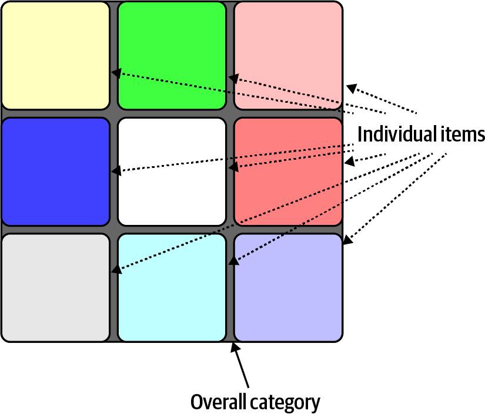

#### The “Out of Context” Trap
Architects must keep decisions in their proper context. A solution that looks superior in a generic analysis might be the wrong choice once specific, real-world constraints are applied. Finding the correct, narrow context for a decision simplifies the process by reducing the number of options to consider.

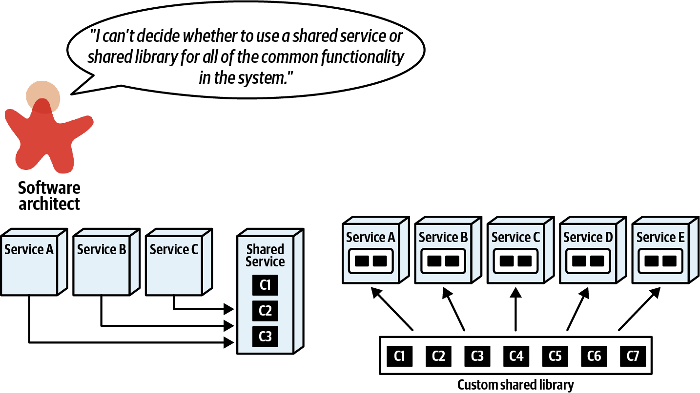
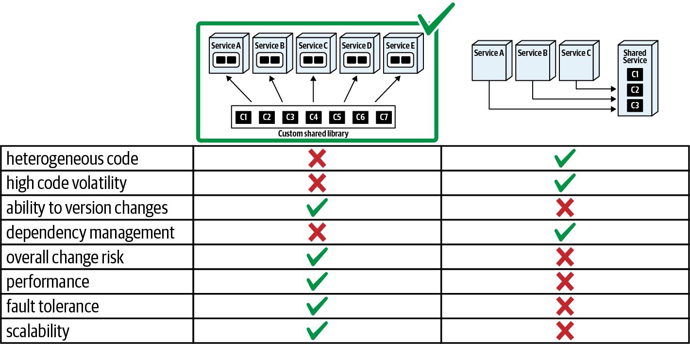
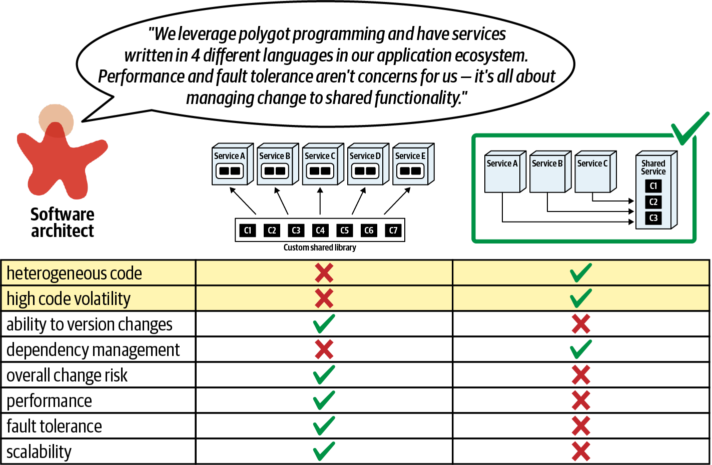

#### Model Relevant Domain Cases
Abstract analysis only goes so far. Architects should model specific, relevant domain scenarios to uncover the real trade-offs hidden in complex workflows. For example, when deciding between a single payment service and multiple services, modeling a complex workflow that uses multiple payment types reveals the trade-off between performance (single service) and extensibility (separate services).

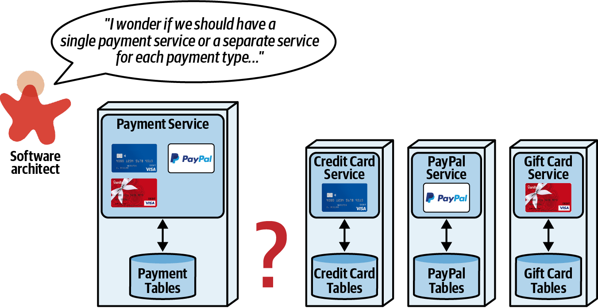
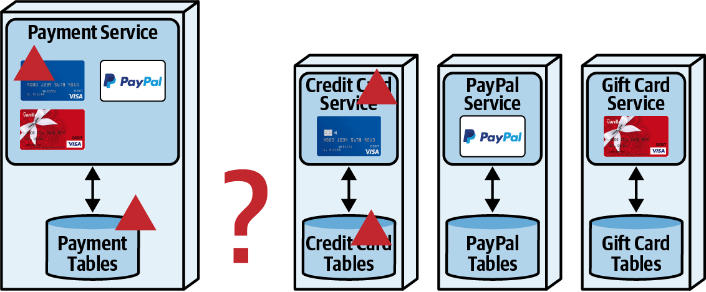
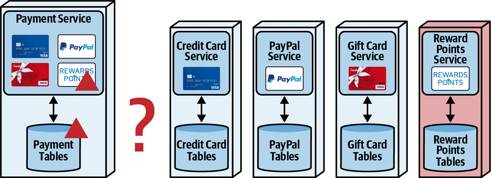
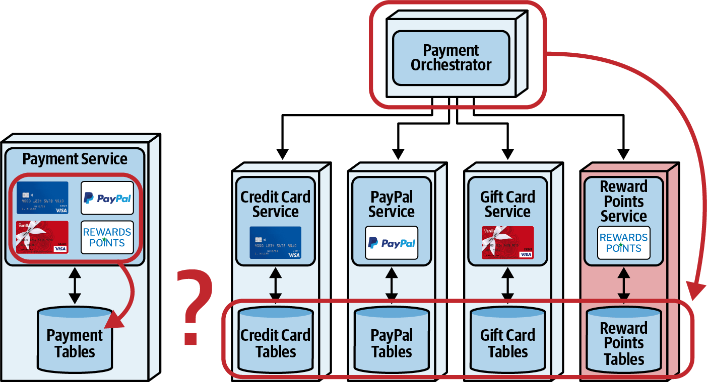

#### Prefer Bottom Line over Overwhelming Evidence
Avoid drowning non-technical stakeholders in a sea of technical details. Reduce the complex analysis to a few key points and a clear "bottom line" decision that focuses on business outcomes.

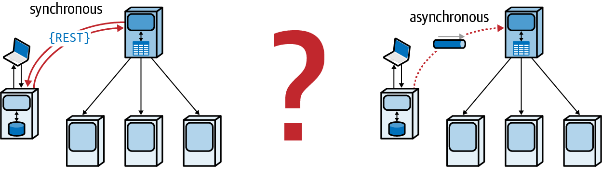

For a choice between synchronous and asynchronous communication, the bottom line for stakeholders is: *which is more important, a guarantee that a process starts immediately, or responsiveness and fault-tolerance?*

**Table 15-3. Trade-offs between synchronous and asynchronous communication for credit card processing.**

| Synchronous advantage                                           | Synchronous disadvantage                                  | Asynchronous advantage                              | Asynchronous disadvantage                 |
| --------------------------------------------------------------- | --------------------------------------------------------- | --------------------------------------------------- | ----------------------------------------- |
| Credit approval is guaranteed to start before customer request ends | Customer must wait for credit card approval process to start | No wait for process to start                        | No guarantee that the process has started |
|                                                                 | Customer application rejected if orchestrator is down     | Application submission not dependent on orchestrator |                                           |

#### Avoiding Snake Oil and Evangelism
Architects should be objective arbiters of trade-offs, not evangelists for a particular tool or technique. Be wary of any solution that promises to be all good with no downsides. Use scenario analysis to cut through the hype and uncover the real trade-offs.

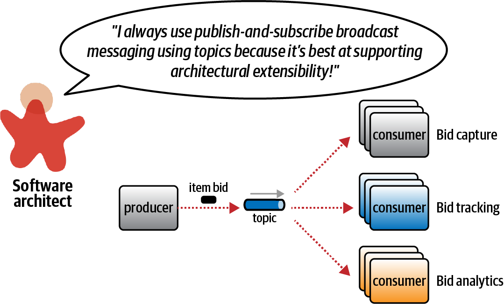

When faced with a decision like using a single topic vs. individual queues, modeling the scenarios reveals the deeper trade-offs related to contracts, security, and operational coupling.

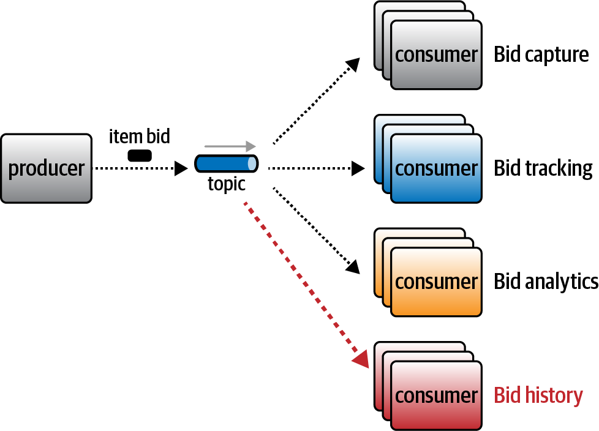
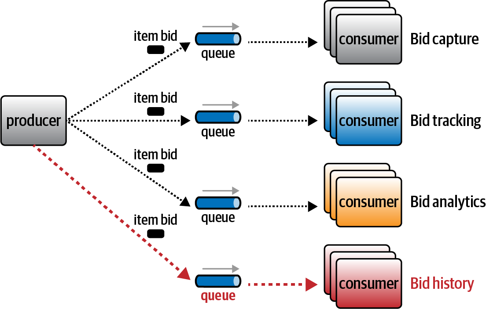

**Table 15-4. Trade-offs between Point-to-Point versus Publish-and-Subscribe Messaging**

| Point-to-Point                                 | Publish-and-Subscribe                     |
| ---------------------------------------------- | ----------------------------------------- |
| Allows heterogeneous contracts                 | Extensibility (easy to add new consumers) |
| More granular security access and data control |                                           |
| Individual operational profiles per consumer   |                                           |

> **Forced evangelism:** Don’t allow others to force you into evangelizing something—bring it back to trade-offs.

---

### Sysops Squad Saga: Epilog

The final saga reinforces the book's central theme. The team recognizes that generic advice is insufficient. The real advantage comes from learning how to perform trade-off analysis on their own specific architecture. By modeling and, critically, **testing** their solutions, they can turn qualitative speculation into quantitative engineering.

> I’ve always said that **Testing is the engineering rigor of software development**. While we don’t have the kind of math other engineers have, we can incrementally build and test our solutions... Testing with objective outcomes allows our trade-off analyses to go from qualitative to quantitative—from speculation to engineering.

---

### Actionable Tips from Chapter 15

> **1. Build Your Own Analysis; Don't Rely on Generic Advice.** The most valuable insights come from analyzing the unique entangled dimensions and coupling points of your own architecture, not from applying generic rules.

> **2. Use a Matrix to Analyze and Compare Possibilities.** When evaluating different patterns or solutions, build a matrix to compare them across key characteristics (e.g., coupling, complexity, scalability). This helps reveal non-obvious correlations and clarifies trade-offs.

> **3. Find the Right Context to Simplify Decisions.** Avoid the "out of context" trap. By identifying the specific, narrow business and technical context for a decision, you can eliminate irrelevant options and focus on the trade-offs that truly matter.

> **4. Model Real Domain Scenarios to Uncover Hidden Trade-offs.** Abstract analysis is not enough. Diagram complex, real-world workflows to see how different architectural choices behave under stress. The "happy path" is easy; the difficult trade-offs are revealed in error handling and complex scenarios.

> **5. Present the "Bottom Line" to Stakeholders.** Translate your complex technical analysis into a clear, concise decision point focused on business outcomes. Frame the choice for non-technical stakeholders in terms of the trade-offs they care about (e.g., "guaranteed start vs. higher availability").

> **6. Be an Arbiter, Not an Evangelist.** Resist the temptation to find a "silver bullet." Your value as an architect lies in your ability to be an objective, trusted arbiter of trade-offs, not in evangelizing your favorite technology. Use scenario analysis to challenge assumptions and force an honest assessment.

> **7. Don't Let Others Force You into Evangelism.** When pressured to take a side in a technology debate, reframe the discussion around the specific, real-world trade-offs for your context. Propose gathering metrics and building fitness functions to make the decision based on evidence, not opinion.

> **8. Turn Qualitative Analysis into Quantitative Engineering with Testing.** The ultimate way to validate your trade-off analysis is to build and test your solutions. Use testing and fitness functions to get objective, quantitative data about your ecosystem, turning architectural speculation into engineering fact.
