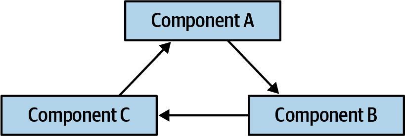
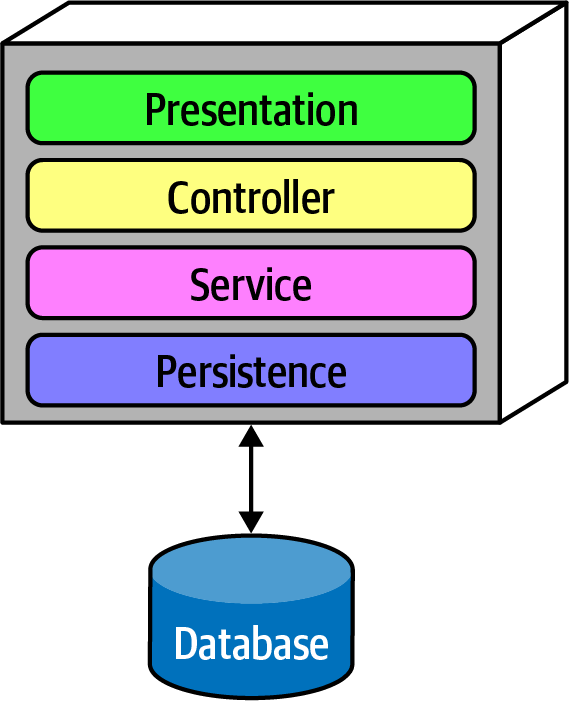
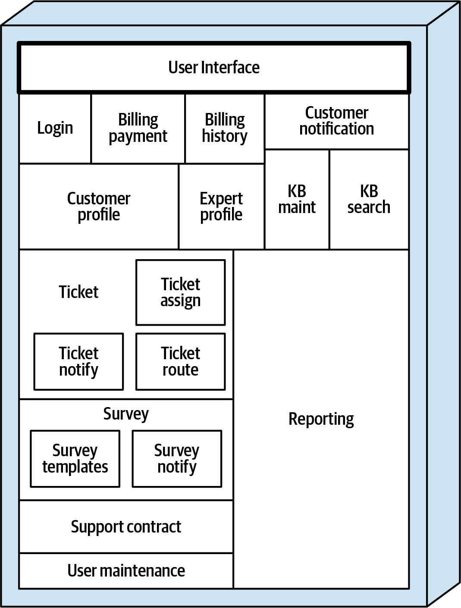
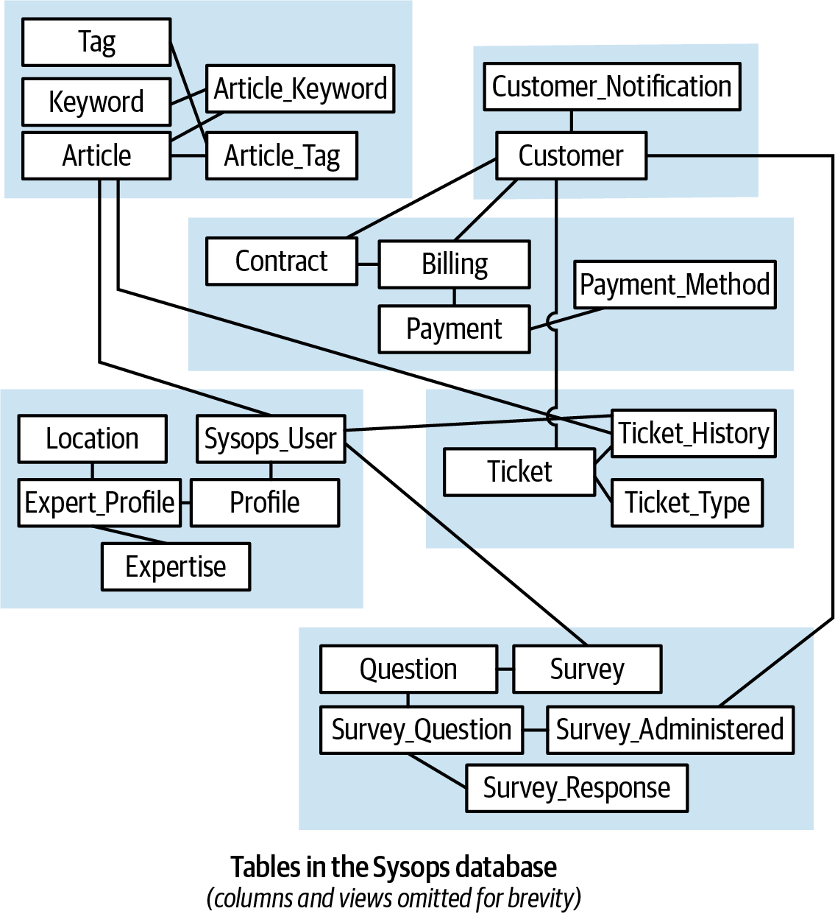

### Chapter 1: What Happens When There Are No “Best Practices”? - Summary

This introductory chapter sets the stage for the book's core thesis: software architecture is not about finding "best practices" or silver-bullet solutions, but about the difficult, nuanced work of **analyzing and balancing trade-offs**. Many architectural problems are unique "snowflakes" with no pre-existing answers. The goal is not to find the *best* design, but the **"least worst"** combination of competing architectural characteristics. The chapter introduces two critical tools for modern architects: **Architecture Decision Records (ADRs)** for documenting choices and their consequences, and **Architecture Fitness Functions** for automating architectural governance and preventing structural decay. It also draws a crucial distinction between operational and analytical data, highlighting the tension between data and architecture as a central theme. Finally, it introduces the **Sysops Squad Saga**, a running case study of a legacy monolithic application that needs to be modernized, which will be used to illustrate the book's concepts in a practical context.

---

### The Architect's Dilemma: No "Best Practices"

Unlike many development problems with searchable solutions, architects constantly face novel situations where no clear "best practice" exists. Every significant decision involves a complex set of trade-offs unique to the organization's context, technology, and goals.

*   **The "Least Worst" Principle:** Don't strive for a perfect design that maximizes every "-ility" (scalability, performance, security, etc.). This is impossible. Instead, aim for the *least worst* combination of trade-offs, where a balanced design promotes the overall success of the project, even if no single characteristic excels.
*   **Why "The Hard Parts":** The title has a double meaning:
    1.  **Difficult:** Architects face difficult, often unprecedented problems.
    2.  **Solid/Foundational:** Architecture is the "hard," structural part of a system that is difficult to change later, providing the foundation for the "soft" implementation details.
*   **Timeless Advice:** The software ecosystem evolves unpredictably (e.g., the shift from SOA to microservices). This book focuses on the timeless skill of architectural decision-making and trade-off analysis, rather than on specific technologies that will quickly become dated.

---

### The Importance of Data in Architecture

Data is a company's most durable asset, often outliving the systems and architectures that create it. Many of the "hard parts" of modern distributed architecture arise from the tension between architectural goals (like service independence) and data concerns (like consistency and integrity).

*   **Operational Data (OLTP):** Online Transactional Processing data is what the company *runs on*. It includes sales, inventory, and customer transactions. It's typically relational and must be highly available and consistent. If this data is interrupted, the business stops.
*   **Analytical Data:** Data used by business analysts and data scientists for trending, predictions, and business intelligence. It is not critical for moment-to-moment operations but for long-term strategic decisions. It's often non-relational and can exist in different formats (e.g., graph databases, data lakes).

---

### Documenting Decisions: Architecture Decision Records (ADRs)

ADRs are a simple, effective way to document significant architectural decisions. They are short text files that capture the context, the decision made, and the consequences of that choice.

The book uses the following ADR format:

*   **ADR:** A short noun phrase containing the architecture decision.
*   **Context:** A one or two-sentence description of the problem and a list of the alternative solutions considered.
*   **Decision:** A statement of the chosen solution and a detailed justification.
*   **Consequences:** A description of the outcome after the decision is applied, including a discussion of the trade-offs that were weighed.

---

### Automated Governance: Architecture Fitness Functions

How do architects ensure their designs and principles are actually followed during implementation? The answer is **Architecture Fitness Functions**, which automate architectural governance.

*   **Definition:** "Any mechanism that performs an objective integrity assessment of some architecture characteristic or combination of architecture characteristics."
*   **Key Aspects:**
    *   **Objective:** Fitness functions must test against objective, measurable values (e.g., "response time < 100ms"), not vague goals ("high performance").
    *   **Atomic vs. Holistic:** They can be **atomic** (testing one characteristic, like code cycles) or **holistic** (testing a combination, like how a security change impacts performance).
    *   **Architecture vs. Domain:** Fitness functions validate *architectural* concerns (modularity, layers, performance) and generally don't require domain knowledge. Unit tests validate *domain* logic (e.g., a mailing address format).

#### Fitness Function Examples

1.  **Preventing Component Cycles:** A common goal is to prevent cyclic dependencies between components, which destroys modularity. A fitness function can automate this check.

    

    ```java
    // Example 1-1: A fitness function using JDepend to detect cycles between packages.
    public class CycleTest {
        private JDepend jdepend;

        @BeforeEach
        void init() {
          jdepend = new JDepend();
          jdepend.addDirectory("/path/to/project/persistence/classes");
          jdepend.addDirectory("/path/to/project/web/classes");
          jdepend.addDirectory("/path/to/project/thirdpartyjars");
        }

        @Test
        void testAllPackages() {
          Collection packages = jdepend.analyze();
          assertEquals("Cycles exist", false, jdepend.containsCycles());
        }
    }
    ```

2.  **Enforcing Layered Architecture:** An architect can define the allowed communication paths between layers and enforce them with a fitness function. ArchUnit is useful library here

    

    ```java
    // Example 1-2: An ArchUnit fitness function to govern layer dependencies in Java.
    layeredArchitecture()
        .layer("Controller").definedBy("..controller..")
        .layer("Service").definedBy("..service..")
        .layer("Persistence").definedBy("..persistence..")

        .whereLayer("Controller").mayNotBeAccessedByAnyLayer()
        .whereLayer("Service").mayOnlyBeAccessedByLayers("Controller")
        .whereLayer("Persistence").mayOnlyBeAccessedByLayers("Service")
    ```
    ```csharp
    // Example 1-3: A NetArchTest fitness function for layer dependencies in .NET.
    // Classes in the presentation should not directly reference repositories
    var result = Types.InCurrentDomain()
        .That()
        .ResideInNamespace("NetArchTest.SampleLibrary.Presentation")
        .ShouldNot()
        .HaveDependencyOn("NetArchTest.SampleLibrary.Data")
        .GetResult()
        .IsSuccessful;
    ```

*   **Real-World Impact (Equifax Breach):** The Equifax data breach was caused by a known vulnerability in the Struts framework. If Equifax had used fitness functions in a continuous deployment pipeline, the security team could have inserted a simple test to check for the vulnerable library version, failing the build on every affected project and providing immediate, enterprise-wide feedback.

---

### Introducing the Sysops Squad Saga

To ground the abstract concepts, the book uses a running saga about modernizing a legacy system for **Penultimate Electronics**.

*   **The Business:** Customers buy support plans for their electronics. When a problem occurs, a "Sysops Squad" expert is dispatched to fix it.
*   **The Problem:** The current system is a large, unreliable monolith. Tickets are lost, the wrong experts are sent, and the system is frequently unavailable. Changes are slow and risky.
*   **The Goal:** Evolve the architecture to solve these problems without disrupting the lucrative support business.

#### Sysops Squad Architectural Components

The existing monolith is composed of several tightly coupled components.



| Component             | Namespace                | Responsibility                                    |
| --------------------- | ------------------------ | ------------------------------------------------- |
| Login                 | `ss.login`               | Internal user and customer login and security logic |
| Billing Payment       | `ss.billing.payment`     | Customer monthly billing and credit card info     |
| Billing History       | `ss.billing.history`     | Payment history and prior billing statements      |
| Customer Notification | `ss.customer.notification` | Notify customer of billing, general info          |
| Customer Profile      | `ss.customer.profile`    | Maintain customer profile, customer registration  |
| Expert Profile        | `ss.expert.profile`      | Maintain expert profile (name, location, skills)  |
| KB Maint              | `ss.kb.maintenance`      | Maintain and view items in the knowledge base     |
| KB Search             | `ss.kb.search`           | Query engine for searching the knowledge base     |
| Reporting             | `ss.reporting`           | All reporting (experts, tickets, financial)       |
| Ticket                | `ss.ticket`              | Ticket creation, maintenance, completion          |
| Ticket Assign         | `ss.ticket.assign`       | Find an expert and assign the ticket              |
| Ticket Notify         | `ss.ticket.notify`       | Notify customer that the expert is on their way   |
| Ticket Route          | `ss.ticket.route`        | Sends the ticket to the expert's mobile device    |
| Support Contract      | `ss.supportcontract`     | Support contracts for customers, products in plan |
| Survey                | `ss.survey`              | Maintain surveys, capture and record results      |
| Survey Notify         | `ss.survey.notify`       | Send survey email to customer                     |
| Survey Templates      | `ss.survey.templates`    | Maintain various surveys based on service type    |
| User Maintenance      | `ss.users`               | Maintain internal users and roles                 |

#### Sysops Squad Data Model

All components share a single, third-normal-form database schema.



---

### Actionable Tips from Chapter 1

> **1. Embrace Trade-Offs, Don't Seek "Best Practices".** Your primary job as an architect is to analyze the trade-offs between competing concerns and find the least worst balance for your specific context.
>
> **2. Document Your Decisions with ADRs.** Use a lightweight format like an ADR to record what you decided, why you decided it, and what the consequences are. This creates an invaluable historical record for the team. Here is repo for ADRs: https://adr.github.io/
>
> **3. Automate Your Architecture with Fitness Functions.** Don't let your architectural principles live only in diagrams. Codify them as executable fitness functions that run as part of your continuous integration build. This prevents architectural drift and technical debt.
>
> **4. Treat Data as a First-Class Architectural Concern.** Data lasts longer than code. Understand the difference between operational (OLTP) and analytical data, and recognize that many hard architectural problems stem from managing data in a distributed environment.
>
> **5. Use Fitness Functions as an Executable Checklist.** Like pilots and surgeons, architects can use fitness functions as a checklist to ensure important-but-not-urgent principles (like modularity and code quality) are not skipped under pressure.
