### Chapter 2: Discerning Coupling in Software Architecture - Summary

This chapter introduces a foundational framework for analyzing the difficult trade-offs in distributed architectures. It argues that generic advice like "embrace decoupling" is insufficient because architectural problems are **entangled**, with multiple competing forces that are hard to analyze independently. The chapter's central innovation is the concept of the **Architecture Quantum**, defined as an independently deployable artifact with high functional cohesion. The quantum is the primary unit of architectural analysis.

The chapter then untangles coupling into two distinct types:
1.  **Static Coupling:** The "wiring" of an architecture quantum—all the components and dependencies (frameworks, libraries, databases, message brokers) required for it to bootstrap and operate. Shared dependencies, particularly a monolithic database, are powerful static coupling points that merge multiple services into a single, large quantum.
2.  **Dynamic Coupling:** How architecture quanta communicate at runtime. This is a three-dimensional problem space involving **Communication** (synchronous vs. asynchronous), **Consistency** (atomic vs. eventual), and **Coordination** (orchestration vs. choreography). A synchronous call, for example, creates strong dynamic coupling that temporarily entangles the operational characteristics (like performance and scalability) of two otherwise independent quanta.

The chapter's main goal is to provide architects with the terminology and perspective needed to dissect complex problems, analyze their constituent parts, and make informed, trade-off-based decisions.

---

### The Entanglement Problem

Architectural problems are like a braid: multiple concerns are woven together, making it hard to see and analyze the individual strands. Before an architect can perform a trade-off analysis, they must first untangle these concerns.

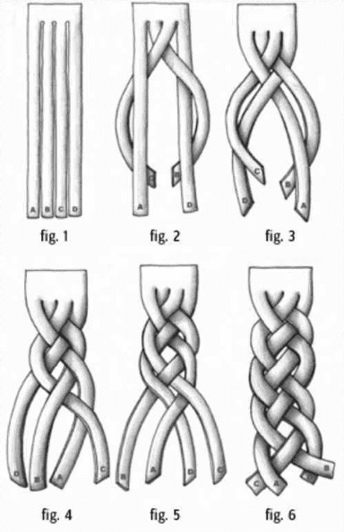

The proposed framework for analysis is:
1.  **Find** what parts are entangled together.
2.  **Analyze** how they are coupled to one another.
3.  **Assess** trade-offs by determining the impact of change to these interdependent parts.

---

### Architecture Quantum

To analyze coupling, we need a unit of measure. The book defines this as the **Architecture Quantum**.

> **Architecture Quantum:** An independently deployable artifact with high functional cohesion, high static coupling, and synchronous dynamic coupling.

A key purpose of the quantum is to define the scope of architecture characteristics. For example, a single quantum has a single, unified set of operational characteristics (scalability, reliability, performance, etc.).

---

### Static Coupling: The "Wiring"

Static coupling concerns all the dependencies an architecture quantum needs to simply operate. It's about how things are wired together at a component and infrastructure level. Answering the question, "What is all the wiring required to bootstrap this service from scratch?" reveals its static coupling.

The number of quanta in an architecture is determined by its static coupling points.

*   **Monolithic Architectures (Quantum = 1):** Any architecture that is deployed as a single unit and/or relies on a single database will always have a quantum of one. The shared database is a powerful static coupling point.

    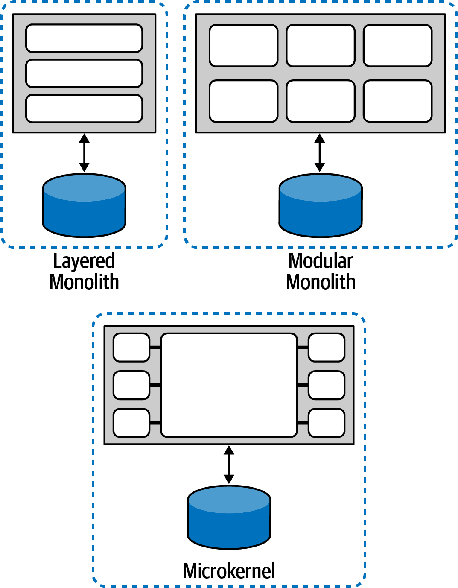

*   **Service-Based Architectures (Quantum = 1):** This hybrid style has separately deployed services but still uses a monolithic database, making it a single quantum.

    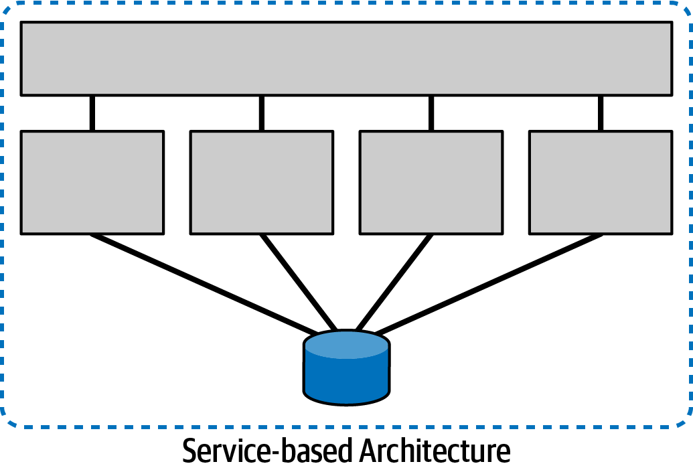

*   **Mediated Event-Driven Architectures (Quantum = 1):** Even if services are distributed, a central mediator (like an orchestrator) and a shared database act as static coupling points, resulting in a single quantum.

    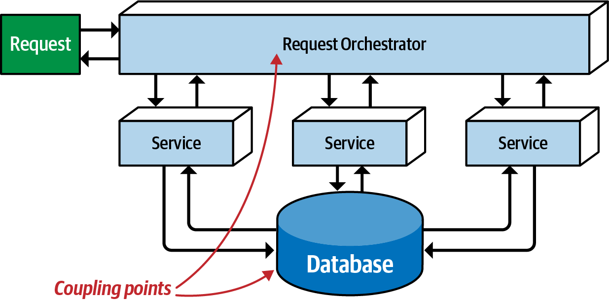

*   **Broker Event-Driven Architectures:** A broker-style EDA *can* have a single quantum if all services share a database (Figure 2-5). However, if services have their own data stores and no other static dependencies, the architecture can have multiple quanta (Figure 2-6).

    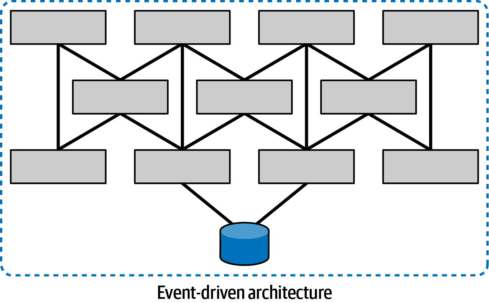

    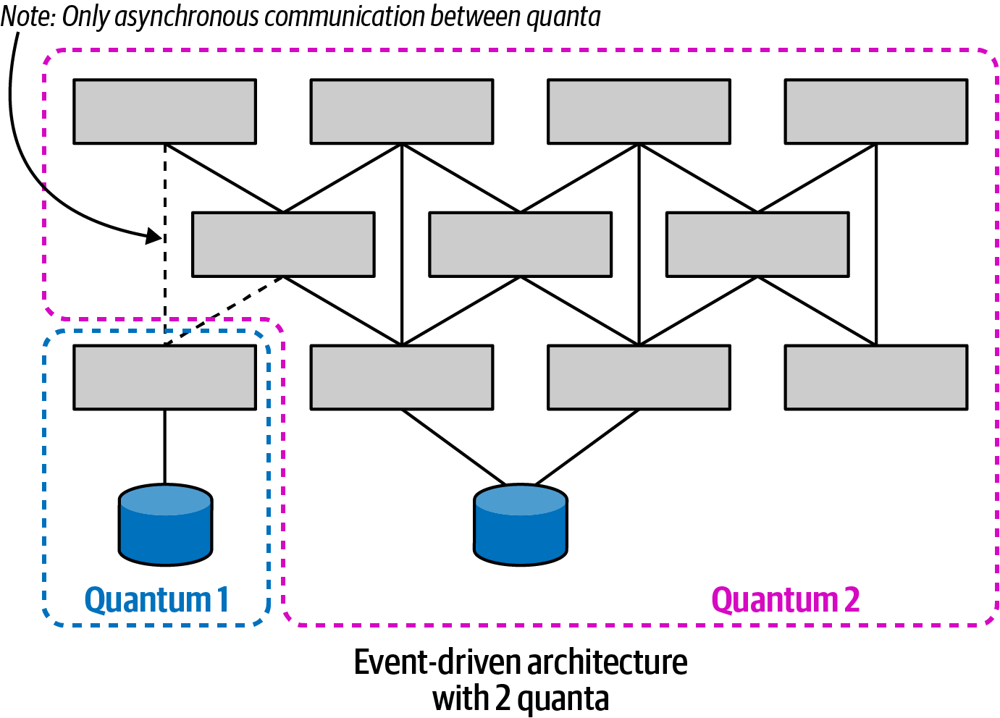

*   **Microservices Architectures:** The goal of microservices is high decoupling, allowing each service to be its own quantum (Figure 2-7). This allows each service to have its own, independent architectural characteristics (e.g., one service can be more scalable than another).

    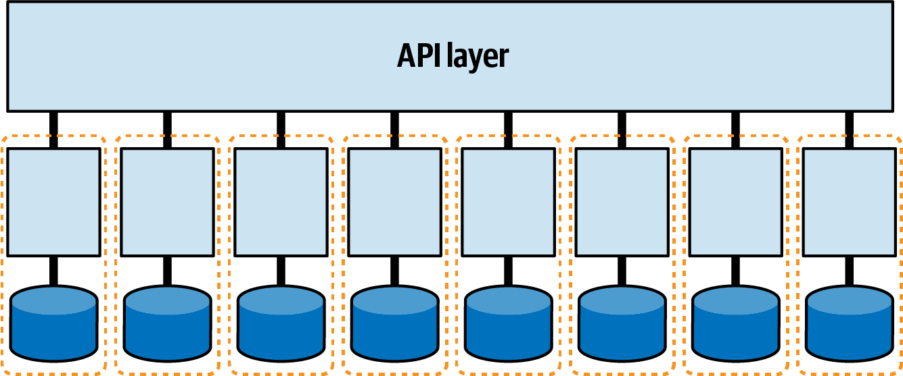

*   **The User Interface as a Coupling Point:** A traditional, tightly-coupled monolithic UI that communicates with all backend services forces the entire system into a single quantum (Figure 2-8). However, using a **micro-frontends** approach, where each service emits its own UI components onto a shared canvas, allows each service and its corresponding UI piece to form an independent quantum (Figure 2-9).

    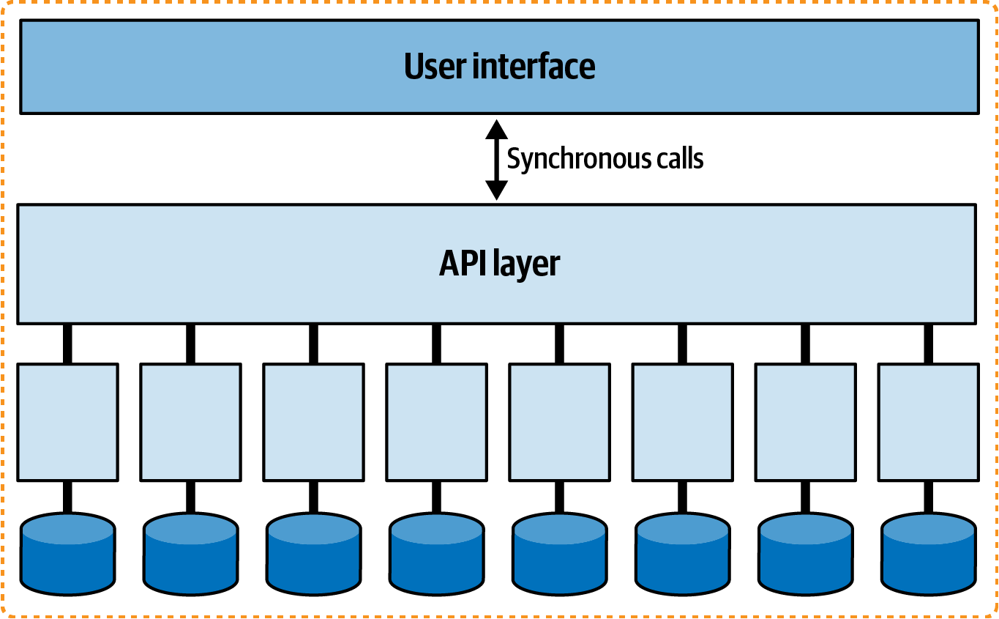

    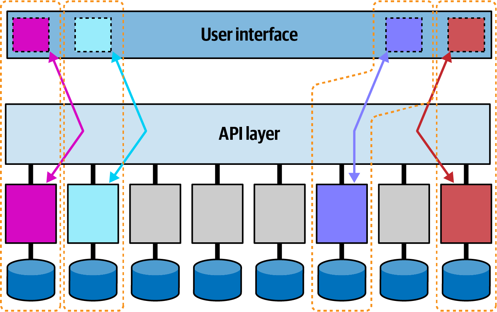

*   **Integration Databases:** A shared database used to integrate two otherwise separate systems statically couples them into a single, large architecture quantum.

    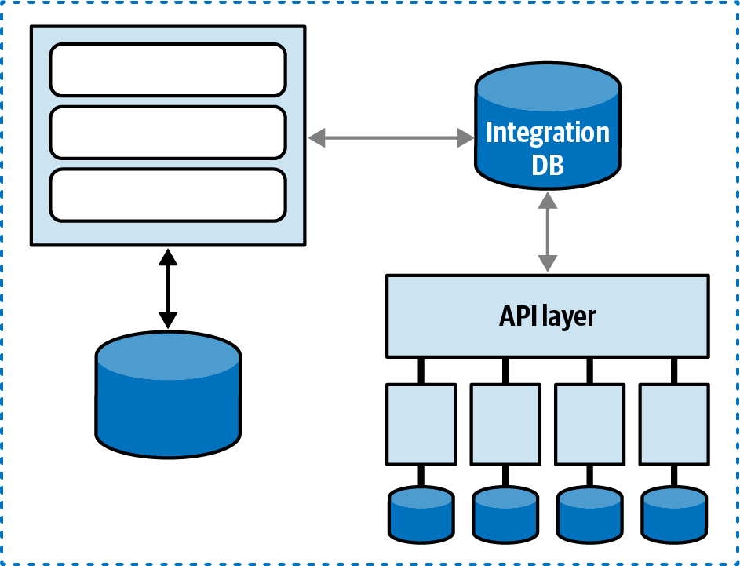

---

### Dynamic Coupling: Runtime Communication

Dynamic coupling concerns how architecture quanta interact with each other at runtime to perform a workflow. It is a multi-dimensional problem space.

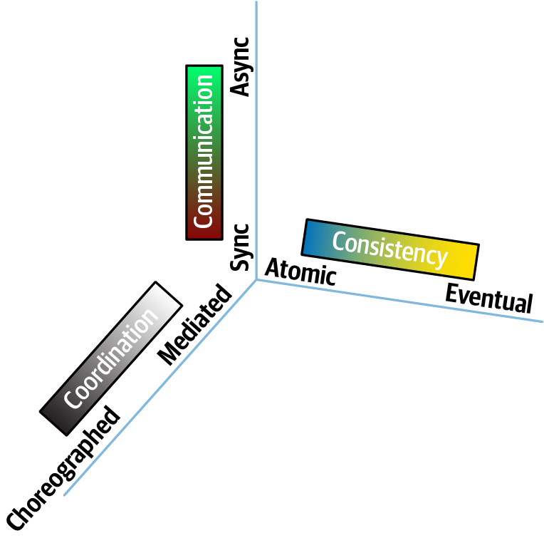

#### The Three Dimensions of Dynamic Coupling

1.  **Communication:** The synchronicity of the connection.
    *   **Synchronous:** The caller makes a request and blocks, waiting for a response. This creates tight dynamic coupling, temporarily entangling the operational characteristics (performance, availability) of the two quanta.
        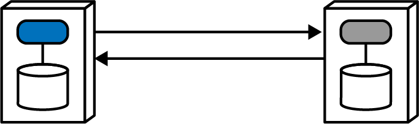
    *   **Asynchronous:** The caller sends a message (e.g., to a queue) and continues its work without waiting. This decouples the quanta, allowing them to operate independently.
        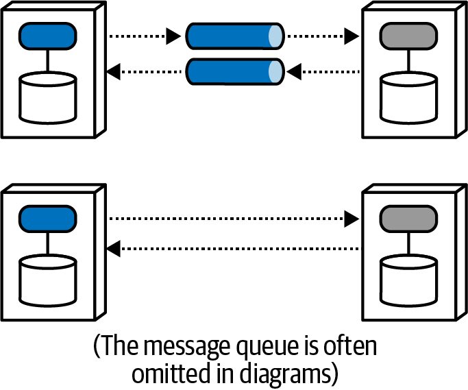

2.  **Consistency:** The transactional integrity required.
    *   **Atomic:** All-or-nothing consistency, where all participants in a workflow must succeed or fail together. This is very difficult in distributed systems.
    *   **Eventual Consistency:** The system will become consistent at some point in the future, but temporary inconsistencies are allowed.

3.  **Coordination:** How the workflow is managed.
    *   **Orchestration:** A central service (the orchestrator) is responsible for coordinating the workflow steps.
    *   **Choreography:** Services coordinate amongst themselves, typically by reacting to each other's events, with no central coordinator.

#### The Matrix of Dynamic Coupling Patterns

The intersections of these three dimensions define a set of fundamental architectural patterns, each with a different level of overall coupling.

| Pattern Name          | Communication | Consistency | Coordination | Coupling  |
| --------------------- | ------------- | ----------- | ------------ | --------- |
| **Epic Saga**         | synchronous   | atomic      | centralized  | Very high |
| **Phone Tag Saga**    | synchronous   | atomic      | distributed  | High      |
| **Fairy Tale Saga**   | synchronous   | eventual    | centralized  | High      |
| **Time Travel Saga**  | synchronous   | eventual    | distributed  | Medium    |
| **Fantasy Fiction Story** | asynchronous  | atomic      | centralized  | High      |
| **Horror Story**      | asynchronous  | atomic      | distributed  | Medium    |
| **Parallel Saga**     | asynchronous  | eventual    | centralized  | Low       |
| **Anthology Saga**    | asynchronous  | eventual    | distributed  | Very low  |

---

### Actionable Tips from Chapter 2

> **1. Untangle Architectural Problems Before Analyzing Them.** Deconstruct complex problems into their constituent parts. For distributed workflows, those parts are Communication (sync/async), Consistency (atomic/eventual), and Coordination (orchestration/choreography).
>
> **2. Use the Architecture Quantum as Your Unit of Analysis.** Identify the quanta in your system. A quantum defines the scope of architectural characteristics. Everything inside a single quantum shares the same scalability, reliability, and performance profile.
>
> **3. Identify Static Coupling Points to Define Quanta.** The number of quanta in your architecture is determined by your static coupling points. Be ruthless in identifying them, especially shared databases, monolithic UIs, and central mediators.
>
> **4. Understand That Synchronous Calls Create Temporary Entanglement.** When one quantum makes a synchronous call to another, their operational characteristics become temporarily coupled. The performance of the caller is now limited by the performance of the callee.
>
> **5. Use Asynchronous Communication to Preserve Quantum Independence.** Asynchronous messaging acts as a buffer or shock absorber between quanta, allowing them to operate and scale independently, preserving their individual architectural characteristics.
>
> **6. Map Your Workflows to the Dynamic Coupling Matrix.** Use the matrix of eight patterns to understand the inherent coupling level of a proposed design. If you need low coupling, you must move towards asynchronous, eventually consistent, and choreographed solutions.

