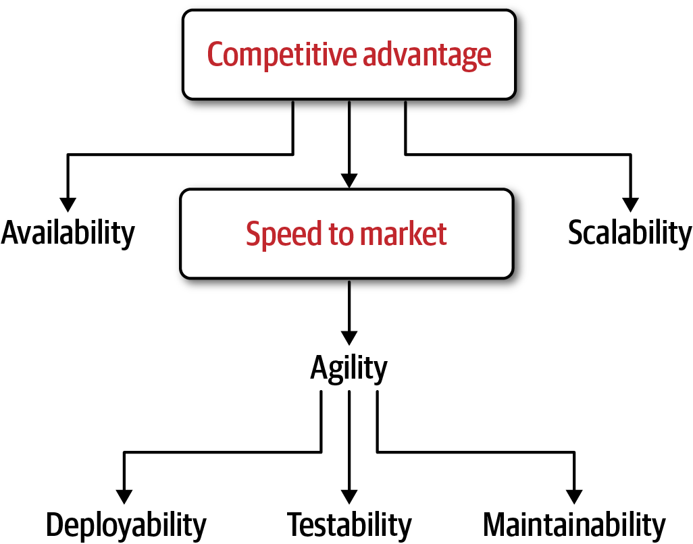
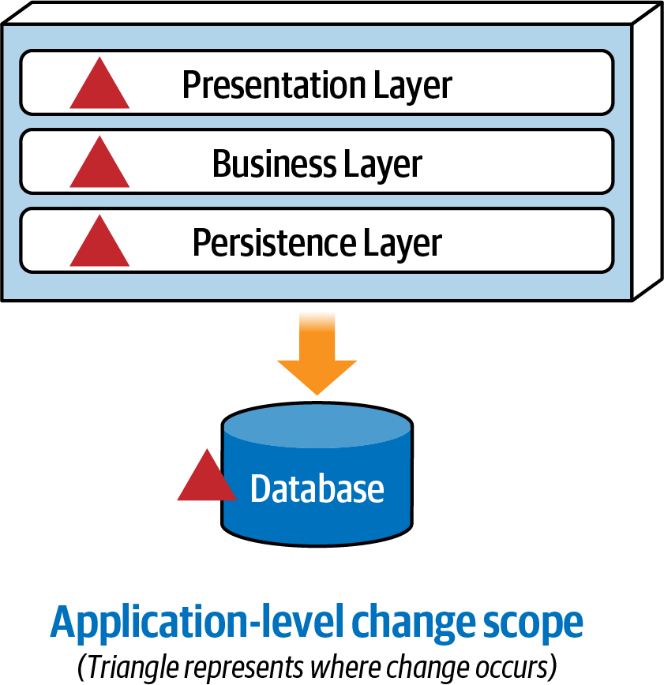
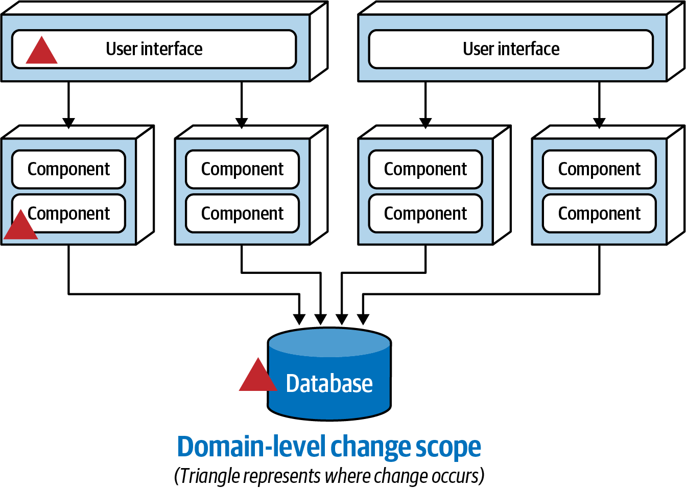
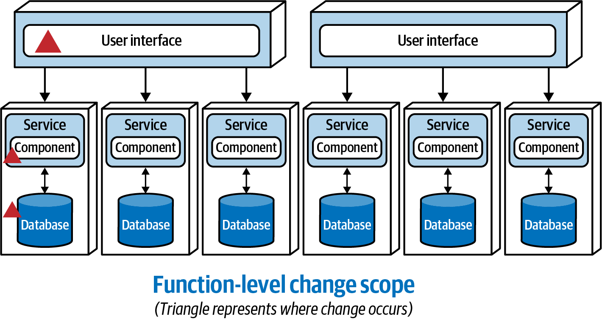
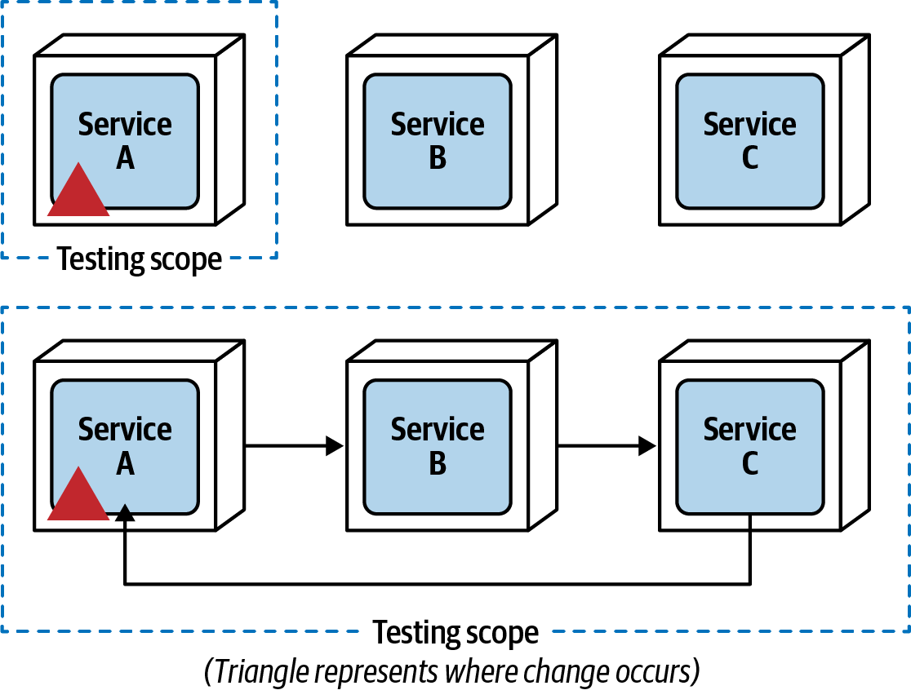
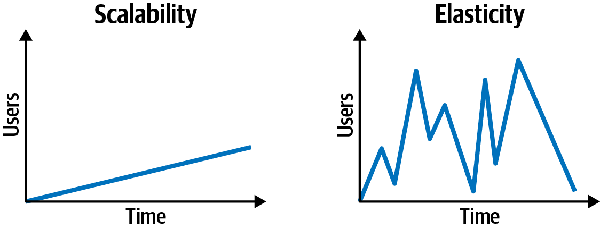
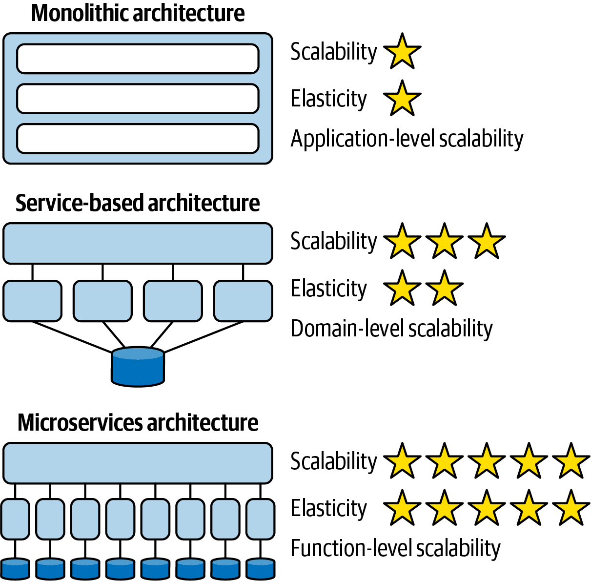

### Chapter 3: Architectural Modularity - Summary

This chapter makes the case that architectural modularity is not just a technical pursuit but a critical business enabler. It argues that in the face of constant business and technological change, monolithic applications often fail to provide the required agility, scalability, and resilience. The chapter introduces a framework for justifying a migration from a monolith to a more modular architecture by connecting specific technical benefits to concrete business problems.

The core of the chapter identifies five key technical drivers for modularity: **maintainability, testability, deployability, scalability, and fault tolerance**. It explains how increasing modularity positively impacts each of these characteristics, which in turn drives business goals like **speed-to-market** and **competitive advantage**. The chapter provides tangible analogies (like the "water glass") to explain these concepts to non-technical stakeholders and culminates in a practical example of how to build a business case and document the decision using an **Architecture Decision Record (ADR)**.

---

### Why Modularity Matters: Making the Business Case

Architects can't justify expensive refactoring efforts by saying, "nothing else we try seems to work." A solid business case is required, and it starts with explaining the "why" behind modularity.

#### The Water Glass Analogy

This analogy is a powerful tool for explaining the limitations of a monolith to business stakeholders.

*   **The Monolith at Capacity:** A monolithic application is like a single, large glass of water. As the application grows to handle more features and load, the glass fills up. Once the glass is full, you cannot add more water. Adding another identical glass (server) doesn't help because it's just another full glass.

    

*   **Modularity Creates Capacity:** Breaking the monolith apart is like getting a second, empty glass and pouring half the water into it. You now have two half-full glasses, creating 50% more capacity for growth and scalability across your existing resources.

    

---

### The Drivers for Modularity

Architectural change should be driven by clear business needs. The primary business drivers are **speed-to-market** and **competitive advantage**. These are achieved through improvements in five key architectural characteristics.

#### 1. Maintainability

Maintainability is the ease of adding, changing, or removing features. It is inversely proportional to component coupling.

*   **Monoliths (Application-Level Scope):** In a monolith, a simple change often requires touching multiple layers (UI, business, data), coordinating multiple teams, and has an application-wide scope.
    

*   **Service-Based (Domain-Level Scope):** In a service-based architecture, change is isolated to a single, coarse-grained domain service, making it easier to manage.
    

*   **Microservices (Function-Level Scope):** In a microservices architecture, the change is isolated to a single, fine-grained service, offering the highest maintainability.
    

#### 2. Testability

Testability is the ease and completeness of testing.

*   **Impact of Modularity:** Modularity drastically reduces the testing scope. Instead of running thousands of tests for a small change in a monolith, you only need to run the small, targeted test suite for the specific service that was changed.
*   **Warning:** High inter-service communication destroys this benefit. If Service A's functionality requires calls to Service B and C, a change in A now requires testing all three, pushing you back towards monolithic testing complexity.

    

#### 3. Deployability

Deployability is the ease, frequency, and risk of deployment.

*   **Impact of Modularity:** Breaking an application into smaller, independently deployable units reduces deployment risk and ceremony (e.g., code freezes). This allows for more frequent releases, increasing agility.
*   **Warning (The Distributed Big Ball of Mud):** If your "microservices" must all be deployed together in a specific order, they are not truly modular. As Matt Stine says, *"If your microservices must be deployed as a complete set in a specific order, please put them back in a monolith and save yourself some pain."*

#### 4. Scalability and Elasticity

*   **Scalability:** The ability to handle a gradual increase in user load over time.
*   **Elasticity:** The ability to handle sudden, instantaneous spikes in user load.

    

*   **Modularity vs. Granularity:** Modularity (breaking the app apart) primarily improves **scalability**. Granularity (making the pieces small) primarily improves **elasticity**, because smaller services have a lower Mean Time To Startup (MTTS) and can be spun up quickly to handle a spike.

    

#### 5. Availability / Fault Tolerance

Fault tolerance is the ability for parts of the system to remain available even when other parts fail.

*   **Impact of Modularity:** In a monolith, an unhandled exception (like an OutOfMemoryError) in one minor feature can bring down the entire application. Modularity isolates the fault to a single service, allowing the rest of the system to continue functioning.
*   **Warning:** This benefit is nullified by synchronous coupling. If the "Search" service makes a synchronous call to the "Recommendations" service, and the Recommendations service fails, the Search feature will also fail for that user. Asynchronous communication is essential for true fault tolerance.

---

### Building the Business Case: The Sysops Squad ADR

After identifying the system's problems, the architects match them to the modularity drivers to build a solid justification. This is formalized in an Architecture Decision Record (ADR).

#### ADR: Migrate Sysops Squad Application to a Distributed Architecture

*   **Context:** The current monolithic application has numerous issues with scalability (freezes under load), availability (crashes bring the whole system down), and maintainability (changes are slow and introduce bugs).

*   **Decision:** We will migrate the existing monolithic application to a distributed architecture.

*   **Justification (How this solves our problems):**
    *   **Fault Tolerance:** It will make the core ticketing functionality more available by isolating it from failures in non-critical parts like reporting.
    *   **Scalability:** It will provide better scalability for ticket creation and separate the reporting database load, resolving the frequent application freeze-ups.
    *   **Agility (Maintainability, Testability, Deployability):** It will allow teams to develop, test, and deploy features and fixes much faster and with less risk.

*   **Consequences (The Trade-Offs):**
    *   The migration effort will delay new features.
    *   The effort will incur additional cost.
    *   The deployment pipeline will need to be modified.
    *   The monolithic database must be broken apart.

---

### Actionable Tips from Chapter 3

> **1. Use the "Water Glass" Analogy.** This is a simple but effective way to explain the scalability limitations of a monolith and the benefits of modularity to business stakeholders.
>
> **2. Frame Refactoring as a Business Enabler.** Don't talk about technical purity. Build a business case by mapping the system's specific, painful problems to the concrete benefits of the five modularity drivers (e.g., "By improving fault tolerance, we will solve the availability issue that is causing customer dissatisfaction.").
>
> **3. Formalize Decisions with an ADR.** Use an Architecture Decision Record to clearly document the context, decision, justification, and consequences of a major architectural change. This creates alignment and provides a historical record.
>
> **4. Beware of Distributed Monoliths.** True modularity requires more than just breaking code into separate services. If your services have high inter-service communication (especially synchronous calls), you will lose the benefits of testability, deployability, and fault tolerance.
>
> **5. Differentiate Scalability from Elasticity.** Understand that scalability (handling gradual growth) is improved by modularity, while elasticity (handling load spikes) is improved by fine-grained services with a low start-up time (MTTS).
>
> **6. Emphasize Asynchronous Communication for Resilience.** To achieve true fault tolerance where the failure of one service doesn't cascade to others, you must favor asynchronous communication.

