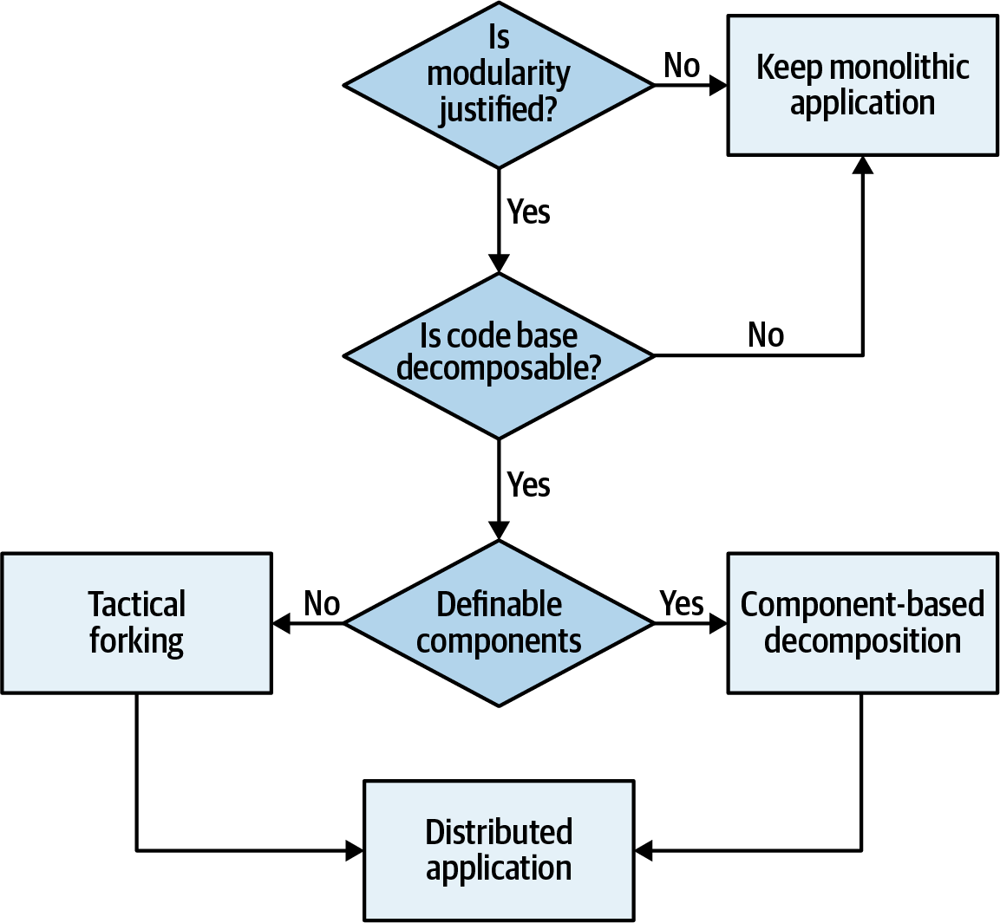
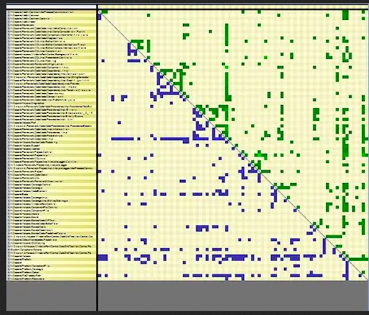
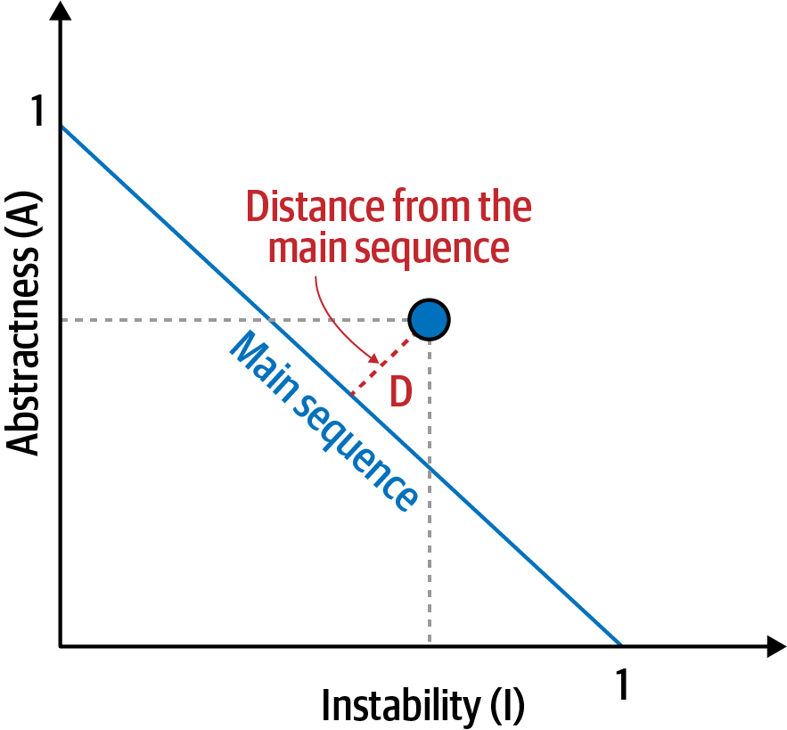
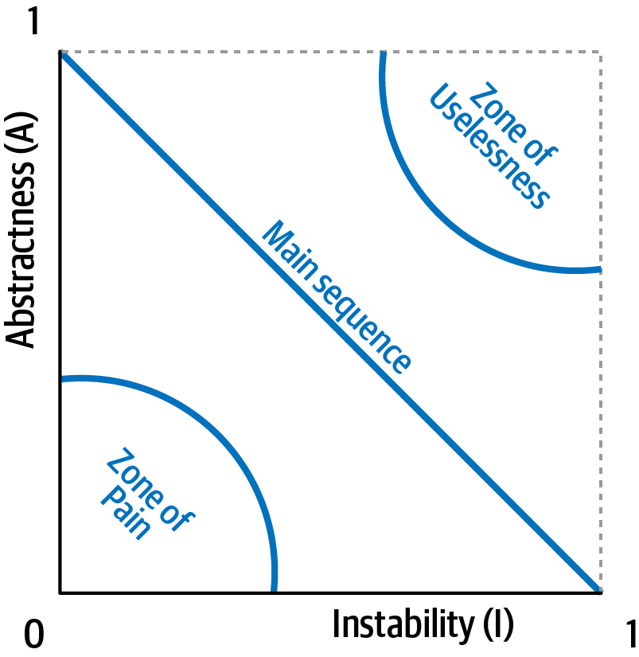
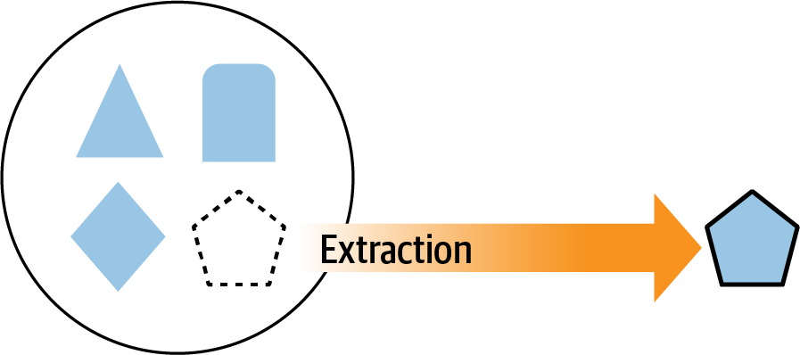
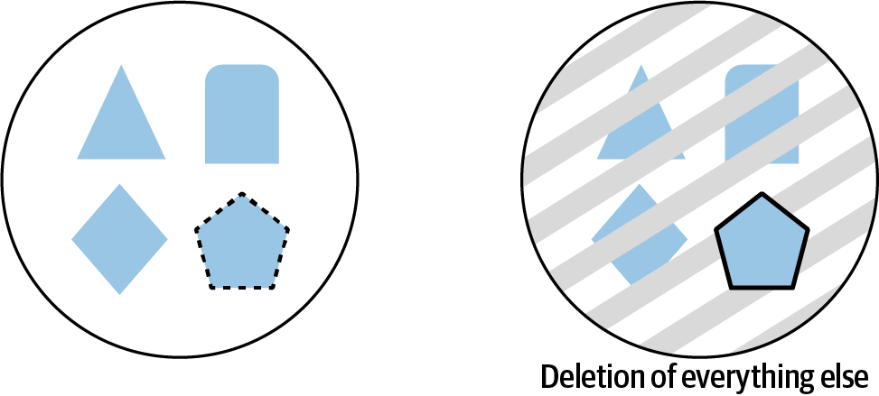
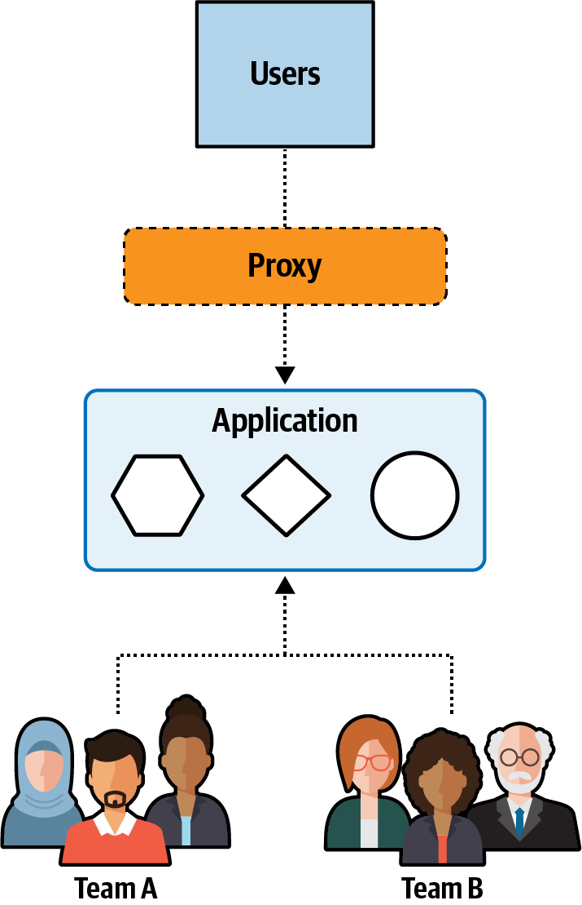
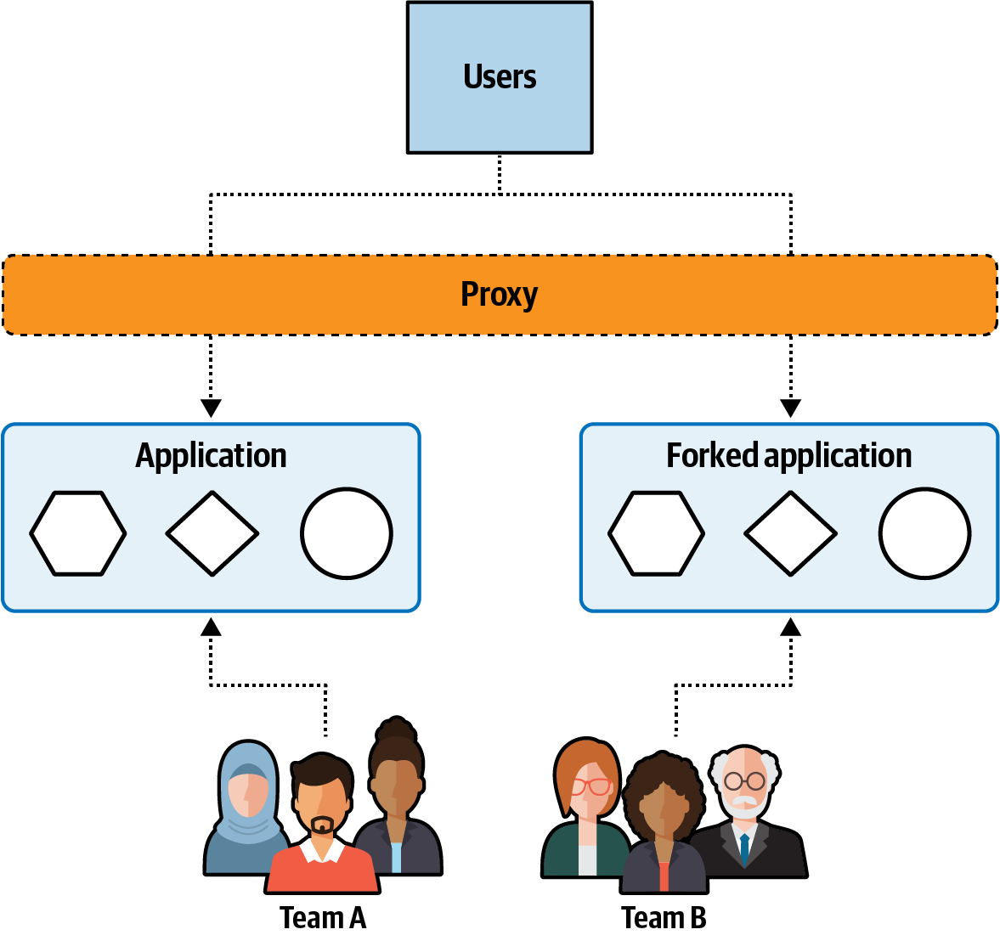
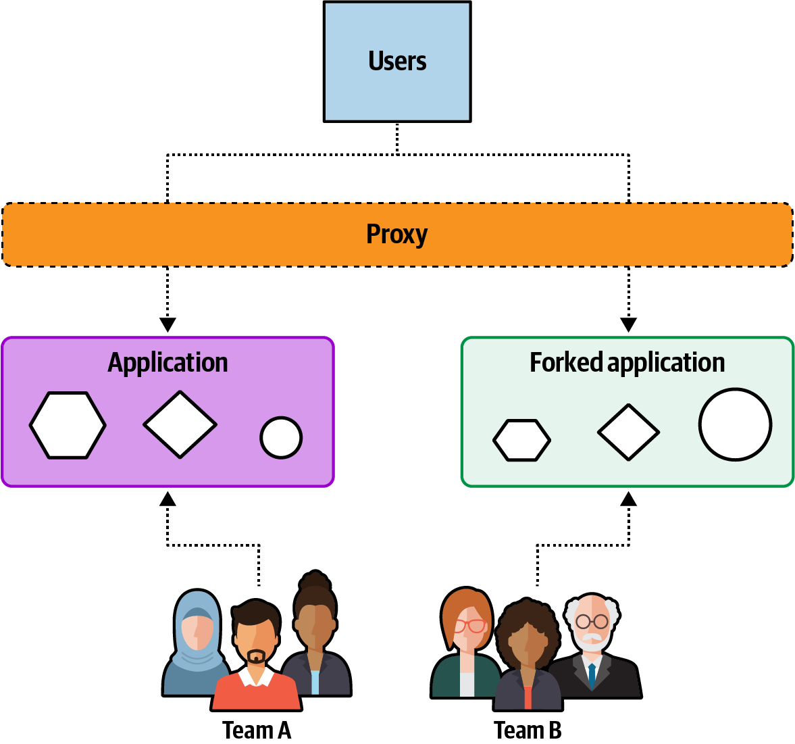
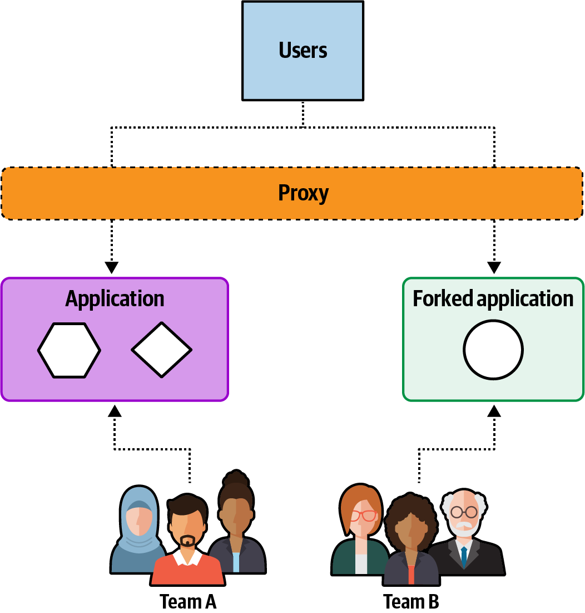

### Chapter 4: Architectural Decomposition - Summary

This chapter addresses the practical question of *how* to break apart a monolithic application. It presents a structured decision-making framework to guide architects away from unstructured, ad-hoc approaches (dubbed the "Elephant Migration AntiPattern"). The chapter introduces two primary decomposition strategies: **Component-Based Decomposition** and **Tactical Forking**.

The choice between these strategies hinges on the internal structure of the existing monolith. To assess this, the chapter introduces a set of quantitative metrics: **Afferent/Efferent Coupling**, **Abstractness**, **Instability**, and the derived **Distance from the Main Sequence**. These metrics help an architect determine if a codebase is decomposable and, if so, whether it's a structured system suitable for careful refactoring (Component-Based Decomposition) or a "Big Ball of Mud" that is better handled by cloning and deleting unwanted code (Tactical Forking). The chapter concludes by demonstrating how to apply this analysis and formalize the chosen approach in an Architecture Decision Record (ADR).

---

### Choosing a Decomposition Approach

The first step is to determine a methodical approach rather than just chipping away at the monolith, which often leads to a "distributed big ball of mud." The decision process follows a clear flow.

---

### Is the Code Base Decomposable?

Before starting, an architect must determine if the codebase has enough internal structure to be salvageable. This involves analyzing coupling metrics.

#### Afferent and Efferent Coupling

*   **Afferent Coupling (Ca):** Measures the number of **incoming** connections to a code artifact. High afferent coupling means many other parts of the system depend on this component.
*   **Efferent Coupling (Ce):** Measures the number of **outgoing** connections to other code artifacts. High efferent coupling means this component depends on many other parts of the system.

Tools like JDepend can visualize these relationships, helping architects understand the web of dependencies.

#### Abstractness, Instability, and Distance from the Main Sequence

These derived metrics, created by Robert Martin, provide a more holistic view of a codebase's health.

1.  **Abstractness (A):** The ratio of abstract artifacts (interfaces, abstract classes) to concrete artifacts (implementation classes). A value near 1 is highly abstract; a value near 0 is highly concrete.

    \[ A = \frac{\sum m_a}{\sum m_c + \sum m_a} \]

2.  **Instability (I):** The ratio of efferent coupling (Ce) to total coupling (Ce + Ca). It measures the volatility of a codebase. A value near 1 is highly unstable (many outgoing dependencies); a value near 0 is highly stable (many incoming dependencies).

    \[ I = \frac{C_e}{C_e + C_a} \]

3.  **Distance from the Main Sequence (D):** This metric measures the balance between abstractness and instability. The "main sequence" is an idealized line where A + I = 1. The goal is for components to be as close to this line as possible.

    \[ D = |A + I - 1| \]

Components far from this line fall into two undesirable zones:
*   **Zone of Pain:** Low abstractness, low instability. The code is concrete, stable, and rigid, making it very difficult to change.
*   **Zone of Uselessness:** High abstractness, high instability. The code is highly abstract but has many outgoing dependencies, making it difficult to use.

---

### Component-Based Decomposition

This is an extraction-based approach best suited for codebases with well-defined (or at least loosely-defined) components. It involves refactoring to refine component boundaries, group them into domains, and then extract them as services.

> **Tip:** When breaking apart monolithic applications into distributed architectures, build services from components, not individual components.

This approach often leads to a **Service-Based Architecture** first, which is a pragmatic stepping stone to microservices because:
*   It allows architects to focus on domain partitioning before tackling database decomposition.
*   It doesn't require a full leap to containerization and complex operational automation.
*   It's primarily a technical move that doesn't immediately require reorganizing teams.

> **Tip:** When migrating monolithic applications to Microservices, move to a Service-based architecture first as a stepping stone to Microservices.

---

### Tactical Forking

This approach is best suited for a "Big Ball of Mud" architecture where extracting components is nearly impossible due to high coupling. Instead of extracting what you want, you clone the monolith and **delete what you don't want**.

#### The Process

1.  **Start:** A single monolithic application with multiple domains mixed together.
    

2.  **Clone:** Create multiple copies of the entire monolithic codebase, one for each target service/team.
    

3.  **Delete:** Each team begins deleting the code that is not relevant to their target service. This is often easier than extraction because you don't have to untangle dependencies; you just delete code until the service compiles and runs.
    

4.  **Finish:** The result is two (or more) coarse-grained services, each containing the code for their specific domain.
    

#### Trade-offs

*   **Benefits:**
    *   Teams can start immediately with little up-front analysis.
    *   Deleting code is often easier and faster than extracting it from a highly coupled system.
*   **Shortcomings:**
    *   Resulting services will likely contain dead, latent code.
    *   The internal code quality of the new services is no better than the original monolith.
    *   Can lead to inconsistencies in shared code and components across services.

---

### Sysops Squad ADR: Choosing the Approach

After analysis, the team determines their codebase is structured enough for a more methodical approach.

#### ADR: Migration Using the Component-Based Decomposition Approach

*   **Context:** We need to choose a strategy for breaking apart the Sysops Squad monolith. The two options considered were Tactical Forking and Component-Based Decomposition.
*   **Decision:** We will use the **Component-Based Decomposition** approach.
*   **Justification:**
    *   The application already has well-defined component boundaries.
    *   This approach minimizes code duplication, which is critical for our maintainability goals.
    *   It allows service boundaries to emerge naturally through component grouping, rather than requiring them to be defined up-front.
    *   It provides a safer, more controlled, and incremental migration path.
*   **Consequences:**
    *   The migration will likely take longer than with Tactical Forking.
    *   This approach supports a single, collaborative team structure, whereas Tactical Forking would have required splitting the team and adding coordination overhead.

---

### Actionable Tips from Chapter 4

> **1. Avoid the "Elephant Migration AntiPattern."** Don't just start breaking pieces off a monolith one by one without a holistic plan. This unstructured approach usually leads to a distributed big ball of mud.

> **2. Analyze Before You Decompose.** Before starting a migration, use quantitative metrics (like Distance from the Main Sequence) to determine if your codebase is even decomposable. A codebase in the "Zone of Pain" may not be a good candidate for restructuring.

> **3. Match the Approach to the Codebase Structure.** Use Component-Based Decomposition for well-structured monoliths with clear component boundaries. Use Tactical Forking for "Big Ball of Mud" architectures where extraction is infeasible.

> **4. Use Service-Based Architecture as a Stepping Stone.** When migrating a monolith to microservices, consider an intermediate step to a service-based architecture. This allows you to tackle domain and functional partitioning first, before dealing with the complexities of database decomposition and operational automation.

> **5. Build Services from Components, Not Classes.** A single service should be formed from a group of related components that represent a domain or subdomain, not from individual classes or components.

> **6. Formalize Your Decomposition Strategy in an ADR.** Document your chosen approach (Component-Based vs. Tactical Forking), the justification for your choice, and the expected trade-offs in an Architecture Decision Record. This ensures clarity and alignment for the entire team.
