### Chapter 5: Component-Based Decomposition Patterns - Summary

This chapter provides a detailed, pattern-based roadmap for the practical work of refactoring a monolith into a more distributed architecture. It builds on the `Component-Based Decomposition` approach introduced in Chapter 4 by laying out a sequence of six specific refactoring patterns. The core idea is to move from an unstructured codebase to a set of well-defined, domain-aligned services in a methodical and controlled way.

The chapter begins with identifying and sizing components to ensure they are consistent and manageable. It then moves to consolidating duplicated domain logic and "flattening" component hierarchies to eliminate ambiguity. Next, it focuses on analyzing dependencies between these components to assess the feasibility and effort of the migration. Finally, it describes how to group components into logical domains and then physically extract those domains into separately deployed **domain services**, resulting in a **Service-Based Architecture**. Each pattern is accompanied by examples of **Architecture Fitness Functions** to automate governance and prevent architectural drift during and after the migration.

---

### Component-Based Decomposition Roadmap

The chapter presents a sequential roadmap for applying the decomposition patterns. This flow provides a structured, iterative approach to breaking apart a monolith.


The six patterns are:
1.  **Identify and Size Components:** Catalog all logical components and ensure they are of a relatively consistent size.
2.  **Gather Common Domain Components:** Consolidate duplicated business logic to reduce redundancy and the number of potential services.
3.  **Flatten Components:** Refactor component hierarchies to ensure source code only resides in leaf-node namespaces, eliminating ambiguity.
4.  **Determine Component Dependencies:** Analyze the coupling between components to determine migration feasibility and effort.
5.  **Create Component Domains:** Logically group related components into domains that will eventually become services.
6.  **Create Domain Services:** Physically extract the defined domains from the monolith into separately deployed services.

---

### Architecture Stories

The chapter introduces the concept of an **Architecture Story** as a way to manage and track structural refactoring work. Unlike a user story, which focuses on a feature, an architecture story focuses on a change to the application's structure to support an architectural characteristic or business driver.

> **Example Architecture Story:**
> *As an architect I need to decouple the Payment service to support better extensibility and agility when adding additional payment types.*

---

### 1. Identify and Size Components Pattern

This is the first step in the process. Its purpose is to catalog the application's logical components and ensure they are properly and consistently sized.

#### Pattern Description

Services are built from components, so it's critical that components aren't too large (hard to break apart) or too small (not doing enough). The number of files or lines of code is a poor metric. A better metric is the **total number of statements** within a component's source files.

Key metrics to gather are:
*   **Component Name:** A clear, self-describing name.
*   **Component Namespace:** The physical location (e.g., package or directory) of the component's code.
*   **Percent:** The component's size as a percentage of the total codebase's statements. This helps identify outliers.
*   **Statements:** The sum of all statements in the component's source files.
*   **Files:** The total number of source files. A high statement count with very few files indicates a need for refactoring.

Components should generally fall within one to two standard deviations of the mean component size. Large components should be broken up using functional or domain-driven decomposition.

#### Fitness Functions for Governance

*   **Fitness Function: Maintain component inventory.**
    This function automatically detects when new components are added or removed by scanning the codebase's directory structure and comparing it to a stored list. This keeps the architect aware of structural changes.
    ```
    # Example 5-1: Pseudo-code for maintaining component inventory
    # Get prior component namespaces that are stored in a datastore
    LIST prior_list = read_from_datastore()

    # Walk the directory structure, creating namespaces for each complete path
    LIST current_list = identify_components(root_directory)

    # Send an alert if new or removed components are identified
    LIST added_list = find_added(current_list, prior_list)
    LIST removed_list = find_removed(current_list, prior_list)
    IF added_list NOT EMPTY {
      add_to_datastore(added_list)
      send_alert(added_list)
    }
    IF removed_list NOT EMPTY {
      remove_from_datastore(removed_list)
      send_alert(removed_list)
    }
    ```

*   **Fitness Function: No component shall exceed < some percent > of the overall codebase.**
    This function identifies components that are too large by calculating the percentage of total statements for each component and alerting if it exceeds a defined threshold (e.g., 10%).
    ```
    # Example 5-2: Pseudo-code for maintaining component size based on percent of code
    # Walk the directory structure, creating namespaces for each complete path
    LIST component_list = identify_components(root_directory)

    # Walk through all of the source code to accumulate total statements
    total_statements = accumulate_statements(root_directory)

    # Walk through the source code for each component, accumulating statements
    # and calculating the percentage of code each component represents. Send
    # an alert if greater than 10%
    FOREACH component IN component_list {
      component_statements = accumulate_statements(component)
      percent = component_statements / total_statements
      IF percent > .10 {
        send_alert(component, percent)
      }
    }
    ```

*   **Fitness Function: No component shall exceed < some number of standard deviations > from the mean component size.**
    This function uses statistical analysis to find outlier components based on the number of statements, alerting the architect if a component's size is, for example, more than three standard deviations from the mean.
    \[ s = \sqrt{\frac{1}{N-1} \sum_{i=1}^{N} (x_i - \bar{x})^2} \]
    ```
    # Example 5-3: Pseudo-code for for maintaining component size based on number of standard deviations
    # ... (Calculation of mean and standard deviation) ...
    FOREACH component,size IN component_size_map {
      diff_from_mean = absolute_value(size - mean);
      num_std_devs = diff_from_mean / std_dev
      IF num_std_devs > 3 {
        send_alert(component, num_std_devs)
      }
    }
    ```

#### Sysops Squad Saga

Addison applies this pattern and finds that the `Reporting` component (`ss.reporting`) constitutes **33%** of the entire codebase, making it a significant outlier.

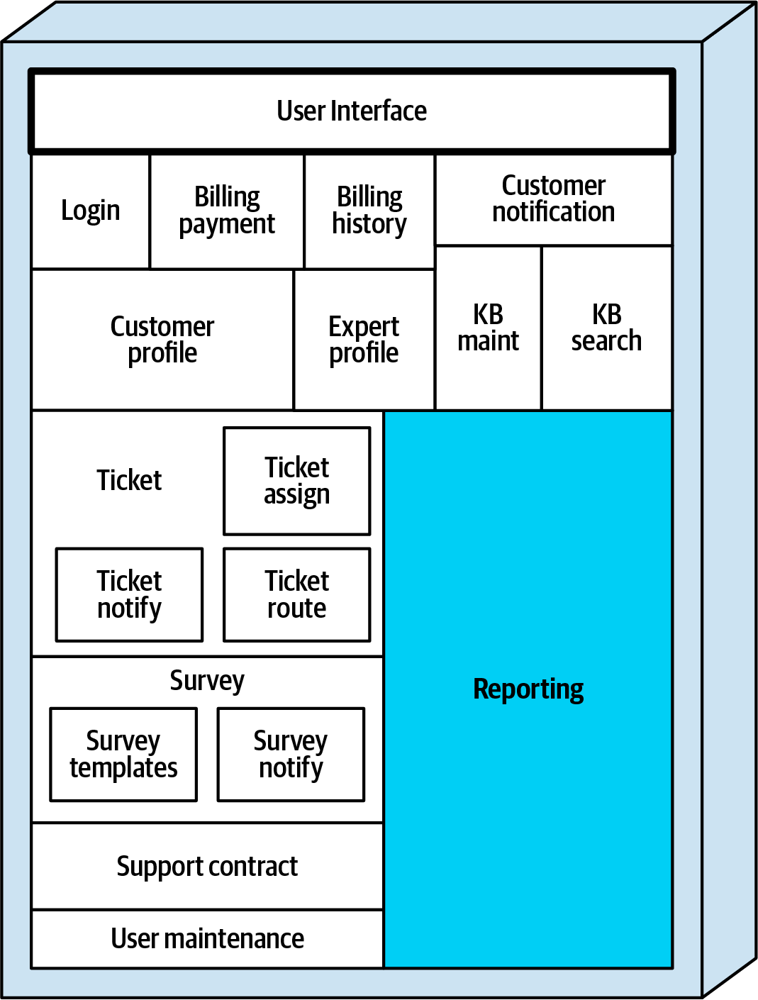

The team breaks the single `Reporting` component into four new, more granular components based on functionality: `Reporting Shared`, `Ticket Reports`, `Expert Reports`, and `Financial Reports`. This results in a much more balanced distribution of component sizes.

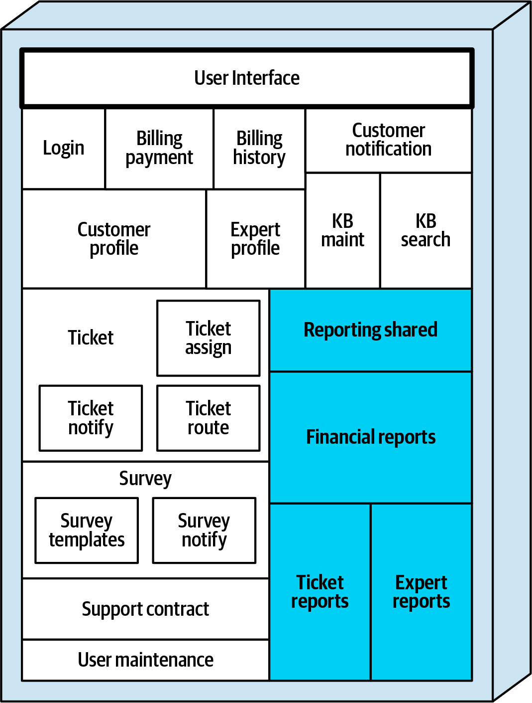

---

### 2. Gather Common Domain Components Pattern

This pattern is used to identify and consolidate common business logic that may be duplicated across the application.

#### Pattern Description

This helps eliminate redundant services when the monolith is broken apart. For example, if three different components each have their own logic for sending notifications, this common functionality can be gathered into a single `Notification` component. This is distinct from shared *infrastructure* logic (like logging), as it relates to business processing.

Identifying this commonality is often manual but can be aided by looking for:
*   Classes shared across multiple components.
*   Common naming patterns in namespaces (e.g., `ss.ticket.audit`, `ss.billing.audit`).

Consolidating common logic can create a shared service or a shared library. The trade-offs are discussed later in the book. It's crucial to analyze the impact on coupling; sometimes consolidating code can create a new component with an unacceptably high level of incoming dependencies.

#### Fitness Functions for Governance

*   **Fitness Function: Find common names in leaf nodes of component namespace.**
    This function scans component namespaces for common leaf node names (e.g., multiple components ending in `.audit`) and alerts the architect, who can then investigate if this indicates duplicated domain logic.
    ```
    # Example 5-4: Pseudo-code for finding common namespace leaf node names
    # ... (logic to get leaf node of each namespace) ...
    FOREACH component IN component_list {
      leaf_name = get_last_node(component)
      IF leaf_name IN leaf_node_list AND
         leaf_name NOT IN excluded_leaf_node_list {
        ADD component TO common_component_list
      } ELSE {
        ADD leaf_name TO leaf_node_list
      }
    }
    # ... (send alert) ...
    ```

*   **Fitness Function: Find common code across components.**
    This function identifies source files that are used by multiple components, which can be an indicator of shared domain functionality that could be consolidated.
    ```
    # Example 5-5: Pseudo-code for finding common source files between components
    # ... (logic to map source files to components) ...
    FOREACH source_file IN source_file_list {
      SET count TO 0
      FOREACH component,component_source_file_list IN component_source_file_map {
        IF source_file IN component_source_file_list {
          ADD 1 TO count
        }
      }
      IF count > 1 AND source_file NOT IN excluded_source_file_list {
        ADD source_file TO common_source_file_list
      }
    }
    # ... (send alert) ...
    ```

#### Sysops Squad Saga

Addison identifies three separate notification-related components: `Customer Notification`, `Ticket Notify`, and `Survey Notify`.

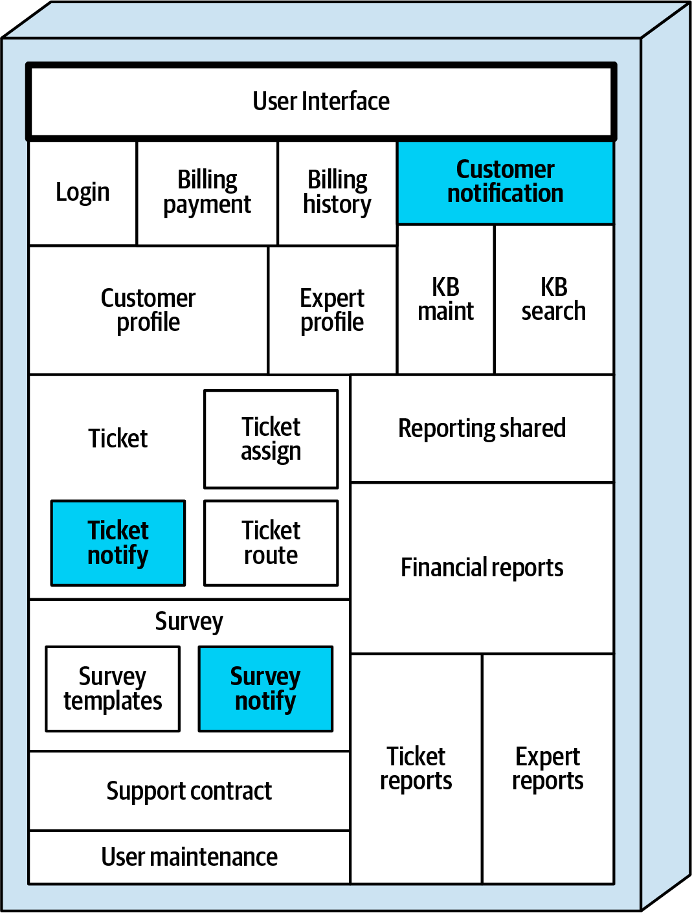

After analyzing the coupling impact, Addison confirms that consolidating them will not negatively affect the overall architecture. An architecture story is created, and the three components are refactored into a single, common `Notification` component (`ss.notification`).

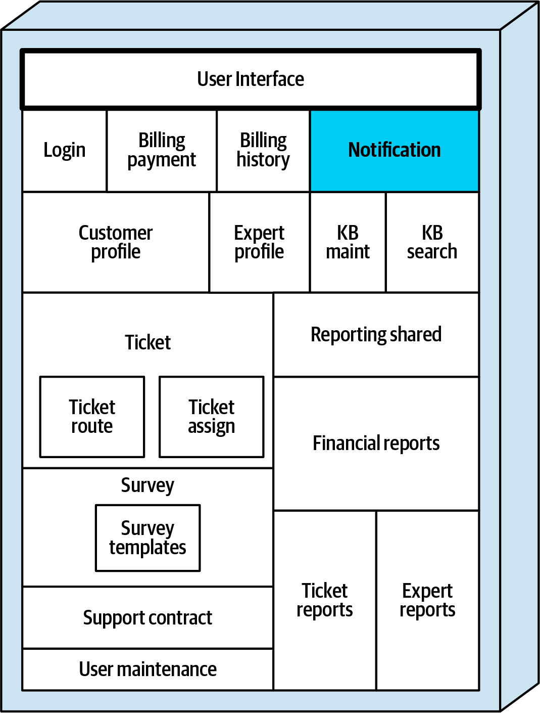

---

### 3. Flatten Components Pattern

This pattern ensures that components are clearly defined and not nested within each other, which creates ambiguity. It establishes that a component should only exist as a **leaf-node** in a namespace or directory structure.

#### Pattern Description

If a namespace `ss.survey` contains source files, but there is also a namespace `ss.survey.templates`, a problem arises. `ss.survey` is no longer a component but a **root namespace** (or sub-domain), and the files within it are **orphaned classes** because they don't belong to a leaf-node component.


To fix this, the hierarchy must be "flattened":
1.  **Flatten Down:** Move the code from the child namespace (`ss.survey.templates`) into the parent (`ss.survey`), making the parent the new leaf-node component.
    
2.  **Flatten Up:** Move the orphaned classes from the root namespace (`ss.survey`) into new, more specific child components (e.g., `ss.survey.create` and `ss.survey.process`).
    
3.  **Shared Component:** If the orphaned classes represent shared code for other components in that sub-domain, move them to a new, dedicated shared component (e.g., `ss.survey.shared`).
    

#### Fitness Functions for Governance

*   **Fitness Function: No source code should reside in a root namespace.**
    This function automates the detection of orphaned classes by scanning the directory structure and alerting the architect if any source files are found in a namespace that is not a leaf-node.
    ```
    # Example 5-6: Pseudo-code for finding code in root namespaces
    FOREACH component IN component_list {
      LIST component_node_list = get_nodes(component)
      FOREACH node IN component_node_list {
        IF contains_code(node) AND NOT last_node(component_node_list) {
          send_alert(component)
        }
      }
    }
    ```

#### Sysops Squad Saga

Addison identifies that both the `Ticket` and `Survey` namespaces contain orphaned classes.


*   For the complex `Ticket` domain, Addison chooses to **flatten up**, breaking the orphaned code in `ss.ticket` into three new components: `Ticket Shared`, `Ticket Maintenance`, and `Ticket Completion`.
*   For the simpler `Survey` domain, Addison chooses to **flatten down**, moving the code from `ss.survey.templates` into `ss.survey` and deleting the templates component.


---

### 4. Determine Component Dependencies Pattern

This pattern analyzes the coupling between components to answer three critical migration questions:
1.  Is it feasible to break apart the monolith?
2.  What is the rough level of effort? (A "golfball," "basketball," or "airliner"?)
3.  Will this require a refactor or a full rewrite?

#### Pattern Description

A component dependency is formed when a class in one component interacts with a class in another component. This pattern focuses on these inter-component dependencies, not the internal coupling within a component. Visualizing these dependencies is crucial.

*   **Minimal Dependencies (Golfball):** A diagram with few connections between components indicates a straightforward refactoring effort.
    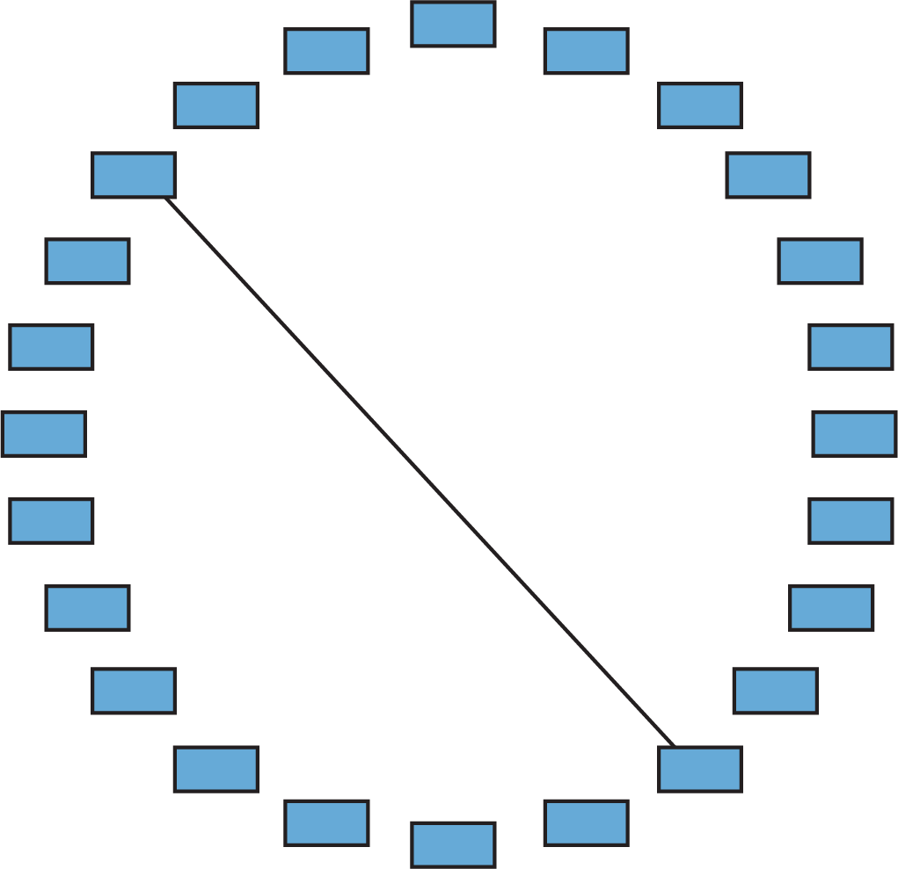
*   **High Dependencies (Basketball):** A diagram with many connections, especially in certain areas, suggests a much harder effort that will likely require a mix of refactoring and rewriting.
    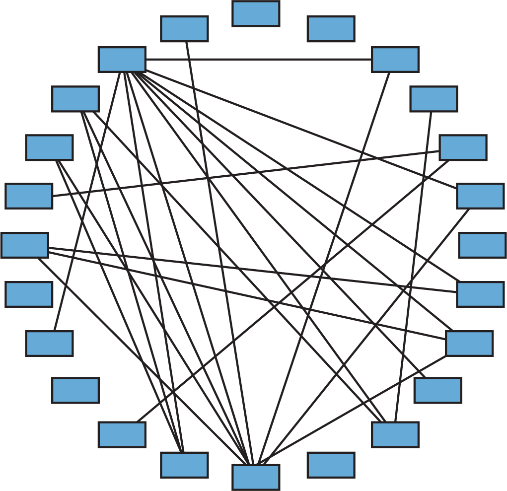
*   **Too Many Dependencies (Airliner):** A diagram where everything is connected to everything else indicates that a migration is likely not feasible and a total rewrite is necessary.
    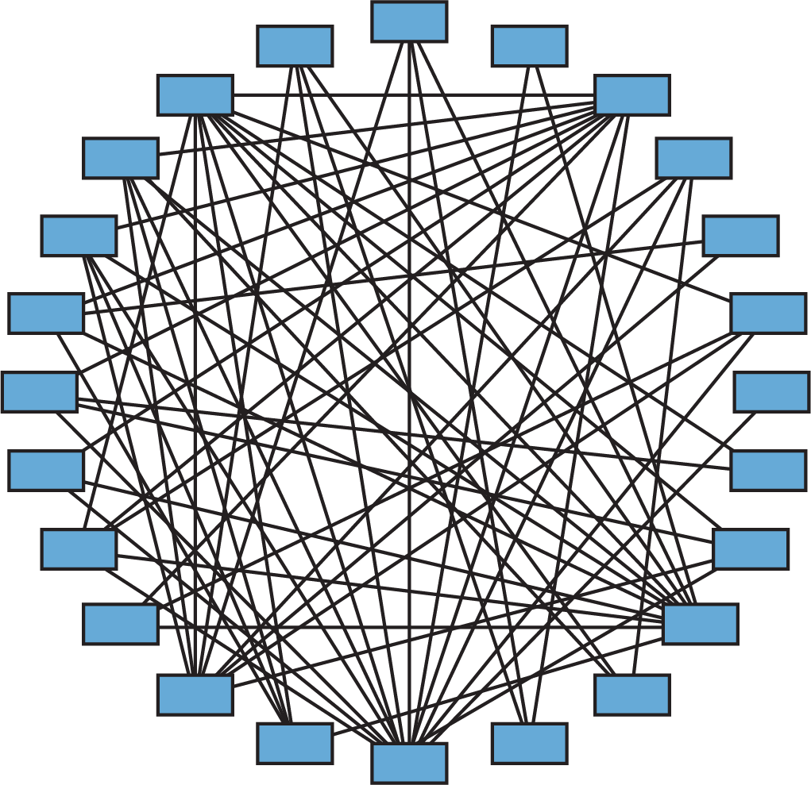

Analyzing both incoming (afferent, `CA`) and outgoing (efferent, `CE`) coupling helps identify opportunities to refactor and reduce dependencies *before* starting the migration.

#### Fitness Functions for Governance

*   **Fitness Function: No component shall have more than < some number > of total dependencies.**
    This function calculates the total coupling (`CA` + `CE`) for each component and alerts the architect if it exceeds a predefined threshold (e.g., 15), preventing any single component from becoming too entangled.
    ```
    # Example 5-8: Pseudo-code for limiting the total number of dependencies
    # ... (logic to calculate incoming and outgoing dependencies) ...
    IF total_count > 15 {
      send_alert(component, total_count)
    }
    ```

*   **Fitness Function: < some component > should not have a dependency on < another component >.**
    This function enforces specific architectural rules, preventing undesirable coupling between certain components. This is often implemented with tools like ArchUnit.
    ```java
    // Example 5-9: ArchUnit code for governing dependency restrictions
    public void ticket_maintenance_cannot_access_expert_profile() {
       noClasses().that()
       .resideInAPackage("..ss.ticket.maintenance..")
       .should().accessClassesThat()
       .resideInAPackage("..ss.expert.profile..")
       .check(myClasses);
    }
    ```

#### Sysops Squad Saga

Addison generates a dependency diagram for the Sysops Squad application, which initially looks discouragingly complex.

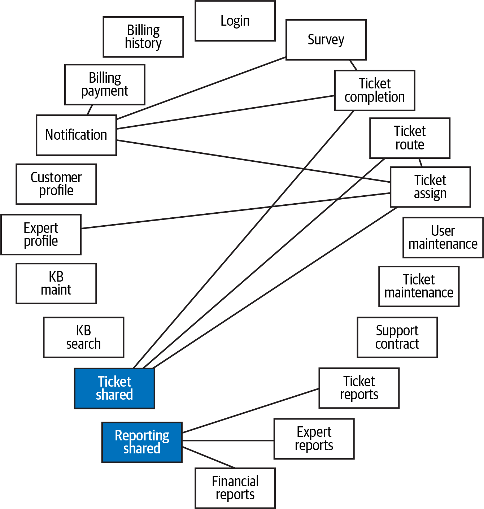

However, after filtering out the shared components (`Notification`, `Reporting Shared`, `Ticket Shared`), which would likely become shared libraries, the picture becomes much clearer. The core functional components have minimal dependencies, confirming that the application is a good candidate for migration.

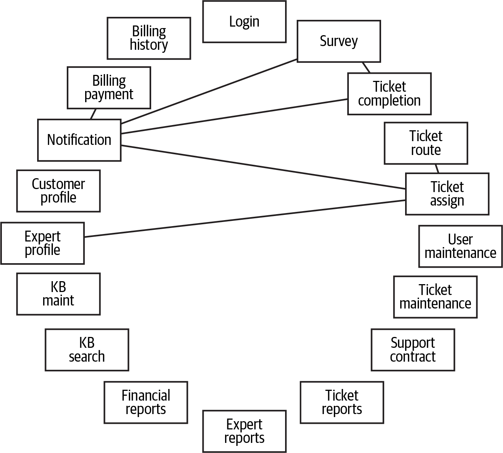

---

### 5. Create Component Domains Pattern

This pattern logically groups related components into coarse-grained **domains**. This is a critical step in preparing to create domain services for a Service-Based Architecture.

#### Pattern Description

A service often contains multiple components. This pattern identifies those groupings. Component domains are physically represented by refactoring the application's namespaces. For example, components like `ss.billing.payment` and `ss.supportcontract` are related to the customer. Their namespaces should be refactored to reflect this, such as `ss.customer.billing.payment` and `ss.customer.supportcontract`. This aligns the codebase structure with the business domains.


#### Fitness Functions for Governance

*   **Fitness Function: All namespaces under < root namespace node > should be restricted to < list of domains >.**
    This function enforces the defined domain structure, preventing developers from inadvertently creating new, unapproved top-level domains by checking that all component namespaces fall under an allowed domain (e.g., `ss.ticket`, `ss.customer`).
    ```java
    // Example 5-10: ArchUnit code for governing domains within an application
    public void restrict_domains() {
       classes()
         .should().resideInAPackage("..ss.ticket..")
         .orShould().resideInAPackage("..ss.customer..")
         .orShould().resideInAPackage("..ss.admin..")
         .check(myClasses);
    }
    ```

#### Sysops Squad Saga

Addison and Austen work with the product owner to identify five main domains: `Ticketing`, `Reporting`, `Customer`, `Admin`, and `Shared`. They create a diagram to validate that all existing components fit logically within these domains.

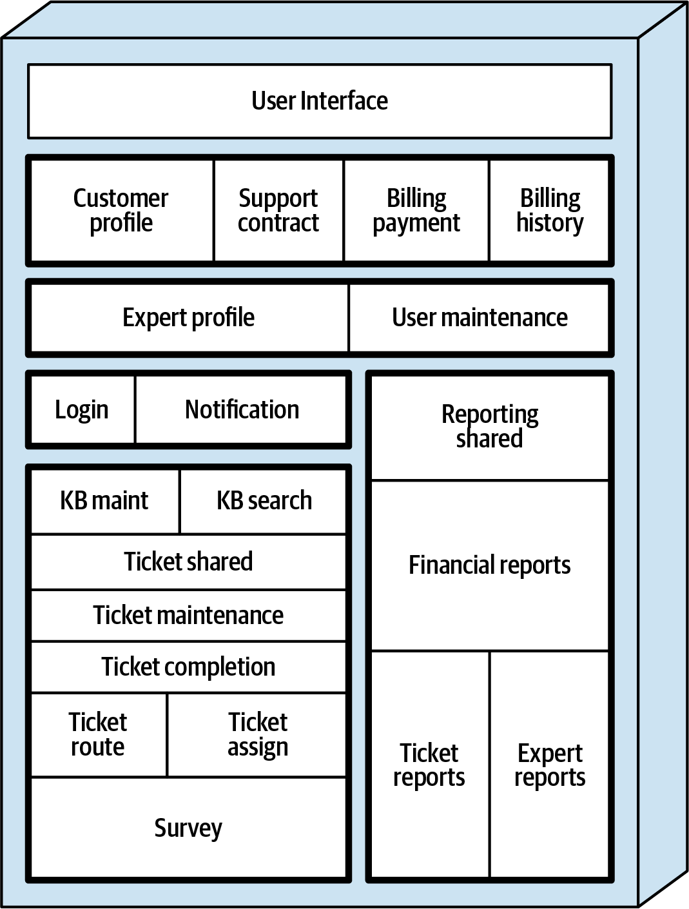

Addison then creates architecture stories to refactor the namespaces of components like `ss.kb.maintenance` and `ss.billing.payment` to align them with their new domains (e.g., changing them to `ss.ticket.kb.maintenance` and `ss.customer.billing.payment`, respectively).

---

### 6. Create Domain Services Pattern

This is the final pattern, where the logically defined component domains are physically extracted from the monolith into separately deployed **domain services**.

#### Pattern Description

This pattern creates a **Service-Based Architecture**, a pragmatic first step towards a more distributed system. In its basic form, this involves a user interface accessing multiple coarse-grained domain services that all still share a single monolithic database.

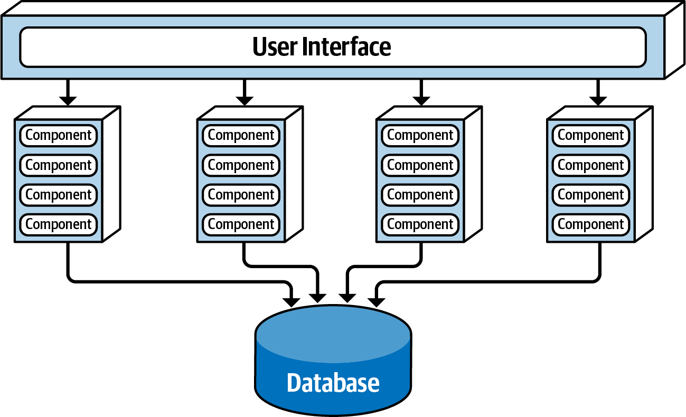

The process involves taking a defined domain (e.g., everything under the `ss.reporting` namespace) and moving that code into a new, independent project that is deployed as its own service. This should only be done *after* all the previous patterns have been applied to ensure the domain boundaries are stable.

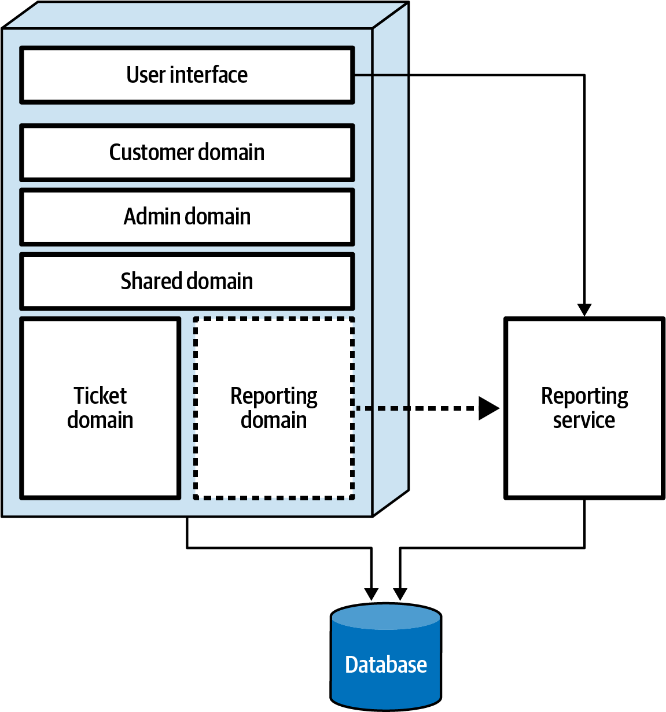

#### Fitness Functions for Governance

*   **Fitness Function: All components in < some domain service > should start with the same namespace.**
    Once a domain service is created, this fitness function ensures that no code from other domains is accidentally added to it. For example, it verifies that all code in the `Ticket` service resides under the `ss.ticket` namespace.
    ```java
    // Example 5-11: ArchUnit code for governing components within the Ticket domain service
    public void restrict_domain_within_ticket_service() {
       classes().should().resideInAPackage("..ss.ticket..")
       .check(myClasses);
    }
    ```

#### Sysops Squad Saga

The team develops a plan to migrate each of the five defined domains (`Ticketing`, `Reporting`, `Customer`, `Admin`, `Shared`) into its own separately deployed domain service. This staged migration transforms the Sysops Squad application from a monolith into a Service-Based Architecture.

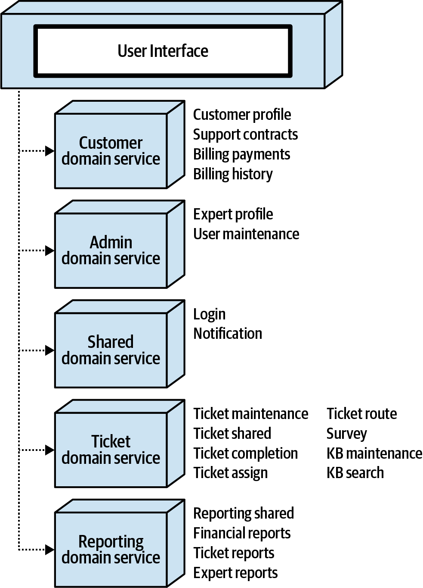

---

### Actionable Tips from Chapter 5

> **1. Follow a Structured, Pattern-Based Approach.** Don't engage in "seat-of-the-pants" migration. Use a methodical, incremental process like the one outlined in this chapter to reduce risk and ensure a controlled decomposition.

> **2. Start by Identifying and Sizing Components.** Before any refactoring, get a clear inventory of your application's logical components and use quantitative metrics (like statement count) to ensure they are consistently sized. Break up components that are too large.

> **3. Eliminate Ambiguity with Flattening.** Ensure every piece of source code belongs to one and only one component. Use the Flatten Components pattern to eliminate "orphaned classes" in root namespaces, creating clear boundaries.

> **4. Visualize Dependencies to Assess Feasibility.** Use tools to create a component dependency graph early. This visual "radar" is critical for determining the effort ("golfball, basketball, or airliner?") and feasibility of a migration.

> **5. Refactor Namespaces to Align with Business Domains.** The physical structure of your codebase (namespaces, directories) should reflect the logical domains of your business. Group components into domains before you extract them.

> **6. Use Service-Based Architecture as a Pragmatic First Step.** Don't jump directly to fine-grained microservices. Extracting coarse-grained domain services first is a safer, more manageable step that allows you to learn about your domains before committing to further decomposition.

> **7. Automate Governance with Fitness Functions.** For each decomposition pattern you apply, implement corresponding fitness functions in your CI/CD pipeline to ensure the new architectural rules are not violated as the codebase continues to evolve.


