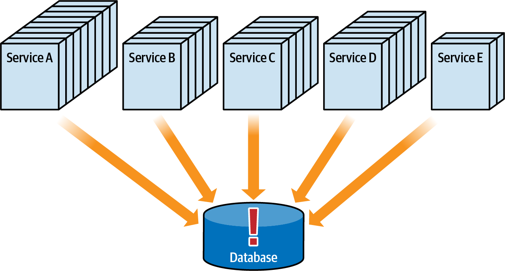

### Chapter 6: Pulling Apart Operational Data - Summary

This chapter tackles the complex and high-risk task of decomposing a monolithic database. It argues that while breaking apart a database is significantly harder than breaking apart application code, it is often necessary to achieve key architectural goals like scalability, fault tolerance, and team autonomy. The chapter presents a balanced, trade-off-based approach, introducing **Data Disintegrators** (drivers for breaking data apart) and **Data Integrators** (drivers for keeping data together).

The core of the chapter is a practical, iterative **five-step process** for safely migrating a monolithic database. This process leverages the concept of **Data Domains**—logical groupings of related database tables and artifacts—to methodically move data first into separate schemas and eventually into separate physical databases.

Finally, the chapter explores the modern world of **polyglot persistence**, providing a comprehensive overview and trade-off analysis of various database types (Relational, Key-Value, Document, Graph, etc.). This section equips architects with the knowledge to choose the optimal database technology for different parts of their system, moving beyond a one-size-fits-all approach.

---

### Data Decomposition Drivers

The decision to decompose a database is a trade-off analysis between two opposing sets of forces.


#### Data Disintegrators (Reasons to Split Data Apart)

1.  **Change Control:** In a shared database, a breaking change (e.g., altering a column) can impact dozens of services, requiring a difficult and risky coordinated deployment. Forgotten services will fail in production.
    
    *   **Solution: Bounded Context.** By splitting the database, each service (or group of services) owns its own data. Changes are isolated within that bounded context. Other services needing that data must ask the owning service, which provides a stable contract (e.g., JSON), abstracting them from the underlying database schema changes.
    

2.  **Connection Management:** In a distributed architecture, each service instance typically has its own connection pool. With a shared database, the total number of connections can quickly become saturated as services scale, leading to connection waits and timeouts.
    
    *   **Solution: Splitting the database** reduces the number of connections required for each individual database server, improving performance and stability.

3.  **Scalability:** A monolithic database can become a performance bottleneck. As services scale out, they place increasing load on the single database, which may not be able to keep up.
    
    *   **Solution: Database per service (or domain)** allows each database to be scaled independently according to the needs of its services.

4.  **Fault Tolerance:** A shared database is a single point of failure (SPOF). If the database goes down, every service that depends on it becomes non-operational.
    
    *   **Solution: Splitting the database** increases fault tolerance. If one database fails, only the services within that bounded context are affected; the rest of the system can continue to operate.

5.  **Architectural Quanta:** As discussed in Chapter 2, a shared database acts as a powerful static coupling point, forcing all services that use it into a single architectural quantum. This means they cannot have independent architectural characteristics.
    
    *   **Solution: Breaking the database apart** allows for the creation of multiple, independent architecture quanta.

6.  **Database Type Optimization:** A monolithic database forces a one-size-fits-all approach. However, different types of data are better suited to different types of databases (e.g., relational, document, graph).
    *   **Solution: Polyglot Persistence.** Breaking the database apart allows architects to choose the most optimal database technology for each specific data domain.

#### Data Integrators (Reasons to Keep Data Together)

1.  **Data Relationships:** Relational databases use artifacts like foreign keys, views, and triggers to enforce data integrity and create relationships between tables. These are powerful data integrators.
    
    *   **Problem:** When you split a database, these cross-domain relationships must be broken. Referential integrity can no longer be enforced by the database and must be managed at the application level, which is much more complex.

2.  **Database Transactions:** A monolithic database allows for ACID (Atomicity, Consistency, Isolation, Durability) transactions. A service can update multiple tables as a single, atomic unit of work.
    
    *   **Problem:** When data is split across multiple databases, a single ACID transaction is no longer possible. This requires implementing complex distributed transaction patterns (like Sagas, discussed in Chapter 12), which introduces significant complexity and moves to an eventual consistency model.

---

### Decomposing Monolithic Data: The Five-Step Process

This is an evolutionary and iterative process for safely breaking apart a monolithic database.


#### The Data Domain Concept

A **data domain** is a collection of coupled database artifacts (tables, views, foreign keys) that are related to a particular business domain. The first step is to identify these domains.


#### The Steps

*   **Step 1: Analyze Database and Create Data Domains.**
    *   **Start State:** All services access all tables in a single shared database.
    *   **Action:** Analyze the existing tables and group them into logical data domains based on business functionality (e.g., Customer, Payment, Ticketing).
    

*   **Step 2: Assign Tables to Data Domains (via Schemas).**
    *   **Action:** Create a new schema in the database for each data domain and move the corresponding tables into it (e.g., `ALTER SCHEMA payment TRANSFER sysops.billing;`). This is a logical, not physical, separation. Cross-schema access still exists.
    

*   **Step 3: Separate Database Connections to Data Domains.**
    *   **Action:** This is the hardest step. Refactor the application code. Each service must now connect *only* to the schema for the data it owns. If it needs data from another domain, it must make a service call to the owning service. All direct cross-schema database access is eliminated.
    

*   **Step 4: Move Schemas to Separate Database Servers.**
    *   **Action:** Physically move each schema to its own dedicated database server. This can be done via backup/restore (requiring downtime) or replication (no downtime, more complex).
    

*   **Step 5: Switch Over to Independent Database Servers.**
    *   **Action:** Switch the service connections to point to the new, independent database servers. Decommission the old monolithic database. The migration is complete.
    

---

### Selecting a Database Type (Polyglot Persistence)

Once data is separated, architects can choose the best database for each domain. The chapter provides a trade-off analysis for various database types.

| Database Type   | Popular Products                       | Key Characteristics                                                                      |
| --------------- | -------------------------------------- | ---------------------------------------------------------------------------------------- |
| **Relational**  | PostgreSQL, Oracle, SQL Server         | ACID transactions, flexible modeling, SQL. Mature and well-understood. Scales vertically. |
| **Key-Value**   | Redis, DynamoDB, Riak KV               | Simple `get/put/delete` operations. Highly scalable and performant for simple lookups.   |
| **Document**    | MongoDB, Couchbase                     | Stores JSON/XML documents. Flexible schema, good for aggregate-oriented data. Popular.     |
| **Column Family** | Cassandra, Scylla                      | Wide-column store, handles sparse data well. Excellent for high-write-volume scenarios.   |
| **Graph**         | Neo4j, Tiger Graph                     | Models data as nodes and relationships. Optimized for traversing complex connections.      |
| **NewSQL**        | CockroachDB, VoltDB, MemSQL            | Combines the scalability of NoSQL with the ACID guarantees and SQL of relational DBs.    |
| **Cloud Native**  | Snowflake, Datomic, AWS Redshift       | Managed cloud services, reduce operational burden, often specialized for analytics.     |
| **Time Series**   | InfluxDB, TimescaleDB                  | Optimized for append-only, time-stamped data. Used for monitoring, IoT, analytics.       |

*(Star-rating figures for each database type are included below, summarizing trade-offs for learning curve, data modeling, scalability, consistency, etc.)*


---

### Sysops Squad Saga: Polyglot Databases

The team decides the `Survey` data domain is a good candidate for migrating from a relational to a document database. After getting business justification (the relational model was slow to change and hindered marketing's agility), they analyze two data modeling options.

1.  **Single Aggregate:** Store the survey and all its questions in a single JSON document.
    *   **Pro:** Very easy for the UI to retrieve and render.
    *   **Con:** Question data is duplicated across every survey document.
    ```json
    // Example 6-3: JSON for a single aggregate survey document.
    {
        "survey_id": "19999",
        "description": "Survey to gauge customer...",
        "questions": [
            { "question_id": "50001", "question": "Rate the expert", ... },
            { "question_id": "50000", "question": "Did the expert fix the problem?", ... }
        ]
    }
    ```

2.  **Split Aggregate:** Store surveys and questions in separate documents, with the survey referencing question IDs.
    *   **Pro:** Questions are not duplicated and can be reused.
    *   **Con:** Requires the UI to make multiple database calls (one for the survey, then one for each question) to render the full survey.
    ```json
    // Example 6-4: JSON for a split aggregate design.
    // Survey aggregate
    {
        "survey_id": "19999",
        "description": "Survey to gauge customer...",
        "questions": [
            {"question_id": "50001", "order": "2"},
            {"question_id": "50000", "order": "1"}
        ]
    }
    // Question aggregates
    { "question_id": "50001", "question": "Rate the expert", ... }
    { "question_id": "50000", "question": "Did the expert fix the problem?", ... }
    ```

The team decides to go with the **single aggregate** model, trading off data duplication for improved UI performance and ease of change, and they document this decision in an ADR.

---

### Actionable Tips from Chapter 6

> **1. Justify Data Decomposition with Clear Drivers.** Don't break apart a database just because it's a "best practice." Build a solid business case using the data disintegrators (change control, scalability, fault tolerance, etc.) to justify the effort and risk.

> **2. Balance Disintegrators with Integrators.** Acknowledge the forces keeping data together. The need for strong transactional consistency and the complexity of breaking foreign key relationships are powerful integrators. The right answer is a trade-off, not an absolute.

> **3. Use the Five-Step Process for a Safe Migration.** Follow the iterative process of identifying domains, logically separating them with schemas, refactoring service connections, and only then physically moving them to new servers. This controls risk at each stage.

> **4. Think in Data Domains.** Use data domains as your primary unit of analysis for database decomposition. A data domain defines the bounded context for your data and is the precursor to a data-sovereign service.

> **5. Don't Reach Into Other Databases.** Once you've established data domains, enforce the rule that a service can only access the data it owns. If it needs other data, it must make an API call to the service that owns that data.

> **6. Embrace Polyglot Persistence.** Don't assume a relational database is the answer to everything. Analyze the specific needs of each data domain and choose the database type (Document, Graph, Key-Value, etc.) that provides the optimal set of trade-offs for that domain.

> **7. Document Data Architecture Decisions in an ADR.** Decisions about data are among the most critical and long-lasting. Use an ADR to capture the context, the decision (e.g., "Use a single aggregate document model for surveys"), the justification, and the consequences (e.g., "We accept data duplication to improve UI performance").
