### Chapter 7: Service Granularity - Summary

This chapter addresses one of the most challenging aspects of distributed architecture: determining the correct size, or **granularity**, of a service. It argues that decisions about granularity are often subjective and contentious, leading to analysis paralysis. To combat this, the chapter introduces a structured, objective framework based on two opposing forces: **Granularity Disintegrators** (drivers for breaking services into smaller parts) and **Granularity Integrators** (drivers for combining smaller services into a larger one).

The chapter provides a detailed catalog of drivers for each force. Disintegrators include factors like code volatility, differing scalability needs, and fault tolerance. Integrators include the need for database transactions, complex inter-service workflows, and shared domain code. The central theme is that getting granularity right is not about making services as small as possible, but about achieving an **equilibrium** between these forces. This is accomplished through a collaborative **trade-off analysis** with business stakeholders, where the architectural consequences of a decision are explicitly weighed against the business needs. The chapter concludes with detailed case studies from the Sysops Squad saga, demonstrating how to apply this framework and formalize the resulting decisions in an Architecture Decision Record (ADR).

---

### Modularity vs. Granularity

The chapter makes a key distinction between two often-confused terms:

*   **Modularity:** Concerns breaking a system into separate, independent parts. (This was covered in Chapter 3).
*   **Granularity:** Deals with the *size* and *scope* of those individual parts.

Most of the difficult challenges in distributed architectures are related to getting the granularity wrong.

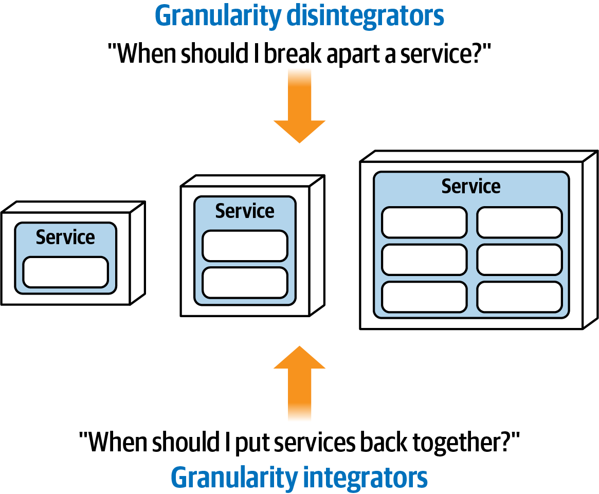

---

### Granularity Disintegrators (Reasons to Break a Service Apart)

These drivers help answer the question: "When should I consider breaking apart a service into smaller parts?"

#### 1. Service Scope and Function
This is about cohesion. Is the service doing one thing well, or is it a collection of loosely related functions?
*   **Good Candidate for Disintegration (Weak Cohesion):** A "Customer" service that handles profiles, preferences, and website comments. These are all related to the customer but are functionally distinct.
    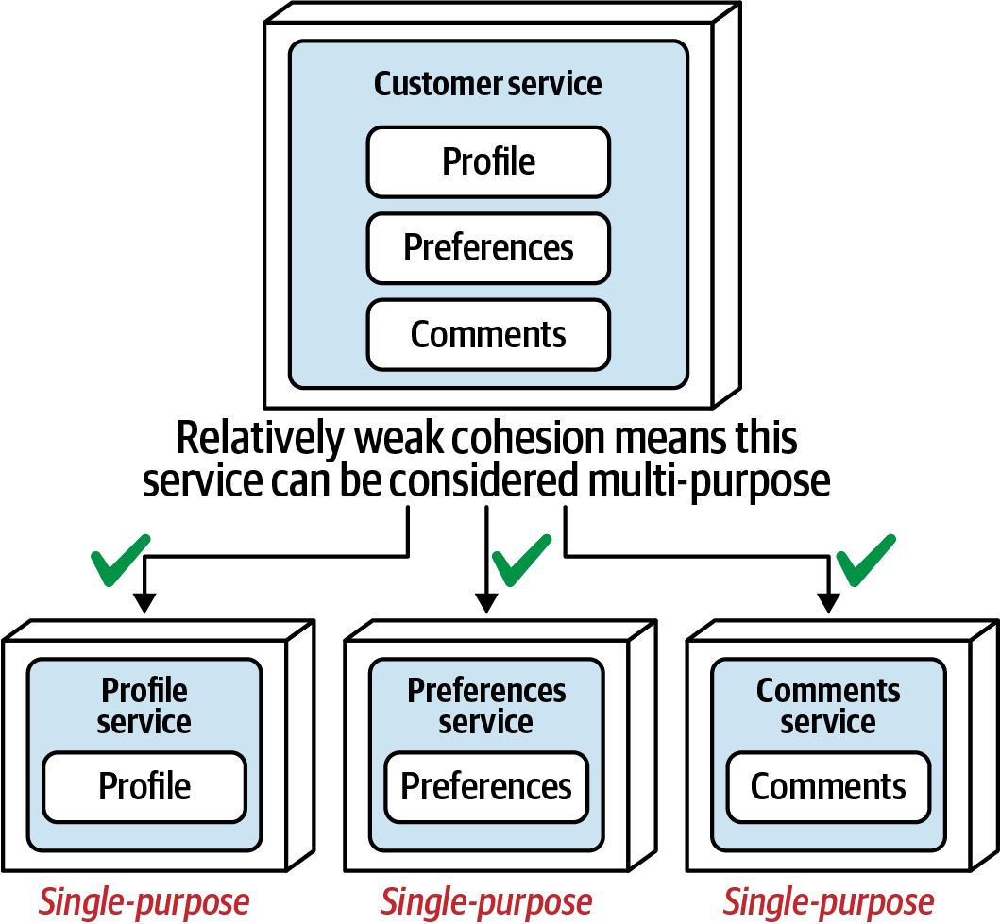
*   **Poor Candidate (Strong Cohesion):** A "Notification" service that sends SMS, email, and postal letters. While the methods differ, the core responsibility—notifying a customer—is a single, cohesive concept.
    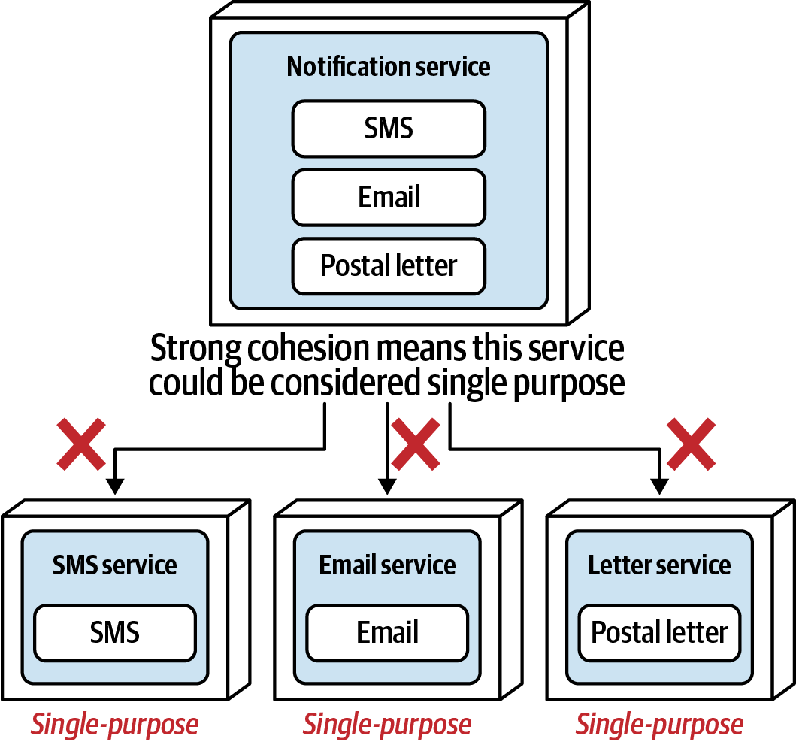

#### 2. Code Volatility
How often does the code for a specific function change? If one part of a service changes frequently while other parts are stable, it's a good candidate for separation.
*   **Example:** In the Notification service, if the postal letter logic changes weekly (due to evolving postal regulations) but the SMS/email logic rarely changes, the whole service must be re-tested and re-deployed for every small change.
*   **Solution:** Split the service. By creating a separate "Postal Letter Notification" service, changes are isolated, reducing testing scope and deployment risk for the stable electronic notification parts.
    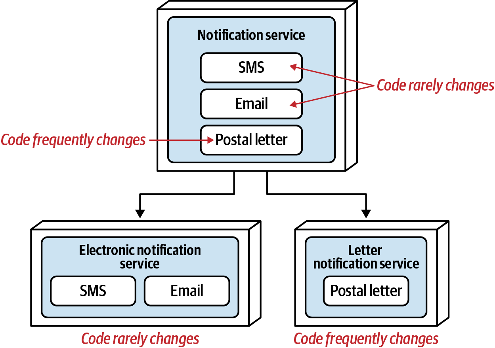

#### 3. Scalability and Throughput
Do different parts of the service have vastly different performance requirements?
*   **Example:** An SMS notification function might need to handle 220,000 requests/minute, while the postal letter function handles 1 request/minute. As a single service, the postal letter code must be deployed on infrastructure capable of handling the massive SMS load, which is inefficient and costly.
*   **Solution:** Split the service by function. This allows the "SMS Service" to scale independently on robust infrastructure, while the "Email Service" and "Letter Service" can run on smaller, less expensive infrastructure.
    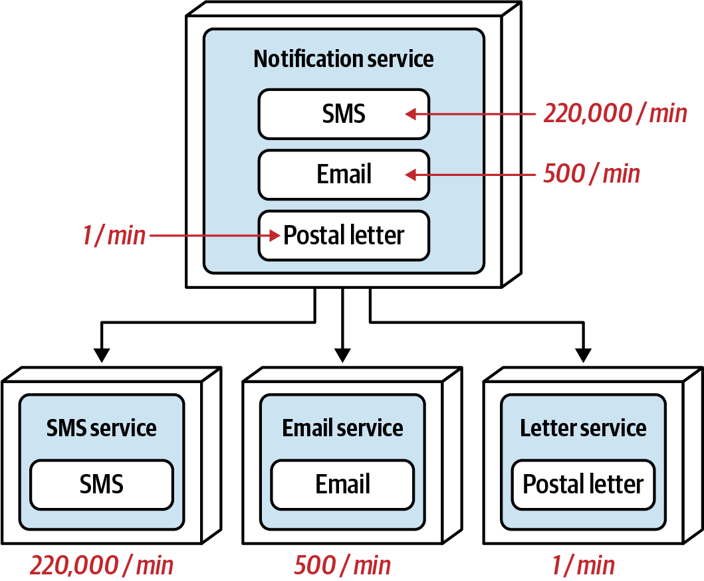

#### 4. Fault Tolerance
Can a failure in a non-critical part of the service bring down critical functionality?
*   **Example:** If the email functionality in the Notification service has a memory leak and crashes, the entire service fails, meaning critical SMS notifications also stop.
*   **Solution:** Split the service. By separating the functions, a crash in the "Email Service" does not impact the operation of the "SMS Service" or "Letter Service."
    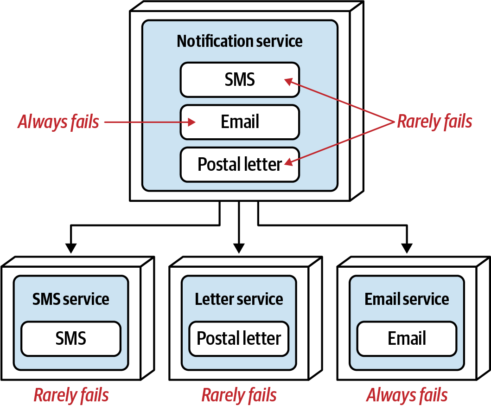

#### 5. Security
Does one part of the service handle highly sensitive data while other parts do not?
*   **Example:** A single "Customer Profile" service handles both basic profile information (name, address) and sensitive credit card data. Although API endpoints might differ, the code for both functions coexists in the same deployment unit, creating a larger attack surface and increasing risk.
*   **Solution:** Split the service. Creating a separate, highly secured "Credit Card Service" isolates the sensitive data and functionality, allowing for stricter access controls.
    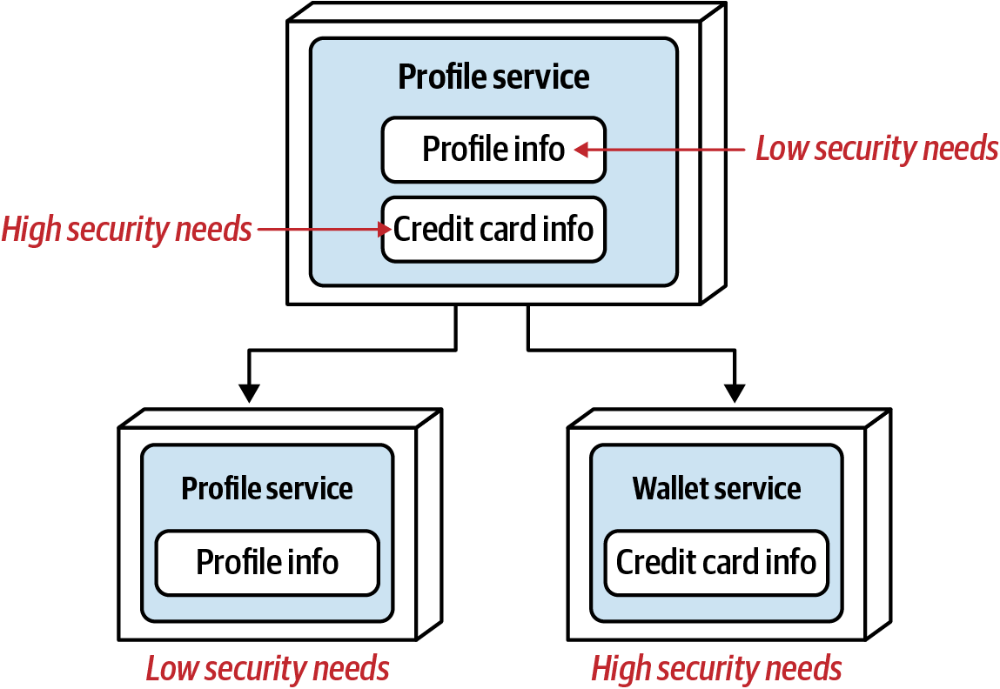

#### 6. Extensibility
Is it known that a service's context will grow over time?
*   **Example:** A "Payment" service initially handles Credit Cards, Gift Cards, and PayPal. The business plans to add ApplePay, reward points, and store credit in the future. Adding each new method to a single service requires re-testing and re-deploying all existing payment methods.
*   **Solution:** Split the service by payment method. Now, adding "ApplePay" is a matter of creating a new, independent "ApplePay Service," which can be developed, tested, and deployed with zero risk to the existing payment services.
    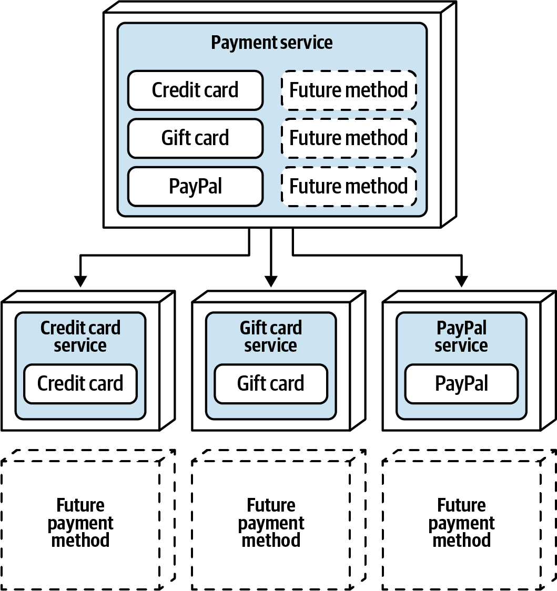

---

### Granularity Integrators (Reasons to Combine Services)

These drivers help answer the question: "When should I consider putting services back together?"

#### 1. Database Transactions
Is a single, atomic ACID transaction required across what would be separate services?
*   **Example:** A new customer registration process requires creating a `profile` record and a `password` record. If "Profile Service" and "Password Service" are separate, they have separate databases. The Profile service can succeed, but the Password service might fail, leaving inconsistent data (a profile with no password).
    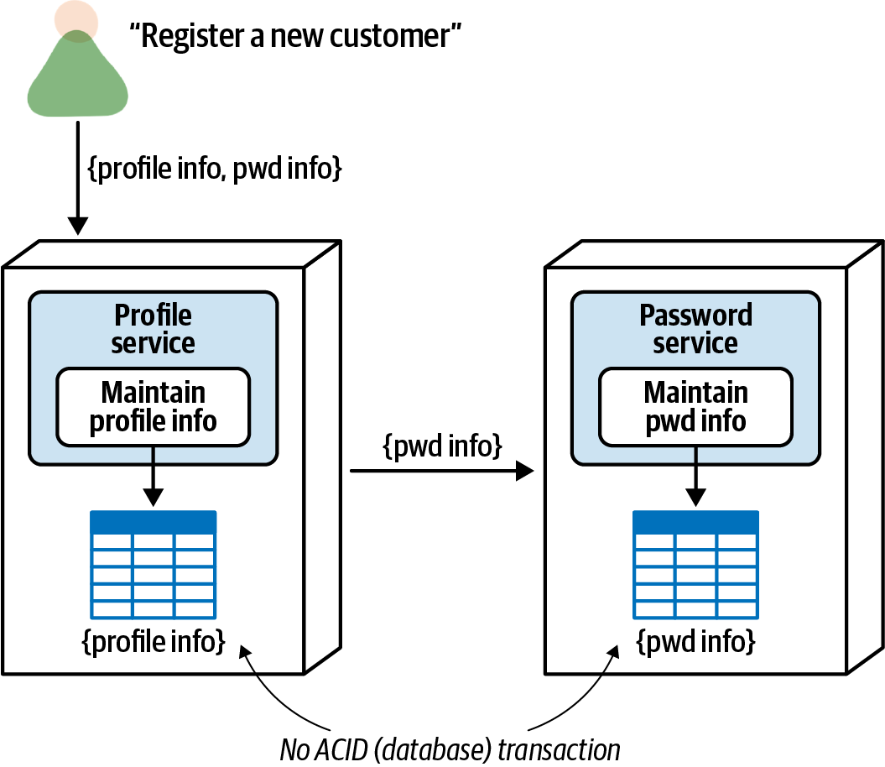
*   **Solution:** Combine the services. A single "Customer Service" can write to both tables within a single ACID transaction, guaranteeing that the operation is all-or-nothing.
    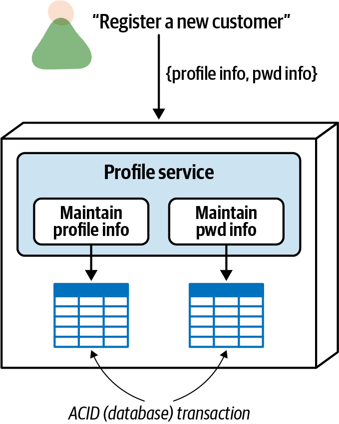

#### 2. Workflow and Choreography
Do the services need to communicate with each other constantly to fulfill a business request?
*   **Problem 1: Fault Tolerance.** If Service A calls B, and B calls C, a failure in C will cascade and cause A and B to fail as well. High levels of synchronous, chained calls negate the fault tolerance benefits of splitting services.
    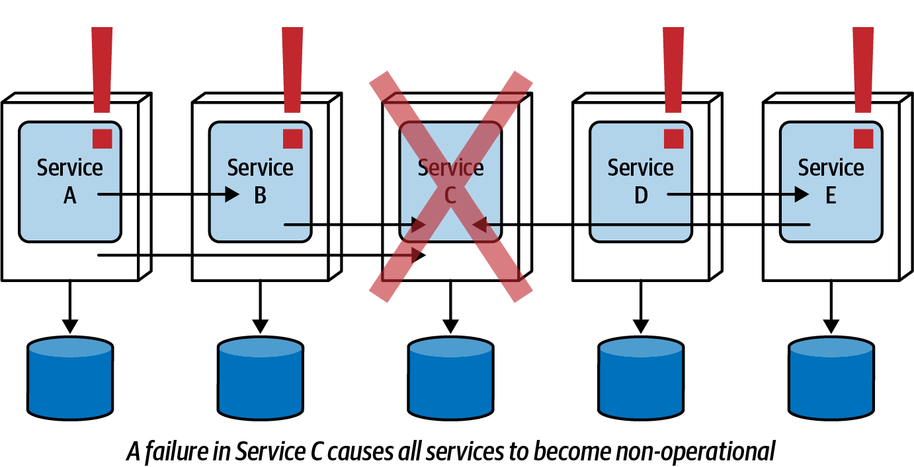
*   **Problem 2: Performance.** Each synchronous remote call adds network latency. A request that requires five separate service calls to complete can become unacceptably slow for the end user.
    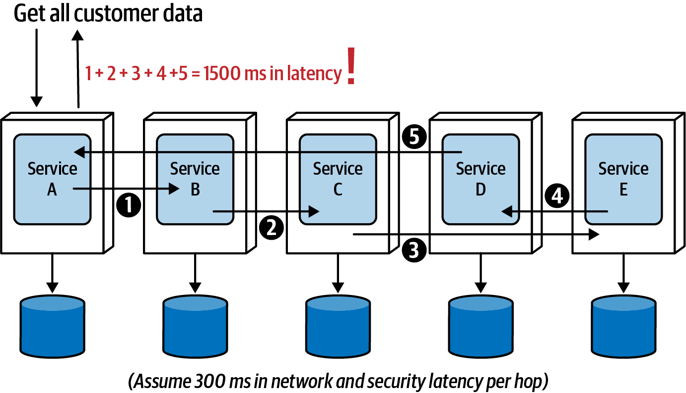
*   **Solution:** If services are too "chatty" and interdependent, combine them. This replaces slow, unreliable network calls with fast, reliable in-process calls.

#### 3. Shared Code
Do the services share a significant amount of common *domain* logic (not just utility code)?
*   **Problem:** Five separate services all depend on `shared-domain-library.jar`. When a defect is found in that library, all five services must be re-tested and re-deployed in a coordinated fashion. This creates a "distributed monolith" where the services are separately deployed but not independently deployable.
    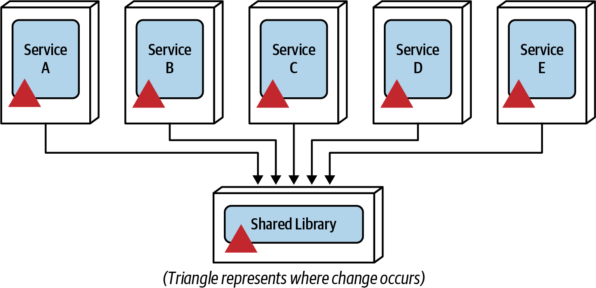
*   **Solution:** If the shared domain code is large, volatile, and tightly coupled to the services, consider combining them into a single service to simplify change management.

#### 4. Data Relationships
Do the functions you want to split have tightly coupled data dependencies?
*   **Example:** A service has functions A, B, and C. Function B owns `Table 3` but needs to read from `Table 5`. Function C owns `Table 5` but needs to read from `Table 3`.
    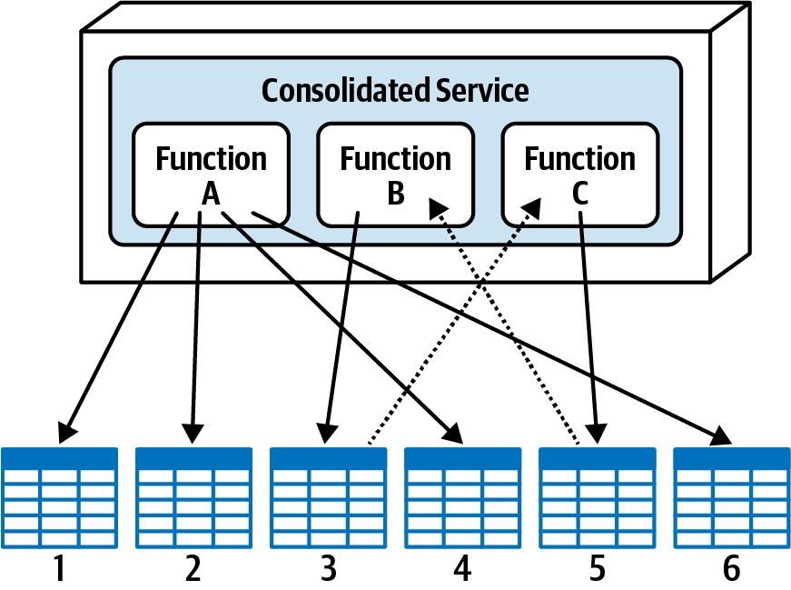
*   **Problem:** If you split them into Service B and Service C, each with its own database, they can no longer read each other's tables directly. Service B must constantly call Service C for data, and vice-versa. This creates a "chatty" workflow (see Integrator #2).
    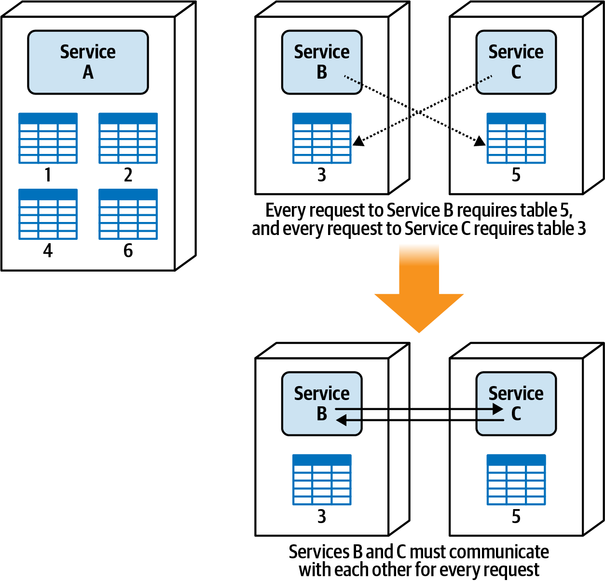
*   **Solution:** Consolidate the services. The tight data dependencies suggest that the functions belong together in a single service with a shared data model.

---

### Finding The Right Balance

Getting granularity right is about analyzing the trade-offs between these opposing forces and collaborating with business stakeholders to make an informed decision.

| Disintegrator Driver   | Reason for Applying Driver                        |
| ---------------------- | ------------------------------------------------- |
| **Service scope**      | Single-purpose services with tight cohesion       |
| **Code volatility**    | Agility (reduced testing scope and deployment risk) |
| **Scalability**        | Lower costs and faster responsiveness             |
| **Fault tolerance**    | Better Overall uptime                             |
| **Security access**    | Better Security access control to certain functions |
| **Extensibility**      | Agility (ease of adding new functionality)        |

| Integrator Driver      | Reason for Applying Driver                 |
| ---------------------- | ------------------------------------------ |
| **Database transactions** | Data integrity and consistency             |
| **Workflow**           | Fault tolerance, performance, and reliability |
| **Shared code**        | Maintainability                            |
| **Data relationships** | Data integrity and correctness             |

#### Trade-off Examples

*   **Example 1 (Agility vs. Consistency):** "We can split the service to isolate frequent changes (better agility), but we'll lose ACID transactions. Which is more important: faster time-to-market or stronger data consistency?"
*   **Example 2 (Security vs. Consistency):** "We can split the service for better security, but we can't guarantee an all-or-nothing registration. Which is more important: better security or stronger data consistency?"
*   **Example 3 (Extensibility vs. Performance):** "We can split the payment service to make it easier to add new payment types, but it will make checkout slower. Which is more important: agility in payments or a faster checkout experience?"

---

### Sysops Squad Sagas

#### Ticket Assignment Granularity

*   **Problem:** Should ticket *assignment* (complex algorithms) and ticket *routing* (sending the ticket to an expert's device) be one service or two?
    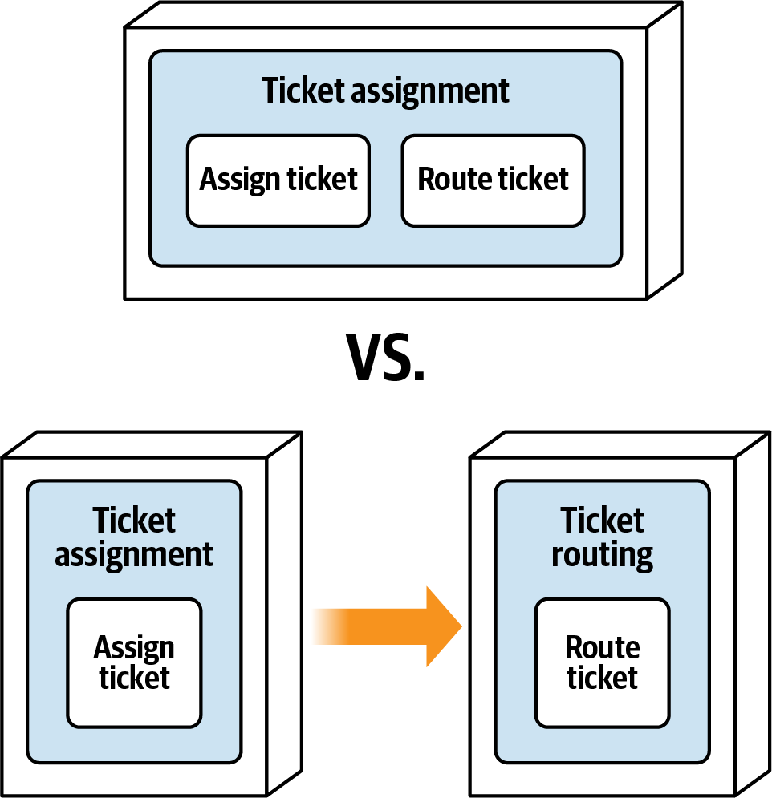
*   **Analysis:**
    *   **Disintegrator (Code Volatility):** The assignment algorithms change frequently, while routing logic is stable. This favors splitting.
    *   **Integrator (Workflow):** Assignment and routing are tightly bound. A ticket is assigned *then immediately routed*. If routing fails, a new assignment must be made. This creates a "chatty," synchronous workflow between the two potential services.
*   **Decision:** Combine them into a **single consolidated service**. The performance and reliability problems from the tight workflow were deemed more important than isolating the volatile code. The team agreed to use internal components (namespaces) to keep the code logically separate within the single service.
*   **ADR: Consolidated service for ticket assignment and routing**
    *   **Context:** Deciding between a single service or two separate services for ticket assignment and routing.
    *   **Decision:** We will create a single consolidated ticket assignment service.
    *   **Justification:** The two operations are tightly bound and synchronous. Performance, fault tolerance, and workflow control favor a single service. Scalability needs are identical for both functions.
    *   **Consequences:** Changes to either assignment or routing logic will require testing and deployment of the entire service, increasing scope and risk.

#### Customer Registration Granularity

*   **Problem:** Should customer registration (Profile, Credit Card, Password, Products) be one service, four separate services, or two services (secure vs. non-secure data)?
    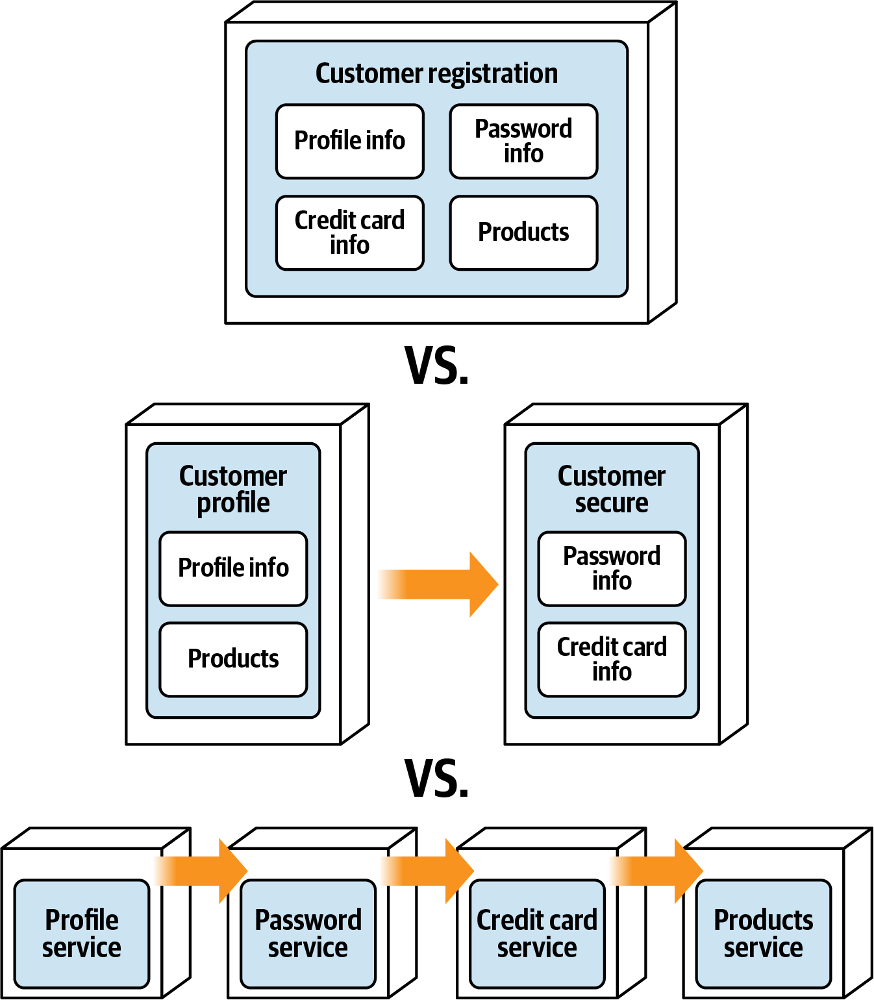
*   **Analysis:**
    *   **Disintegrator (Security):** Credit card and password data are highly sensitive. Separating them provides better security access control. This favors splitting.
    *   **Integrator (Database Transactions):** The business stakeholder (Parker) declared that customer registration *must* be an all-or-nothing, atomic operation. This is a hard requirement for an ACID transaction, which is impossible across separate services with separate databases.
*   **Decision:** Combine them into a **single consolidated service**. The business requirement for transactional integrity outweighed the architectural preference for separating services for security. The security risk was mitigated through other means (using the "Tortoise" security library at the API and service mesh layers).
*   **ADR: Consolidated service for customer-related functionality**
    *   **Context:** Deciding the granularity for services handling customer profile, credit card, password, and product data.
    *   **Decision:** We will create a single consolidated customer service for all four functions.
    *   **Justification:** The requirement for a single, atomic (ACID) transaction for customer registration and unsubscription is paramount. Security risks are acceptably mitigated by using the Tortoise security library.
    *   **Consequences:** Security access must be managed carefully within the single service. Testing scope and deployment risk are increased. The combined functionality must scale as a single unit.

---

### Actionable Tips from Chapter 7

> **1. Use the Disintegrator/Integrator Framework for Objective Analysis.** Replace gut feelings and subjective opinions ("micro means small") with a structured analysis of the opposing forces. This leads to better, more justifiable decisions.

> **2. Find the Equilibrium; Don't Just Maximize Disintegration.** The goal is not to create the smallest possible services. The goal is to find the right balance for your specific context by weighing the trade-offs between the disintegrators and integrators.

> **3. Prioritize Business Requirements for Transactions.** The need for a true ACID transaction is one of the strongest integrators. If a business process absolutely requires an atomic, all-or-nothing operation, you must keep that functionality within a single service boundary.

> **4. Beware of "Chatty" Services.** High-frequency, synchronous communication between services is a strong indicator that they are too granular. This workflow creates performance bottlenecks and brittle, cascading failures. When you see it, consider combining the services.

> **5. Isolate Volatility and Different Scalability Needs.** Code that changes frequently or has vastly different performance requirements from the rest of the service are prime candidates for being split into their own services. These are powerful and common disintegration drivers.

> **6. Treat Shared Domain Code as a Red Flag.** Shared libraries containing common *domain* logic (not utilities) create a distributed monolith. If multiple services rely heavily on the same shared domain code, it's a strong sign they should be integrated into a single service.

> **7. Formalize Granularity Decisions with ADRs.** Service granularity decisions have long-lasting consequences. Document the options considered, the final decision, and most importantly, the trade-offs that were accepted (e.g., "We accepted lower agility to guarantee transactional integrity").

