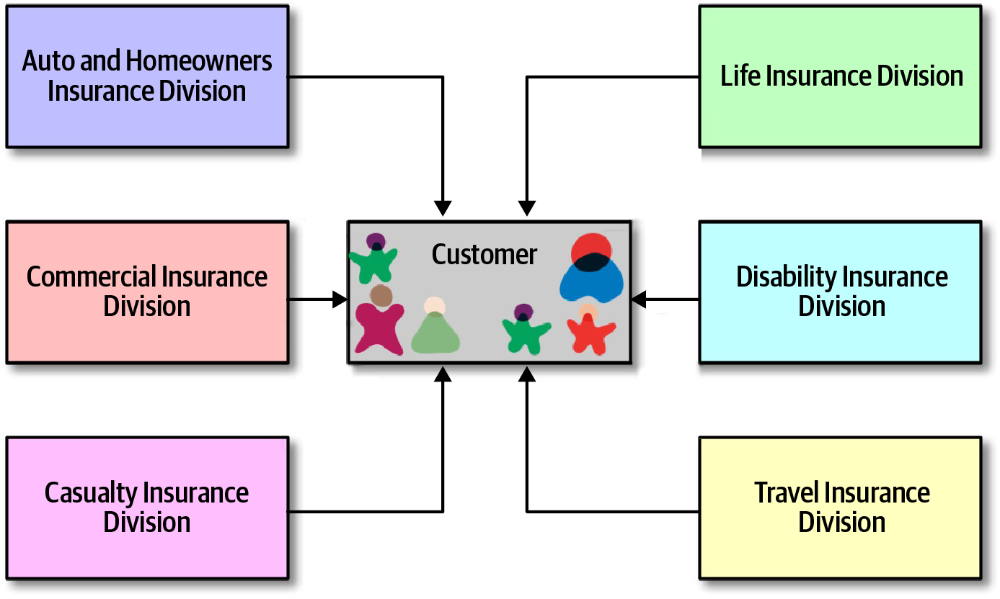

### Chapter 8: Reuse Patterns - Summary

This chapter tackles the complex and often contentious topic of code reuse in distributed architectures. It moves beyond simplistic mantras like "Don't Repeat Yourself" (DRY) or "share nothing," presenting a pragmatic, trade-off-based analysis of four primary reuse patterns: **Code Replication**, **Shared Libraries**, **Shared Services**, and **Sidecars (Service Mesh)**.

The chapter argues that the value of reuse is not absolute; its effectiveness is determined by the **rate of change** of the shared code. Coupling to stable, slow-changing assets (like frameworks or static utilities) is beneficial, while coupling to volatile, fast-changing domain logic creates a "distributed monolith" that is brittle and difficult to manage.

Each pattern is analyzed in detail, covering its advantages, disadvantages, and ideal use cases. Shared libraries offer versioning and compile-time safety but can lead to dependency management issues. Shared services centralize logic but introduce runtime coupling, impacting performance, scalability, and fault tolerance. Sidecars provide an elegant solution for sharing cross-cutting *operational* concerns (like logging and monitoring) while keeping domain logic decoupled. The chapter concludes with Sysops Squad case studies that demonstrate how to apply this trade-off analysis to make practical decisions about shared libraries vs. shared services and the proper use of a sidecar.

---

### Introduction: The Challenge of Reuse

In distributed architectures, code reuse is not as simple as importing a class. Naive sharing can lead to tight coupling that undermines the benefits of a distributed system. The chapter explores how to manage reuse effectively without creating a brittle, entangled architecture.


---

### 1. Code Replication

This technique involves copying shared code into each service's source code repository, avoiding any formal sharing mechanism.


While this approach perfectly preserves the bounded context of each service, it is highly risky. A bug fix or functional change requires manually finding and updating every copy of the code, which is error-prone and time-consuming.

#### Example: A Good Candidate for Replication

Simple, static marker annotations or attributes that contain no logic are good candidates for replication. They are unlikely to ever change or contain bugs.

```java
// Example 8-1: Source Code defining a service entry point annotation (Java)
@Retention(RetentionPolicy.RUNTIME)
@Target(ElementType.TYPE)
public @interface ServiceEntrypoint {}

/* Usage:
@ServiceEntrypoint
public class PaymentServiceAPI {
   ...
}
*/
```

```csharp
// Example 8-2: Source Code defining a service entry point attribute (C#)
[AttributeUsage(AttributeTargets.Class)]
class ServiceEntrypoint : Attribute {}

/* Usage:
[ServiceEntrypoint]
class PaymentServiceAPI {
   ...
}
*/
```

#### Trade-offs for Code Replication

| Advantages                       | Disadvantages                             |
| -------------------------------- | ----------------------------------------- |
| Preserves the bounded context    | Difficult to apply code changes           |
| No code sharing                  | Code inconsistency across services        |
| No versioning complexities       | No versioning capabilities across services |

*   **When to Use:** Use with extreme caution for simple, truly static code (like marker annotations or one-off utilities) that is highly unlikely to ever change.

---

### 2. Shared Library

This is the most common technique, where shared code is packaged into an external artifact (e.g., JAR, DLL) and bound to each service at compile-time.


#### Granularity Trade-offs

*   **Coarse-Grained (e.g., `SharedStuff.jar`):** This approach uses a single, large library for all shared code.
    *   **Pro:** Simple dependency management (everyone depends on one thing).
    *   **Con:** Terrible change control. A change to any part of the library forces *all* dependent services to re-test and re-deploy, even if the change is irrelevant to them.
    
*   **Fine-Grained (e.g., `Security.jar`, `Formatters.jar`):** This approach breaks shared code into smaller, functionally-cohesive libraries.
    *   **Pro:** Excellent change control. A change to the `Calculators.jar` only impacts services that actually use it.
    *   **Con:** Complex dependency management. With hundreds of services and dozens of libraries, the dependency matrix can become a mess.
    
*   **Advice:** Favor **fine-grained libraries** to optimize for change control over dependency management.

#### Versioning Strategies
Versioning is critical for shared libraries to provide agility and backward compatibility.

*   **Complexities:** Versioning is hard. It requires clear communication about changes and a well-defined deprecation strategy for old versions.
*   **Deprecation:** A global strategy (e.g., "only support 4 versions back") is simple but can cause churn for frequently-changing libraries. A custom, per-library strategy is more flexible but harder to manage.
*   **Advice:** Always use versioning, but avoid depending on the `LATEST` tag, as it can introduce unexpected breaking changes during emergency deployments.

#### Trade-offs for Shared Libraries

| Advantages                               | Disadvantages                                |
| ---------------------------------------- | -------------------------------------------- |
| Ability to version changes (provides agility) | Dependencies can be difficult to manage     |
| Shared code is compile-based, reducing runtime errors | Code duplication in heterogeneous codebases |
| Good agility for shared code changes     | Version deprecation can be difficult         |
|                                          | Version communication can be difficult       |

*   **When to Use:** The best approach for homogeneous environments where the rate of change for shared code is low to moderate.

---

### 3. Shared Service

This technique places shared functionality into its own separately deployed service, which other services call at runtime.


#### Trade-offs

*   **Change Risk:** Changes are easy to deploy (just update the shared service), but they are **runtime changes**. A bug in the shared service can instantly bring down the entire system. Versioning becomes much harder, often requiring messy API endpoint versioning.
    
    
*   **Performance:** Every call to the shared service incurs network and security latency, making it much slower than an in-process call to a shared library.
    
*   **Scalability:** The shared service becomes a bottleneck and must be scaled to handle the combined load of all services that depend on it.
    
*   **Fault Tolerance:** The shared service is a single point of failure. If it goes down, all dependent services become non-operational.
    

#### Trade-offs for Shared Services

| Advantages                                  | Disadvantages                                              |
| ------------------------------------------- | ---------------------------------------------------------- |
| Good for high code volatility (frequent changes) | Versioning changes can be difficult                     |
| No code duplication in heterogeneous codebases | Performance is impacted due to latency                  |
| Preserves the bounded context               | Fault tolerance and availability issues due to dependency |
| No static code sharing                      | Scalability and throughput issues due to dependency        |
|                                             | Increased risk due to runtime changes                      |

*   **When to Use:** Good for polyglot environments and for shared functionality that changes very frequently. Be aware of the significant operational downsides.

---

### 4. Sidecars and Service Mesh

This pattern provides a solution for sharing cross-cutting **operational** concerns (logging, monitoring, security, circuit breakers) without coupling them to the domain logic.

*   **The Problem:** How do you enforce consistent logging or security across all services without forcing every team to manage the same dependencies?
*   **The Solution (Sidecar Pattern):** The operational logic is placed in a separate component (the "sidecar") that is deployed alongside every service instance. This is inspired by the Hexagonal (or Ports and Adaptors) Architecture.
    
*   **Service Mesh:** When every service has a sidecar, the sidecars can communicate with each other over a dedicated control plane, forming a **service mesh**. This allows for centralized operational control and observability.
    

The key distinction is that a sidecar is for **operational coupling**, not domain coupling. You would put logging and authentication in a sidecar, but you would *not* put a shared `Customer` class in it.

#### Trade-offs for Sidecars / Service Mesh

| Advantages                                       | Disadvantages                                |
| ------------------------------------------------ | -------------------------------------------- |
| Offers a consistent way to create isolated coupling | Must implement a sidecar per platform        |
| Allows consistent infrastructure coordination    | Sidecar component may grow large/complex     |
| Ownership can be centralized or shared           |                                              |

*   **When to Use:** The ideal pattern for managing cross-cutting operational concerns in a distributed architecture, especially microservices.

---

### Sysops Squad Sagas

#### 1. Common Infrastructure Logic
*   **Problem:** Different services and libraries are producing inconsistent, duplicated log messages. How should operational concerns like logging be handled consistently?
*   **Decision:** Use a **sidecar and service mesh**.
*   **ADR: Using a Sidecar for Operational Coupling**
    *   **Context:** Services require consistent operational behavior (monitoring, logging, security).
    *   **Decision:** We will use a sidecar component with a service mesh to consolidate shared operational coupling. A central infrastructure team will own the sidecar.
    *   **Consequences:** Domain classes must not be added to the sidecar to avoid inappropriate coupling.

#### 2. Shared Domain Functionality
*   **Problem:** Three new ticketing services (Creation, Assignment, Completion) all share common database access logic. Should this logic be in a **shared service** or a **shared library**?
    
    
*   **Analysis (Trade-offs):**
    *   **Shared Service:** Would introduce significant performance and fault tolerance issues (especially for the customer-facing Ticket Creation service) and increased risk from runtime changes. The shared code was found to be stable, so the main benefit of a shared service (agility for frequent changes) did not apply.
    *   **Shared Library:** Avoids the performance and reliability issues. Since the code is stable, the downside (re-deploying services for a change) is minimal.
*   **Decision:** Use a **shared library (DLL)**.
*   **ADR: Use of a shared library for common ticketing database logic**
    *   **Context:** Deciding how to share common database logic for the three ticketing services.
    *   **Decision:** We will use a shared library.
    *   **Justification:** This approach improves performance, scalability, and fault tolerance. The shared code is stable, minimizing the impact of change control.
    *   **Consequences:** Changes to the shared library will require the ticketing services to be re-tested and re-deployed.

---

### When Does Reuse Add Value?

The chapter concludes with a critical insight: the value of reuse depends on the rate of change.

> **Reuse is derived via abstraction but operationalized by slow rate of change.**

Architects in the early SOA era mistakenly tried to reuse everything, including highly volatile domain concepts like "Customer," leading to brittle, complex systems.



We benefit from reusing things that are stable (operating systems, frameworks, static utilities). Coupling to things that change frequently creates brittleness. The goal is to identify stable components for reuse and find other patterns for volatile ones.


