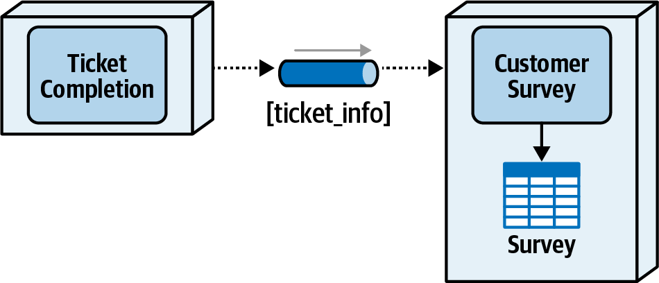

### Chapter 9: Data Ownership and Distributed Transactions - Summary

This chapter addresses the critical challenges that arise *after* a monolithic database has been decomposed: re-establishing data ownership and managing transactions that span multiple services. It demonstrates that assigning data ownership is a complex architectural task, moving beyond the simple rule that "the service that writes the data, owns the data." The chapter provides a framework for analyzing and resolving three key ownership scenarios: **Single Ownership**, **Common Ownership**, and **Joint Ownership**.

For the most difficult scenario, joint ownership, the chapter details four resolution patterns: **Table Split**, **Data Domain**, **Delegation**, and **Service Consolidation**, each with a thorough trade-off analysis.

The second half of the chapter contrasts traditional **ACID** (Atomicity, Consistency, Isolation, Durability) transactions with the **BASE** (Basic Availability, Soft state, Eventual consistency) properties of distributed transactions. It explains why true ACID properties are impossible across separate services and introduces three practical patterns for achieving eventual consistency: **Background Synchronization**, the **Orchestrated Request-Based** pattern, and the **Event-Based** pattern. The chapter concludes with the Sysops Squad saga, showing how to apply these concepts to make concrete data ownership decisions and formalize them in an Architecture Decision Record (ADR).

---

### Assigning Data Ownership

Once data is physically separated, services must be assigned ownership over specific tables. This is crucial for establishing clear bounded contexts.

> **Tip:** The general rule-of-thumb for data ownership is that the service that performs write operations to a table is the owner of that table. However, joint ownership makes this simple rule complex!


#### 1. Single Ownership Scenario

This is the simplest case, where only one service writes to a table.
*   **Example:** The `Wishlist` service is the only one that writes to the `Wishlist` table.
*   **Resolution:** The `Wishlist` service becomes the unambiguous owner of the `Wishlist` table, forming a clear bounded context.


#### 2. Common Ownership Scenario

This occurs when most or all services need to write to the same table.
*   **Example:** The `Wishlist`, `Catalog`, and `Inventory` services all need to write to the `Audit` table.
*   **Resolution:** Create a new, dedicated service (e.g., an `Audit Service`) that becomes the sole owner of the common table. Other services send data to this dedicated service (often asynchronously via a persistent queue) which then performs the write operation. This avoids re-creating a shared database.


#### 3. Joint Ownership Scenario

This common and complex scenario occurs when a few services, typically within the same domain, write to the same table.
*   **Example:** The `Catalog` service inserts and updates product information in the `Product` table, while the `Inventory` service updates the inventory count in the same table.


Four techniques can be used to resolve this.

---

### Techniques for Resolving Joint Ownership

#### a. Table Split Technique

Break the single shared table into multiple tables, giving each service ownership over its specific data.
*   **Example:** Split the `Product` table. The `Catalog` service owns the new `Product` table (with static info), and the `Inventory` service owns a new `Inventory` table (with `product_id` and `inv_cnt`).
    ```sql
    -- Example 9-1: DDL source code for splitting up the Product table
    CREATE TABLE Inventory (
      product_id VARCHAR(10),
      inv_cnt INT
    );

    INSERT INTO Inventory VALUES (product_id, inv_cnt)
      AS SELECT product_id, inv_cnt FROM Product;

    COMMIT;

    ALTER TABLE Product DROP COLUMN inv_cnt;
    ```
*   **Result:** This converts joint ownership to single ownership but introduces the need for data synchronization between the services, forcing a trade-off between consistency and availability.


| Advantages                     | Disadvantages                              |
| ------------------------------ | ------------------------------------------ |
| Preserves bounded context      | Tables must be altered and restructured    |
| Single data ownership          | Possible data consistency issues           |
|                                | No ACID transaction between table updates  |
|                                | Data synchronization is difficult          |
|                                | Data replication between tables may occur  |

#### b. Data Domain Technique

The services share ownership of the table by placing it in a common schema or database, forming a broader bounded context.
*   **Result:** This resolves performance and consistency issues by allowing direct database access, but it breaks the principle of a tight bounded context. Changes to the shared schema now require coordination between all owning services, increasing risk and testing scope.

> **Tip:** When choosing the data domain technique, always re-evaluate why separate services are needed since the data is common to each of the services. Justifications might include scalability differences, fault tolerance needs, throughput differences, or isolating code volatility (see Chapter 7).


| Advantages                        | Disadvantages                                |
| --------------------------------- | -------------------------------------------- |
| Good data access performance      | Data schema changes involve more services    |
| No scalability and throughput issues | Increased testing scope for data schema changes |
| Data remains consistent           | Data ownership governance (write responsibility) |
| No service dependency             | Increased deployment risk for data schema changes |

#### c. Delegate Technique

One service is assigned as the single owner (the "delegate"), and other services must communicate with it to perform updates on their behalf.
*   **Choosing the Delegate:**
    1.  **Primary Domain Priority:** The service that handles most of the primary CRUD operations owns the table (e.g., `Catalog Service` owns `Product` table). This is generally preferred.
    2.  **Operational Characteristics Priority:** The service with higher performance/scalability needs owns the table (e.g., `Inventory Service` owns `Product` table because inventory updates are more frequent).
*   **Result:** This establishes single ownership but creates tight service coupling and introduces performance and fault tolerance issues for the non-owning services, which must now make remote calls for data updates.


| Advantages                               | Disadvantages                                |
| ---------------------------------------- | -------------------------------------------- |
| Forms single table ownership           | High level of service coupling               |
| Good data schema change control          | Low performance for non-owner writes         |
| Abstracts data structures from other services | No atomic transaction for non-owner writes |
|                                          | Low fault tolerance for non-owner services   |

#### d. Service Consolidation Technique

Combine the services that jointly own the table into a single, more coarse-grained service.
*   **Result:** This moves joint ownership to single ownership and resolves all data dependency and performance issues. However, it creates a larger service, which can negatively impact scalability (all parts must scale together), fault tolerance (all parts fail together), testing scope, and deployment risk.


| Advantages                     | Disadvantages                    |
| ------------------------------ | -------------------------------- |
| Preserves atomic transactions  | More coarse-grained scalability  |
| Good overall performance       | Less fault tolerance             |
|                                | Increased deployment risk        |
|                                | Increased testing scope          |

---

### Distributed Transactions: ACID vs. BASE

Once ownership is established, transactions spanning multiple services become a key challenge.

#### ACID Transactions
ACID (Atomicity, Consistency, Isolation, Durability) properties define a traditional, single-database transaction. All operations succeed or all fail as a single unit of work.


#### BASE Transactions (Distributed)
In a distributed architecture, a business request spanning multiple services is a **distributed transaction** and **cannot be ACID**. Instead, it has **BASE** properties:
*   **B**asic **A**vailability: The system is expected to be available.
*   **S**oft State: The overall state of the business request is in flux and not complete until all services finish.
*   **E**ventual Consistency: Given enough time, all data sources involved in the transaction will become consistent.


---

### Eventual Consistency Patterns

These patterns are used to resolve the inconsistencies inherent in distributed transactions. Consider a customer unsubscribing, which requires data to be removed from `Profile`, `Contract`, and `Billing` tables, owned by separate services.


#### 1. Background Synchronization Pattern

A separate process (e.g., a nightly batch job) periodically scans the data sources and synchronizes them.
*   **Pros:** Good responsiveness for the user; services are decoupled.
*   **Cons:** Very slow to reach consistency. The background process is tightly coupled to all data sources, **breaking their bounded contexts** and duplicating business logic. This is generally a poor choice for modern distributed architectures.


| Advantages                | Disadvantages                         |
| ------------------------- | ------------------------------------- |
| Services are decoupled    | Data source coupling                  |
| Good responsiveness       | Complex implementation                |
|                           | Breaks bounded contexts               |
|                           | Business logic may be duplicated      |
|                           | Slow eventual consistency             |

#### 2. Orchestrated Request-Based Pattern

An orchestrator service manages the entire transaction during the business request, calling each participating service in sequence or parallel.
*   **Pros:** Data consistency is achieved quickly; services remain decoupled.
*   **Cons:** Slower responsiveness for the user. Error handling is extremely complex (requires compensating transactions).


| Advantages                     | Disadvantages                         |
| ------------------------------ | ------------------------------------- |
| Services are decoupled         | Slower responsiveness                 |
| Timeliness of data consistency | Complex error handling                |
| Atomic business request        | Usually requires compensating transactions |

#### 3. Event-Based Pattern

The initiating service performs its action and then publishes an event (e.g., `CustomerUnsubscribed`). Other interested services subscribe to this event and process it asynchronously. This is a very popular and reliable pattern.
*   **Pros:** Very fast responsiveness; services are highly decoupled; consistency is achieved quickly.
*   **Cons:** Error handling is still complex and often relies on a dead-letter queue (DLQ) for failed events, which may require manual intervention.


| Advantages                     | Disadvantages          |
| ------------------------------ | ---------------------- |
| Services are decoupled         | Complex error handling |
| Timeliness of data consistency |                        |
| Fast responsiveness            |                        |

---

### Sysops Squad Saga: Data Ownership

#### 1. Single Table Ownership
*   **Problem:** How to assign ownership when one service writes to a table (e.g., `User Maintenance Service` updates the `Expert Profile` table) and another needs frequent read access (e.g., `Ticket Assignment Service`).
*   **Decision:** The service that **writes** to the table is the owner.
*   **ADR: Single table ownership for bounded contexts**
    *   **Decision:** When only one service writes to a table, that table is owned by that service. Other services needing read-only access cannot connect directly to the database but must go through the owning service's API.
    *   **Consequences:** Services requiring read-only access may incur performance and fault tolerance issues.

#### 2. Joint Table Ownership
*   **Problem:** Both the `Ticket Completion Service` and the `Survey Service` need to write to the `Survey` table. This is a joint ownership scenario.
*   **Analysis:** A shared data domain won't work because a service cannot connect to two different schemas. A table split is not feasible. This leaves the delegate technique.
*   **Decision:** Use the **delegate technique**. The `Survey Service` will be the single owner of the `Survey` table. The `Ticket Completion Service` already sends a message to the Survey Service to start the survey process; it will now pass the necessary data in that message payload, delegating the database write to the Survey Service.
*   **ADR: Survey service owns the survey table**
    *   **Decision:** The Survey Service will be the single owner of the Survey table. The Ticket Completion Service will delegate its write operation by passing the data in the event it already sends.
    *   **Consequences:** The event payload is now larger. The creation of the survey record is now decoupled from the ticket completion process.


