# AWS Solutions Architect Associate (SAA-C03) — Complete Study Plan

> [!IMPORTANT]
> This plan covers **all 14 modules** from the KodeKloud course (300+ lessons) mapped into a **12-week intensive schedule**.
> Every module includes **theory → demo replay → hands-on lab on real AWS** progression.
> Estimated total effort: **~250–300 hours** (theory + labs + review).

---

10. ## Table of Contents
11: 
12: 1. [Pre-Requisites & AWS Account Setup](#1-pre-requisites--aws-account-setup)
13: 2. [Week 1–2: Networking (VPC)](#2-week-12-networking-vpc)
14: 3. [Week 3: Storage (EBS, EFS, S3)](#3-week-3-storage-ebs-efs-s3)
15: 4. [Week 4: Compute (EC2, Lambda, Containers)](#4-week-4-compute-ec2-lambda-containers)
16: 5. [Week 5: Databases](#5-week-5-databases)
17: 6. [Week 6: Application Integration](#6-week-6-application-integration)
18: 7. [Week 7: Data & ML Services](#7-week-7-data--ml-services)
19: 8. [Week 8: Migration & Transfer + Management & Governance](#8-week-8-migration--transfer--management--governance)
20: 9. [Week 9: Security Services](#9-week-9-security-services)
21: 10. [Week 10: Designing for Security](#10-week-10-designing-for-security)
22: 11. [Week 11: Designing for Reliability + Performance + Cost](#11-week-11-designing-for-reliability--performance--cost)
23:     * [11.1 Reliability Design](#111-reliability-design)
24:     * [11.2 Performance Design](#112-performance-design)
25:     * [11.3 Cost Optimization Design](#113-cost-optimization-design)
26:     * [11.4 Data Transfer Cost Deep Dive](#114-data-transfer-cost-deep-dive-exam-critical)
27:     * [11.5 Well-Architected Framework Integration](#115-well-architected-framework-integration)
28:     * [11.6 Week 11 Hands-On Labs](#116-hands-on-labs-real-aws)
29:     * [11.7 Capstone Lab 1: Full Production Architecture](#117-capstone-lab-full-production-architecture)
30:     * [11.8 Capstone Lab 2: Serverless Event-Driven Order Processing](#118-capstone-lab-2-serverless-event-driven-order-processing)
31:     * [11.9 Capstone Lab 3: Multi-Region Active-Active with Global Routing](#119-capstone-lab-3-multi-region-active-active-with-global-routing)
32:     * [11.10 Capstone Lab 4: Serverless Data Lake & Analytics Pipeline](#1110-capstone-lab-4-serverless-data-lake--analytics-pipeline)
33:     * [11.11 Capstone Lab 5: Disaster Recovery — Pilot Light to Warm Standby](#1111-capstone-lab-5-disaster-recovery--pilot-light-to-warm-standby)
34:     * [11.12 Capstone Lab 6: Containerised Microservices with ECS Fargate](#1112-capstone-lab-6-containerised-microservices-with-ecs-fargate)
35:     * [11.13 Capstone Lab 7: Security-Hardened Environment & Compliance Audit](#1113-capstone-lab-7-security-hardened-environment--compliance-audit)
36:     * [11.14 Capstone Lab 8: Hybrid Storage Migration Pipeline](#1114-capstone-lab-8-hybrid-storage-migration-pipeline)
37:     * [11.15 Capstone Lab 9: High-Performance Computing (HPC) Batch Processing](#1115-capstone-lab-9-high-performance-computing-hpc-batch-processing)
38: 12. [Week 12: Design Challenges + Mock Exams](#12-week-12-design-challenges--mock-exams)
39: 13. [Lab Cost Management Strategy](#13-lab-cost-management-strategy)
40: 14. [Exam Day Checklist](#14-exam-day-checklist)
41: 15. [Appendix A: High-Frequency Exam Topics Cheat Sheet](#appendix-a-high-frequency-exam-topics-cheat-sheet)
42: 16. [Appendix B: Service Decision Trees](#appendix-b-service-decision-trees)
43: 17. [Appendix C: Troubleshooting Scenarios](#appendix-c-troubleshooting-scenarios)
44: 
45: ---

## 1. Pre-Requisites & AWS Account Setup

### 1.1 Create AWS Free-Tier Account

| Step | Action | Details |
|------|--------|---------|
| 1 | Sign up | [aws.amazon.com/free](https://aws.amazon.com/free) — requires credit card |
| 2 | Enable MFA | IAM → Root account → Assign MFA device (use Google Authenticator) |
| 3 | Create admin IAM user | IAM → Users → `admin-user` with `AdministratorAccess` policy |
| 4 | Set billing alarm | CloudWatch → Billing → Create alarm at **$10 USD** threshold |
| 5 | Enable Cost Explorer | Billing → Cost Explorer → Enable |
| 6 | Install AWS CLI v2 | `curl "https://awscli.amazonaws.com/awscli-exe-linux-x86_64.zip" -o "awscliv2.zip" && unzip awscliv2.zip && sudo ./aws/install` |
| 7 | Configure CLI profile | `aws configure --profile saa-study` |

### 1.2 Tooling Setup

```bash
# Install session manager plugin (for Systems Manager labs)
curl "https://s3.amazonaws.com/session-manager-downloads/plugin/latest/ubuntu_64bit/session-manager-plugin.deb" -o "session-manager-plugin.deb"
sudo dpkg -i session-manager-plugin.deb

# Install CDK (for Management & Governance labs)
npm install -g aws-cdk

# Install SAM CLI (for Lambda labs)
pip install aws-sam-cli
```

### 1.3 Study Environment Rules

> [!CAUTION]
> **Cost Control**: Always tear down resources after each lab session. Use `aws resourcegroupstaggingapi get-resources --tag-filters Key=Project,Values=SAA-Study` to find all tagged resources.

- Tag **every** resource: `Project=SAA-Study`, `Environment=Lab`
- Use `us-east-1` as primary region (cheapest, most services)
- Use `eu-west-1` as secondary region (for cross-region labs)
- Set a **daily ritual**: check Billing Dashboard before and after labs
- Use t2.micro / t3.micro instances (free-tier eligible)

---

## 2. Week 1–2: Networking (VPC)

**KodeKloud Module**: Services - Networking (40 lessons)
**Estimated Time**: 30–35 hours

### 2.1 Theory Breakdown

#### Day 1–2: VPC Fundamentals

| Topic | Key Concepts to Master | Exam Weight |
|-------|----------------------|-------------|
| **VPC Overview** | CIDR blocks, RFC 1918 ranges, VPC limits per region, tenancy (default vs dedicated) | HIGH |
| **Default VPC** | Auto-created per region, default CIDR `172.31.0.0/16`, auto-created subnets/IGW/route tables | MEDIUM |
| **Custom VPC** | Manual CIDR selection, DNS hostnames/resolution, VPC sizing best practices | HIGH |

**Learning Objectives:**
- [ ] Explain the difference between default and custom VPC
- [ ] Calculate CIDR ranges (know /16 through /28 — the allowed VPC range)
- [ ] Understand that a VPC spans all AZs in a region
- [ ] Know the 5 reserved IPs per subnet (.0 network, .1 VPC router, .2 DNS, .3 future, .255 broadcast)

#### Day 3–4: Subnets & Routing

| Topic | Key Concepts to Master | Exam Weight |
|-------|----------------------|-------------|
| **Subnets** | AZ-specific, CIDR sub-allocation, public vs private designation | HIGH |
| **Route Tables** | Main route table, custom route tables, route priority (most specific wins), local route | HIGH |
| **Internet Gateway (IGW)** | 1 IGW per VPC, horizontally scaled, HA by design, required for public internet | HIGH |
| **NAT Gateway** | AZ-specific, placed in public subnet, Elastic IP required, 5-45 Gbps, no security groups | HIGH |
| **Private vs Public Subnets** | Public = has route to IGW, Private = no direct route to IGW | HIGH |

**Learning Objectives:**
- [ ] Design a multi-AZ VPC with public and private subnets
- [ ] Explain the route table entries needed for public vs private subnets
- [ ] Know NAT Gateway vs NAT Instance trade-offs (exam still tests this)
- [ ] Calculate subnet sizing given a CIDR block

#### Day 5–6: DNS, Elastic IP, Security

| Topic | Key Concepts to Master | Exam Weight |
|-------|----------------------|-------------|
| **DNS in VPC** | `enableDnsSupport` (Route 53 Resolver), `enableDnsHostnames` (public DNS names), DHCP option sets | MEDIUM |
| **Elastic IP** | Static public IPv4, 5 per region default, associated with ENI, survives stop/start | MEDIUM |
| **Security Groups** | Stateful, allow rules only, default deny inbound / allow outbound, attached to ENI | HIGH |
| **NACLs** | Stateless, allow + deny rules, rule number priority, ephemeral ports, subnet-level | HIGH |

**Learning Objectives:**
- [ ] Compare Security Groups vs NACLs (stateful vs stateless, scope, rule types)
- [ ] Design NACL rules with proper ephemeral port ranges (1024-65535)
- [ ] Understand SG chaining (reference another SG as source)
- [ ] Know the default SG and default NACL behaviors

#### Day 7–8: Load Balancers

| Topic | Key Concepts to Master | Exam Weight |
|-------|----------------------|-------------|
| **ALB** | Layer 7, path/host-based routing, targets (instances, IPs, Lambda), sticky sessions, WebSocket | HIGH |
| **NLB** | Layer 4, ultra-low latency, static IP per AZ, TLS termination, UDP support | HIGH |
| **GLB** | Layer 3, GENEVE protocol, for 3rd-party virtual appliances (firewalls, IDS/IPS) | MEDIUM |
| **Cross-zone LB** | ALB enabled by default (free), NLB disabled by default (charges for cross-AZ) | HIGH |

**Learning Objectives:**
- [ ] Choose the correct LB type for a given scenario
- [ ] Understand health checks (protocol, path, intervals, thresholds)
- [ ] Know connection draining / deregistration delay
- [ ] Explain ALB listener rules and target group priority

#### Day 9–10: Connectivity & CDN

| Topic | Key Concepts to Master | Exam Weight |
|-------|----------------------|-------------|
| **VPN** | Site-to-Site VPN, Virtual Private Gateway (VGW), Customer Gateway, IPSec tunnels | HIGH |
| **Direct Connect** | Dedicated 1/10/100 Gbps, LAG, DX Gateway for multi-region, 1-month+ lead time | HIGH |
| **VPC Peering** | Non-transitive, cross-region supported, no overlapping CIDR, route table entries needed | HIGH |
| **Transit Gateway** | Hub-and-spoke, transitive routing, supports VPN + DX + peering, route tables | HIGH |
| **PrivateLink** | VPC endpoint services, no internet/NAT/VPN needed, interface endpoints (ENI) | HIGH |
| **CloudFront** | CDN, edge locations, Origin (S3, ALB, custom), OAC/OAI, TTL, invalidation | HIGH |
| **Lambda@Edge** | Code at edge, viewer/origin request/response triggers, use cases (A/B testing, auth) | MEDIUM |
| **Global Accelerator** | Anycast IP, TCP/UDP, endpoint groups, health checks, no caching (unlike CloudFront) | MEDIUM |
| **Route 53** | DNS, routing policies (simple, weighted, latency, failover, geolocation, geoproximity, multivalue), health checks, alias records | HIGH |

**Learning Objectives:**
- [ ] Design hybrid connectivity (VPN vs Direct Connect decision tree)
- [ ] Explain when to use Transit Gateway vs VPC Peering
- [ ] Differentiate CloudFront vs Global Accelerator
- [ ] Know all Route 53 routing policies and when to use each

### 2.2 Hands-On Labs (Real AWS)

---

#### 🔬 Lab NET-1: Custom VPC with Public & Private Subnets

**Objective**: Build production-like VPC from scratch.

**Architecture:**
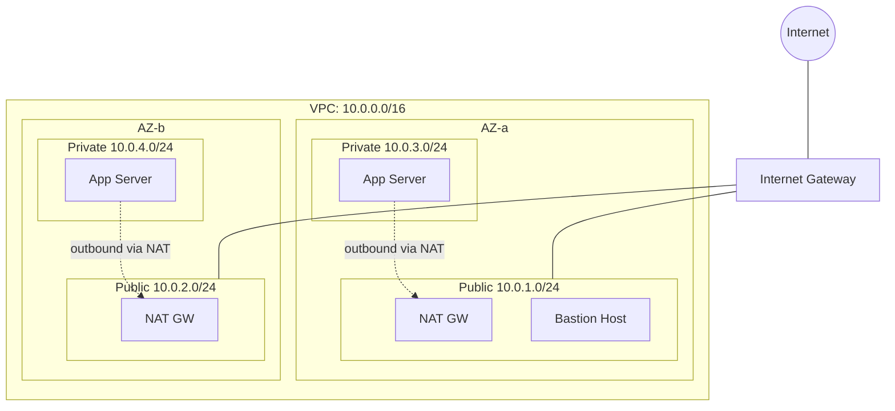

**Step-by-Step:**

```bash
# 1. Create VPC
aws ec2 create-vpc --cidr-block 10.0.0.0/16 \
  --tag-specifications 'ResourceType=vpc,Tags=[{Key=Name,Value=SAA-Lab-VPC},{Key=Project,Value=SAA-Study}]'

# 2. Enable DNS hostnames
aws ec2 modify-vpc-attribute --vpc-id <vpc-id> --enable-dns-hostnames

# 3. Create Internet Gateway and attach
aws ec2 create-internet-gateway --tag-specifications 'ResourceType=internet-gateway,Tags=[{Key=Name,Value=SAA-Lab-IGW}]'
aws ec2 attach-internet-gateway --internet-gateway-id <igw-id> --vpc-id <vpc-id>

# 4. Create subnets (repeat for all 4)
aws ec2 create-subnet --vpc-id <vpc-id> --cidr-block 10.0.1.0/24 \
  --availability-zone us-east-1a \
  --tag-specifications 'ResourceType=subnet,Tags=[{Key=Name,Value=Public-1a}]'

aws ec2 create-subnet --vpc-id <vpc-id> --cidr-block 10.0.2.0/24 \
  --availability-zone us-east-1b \
  --tag-specifications 'ResourceType=subnet,Tags=[{Key=Name,Value=Public-1b}]'

aws ec2 create-subnet --vpc-id <vpc-id> --cidr-block 10.0.3.0/24 \
  --availability-zone us-east-1a \
  --tag-specifications 'ResourceType=subnet,Tags=[{Key=Name,Value=Private-1a}]'

aws ec2 create-subnet --vpc-id <vpc-id> --cidr-block 10.0.4.0/24 \
  --availability-zone us-east-1b \
  --tag-specifications 'ResourceType=subnet,Tags=[{Key=Name,Value=Private-1b}]'

# 5. Enable auto-assign public IP on public subnets
aws ec2 modify-subnet-attribute --subnet-id <public-1a-id> --map-public-ip-on-launch
aws ec2 modify-subnet-attribute --subnet-id <public-1b-id> --map-public-ip-on-launch

# 6. Create NAT Gateway (Elastic IP first)
aws ec2 allocate-address --domain vpc
aws ec2 create-nat-gateway --subnet-id <public-1a-id> --allocation-id <eip-alloc-id> \
  --tag-specifications 'ResourceType=natgateway,Tags=[{Key=Name,Value=NAT-1a}]'

# 7. Create route tables
# Public RT
aws ec2 create-route-table --vpc-id <vpc-id> --tag-specifications 'ResourceType=route-table,Tags=[{Key=Name,Value=Public-RT}]'
aws ec2 create-route --route-table-id <pub-rt-id> --destination-cidr-block 0.0.0.0/0 --gateway-id <igw-id>
aws ec2 associate-route-table --route-table-id <pub-rt-id> --subnet-id <public-1a-id>
aws ec2 associate-route-table --route-table-id <pub-rt-id> --subnet-id <public-1b-id>

# Private RT
aws ec2 create-route-table --vpc-id <vpc-id> --tag-specifications 'ResourceType=route-table,Tags=[{Key=Name,Value=Private-RT}]'
aws ec2 create-route --route-table-id <priv-rt-id> --destination-cidr-block 0.0.0.0/0 --nat-gateway-id <nat-gw-id>
aws ec2 associate-route-table --route-table-id <priv-rt-id> --subnet-id <private-1a-id>
aws ec2 associate-route-table --route-table-id <priv-rt-id> --subnet-id <private-1b-id>

# 8. Create Security Groups
# Bastion SG - allow SSH from your IP
aws ec2 create-security-group --group-name bastion-sg --description "Bastion SSH" --vpc-id <vpc-id>
aws ec2 authorize-security-group-ingress --group-id <bastion-sg-id> --protocol tcp --port 22 --cidr <YOUR_IP>/32

# App SG - allow SSH from bastion SG, HTTP from ALB
aws ec2 create-security-group --group-name app-sg --description "App servers" --vpc-id <vpc-id>
aws ec2 authorize-security-group-ingress --group-id <app-sg-id> --protocol tcp --port 22 --source-group <bastion-sg-id>

# 9. Launch bastion in public subnet
aws ec2 run-instances --image-id ami-0c02fb55956c7d316 --instance-type t2.micro \
  --subnet-id <public-1a-id> --security-group-ids <bastion-sg-id> \
  --key-name <your-key> --tag-specifications 'ResourceType=instance,Tags=[{Key=Name,Value=Bastion}]'

# 10. Launch app server in private subnet
aws ec2 run-instances --image-id ami-0c02fb55956c7d316 --instance-type t2.micro \
  --subnet-id <private-1a-id> --security-group-ids <app-sg-id> \
  --key-name <your-key> --tag-specifications 'ResourceType=instance,Tags=[{Key=Name,Value=AppServer}]'
```

**Verification Checklist:**
- [ ] SSH to bastion from your local machine
- [ ] SSH from bastion to private app server (agent forwarding)
- [ ] From app server: `curl ifconfig.me` — should return NAT Gateway's Elastic IP
- [ ] From app server: verify internet access via NAT

**Teardown:**
```bash
# Delete in reverse order: instances → NAT GW → EIP → IGW → subnets → route tables → SGs → VPC
aws ec2 terminate-instances --instance-ids <bastion-id> <app-id>
# Wait for termination, then continue teardown...
```

---

#### 🔬 Lab NET-2: VPC Peering (Three VPCs — Same Region + Cross-Region)

**Objective**: Connect three VPCs using peering — two in us-east-1, one in eu-west-1.

**Architecture:**
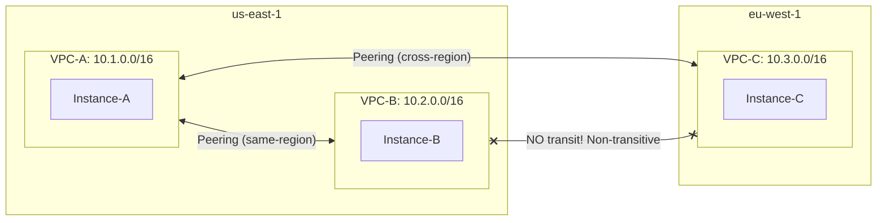

**Steps:**
1. Create VPC-A (10.1.0.0/16) in us-east-1 with one public subnet + instance
2. Create VPC-B (10.2.0.0/16) in us-east-1 with one public subnet + instance
3. Create VPC-C (10.3.0.0/16) in eu-west-1 with one public subnet + instance
4. Create peering: VPC-A ↔ VPC-B (same region)
5. Create peering: VPC-A ↔ VPC-C (cross-region)
6. Update route tables in all three VPCs
7. Update security groups to allow ICMP from peer CIDRs
8. Test: ping Instance-B from Instance-A, ping Instance-C from Instance-A
9. Test: ping Instance-C from Instance-B — **this should FAIL** (non-transitive!)

**Key Exam Takeaway**: VPC Peering is **non-transitive**. B cannot reach C through A.

---

#### 🔬 Lab NET-3: Application Load Balancer with Path-Based Routing

**Objective**: Deploy ALB routing `/api/*` to backend targets and `/*` to frontend targets.

**Steps:**
1. Launch 2 EC2 instances with nginx serving "Frontend" page
2. Launch 2 EC2 instances with nginx serving "API Backend" response
3. Create ALB in public subnets
4. Create two target groups: `tg-frontend` and `tg-api`
5. Register instances to respective target groups
6. Create listener rules: `/api/*` → tg-api, default → tg-frontend
7. Test via ALB DNS name

---

#### 🔬 Lab NET-4: CloudFront + S3 Static Website

**Objective**: Serve S3 static site via CloudFront with OAC.

**Steps:**
1. Create S3 bucket, upload `index.html`
2. Create CloudFront distribution with S3 origin
3. Configure Origin Access Control (OAC)
4. Update S3 bucket policy to allow CloudFront
5. Test: access via CloudFront domain
6. Test: direct S3 URL should be **blocked**

---

#### 🔬 Lab NET-5: Route 53 Failover Routing

**Objective**: Configure primary/secondary failover with health checks.

**Steps:**
1. Deploy EC2 in us-east-1 (primary) and eu-west-1 (secondary)
2. Create Route 53 health check for primary
3. Create failover records (primary + secondary)
4. Stop primary instance → verify DNS resolves to secondary
5. Restart primary → verify failover back

---

#### 🔬 Lab NET-6: VPC Endpoints — Gateway & Interface

**Objective**: Replace costly NAT Gateway traffic with free Gateway Endpoints for S3/DynamoDB, and understand Interface Endpoints.

**Architecture:**
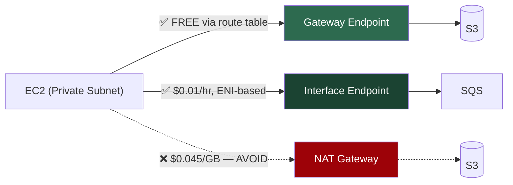

**Steps:**
1. Start with the VPC from Lab NET-1 (private subnet + NAT Gateway)
2. From private EC2, run `aws s3 ls` — works via NAT Gateway
3. Check route table: traffic goes `0.0.0.0/0 → NAT GW`
4. Create **Gateway Endpoint** for S3:
   ```bash
   aws ec2 create-vpc-endpoint --vpc-id <vpc-id> \
     --service-name com.amazonaws.us-east-1.s3 \
     --route-table-ids <private-rt-id> \
     --tag-specifications 'ResourceType=vpc-endpoint,Tags=[{Key=Name,Value=S3-GW-Endpoint}]'
   ```
5. Check route table again — new prefix list route for S3 appears
6. Run `aws s3 ls` again — still works, but now via Gateway Endpoint (free!)
7. Create **Gateway Endpoint** for DynamoDB (same process)
8. Create **Interface Endpoint** for SQS:
   ```bash
   aws ec2 create-vpc-endpoint --vpc-id <vpc-id> \
     --vpc-endpoint-type Interface \
     --service-name com.amazonaws.us-east-1.sqs \
     --subnet-ids <private-subnet-id> \
     --security-group-ids <endpoint-sg-id> \
     --private-dns-enabled
   ```
9. Verify: `aws sqs list-queues --endpoint-url https://sqs.us-east-1.amazonaws.com` — works via private ENI
10. **Cost comparison**: Delete NAT Gateway → S3/DynamoDB still works via endpoints. SQS still works via Interface Endpoint. Only general internet access is lost.

**Exam Takeaways:**
- Gateway Endpoints: S3 + DynamoDB only, free, route table entry, no SG
- Interface Endpoints: almost all other services, ENI-based, costs $0.01/hr/AZ + data, has SG
- Gateway Endpoints are the #1 cost optimization answer for "reduce S3 data transfer costs from private subnet"

---

#### 🔬 Lab NET-7: Hybrid DNS with Route 53 Resolver

**Objective**: Configure DNS resolution between VPC and simulated on-premises network.

**Steps:**
1. Create two VPCs: "Cloud VPC" (10.0.0.0/16) and "On-Prem VPC" (192.168.0.0/16) — peered
2. Launch DNS server (BIND/dnsmasq) in On-Prem VPC simulating corporate DNS
3. Configure Route 53 Private Hosted Zone (`cloud.internal`) in Cloud VPC
4. Create Route 53 **Inbound Endpoint** in Cloud VPC (allows on-prem → resolve cloud DNS)
5. Create Route 53 **Outbound Endpoint** in Cloud VPC (allows cloud → resolve on-prem DNS)
6. Create Route 53 Resolver **forwarding rule**: `onprem.corp` → on-prem DNS server IP
7. Test: from Cloud EC2, `nslookup app.onprem.corp` → resolves via on-prem DNS
8. Test: from On-Prem EC2, `nslookup web.cloud.internal` → resolves via Route 53 Inbound Endpoint

**Exam Takeaway**: Inbound = on-prem resolves cloud DNS. Outbound = cloud resolves on-prem DNS. Both use ENIs in the VPC.

---

### 2.3 Networking Knowledge Check

- [ ] Can you draw a VPC architecture with public/private subnets from memory?
- [ ] Can you explain the packet flow from internet → ALB → private EC2 → NAT → internet?
- [ ] Do you know when to use VPN vs Direct Connect vs Transit Gateway?
- [ ] Can you compare all Route 53 routing policies?
- [ ] Can you explain CloudFront vs Global Accelerator in one sentence each?

---

## 3. Week 3: Storage (EBS, EFS, S3)

**KodeKloud Module**: Services - Storage (28 lessons)
**Estimated Time**: 25–30 hours

### 3.1 Theory Breakdown

#### EBS (Elastic Block Store)

| Volume Type | IOPS | Throughput | Use Case | Exam Tip |
|-------------|------|------------|----------|----------|
| **gp3** | 3,000 baseline (up to 16,000) | 125 MiB/s (up to 1,000) | General purpose, boot volumes | **Default choice** — independent IOPS/throughput |
| **gp2** | 3 IOPS/GiB (up to 16,000) | 250 MiB/s | Legacy general purpose | Burst credits, linked to size |
| **io2 Block Express** | Up to 256,000 | 4,000 MiB/s | Critical databases (Oracle, SAP) | Multi-attach, Nitro instances |
| **io1** | Up to 64,000 | 1,000 MiB/s | High-performance databases | Multi-attach supported |
| **st1** | 500 IOPS | 500 MiB/s | Big data, data warehouses | **Cannot be boot volume** |
| **sc1** | 250 IOPS | 250 MiB/s | Cold storage, infrequent access | Cheapest, **cannot be boot volume** |

**Critical Concepts:**
- [ ] EBS is **AZ-locked** — snapshot to move cross-AZ/region
- [ ] Encryption: AES-256, uses KMS, snapshots of encrypted volumes are encrypted
- [ ] Snapshots are incremental, stored in S3 (managed by AWS)
- [ ] EBS Multi-Attach: io1/io2 only, same AZ, up to 16 instances
- [ ] Instance Store: ephemeral, physically attached, highest IOPS (millions), lost on stop/terminate

#### EFS (Elastic File System)

- [ ] NFS v4.1 protocol, Linux only, multi-AZ
- [ ] Performance modes: General Purpose (default) vs Max I/O
- [ ] Throughput modes: Bursting, Provisioned, Elastic
- [ ] Storage classes: Standard, IA, One Zone, One Zone-IA
- [ ] Lifecycle policies for automatic tiering

#### S3 Deep Dive

| Storage Class | Durability | Availability | Min Duration | Retrieval Fee | Use Case |
|---------------|-----------|--------------|--------------|---------------|----------|
| **Standard** | 11 9s | 99.99% | None | None | Frequently accessed |
| **Intelligent-Tiering** | 11 9s | 99.9% | None | None | Unknown access patterns |
| **Standard-IA** | 11 9s | 99.9% | 30 days | Per-GB | Infrequent, rapid access |
| **One Zone-IA** | 11 9s | 99.5% | 30 days | Per-GB | Reproducible infrequent |
| **Glacier Instant** | 11 9s | 99.9% | 90 days | Per-GB | Archive, millisecond access |
| **Glacier Flexible** | 11 9s | 99.99% | 90 days | Per-GB | Archive, 1-12 hr retrieval |
| **Glacier Deep Archive** | 11 9s | 99.99% | 180 days | Per-GB | Long-term, 12-48 hr retrieval |

**S3 Must-Know:**
- [ ] Bucket policies vs ACLs vs IAM policies — evaluation logic
- [ ] Versioning: MFA delete, lifecycle rules with versioned objects
- [ ] Pre-signed URLs: temporary access, default 1hr (up to 7 days with IAM user)
- [ ] S3 Access Points: simplify access management for shared datasets
- [ ] Static website hosting: `index.html`, `error.html`, bucket policy for public read
- [ ] Cross-Region Replication (CRR) vs Same-Region Replication (SRR)
- [ ] S3 Transfer Acceleration: uses CloudFront edge locations
- [ ] S3 Event Notifications → SNS, SQS, Lambda, EventBridge
- [ ] Object Lock: WORM (Governance vs Compliance modes)

#### Other Storage Services

- [ ] **FSx for Windows**: SMB protocol, Active Directory integration, Windows workloads
- [ ] **FSx for Lustre**: HPC, ML training, integrates with S3
- [ ] **FSx for NetApp ONTAP**: multi-protocol (NFS, SMB, iSCSI)
- [ ] **FSx for OpenZFS**: Linux workloads migrating from ZFS
- [ ] **Storage Gateway**: File Gateway (NFS/SMB → S3), Volume Gateway (iSCSI → S3/EBS), Tape Gateway (VTL → Glacier)
- [ ] **AWS Backup**: centralized backup across services, backup plans, vaults, cross-region
- [ ] **Elastic Disaster Recovery (DRS)**: continuous replication, RPO seconds, RTO minutes

### 3.2 Hands-On Labs (Real AWS)

---

#### 🔬 Lab STO-1: EBS Volume Operations

**Objective**: Create, attach, snapshot, and move EBS volume between instances.

**Steps:**
1. Launch EC2 (t2.micro) in us-east-1a
2. Create gp3 volume (8 GiB) in us-east-1a
3. Attach volume to EC2, SSH in, format (`mkfs -t ext4`), mount
4. Write test data: `echo "Hello EBS" > /mnt/data/test.txt`
5. Create snapshot of the volume
6. Launch second EC2 in us-east-1b
7. Create new volume from snapshot in us-east-1b
8. Attach to second EC2, mount, verify data exists
9. **Bonus**: Create encrypted volume from unencrypted snapshot (copy snapshot with encryption)

---

#### 🔬 Lab STO-2: S3 Storage Classes & Lifecycle

**Objective**: Upload objects to different tiers, configure lifecycle rules.

**Steps:**
1. Create bucket `saa-lab-storage-<account-id>`
2. Upload files to Standard, Standard-IA, Glacier Instant Retrieval
3. Create lifecycle rule: transition Standard → Standard-IA after 30 days → Glacier after 90 days
4. Enable versioning
5. Upload same file 3 times (creates 3 versions)
6. Delete latest version → verify "delete marker"
7. Restore previous version
8. Create lifecycle rule to expire non-current versions after 30 days

---

#### 🔬 Lab STO-3: S3 Bucket Policy & Pre-Signed URLs

**Objective**: Practice S3 access control mechanisms.

**Steps:**
1. Create private bucket
2. Write bucket policy allowing read from specific IP only
3. Test access from allowed IP (works) and different IP (denied)
4. Generate pre-signed URL: `aws s3 presign s3://bucket/object --expires-in 300`
5. Access via pre-signed URL in browser — works for 5 minutes
6. Wait 5 minutes — access denied
7. Create S3 Access Point with restrictive policy for a specific prefix

---

#### 🔬 Lab STO-4: EFS Shared File System

**Objective**: Mount EFS across two EC2 instances in different AZs.

**Steps:**
1. Create EFS file system (General Purpose, Bursting)
2. Create mount targets in 2 AZs with proper security groups
3. Launch EC2 in AZ-a, install `amazon-efs-utils`, mount EFS
4. Write file on Instance-A
5. Launch EC2 in AZ-b, mount same EFS
6. Verify file is visible on Instance-B
7. Configure lifecycle policy (Standard → IA after 30 days)

---

#### 🔬 Lab STO-5: S3 Static Website with CloudFront

**Objective**: Host a static website on S3 behind CloudFront.

**Steps:**
1. Create bucket, enable static website hosting
2. Upload `index.html` and `error.html`
3. Create CloudFront distribution with OAC
4. Apply auto-generated bucket policy
5. Test CloudFront URL
6. Invalidate cache: `aws cloudfront create-invalidation --distribution-id <id> --paths "/*"`

---

## 4. Week 4: Compute (EC2, Lambda, Containers)

**KodeKloud Module**: Services - Compute (28 lessons)
**Estimated Time**: 25–30 hours

### 4.1 Theory Breakdown

#### EC2 Deep Dive

**Instance Families (Exam Favorites):**

| Family | Mnemonic | Use Case | Example |
|--------|----------|----------|---------|
| **M** | General | Balanced compute/memory/network | m6i.large |
| **C** | Compute | CPU-intensive (batch, ML inference, gaming) | c6i.xlarge |
| **R** | RAM | Memory-intensive (in-memory DB, real-time analytics) | r6i.2xlarge |
| **T** | Turbo (burstable) | Variable workloads, dev/test | t3.micro |
| **I** | I/O | Storage-optimized (NoSQL, data warehouses) | i3.large |
| **G/P** | GPU | ML training, graphics rendering | p4d.24xlarge |
| **X** | Xtreme memory | SAP HANA, in-memory databases | x2idn.metal |

**Purchasing Options:**

| Option | Discount | Commitment | Use Case |
|--------|----------|------------|----------|
| **On-Demand** | 0% | None | Short-term, unpredictable |
| **Reserved (Standard)** | Up to 72% | 1 or 3 year | Steady-state workloads |
| **Reserved (Convertible)** | Up to 66% | 1 or 3 year | Steady-state, flexibility |
| **Savings Plans (Compute)** | Up to 66% | 1 or 3 year | Flexible across instance families |
| **Savings Plans (Instance)** | Up to 72% | 1 or 3 year | Locked to instance family |
| **Spot** | Up to 90% | None (can be reclaimed) | Fault-tolerant, batch, CI/CD |
| **Dedicated Hosts** | Varies | On-Demand or Reserved | Licensing compliance (BYOL) |
| **Dedicated Instances** | Varies | None | Compliance, not shared hardware |
| **Capacity Reservations** | 0% | None | Guaranteed capacity in AZ |

**Key EC2 Concepts:**
- [ ] Placement Groups: Cluster (low latency), Spread (max 7/AZ, HA), Partition (big data)
- [ ] User Data: runs on first boot only, runs as root
- [ ] Instance Metadata: `http://169.254.169.254/latest/meta-data/`
- [ ] ENI, ENA (enhanced networking), EFA (HPC)
- [ ] AMI: region-specific, can copy cross-region, can share cross-account
- [ ] EC2 Image Builder: automated AMI pipeline

#### Lambda

- [ ] Runtime: up to 15 min, 10 GB RAM, 10 GB /tmp
- [ ] Concurrency: 1000 default (reserved vs provisioned)
- [ ] Triggers: API Gateway, S3, DynamoDB Streams, SQS, EventBridge, etc.
- [ ] Layers: shared libraries, up to 5 layers, 250 MB unzipped
- [ ] Versions & Aliases: immutable versions, alias points to version, traffic shifting
- [ ] VPC access: place Lambda in private subnet, needs NAT for internet
- [ ] Lambda@Edge vs CloudFront Functions

#### Containers

- [ ] **ECS**: AWS-native orchestration, Task Definitions, Services, Fargate vs EC2 launch type
- [ ] **EKS**: Managed Kubernetes, worker nodes (managed, self-managed, Fargate)
- [ ] **ECR**: Docker image registry, image scanning, lifecycle policies
- [ ] **Fargate**: Serverless containers, no EC2 management, per vCPU/memory pricing
- [ ] **App Runner**: Fully managed container service from source code or image

#### Other Compute

- [ ] **Elastic Beanstalk**: PaaS, supports Docker, Java, .NET, Node, Python, Ruby, Go, PHP
- [ ] **Lightsail**: Simple VPS, fixed pricing, good for small apps
- [ ] **Batch**: managed batch processing, uses Spot/On-Demand EC2
- [ ] **Outposts**: AWS infrastructure on-premises
- [ ] **Snow Family**: Snowcone (8-14 TB), Snowball Edge (80-210 TB), Snowmobile (100 PB)

### 4.2 Hands-On Labs (Real AWS)

---

#### 🔬 Lab CMP-1: EC2 Instance with User Data

**Objective**: Launch EC2 with Apache web server via user data script.

```bash
#!/bin/bash
# User data script
yum update -y
yum install -y httpd
systemctl start httpd
systemctl enable httpd
TOKEN=$(curl -X PUT "http://169.254.169.254/latest/api/token" \
  -H "X-aws-ec2-metadata-token-ttl-seconds: 21600")
AZ=$(curl -H "X-aws-ec2-metadata-token: $TOKEN" \
  http://169.254.169.254/latest/meta-data/placement/availability-zone)
echo "<h1>Hello from $AZ</h1>" > /var/www/html/index.html
```

**Verification**: Access public IP in browser → see AZ name

---

#### 🔬 Lab CMP-2: Lambda Function with API Gateway

**Objective**: Build serverless REST API.

**Steps:**
1. Create Lambda function (Python 3.12 runtime)
2. Code: return JSON with timestamp and random quote
3. Create API Gateway (REST API)
4. Create GET method → Lambda integration
5. Deploy API to "prod" stage
6. Test endpoint URL
7. Add DynamoDB table for persistence
8. Update Lambda IAM role with DynamoDB permissions
9. Write/read from DynamoDB via Lambda

---

#### 🔬 Lab CMP-3: ECS Fargate Deployment

**Objective**: Deploy containerized app on ECS Fargate.

**Steps:**
1. Create ECR repository
2. Build Docker image, push to ECR
3. Create ECS cluster (Fargate)
4. Create task definition (256 CPU, 512 MiB memory)
5. Create service with ALB
6. Verify app accessible via ALB DNS

---

#### 🔬 Lab CMP-4: Elastic Beanstalk

**Objective**: Deploy a Node.js app with zero infrastructure management.

**Steps:**
1. Create sample app zip (Node.js Express)
2. `eb init` → `eb create` → `eb deploy`
3. Explore auto-created resources (ASG, ALB, SG, EC2)
4. Update app → `eb deploy` → observe rolling update
5. Check health dashboard, logs

---

#### Deployment Strategies (Exam-Critical)

| Strategy | Downtime | Rollback Speed | Risk | Use Case |
|----------|----------|---------------|------|----------|
| **All-at-Once** | Yes | Redeploy | High | Dev/test |
| **Rolling** | Minimal | Slow (roll forward) | Medium | Non-critical production |
| **Rolling with Additional Batch** | None | Moderate | Low | Production (maintains capacity) |
| **Immutable** | None | Fast (terminate new) | Low | Production (clean instances) |
| **Blue/Green** | None | Instant (swap) | Lowest | Critical production |
| **Canary** | None | Instant (route back) | Lowest | Gradual rollout, A/B testing |
| **Linear** | None | Instant (route back) | Low | Gradual rollout over time |

**Service-to-Strategy Mapping:**
- **Elastic Beanstalk**: All-at-Once, Rolling, Rolling+Batch, Immutable, Blue/Green (swap CNAME)
- **CodeDeploy on EC2**: In-Place (rolling), Blue/Green (new ASG)
- **CodeDeploy on Lambda**: Canary, Linear, All-at-Once (via alias traffic shifting)
- **CodeDeploy on ECS**: Canary, Linear, All-at-Once (via target group switching)
- **CloudFormation**: Rolling Update policy, AutoScalingRollingUpdate
- **API Gateway**: Canary release on stage (% of traffic to canary)

**CI/CD Services Overview:**

| Service | Function | Analogy |
|---------|----------|---------|
| **CodeCommit** | Git repository (deprecated, use GitHub/GitLab) | GitHub |
| **CodeBuild** | Build & test (managed CI) | Jenkins/GitHub Actions build |
| **CodeDeploy** | Deploy to EC2/Lambda/ECS | Deployment automation |
| **CodePipeline** | Orchestrate Source→Build→Deploy | CI/CD pipeline |
| **CodeArtifact** | Package repository (npm, pip, Maven) | Artifactory |

---

#### 🔬 Lab CMP-5: Blue/Green Deployment with CodeDeploy

**Objective**: Deploy application updates with zero downtime using CodeDeploy blue/green.

**Steps:**
1. Create Launch Template with v1 app (displays "Version 1" on webpage)
2. Create Auto Scaling Group + ALB (blue environment)
3. Create CodeDeploy application + deployment group:
   - Deployment type: Blue/Green
   - Traffic rerouting: Reroute immediately
   - Original instances: Terminate after 5 minutes
4. Create `appspec.yml`:
   ```yaml
   version: 0.0
   os: linux
   files:
     - source: /index.html
       destination: /var/www/html/
   hooks:
     BeforeInstall:
       - location: scripts/install_deps.sh
     AfterInstall:
       - location: scripts/restart_server.sh
     ValidateService:
       - location: scripts/health_check.sh
         timeout: 120
   ```
5. Update app to v2 (displays "Version 2")
6. Trigger deployment → watch CodeDeploy:
   - Provision new (green) instances
   - Run lifecycle hooks
   - Shift ALB traffic to green
   - Wait, then terminate blue
7. Access ALB → see "Version 2" with zero downtime
8. Trigger rollback → traffic shifts back to blue (if still alive)

**Exam Takeaway**: Blue/Green = two ASGs, ALB swaps target groups. CodeDeploy manages the orchestration.

---

## 5. Week 5: Databases

**KodeKloud Module**: Services - Database (21 lessons)
**Estimated Time**: 20–25 hours

### 5.1 Theory Breakdown

#### RDS

- [ ] Engines: MySQL, PostgreSQL, MariaDB, Oracle, SQL Server, Aurora
- [ ] Multi-AZ: synchronous standby replica, automatic failover, same region
- [ ] Read Replicas: async replication, up to 15 (Aurora) / 5 (others), cross-region possible
- [ ] Storage Auto Scaling: automatic increase, set max threshold
- [ ] Backups: automated (1-35 day retention), manual snapshots (persist until deleted)
- [ ] Encryption: at-rest (KMS), in-transit (SSL/TLS), can't encrypt existing unencrypted DB

#### Aurora

- [ ] MySQL and PostgreSQL compatible, 5x MySQL / 3x PostgreSQL performance
- [ ] Storage: auto-scales 10 GB → 128 TB, 6 copies across 3 AZs
- [ ] Endpoints: cluster (write), reader (read, load-balanced), custom
- [ ] Aurora Serverless: auto-scaling compute, pay per ACU-second
- [ ] Aurora Global Database: cross-region, < 1 second replication, RPO 1 second
- [ ] RDS Proxy: connection pooling, reduces failover time by 66%, IAM auth

#### DynamoDB

- [ ] Key-value + document, single-digit millisecond latency
- [ ] Capacity: On-Demand vs Provisioned (with auto scaling)
- [ ] Primary Key: Partition Key only, or Partition Key + Sort Key
- [ ] GSI (Global Secondary Index) vs LSI (Local Secondary Index)
- [ ] DynamoDB Streams: ordered change log, triggers Lambda
- [ ] DAX (DynamoDB Accelerator): in-memory cache, microsecond reads
- [ ] Global Tables: multi-region, multi-active replication
- [ ] Point-in-time recovery: 35-day window

#### Other Databases

| Service | Type | Use Case | Exam Frequency |
|---------|------|----------|----------------|
| **ElastiCache** | In-memory (Redis/Memcached) | Session store, caching | HIGH |
| **Redshift** | Columnar warehouse | Analytics, OLAP | HIGH |
| **OpenSearch** | Search & analytics | Log analytics, full-text search | MEDIUM |
| **Neptune** | Graph | Social networks, fraud detection | LOW |
| **DocumentDB** | MongoDB-compatible | Document store | LOW |
| **Keyspaces** | Cassandra-compatible | Wide-column | LOW |
| **QLDB** | Ledger (immutable) | Financial, supply chain audit | LOW |
| **Timestream** | Time-series | IoT, DevOps metrics | LOW |
| **MemoryDB** | Redis-compatible (durable) | Redis as primary database | LOW |

### 5.2 Hands-On Labs (Real AWS)

---

#### 🔬 Lab DB-1: RDS Multi-AZ with Read Replica

**Objective**: Deploy MySQL RDS, enable Multi-AZ, create read replica.

**Steps:**
1. Create RDS MySQL (db.t3.micro, free-tier)
2. Enable Multi-AZ (shows failover capability)
3. Create Read Replica
4. Connect to primary, create test database and table
5. Connect to read replica, verify data replication
6. Simulate failover: reboot with failover → observe endpoint switch

---

#### 🔬 Lab DB-2: DynamoDB with Auto Scaling

**Objective**: Create table, load data, configure auto scaling.

**Steps:**
1. Create DynamoDB table (`Orders`, PK: `OrderId`, SK: `Timestamp`)
2. Set provisioned capacity (5 RCU, 5 WCU)
3. Enable auto scaling (min 5, max 100, target utilization 70%)
4. Use Python script to generate load
5. Observe CloudWatch metrics and scaling events
6. Create GSI on `CustomerId`
7. Query by GSI
8. Enable DynamoDB Streams → trigger Lambda on new items

---

#### 🔬 Lab DB-3: ElastiCache Redis Cluster

**Objective**: Deploy Redis cluster, connect from EC2.

**Steps:**
1. Create ElastiCache Redis cluster (cache.t3.micro)
2. Configure subnet group (private subnets)
3. Launch EC2 in same VPC, install `redis-cli`
4. Connect and test SET/GET operations
5. Measure latency vs direct DynamoDB reads

---

#### 🔬 Lab DB-4: RDS with Secrets Manager

**Objective**: Store and rotate RDS credentials using Secrets Manager.

**Steps:**
1. Create RDS instance
2. Store credentials in Secrets Manager
3. Enable automatic rotation (30 days)
4. Write Lambda function that retrieves credentials from Secrets Manager
5. Connect to RDS using retrieved credentials

---

## 6. Week 6: Application Integration

**KodeKloud Module**: Services - Application Integration (19 lessons)
**Estimated Time**: 20–25 hours

### 6.1 Theory Breakdown

#### Auto Scaling

- [ ] Launch Templates (preferred) vs Launch Configurations (legacy)
- [ ] Scaling Policies: Target Tracking, Step, Simple, Scheduled, Predictive
- [ ] Cooldown period, warm-up period
- [ ] Health checks: EC2, ELB, custom
- [ ] Instance refresh for rolling updates
- [ ] Lifecycle hooks: Pending:Wait, Terminating:Wait

#### Elastic Load Balancing (Detailed)

- [ ] ALB: Layer 7, content-based routing, HTTP/HTTPS/gRPC, WebSocket
- [ ] NLB: Layer 4, millions of requests/sec, static IP, TLS passthrough
- [ ] GLB: Layer 3, transparent network gateway, GENEVE, 3rd-party appliances
- [ ] Cross-zone load balancing behavior per LB type
- [ ] Connection draining / deregistration delay
- [ ] Slow start mode (ALB)
- [ ] Sticky sessions (ALB: application cookie, duration-based)

#### Messaging & Integration

| Service | Model | Ordering | Delivery | Throughput | Use Case |
|---------|-------|----------|----------|------------|----------|
| **SQS Standard** | Queue | Best-effort | At-least-once | Nearly unlimited | Decoupling, buffering |
| **SQS FIFO** | Queue | Guaranteed | Exactly-once | 300/3000 msg/s | Order-critical |
| **SNS** | Pub/Sub | Per-topic | At-least-once | High | Fan-out notifications |
| **EventBridge** | Event Bus | Per-rule | At-least-once | High | Event-driven architectures |
| **Amazon MQ** | Broker | Configurable | Configurable | Moderate | Migrate from ActiveMQ/RabbitMQ |
| **Step Functions** | Workflow | Sequential | Exactly-once (Standard) | Varies | Orchestrate microservices |

**Key Patterns (Exam Favorites):**
- [ ] SNS + SQS Fan-out: SNS topic → multiple SQS queues
- [ ] SQS Dead-Letter Queue: failed messages after maxReceiveCount
- [ ] EventBridge: scheduled rules, cross-account events, schema registry
- [ ] Step Functions: Standard (long, exactly-once) vs Express (short, at-least-once)
- [ ] API Gateway: REST vs HTTP vs WebSocket, caching, throttling, usage plans

### 6.2 Hands-On Labs (Real AWS)

---

#### 🔬 Lab INT-1: Auto Scaling Web Server

**Objective**: Deploy auto-scaling web tier behind ALB.

**Steps:**
1. Create Launch Template (t2.micro, Apache user data)
2. Create ALB with target group
3. Create Auto Scaling Group (min: 2, desired: 2, max: 6)
4. Attach ALB target group
5. Configure Target Tracking policy (CPU avg 50%)
6. Stress test: `stress --cpu 4 --timeout 300` on instances
7. Watch ASG scale out → new instances register with ALB
8. Remove stress → watch scale-in

---

#### 🔬 Lab INT-2: SNS + SQS Fan-Out Pattern

**Objective**: Build fan-out architecture where one event triggers multiple consumers.

**Steps:**
1. Create SNS topic `OrderEvents`
2. Create 3 SQS queues: `billing-queue`, `inventory-queue`, `notification-queue`
3. Subscribe all queues to the SNS topic
4. Configure SQS access policy to allow SNS
5. Publish message to SNS topic
6. Verify message received in all 3 queues
7. Configure DLQ on one queue, test failed processing

---

#### 🔬 Lab INT-3: API Gateway + Lambda + DynamoDB

**Objective**: Build full serverless CRUD API.

**Steps:**
1. Create DynamoDB table `Products`
2. Create Lambda functions for GET/POST/PUT/DELETE
3. Create API Gateway REST API
4. Create resources and methods
5. Deploy to stage
6. Test all CRUD operations via `curl`
7. Enable API caching
8. Configure usage plan with API key

---

#### 🔬 Lab INT-4: Step Functions Workflow

**Objective**: Orchestrate multi-step order processing.

**Steps:**
1. Create Lambda functions: `ValidateOrder`, `ProcessPayment`, `UpdateInventory`, `SendConfirmation`
2. Create Step Functions state machine (Standard workflow)
3. Define states: Task, Choice (payment success?), Parallel (inventory + confirmation)
4. Add error handling with Catch and Retry
5. Execute and observe in Step Functions console
6. Add Wait state for delayed processing

---

## 7. Week 7: Data & ML Services

**KodeKloud Module**: Services - Data and ML (24 lessons)
**Estimated Time**: 15–20 hours

### 7.1 Theory Breakdown

#### Data Services

| Service | Category | Key Feature | Exam Relevance |
|---------|----------|-------------|----------------|
| **Kinesis Data Streams** | Real-time streaming | Shard-based, 1 MB/s in per shard, 2 MB/s out | HIGH |
| **Kinesis Data Firehose** | Delivery stream | Near real-time (60s buffer), S3/Redshift/OpenSearch | HIGH |
| **MSK** | Managed Kafka | Open-source compatible, MSK Serverless | MEDIUM |
| **Glue** | ETL | Serverless, crawlers, data catalog, PySpark/Python | HIGH |
| **EMR** | Big Data | Managed Hadoop/Spark/Hive/Presto clusters | MEDIUM |
| **Lake Formation** | Data Lake | Centralized governance, fine-grained access on S3 | MEDIUM |
| **Athena** | Query S3 | Serverless SQL on S3, Presto-based, $5/TB scanned | HIGH |
| **QuickSight** | BI/Dashboards | Serverless, SPICE in-memory engine, ML insights | MEDIUM |

**Key Streaming Architecture:**
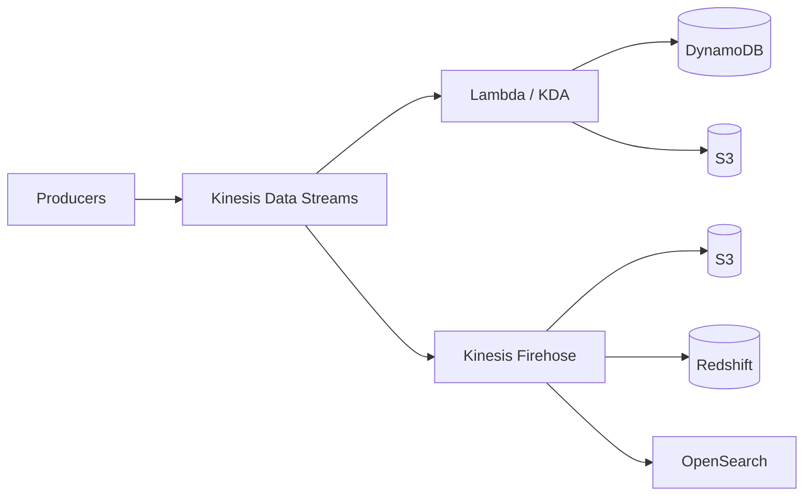

#### ML Services (Know What They Do)

| Service | Function |
|---------|----------|
| **SageMaker** | Full ML platform: build, train, deploy |
| **Rekognition** | Image/video analysis (faces, objects, text) |
| **Polly** | Text-to-speech |
| **Lex** | Chatbots (powers Alexa) |
| **Comprehend** | NLP: sentiment, entities, language detection |
| **Forecast** | Time-series forecasting |
| **Fraud Detector** | Online fraud detection |
| **Transcribe** | Speech-to-text |
| **Translate** | Language translation |
| **Textract** | OCR: extract text from documents |
| **Augmented AI (A2I)** | Human review of ML predictions |

### 7.2 Hands-On Labs (Real AWS)

---

#### 🔬 Lab DATA-1: Athena + Glue on S3 Data Lake

**Objective**: Query CSV data in S3 using Athena with Glue Catalog.

**Steps:**
1. Upload sample CSV to S3 (e.g., flight data, CloudTrail logs)
2. Create Glue Crawler to discover schema
3. Run crawler → check Glue Data Catalog
4. Open Athena, select Glue database
5. Run SQL queries on S3 data
6. Convert to Parquet format → compare cost/performance

---

#### 🔬 Lab DATA-2: Kinesis Data Stream + Lambda Consumer

**Objective**: Process real-time data with Kinesis + Lambda.

**Steps:**
1. Create Kinesis Data Stream (1 shard)
2. Write Python producer sending JSON records
3. Create Lambda consumer (event source mapping)
4. Process records, write to DynamoDB
5. Monitor with CloudWatch metrics (iterator age, etc.)

---

## 8. Week 8: Migration & Transfer + Management & Governance

**KodeKloud Modules**: Migration (12 lessons) + Management (26 lessons)
**Estimated Time**: 25–30 hours

### 8.1 Migration & Transfer Theory

| Service | Use Case | Key Detail |
|---------|----------|------------|
| **Migration Hub** | Track migrations centrally | Dashboard for all migration tools |
| **Application Discovery Service** | Discover on-prem servers | Agent-based or agentless |
| **Application Migration Service (MGN)** | Lift-and-shift servers | Continuous replication, cutover |
| **Database Migration Service (DMS)** | Migrate databases | Supports homogeneous + heterogeneous (with SCT) |
| **DataSync** | Transfer data to AWS | Agent-based, NFS/SMB → S3/EFS/FSx, 10 Gbps |
| **Transfer Family** | SFTP/FTPS/FTP to S3/EFS | Managed file transfer |
| **Snow Family** | Physical data transfer | Snowcone (8-14TB), Snowball (80-210TB), Snowmobile (100PB) |

**Migration Strategies (The 7 Rs):**
1. **Rehost** (lift-and-shift)
2. **Replatform** (lift-tinker-shift)
3. **Repurchase** (move to SaaS)
4. **Refactor** (re-architect)
5. **Retire** (decommission)
6. **Retain** (keep on-prem)
7. **Relocate** (VMware Cloud on AWS)

### 8.2 Management & Governance Theory

| Service | Function | Exam Weight |
|---------|----------|-------------|
| **CloudFormation** | Infrastructure as Code (JSON/YAML) | HIGH |
| **CDK** | IaC with programming languages → generates CFN | MEDIUM |
| **CloudWatch** | Metrics, logs, alarms, dashboards | HIGH |
| **X-Ray** | Distributed tracing | MEDIUM |
| **Organizations** | Multi-account management, SCPs | HIGH |
| **Control Tower** | Multi-account governance, guardrails | HIGH |
| **Systems Manager** | Patch, run commands, parameter store, session manager | HIGH |
| **Trusted Advisor** | Best practice checks (cost, performance, security, fault tolerance) | MEDIUM |
| **Service Catalog** | Approved product portfolios | LOW |
| **Config** | Resource configuration tracking, compliance rules | HIGH |
| **RAM** | Share resources across accounts | MEDIUM |
| **Compute Optimizer** | ML-based right-sizing recommendations | LOW |

### 8.3 Hands-On Labs (Real AWS)

---

#### 🔬 Lab MGT-1: CloudFormation Stack

**Objective**: Deploy and update infrastructure with CloudFormation.

```yaml
# template.yaml
AWSTemplateFormatVersion: '2010-09-09'
Description: SAA Lab - VPC with EC2

Parameters:
  EnvironmentName:
    Type: String
    Default: SAA-Lab

Resources:
  VPC:
    Type: AWS::EC2::VPC
    Properties:
      CidrBlock: 10.0.0.0/16
      EnableDnsSupport: true
      EnableDnsHostnames: true
      Tags:
        - Key: Name
          Value: !Sub ${EnvironmentName}-VPC

  PublicSubnet:
    Type: AWS::EC2::Subnet
    Properties:
      VpcId: !Ref VPC
      CidrBlock: 10.0.1.0/24
      MapPublicIpOnLaunch: true
      AvailabilityZone: !Select [0, !GetAZs '']

  InternetGateway:
    Type: AWS::EC2::InternetGateway

  AttachGateway:
    Type: AWS::EC2::VPCGatewayAttachment
    Properties:
      VpcId: !Ref VPC
      InternetGatewayId: !Ref InternetGateway

  WebServer:
    Type: AWS::EC2::Instance
    Properties:
      InstanceType: t2.micro
      ImageId: ami-0c02fb55956c7d316
      SubnetId: !Ref PublicSubnet

Outputs:
  VPCId:
    Value: !Ref VPC
  InstanceId:
    Value: !Ref WebServer
```

**Steps:**
1. Deploy stack: `aws cloudformation create-stack --stack-name saa-lab --template-body file://template.yaml`
2. Monitor: `aws cloudformation describe-stack-events --stack-name saa-lab`
3. Update: add Security Group → `update-stack`
4. Drift detection
5. Delete stack → observe all resources cleaned up

---

#### 🔬 Lab MGT-2: CloudWatch Alarms & Dashboards

**Steps:**
1. Launch EC2 with detailed monitoring enabled
2. Create CloudWatch alarm: CPU > 80% → SNS notification
3. Install CloudWatch agent, push custom metrics (memory, disk)
4. Create dashboard with CPU, memory, network widgets
5. Create log group, stream application logs
6. Create metric filter on error patterns
7. Trigger alarm → verify SNS email

---

#### 🔬 Lab MGT-3: AWS Organizations & SCPs

**Steps:**
1. Create Organization (if you have multiple accounts, or simulate with OUs)
2. Create OUs: Production, Development, Sandbox
3. Create SCP: deny specific regions, deny specific instance types
4. Attach SCP to Sandbox OU
5. Verify: try launching restricted resource in Sandbox → denied

---

#### 🔬 Lab MGT-4: Systems Manager

**Steps:**
1. Launch EC2 with SSM Agent (Amazon Linux 2 has it pre-installed)
2. Attach `AmazonSSMManagedInstanceCore` role
3. Connect via Session Manager (no SSH key needed!)
4. Run Command: install packages across multiple instances
5. Use Parameter Store: store DB connection string
6. Retrieve parameter in application code
7. Set up Patch Manager baseline

---

#### 🔬 Lab MGT-5: CI/CD Pipeline with CodePipeline

**Objective**: Build end-to-end pipeline: Source → Build → Deploy.

**Steps:**
1. Create S3 bucket or GitHub repo with sample Node.js app
2. Create CodeBuild project:
   - `buildspec.yml` — install deps, run tests, produce artifact
   ```yaml
   version: 0.2
   phases:
     install:
       commands: ["npm install"]
     build:
       commands: ["npm test", "npm run build"]
   artifacts:
     files: ['**/*']
     base-directory: 'dist'
   ```
3. Create CodeDeploy application (EC2 target)
4. Create CodePipeline:
   - Source stage → S3/GitHub
   - Build stage → CodeBuild
   - Deploy stage → CodeDeploy
5. Push code change → watch pipeline execute automatically
6. Introduce failing test → watch pipeline stop at Build stage
7. Add manual approval stage between Build and Deploy

---

#### 🔬 Lab MGT-6: Multi-Account Landing Zone

**Objective**: Understand Control Tower and multi-account strategy.

**Steps:**
1. Review Control Tower concepts (or set up if you have a fresh organization):
   - Management account, Log Archive account, Audit account
   - Guardrails: preventive (SCPs) vs detective (Config rules)
2. Create OU structure:
   ```mermaid
   graph TD
       Root["Root"] --> SecOU["Security OU"]
       Root --> ProdOU["Production OU"]
       Root --> DevOU["Development OU"]
       Root --> SandOU["Sandbox OU"]
       SecOU --> LogAcc["Log Archive Account"]
       SecOU --> AuditAcc["Audit Account"]
       ProdOU --> ProdWork["Prod-Workload Account"]
       DevOU --> DevWork["Dev-Workload Account"]
       SandOU --> SandAcc["Sandbox Account"]
       style SecOU fill:#1b4332,color:#fff
       style ProdOU fill:#023e8a,color:#fff
       style DevOU fill:#7b2cbf,color:#fff
       style SandOU fill:#e85d04,color:#fff
   ```
3. Apply SCPs:
   - Deny all except us-east-1 and eu-west-1 for Sandbox OU
   - Deny deletion of CloudTrail for all OUs
   - Deny root user actions for workload accounts
4. Configure AWS SSO (IAM Identity Center):
   - Create permission sets: AdministratorAccess, ViewOnlyAccess, PowerUserAccess
   - Assign permission sets to groups per account
5. Test: switch roles between accounts, verify SCP enforcement

**Exam Takeaway**: Control Tower = automated landing zone. SCPs = guardrails. IAM Identity Center = centralized access. Always use dedicated Security OU for log/audit accounts.

---

## 9. Week 9: Security Services

**KodeKloud Module**: Services - Security (31 lessons)
**Estimated Time**: 25–30 hours

### 9.1 Theory Breakdown

#### IAM (Identity & Access Management)

- [ ] Users, Groups, Roles, Policies
- [ ] Policy types: Identity-based, Resource-based, Permissions boundaries, SCPs, Session policies
- [ ] Policy evaluation: Explicit Deny > Explicit Allow > Default Deny
- [ ] Cross-account access: role assumption (sts:AssumeRole)
- [ ] IAM Access Analyzer: identify resources shared externally
- [ ] Credential report & access advisor

#### Key Security Services

| Service | Function | When to Use |
|---------|----------|-------------|
| **IAM Identity Center (SSO)** | Centralized SSO for AWS accounts | Multi-account, workforce identity |
| **Cognito** | User pools (auth) + Identity pools (temp AWS creds) | Mobile/web app auth |
| **Directory Service** | Managed Active Directory | Windows workloads, AD-dependent apps |
| **CloudTrail** | API call logging (who did what) | Audit, compliance |
| **Config** | Resource config history + compliance rules | Compliance, drift detection |
| **GuardDuty** | Threat detection (ML on CloudTrail, VPC Flow Logs, DNS) | Anomaly detection |
| **Inspector** | Vulnerability scanning (EC2, ECR, Lambda) | Security assessment |
| **Macie** | PII/sensitive data discovery in S3 | Data privacy |
| **Security Hub** | Centralized security findings dashboard | Aggregate findings |
| **KMS** | Key management, CMK, envelope encryption | Encryption at rest |
| **CloudHSM** | Dedicated hardware security module | Regulatory (FIPS 140-2 Level 3) |
| **Certificate Manager** | Free SSL/TLS certificates | HTTPS on ALB, CloudFront |
| **Secrets Manager** | Store/rotate secrets (DB credentials, API keys) | Secret management |
| **WAF** | Web Application Firewall (Layer 7) | SQL injection, XSS protection |
| **Shield** | DDoS protection (Standard free, Advanced paid) | DDoS mitigation |
| **Network Firewall** | VPC-level firewall (Layer 3-7) | Deep packet inspection |
| **Firewall Manager** | Centralized firewall rules across accounts | Multi-account WAF/SG management |

### 9.2 Hands-On Labs (Real AWS)

---

#### 🔬 Lab SEC-1: IAM Users, Groups, Roles, Policies

**Objective**: Build complete IAM structure.

**Steps:**
1. Create group `Developers` with `AmazonEC2ReadOnlyAccess`
2. Create group `Admins` with `AdministratorAccess`
3. Create users, assign to groups
4. Create custom policy: allow S3 read on specific bucket only
5. Create IAM Role for EC2 with S3 read access
6. Launch EC2, attach role, verify `aws s3 ls` works without credentials
7. Test cross-account role assumption (if 2nd account available)

---

#### 🔬 Lab SEC-2: CloudTrail + Config

**Steps:**
1. Enable CloudTrail in all regions (management events)
2. Create S3 bucket for trail storage
3. Enable Config with recorder
4. Add Config rules: `s3-bucket-public-read-prohibited`, `ec2-instance-no-public-ip`
5. Create non-compliant resource → observe Config flag it
6. Query CloudTrail: find who launched last EC2 instance

---

#### 🔬 Lab SEC-3: KMS Encryption

**Steps:**
1. Create KMS Customer Managed Key (CMK)
2. Configure key policy (admin + usage permissions)
3. Encrypt S3 bucket with CMK (SSE-KMS)
4. Upload object → verify encryption
5. Try accessing from different IAM user without key permissions → denied
6. Create encrypted EBS volume with CMK

---

#### 🔬 Lab SEC-4: WAF on ALB

**Steps:**
1. Deploy ALB with simple web app
2. Create WAF Web ACL
3. Add AWS Managed Rules: `AWSManagedRulesCommonRuleSet`
4. Add custom rule: rate limiting (2000 requests per 5 min per IP)
5. Associate Web ACL with ALB
6. Test: send SQL injection payload → blocked
7. Test: send normal request → allowed

---

#### 🔬 Lab SEC-5: Secrets Manager + RDS

**Steps:**
1. Create RDS MySQL instance
2. Store credentials in Secrets Manager
3. Configure automatic rotation (Lambda rotation function)
4. Write Lambda that reads secret and connects to RDS
5. Trigger manual rotation
6. Verify Lambda still connects with new credentials

---

## 10. Week 10: Designing for Security

**KodeKloud Module**: Designing for Security (35 lessons)
**Estimated Time**: 30–35 hours

### 10.1 Theory — Security Design Principles

**The 7 Foundations of Security on AWS:**

1. **Identity & Access Management** — Least privilege, MFA, temporary credentials
2. **Detection** — CloudTrail, Config, GuardDuty, VPC Flow Logs
3. **Infrastructure Protection** — VPC, NACLs, SGs, WAF, Shield
4. **Data Protection** — Encryption at rest (KMS) + in transit (TLS/SSL)
5. **Incident Response** — Automation, runbooks, forensics
6. **Application Security** — Input validation, dependency scanning
7. **Governance** — Organizations, SCPs, Config rules

### 10.2 Security by Service Category

#### Network Security

| Layer | Controls |
|-------|----------|
| **Edge** | CloudFront + WAF + Shield, Route 53 (DNS firewall) |
| **VPC** | NACLs, Security Groups, VPC Flow Logs |
| **Subnet** | Public/Private separation, NAT Gateway |
| **Instance** | IMDSv2, security groups, no public IPs for backend |
| **Transit** | Transit Gateway + Network Firewall for inspection |

**Exam Scenarios:**
- "How to protect web application from DDoS?" → CloudFront + WAF + Shield Advanced
- "How to inspect traffic between VPCs?" → Transit Gateway + AWS Network Firewall
- "How to restrict outbound traffic from private instances?" → NACL + SG + Network Firewall

#### Storage Security

| Service | Encryption At Rest | Encryption In Transit | Access Control |
|---------|-------------------|----------------------|----------------|
| **S3** | SSE-S3, SSE-KMS, SSE-C, CSE | HTTPS enforced via bucket policy | Bucket policy, ACL, Access Points, Block Public Access |
| **EBS** | AES-256 via KMS | Encrypted between EC2 and EBS | IAM, resource-level permissions |
| **EFS** | KMS | TLS (mount helper) | POSIX permissions, IAM, access points |

#### Compute Security

- [ ] IMDSv2 (token-based, prevent SSRF)
- [ ] Security groups: minimal ports
- [ ] Systems Manager: Session Manager (no SSH), Patch Manager
- [ ] EC2 Instance Connect vs SSM Session Manager
- [ ] Lambda: execution role, resource-based policy, VPC placement, reserved concurrency

#### Database Security

- [ ] RDS: encryption at rest (KMS), SSL connections, security groups, no public access
- [ ] Aurora: IAM DB authentication, cluster-level encryption
- [ ] DynamoDB: encryption at rest (default), VPC endpoints, IAM fine-grained access
- [ ] Redshift: encryption (KMS/HSM), VPC-only, enhanced VPC routing

### 10.3 Hands-On Labs (Real AWS)

---

#### 🔬 Lab DSEC-1: Protecting Perimeter with NACLs and Security Groups

**Objective**: Layer security with both NACLs and SGs.

**Steps:**
1. Create VPC with public/private subnets
2. Configure NACL: allow HTTP/HTTPS inbound, deny all else, allow ephemeral outbound
3. Configure SG: allow HTTP/HTTPS from anywhere, SSH from your IP
4. Deploy web server in public subnet
5. Test: HTTP works, SSH works from your IP
6. Add NACL deny rule for your IP on SSH → verify SSH blocked despite SG allowing it
7. Document rule evaluation order

---

#### 🔬 Lab DSEC-2: S3 Encryption and Versioning

**Steps:**
1. Create bucket with SSE-KMS encryption (default)
2. Enable versioning
3. Enable S3 Block Public Access (all four settings)
4. Upload files → verify encryption header
5. Create bucket policy enforcing `aws:SecureTransport` (HTTPS only)
6. Create bucket policy denying unencrypted uploads
7. Test: upload without encryption header → denied

---

#### 🔬 Lab DSEC-3: CloudFront + WAF Edge Security

**Steps:**
1. Deploy ALB + EC2 web application
2. Create CloudFront distribution with ALB origin
3. Configure custom header for origin verification
4. Update ALB to only accept requests with custom header
5. Create WAF Web ACL on CloudFront
6. Add geo-restriction (block specific countries)
7. Add rate limiting rule
8. Test: direct ALB access → blocked, CloudFront access → works

---

## 11. Week 11: Designing for Reliability + Performance + Cost

**KodeKloud Modules**: Reliability (18 lessons) + Performance (4 lessons) + Cost (4 lessons)
**Estimated Time**: 30–35 hours

### 11.1 Reliability Design

#### Disaster Recovery Models

| Model | RPO | RTO | Cost | Description |
|-------|-----|-----|------|-------------|
| **Backup & Restore** | Hours | Hours | 💰 | Backup data, restore when needed |
| **Pilot Light** | Minutes | Tens of minutes | 💰💰 | Core infra running (DB replicas), scale up on failover |
| **Warm Standby** | Seconds-Minutes | Minutes | 💰💰💰 | Scaled-down copy running, scale up on failover |
| **Multi-Site Active-Active** | Near zero | Near zero | 💰💰💰💰 | Full production in 2+ regions |

#### Reliability Patterns by Service

| Service | HA Mechanism | Key Configuration |
|---------|-------------|-------------------|
| **EC2** | Multi-AZ ASG, ALB health checks | Min 2 instances across 2+ AZs |
| **RDS** | Multi-AZ, Read Replicas, Aurora Global | Enable Multi-AZ, automated backups |
| **S3** | 11 9s durability, cross-region replication | Enable versioning + CRR |
| **DynamoDB** | Multi-AZ by default, Global Tables | Enable Global Tables for multi-region |
| **Lambda** | Multi-AZ by default, reserved concurrency | Configure DLQ, retry behavior |
| **ELB** | Multi-AZ by default | Cross-zone load balancing |

### 11.2 Performance Design

**Key Principles:**
- [ ] Rightsize instances (Compute Optimizer)
- [ ] Use caching at every layer (CloudFront, ElastiCache, DAX, API Gateway cache)
- [ ] Read replicas for read-heavy workloads
- [ ] S3 Transfer Acceleration for global uploads
- [ ] Enhanced networking (ENA, EFA for HPC)
- [ ] Global Accelerator for global TCP/UDP

### 11.3 Cost Optimization Design

**Key Principles:**
- [ ] Right-sizing (Compute Optimizer, Cost Explorer)
- [ ] Reserved Instances / Savings Plans for steady-state
- [ ] Spot Instances for fault-tolerant workloads
- [ ] S3 Lifecycle policies + Intelligent-Tiering
- [ ] Auto Scaling to match demand
- [ ] Use serverless (Lambda, Fargate, Aurora Serverless) for variable workloads
- [ ] NAT Gateway vs VPC endpoints for S3/DynamoDB (Gateway endpoints are free)
- [ ] Data transfer costs: same AZ free, cross-AZ charges, cross-region higher

### 11.4 Data Transfer Cost Deep Dive (Exam-Critical)

| Traffic Path | Cost per GB | Notes |
|-------------|-------------|-------|
| Same AZ, private IP | **Free** | Use private IPs whenever possible |
| Cross-AZ (within region) | ~$0.01 each way | Multi-AZ = 2x cost but required for HA |
| VPC → Internet (egress) | ~$0.09 | First 1 GB/month free |
| Internet → VPC (ingress) | **Free** | Incoming traffic is always free |
| Cross-Region transfer | ~$0.02 | Replication, backups, cross-region reads |
| S3 → CloudFront | **Free** | Always serve S3 via CloudFront |
| CloudFront → Internet | ~$0.085 | Cheaper than direct VPC egress |
| NAT Gateway processing | $0.045/GB + $0.045/hr | Expensive! Use VPC endpoints instead |
| Gateway Endpoint → S3/DynamoDB | **Free** | #1 cost optimization |
| VPC Peering (same region) | **Free** | Cross-region peering = cross-region rate |
| Transit Gateway processing | $0.02/GB | Per-attachment + per-GB |

**Cost Comparison Exercise:**

Your app in a private subnet makes 1 TB/month of S3 API calls. Compare:

| Architecture | Monthly S3 Transfer Cost |
|-------------|------------------------|
| NAT Gateway → S3 | $45 (processing) + $32.40 (hourly) = **~$77** |
| Gateway Endpoint → S3 | **$0** |
| Savings | **$77/month = $924/year** |

> [!TIP]
> **Exam pattern**: Any question mentioning "reduce data transfer costs" or "most cost-effective way to access S3 from private subnet" → answer is almost always **VPC Gateway Endpoint**.

### 11.5 Well-Architected Framework Integration

After completing each weekly module, answer these questions for every major service you studied:

| Pillar | Question to Ask |
|--------|----------------|
| **Operational Excellence** | How do I automate deployment? How do I monitor this? |
| **Security** | How is data encrypted? Who has access? How do I audit? |
| **Reliability** | What happens if this AZ fails? What's the RPO/RTO? |
| **Performance** | Is this the right size? Can I cache? Can I scale? |
| **Cost Optimization** | Am I paying for idle? Can I use Spot/Reserved/Serverless? |
| **Sustainability** | Am I right-sized? Can I reduce compute waste? |

### 11.6 Hands-On Labs (Real AWS)

---

#### 🔬 Lab REL-1: Lambda Scalability Test

**Steps:**
1. Create Lambda function (Python) that simulates processing
2. Configure reserved concurrency = 100
3. Use Artillery/Locust to generate concurrent invocations
4. Monitor CloudWatch: concurrent executions, throttles, errors
5. Add DLQ (SQS) for failed invocations
6. Configure provisioned concurrency = 10
7. Compare cold start latency

---

#### 🔬 Lab REL-2: RDS Multi-AZ Failover

**Steps:**
1. Create RDS Multi-AZ deployment
2. Create application that logs DB endpoint hostname
3. Trigger failover: `aws rds reboot-db-instance --db-instance-identifier <id> --force-failover`
4. Observe: DNS endpoint doesn't change, but IP does
5. Measure failover time (typically 60-120 seconds)
6. Verify application reconnects automatically

---

#### 🔬 Lab REL-3: CloudFormation Stack Update & Rollback

**Steps:**
1. Deploy CloudFormation stack with EC2 + RDS
2. Update stack (change instance type) → observe rolling update
3. Introduce intentional error → observe automatic rollback
4. Implement change sets (preview changes before applying)
5. Use stack policies to prevent deletion of critical resources

---

## 11.7 Capstone Lab: Full Production Architecture

**Estimated Time**: 8–10 hours (the most important lab in this plan)

> [!IMPORTANT]
> This is the only lab that tests whether you can **combine all services** into a working system. Skip nothing.

**Architecture:**
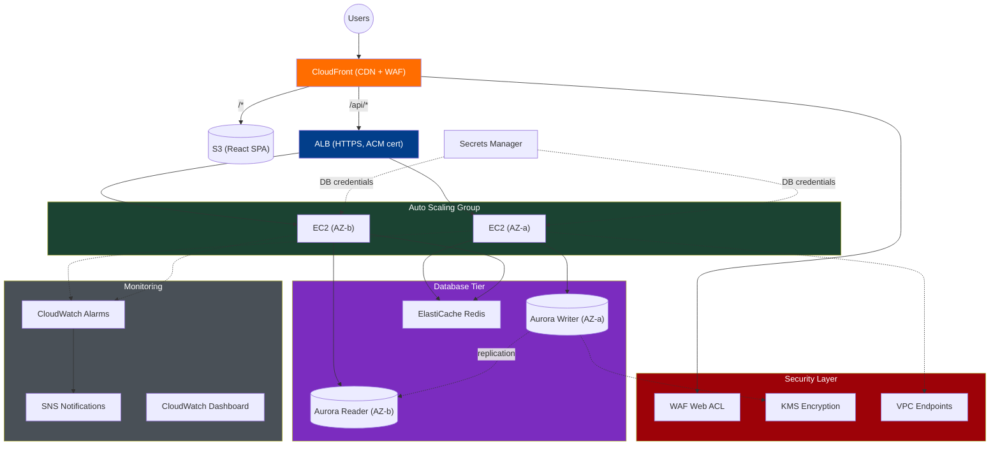

**Phase 1 — Networking (30 min):**
1. Deploy VPC via CloudFormation: 2 public subnets, 2 private app subnets, 2 private DB subnets
2. Create Internet Gateway + NAT Gateway
3. Create VPC Gateway Endpoints for S3 and DynamoDB
4. Configure NACLs for each subnet tier

**Phase 2 — Database (30 min):**
1. Create Aurora MySQL cluster (Multi-AZ, 1 writer + 1 reader)
2. Store credentials in Secrets Manager with auto-rotation
3. Create ElastiCache Redis cluster in DB subnets
4. Security Groups: DB SG allows port 3306 from App SG only; Redis SG allows 6379 from App SG only

**Phase 3 — Compute (45 min):**
1. Create AMI with app pre-installed (or use User Data)
2. Create Launch Template referencing app AMI + IAM role (Secrets Manager + S3 read)
3. Create Auto Scaling Group (min: 2, max: 6, target CPU 60%)
4. Create ALB with HTTPS listener (ACM certificate)
5. App reads DB creds from Secrets Manager, caches in ElastiCache

**Phase 4 — Frontend + CDN (30 min):**
1. Build React app, upload to S3 bucket
2. Create CloudFront distribution:
   - Behavior 1: `/api/*` → ALB origin (with custom header for origin verification)
   - Behavior 2: `/*` → S3 origin (with OAC)
3. Create WAF Web ACL on CloudFront (rate limiting + common rules)

**Phase 5 — Monitoring (30 min):**
1. Create CloudWatch Dashboard: ALB request count, EC2 CPU, Aurora connections, ElastiCache hit rate
2. Create Alarms: CPU > 80%, unhealthy hosts > 0, 5xx error rate > 1%
3. Create SNS topic for alarm notifications
4. Enable VPC Flow Logs → CloudWatch Logs

**Phase 6 — Validate & Break (45 min):**
1. Access application via CloudFront URL — verify full flow works
2. **Kill one AZ**: terminate all EC2s in AZ-a → verify ALB routes to AZ-b, Aurora fails over
3. **Stress test**: generate load → verify ASG scales out
4. **Security test**: try direct ALB access (should be blocked by custom header check)
5. **Cost review**: check Cost Explorer for all resources

**Phase 7 — Teardown:**
1. `aws cloudformation delete-stack --stack-name capstone` → everything gone
2. Verify no orphaned resources (NAT GW, EIPs, snapshots)

**What This Lab Proves:**
- [ ] You can design a multi-tier architecture from scratch
- [ ] You understand how services interact under failure
- [ ] You can implement defense-in-depth security
- [ ] You can monitor and alarm on the right metrics
- [ ] You can tear down cleanly with IaC

---

## 11.8 Capstone Lab 2: Serverless Event-Driven Order Processing

**Focus areas**: Lambda · SQS · SNS · DynamoDB · EventBridge · API Gateway · Step Functions · S3
**Estimated Time**: 6–8 hours
**Scenario**: Build a fully serverless order management system that processes orders asynchronously, sends notifications, and stores receipts in S3.

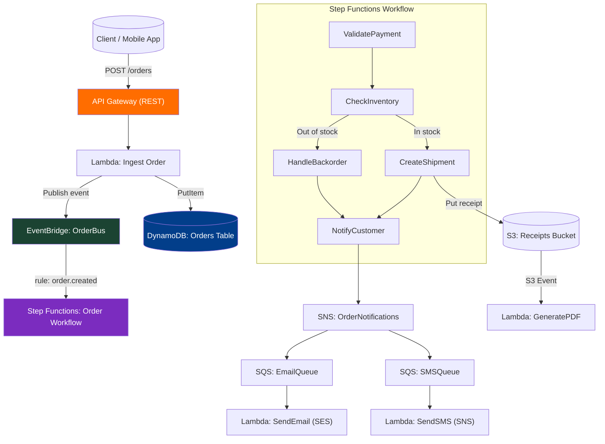

**Build Steps:**

**Phase 1 — Data & Messaging (45 min):**
1. Create DynamoDB table `Orders` (PK: `orderId`, SK: `createdAt`), enable Streams
2. Create S3 bucket `order-receipts-<account-id>` with SSE-KMS encryption
3. Create SNS topic `OrderNotifications`
4. Create two SQS queues: `EmailQueue` and `SMSQueue`, subscribe both to SNS
5. Create EventBridge custom event bus `OrderBus`

**Phase 2 — Step Functions Workflow (60 min):**
1. Create four Lambda functions: `ValidatePayment`, `CheckInventory`, `CreateShipment`, `HandleBackorder` — each returns a status JSON
2. Build Step Functions state machine (Standard workflow):
   ```json
   {
     "States": {
       "ValidatePayment": { "Type": "Task", "Next": "CheckInventory" },
       "CheckInventory": {
         "Type": "Choice",
         "Choices": [{"Variable": "$.inStock", "BooleanEquals": true, "Next": "CreateShipment"}],
         "Default": "HandleBackorder"
       },
       "CreateShipment": { "Type": "Task", "Next": "NotifyCustomer" },
       "HandleBackorder": { "Type": "Task", "Next": "NotifyCustomer" },
       "NotifyCustomer": { "Type": "Task", "End": true }
     }
   }
   ```
3. Add Retry (3 attempts, 2s backoff) and Catch → `ErrorHandler` state on every Task
4. Enable X-Ray tracing on the state machine

**Phase 3 — API & Orchestration (30 min):**
1. Create Lambda `IngestOrder`: validates body, writes to DynamoDB, publishes to EventBridge
2. Create EventBridge rule: `source = "order-service"`, detail-type `"order.created"` → target Step Functions
3. Create API Gateway REST API with POST `/orders` → Lambda integration
4. Enable request validation (body schema with `orderId`, `customerId`, `items`, `total`)

**Phase 4 — Consumers & Notifications (30 min):**
1. Create Lambda `SendEmail` triggered by `EmailQueue` (batch size 10)
2. Create Lambda `GeneratePDF` triggered by S3 PUT events on `order-receipts/`
3. Set DLQ on both SQS queues (maxReceiveCount: 3)

**Phase 5 — Validate & Observe (30 min):**
1. POST a valid order → trace through X-Ray service map
2. POST an invalid order → watch DLQ receive failed message
3. Force `CheckInventory` to return `inStock: false` → verify Backorder path
4. Check Step Functions execution history — inspect state transitions
5. View CloudWatch Logs Insights: query `filter @message like "ERROR"` across all Lambda log groups

**What This Lab Proves:**
- [ ] Design event-driven architectures with loose coupling
- [ ] Orchestrate complex workflows with error handling
- [ ] Implement fan-out messaging patterns
- [ ] Use X-Ray for distributed tracing across 6+ Lambda functions
- [ ] Apply dead-letter queues for resilient message processing

---

## 11.9 Capstone Lab 3: Multi-Region Active-Active with Global Routing

**Focus areas**: Route 53 · Aurora Global DB · DynamoDB Global Tables · CloudFront · Global Accelerator · Failover
**Estimated Time**: 6–8 hours
**Scenario**: Deploy a globally available application that serves users from the closest region with near-zero RPO/RTO.

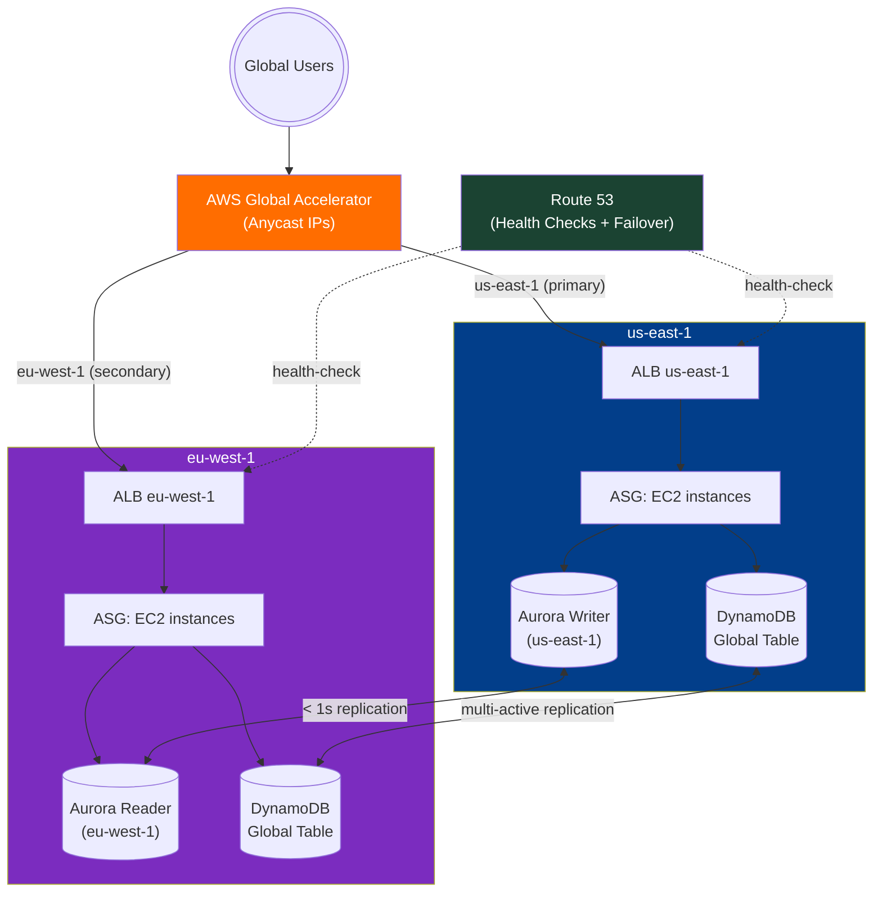

**Build Steps:**

**Phase 1 — Infrastructure in Both Regions (60 min):**
1. Deploy identical CloudFormation stacks in `us-east-1` and `eu-west-1`:
   - VPC (10.1.0.0/16 US, 10.2.0.0/16 EU), 2 public + 2 private subnets
   - ASG (min 1, max 4) + ALB with health check on `/health`
   - Simple app that reads/writes to DynamoDB and returns the region name
2. Use CloudFormation StackSets to deploy both simultaneously

**Phase 2 — Global Database (45 min):**
1. Create Aurora MySQL Global Database with **primary cluster in us-east-1**
2. Add secondary cluster in eu-west-1 (read replica promoted during failover)
3. Create DynamoDB Global Table `Sessions` — add replica in eu-west-1
4. Verify replication: write to US DynamoDB → read from EU DynamoDB within 1 second

**Phase 3 — Global Routing (30 min):**
1. Create **Global Accelerator** with two endpoint groups (US and EU ALBs):
   ```bash
   aws globalaccelerator create-accelerator --name multi-region-lab --ip-address-type IPV4
   aws globalaccelerator create-listener --accelerator-arn <arn> --protocol TCP --port-ranges FromPort=80,ToPort=80
   aws globalaccelerator create-endpoint-group --listener-arn <arn> --endpoint-region us-east-1
   aws globalaccelerator create-endpoint-group --listener-arn <arn> --endpoint-region eu-west-1
   ```
2. Create Route 53 health checks on both ALBs
3. Create Route 53 latency-based records pointing to each ALB
4. Create failover records as backup to Global Accelerator static IPs

**Phase 4 — Chaos Testing (45 min):**
1. Access app via Global Accelerator IP → note which region responds
2. Use `curl -w "%{time_total}"` to measure latency from different locations (VPN to simulate EU)
3. **Kill US region**: set ASG max=0 in us-east-1 → watch Global Accelerator failover to EU
4. Measure failover time: Global Accelerator (~30s) vs Route 53 (60-120s, depends on TTL)
5. **Aurora failover**: promote EU cluster to primary → measure RPO (near zero, transactions may be lost)
6. Scale US back up → verify both regions healthy

**What This Lab Proves:**
- [ ] Design active-active multi-region architectures
- [ ] Choose between Global Accelerator vs Route 53 for global traffic management
- [ ] Understand Aurora Global Database RPO/RTO characteristics
- [ ] Use DynamoDB Global Tables for multi-active data replication
- [ ] Measure and verify actual failover times

---

## 11.10 Capstone Lab 4: Serverless Data Lake & Analytics Pipeline

**Focus areas**: S3 · Kinesis · Glue · Athena · QuickSight · Lake Formation · Lambda · EventBridge
**Estimated Time**: 6–7 hours
**Scenario**: Build an end-to-end data pipeline that ingests real-time clickstream events, stores them in a data lake, transforms them with Glue, and visualises with Athena + QuickSight.

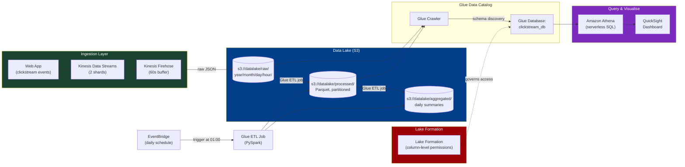

**Build Steps:**

**Phase 1 — Ingestion (30 min):**
1. Create Kinesis Data Stream `clickstream` (2 shards)
2. Create Kinesis Firehose delivery stream → S3 destination with dynamic partitioning:
   - Prefix: `raw/year=!{timestamp:yyyy}/month=!{timestamp:MM}/day=!{timestamp:dd}/`
   - Buffer: 60 seconds or 128 MB
   - Enable CloudWatch error logging
3. Write Python producer simulating clickstream events:
   ```python
   import boto3, json, random, time
   kinesis = boto3.client('kinesis', region_name='us-east-1')
   events = ['page_view', 'add_to_cart', 'purchase', 'search']
   pages  = ['/home', '/products', '/cart', '/checkout']
   while True:
       record = {
           'userId': f'user_{random.randint(1,1000)}',
           'event': random.choice(events),
           'page': random.choice(pages),
           'ts': int(time.time()),
           'sessionId': f'sess_{random.randint(1,200)}'
       }
       kinesis.put_record(StreamName='clickstream',
                          Data=json.dumps(record),
                          PartitionKey=record['userId'])
       time.sleep(0.1)
   ```
4. Run producer for 10 minutes → verify files land in S3

**Phase 2 — Glue Catalog & Crawler (30 min):**
1. Create S3 bucket `datalake-<account-id>` with three prefixes: `raw/`, `processed/`, `aggregated/`
2. Create Glue Database `clickstream_db`
3. Create Glue Crawler on `raw/` → schedule on-demand → run → verify table created
4. Preview table in Athena — query raw JSON data

**Phase 3 — ETL Transformation (45 min):**
1. Create Glue ETL job (PySpark, G.1X worker):
   ```python
   from awsglue.context import GlueContext
   from pyspark.context import SparkContext
   from awsglue.dynamicframe import DynamicFrame

   sc  = SparkContext()
   glc = GlueContext(sc)

   # Read raw data
   raw = glc.create_dynamic_frame.from_catalog(database='clickstream_db', table_name='raw')

   # Drop nulls, cast types, add derived column
   from awsglue.transforms import DropNullFields
   cleaned = DropNullFields.apply(raw)

   # Write as Parquet partitioned by event type
   glc.write_dynamic_frame.from_options(
       frame=cleaned,
       connection_type='s3',
       connection_options={'path': 's3://datalake-<acct>/processed/', 'partitionKeys': ['event']},
       format='parquet'
   )
   ```
2. Run job → verify Parquet files in `processed/`
3. Run crawler on `processed/` → new table in Glue catalog
4. Create EventBridge rule: cron `0 1 * * ? *` → trigger Glue job nightly

**Phase 4 — Lake Formation Permissions (20 min):**
1. Enable Lake Formation on the Glue database
2. Grant column-level permission: analyst IAM user can query all columns EXCEPT `userId` (PII)
3. Test: query as analyst → `userId` column not visible
4. Test: query as admin → all columns visible

**Phase 5 — Athena & QuickSight (30 min):**
1. Create Athena workgroup with S3 results bucket and per-query data scanned limit ($5)
2. Run analytical queries:
   ```sql
   -- Top 5 pages by page views last hour
   SELECT page, COUNT(*) as views
   FROM clickstream_db.processed
   WHERE event='page_view'
     AND year='2024' AND month='01'
   GROUP BY page ORDER BY views DESC LIMIT 5;

   -- Conversion funnel
   SELECT event, COUNT(DISTINCT sessionId) as sessions
   FROM clickstream_db.processed
   GROUP BY event ORDER BY sessions DESC;
   ```
3. Connect QuickSight to Athena → build dashboard: funnel chart, time-series line, top pages bar chart
4. Note the cost: $5/TB scanned vs Parquet (10x compression → 10x cheaper)

**What This Lab Proves:**
- [ ] Design end-to-end data lake architectures
- [ ] Choose between Kinesis Streams vs Firehose vs batch ingestion
- [ ] Use Glue ETL for format conversion and partitioning
- [ ] Apply Lake Formation for data governance and column-level security
- [ ] Understand Athena cost model (per-TB scanned) and how partitioning/Parquet reduces it

---

## 11.11 Capstone Lab 5: Disaster Recovery — Pilot Light to Warm Standby

**Focus areas**: Route 53 · RDS · EC2 AMI · CloudFormation · Elastic Disaster Recovery · Cross-Region
**Estimated Time**: 5–6 hours
**Scenario**: Implement and test a real DR plan: primary in `us-east-1`, disaster recovery in `eu-west-1`. Achieve RTO < 15 minutes.

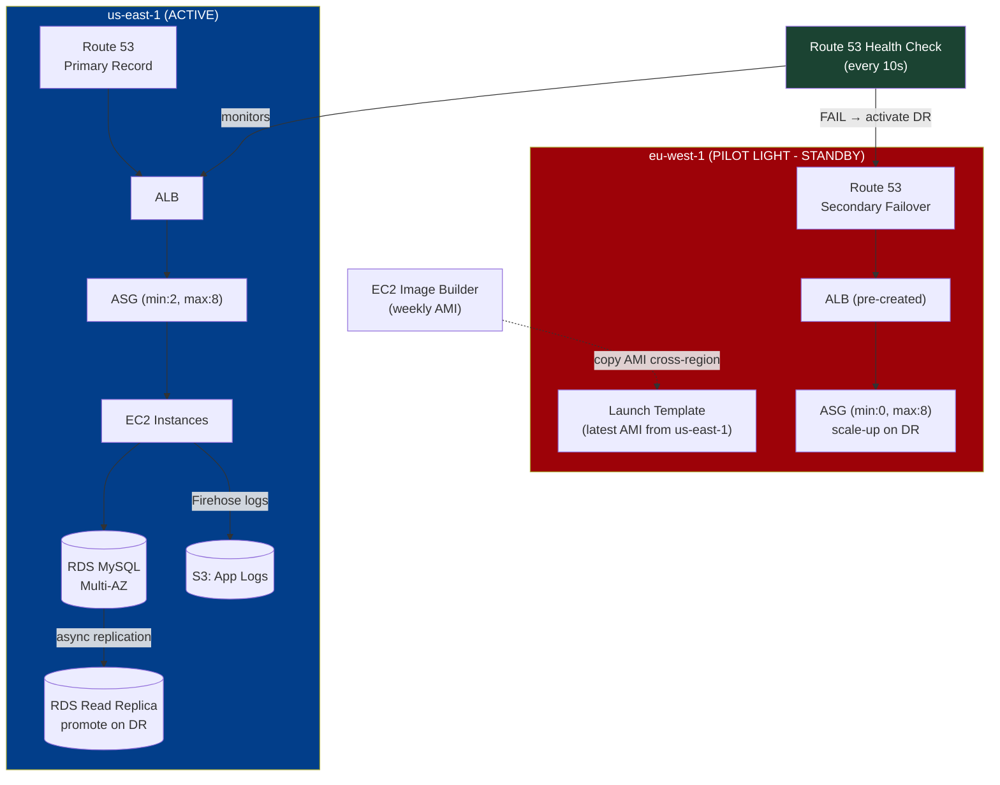

**Build Steps:**

**Phase 1 — Primary Region Setup (30 min):**
1. Deploy primary stack in `us-east-1`: VPC + ALB + ASG (min:2) + RDS MySQL Multi-AZ
2. App: simple Python Flask showing region name + DB record count
3. Create Route 53 health check on ALB (HTTP, `/health`, every 10s, threshold 2)
4. Create Route 53 primary failover record pointing to US ALB

**Phase 2 — Cross-Region AMI Pipeline (20 min):**
1. Create EC2 Image Builder pipeline:
   - Base: Amazon Linux 2
   - Component: install app + configure systemd
   - Schedule: weekly
2. After first build, copy AMI to `eu-west-1`:
   ```bash
   aws ec2 copy-image \
     --source-region us-east-1 \
     --source-image-id <ami-id> \
     --region eu-west-1 \
     --name "DR-AMI-$(date +%Y%m%d)"
   ```
3. Create Lambda + EventBridge rule: auto-copy new AMIs cross-region and update DR Launch Template

**Phase 3 — DR Region Pilot Light (30 min):**
1. Deploy DR stack in `eu-west-1`:
   - VPC (same CIDR structure)
   - ALB (pre-created, no targets yet)
   - ASG with Launch Template referencing DR AMI, **min: 0, desired: 0, max: 8**
   - RDS Read Replica from us-east-1 primary (set up cross-region replication)
2. Create Route 53 secondary failover record pointing to EU ALB
3. Verify: EU has NO running EC2 instances (pilot light = minimal cost)

**Phase 4 — DR Runbook Automation (45 min):**
Create SSM Automation document `ActivateDR`:
```yaml
schemaVersion: '0.3'
mainSteps:
  - name: PromoteRDSReplica
    action: aws:executeAwsApi
    inputs:
      Service: rds
      Api: PromoteReadReplica
      DBInstanceIdentifier: dr-replica-eu

  - name: ScaleUpASG
    action: aws:executeAwsApi
    inputs:
      Service: autoscaling
      Api: UpdateAutoScalingGroup
      AutoScalingGroupName: dr-asg-eu
      MinSize: 2
      DesiredCapacity: 2

  - name: WaitForInstances
    action: aws:sleep
    inputs:
      Duration: PT3M

  - name: VerifyHealth
    action: aws:executeAwsApi
    inputs:
      Service: elbv2
      Api: DescribeTargetHealth
      TargetGroupArn: !Ref DRTargetGroup
```

**Phase 5 — Chaos Test — DR Drill (60 min):**
1. **Time your RTO clock from now**
2. Simulate primary failure: set us-east-1 ASG max=0 (instances drain from ALB)
3. Watch Route 53 health check fail (within 30s)
4. Execute SSM Automation `ActivateDR` manually (or trigger automatically)
5. Verify: Route 53 failover to EU (DNS TTL 30s)
6. Verify: EU EC2 instances launch and register with EU ALB
7. **Measure total RTO** — target < 15 minutes
8. Verify: data from before failover is accessible via promoted RDS
9. Restore primary, failback to us-east-1

**Cost Analysis:**
| Component | Pilot Light Cost/month | Full Warm Standby Cost/month |
|-----------|----------------------|------------------------------|
| EC2 | $0 (0 instances) | ~$60 (2x t3.small) |
| RDS Replica | ~$25 (db.t3.micro) | ~$50 (Multi-AZ) |
| ALB | ~$16 (no traffic) | ~$16 |
| **Total** | **~$41/month** | **~$126/month** |

**What This Lab Proves:**
- [ ] Design and test a real DR plan with measured RTO
- [ ] Automate DR activation with SSM Automation
- [ ] Understand the cost/RTO trade-off between DR models
- [ ] Manage cross-region AMI lifecycle with Image Builder
- [ ] Implement Route 53 failover with health checks

---

## 11.12 Capstone Lab 6: Containerised Microservices with ECS Fargate

**Focus areas**: ECS · Fargate · ECR · ALB · Service Discovery · X-Ray · Secrets Manager · CloudWatch Container Insights
**Estimated Time**: 6–7 hours
**Scenario**: Deploy a microservices e-commerce app (3 services) on ECS Fargate with service-to-service communication and full observability.

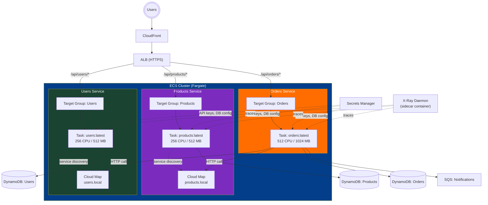

**Build Steps:**

**Phase 1 — Container Build & Registry (30 min):**
1. Write 3 minimal Python FastAPI microservices (users, products, orders)
2. Each `Dockerfile`:
   ```dockerfile
   FROM python:3.12-slim
   WORKDIR /app
   COPY requirements.txt .
   RUN pip install -r requirements.txt
   COPY . .
   CMD ["uvicorn", "main:app", "--host", "0.0.0.0", "--port", "8000"]
   ```
3. Create ECR repositories: `users-svc`, `products-svc`, `orders-svc`
4. Build and push all three images:
   ```bash
   aws ecr get-login-password | docker login --username AWS --password-stdin <account>.dkr.ecr.us-east-1.amazonaws.com
   docker build -t users-svc:latest ./users
   docker tag users-svc:latest <account>.dkr.ecr.us-east-1.amazonaws.com/users-svc:latest
   docker push <account>.dkr.ecr.us-east-1.amazonaws.com/users-svc:latest
   ```
5. Enable ECR image scanning on push — view vulnerability report

**Phase 2 — ECS Cluster & Task Definitions (45 min):**
1. Create ECS cluster (Fargate, Container Insights enabled)
2. Create Task Definitions for each service:
   - Include X-Ray daemon as **sidecar container** (`amazon/aws-xray-daemon:3.x`)
   - Inject secrets from Secrets Manager via `secrets:` in task definition
   - Set log driver: `awslogs` → CloudWatch log group
3. Create **AWS Cloud Map** namespace `microservices.local` for service discovery

**Phase 3 — ALB & Services (45 min):**
1. Create ALB with three target groups (port 8000 each)
2. Create three listener rules: `/api/users/*`, `/api/products/*`, `/api/orders/*`
3. Create ECS Services (one per microservice):
   - Launch type: Fargate
   - Desired count: 2
   - Enable service discovery via Cloud Map
   - Attach to respective target group

**Phase 4 — Service-to-Service Calls (20 min):**
1. Orders service calls Users via `http://users.microservices.local:8000/users/{id}`
2. Orders service calls Products via `http://products.microservices.local:8000/products/{id}`
3. Both calls use the Cloud Map DNS — no hardcoded IPs
4. Verify: POST `/api/orders` → Orders service fetches user + product details from sibling services

**Phase 5 — Observability (30 min):**
1. Open Container Insights → view CPU/memory per service, per task
2. Open X-Ray Service Map → view distributed trace: ALB → Orders → Users + Products
3. Filter traces by latency > 500ms → identify slow paths
4. Create CloudWatch alarm: `orders-svc` task count < 2 → SNS alert
5. Create CloudWatch dashboard: requests/min per service, P99 latency, error rate

**Phase 6 — Rolling Deployment (20 min):**
1. Update `orders-svc` Docker image (change a response message)
2. Push new image to ECR (`:v2` tag)
3. Update ECS service (force new deployment)
4. Watch: ECS performs rolling deployment — old tasks drain, new tasks register
5. Monitor: zero dropped requests during deployment

**What This Lab Proves:**
- [ ] Deploy and manage containerised microservices on Fargate
- [ ] Implement service-to-service discovery without hardcoded IPs
- [ ] Use X-Ray for distributed tracing across microservices
- [ ] Set up ECR with vulnerability scanning
- [ ] Perform zero-downtime rolling deployments

---

## 11.13 Capstone Lab 7: Security-Hardened Environment & Compliance Audit

**Focus areas**: IAM · GuardDuty · Security Hub · Config · CloudTrail · Macie · Inspector · WAF · KMS
**Estimated Time**: 5–6 hours
**Scenario**: Transform an intentionally misconfigured AWS account into a security-compliant environment, detecting and remediating issues automatically.

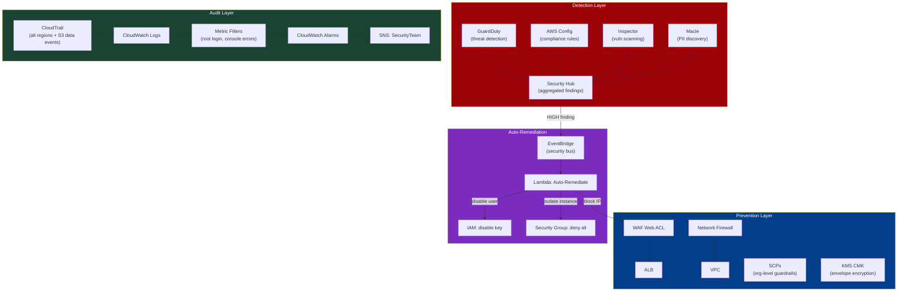

**Build Steps:**

**Phase 1 — Enable Detection Services (20 min):**
1. Enable GuardDuty (30-day free trial):
   ```bash
   aws guardduty create-detector --enable --finding-publishing-frequency FIFTEEN_MINUTES
   ```
2. Enable Security Hub with AWS Foundational Security Best Practices standard
3. Enable AWS Config with managed rules:
   - `s3-bucket-public-read-prohibited`
   - `iam-password-policy`
   - `ec2-instances-in-vpc`
   - `encrypted-volumes`
   - `rds-instance-public-access-check`
   - `cloudtrail-enabled`
4. Enable Inspector for EC2 + ECR
5. Enable Macie on your S3 buckets

**Phase 2 — Intentional Misconfigurations (20 min) — THE FUN PART:**
Create these deliberate violations and watch the tools catch them:
1. Create public S3 bucket with sensitive-sounding file (`customers.csv` with fake PII)
2. Create IAM user with `AdministratorAccess` and no MFA
3. Create access key and don't use it for 90+ days (Config rule will flag)
4. Launch EC2 with security group `0.0.0.0/0` on port 22
5. Create unencrypted RDS instance with public accessibility
6. Simulate GuardDuty finding: call an `nmap` scan on a known-bad IP from EC2

**Phase 3 — Observe Findings (30 min):**
1. Security Hub → All Findings → sort by severity
2. Verify each misconfiguration generated a finding:
   - Macie: found PII in S3 bucket
   - Config: `s3-bucket-public-read-prohibited` NON_COMPLIANT
   - GuardDuty: `Recon:EC2/PortProbeUnprotectedPort`
   - Inspector: CVE findings on EC2 AMI
3. Note finding severity and recommended remediation

**Phase 4 — Auto-Remediation Lambda (45 min):**
1. Create EventBridge rule: Security Hub finding with severity HIGH → trigger Lambda
2. Lambda `AutoRemediate`:
   ```python
   import boto3, json

   def handler(event, context):
       finding = event['detail']['findings'][0]
       ftype   = finding['Types'][0]
       resource = finding['Resources'][0]

       if 'S3' in ftype and 'PublicRead' in ftype:
           s3 = boto3.client('s3')
           bucket = resource['Id'].split(':::')[1]
           s3.put_public_access_block(
               Bucket=bucket,
               PublicAccessBlockConfiguration={
                   'BlockPublicAcls': True, 'IgnorePublicAcls': True,
                   'BlockPublicPolicy': True, 'RestrictPublicBuckets': True
               }
           )
           print(f"Blocked public access on bucket: {bucket}")

       elif 'IAMUser' in ftype and 'RootLogin' in ftype:
           sns = boto3.client('sns')
           sns.publish(TopicArn='arn:aws:sns:...:SecurityAlerts',
                      Message=f"ROOT LOGIN DETECTED: {json.dumps(finding)}")
   ```
3. Trigger: re-create the public S3 bucket → watch Lambda auto-remediate within 2 minutes

**Phase 5 — CloudTrail + CloudWatch Alerting (30 min):**
1. Create CloudWatch Metric Filter on CloudTrail log group:
   ```
   { ($.userIdentity.type = "Root") && ($.eventType != "AwsServiceEvent") }
   ```
2. Create alarm: `RootLoginCount >= 1` → SNS
3. Create metric filter: `ConsoleSignInFailureCount >= 5` → SNS (brute force indicator)
4. Create metric filter: unauthorized API calls → SNS
5. Test: sign in as root → verify alarm triggers within 5 minutes

**Phase 6 — Compliance Report (15 min):**
1. Security Hub → Summary → view compliance score (should be < 50% with misconfigs)
2. Remediate all findings manually
3. Re-run Config evaluations
4. Security Hub score should reach 80%+

**What This Lab Proves:**
- [ ] Enable and interpret findings from the full AWS security toolchain
- [ ] Design auto-remediation pipelines using EventBridge + Lambda
- [ ] Write CloudTrail-based CloudWatch alerts for critical security events
- [ ] Understand the difference between detective (GuardDuty, Config) and preventive controls (WAF, SCPs, SGs)
- [ ] Read and act on Security Hub compliance scores

---

## 11.14 Capstone Lab 8: Hybrid Storage Migration Pipeline

**Focus areas**: Storage Gateway (File Gateway) · DataSync · S3 · IAM · VPC Peering / VPN · EFS
**Estimated Time**: 5–6 hours
**Scenario**: Simulate an on-premises data center migration of NFS files and database backups to AWS using AWS DataSync and an S3 File Gateway.

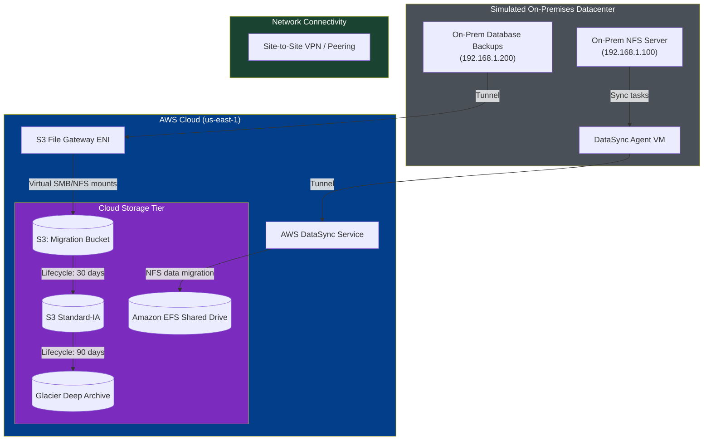

**Build Steps:**

**Phase 1 — Simulation Environment Setup (45 min):**
1. Create "On-Prem VPC" (192.168.0.0/16) and "AWS VPC" (10.0.0.0/16)
2. Setup VPC Peering to simulate a dedicated VPN/Direct Connect link
3. In "On-Prem VPC", launch an EC2 instance configured as a local NFS file server sharing `/var/nfs` populated with 10 GB of dummy files

**Phase 2 — AWS DataSync Configuration (60 min):**
1. Launch the DataSync Agent EC2 instance in the "On-Prem VPC" using the official AWS DataSync AMI
2. Activate the DataSync Agent using its private IP from the AWS VPC
3. Create source location: NFS server target `nfs://192.168.1.100/var/nfs`
4. Create destination location: Amazon EFS file system in the AWS VPC
5. Create and run a DataSync Task with execution verification (verify data integrity via SHA-256 validation)

**Phase 3 — S3 File Gateway Deployment (45 min):**
1. Deploy an AWS Storage Gateway (S3 File Gateway type) EC2 instance in the AWS VPC
2. Create an S3 Bucket `migration-target-<account-id>` with lifecycle rules:
   - Transition to Standard-IA after 30 days
   - Transition to Glacier Deep Archive after 90 days
3. Configure file share on the gateway mapping to the S3 bucket
4. Mount the S3 File Gateway share on an on-premises client via NFSv4:
   ```bash
   sudo mount -t nfs -o nolock,hard <gateway-private-ip>:/migration-target /mnt/s3-gateway
   ```

**Phase 4 — Execution & Cutover Validation (30 min):**
1. Run the DataSync task and monitor transfer throughput and execution logs in CloudWatch
2. Write a backup file directly to `/mnt/s3-gateway` on the on-premises client
3. Log into the AWS Console and verify that the file immediately appears as an object in the S3 bucket
4. Modify the file locally and check S3 versioning history

**What This Lab Proves:**
- [ ] Establish hybrid cloud network topologies for migration
- [ ] Install and configure AWS DataSync agents for file-based migration
- [ ] Connect Storage Gateway to local systems to provide hybrid local-cloud fileshares
- [ ] Implement S3 lifecycle policies to transition migrated data automatically
- [ ] Understand performance differences between DataSync (bulk migration) and Storage Gateway (hybrid cache)

---

## 11.15 Capstone Lab 9: High-Performance Computing (HPC) Batch Processing

**Focus areas**: AWS Batch · FSx for Lustre · Spot Instances · EFA (Elastic Fabric Adapter) · S3 · Placement Groups
**Estimated Time**: 5–6 hours
**Scenario**: Architect a high-performance batch processing system that performs parallel calculations on datasets pulled from S3 via a low-latency FSx for Lustre file system using Spot instances.

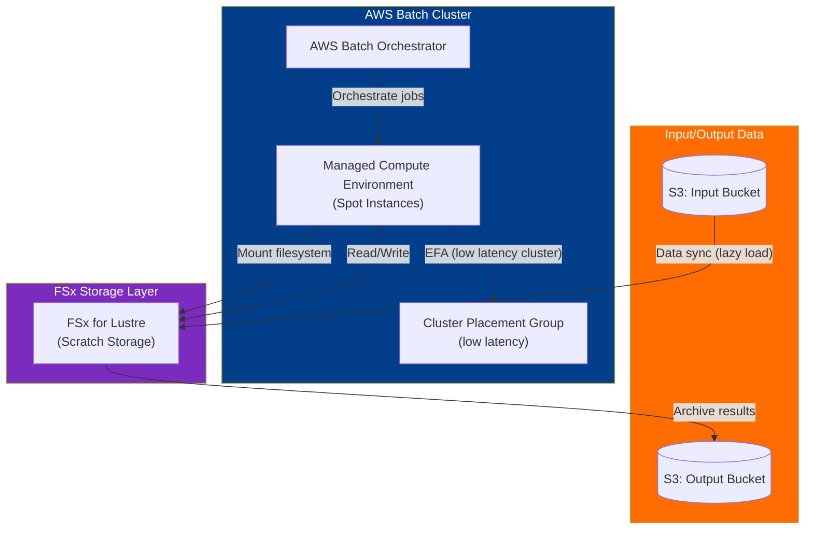

**Build Steps:**

**Phase 1 — High Performance Storage Tier (45 min):**
1. Create an S3 bucket `hpc-dataset-<account-id>` and upload a large sample dataset (e.g., public datasets or 5GB of mock numerical tables)
2. Deploy an FSx for Lustre file system linked to the S3 bucket:
   - Deployment type: Scratch_2 (optimized for temporary high-performance batch compute)
   - Enable S3 integration to sync data dynamically (lazy loading)

**Phase 2 — Network & Compute Environment (45 min):**
1. Create a Cluster Placement Group in the AWS VPC to guarantee instances are physically placed close to each other for sub-millisecond network latency
2. Create an AWS Batch Compute Environment:
   - Compute type: Managed, Spot instances (to minimize costs)
   - Instance types: `c5n` or `c6i` family (compute optimized, supporting EFA)
   - Max vCPUs: 64
   - Placement group: Link to the Cluster Placement Group created above

**Phase 3 — Job Definitions & Task Runner (45 min):**
1. Register an ECR repository and push a Docker image containing a numerical calculation script (e.g., Python numpy doing matrix multiplication or a video transcoding command)
2. Create an AWS Batch Job Definition:
   - Container Image: Point to the ECR image
   - Mount points: Configure `/fsx` inside the container to mount the FSx for Lustre mount name
   - vCPUs: 4, Memory: 8192 MB

**Phase 4 — Execution & Performance Analysis (30 min):**
1. Submit an AWS Batch Job queueing 10 parallel array jobs
2. Monitor compute environment scaling out — observe Spot instances launching inside the placement group
3. Watch the jobs process data through FSx for Lustre and write output back
4. Use FSx Data Repository Association tasks to sync results from FSx back to `s3://hpc-dataset/outputs/`
5. Analyze job logs in CloudWatch Logs and execution time metrics in AWS Batch console

**What This Lab Proves:**
- [ ] Build HPC compute environments with Spot Instances under AWS Batch
- [ ] Mount FSx for Lustre scratch filesystems to containers for high-speed file operations
- [ ] Leverage Cluster Placement Groups to minimize node-to-node latency
- [ ] Configure bidirectional data synchronization between S3 and FSx for Lustre
- [ ] Optimize cost vs. speed using Spot compute nodes for batch workloads

---

## 12. Week 12: Design Challenges + Mock Exams

**KodeKloud Modules**: Applying Design Skills (21 lessons) + Final (5 lessons)
**Estimated Time**: 25–30 hours

### 12.1 Architecture Design Challenges

Work through each challenge by **drawing the architecture** before looking at solutions:

#### Security Challenges
- [ ] Detect malware in files uploaded via AWS Transfer Family
- [ ] Secure CloudFront custom origins with WAF
- [ ] Lab instrument log acquisition pipeline with analytics
- [ ] Multi-account security strategy for serverless data platform
- [ ] Secure remote worker environment

#### Reliability Challenges
- [ ] Anomaly detection for industrial IoT workloads
- [ ] DERMS (distributed energy) on AWS
- [ ] Domain consistency in event-driven architectures
- [ ] GenAI-powered contact center with Bedrock

#### Performance Challenges
- [ ] Observability with monitoring stack
- [ ] Industrial predictive maintenance pipeline
- [ ] Geospatial data lake at scale
- [ ] Industrial DataOps data fabric

#### Cost Challenges
- [ ] IoT + AI/ML connected restaurant architecture
- [ ] Port logistics data platform
- [ ] Dual-stack IPv6 VPC reference architecture
- [ ] Microservices with EKS

### 12.2 Mock Exam Strategy

**Exam Format:**
- 65 questions (50 scored + 15 unscored)
- 130 minutes
- 720/1000 passing score
- Multiple choice + multiple response

**Week 12 Schedule:**

| Day | Activity |
|-----|----------|
| Mon | Take KodeKloud mock exam (untimed, open-book) — identify weak areas |
| Tue | Review wrong answers, re-study weak topics |
| Wed | Take Tutorials Dojo practice exam #1 (timed, 130 min) |
| Thu | Review all wrong answers with explanations |
| Fri | Take Tutorials Dojo practice exam #2 (timed) |
| Sat | Final review of high-frequency topics |
| Sun | Light review, rest before exam |

### 12.3 Exam Day Tips

> [!TIP]
> - Flag difficult questions and come back (you have time)
> - Eliminate obviously wrong answers first
> - Look for keywords: "cost-effective" → cheapest solution, "most secure" → strictest controls, "least operational overhead" → managed/serverless, "minimum downtime" → Multi-AZ or blue/green
> - If two answers seem correct, choose the one with least operational overhead
> - AWS almost never wants you to use custom-built solutions when a managed service exists

---

## 13. Lab Cost Management Strategy

> [!WARNING]
> Labs on real AWS will cost money. Budget **$50–100 USD** total for the 12-week plan if you tear down promptly.

**Cost-Saving Rules:**

| Rule | Savings |
|------|---------|
| Use t2.micro/t3.micro (free tier) | Free for 750 hrs/month (first 12 months) |
| Delete NAT Gateways immediately after lab | ~$0.045/hr + data processing |
| Delete RDS instances after lab | ~$0.017/hr for db.t3.micro |
| Use `aws configure set region us-east-1` | Cheapest region |
| Tag everything, run weekly cleanup script | Prevents orphaned resources |
| Use CloudFormation for labs → easy teardown | One `delete-stack` cleans everything |
| Stop EC2 instances when not in use | Stops compute billing (EBS still billed) |

**Weekly Cleanup Script:**
```bash
#!/bin/bash
# Find all SAA-Study tagged resources
echo "=== SAA-Study Resources ==="
aws resourcegroupstaggingapi get-resources \
  --tag-filters Key=Project,Values=SAA-Study \
  --query 'ResourceTagMappingList[].ResourceARN' \
  --output table

echo ""
echo "=== Running EC2 Instances ==="
aws ec2 describe-instances \
  --filters "Name=tag:Project,Values=SAA-Study" "Name=instance-state-name,Values=running" \
  --query 'Reservations[].Instances[].[InstanceId,InstanceType,State.Name]' \
  --output table

echo ""
echo "=== NAT Gateways (COSTLY!) ==="
aws ec2 describe-nat-gateways \
  --filter "Name=state,Values=available" \
  --query 'NatGateways[].[NatGatewayId,State]' \
  --output table

echo ""
echo "=== Current Month Costs ==="
aws ce get-cost-and-usage \
  --time-period Start=$(date -d "$(date +%Y-%m-01)" +%Y-%m-%d),End=$(date +%Y-%m-%d) \
  --granularity MONTHLY \
  --metrics BlendedCost \
  --query 'ResultsByTime[0].Total.BlendedCost'
```

---

## 14. Exam Day Checklist

- [ ] Schedule exam at [aws.training](https://aws.training) (Pearson VUE or PSI)
- [ ] Online proctored or test center — your choice
- [ ] Valid government ID
- [ ] Clear desk, quiet room (for online)
- [ ] Stable internet connection (for online)
- [ ] Arrive 15 minutes early
- [ ] Results: immediate pass/fail, detailed score within 5 business days

---

## Appendix A: High-Frequency Exam Topics Cheat Sheet

| Topic | What to Know |
|-------|-------------|
| **VPC** | CIDR, subnets, route tables, IGW, NAT, SG vs NACL |
| **S3** | Storage classes, encryption, policies, replication, lifecycle |
| **EC2** | Instance types, purchasing, placement groups, user data, AMI |
| **RDS/Aurora** | Multi-AZ vs Read Replica, Aurora Serverless, RDS Proxy |
| **DynamoDB** | Keys, indexes, DAX, Streams, Global Tables, capacity modes |
| **Lambda** | Limits (15 min, 10 GB), VPC access, concurrency, destinations |
| **ELB** | ALB vs NLB vs GLB, health checks, sticky sessions |
| **Auto Scaling** | Policies, lifecycle hooks, target tracking |
| **SQS/SNS** | FIFO vs Standard, DLQ, fan-out pattern |
| **CloudFront** | OAC, cache behaviors, Lambda@Edge vs CF Functions |
| **Route 53** | All routing policies, alias vs CNAME, health checks |
| **IAM** | Policies, roles, cross-account, STS, permission boundaries |
| **KMS** | CMK, envelope encryption, key policies, grants |
| **CloudFormation** | Templates, stacks, change sets, drift detection |
| **Organizations** | OUs, SCPs, consolidated billing |
| **CloudWatch** | Metrics, alarms, logs, custom metrics, agent |
| **Kinesis** | Data Streams vs Firehose vs Analytics |
| **DR** | Backup & Restore → Pilot Light → Warm Standby → Active-Active |

---

## Appendix B: Service Decision Trees

### Which Database?

```
Need a database?
├─ Relational (SQL)?
│   ├─ Need serverless auto-scaling? → Aurora Serverless
│   ├─ Need < 1s cross-region replication? → Aurora Global Database
│   ├─ Need Oracle/SQL Server licensing? → RDS on Dedicated Host
│   ├─ Need >5 read replicas? → Aurora (up to 15)
│   └─ General relational? → RDS (MySQL/PostgreSQL)
├─ Key-value with millisecond latency?
│   ├─ Unpredictable traffic? → DynamoDB On-Demand
│   ├─ Predictable traffic? → DynamoDB Provisioned + Auto Scaling
│   └─ Need microsecond reads? → DynamoDB + DAX
├─ In-memory cache?
│   ├─ Need persistence/replication? → ElastiCache Redis
│   ├─ Simple caching, multi-threaded? → ElastiCache Memcached
│   └─ Need Redis as primary DB (durable)? → MemoryDB
├─ Document store (MongoDB-compatible)? → DocumentDB
├─ Graph relationships? → Neptune
├─ Time-series (IoT, metrics)? → Timestream
├─ Immutable ledger (audit trail)? → QLDB
├─ Wide-column (Cassandra-compatible)? → Keyspaces
├─ Full-text search + log analytics? → OpenSearch
└─ Data warehouse (OLAP, analytics)? → Redshift
```

### Which Compute?

```
Need compute?
├─ Run < 15 min, event-driven? → Lambda
├─ Container-based?
│   ├─ Need Kubernetes API? → EKS
│   ├─ AWS-native orchestration?
│   │   ├─ Don't want to manage EC2? → ECS + Fargate
│   │   └─ Need GPU/custom AMI? → ECS + EC2
│   └─ Just deploy from source/image, no config? → App Runner
├─ Traditional VM?
│   ├─ Full control needed? → EC2
│   ├─ Want PaaS (deploy code, not infra)? → Elastic Beanstalk
│   └─ Simple, predictable pricing? → Lightsail
├─ Batch processing (no real-time)? → AWS Batch
└─ On-premises AWS infra? → Outposts
```

### Which Storage?

```
Need storage?
├─ Block storage (single EC2 attach)?
│   ├─ Persistent, survives stop? → EBS
│   │   ├─ General purpose? → gp3
│   │   ├─ High IOPS database? → io2 Block Express
│   │   └─ Sequential throughput (big data)? → st1
│   └─ Highest IOPS, ephemeral OK? → Instance Store
├─ Shared file system?
│   ├─ Linux (NFS)? → EFS
│   ├─ Windows (SMB)? → FSx for Windows
│   ├─ HPC / ML training? → FSx for Lustre
│   └─ Multi-protocol (NFS+SMB+iSCSI)? → FSx for NetApp ONTAP
├─ Object storage? → S3
│   ├─ Frequent access? → S3 Standard
│   ├─ Unknown access pattern? → S3 Intelligent-Tiering
│   ├─ Infrequent but rapid? → S3 Standard-IA
│   ├─ Archive, ms access? → Glacier Instant Retrieval
│   ├─ Archive, hours? → Glacier Flexible Retrieval
│   └─ Archive, 12+ hours? → Glacier Deep Archive
└─ Hybrid (on-prem + cloud)?
    ├─ File gateway (NFS/SMB → S3)? → Storage Gateway File
    ├─ Block gateway (iSCSI → EBS)? → Storage Gateway Volume
    └─ Tape replacement? → Storage Gateway Tape
```

### Which Messaging/Integration?

```
Need async communication?
├─ Simple queue (decouple producers/consumers)?
│   ├─ Need ordering + exactly-once? → SQS FIFO
│   └─ Maximum throughput? → SQS Standard
├─ Fan-out to multiple subscribers? → SNS
├─ Event-driven, rule-based routing? → EventBridge
├─ Orchestrate multi-step workflow? → Step Functions
├─ Migrate from ActiveMQ/RabbitMQ? → Amazon MQ
└─ Real-time streaming?
    ├─ Custom consumers, replay? → Kinesis Data Streams
    └─ Just deliver to S3/Redshift? → Kinesis Firehose
```

### Which Migration Strategy?

```
Migrating to AWS?
├─ Move servers as-is? → Rehost (MGN)
├─ Move with minor optimization? → Replatform (e.g., RDS instead of self-managed DB)
├─ Replace with SaaS? → Repurchase (e.g., move to Salesforce)
├─ Redesign for cloud-native? → Refactor (containers, serverless)
├─ No longer needed? → Retire
├─ Can't move yet? → Retain
└─ VMware workloads? → Relocate (VMware Cloud on AWS)

Moving data?
├─ < 10 TB, good internet? → DataSync or S3 Transfer Acceleration
├─ 10-80 TB, limited bandwidth? → Snowball Edge
├─ > 80 TB? → Snowball Edge (multiple) or Snowmobile (100 PB)
├─ Ongoing file sync? → DataSync (scheduled)
├─ Database migration?
│   ├─ Same engine (MySQL→MySQL)? → DMS
│   └─ Different engine (Oracle→Aurora)? → SCT + DMS
└─ SFTP/FTPS users → S3? → Transfer Family
```

---

## Appendix C: Troubleshooting Scenarios

Master these failure modes — the exam tests them directly.

### Network Troubleshooting

| Symptom | Diagnostic Flow | Likely Fix |
|---------|----------------|------------|
| **EC2 can't reach internet** | 1. Public IP assigned? 2. IGW attached? 3. Route table has `0.0.0.0/0 → IGW`? 4. SG allows outbound? 5. NACL allows outbound + ephemeral inbound? | Usually missing route to IGW or no public IP |
| **Private EC2 can't reach internet** | 1. NAT Gateway exists in public subnet? 2. NAT GW has Elastic IP? 3. Private route table has `0.0.0.0/0 → NAT GW`? 4. NAT GW's subnet has route to IGW? | Usually NAT GW not in a public subnet or missing route |
| **EC2 can't reach S3 from private subnet** | 1. NAT Gateway OR VPC Gateway Endpoint configured? 2. Route table has prefix list for S3 endpoint? 3. Endpoint policy allows the bucket? 4. Bucket policy allows the VPC/endpoint? | Add Gateway Endpoint (free) instead of NAT |
| **VPC Peering not working** | 1. Peering connection accepted? 2. Route tables updated in BOTH VPCs? 3. SGs allow traffic from peer CIDR? 4. NACLs allow traffic? 5. No overlapping CIDRs? | Usually missing route table entries |
| **ALB returns 502/503** | 1. Target instances healthy? 2. SG on targets allows traffic from ALB SG? 3. Health check path returns 200? 4. App actually running on correct port? | SG misconfiguration or app not responding on health check path |
| **Can't SSH to EC2** | 1. SG allows port 22 from your IP? 2. NACL allows port 22 inbound + ephemeral outbound? 3. Key pair correct? 4. Instance has public IP (or using bastion)? | SG doesn't have your current IP |

### Compute Troubleshooting

| Symptom | Diagnostic Flow | Likely Fix |
|---------|----------------|------------|
| **Lambda timeout in VPC** | 1. Lambda in private subnet? 2. NAT Gateway or VPC endpoint for the target service? 3. SG on Lambda ENI allows outbound? 4. Timeout set high enough? | Lambda in public subnet can't get internet (no IGW for Lambda). Needs NAT in private subnet |
| **Lambda cold starts too slow** | 1. VPC-attached? (adds ENI setup time) 2. Large deployment package? 3. Heavy initialization code? | Use Provisioned Concurrency, or remove VPC if not needed |
| **EC2 User Data not executing** | 1. Script starts with `#!/bin/bash`? 2. Checked `/var/log/cloud-init-output.log`? 3. User Data only runs on FIRST boot | Check cloud-init logs. User Data doesn't run on stop/start |
| **ASG not scaling** | 1. Scaling policy attached? 2. CloudWatch alarm in ALARM state? 3. Max capacity reached? 4. Cooldown period active? | Check CloudWatch metrics and ASG activity history |

### Storage & Database Troubleshooting

| Symptom | Diagnostic Flow | Likely Fix |
|---------|----------------|------------|
| **S3 Access Denied** | 1. IAM policy allows? 2. Bucket policy allows? 3. Block Public Access settings? 4. Object ACL? 5. If SSE-KMS: do you have `kms:Decrypt` permission? 6. VPC Endpoint policy restricting? | Check ALL layers — IAM AND bucket policy AND Block Public Access AND KMS |
| **RDS connection refused** | 1. SG allows port 3306/5432 from client? 2. DB in same VPC or publicly accessible? 3. Correct endpoint (writer vs reader)? 4. DB instance running? | SG doesn't allow inbound from app SG |
| **RDS Multi-AZ failover slow** | 1. Using DNS endpoint (not IP)? 2. Connection pool handles reconnection? 3. Application retries on connection error? | Always use RDS DNS endpoint, never cache IP. Use RDS Proxy for faster failover |
| **DynamoDB throttling** | 1. Provisioned capacity too low? 2. Hot partition? 3. Burst capacity exhausted? | Switch to On-Demand, or increase WCU/RCU, or redesign partition key |
| **EBS volume not available on new EC2** | 1. Volume in same AZ as instance? 2. Volume attached to another instance? | EBS is AZ-locked. Snapshot → create volume in target AZ |

### Security Troubleshooting

| Symptom | Diagnostic Flow | Likely Fix |
|---------|----------------|------------|
| **IAM user can't perform action** | 1. IAM policy allows? 2. Permissions boundary restricting? 3. SCP restricting? 4. Resource-based policy denying? 5. Explicit deny anywhere? | Explicit deny overrides everything. Check SCPs if in Organizations |
| **Cross-account access fails** | 1. Trust policy on role allows the source account? 2. Source account IAM policy allows `sts:AssumeRole`? 3. Role ARN correct? | Both sides need correct policies: trust policy AND IAM policy |
| **KMS decrypt fails** | 1. Key policy allows caller? 2. IAM policy has `kms:Decrypt`? 3. Key in correct region? 4. Key not disabled/deleted? | KMS key policy AND IAM policy must both allow |

---

> [!NOTE]
> This plan is self-contained. Each week builds on the previous. Follow the sequence.
> Focus on **understanding WHY** AWS designed services a certain way — the exam tests architectural reasoning, not memorization.

**Good luck! 🎯**
