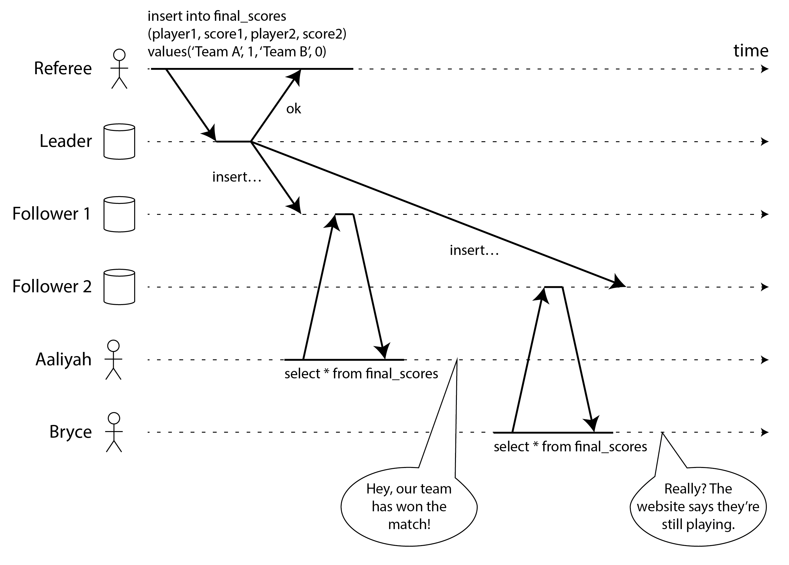
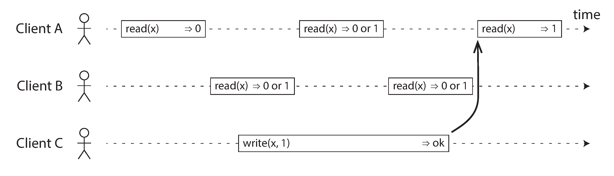
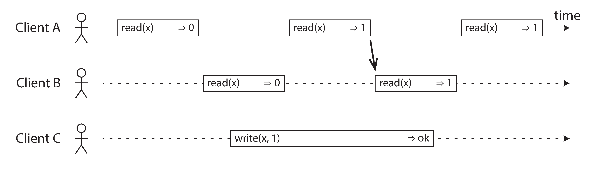
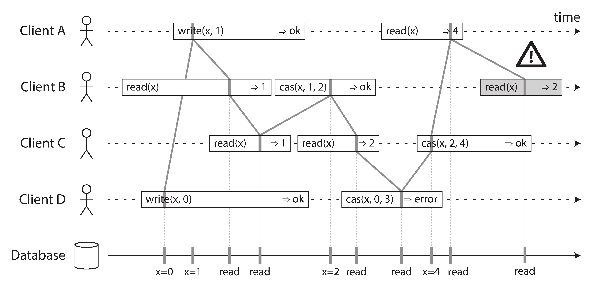
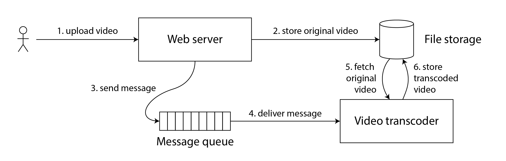
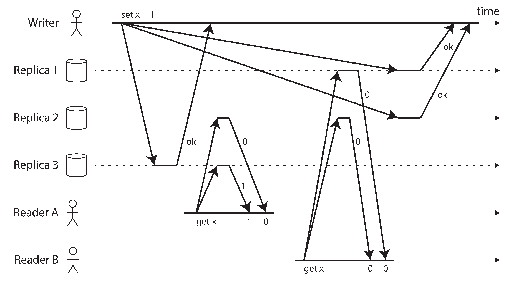
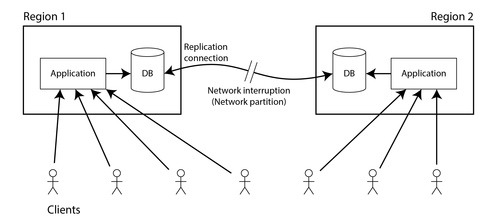
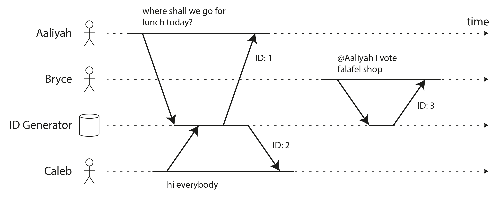
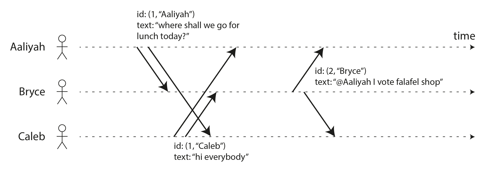
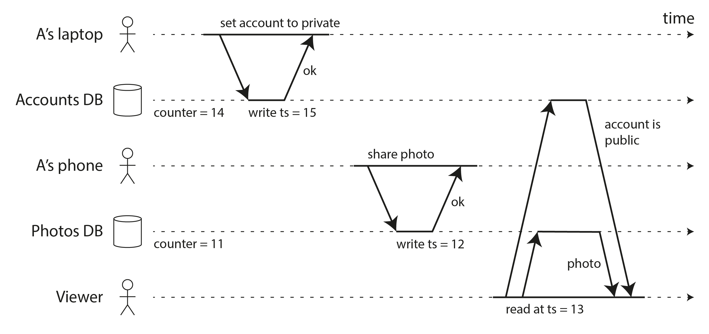

# Chapter 10: Consistency and Consensus

*"Never go to sea with two chronometers; take one or three."* — Frederick P. Brooks Jr.

As established in Chapter 9, distributed systems are chaotic and prone to an endless myriad of faults. To survive these faults, our best tool is **Replication** (keeping multiple copies of data on different nodes). However, as we saw in Chapter 6, replication introduces a massive new problem: **Inconsistency** (e.g., stale reads, or concurrent write conflicts).

At a high level, there are two competing philosophies for dealing with replication inconsistencies:

### 1. Eventual Consistency
*   **The Philosophy:** The system makes no attempt to hide the reality of replication. The application developer is fully responsible for handling the chaos, inconsistencies, and write conflicts. 
*   **Where it's used:** Multi-leader and Leaderless replication architectures. 
*   **When to use it:** When high availability is critical, or when applications must work offline (e.g., Local-First software).

### 2. Strong Consistency
*   **The Philosophy:** The database completely hides the messy reality of replication. To the application developer, the database behaves exactly as if it were a single, perfect, fault-free node.
*   **The Cost:** While it makes application development dramatically simpler, ensuring strong consistency incurs heavy performance penalties and can cause total system outages if certain faults occur (faults that an Eventually Consistent system would easily survive).

This chapter dives deep into the **Strongly Consistent** approach, focusing on three core areas:
1.  Defining exactly what "Strong Consistency" mathematically means (**Linearizability**).
2.  The surprising difficulty of generating IDs and Timestamps.
3.  How we actually achieve linearizability while surviving faults (**Consensus Algorithms**).

---

## 1. Linearizability
If an engineer asks for "Strong Consistency," they are usually asking for a specific mathematical guarantee called **Linearizability** (also known as *Atomic Consistency*, *Immediate Consistency*, or *External Consistency*).

The goal of Linearizability is simple: **Make a replicated system appear as if there is only exactly one copy of the data, and all operations on it are atomic.**

If a system is linearizable, it provides a strict **recency guarantee**. The instant that *any* client successfully completes a write to the database, *every other client* reading from the database is mathematically guaranteed to see that exact new value. They will never accidentally read from a stale cache or lagging replica.

### A Violation of Linearizability
To understand linearizability, it is easiest to look at a system that fails to provide it.

Imagine a nonlinearizable sports website running on a replicated database:
1.  The game ends. The master database is updated with the final score.
2.  **Aaliyah** hits refresh on her phone. Her request routes to the Master node. She receives the final score.
3.  Aaliyah excitedly turns to Bryce and announces the winner.
4.  **Bryce** hears this and incredulously hits refresh on his own phone. 
5.  His request happens to route to an asynchronous Read Replica that is currently lagging by two seconds.
6.  Bryce's screen shows the game is still ongoing! 

This is a **Violation of Linearizability**. 
If Aaliyah and Bryce had refreshed at the exact same millisecond, different results would be excusable. But because Bryce physically hit refresh *after* he heard Aaliyah announce the final score, the timeline established that the data existed in the real world *before* his query began. Because Bryce's query returned a stale result that violated this real-world timeline, the database is considered nonlinearizable.

### What Makes a System Linearizable?
To fully understand how to build a linearizable database, we need to trace the exact timings of reads and writes. 
In distributed systems theory, when multiple clients read/write the same object, that object is called a **Register**.

#### The Rules of Concurrency
Imagine a timeline where a Register `x` initially holds the value `0`. 
Client C begins writing the new value `1` to the database. At the exact same time, Clients A and B are violently polling the database, sending read requests to see the latest value.

Because of unpredictable network delays, Client C's write request takes some time to arrive at the database, process, and return. During this ongoing window:
*   If a read happens *before* the write begins, it mathematically must return `0`.
*   If a read happens *after* the write completes, it mathematically must return `1`.
*   If a read overlaps in time with the write (they are **Concurrent**), the read could return *either* `0` or `1`. Neither answer violates physics, because the write might be sitting in a router queue or half-committed to memory.

However, simply saying "concurrent reads can return either value" is not enough to achieve Linearizability! If we leave it at that, Client A might read `1`, then immediately read `0` again while the write is still resolving. This destroys the illusion of a single, perfect copy of data.

#### The Flipping Point
To achieve Linearizability, we must add a strict mathematical constraint:

We must mathematically guarantee that at exactly one specific microsecond *during* the write operation, the value of the Register instantaneously flips from `0` to `1`. 

**The Golden Rule of Linearizability:** If *any* client successfully reads the new value `1`, then **every single read that begins after that exact millisecond** must also return `1` (or a newer value). The database is never allowed to "forget" the new value and regress back to `0`, even if the write operation itself hasn't technically finished confirming with the client.

#### Visualizing Linearizable Sequences
We can visualize this by drawing a vertical line down every operation bar. This line represents the exact millisecond the database physically executed the command.

In a linearizable system, if you connect these vertical execution lines chronologically, the connecting wire must **always** move forward in time (left to right). It can never loop backwards. Once the wire moves past a new value, the system's state has advanced permanently.

*(In the diagram above, the final read by B violates linearizability because it attempts to read the value `2`, even though Client A chronologically already read the newer value `4`. This pulls the timeline backwards).*

### Linearizability vs. Serializability
These two terms sound incredibly similar but define completely different computer science concepts. It is critical to memorize the distinction:

*   **Serializability (Isolation Level):** A property of *Transactions* containing multiple operations across multiple objects (rows/documents). It guarantees that if two transactions run simultaneously, the final database state will look exactly as if they had been executed one by one in a serial order. However, **Serializability allows stale reads!** A fully serializable database can legally return data from an hour ago, as long as the transactions don't conflict.
*   **Linearizability (Recency Guarantee):** A property of an *individual object* (register). It doesn't group operations into transactions, meaning it cannot stop Write Skew. However, it guarantees pure recency: if Operation A finishes before Operation B starts, Operation B mathematically *must* see the state generated by A.

If a database guarantees both (transactions are isolated AND immediately fresh on all nodes), it is called **Strict Serializability** (or Strong-1SR). Single-node databases do this naturally. Truly distributed databases built for this (like Google Spanner and FoundationDB) achieve it, but at immense engineering and coordination costs.

## 2. Relying on Linearizability
Viewing an outdated sports score is annoying but harmless. However, there are several critical architectural scenarios where a lack of Linearizability will completely destroy your system:

### Locking and Leader Election
In a Single-Leader replication setup, you must guarantee there is exactly one leader to avoid split-brain data corruption. This is often achieved by having nodes race to acquire a **Lease** (a distributed lock) on startup.

The storage system granting this lease **must** be linearizable. If it is not, two nodes could concurrently believe they acquired the exact same lock! This is why databases rely on linearizable coordination services like **Apache ZooKeeper** or **etcd** to manage leader elections. (Note: ZooKeeper only provides linearizable *writes*; etcd v3 provides linearizable reads by default).

### Constraints and Uniqueness Guarantees
If your database enforces a strict uniqueness constraint (e.g., "Two users cannot register the same username" or "Two people cannot book the same airplane seat"), this inherently requires Linearizability.

The operation acts exactly like a Distributed Lock or an Atomic Compare-And-Set (`CAS`). To enforce that a bank balance doesn't drop below zero, every node in the cluster must mathematically agree on exactly what the single, up-to-date balance is. If constraints are treated "loosely" (e.g., airlines intentionally overbooking flights and sorting it out with vouchers later), you can survive without linearizability. But for hard database constraints, it is mandatory. 

### Cross-Channel Timing Dependencies
Linearizability violations often happen when your system has **two different communication channels** racing against each other. 

In the sports score example, the two channels were:
1. The slow Database Replication channel.
2. The fast Audio channel (Aaliyah telling Bryce the score).

Consider a web architecture where a user uploads a video:
1. The web server writes the 5GB video file to a Cloud Storage service.
2. The web server then pushes a tiny message to a highly-optimized Message Queue (e.g., RabbitMQ), telling a Transcoder Worker to compress the new video.
3. The Transcoder reads the queue instantly and attempts to fetch the raw video from the Cloud Storage.

If the Cloud Storage is *not* linearizable, its internal replication might be slower than the Message Queue. The transcoder races to the storage service and either finds a stale, older version of the file, or a 404 Not Found error, crashing the job. 

To fix this, the storage service must provide immediate recency (Linearizability), guaranteeing that if the write finished *before* the message queue was pinged, the data is globally visible.

## 3. Implementing Linearizable Systems
If Linearizability means "behave as though there is only a single copy of the data," the most obvious solution is to literally only host a single copy of the data. 

However, a single node cannot tolerate faults. If it crashes, all data is lost or offline. To survive datacenter outages, we must use Replication. But how do the different replication methods stack up when trying to achieve Linearizability?

1.  **Single-Leader Replication (*Potentially* Linearizable)**
    *   If you route **100%** of your reads and writes exclusively to the Leader node, your system is technically linearizable (since there is only one authoritative copy).
    *   *The Catch:* This assumes you actually know who the Leader is! Due to process pauses and network faults (covered in Chapter 9), a "Zombie" node might incorrectly believe it is still the leader. If clients read from this delusional Zombie, linearizability is instantly violated. Furthermore, asynchronous failover can lose committed writes, destroying the timeline.
2.  **Consensus Algorithms (*Likely* Linearizable)**
    *   Consensus algorithms (like ZooKeeper's *Zab* or etcd's *Raft*) are essentially Single-Leader replication systems that have been mathematically bulletproofed to safely auto-elect leaders and prevent split-brain. 
    *   These are the tools actually used to build linearizable infrastructure. 
    *   *The Catch:* Even here, if the algorithm allows a node to serve a read *without* verifying it is still the current leader, the read could be stale.
3.  **Multi-Leader Replication (*Not* Linearizable)**
    *   Because multiple nodes accept writes concurrently and blindly replicate them asynchronously to the background, conflicts are guaranteed. It is fundamentally impossible for a Multi-Leader architecture to act like a single, atomic copy of data.
4.  **Leaderless Replication (*Probably Not* Linearizable)**
    *   Databases like Dynamo, Cassandra, and ScyllaDB often claim they can achieve "Strong Consistency" if you configure your read and write Quorums heavily ($w + r > n$).
    *   *The Catch:* This is almost always false. Because these systems resolve conflicts using "Last Write Wins" (LWW) based on Wall Clocks, and Wall Clocks are fundamentally broken across servers (Chapter 9), the mathematical timeline is easily corrupted. Even with perfect clocks, strange edge cases in Quorum overlap can still violate linearizability (as we will see next).

### Linearizability and Quorums
In a Leaderless Dynamo-style database, it feels intuitive that requiring strict Quorum reads and writes ($w + r > n$) would guarantee linearizability. Let's look at why that intuition is wrong.

Imagine a cluster of 3 nodes where the initial value of $x$ is 0. 
A writer attempts to update $x$ to 1 with $w=3$. Because of variable network delays, the write message reaches Node 1 instantly, but is heavily delayed reaching Nodes 2 and 3.

At this exact moment, two clients perform a read quorum of $r=2$:
*   **Client A** queries Nodes 1 and 2. It sees the new value `1` on Node 1, and the old value `0` on Node 2. It correctly resolves the conflict and returns the new value `1`.
*   **Client B** begins its query *after Client A finishes*. Client B queries Nodes 2 and 3. The delayed write *still* hasn't reached them. So Client B receives `0` from both nodes. Even though B queried strictly after A successfully read the new value, B returns the old value.

This perfectly fulfills the strict Quorum requirements ($3 + 2 > 3$), but it is a blatant **Violation of Linearizability**. B's read pulled the timeline backward. 
*(Note: You can force a Dynamo-style database to be linearizable by requiring readers to synchronously repair the data before returning the result, and requiring writers to read the latest quorum state before writing. However, the performance penalty is so severe that almost no databases do it).*

## 4. The Cost of Linearizability
If Linearizability is the gold standard for avoiding horrific data bugs, why doesn't every database just use it? The answer is the brutal tradeoff between Linearizability and **Availability**. 

Let's look at a Multi-Region deployment with two datacenters (e.g., East Coast and West Coast). What happens if a backhoe severs the fiber-optic cable between the two datacenters, creating a **Network Partition**?
*   Nodes within the East Coast can talk to each other.
*   Nodes within the West Coast can talk to each other.
*   But the East Coast cannot talk to the West Coast.

#### Multi-Leader (Available, but Nonlinearizable)
If each datacenter has its own Leader, the localized networks function perfectly. Users on the West Coast write to the local West leader. Users on the East Coast write to the local East leader. The writes are queued up and will asynchronously synchronize whenever the fiber-optic cable is eventually repaired.
*   **Result:** The application is 100% **Available** to all users. However, it is fundamentally **Nonlinearizable**. 

#### Single-Leader (Linearizable, but Unavailable)
For a system to be linearizable, there can only be one true Leader (let's say it lives on the East Coast). All reads and writes *must* route through this single East Coast Leader to guarantee strict recency.
When the cable is severed:
*   Users on the East Coast continue operating perfectly (they have local access to the Leader).
*   Users on the West Coast can no longer contact the Leader. They could execute a local read from a West Coast replica, but it might be stale, violating linearizability. If they attempt a write, it will simply fail. 
*   **Result:** The system remains perfectly **Linearizable**, but the application experiences a total **Outage (Unavailable)** for half the country until the cable is fixed.

### The CAP Theorem
This harsh choice between Linearizability and Availability during a network partition is universally true for any distributed database. It led to a famous rule of thumb called the **CAP Theorem** (Consistency, Availability, Partition Tolerance).

*   **CP (Consistent and Partition Tolerant):** If you require linearizability (Consistency), a network partition forces nodes that cannot reach the majority to stop processing requests and return errors. The system sacrifices Availability to maintain Consistency.
*   **AP (Available and Partition Tolerant):** If you abandon linearizability, nodes can continue independently serving requests during a partition (like a Multi-Leader setup). The system maintains Availability at the cost of Consistency.

#### Why CAP is Unhelpful Today
While CAP was historically important for triggering the NoSQL movement in the 2000s, modern engineers consider it deeply flawed and unhelpful for actual system design:
1.  **"Pick 2 out of 3" is a lie:** You can't "choose" not to have Network Partitions. Partitions are physical faults (fiber cables breaking, switches failing) that *will* happen. The only real choice is: *When* a partition happens, do you pick Consistency or Availability?
2.  **Narrow Definitions:** CAP defines "Consistency" exclusively as Linearizability (ignoring all other useful consistency models) and its definition of "Availability" doesn't actually match how we measure real-world uptime. 
3.  **Missing Reality:** According to Google, network partitions cause less than 8% of incidents. CAP says absolutely nothing about network delays, dead nodes, or slow disks. 

Because of this, CAP is mostly considered a piece of history today and has been replaced by more precise mathematical models (like PACELC).

### Linearizability and Network Delays
It turns out that very few systems in the world are actually linearizable. 
Astonishingly, even the multi-core RAM in your own laptop is *not* linearizable! If Core A writes to memory, and Core B reads that exact address a nanosecond later, Core B might read the old value because the new value is still asynchronously trapped in Core A's L1 cache.

Why do hardware manufacturers intentionally build nonlinearizable CPUs? **Performance.**
They aren't doing it to survive "Network Partitions" between the cores. They do it because forcing every single CPU cache to synchronously coordinate every read/write to main memory would slow the computer down to a crawl. 

This mirrors exactly why distributed databases abandon Linearizability: **Latency.**
If you demand true Linearizability in a network with unpredictable delays (like the internet), computer scientists (Attiya and Welch) have mathematically proven that the database's response time will *always* be heavily bottlenecked by those network delays. There is no magic algorithm that can make Linearizability fast over an unreliable network. 

If your application is sensitive to high latency, you are fundamentally forced to abandon linearizability and embrace weaker consistency models.

---

## 5. ID Generators and Logical Clocks
In many applications, we need to generate unique IDs for new database records (e.g., primary keys). 

In a single-node database, the easiest solution is an **Autoincrementing Integer** (1, 2, 3...). 
This has two massive advantages:
1.  **Compactness:** It easily fits into a 32-bit or 64-bit integer.
2.  **Orderability:** Because the generator is linearizable, the numbers dictate the absolute timeline of creation. If Message `3` exists, we mathematically know it was created *after* Message `1`.

However, a single-node generator is a dangerous Single Point of Failure and a massive global bottleneck. If a user in Tokyo has to query a database in New York just to allocate the integer `42`, the latency will be terrible.

### Distributed ID Generators (And Their Flaws)
To scale, systems use various tricks to distribute ID generation, but they all sacrifice ordering guarantees:

1.  **Sharded ID Assignment:** Node A generates only even numbers (2, 4, 6), Node B generates only odd numbers (1, 3, 5).
    *   *The Flaw:* If you see a row with ID `16` and a row with ID `17`, you don't actually know which one was created first. Node B might just be processing requests faster than Node A.
2.  **Preallocated Blocks:** Node A grabs the block [1 - 1,000]. Node B grabs the block [1,001 - 2,000]. They hand them out locally.
    *   *The Flaw:* A message generated today by Node A might get ID `500`. A message generated *yesterday* by Node B might have the ID `1,002`. Order is meaningless.
3.  **Random UUIDs (v4):** Every node randomly generates a 128-bit string locally. The probability of collision is functionally zero.
    *   *The Flaw:* The output is completely random. There is zero chronological ordering.
4.  **Wall-clock Timestamps (Snowflake, UUID v7, ULID):** The nodes grab the current time from an NTP server and place it in the first half of the ID, filling the second half with random bytes or machine IDs to avoid collisions. 
    *   *The Flaw:* Wall clocks drift and jump backwards (Chapter 9). If Node A has a slightly fast clock and Node B has a slightly slow clock, their timestamps will mathematically lie about the order of events.

All of these distributed methods can guarantee **Uniqueness**, but they completely fail to guarantee **Causal Ordering**.

### Logical Clocks
Physical Clocks (Wall-Clock and Monotonic) measure the actual passage of time in seconds. 
A **Logical Clock** is an algorithm that completely ignores true physics, and instead just counts the *relative order of events*. 

A Logical Clock Timestamp doesn't tell you "What time of day it is". It only exists so you can compare it to another Logical Timestamp and definitively say "Event A happened before Event B."

A true logical clock must guarantee:
1.  It is compact and unique.
2.  Any two timestamps can be compared (they are totally ordered).
3.  **Causal Consistency:** If operation A caused or happened before B, then A's timestamp is mathematically guaranteed to be smaller than B's.

A single-node autoincrementing ID achieves this perfectly. But how do we achieve this in a distributed, fault-tolerant cluster? We need specialized algorithms.

### Lamport Timestamps
The most famous logical clock was invented by Leslie Lamport in 1978. A **Lamport Timestamp** is a brilliantly simple concept that provides a total chronological ordering consistent with causality.

Instead of a single integer, a Lamport Timestamp is a pair of two values: `(counter, node_id)`.
1.  **Node ID:** Every node in the cluster has a unique identifier (e.g., Aaliyah, Bryce, Caleb, or a Random UUID).
2.  **Counter:** Every node keeps a local integer counter that starts at 0.

**The Algorithm:**
*   Every time a node generates a new ID, it increments its local counter and returns the pair (e.g., `(1, Aaliyah)`).
*   **Crucially:** Every time a node *receives* a message from another node, it inspects the attached Lamport Timestamp. If the sender's counter is larger than the receiver's local counter, the receiver immediately jumps its local counter forward to match the sender. 

This simple rule guarantees causality! If Aaliyah sends Bryce message `(1, A)`, Bryce's counter jumps to `1`. If Bryce replies, he increments his counter to `2`, generating `(2, B)`. Because `2` is greater than `1`, the reply mathematically proves it occurred *after* the original message.

If two nodes generate a message with the exact same counter, we break the tie using the `node_id` lexicographically (e.g., `(1, Aaliyah)` happens "before" `(1, Caleb)`). 

*Note: Lamport Clocks provide total causal ordering, but they **do not** provide Linearizability. The timestamp only dictates what happened before what; it cannot mathematically guarantee that you are reading the absolutely newest data in existence right now.*

### Hybrid Logical Clocks (HLC)
Lamport clocks are historically brilliant but deeply flawed in practice:
1.  They have absolutely zero relation to the physical sun. You cannot use a Lamport clock to query "All records created on Tuesday."
2.  If two nodes in a cluster never talk to each other, one node's counter might race to `10,000` while the other sits at `0`.

Modern databases (like CockroachDB) solve this using a **Hybrid Logical Clock (HLC)**. 
An HLC is the ultimate compromise. It reads the local machine's Wall-Clock (microseconds), but it enforces the Lamport algorithm on top of it:
*   If a node receives a message from a node with a timestamp of `1:04:05 PM`, but its local physical clock still says `1:04:00 PM`, the local HLC will artificially jump itself forward to `1:04:05 PM`.
*   If an NTP sync artificially forces a server clock backwards, the HLC ignores the jump and monotonically increments forward anyway.

HLCs give you the best of both worlds: a timestamp that looks and acts like understandable human physical time, but is mathematically fortified to guarantee causal ordering and survive drifting clocks.

### Logical Clocks vs. Vector Clocks
Lamport Clocks and HLCs are perfect for generating distributed Transaction IDs for Snapshot Isolation databases. 
However, they have one final blind spot: **Detecting Concurrency**. 

If you look at two Lamport timestamps—`(10, NodeA)` and `(15, NodeB)`—you can easily sort them. But you have absolutely no way to know if Node B acted causally *after* Node A, or if they both happened to generate the timestamps *at the exact same time* and Node B just had a larger integer. A Lamport clock forces a total order, destroying the nuance of concurrent events.

If it is critical for your database to definitively detect concurrent writes (so it can prompt the user to resolve the conflict), you must use a **Vector Clock**. 

Instead of passing a single integer, a Vector Clock passes an array containing the counters for *every single node in the entire cluster* (e.g., `[A: 10, B: 15, C: 2]`). By comparing these massive arrays, you can mathematically prove that two users edited the same document at the exact same time. If write A has a higher counter value than B for one node, and write B has a higher counter value than A for another node, then A and B must be concurrent. The brutal downside is storage: Vector Clocks require an enormous amount of space attached to every single row in the database, while Lamport/HLCs only require a few bytes.

### Linearizable ID Generators
As brilliant as Lamport and Hybrid Logical Clocks are, they are fundamentally **not linearizable**. 
A Lamport clock dictates that if Node A reads a timestamp from Node B, it will mathematically guarantee its *next* timestamp is larger. But it says absolutely nothing about nodes that have never spoken to each other.

To see why this destroys linearizability, look at this scenario:
1.  **User A (Laptop):** Changes their social media account profile to "Private". This write hits the *Accounts Database*. The Accounts database uses a Lamport Clock and assigns this write `Timestamp 100`.
2.  **User A (Phone):** Five seconds later, the user uploads an embarrassing photo. This write hits the entirely separate *Photos Database*. Because the Photos Database hasn't synced with the Accounts database recently, its local Lamport clock is still artificially slow. It assigns the photo upload `Timestamp 50`.
3.  **The Flaw:** Even though the user performed the actions entirely sequentially in the real world, the logical clocks are inverted.
4.  **The Result:** A stranger queries the database. Because the photo `(50)` appears to have happened *before* the account was made Private `(100)`, the database serves the embarrassing photo to the stranger! 

This is why Logical Clocks are not enough for total system correctness. You need **Linearizable ID Generators**.

#### Implementing Linearizable IDs
If we cannot trust logical timestamps, how do we build an ID generator that is fully linearizable across a massive distributed database?

1.  **The Timestamp Oracle (Single Node):**
    The simplest solution is to go back to the beginning: use **one single server** whose entire job in life is to spit out sequential integers. To survive crashes, it is backed by Single-Leader replication.
    *   *Optimization:* Instead of making a network trip for every single ID, the Oracle can hand out a "batch" (e.g., IDs 1,000 to 2,000) to a worker node. If the worker crashes, those IDs are permanently skipped, but no duplicate or mathematically backwards IDs are ever created.
    *   (This is the exact architecture used by TiDB/TiKV, inspired by Google's Percolator). 
2.  **TrueTime / Synchronized Clocks (Spanner):**
    If you refuse to use a Single-Node bottleneck, you must do what Google Spanner does. Spanner uses atomic clocks and GPS receivers to calculate the exact physical time, but returns an **Uncertainty Interval** (e.g., "It is currently 1:04 PM, give or take 3 milliseconds").
    *   To guarantee linearizability across the globe, the database node simply **pauses execution and waits** for those 3 milliseconds of uncertainty to completely pass before returning the `OK` to the user. This guarantees that any subsequent write anywhere on earth will mathematically receive a larger timestamp.

#### Enforcing Constraints using Logical Clocks
If you have a strict constraint ("two people cannot claim the same username"), could you use a Logical Clock to solve it? (i.e. Just let everyone submit their request, use a Lamport clock to order them, and whoever gets the smallest timestamp wins the username?)

**No.**
To know that your timestamp `(10, NodeA)` is truly the smallest timestamp in the entire system, Node A must hear from *every single other node in the cluster* to verify they didn't generate a `(9, NodeB)`. If even one node is offline due to a network partition, the entire registration system grinds to a halt because it cannot confirm victory.

To build distributed uniqueness constraints, locks, and leader elections that actually survive datacenter outages, logical clocks and linearizable IDs are simply not enough.

**We need Consensus.**

---

## 6. Consensus
Consensus is conceptually simple: **getting multiple nodes to agree on a single value**. 

While simple to define, it is the most infamously difficult problem in all of distributed systems to implement correctly. For decades, computer scientists have tried to reliably elect a Single Leader, implement an Atomic Compare-and-Set, or construct an Append-Only Log across an unreliable network. 

*(Surprise! All three of those problems are mathematically identical. If you invent an algorithm that solves one, it perfectly solves the other two. We lump all of these under the definition of "Consensus").*

The most famous consensus algorithms dominating the modern tech stack are **ZooKeeper (Zab), etcd (Raft), Paxos**, and Viewstamped Replication. These algorithms are designed for "Non-Byzantine" fault models (meaning they assume nodes might crash or the network might fail, but they assume no node is actively trying to hack the algorithm through malicious lies). 

### The Impossibility of Consensus (FLP Result)
In 1985, Fischer, Lynch, and Paterson published the famous **FLP Result**, which mathematically proved that if there is even the slightest risk that a node might crash, there is absolutely **no deterministic algorithm that can guarantee consensus will ever be reached**. 

At a glance, this proof is horrifying—it mathematically states our entire modern internet infrastructure shouldn't be possible. 
However, the FLP proof relied on the pure *Asynchronous System Model* (Chapter 9). It assumed the algorithm was not legally allowed to use a physical clock or a Timeout. 

In engineering reality, we *are* allowed to use Timeouts and random numbers! By simply utilizing timeouts (even if the timeouts are sometimes wildly inaccurate due to network latency), the impossibility shatters and Consensus becomes solvable again in the real world.

### Single-Value Consensus
Let's drill down into the core rules of an algorithm that allows multiple nodes to agree on a single value (e.g., deciding which server officially won the lock on a username).

For a Consensus Algorithm to be legally valid, it must guarantee four absolute properties:
1.  **Uniform Agreement:** No two nodes decide differently. Everyone must eventually embrace the same winning idea.
2.  **Integrity:** Once a node makes a decision, that decision is locked in blood. A node cannot change its mind later.
3.  **Validity:** A node can only decide on a value that was actively proposed. (You can't write a lazy algorithm that bypasses the work by just hardcoding the answer `null` every time).
4.  **Termination:** Every node that hasn't violently crashed *must* eventually reach a decision. The algorithm is not allowed to hang infinitely. 

*Agreement, Integrity, and Validity* are **Safety Properties** ("Nothing bad happens").
*Termination* is a **Liveness Property** ("Something good eventually happens").

#### The Reality of Fault Tolerance
If we didn't care about fault tolerance, we wouldn't need a PhD algorithm. We could just pick one node to be the "Dictator," let them make all the decisions, and we would perfectly satisfy Agreement, Integrity, and Validity. But if the Dictator crashes, Termination physically stops happening.

A true consensus algorithm's actual job is to guarantee **Termination** (Liveness), even when earthquakes are destroying datacenters. Because of physics, termination is mathematically guaranteed *only if* an absolute majority ($> 50\%$) of the cluster is currently online and communicating. 

However, the brilliant design of Raft and Paxos guarantees that the **Safety Properties** (Agreement and Integrity) NEVER break, no matter what happens. Even if $99\%$ of the nodes are destroyed or a network partition severs the country in half, the system will completely cease to process requests rather than risking a single inconsistent or "split-brain" decision.

### The Many Faces of Consensus
Consensus algorithms can be packaged and used in several different ways. In fact, if you solve one of the following problems, you have mathematically solved all the others:

#### 1. Compare-and-Set (CAS) as Consensus
A Compare-and-Set operation checks if a register holds an expected value, and if so, atomically updates it to a new value.
*   **Consensus to CAS:** If you have a Consensus algorithm, you can build CAS. When multiple nodes want to update `x` from `0` to `1`, they use Consensus to propose their updates. The Consensus algorithm decides the winner, and the winner performs the CAS.
*   **CAS to Consensus:** If you have a fault-tolerant, linearizable CAS operation, you can build Consensus. You set a register to `null`. Every node tries to run `CAS(expected: null, new: their_proposal)`. Whoever successfully flips the register from `null` wins the Consensus decision.

#### 2. Shared Logs as Consensus (Total Order Broadcast)
Instead of just agreeing on *one* value, what if you need to agree on an infinite sequence of values? This is an **Append-Only Shared Log**. 
If multiple clients concurrently shout "Append Event A!" and "Append Event B!", every single node in the cluster must record them in the exact same chronological order.

A fully fault-tolerant Shared Log (also formally known as **Total Order Broadcast** or Atomic Broadcast) must satisfy these properties:
1.  **Eventual append:**  If a node requests for some value to be added the log, and the node does not crash, then that node must eventually read that value in a log entry.
2.  **Reliable Delivery:** No log entries are lost. If one node reads entry $E$, all healthy nodes will eventually read entry $E$.
3.  **Agreement:** If two nodes both read entry $E$, they mathematically must have both read the exact same sequence of entries leading up to $E$. (No branching timelines).
4.  **Validity:** Every entry must have been proposed by a client.
5.  **Append-Only:** Once an entry is committed, it is immutable forever.

**The Equivalence:**
*   **Shared Log to Consensus:** If you have a Shared Log, solving single-value Consensus is trivial. Everyone proposes their idea to the log. You simply read the very first entry inserted into the log, and that is the officially decided value.
*   **Consensus to Shared Log:** If you have a single-value Consensus algorithm, you can build a Shared Log by running an infinite number of separate Consensus instances. You run Consensus to decide "What is Log Entry #1?", then run another Consensus to decide "What is Log Entry #2?", and so on, forever. The details are a bit more complicated, but the basic idea is this [75]:
    1. You have a slot in the log for every future log entry, and you run a separate instance of the consensus algorithm for every such slot to decide what value should go in that entry.
    2. When a node wants to add a value to the log, it proposes that value for one of the slots that has not yet been decided.
    3. When the consensus algorithm decides for one of the slots, and all the previous slots have already been decided, then the decided value is appended as a new log entry, and any consecutive slots that have been decided also have their decided value appended to the log.
    4. If a proposed value was not chosen for some slot, the node that wanted to add it retries by proposing it for a later slot.

The realization that Leader Election, Distributed Locks, and Append-Only Logs are all just different masks worn by the exact same underlying mathematical problem (Consensus) is a profound revelation in distributed systems.

#### 3. Fetch-and-add as Consensus (Partially)
A Fetch-and-add operation atomically increments a counter and returns the old value (like an auto-incrementing ID). 
*   **Consensus to Fetch-and-add:** You can easily implement a Fetch-and-add using CAS (and therefore using Consensus) by reading the old value and running a CAS loop to increment it.
*   **Fetch-and-add to Consensus?** If you have a fault-tolerant Fetch-and-add, can you solve Consensus? Almost. If a register is set to `0`, everyone runs a Fetch-and-add. Whoever receives the `0` technically "wins" the consensus. However, the losers only receive `1`, `2`, `3`... they know they lost, but they *don't know who the winner was!* Because of this flaw, Fetch-and-add can only guarantee consensus if exactly 2 nodes are competing (it has a **"Consensus Number" of 2**). By contrast, CAS and Shared Logs have a Consensus Number of infinity (they work for any number of nodes).

#### 4. Atomic Commitment as Consensus
From Chapter 8, we discussed Distributed Transactions and the concept of Atomic Commitment (like Two-Phase Commit / 2PC), where every shard in a transaction must all Agree to Commit or all Agree to Abort. 

At first glance, this sounds identical to Consensus. However, there is a fundamental difference in the rules:
*   **Consensus:** The algorithm is completely happy deciding on *any* value, as long as everyone agrees on the same value.
*   **Atomic Commitment:** The algorithm is forced to ABORT if even a single participant votes to abort. It can only COMMIT if 100% of participants voted to commit.

The properties of Atomic Commitment are:
1.  **Uniform Agreement:** It is impossible for one node to commit while another aborts.
2.  **Integrity:** Once committed/aborted, a node cannot change its mind.
3.  **Validity:** If it commits, *all* nodes must have previously voted to commit.
4.  **Non-triviality:** If all nodes voted to commit and there are no timeouts, it *must* commit (it can't just be lazy and always abort).
5.  **Termination:** Every healthy node eventually decides.

**The Equivalence:**
*   **Consensus to Atomic Commitment:** Everyone broadcasts their vote (Commit/Abort) to everyone else. Any node that receives 100% "Commit" votes uses the Consensus algorithm to officially propose the value "Commit". If a node receives even one "Abort" or sees a timeout, it uses the Consensus algorithm to propose "Abort". Whatever the consensus algorithm decides is the final answer.
*   **Atomic Commitment to Consensus:** A node creates a transaction and uses a single-node CAS to claim its value. If the CAS succeeds, it votes Commit. If it fails, it votes Abort. If the Atomic Commitment decides "Commit", consensus is reached!

This proves that Atomic Commitment and Consensus are mathematically equivalent.

### Consensus in Practice
While all these problems are mathematically equivalent, in the real world, which one do we actually build? 
The answer is the **Shared Log (Total Order Broadcast)**. 
Modern consensus systems like Raft, Zab (ZooKeeper), and Viewstamped Replication provide a Shared Log out of the box. (Even Paxos, which technically only solves single-value consensus, is almost exclusively used in its "Multi-Paxos" form to build a Shared Log).

#### Using Shared Logs
A Shared Log is the holy grail of distributed databases. 
If you can guarantee that every replica in a cluster processes the exact same sequence of state-changing events in the exact same order, the replicas will always be in perfect sync. 
This powers:
*   **State Machine Replication:** The foundation of Event Sourcing.
*   **Serializable Transactions:** If the log entries are deterministic stored procedures, forcing every node to execute them in the log's exact order guarantees mathematically perfect Serializability.

A Shared Log also gives you an easy cheat code to solve the other consensus problems:
*   *Need a Distributed Lock?* Append a message to the log. Whoever's message gets recorded first wins the lock.
*   *Need a Fencing Token?* The auto-incrementing ID of the log entries themselves can act as the sequential fencing token (e.g., ZooKeeper's `zxid`).

### From Single-Leader Replication to Consensus
In Chapter 5, we discussed Single-Leader replication. It is a primitive form of a Shared Log: one Dictator node writes the log, and the followers read it. The glaring flaw was failover. If the leader crashed, a human administrator had to manually wake up in the middle of the night to choose a new leader. 
We need a consensus algorithm to automatically elect a new leader. But this presents a massive paradox!
*   To solve Consensus (a Shared Log), we need a Leader to dictate the order of writes.
*   To elect a Leader, we need Consensus so we don't accidentally create a Split-Brain.
How do we break the loop?

#### Epochs and Two Rounds of Voting
Consensus algorithms elegantly break the paradox by dropping the strict requirement that there is only one leader *ever*. Instead, they guarantee there is only one leader **per Epoch** (called a *term* in Raft, *ballot* in Paxos, *view* in Viewstamped Replication).

When a node suspects the current leader is dead (via timeout), it increments the Epoch Number and starts an election to become the new leader.
If two different leaders are fighting (because the old leader wasn't actually dead), the leader with the strictly higher Epoch Number mathematically crushes the old leader.

To achieve this, the system performs **Two Rounds of Voting**, requiring a Quorum (majority) of nodes for each:
1.  **Vote to Elect a Leader:** A node campaigns for the highest Epoch. Nodes vote 'Yes' only if they haven't seen a higher Epoch yet.
2.  **Vote to Append a Log Entry:** Before the newly elected Leader is legally allowed to write to the Shared Log, it must propose the write to the cluster. Nodes vote 'Yes' to accept the write *only if* they haven't voted for a newer Epoch in the meantime.

Because both rounds require a Quorum (> 50%), the physics of math dictate that the two quorums **must overlap**. At least one node that voted to accept the new write *must* have also been a node that voted in the latest leader election. If a newer leader had been elected, that overlapping node would immediately reject the write and inform the old leader it has been deposed. 

*(Note: Unlike Two-Phase Commit, which breaks completely if even one node crashes, Consensus Voting only requires a majority. It continues functioning perfectly even if 49% of the servers are physically destroyed).*

#### Subtleties of Consensus
While the basic structure is similar across algorithms, the devil is in the details:
*   **Up-to-date Leaders:** When a leader dies, how do we make sure the new leader doesn't accidentally overwrite good data? 
    *   **Raft**'s rule: You cannot physically win an election unless your personal log is already as up-to-date as the majority of the cluster.
    *   **Paxos**'s rule: Anyone can win an election, but before you are allowed to append *new* entries, you must first forcefully synchronize your log with the rest of the cluster.
*   **Consistency vs. Availability:** Sticking to the strict rules above guarantees Consensus. But sometimes, databases knowingly break the rules to stay online. For example, Kafka allows "Unclean Leader Election" (letting an out-of-date replica become leader). This maximizes Availability but knowingly sacrifices Consistency (guaranteeing some data will be permanently lost if a crash occurs).
*   **Reconfiguration:** Standard algorithms assume a static number of servers. If you want to dynamically add or remove servers (e.g., migrating to a new datacenter) without 100% downtime, the algorithm requires incredibly complex "Reconfiguration" protocols.

### The True Cost of Consensus
Consensus is a miraculous breakthrough in computer science. It is essentially **"Single-Leader replication permanently fixed."** It guarantees automatic failover, no split brain, and no lost committed data. Any distributed system today that promises automatic failover but *does not* use a proven consensus algorithm is almost certainly fundamentally flawed.

However, we do not use Consensus for everything. Why? Because the mathematical rules of Consensus impose brutal taxes on the system:

1.  **Strict Majority Operations:** Every single write requires a synchronous network round-trip to a majority ($>50\%$) of the cluster.
2.  **Hardware Inefficiency:** To survive 1 node failing, you must buy 3 nodes. To survive 2 nodes failing, you must buy 5 nodes. The cost scales terribly.
3.  **Inverse Scaling:** You cannot improve write throughput by adding more nodes. In fact, because every write must be approved by a >50% quorum, **adding more nodes actually slows the database down!**
4.  **Timeout Tuning:** Consensus algorithms are hyper-sensitive to Timeouts. If you set the "Leader Dead" timeout too high, the system will sit completely frozen for minutes waiting for a recovery. If you set the timeout too low, a slight network hiccup will trigger a massive Leader Election, grinding the cluster to a halt unnecessarily. 
5.  **Flaky Networks:** Raft is notoriously susceptible to strange network edge cases. If one specific network cable in the cluster is flaky, it can trick Raft into triggering infinite back-to-back leader elections, completely paralyzing the entire database. (Some derivatives, like Egalitarian Paxos/EPaxos, attempt to fix this by abandoning the concept of a Leader entirely).

---

### 7. Coordination Services
Because of the heavy costs of consensus (especially inverse scaling), the standard algorithm is rarely used to store general-purpose, high-volume application data.

Instead, Consensus is most powerfully used in specialized **Coordination Services** like **ZooKeeper, etcd, and Consul**. 
These systems look like simple key-value stores, but their entire purpose is to hold tiny amounts of critical routing/state data in-memory, and expose it so that *other* distributed systems can function. (For example, Kubernetes coordinates its entire cluster using `etcd`, and Apache Kafka/Spark rely on `ZooKeeper`).

Coordination services provide a few specific features built directly on top of Consensus:
1.  **Distributed Locks and Leases:** Since they support atomic Compare-And-Set (CAS), they are the perfect place to implement fault-tolerant distributed locks.
2.  **Support for Fencing:** The strictly incrementing log IDs (like `zxid` in ZooKeeper or `revision number` in etcd) are perfect for generating the Fencing Tokens needed to guarantee safety during process pauses (Chapter 9).
3.  **Failure Detection (Ephemeral Nodes):** Clients hold long-lived sessions with the coordination service via heartbeats. If a client physically crashes and stops sending heartbeats, ZooKeeper automatically deletes its "Ephemeral Node" and releases any locks it held to prevent deadlocks.
4.  **Change Notifications:** Clients can "subscribe" to a key instead of polling it continuously. The coordination service will actively push a notification to the client the millisecond a key changes (e.g., instantly notifying the cluster that a new server just booted up and joined the network).

#### Managing Configuration
A common use case for these change notifications is **Dynamic Configuration**.
If you want to update a global timeout or thread-pool setting for your application, you can write the new value into ZooKeeper. ZooKeeper will instantly push a Change Notification to all 5,000 of your worker nodes, which will immediately update their settings in real-time without needing a manual reboot. 

While configuration management doesn't strictly *require* mathematically pure Consensus, deploying a Coordination Service gives you this incredibly powerful pub/sub notification architecture right out of the box, cleanly solving many of the problems discussed throughout this book.

#### Allocating Work to Nodes
Another primary responsibility of a Coordination Service is distributed load balancing and failover, particularly in systems that need to elect a single Leader/Primary or properly balance thousands of stateful Shards.

If you have a massive distributed database with thousands of shards, trying to run a full consensus algorithm across thousands of nodes would be incredibly slow and inefficient.
Instead, databases **"outsource" the consensus** to ZooKeeper. They deploy merely 3 or 5 dedicated ZooKeeper nodes purely to run the consensus algorithm. ZooKeeper holds tiny pieces of metadata like `"Node at IP 10.1.1.23 is the leader for Shard 7"`.
*   If a new server joins the cluster, ZooKeeper can safely orchestrate moving several shards to the new server to load-balance.
*   If a server physically crashes, ZooKeeper detects the broken heartbeat, immediately revokes its lease on the shards, and seamlessly hands the shards over to a healthy server.

By thoughtfully combining Ephemeral Nodes, Atomic CAS, and Change Notifications, you can build a system that automatically heals from missing nodes or partitions without any human intervention. *(Tools like Apache Curator encapsulate this complex logic so developers don't have to build it from scratch).*

#### Service Discovery
In modern cloud architectures (like Kubernetes), Virtual Machines and IP Addresses are constantly changing. Services simply cannot hardcode IP addresses to talk to each other. They use **Service Discovery** to find out where another service currently lives.

Servers will boot up and register their dynamic IP address in a Service Registry (often backed by etcd or Consul). When another service needs to route a request there, it asks the Service Registry for the current IP.

**Is Consensus Required for Service Discovery?**
Technically, no. Service Discovery almost never requires true Linearizability (it is perfectly fine if a DNS address is a few seconds stale), but it strictly requires extreme **Availability**. If the Service Discovery system goes down, the entire cloud architecture grinds to an instantaneous halt because no microservice can locate any other microservice.

For this reason, Service Discovery usually relies heavily on local caching (and TTLs) to bypass the need for strict consensus. If a node asks ZooKeeper for an IP and ZooKeeper is temporarily partitioned, it can simply use a cached, stale IP address rather than breaking. 

*ZooKeeper Observers:* To scale reads linearly without destroying the core consensus algorithm's write speed, ZooKeeper introduced **Observers**. Observers are un-voting replicas that receive the log and cache the data. This allows ZooKeeper to serve millions of read requests for Service Discovery while keeping the core voting cluster small (3-5 nodes).
