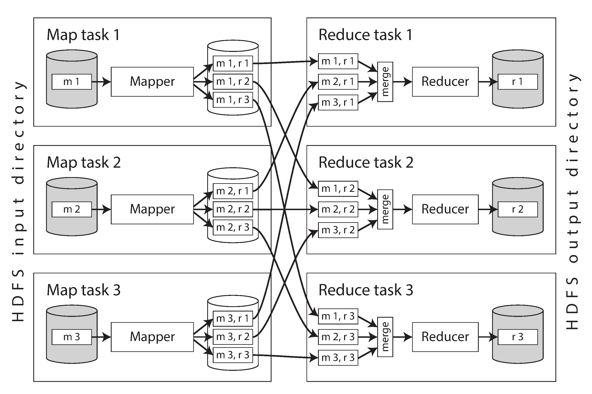
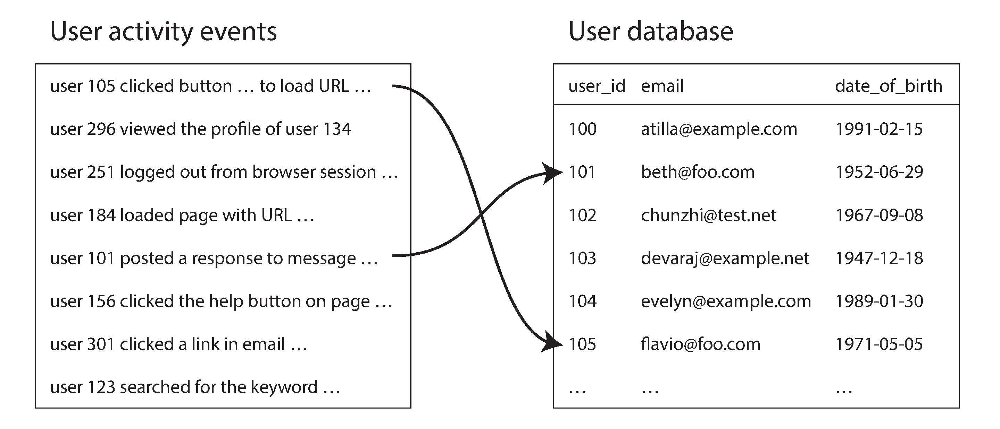
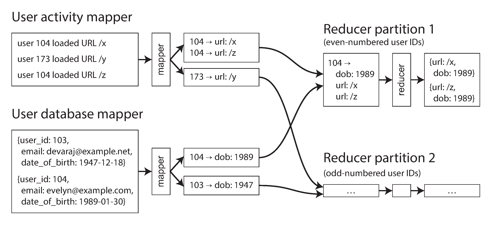

# Chapter 11: Batch Processing

> "A system cannot be successful if it is too strongly influenced by a single person. Once the initial design is complete and fairly robust, the real test begins as people with many different viewpoints undertake their own experiments."
> — *Donald Knuth*

So far in this book, we have focused almost entirely on **Online Systems** (databases, caches, search indexes). These systems are designed to process interactive requests from users and return a response as quickly as possible. In these systems, *Response Time* and *High Availability* are the ultimate metrics of success.

However, many types of data processing don't fit into an interactive request window—for example, training an AI model, transforming massive datasets, or crunching analytics. For these tasks, we use **Offline Systems**, also known as **Batch Processing Jobs**.

## 1. The Philosophy of Batch Processing
A Batch Processing job operates on a very specific set of rules:
1.  **Read-Only Inputs:** The job takes a massive dataset as input, but it mathematically guarantees it will *never* mutate or alter that input data.
2.  **Generated Outputs:** The job runs its computations and writes the final results to a completely new location generated from scratch.

Because the output is purely derived from the inputs without mutating the original source of truth, batch processing introduces a powerful concept called **Human Fault Tolerance**. 

### Human Fault Tolerance
If you deploy a buggy line of code to an Online OLTP database that accidentally corrupts user data, rolling back the code *does not fix the database*. The data is permanently ruined. 

In a Batch Processing system, if you deploy buggy code, the output file is ruined, but the original input data is perfectly safe. To fix the system, you simply roll back the code and run the batch job again. The new, correct output cleanly replaces the old, buggy output. 
*(Many modern object stores, like Amazon S3 or open table formats, support "Time Travel," allowing you to literally keep the old buggy output and toggle back and forth between versions).*

This principle of **minimizing irreversibility** drastically accelerates feature development, because developers are no longer paralyzed by the fear of permanently destroying the database.

### The Trade-offs of Batch Processing
*   **Pros:** Safe (Human Fault Tolerant), highly efficient use of compute resources, allows the same input files to be used by multiple different analytical jobs concurrently.
*   **Cons:** High Latency (jobs can take minutes, hours, or days to finish). Furthermore, if a single byte in the input data changes, the entire batch job generally has to reprocess the entire dataset from scratch. 
*   **Primary Metric:** Instead of measuring *Response Time* (like online systems), batch systems measure **Throughput** (how many terabytes of data they can churn through per hour).

*(Note: The middle ground between Batch Processing and Online Processing is called **Stream Processing**, which we will cover in Chapter 12).*

## 2. The Evolution of Batch Frameworks
Modern batch processing was revolutionized by Google's publication of the **MapReduce** algorithm in 2004 (and its open-source offspring, **Hadoop**). MapReduce proved that you could easily write a single script and automatically parallelize it across thousands of cheap commodity servers.

Today, however, the original MapReduce algorithm is largely considered obsolete and is no longer used at Google. The ecosystem has evolved rapidly:
*   **Compute Engines:** Developers now use highly optimized memory-native frameworks like **Apache Spark** and **Apache Flink**, or massively parallel Cloud Data Warehouses like **Snowflake** and **BigQuery**. These systems feature advanced query optimizers, DataFrame APIs, and declarative SQL support.
*   **Orchestration:** The old XML-heavy Hadoop schedulers (Oozie, Azkaban) have been entirely replaced by modern Python-based DAG orchestrators like **Apache Airflow, Dagster,** and **Prefect**.
*   **Storage:** The heavy, complex Distributed File Systems (like HDFS or GlusterFS) have been almost entirely retired in favor of globally scalable **Object Storage** (like Amazon S3 or Google Cloud Storage).

## 3. Batch Processing with Unix Tools
To deeply understand how massive distributed batch frameworks (like Spark or BigQuery) operate, we don't need to look at supercomputers. We can start by looking at a single laptop running standard Unix command-line tools. The philosophy is exactly the same.

Imagine a standard `nginx` web server appending an access log line for every user request:
```text
216.58.210.78 - - [27/Jun/2025:17:55:11 +0000] "GET /css/typography.css HTTP/1.1" 200 3377 "https://martin.kleppmann.com/" "Mozilla/5.0 (Macintosh; Intel Mac OS X 10_15_7) AppleWebKit/537.36 (KHTML, like Gecko) Chrome/137.0.0.0 Safari/537.36"
```

This single line of string text contains a wealth of structured data (the IP address, the timestamp, the URL requested, the HTTP 200 success code, the byte size, and the Browser User Agent). 

Historically, rapidly parsing and crunching terabytes of these exact log files to extract analytics (like advertising metrics or billing data) was the exact driving force that created the entire "Big Data" movement!

#### Simple Log Analysis
Let's analyze these logs directly in a Unix shell. What if we want to find the top 5 most popular pages on our website?
We can pipe together some basic Unix commands:

```bash
cat /var/log/nginx/access.log |
awk '{print $7}'              |
sort                          |
uniq -c                       |
sort -r -n                    |
head -n 5
```

**How it works:**
1.  `cat`: Reads the input log file.
2.  `awk`: Splits every line by whitespace and grabs the 7th column (which happens to be the requested URL).
3.  `sort`: Sorts all the URLs alphabetically. (This groups identical URLs into continuous blocks).
4.  `uniq -c`: Filters out repeating lines. Because we added the `-c` flag, it also outputs a counter telling us how many times each line appeared contiguously.
5.  `sort -n -r`: Sorts the new list numerically (`-n`) based on the counter, and reverses the order (`-r`) so the biggest number is at the top.
6.  `head -n 5`: Prints only the top 5 lines.

**Output:**
```text
4189 /favicon.ico
3631 /2016/02/08/how-to-do-distributed-locking.html
2124 /2020/11/18/distributed-systems-and-elliptic-curves.html
1369 /
 915 /css/typography.css
```
While simple, this pipeline is shockingly powerful and can chew through gigabytes of logs in seconds. It is also infinitely customizable (e.g., swapping `awk` to print `$1` would immediately find the top 5 Client IP addresses instead of URLs).

#### Chain of Commands vs. Custom Program
Instead of typing bash pipes, you could easily write a custom Python script using a dictionary (`defaultdict(int)`) to iterate through the text file line by line and track the counts in memory.

While both approaches achieve the exact same result, there is a fundamental difference in how their **Execution Flow** works—a difference that becomes incredibly important when you start processing massive datasets that don't fit into the computer's memory.

#### Sorting vs. In-Memory Aggregation
If you write a Python script using a dictionary hash table, the Python script must hold the entire working data set in Random Access Memory (RAM). 
*   **When it works:** If you have a small-to-medium website, the total list of unique URLs you have might easily fit into 1 GB of memory. Even if you process 1 Billion logs, the hash table only needs to store unique URLs, so memory utilization stays low.
*   **When it breaks:** If the working data you need to aggregate exceeds the capacity of your server's RAM (e.g., trying to hold 300 GB of unique UUIDs in memory), the program will brutally crash with an Out-of-Memory (OOM) error.

The Unix Pipeline, however, does *not* use a hash table. It relies entirely on **Sorting**. 
*   Because the `sort` utility in Unix is brilliantly engineered, if the data grows larger than available RAM, the `sort` tool automatically spills the data out to disk in sequential sorted chunks, and then elegantly merges the chunks back together (the exact same Mergesort principle used in Log-Structured Storage like LSM-Trees, Chapter 3). 
*   Furthermore, GNU `sort` automatically parallelizes this work across all the local CPU cores. 

Because of this, the exact same Unix pipeline can successfully process datasets immensely larger than the server's RAM without ever crashing. The only true boundary for Unix tools is the size of the single server's hard drive. When the dataset gets too massive to even fit on a single local disk, we finally have to abandon Unix tools and move to Multi-Machine Distributed Batch Frameworks!

---

## 4. Batch Processing in Distributed Systems
When you run a Unix tool, three things are happening on the single machine:
1.  **Storage:** Data is read from/written to the local file system.
2.  **Scheduler:** The OS decides which CPU cores run the program.
3.  **Communication:** Unix pipes connect the `stdout` of one program directly into the `stdin` of the next.

A **Distributed Processing Framework** (like Hadoop or Spark) is literally just an Operating System scaled out across thousands of machines. It mirrors these exact three components: it has a Distributed Filesystem, a Distributed Scheduler, and Distributed Communication channels.

### Distributed Filesystems (DFS)
On a local machine, a filesystem (like `ext4` or `XFS`) breaks files into tiny chunks called *blocks* (usually 4KB), reads/writes them to the disk, and caches frequently accessed blocks in memory (the Page Cache).

A **Distributed Filesystem** (DFS) does the exact same thing, but across a network of separate computers (the "Shared-Nothing" architecture).
*   **Massive Blocks:** Instead of 4KB blocks, DFSs use massive block sizes (e.g., 128MB in Hadoop HDFS, or 4MB in Object Stores). This drastically reduces the metadata tracking overhead for petabyte-scale datasets and maximizes sequential read throughput.
*   **Data Nodes:** The physical servers storing these chunks run background daemons (called DataNodes in HDFS) that serve the block data over the network to any requesting client.
*   **Metadata Nodes:** Just like a local filesystem has *inodes* to map where a file's blocks live on disk, a DFS has a central Metadata Service (like HDFS's *NameNode*) that maps which network servers currently hold which blocks of a huge file.
*   **Replication vs RAID:** Real big-data clusters are built using thousands of cheap, unreliable commodity servers that crash constantly. To survive this, the DFS automatically replicates every block onto multiple separate machines (or uses Erasure Coding for a cheaper form of redundancy). This is the distributed equivalent of a local hardware RAID array.

*(Note: Modern cloud data processing has largely abstracted the hard work of managing a DFS away. Developers today usually rely on massively scalable Cloud Object Storage—like Amazon S3 or Google Cloud Storage—which serves the identical underlying function via a standard REST API).*

### Object Stores
Modern distributed data architectures are rapidly replacing raw Distributed Filesystems with **Object Storage** systems like Amazon S3, Google Cloud Storage, or Azure Blob Storage. 
While they may seem like simple file systems, there are drastic architectural differences beneath the hood that engineers must keep in mind:

#### Immutability
Unlike a standard file where you can open a file handle, seek to byte 500, and overwrite 3 lines of text, **objects are fully immutable**.
Once an object is written, it is locked in stone forever. To "update" an object, you must download it, modify it locally, and perform an entirely new `put` operation to completely overwrite the old object with the new one. 

#### No True Directories
Object stores do not naturally understand the concept of a "Folder" or "Directory". They are strictly flat key-value stores.
When you see an object path like `s3://bucket/2025/photo.png`, all of those slashes are literally just characters in the object's Key string.
This leads to two major architectural quirks:
1.  **Empty Directories are Impossible:** If you delete all the objects inside the `/2025/` path, the folder itself instantly ceases to exist. (To bypass this, developers often hack the system by creating an empty 0-byte file named `/2025/` just to force the folder to render).
2.  **No Atomic Renames:** In Linux, you can instantly rename an entire folder containing 10,000 files with a single `mv` command. In an Object Store, because directories don't exist, to "rename" a folder, you must individually issue 10,000 separate `copy` network requests to duplicate the objects into a new key string, and then issue 10,000 `delete` requests to clean up the old ones.

#### Decoupling Storage and Compute
A primary feature of the older Hadoop (HDFS) ecosystem was "Data Locality". Hadoop was incredibly smart: instead of sending a 500 GB file over the network to a processing server, it would physically run the processing code on the exact server where the file was already sitting on the hard drive. 

Object Stores (like S3) completely abandon Data Locality in favor of **Decoupled Storage and Compute**. Compute servers are entirely stateless, and storage servers are entirely dumb. 
This means that *every single byte of data* must be streamed over the network to be processed. While this sounds slow, modern datacenter network switches are so fast that the bandwidth bottleneck is largely irrelevant. The massive advantage is elasticity: you can instantly scale up 1,000 compute CPUs to crunch a batch job without needing to buy 1,000 new storage hard drives alongside them.

---

## 5. Distributed Job Orchestration
Returning to our Unix analogy: on a single machine, the OS Kernel is responsible for allocating CPU time, enforcing memory boundaries (so one program doesn't crash another), and piping inputs and outputs. 

In a distributed cluster, this role is played by a **Job Orchestrator** like **Kubernetes** or **Hadoop YARN**. 
When a framework (like Spark) submits a job, it tells the orchestrator: *"I need to run 10 exactly identical tasks. I need 4GB of RAM and 2 CPUs for each task, and here is a link to the Docker image holding my code."*

The Orchestrator manages this massive fleet using three core components:
1.  **Task Executors:** Every single "worker node" in the cluster runs a background daemon (like Kubernetes's `kubelet`). When given an assignment, it downloads the code, launches the task, and sends structural heartbeats back to the boss. It also uses Linux `cgroups` (control groups) to physically enforce CPU/RAM limits, ensuring one rogue data task doesn't consume 100% of the server's resources and starve the other tasks perfectly replicating OS-level isolation.
2.  **Resource Manager:** The central brain. It keeps a real-time, global database of exactly how much CPU, memory, and disk space is currently available across every server in the entire 5,000-node cluster. Because this metadata must be highly available and resilient, it is usually backed by a Coordination Service (like `etcd` for Kubernetes or `ZooKeeper` for YARN).
3.  **Scheduler:** The decision-maker. It takes the requests from the users, cross-references them with the inventory from the Resource Manager, and mathematically calculates exactly which tasks should be dispatched to which servers to optimize the cluster.

### Resource Allocation

The Scheduler has the most mathematically complex job in the entire datacenter: balancing **Fairness** versus **Efficiency**. 
If you have a 160-CPU cluster, and two different teams simultaneously submit jobs that each require 100 CPUs, how does the scheduling algorithm react?

*   **Partial Execution:** The scheduler gives 80 CPUs to Job A, and 80 CPUs to Job B. As individual tasks finish, it slowly trickles out the remaining 20 tasks to each.
*   **Wait and See (Gang Scheduling):** The scheduler decides Job A MUST have all 100 CPUs at once to run properly. It holds the CPUs hostage, leaving nodes totally idle, until 100 full CPUs are free. (This leads to dropped efficiency and potential deadlocks).
*   **Preemption (Violence):** If Job A has been running for an hour, but Job B is deemed "Mission Critical", the scheduler might actively *assassinate* 50 of Job A's tasks, re-allocating the CPUs to Job B. This guarantees priority but absolutely tanks cluster efficiency because Job A's progress is destroyed and must be recomputed later.

Because deciding the "perfect" mathematically optimal allocation across a huge datacenter with thousands of competing jobs is physically impossible (it is an NP-hard problem mathematically), real-world Orchestrators rely on heuristics like Dominant Resource Fairness (DRF), basic FIFO queues, or static Quotas to keep the cluster humming along reasonably well.

---

## 6. Scheduling Workflows
The Unix tool example chained several commands together using pipes (`awk | sort | uniq`). The exact same pattern happens in distributed processing. It is very rare for a single batch job to compute the entire final answer natively; instead, data is passed through a sequence of dozens of independent jobs. 

This chain of jobs is called a **Workflow**, or a **Directed Acyclic Graph (DAG)** of jobs.

*(Note: In Chapter 9 we discussed "Durable Execution" workflows, which orchestrate complex microservice RPC calls. In the context of Batch Processing, a "Workflow" strictly means a DAG of massive data-crunching pipelines, typically with no external API calls).*

We build Workflows instead of one giant script for several reasons:
1.  **Multiple Consumers:** The output of Job A might be useful to three different teams (e.g., Team B needs it for an AI model, and Team C needs it for billing). Writing it to a shared location prevents redundant computation.
2.  **Tool Bridging:** You might run a massive Spark job to clean raw logs, and then trigger a Trino SQL query to perform the final fast aggregation. A workflow orchestrators safely manages handing the data between two completely different software ecosystems.
3.  **Algorithmic Requirements:** Often, you need to shard data by `user_id` in Job 1 to sort behavior logs, but then re-shard that exact same data by `country_id` in Job 2 to generate geographical metrics.

### Distributed Pipes vs Storage Hand-offs
In a Unix pipeline, data streams seamlessly from one program to the next through tiny in-memory buffers. If the buffer is full, the producing program physically pauses (which naturally creates *backpressure*). Modern streaming batch engines (like Spark or Flink) can emulate this exact in-memory streaming over the network. 

However, in classic Batch Workflows, **in-memory streaming is rarely used.** Instead, the standard architecture is for Job A to compute its entire output, save it permanently to an Object Store (like S3), completely power down, and then flag the Workflow Scheduler to boot up Job B to read that folder.
This brutally decouples the jobs. It's slower, but it prevents the entire 100-step DAG from instantly crashing if one node in the middle experiences a microsecond of network lag. 

### Modern Workflow Schedulers
The cluster orchestrators we just talked about (YARN, Kubernetes) **do not** manage workflows. They only know how to ask for CPU cores and run a single isolated Docker container.

To manage the dependencies between 100 sequential batch jobs (e.g., "Don't run Job C until both Job A and Job B have finished analyzing their partitions"), the industry built a secondary layer of **Workflow Schedulers** (Data Orchestrators).
Modern data engineering teams manage their DAGs almost exclusively using generalized Python orchestrators like **Apache Airflow, Dagster,** or **Prefect**. These tools give data engineers a visual dashboard to monitor exactly where massive chains of dependencies are succeeding, failing, or bottlenecking.

---

## 7. Handling Faults
Batch processing jobs are uniquely susceptible to faults simply because they run for so long. If a massive job takes 14 hours to run across 1,000 servers, the statistical probability of at least one server experiencing a hardware failure, network partition, or OS crash during that window approaches 100%.

Furthermore, batch jobs are intentionally executed on cheap, unreliable hardware. Many companies use **Spot Instances** (Preemptible VMs) to save money. These virtual machines are extremely cheap, but the cloud provider (AWS/GCP) actively reserves the right to assassinate the machine with zero warning if they need the capacity back. On spot instances, Preemption (being killed by the cloud provider) is actually a vastly more common fault than standard hardware failure!

### Task-Level Fault Tolerance
If a 14-hour job fails at hour 13 because a single spot instance was terminated, it would be insanely expensive and wasteful to force the entire 1,000-node cluster to start the 14-hour job over from scratch. 

To solve this, frameworks (like MapReduce and Spark) break the massive job down into thousands of tiny, independent **Tasks**. 
If one specific Task crashes:
1.  The Task Executor notifies the Resource Manager that it failed.
2.  The system simply deletes the partial/corrupted output of that *single specific task*.
3.  The Scheduler re-assigns that specific Task to a new, healthy node.
4.  The other 999 nodes continue working completely uninterrupted.

### Preserving Intermediate Data
Fault tolerance becomes much trickier if the output of Task A is being actively streamed into the input of Task B. If Task A is preempted and dies halfway through, what happens to Task B?

Different frameworks solve this intermediate data problem differently:
*   **MapReduce (The Safe/Slow Way):** MapReduce completely eliminated this risk by forcing every single task to fully write its completed output to the Distributed File System (HDFS) *before* the next task was allowed to begin reading it. This guarantees bulletproof fault tolerance but absolutely destroys performance by forcing constant, heavy disk I/O.
*   **Spark (The Fast/Smart Way):** Spark avoids writing to disk whenever possible, keeping data pipelines entirely in RAM. To achieve fault tolerance, Spark tracks the **Lineage** (the exact mathematical steps) of how the data was computed. If a node crashes and loses its chunk of RAM, Spark simply looks at the lineage graph and dynamically recomputes *only* the missing chunk of data on a new node.
*   **Flink:** Takes a completely different approach by periodically taking global snapshot "Checkpoints" of the entire cluster's state. If a node fails, the entire cluster briefly rolls back to the last successful 10-second checkpoint and resumes (more on this in Chapter 12: Stream Processing).

---

## 8. Batch Processing Models
Once the Orchestrator has scheduled the jobs on the cluster, how does the actual computation engine process the data?
Historically, **MapReduce** was the dominant model, though modern systems now rely heavily on **Dataflow Engines** (like Spark and Flink). Even though raw MapReduce is now largely obsolete, understanding its architecture is critical to understanding modern data processing.

### MapReduce
The MapReduce algorithm functions almost identically to the Unix pipeline example we studied earlier. Every MapReduce job consists of four distinct steps:

1.  **Read Inputs:** The job reads massive input files from a distributed filesystem (HDFS or S3) and breaks them down into individual records (e.g., separating by `\n` to isolate a single log line).
2.  **Map:** A custom `Mapper` function is called on *every single record independently*. Its only job is to extract a specific Key and a Value. (This is exactly equivalent to `awk '{print $7}'` pulling out the URL). The Mapper is entirely stateless.
3.  **Sort (The Magic Step):** The MapReduce framework automatically takes all the Key-Value pairs generated by the Mappers and sorts them continuously. Because of sorting, identical keys are grouped adjacently. (This is exactly equivalent to the Unix `sort` command). You do not write code for this step; the framework handles it natively.
4.  **Reduce:** A custom `Reducer` function is called once for each unique Key. The framework hands the Reducer an iterator containing all the Values associated with that Key. The Reducer processes the list to produce the final output for that Key—like returning a counter. (This is exactly equivalent to `uniq -c`).

If you need to sort your final output (e.g., ranking your top 5 URLs), you must physically create an entirely separate second MapReduce job to consume the output of the first job. 

#### Functional Programming Roots
MapReduce is directly inspired by Functional Programming (specifically Lisp lists). 
Because `Map` operates on a single independent record, it is mathematically "embarrassingly parallel"—you can instantly split the `Map` phase across 1,000 servers without changing a single line of code. Because `Reduce` groups exactly by Key, different Keys can safely be sent to different servers to be reduced in parallel. 

#### Why did MapReduce die?
While completely revolutionary in 2004, MapReduce had two fatal flaws that caused the industry to abandon it:
1.  **Laborious API:** Writing pure MapReduce code in Java was incredibly painful. If you wanted to do a simple SQL `JOIN` on two datasets, you had to manually write the underlying algorithmic logic from absolute scratch. 
2.  **Disk I/O Bottlenecks:** To survive node failures, MapReduce was deeply paranoid. It forcefully wrote the entire state of the job to physical hard drives (HDFS) between every single phase (Map -> Disk -> Shuffle -> Reduce -> Disk). This brutal file-based I/O prevented job pipelining and made the algorithm incredibly slow compared to modern, in-memory systems.

### Dataflow Engines
To solve MapReduce's problems, the industry created **Dataflow Engines** (like **Apache Spark** and **Apache Flink**).
Instead of breaking a massive workflow into 50 disjointed MapReduce jobs, Dataflow Engines model the entire workflow as a single continuous DAG (Directed Acyclic Graph) of data flowing through various processing stages. 

These engines offer massive advantages over MapReduce:
1.  **High-Level Operators:** Instead of writing raw java `map()` functions, you can natively call relational operations like `Join`, `GroupBy`, `Filter`, or `Count`.
2.  **Pipelining & Optimization:** Because the scheduler can see the entire DAG at once, it can combine several operations (like map + filter) into a single task. It can also begin executing downstream operators the second the first byte of input is ready, rather than waiting for the entire preceding stage to finish saving to disk.
3.  **In-Memory Intermediate State:** The biggest performance jump. Dataflow engines avoid writing intermediate data to the Distributed File System (which forces network replication overhead). Instead, intermediate data is passed strictly in RAM, or spilled out to cheap local disks, making the jobs run significantly faster than MapReduce.

---

## 9. Shuffling Data
Whether you are using Unix tools, MapReduce, Spark, Flink, or BigQuery, all distributed batch processing relies on one foundational algorithm to scale past a single server: **The Shuffle**.

*"Shuffling" in computer science does not mean randomizing (like shuffling cards). It means mathematically Sorting and Routing data across a network so that identical keys end up on the exact same server.*

Whenever you call a `Join` or an `Aggregation` (like `GROUP BY user_id`), the dataflow engine must perform a Shuffle.
Using MapReduce as the structural example, a Shuffle works like this:


*Figure 11-1 shows the dataflow of a MapReduce job with 3 Mappers (m1, m2, m3) and 3 Reducers (r1, r2, r3).*

1.  **Multiple Input Shards:** The source dataset is broken into chunks (labeled $m_1$, $m_2$, and $m_3$). The framework starts a separate Map task for each input shard. For example, each shard may be a separate file on HDFS or a specific prefix in an S3 bucket.
2.  **Local Sorting & Writing:** The output of each Mapper consists of key-value pairs. To ensure that identical keys end up on the exact same Reducer, each Mapper calculates a Hash of the output Key. Based on this hash, the Mapper creates a *separate* output file on its local disk for *every* Reducer pipeline. 
    *(For example, the smaller intermediate file labelled `$m_1, r_2$` in Figure 11-1 is the file created by Mapper 1 containing specifically the data destined for Reducer 2).* The Mapper locally sorts these records in memory, and writes them out to its local hard drive.
3.  **The Network Shuffle Phase:** Once the mappers finish, the Reducer servers reach across the network, connecting to every single Mapper server to systematically download their designated pieces of the puzzle. 
4.  **Merge-Sort & Reduce:** The Reducer now has a bunch of sorted files from different Mappers. It merges these files together, preserving the strict merge-sort order so that all rows with the identical Key are consecutive. The `reduce()` function is called, and the outputs are sequentially written to a final output file (labeled $r_1$, $r_2$, and $r_3$ in Figure 11-1), which become the shards of the new dataset on the distributed filesystem.

*(Note: Advanced modern cloud warehouses like BigQuery no longer force the Mappers and Reducers to do the Shuffle locally. They actually extract the Shuffle phase into dedicated, independent "Sorting Services" that run entirely in RAM to massively accelerate the network routing).*

---

## 10. JOIN and GROUP BY
Let's see the Shuffle in action to perform a massive distributed `JOIN`.

Imagine we have two massive, sharded datasets:
1.  **Activity Events (Fact Table):** A massive log of every button click and page view.
2.  **User Profiles (Dimension Table):** A database of user metadata (like their Date of Birth).


*Figure 11-2: We want to join the Activity Events (left) with the User Database (right) to see if certain pages are more popular with specific age groups.*

### The Sort-Merge Join
To execute this join across a distributed cluster, we can't just hold the User Database in memory (it's too big). Instead, we use a Shuffle to execute a **Sort-Merge Join**:

1.  **Extract the Keys:** 
    *   Mapper 1 reads the Activity logs and extracts the `user_id` as the Key, and the `URL` as the Value.
    *   Mapper 2 reads the User Database and extracts the `user_id` as the Key, and the `Date of Birth` as the Value.
2.  **The Shuffle:** The framework routes the data so that *all* records with `user_id: 123` (both from Mapper 1 and Mapper 2) are sent to the exact same Reducer. 
3.  **Secondary Sort:** The framework is incredibly smart. It sorts the incoming records so that the User Profile record for `user_id: 123` arrives at the Reducer *before* the 50 Activity Event records for `user_id: 123`.


*Figure 11-3: The Sort-Merge join perfectly aligns the Date of Birth record directly before the stream of Page View records for the identical user ID.*

4.  **The Reduce Join Logic:** Because the Reducer receives the Date of Birth first, it simply holds that tiny variable in local single-server RAM. As the 50 subsequent Activity Event lines stream in, it easily attaches the Date of Birth to each one and writes out the final joined output. The Reducer never has to make a network request to a remote database!

### GROUP BY and Aggregations
Now that we have a dataset mapping `URL` to `Date of Birth` for every single page view, how do we find the age demographics per URL?

We simply launch a **second Shuffle step**.
1.  This time, we instruct the new Mapper to use the `URL` as the Hash Key.
2.  The network Shuffles the data so that every single page view record for `/favicon.ico` lands on Reducer A, and every page view for `/about-us` lands on Reducer B.
3.  The Reducers simply iterate over their local lists, maintaining a rolling counter for each age group, effectively executing a massive `GROUP BY URL` aggregation perfectly parallelized across the cluster!

---

## 11. The Evolution of Query Languages
As distributed frameworks stabilized and easily achieved petabyte-scale across 10,000+ machine clusters, the industry's focus naturally shifted away from scaling the hardware infrastructure and towards improving the **Programming Model**.

Writing highly optimized Java/Scala MapReduce or Spark code is difficult and heavily restricts who can use the data. To solve this, **SQL has become the undisputed lingua franca of batch processing.** 
Almost all modern Batch Dataflow Engines (Spark, Flink) and Cloud Data Warehouses (BigQuery, Snowflake) now fully support declarative SQL.

### The Power of SQL in Batch Processing
1.  **Accessibility (Interactive Analytics):** By supporting SQL, business analysts, finance teams, and product managers can directly query petabytes of data interactively through an IDE or GUI without needing to know anything about MapReduce, Java, or DFS architecture.
2.  **Machine-Level Query Optimizers:** When you write a SQL query (like joining two tables), you tell the engine *what* you want, not *how* to get it. Modern engines (like Spark's Catalyst or Trino) feature brilliant Cost-Based Optimizers. The optimizer physically analyzes the incoming data sets and automatically decides if it should perform a Sort-Merge Join or a Broadcast Hash Join (which keeps everything in memory). It may even dynamically rearrange the order of your joins to shrink the intermediate Shuffle size down to a fraction of the original.

*(Note: While SQL dominates, alternative models are still used. DataFrames provide programmatic DAG-like syntax, Graph Query Languages like Gremlin traverse heavily connected data (Chapter 2), and specialized JSON query languages like `jq` pull nested data out of pure document files).*

### The Convergence of Batch Processing and Cloud Data Warehouses
Historically, there was a massive divide between the two paradigms:
*   **Data Warehouses (Teradata/Oracle):** Relied on extremely expensive, proprietary appliance hardware and strict relational SQL schemas.
*   **Batch Frameworks (Hadoop/MapReduce):** Scaled limitlessly on cheap, unreliable commodity servers, and allowed extreme flexibility by letting developers write custom code to parse anything (logs, json, unstructured data).

Today, **the two paradigms have practically merged into the same thing.**
*   Batch Frameworks adopted SQL and realized that unstructured data is too slow, heavily pivoting to optimized **Column-Oriented Storage** (like Parquet and ORC) to achieve Data-Warehouse-level speeds.
*   Data Warehouses moved to the Cloud (Snowflake, BigQuery), abandoned proprietary hardware in favor of commodity Object Storage (S3), and adopted identical DAG orchestration, shuffling, and fault-tolerance techniques to mirror Hadoop's limitless scalability. Cloud Data Warehouses also increasingly support DataFrame APIs natively (like Snowflake's Snowpark). 

The only remaining differences are primarily related to Cost and Unstructured Data. Massive Cloud Data Warehouses can be prohibitively expensive to run simple ETL scripts on, whereas spinning up a raw Spark cluster is far cheaper. Additionally, Cloud Data Warehouses still struggle heavily with unstructured multi-modal data (Raw Audio, Image Processing for AI, or Graph algorithms like PageRank), which is where programmatic Batch Dataflow Engines still shine.

### DataFrames
As data scientists and statisticians began using distributed batch processing for machine learning, they found traditional APIs and raw SQL to be cumbersome. These engineers were used to the programmatic **DataFrame** model found in Python (Pandas) and R. 

A DataFrame is essentially a programmatic representation of a relational table: it represents a massive collection of rows where every column has a statically defined type. Instead of writing one giant SQL string, developers call chained methods (like `.filter()`, `.join()`, and `.groupBy()`). 

Because data scientists demanded this syntax, modern batch frameworks (Spark, Flink, Daft) heavily adopted DataFrame APIs. However, there are massive differences between local DataFrames and Distributed DataFrames:
1.  **Lazy Evaluation vs Eager Execution:** In local Pandas, the moment you call a `.filter()` method, the computer physically executes it immediately. In Apache Spark, DataFrame methods are *Lazy*. When you call methods, Spark simply builds a logical DAG under the hood. It doesn't actually process a single byte of data until you call an "Action" command at the very end. Before executing, Spark hands the DAG to its Query Optimizer to restructure the math for maximum cluster efficiency. 
2.  **Indexing:** Local Pandas DataFrames are heavily indexed and strictly ordered. Distributed DataFrames (like Spark) are typically NOT physically ordered or indexed natively, because keeping a perfectly ordered index synchronized across 10,000 servers is nearly impossible. This can lead to terrifying performance surprises for data scientists migrating code from local Pandas directly to Spark!
3.  **Client/Server Architectures:** Modern engines like Daft allow transparent hybrid execution. Tiny mathematical operations on small data are executed locally on the client's laptop, while structurally massive joins are automatically shipped to the distributed server cluster. To make passing data back and forth between the laptop and the server seamless, both the client and server agree to use a unified, memory-optimized columnar blueprint like **Apache Arrow**.

---

## 12. Batch Use Cases
Because batch jobs are strictly optimized for Bulk Throughput rather than response time, they are totally unsuitable for interactive user-facing systems. However, they are the backbone of virtually all heavy-duty automated business processes:
*   **Finance & Accounting:** The entire US Banking Network reconciles money transfers at midnight using massive batch jobs.
*   **Machine Learning:** Tech companies (Netflix, Youtube) run massive pipeline DAGs every night to re-train their Recommendation AI models.
*   **Manufacturing:** Computing global supply chain Logistics and Demand Forecasting based on the day's sales.

### Extract–Transform–Load (ETL)
The most common and critical use case for Batch Processing is **ETL** (or ELT). 
ETL is the process of extracting raw data from a production system (like extracting MongoDB JSON documents), parsing and cleaning the data (Transformation), and writing it to a Data Warehouse (Load) so that analysts can run SQL on it.

Batch is the perfect tool for ETL for several reasons:
1.  **Embarrassingly Parallel:** Data cleaning (like filtering out null values, or projecting simple columns) can easily be split across a thousand isolated servers.
2.  **Human Fault Tolerance:** If a bug in the code accidentally deletes the `revenue` column during the Transformation phase, there is no permanent damage. The Data Engineer simply fixes the bug, hits "Retry" on Airflow, and the batch job transparently recalculates the data from the raw input files and neatly overwrites the corrupted output.
3.  **Workflow Resiliency:** Because ETL is usually a massive DAG of 50-100 steps, Schedulers like Airflow automatically handle retry logic for transient failures (e.g., if the Snowflake database goes down for 3 seconds, Airflow just waits 5 seconds and tries the `Load` step again).

### The Democratization of ETL
Historically, ETL was restricted to a highly specialized "Data Engineering" team whose sole job was to constantly write Java/Spark pipelines for every other team in the company.

Today, thanks to the adoption of SQL and DataFrames, the lines between Software Engineer, Data Engineer, and Data Analyst have blurred entirely. 
With concepts like **Data Mesh** and **Data Contracts**, product teams are now expected to write their own ETL pipelines to safely publish their localized data to the central warehouse. Because these teams can simply write Airflow Python scripts orchestrating SQL queries (using tools like `dbt` or `SparkSQL`), ETL is now heavily democratized across the modern tech organization.

### Analytics & Data Lakehouses
Once data has been loaded via ETL, Analysts run massive SQL queries to scan millions of records. Traditionally done strictly on Data Warehouses, modern systems frequently run these Analytic workloads directly on Batch Frameworks (Spark/Trino) querying an Object Store (S3). 
When you layer metadata management over an Object Store using table formats like **Apache Iceberg**, you create what the industry calls a **Data Lakehouse**—merging the cheap storage of a Data Lake with the strict transactionality and SQL capabilities of a Data Warehouse. 

Query patterns generally fall into two categories:
1.  **Pre-Aggregation (Data Cubes):** Running a scheduled batch job to aggregate granular data (like per-minute sales) into rolled-up views (per-day sales). This drastically speeds up dashboards that don't need the granular detail.
2.  **Ad-Hoc Queries:** Investigative queries run interactively by engineers tracing a bug or business users asking a specific question (e.g., "How many users in Germany clicked the new logo yesterday?"). Batch frameworks process these fast enough to allow iterative analysis. 

### Machine Learning and AI
Modern AI/ML models are almost entirely reliant on massive, continuous distributed batch processing pipelines to perform tasks such as:
1.  **Feature Engineering:** Taking raw text/logs and converting them into strict numeric tensors or embeddings that a neural network can digest.
2.  **Model Training:** Feeding petabytes of engineered feature matrices into the model to train the neural network weights.
3.  **Batch Inference:** Running petabytes of newly acquired user profiles back through a trained model to generate massive dumps of offline "Recommended Videos" or "Predicted Ad Clickthrough Rates".

#### Graphs and Large Language Models (LLMs)
Batch processing isn't just for relational rows; it's also heavily used for graphs and unstructured text.
*   **Graph Processing:** Social networks and recommendation engines rely on Graph algorithms (like PageRank). Finding convergence in a graph with billions of nodes requires specialized batch algorithms like the **Bulk Synchronous Parallel (BSP) / Pregel Model** (implemented by Apache Giraph or Spark GraphX).
*   **LLMs:** Training ChatGPT requires crawling the entire internet. You need massive batch pipelines (orchestrated by tools like Ray) to pre-process the raw HTML: extracting pure text, aggressively stripping away low-quality or duplicate spam documents, and translating the remaining text into billions of mathematical vector embeddings.

### Serving Derived Data
The final problem of Batch Processing: Once your 14-hour Spark job finishes crunching out a massive dataset of "Top 10 Video Recommendations for every user", how do you get those recommendations back into the live production database so the website can serve them to users?

You absolutely **should not** just have your Spark job connect directly to the production Postgres database and run `INSERT` statements for a billion rows.
1.  **Denial of Service:** Your 1,000 parallel Spark nodes will brutally DDoS your live production database, potentially crashing the entire user-facing website.
2.  **Broken Job Guarantees:** Batch processing relies on "All-or-Nothing" atomic outputs. If you start inserting live rows into a database, and the Spark job crashes halfway through, users instantly see a partially updated, logically corrupt state.

#### The Solutions
Instead, there are two primary architectures to serve derived data safely:

1.  **Pushing to Streams (Kafka):** The Spark job outputs its data into a distributed message broker like Kafka. The live production database then safely streams the data from Kafka at its own comfortable, throttled pace. This completely isolates the live database from the brutal force of the batch cluster, and also allows multiple different downstream microservices to subscribe to the same output.
2.  **Bulk Loading (The Atomic Swap):** The fastest and safest pattern: The batch job literally builds a physical database file (like a RocksDB SSTable or a TiDB data file) completely offline entirely within the batch environment. Once the multi-gigabyte files are constructed, the files are shipped to the production server. The production database simply "Hot-swaps" the new file into memory instantly and atomically replaces the old state.
