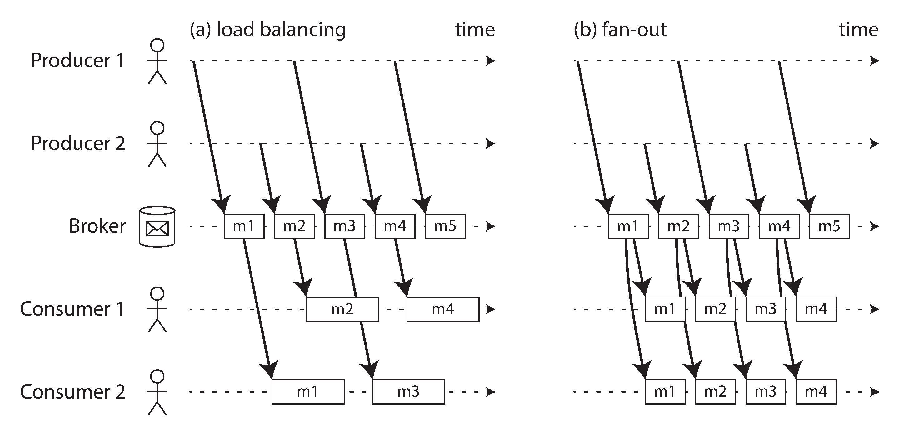
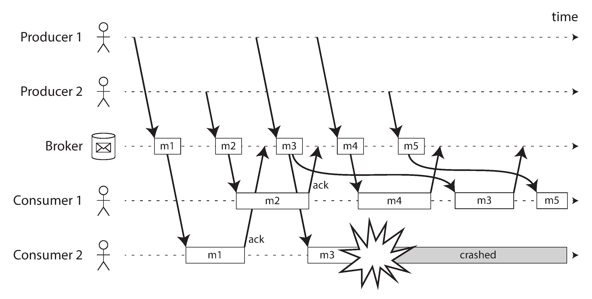
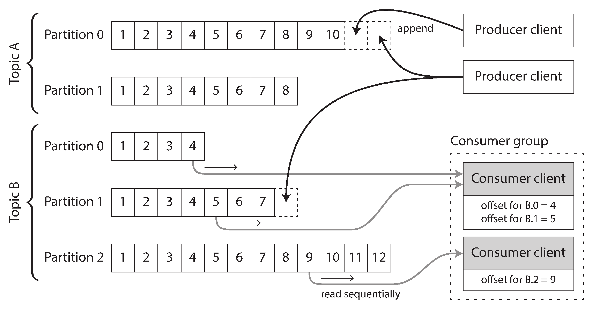
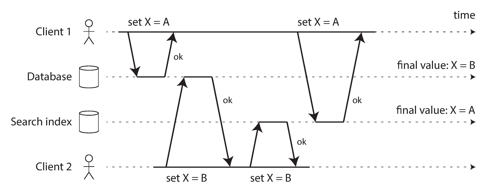
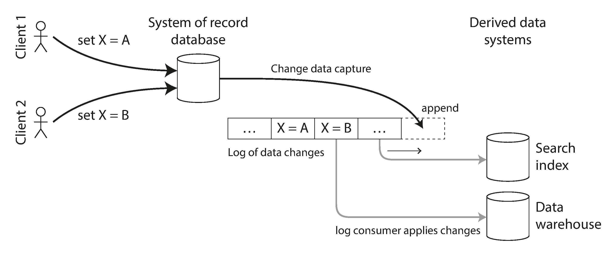
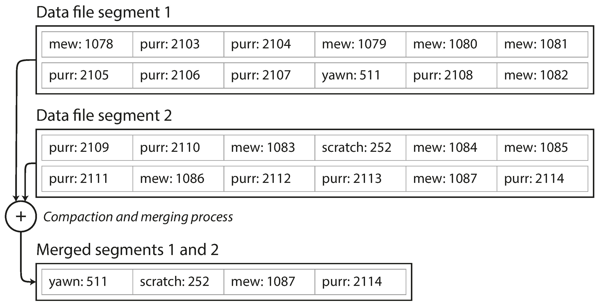
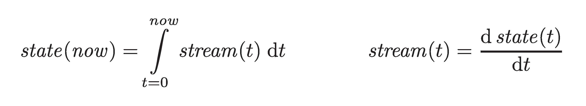
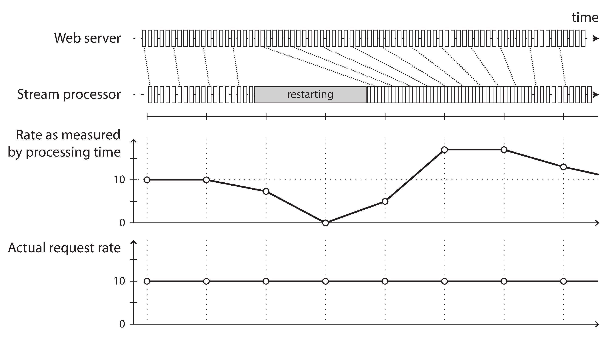

# Chapter 12: Stream Processing

> "A complex system that works is invariably found to have evolved from a simple system that works. The inverse proposition also appears to be true: A complex system designed from scratch never works and cannot be made to work."
> — *John Gall, Systemantics (1975)*

In Chapter 11, we explored **Batch Processing**—systems that take a massive, fixed set of input files, grind through them, and produce a new set of derived output files. While extremely powerful for analytics, machine learning, and search indexing, Batch Processing makes one massive underlying assumption: **Bounded Input**. 
A batch framework statistically *must* know the finite size of the input. For example, a MapReduce Sort step literally cannot begin outputting its sorted data until it completely finishes reading the very last record of the input.

## 1. The Reality of Unbounded Data
In the real world, user data is never "complete." Users generated data yesterday, they are generating data right now, and they will continue generating data tomorrow. The dataset is **Unbounded**.

To handle unbounded data in a Batch paradigm, engineers logically artificially chop the data into fixed time slices (e.g., "Run a batch job at 11:59 PM to process today's logs"). 
*   **The Problem:** Daily batch processing introduces a massive 24-hour latency. If you need faster reactions, you can chop the time slices smaller (e.g., hourly, or even minutely batches). 
*   **The Solution:** Eventually, if you keep shrinking the time slices to zero, you abandon the concept of "slices" entirely and simply process every single event the exact microsecond it happens. This is **Stream Processing**.

A "stream" refers to data that is incrementally made available over time (conceptually similar to Unix `stdin/stdout`, TCP connections, or video streaming). In the data management context, event streams are exactly the unbounded, continuous counterpart to batch processing files.

---

## 2. Transmitting Event Streams
In batch processing, the primitive unit of work is a *File*. In stream processing, the primitive unit of work is an **Event**.

### What is an Event?
An event is a small, self-contained, completely immutable object that describes something that happened at a specific point in time. 
*   **Contents:** It usually contains a timestamp (recorded by a time-of-day clock) and data describing an action (e.g., a user clicked a button, made a purchase, or a thermostat recorded a temperature). 
*   **Encoding:** Events are easily encoded as text strings, JSON, or compact binary formats (like Avro or Protobuf), making them easy to append to databases or send over a network.

### Producers and Consumers
Just like how a batch file is written once and read by many downstream batch jobs, an event is:
*   Generated once by a **Producer** (also known as a Publisher or Sender).
*   Processed by one or more **Consumers** (also known as Subscribers or Recipients).
*   Grouped together logically: Instead of a filesystem directory, related streams of events are grouped together into a **Topic** (or Stream).

### Polling vs Notification
How do you physically connect the Producer to the Consumer? 
Technically, you could just use a standard relational database: The Producer inserts event rows, and the Consumer runs a `SELECT` query every morning to check for new data. 

However, as you move towards low-latency continuous processing, polling the database becomes a massive performance bottleneck. If the Consumer runs a `SELECT` query every second, but new events only happen every 10 seconds, you are wasting 90% of your queries and actively overwhelming the database overhead.

Instead of the Consumer continuously asking *"Are we there yet?"*, the architecture must shift to **Notifications**: The system must actively push a notification directly to the Consumer the exact millisecond a new Event arrives. 
While relational databases have basic mechanisms for this (like Triggers), they are highly limited and notoriously fragile. To solve this, the industry designed specialized, dedicated infrastructure purely to deliver high-speed event notifications.

---

## 3. Messaging Systems
A messaging system is a dedicated intermediary designed specifically to receive messages from a Producer and actively push them to Consumers. 

Conceptually, a simple messaging system could just be a direct TCP connection between the Producer and the Consumer. However, a dedicated Messaging System vastly expands on this: instead of connecting exactly one sender to exactly one receiver (like TCP), it allows **Multiple Producers** to broadcast to a single Topic, and **Multiple Consumers** to safely pull from that identical Topic.

This is the **Publish/Subscribe (Pub/Sub) Model**. Because different systems (like RabbitMQ, ActiveMQ, or Kafka) take radically different engineering approaches to Pub/Sub, you must ask two critical questions when choosing a system:

### Question 1: What happens when the Producers are faster than the Consumers?
If a website goes viral, it might generate 10,000 click events per second. If your Consumer server can only process 1,000 events per second, the system will rapidly destabilize. How does the messaging system handle this mismatch? It basically has three choices:

1.  **Drop Messages:** The system ruthlessly throws away the newest (or oldest) events. (Useful for sensor logs where seeing the *absolute latest* temperature overrules saving historical data, but devastating if you are calculating billing counters).
2.  **Backpressure (Flow Control):** The system forcefully blocks the Producer from sending any more messages until the Consumer catches up. (This is exactly how TCP and Unix Pipes work under the hood. It prevents data loss, but forcefully slows down your frontend applications).
3.  **Buffer in a Queue (The standard choice):** The messaging system absorbs the impact by placing the messages into a queue. As the queue grows, what happens? Does the system crash when it runs out of RAM? Or does it elegantly spool the excess messages to the hard drive? If it writes to the hard drive, will that sudden disk I/O degrade the speed of the entire cluster?

### Question 2: What happens if nodes crash? Are messages lost?
If the power goes out on the messaging server, what happens to the events currently sitting in the buffer?
*   As with databases, ensuring absolute **Durability** means the messaging system must synchronously force writes to the hard drive and replicate the data across the network *before* acknowledging the Producer. This makes the system virtually indestructible, but significantly slows down throughput.
*   If your application involves streaming high-frequency, low-stakes data (like telemetry metrics), you can achieve phenomenally high throughput by configuring the system to keep messages purely in RAM and accepting the risk of occasional data loss during hardware crashes.

### The Batch Comparison
In Chapter 11, we saw that Batch Systems offer a beautiful guarantee: if a job crashes, the system safely deletes the partial output and tries again, guaranteeing an immaculate "Exactly-Once" output. 
Streaming systems are dealing with infinite, continuous data moving in real-time. Designing a streaming system that can survive node failures *without* accidentally processing a billing event twice (or missing it entirely) is incredibly difficult. We will explore how modern systems attempt to replicate batch's safety guarantees later in the chapter.

---

## 4. Direct Messaging from Producers to Consumers
Before diving into complex, distributed Message Brokers (like Kafka), it's important to note that many systems simply choose to bypass the "middleman" entirely and pass messages directly from the Producer to the Consumer over the network. 

Common implementations of Brokerless Messaging include:
*   **UDP Multicast:** Heavily used in the financial industry for stock market feeds. UDP is incredibly fast and provides lowest-latency delivery, but is inherently unreliable. Application-level protocols are built on top to request re-transmission of lost packets.
*   **Brokerless Libraries (ZeroMQ, nanomsg):** These libraries implement publish/subscribe logic acting directly over TCP or IP Multicast.
*   **StatsD:** A popular metrics collector that intentionally relies on unreliable UDP to spray metrics across the network. If a packet is lost, the metric is simply slightly inaccurate, which is an acceptable trade-off for raw speed.
*   **Webhooks:** If the Consumer exposes a REST API, the Producer can simply make a direct HTTP POST request (an RPC call) to physically push the event to the Consumer.

### The Danger of Direct Messaging
While Direct Messaging is lightning fast due to the lack of an intermediary broker, it pushes the massive burden of Fault Tolerance entirely onto the application code. 

**Direct Messaging fundamentally assumes that both the Producer and Consumer are constantly online.** 
If the Consumer crashes or goes offline for 10 minutes, all events sent during that window are permanently lost into the void. While some protocols allow the Producer to temporarily buffer messages in memory and retry the HTTP call when the Consumer wakes up, this too is fragile: if the *Producer* crashes before the retry succeeds, those buffered messages are, once again, permanently lost.

---

## 5. Message Brokers
To solve the severe fragility of Direct Messaging, the industry standard is to route all events through a **Message Broker** (or Message Queue). 

A message broker is essentially a specialized database optimized purely for handling rapid streams of messages. It runs as a standalone server. Producers connect to it to write messages, and Consumers connect to it to read messages.

### The Benefits of Centralization
By centralizing all data inside the broker, the system easily tolerates the reality of the modern internet: clients constantly crash, disconnect, and come back online. 
*   **Durability Shift:** The burden of remembering messages is completely removed from the fragile Producers and Consumers and placed squarely on the hardened Broker. Depending on the configuration, the broker can hold messages in memory or force them to physical disk to survive a datacenter power outage.
*   **Unbounded Queuing:** If Consumers are slow, brokers generally default to Unbounded Queuing. They simply let the backlog queue grow infinitely (spilling to disk) rather than dropping messages or using Backpressure to block the Producers.

### Asynchronous Processing
Because the broker utilizes a queue, the system becomes fundamentally **Asynchronous**. 
When a Producer fires an event, it does *not* wait for the Consumer to successfully process the event (like a synchronous Webhook or RPC call would do). 
Instead, the Producer simply waits for the *Broker* to reply: "I have successfully buffered this message to disk." The Producer then instantly moves on, blissfully unaware of whether the Consumer processes the message 5 milliseconds later, or 5 hours later because of a massive backlog.

### Message Brokers vs. Databases
While some strict message brokers can participate in Two-Phase Commit distributed transactions (acting very much like a database), they have fundamentally different usage patterns than traditional relational databases:

1.  **Transient Storage vs Long-Term Storage:** A Postgres database assumes you want to keep the data forever (until you explicitly `DELETE` it). Most traditional message brokers (like RabbitMQ) automatically delete a message the millisecond it has been successfully processed by the consumer.
2.  **Short Queues vs Massive Tables:** Because message brokers delete data upon delivery, they generally assume the active "Working Set" in the queue is very small. If consumers get slow and the queue grows to millions of messages, the broker's overall throughput generally degrades severely as it struggles to manage the massive backlog.
3.  **Point-In-Time vs Continuous Delivery:** When you `SELECT` from a database, it gives you a point-in-time snapshot. If the data changes 5 seconds later, the database doesn't magically push an update to your screen. Message brokers are the exact opposite—they have zero complex query/search capabilities, but when new data arrives, they instantly notify the client.

*(Note: The above describes "Traditional" message brokers adhering to standards like JMS or AMQP, implemented by RabbitMQ, ActiveMQ, or Google Pub/Sub).*

---

## 6. Multiple Consumers and Routing
If millions of messages are firing into a single topic, a single Consumer server physically cannot process them fast enough.
When you attach *multiple* Consumer servers to the same Topic, you must mathematically decide how the messages are mathematically routed. There are two primary patterns:

*Figure 12-1: (a) Load balancing routes each message to purely one worker. (b) Fan-out duplicates every message to every receiver.*

1.  **Load Balancing (Shared Subscription):** The broker acts as a round-robin dealer. Message 1 goes to Consumer A. Message 2 goes to Consumer B. Message 3 goes to Consumer C. This is crucial for horizontally scaling out computationally expensive tasks (like video encoding) because each message is delivered to *exactly one* consumer.
2.  **Fan-Out (Broadcast):** The broker acts as a loudspeaker. Message 1 is completely duplicated and delivered to Consumer A, Consumer B, and Consumer C simultaneously. This is the streaming equivalent to having three different Batch Jobs read the exact same input file.

*(Note: Modern systems like Kafka elegantly combine these two. A Single "Consumer Group" acts as a Load Balancer, while multiple different "Consumer Groups" attached to the exact same topic act as a massive Fan-Out).*

---

## 7. Acknowledgments and Redelivery
Because Consumers can crash in the exact middle of processing a message, how do we guarantee data isn't lost?
Message brokers utilize **Acknowledgments (ACKs)**. The rule is simple: The broker simply refuses to permanently delete the message from the queue until the Consumer sends back an explicit `ACK` network request stating *"I have fully processed this message"*.

If the Consumer severs its TCP connection or times out without sending an `ACK`, the broker assumes the Consumer crashed. To save the data, the broker takes the unacknowledged message and **Redelivers** it to another healthy Consumer server.

### The Reordering Danger
When you combine *Load Balancing* with *Redelivery*, you introduce a massive streaming hazard: **Message Reordering**.

*Figure 12-2: Consumer 2 crashes while processing message m3. By the time m3 is redelivered to Consumer 1, Consumer 1 is already processing m4. The final order is scrambled.*

Even if the broker algorithmically tries to guarantee strict ordering, if Consumer 2 crashes while processing `m3`, the broker will immediately pass `m3` to Consumer 1. However, Consumer 1 might have already processed `m4` in the meantime! The order is permanently ruined. If your messages have strict causal dependencies (e.g. `m3` was an "Account Created" event, and `m4` was an "Account Deleted" event), reordering them will crash your system!

### Poison Pills and Dead Letter Queues (DLQ)
What if the Consumer didn't crash because of a hardware fault? What if the message itself is a "Poison Pill" (e.g. a badly malformed JSON file)?
1. Consumer 1 grabs the bad JSON, fails to parse it, and crashes (no ACK sent).
2. The Broker generously redelivers the JSON to Consumer 2.
3. Consumer 2 crashes (no ACK).
4. Redeliver to Consumer 3... and so on forever.

This is a permanent blockage. To solve this, queuing systems implement a **Dead Letter Queue (DLQ)**. If a piece of data is retried too many times and fails, the broker stops trying. It removes the Poison Pill from the active stream and dumps it into a special DLQ database, setting off an alarm so a human engineer can manually inspect the bad code.

---

## 8. Log-based Message Brokers
Traditional AMQP/JMS message brokers inherited the transient networking mindset: send a packet, receive it, delete it. They treat messages as ephemeral. 

Databases, in contrast, expect data to be permanently recorded. This fundamental difference destroys a primary benefit we saw in Chapter 11's Batch Processing: **Repeatability**.
Because traditional message brokers destructively delete a message once an `ACK` is received, you cannot run a new Consumer against old data. If you attach a brand new analytics Consumer to an active messaging queue today, it will only see messages from today onwards. The historical data is completely gone. 

To gain the low-latency notifications of messaging *and* the durable storage of a database, the industry created a hybrid architecture: **Log-based Message Brokers** (like Apache Kafka and Amazon Kinesis).

### Using Logs for Message Storage
A log is simply an append-only sequence of records on a disk (identical to the Write-Ahead Logs we covered in Database Storage). 

A Log-based Broker operates exactly like appending to a file:
*   The **Producer** simply appends new message strings to the end of the log file.
*   The **Consumer** reads the log sequentially from top to bottom. If the Consumer reaches the end of the file, it simply waits for the operating system to notify it that new bytes have been appended (exactly how the Unix command `tail -f` works).

### Sharding the Log (Partitions)
A single hard drive appending to a single text file cannot physically scale to millions of messages per second. To solve this, Log-based Brokers utilize Database Sharding.

*Figure 12-3: Producers append to shards (partitions). Consumers independently read these files sequentially.*

Instead of one massive log, the topic is split across many different shards (which Apache Kafka calls **Partitions**). Each partition is hosted on a completely independent machine and written to independently.

*   **Offsets:** Within a single partition, every appended message is assigned a monotonically increasing, totally ordered sequence number called an **Offset** (e.g., Message 10, Message 11, Message 12).
*   **Ordering Guarantee:** Because a partition is strictly append-only, the messages *inside that specific partition* are totally ordered. However, there is absolutely zero ordering guarantee across *different* partitions.

By scaling these partitioned log-files across thousands of commodity servers and replicating the files for fault tolerance, brokers like Apache Kafka easily achieve throughputs of millions of messages per second while writing every single event durably to physical hard drives.

### Logs vs. Traditional Messaging
Log-based brokers trivially support **Fan-Out** messaging: because reading a message does not delete it from the hard drive, thousands of independent consumers can read the exact same log without affecting each other. 

Achieving **Load Balancing**, however, works differently. Instead of the broker dealing out individual messages round-robin style to consumers, the broker assigns *entire partitions* to specific consumers within a Consumer Group.
*   **The Downside (Concurrency Limit):** If a topic has 10 partitions, you can only ever have a maximum of 10 consumer nodes working in parallel. Adding an 11th node will do nothing, as it cannot be assigned a partition.
*   **The Downside (Head-of-Line Blocking):** Because a consumer reads a partition strictly sequentially, if a single message is very slow to process, it completely halts the processing of all subsequent messages in that partition.

**Rule of Thumb:** 
*   If individual messages are expensive to process, ordering doesn't matter, and you need massive parallelization on a message-by-message basis: use a traditional AMQP broker (RabbitMQ).
*   If you have millions of fast-to-process messages per second and strict ordering is critical: use a Log-based broker (Kafka).

*(Note: To maintain strict ordering for specific entities in a Log-based setup, you must use a **Partition Key**. For example, by hashing the `user_id`, you guarantee every single event for User A is mathematically routed to the exact same partition, ensuring they are always processed sequentially).*

### Consumer Offsets
In traditional messaging, the broker must track an individual `ACK` for every single message. In Log-based messaging, tracking progress is incredibly cheap: the broker simply records the **Consumer Offset**.

Because consumers read partitions strictly top-to-bottom, if a consumer declares its current Offset is `10,000`, the broker mathematically knows that all messages from `0` to `9,999` have inherently been processed. 
This is mathematically identical to the **Log Sequence Number (LSN)** used in Database Replication (where the Kafka broker acts as the Leader database, and the Consumer acts as the Follower).

If a consumer server crashes, a new server simply takes over that partition and resumes reading from the last recorded Offset. 
*(Danger: If the consumer successfully processed messages 10,001 through 10,005, but crashed before officially saving its new Offset to the broker, the new server will resume from 10,000 and process those five messages a second time!)*

### Disk Space Usage
Because Log-based brokers only ever *append*, they will mathematically always run out of hard drive space eventually. 
To reclaim space, the log acts as a massive **Circular/Ring Buffer**: the log is broken down into segments, and the oldest segments are routinely deleted or moved to cold archive storage.

Even though it deletes old data, the scale is massive. With modern 20TB hard drives, a Kafka broker being hammered with 250 MB/s of data will take an entire day to fill a single drive. In practice, production clusters have enough distributed storage to buffer days or weeks' worth of unread messages before the circular buffer finally deletes them.

**Tiered Storage (Object Stores)**
To gain virtually infinite retention, modern brokers (like Redpanda, WarpStream, Confluent) now utilize **Tiered Storage**. Instead of relying purely on expensive local SSDs, they continuously offload older log segments into cheap Cloud Object Storage (like Amazon S3).
Not only is this phenomenally cost-efficient, but storing data transparently in Object Stores (often as Apache Iceberg tables) allows standard Data Warehouse SQL batch jobs to query the historical stream data directly without needing complex ETL pipelines.

### When Consumers Cannot Keep Up
In the previous sections, we saw that systems must either Drop Messages, Apply Backpressure, or Buffer them. A log-based broker acts strictly as a **Massive Fixed-Size Buffer** (limited by the disk size).

If a consumer's codebase is painfully slow (e.g., struggling to do expensive mathematical clustering on each row), what happens?
*   The consumer's tracked Offset simply falls further and further behind the active "Head" of the log where the producers are writing.
*   **The Ultimate Consequence:** If the consumer falls *so far behind* that its Offset points to a log segment that has been permanently deleted by the Circular Ring Buffer, the consumer will literally "drop off the edge of the world" and begin missing messages.

**The Operational Advantage:** Because the disk buffers are generally measured in days or weeks, operational teams have massive leeway. If a dashboard shows a consumer is heavily lagging, a human operator has literal days to fix the consumer's bug and restart it before any data is permanently lost. Furthermore, because reading is entirely independent, a slow/crashing consumer never disrupts live production traffic for any other fast consumer!

### Replaying Old Messages (The Return of Batch Philosophy)
The greatest superpower of the Log-Based approach is that it brings the core philosophy of Batch Processing (Chapter 11) to the world of real-time streaming: **Repeatability by separating derived output from read-only inputs.**

In a traditional AMQP system, receiving a message is a destructive act (the broker deletes it after ACK). You can never run a new piece of logic over yesterday's data.

In a Log-based system, consuming is a 100% read-only operation. The log is physically untouched. The *only* state mutation is the Consumer's Offset integer moving forward.
Because the Offset is completely under the consumer's control, **you can manually rewind time.**

**Replaying:** If you deploy a bug to production that corrupts your analytics database for 24 hours, you do not panic. You simply fix the bug, manually reset the Consumer's Offset back to the integer value from 24 hours ago, and point the consumer to a fresh empty database. The consumer will rapidly "replay" the last 24 hours of logs at maximum disk speed, flawlessly reconstructing the correct derived data exactly as perfectly as a Hadoop MapReduce batch job would!

---

## 9. Databases and Streams
Historically, "Databases" and "Message Brokers" were viewed as completely separate worlds. However, as we just saw, Log-based brokers (Kafka) achieved massive success by stealing ideas from Databases (Write-Ahead Logs and Sharding). 

Now, the industry is reversing the trend: taking ideas from streams and bringing them *into* databases.

If you think deeply about it, every single write to a database is essentially an event.
*   **Database Replication:** In Chapter 5, we saw that Leader databases stream their Write-Ahead Log to Follower databases over the network to keep them in sync. That Replication Log is structurally just a massive stream of events!
*   **State Machine Replication:** If you have an empty database on Day 1, and you sequentially stream every single `INSERT`, `UPDATE`, and `DELETE` event into it in the exact same mathematical order, that database will end up in the exact same final state. 

This leads to a powerful architectural paradigm: **Event Sourcing**. Instead of storing the mutable final state of an object (e.g., "User's Balance is $50" and then overwriting it to "$40"), you permanently store every state change as an *immutable event* in an append-only log ("Deposited $50", "Withdrew $10"). Your actual viewable databases (read-optimized Materialized Views) simply derive their values by streaming the mathematical sum of that log.

### Keeping Systems in Sync (The Heterogeneous Data Problem)
Modern applications cannot run on a single database. A typical architecture requires massive heterogeneity:
*   An OLTP Database (Postgres) as the source of truth for user purchases.
*   A Cache (Redis) to speed up common read requests.
*   A Full-Text Search Index (Elasticsearch) to power the website's search bar.
*   A Data Warehouse (Snowflake) for business analytics.

Because the exact same piece of data (e.g., an "Item Listing") physically exists in all four systems in completely different file formats, how do you keep them perfectly mathematically synchronized?

#### The Dual-Write Problem
The historical (and deeply flawed) solution was for the application backend to perform **Dual Writes**. When a user updates an Item Listing, the backend application code explicitly connects to Postgres, then connects to Elasticsearch, then connects to Redis, and writes the updated data to all three.

Dual-writing introduces two massive, system-breaking problems:
1.  **Partial Failures:** If the Postgres write succeeds, but the Elasticsearch write crashes because of a momentary network blip, the systems are now entirely out of sync. Solving this requires incredibly complex, slow, and expensive "Two-Phase Commit" distributed transactions.
2.  **Concurrency Race Conditions:** If two users update the same item at the exact same millisecond, the network might interleave the requests, devastating your data integrity.

*Figure 12-4: Client 1 writes 'A'. Client 2 writes 'B'. If the network arbitrarily delays the packets, Postgres correctly ends up with 'B', but Elasticsearch permanently ends up with 'A'.*

This race condition is disastrous because no errors are thrown; one value simply silently overwrites the other, and the two databases diverge forever. 

**The the only way to solve this is to establish a Single Leader.** If Postgres is the absolute leader, can we somehow make Elasticsearch a "Follower" of Postgres, so that it receives every write event from Postgres in a strictly coordinated sequence? We will explore this next.

---

## 10. Change Data Capture (CDC)
For decades, a database's internal Replication Log was completely hidden away. It was considered a proprietary, internal-only implementation detail used purely to keep a Postgres Leader synced with a Postgres Follower.

However, the industry recently realized that exposing this internal log is the ultimate solution to the Dual-Write Synchronization problem. This practice is known as **Change Data Capture (CDC)**. 

CDC is the process of observing all data changes written to a primary database (the Leader), mathematically extracting them into a universal event format, and streaming them out to any other system (the Followers) that wants to listen.

### Solving the Concurrency Race Condition
By capturing the exact log from the primary database, the race condition from Figure 12-4 completely disappears:

*Figure 12-5: The Database acts as the Single Leader. It totally orders the incoming writes (A, then B). The search index simply reads the CDC log and applies the changes in that exact same guaranteed order.*

Because Postgres physically writes "A" to its replication log first, and then writes "B", the CDC stream mathematically guarantees that Elasticsearch will receive "A" first and "B" second. The two systems remain perfectly synchronized forever. 

### Implementing Change Data Capture
CDC effectively turns your core OLTP database (e.g. Postgres) into the **System of Record (The Leader)**, and physically demotes everything else (Elasticsearch, Redis, Snowflake) into **Derived Data Systems (Followers)**.

To physically transport these CDC pipelines, engineers overwhelmingly use **Log-Based Message Brokers** (like Kafka). As discussed earlier, Kafka strictly preserves the sequencing of events inside a partition, which is an absolute requirement for replicating a database log without scrambling the order of `INSERTs` and `DELETEs`.

**Open Source Tooling:**
Because building custom parsers for proprietary database binaries is a nightmare, the industry standard open-source framework for CDC is **Debezium**. Debezium acts as a Kafka Connect plugin that directly attaches to the internal replication logs of MySQL, PostgreSQL, Oracle, MongoDB, etc. It translates those raw binary logs into standard JSON/Avro events and magically dumps them directly into a Kafka Topic.

*(Note: Just like standard message brokers, CDC is completely asynchronous. Postgres does not pause and wait for Elasticsearch to process the CDC event before returning success to the user. This means your website will experience **Replication Lag**—a user might update their profile name, refresh the page immediately, and momentarily see their old name if the Redis cache is 100 milliseconds behind the CDC stream).*

### The Initial Snapshot
If you want to spin up a brand new full-text search index today, turning on a CDC stream is not enough. The CDC stream will only pipe over the writes that happen *today*. Your new search index will be missing the 10 years of historical data that already existed in the database!

To build a fresh derived system, you must first construct an **Initial Snapshot**:
1.  **Snapshotting:** You take a massive point-in-time snapshot of the entire database. Crucially, this snapshot must record the *exact Offset/Log Sequence Number* it was taken at.
2.  **Bulk Loading:** You bulk-load this massive snapshot into the new search index (acting like a Batch Process).
3.  **Catching Up:** Once the bulk load finishes, the search index connects to the CDC Kafka stream and tells Kafka: *"Please start playing the stream exactly from Offset X (the moment my snapshot was taken)."*

Modern CDC tools like Debezium have advanced watermark algorithms (like Netflix's DBLog algorithm) explicitly designed to do this incremental snapshotting safely without having to lock the primary production database for hours.

### Log Compaction
Taking massive database snapshots and bulk-loading them is a painful, operational headache. If you are using a Log-based Message Broker (like Apache Kafka), there is a far more elegant solution: **Log Compaction**.

If you configure a Kafka topic to use Log Compaction, the broker fundamentally stops acting like a dumb "Circular Buffer" that blindly deletes the oldest segments to save disk space. 
Instead, the storage engine runs a background Garbage Collection process that periodically reads through the log, groups events by their **Primary Key**, and throws away all older duplicates, keeping *only the most recent event* for each key.

*Figure 12-6: A compacted log tracking video views. Even though millions of 'mew' events were fired into the topic, the background compactor deletes all historical records of 'mew' and only keeps the absolute latest value (19,451).*

*(Note: Deletions are handled via **Tombstones**. If the Primary Database sends an event deleting the row, the CDC writes a special `null` value to Kafka. The compactor sees this Tombstone and eventually deletes the key entirely).*

**The Game-Changing Benefit:** If a CDC stream is configured with Log Compaction, the log's total disk size depends *only on the current data sitting in the database*, not on the billions of historical updates that have happened over the last 10 years. 
Because of this, **you never need to take a snapshot again.** If you want to spin up a brand new search index, you simply point it at Offset 0 of the compacted Kafka topic. By scanning the topic from top to bottom, the search index will naturally reconstruct a perfect, full copy of the current database state!

### API Support for Change Streams
Historically, CDC required massive engineering hacks (like Debezium reverse-engineering raw Postgres binlogs). Today, because CDC is recognized as a fundamental architectural requirement, databases are building "Change Streams" as first-class, native public APIs.

*   **Cloud Databases:** Managed vendors like Google Cloud offer native CDC services (Datastream) out of the box. 
*   **Quorum/Leaderless Databases:** Surprisingly, even leaderless databases like Cassandra now support CDC. However, achieving this is brutally complex. Because there is no "Single Leader" acting as the source of truth, Cassandra exposes the raw log segments of *every individual node*. If a downstream system wants to listen, it must manually read all the disparate logs and merge them together in the exact same mathematical way a quorum-read coordinates data. 

Ultimately, frameworks like **Kafka Connect** serve as the universal glue, bridging these countless database APIs directly into standardized Kafka topics, ready to be consumed by Search Indexes, Caches, or powerful Stream Processing engines.

---

## 11. CDC vs. Event Sourcing
While both CDC and Event Sourcing revolve around streaming an immutable log of events, they operate at completely different levels of abstraction.

*   **Change Data Capture (Low-Level):** CDC intercepts physical database updates. The application code still acts completely normally, writing `UPDATE` and `DELETE` queries to a mutable table. The CDC stream simply extracts the low-level row diffs (e.g., "Row 42's 'status' column changed from 'active' to 'inactive'").
*   **Event Sourcing (High-Level):** Event sourcing forces the application to be entirely rebuilt around immutable events. `UPDATES` and `DELETES` are explicitly banned in the application code. Instead, the application writes business-level intents (e.g., "User clicked Cancel Subscription Button") to a permanent event log. The current state is purely derived by summing up those specific high-level events.

**Compaction Differences:** Because CDC logs contain physical row states, they are perfectly suited for Kafka Log Compaction (you only need the newest version of Row 42). 
Event Sourcing logs *cannot* be simply compacted like this. Because the events represent high-level business intents that act incrementally, dropping an older event permanently destroys the history required to reconstruct the final aggregate state. Event sourcing requires keeping the entire raw history forever, periodically taking "Snapshots" for operational read-speed optimizations.

### The Downside of CDC: Public Data Schemas
While CDC is much easier to adopt than Event Sourcing (because the core application doesn't have to rewrite its `UPDATE` logic), it introduces a massive API maintenance nightmare.

In a normal Microservice architecture, the underlying database schema is considered purely internal. An engineer can rename columns or delete tables without breaking the rest of the company, as long as the service's HTTP JSON API stays the same.
However, turning on a CDC stream instantly transforms the underlying Postgres schema into a Public API. Every downstream Cache, Search Index, and Analytics Dashboard becomes physically hardcoded to the internal column names of your database table. If a developer innocently refactors a column name, it immediately breaks every consumer listening to the Kafka stream, causing a catastrophic company-wide outage.

#### The Outbox Pattern
To solve the schema-coupling nightmare, engineers combine the CDC stream with the **Outbox Pattern**.

Instead of attaching the CDC tool to the internal `users` table, the domain service creates a dedicated, entirely separate `outbox` table. 
1. When a user updates their profile, the application writes the final data to the internal `users` table, and constructs a standardized JSON event.
2. The application explicitly inserts that JSON event into the `outbox` table.
3. Crucially, **both inserts occur inside a single local Database Transaction** (guaranteeing atomic failure/success).
4. The CDC tool (like Debezium) is attached *only* to the `outbox` table.

This cleanly decouples the architectures. The application developer can freely manipulate their internal `users` table schema without breaking any downstream consumers, because the CDC stream is exclusively monitoring the standardized, strictly contracted JSON payloads placed into the `outbox` table. The obvious tradeoff is the sheer performance overhead of doubling the physical write volume on the primary database!

---

## 12. State, Streams, and Immutability
A profound mathematical relationship exists between "State" (what is currently in your database) and "Streams" (the log of all events). They are simply two sides of the exact same coin.

*   **The Stream (The Derivative):** The append-only log of immutable changes over time (e.g., "+$50", "-$10").
*   **The State (The Integral):** The current viewable database (e.g., "$40"). You arrive at this State by mathematically *integrating* the event stream over time.

*Figure 12-7: State is just the mathematical integration of a stream of events. A stream is just the physical differentiation of state over time.*

As Jim Gray noted in 1992, you don't actually *need* a database. The log of events contains 100% of the information. The only reason we use a Database is for read-performance (so we don't have to sequentially sum up billions of log entries every time a user opens their banking app).

### Advantages of Immutable Events
Replacing mutable destructive writes (updating a row in place) with an immutable append-only log provides massive operational advantages:

1.  **Auditing and Recovery (The Accountant Method):** If an accountant makes a mistake, they never use an eraser to physically alter the ledger. They append a *compensating transaction* at the end of the log. If you deploy a bug to production that incorrectly debits user accounts, recovering an immutable log is trivial: you just append a refund event. If you were using a mutable database and destructively overwrote the balances, you would have no idea what the original balances were!
2.  **Capturing Unseen Value:** Mutable databases hide user intent. If a user adds an item to a cart and then removes it, a mutable database performs an `INSERT` and then a `DELETE`. The database ends up empty. The company loses the insight that the user was interested in the item! An immutable event log permanently captures data ("Added Item", "Removed Item"), which is incredibly valuable for Analytics.

### Deriving Multiple Views from a Single Log (CQRS)
By separating the Event Log from the Application State, you unlock the ability to derive multiple different views simultaneously. 
One event log can feed a Postgres Database (for the web app), an Elasticsearch cluster (for the search bar), and a Snowflake data warehouse (for analytics).

This physical separation of Write-Optimized storage (the Kafka Event Log) and Read-Optimized storage (the Materialized View in Postgres) is known as **Command Query Responsibility Segregation (CQRS)**.

*   **Denormalization Becomes Safe:** We learned in the database chapters that denormalizing data (duplicating it) is dangerous because keeping the duplicates in sync is a nightmare. CQRS makes denormalization safe! Because the CDC stream guarantees perfect sequential synchronization, you can heavily duplicate and denormalize data inside your read-optimized views without fear.

### Concurrency Control
Immutability also magically solves some of the hardest problems in Concurrency Control:

*   **Atomic Single Writes:** In a traditional database, completing a user action might require starting an expensive Multi-Object Transaction to update 5 different tables simultaneously. In an Event Sourced system, the user action requires exactly one physical write: atomically appending a single JSON event to the end of the log in Kafka.
*   **Sequential Processing:** Because Kafka enforces total ordering inside a Partition, the downstream consumer applying those events to the database operates strictly as a single thread. As we saw in Chapter 7, running data through a single thread completely eliminates all concurrency bugs, lock contention, and race conditions by definition!

### Limitations of Immutability
Despite the incredible power of immutable event logs, keeping a permanent history of exactly everything that ever happened has massive scaling limits.

1.  **Prohibitive Storage Costs:** If your dataset involves tiny rows that are updated a million times a second (e.g. tracking the X/Y coordinates of a mouse cursor), keeping the entire immutable history is physically impossible. You *must* rely on frequent Log Compaction or destructive mutability simply to survive.
2.  **The Nightmare of Deletion (GDPR):** Sometimes, data *must* be physically destroyed. If a European citizen enacts their "Right to Be Forgotten" under GDPR, you cannot simply append a new "User Deleted" event to the log. You are legally required to actually erase the historical data.
    *   **The Immutability Paradox:** Deleting data from an immutable log is brutally difficult. It requires rewriting history (like Git `filter-branch`), or using concepts like Datomic's *Excision*. 
    *   **Crypto-Shredding:** A common workaround is storing the immutable data AES-encrypted. When the user requests deletion, you physically destroy the AES decryption key. While the impossible-to-delete immutable log remains, it is permanently transformed into cryptographic garbage.

---

## 13. Processing Streams
Once you have an endless stream of real-time events flowing through a message broker, what do you actually do with it? 
Historically, there are three major use cases for stream processing:
1. **Complex Event Processing (CEP):** Looking for specific patterns (e.g., detecting fraud if a credit card is swiped in New York and London within 10 minutes).
2. **Stream Analytics:** Aggregating metrics across time windows.
3. **Maintaining Materialized Views:** Rebuilding caching databases from the stream.

### Stream Analytics
While CEP focuses on finding a specific needle in a haystack, Analytics focuses on the shape of the haystack itself. Stream analytics heavily relies on aggregations and statistical metrics over massive volumes of events:
*   Measuring the rate of a specific event per minute.
*   Calculating a moving 5-minute rolling average.
*   Comparing current real-time statistics against the same time-window from last week to trigger an alert.

Because true Stream Analytics operates on millions of events per second, it often employs **Probabilistic Algorithms**. Algorithms like *HyperLogLog* (for estimating unique visitors) or *Bloom Filters* provide highly accurate mathematical approximations using phenomenally less RAM than exact algorithms. *(Note: Using approximation algorithms is just a performance optimization; stream processors are fully capable of exact, lossless math if configured to do so).*

Popular analytical stream processors include Apache Flink, Apache Storm, Spark Streaming, and hosted solutions like Google Cloud Dataflow.

### Maintaining Materialized Views
As discussed earlier, a massive use case for stream processing is taking a CDC stream from Postgres and maintaining a materialized view inside Elasticsearch or Redis. 
Unlike Stream Analytics (which throws away the data after the 5-minute window closes), maintaining a materialized view mathematically requires a window that stretches back to the beginning of time. 
Tools like **Kafka Streams** and **ksqlDB** exist purely to execute this infinite timeline by aggressively leaning on Kafka's Log Compaction feature.

#### The Rise of Incremental View Maintenance (IVM)
Historically, traditional databases maintain a Materialized View using brute-force batch processing. If you run PostgreSQL's `REFRESH MATERIALIZED VIEW`, the database literally drops the table and re-runs the entire massive SQL query from scratch. 
This is disastrous for two reasons:
1. **Poor Efficiency:** It criminally wastes CPU re-calculating millions of unchanged rows.
2. **Poor Freshness:** You can realistically only run a massive refresh batch job once an hour or once a day, meaning the Materialized View is constantly stale.

The modern evolution of stream processing fixes this using **Incremental View Maintenance (IVM)**. 
Instead of dropping the table, IVM mathematically acts like a continuous derivative. If you have an incredibly complex `GROUP BY` and `JOIN` query maintaining a materialized view, an IVM database will listen to the stream of real-time `INSERT` events, calculate the *exact delta change* that one new row causes to the aggregate totals, and elegantly update the exact cells on disk. 

Databases engineered around IVM (like **Materialize**, **ClickHouse**, **RisingWave**) can magically expose massive data-warehouse-style SQL queries that are mathematically maintained in sub-second real-time via the event stream.

### Searching on Streams (The Flipped Database)
We are used to traditional Search Engines: You insert millions of Documents into Elasticsearch, and then a user executes a specific Query against those documents.

Streaming allows you to perfectly invert this architecture (which is famously used by media monitoring services or real-estate "Alert Me" features).
Instead of storing Documents, **you store the Queries.**
When a real-estate agent registers an alert for *"3 Bedroom houses under $500k"*, that SQL-like query is physically stored in the database. When the real-time stream of new property listings files past, the individual Document is checked against the database of millions of Queries. If it matches, an email alert is fired immediately.

### Event-Driven Architectures and RPC
Earlier in the book, we discussed the "Actor Model" as an alternative to RPC calls for microservice communication. While Actor frameworks (like Akka) use messages, they are conceptually different from Stream Processors:
*   Actors use messaging primarily to manage concurrency and distributed execution. Stream processing is fundamentally a *Data Management* technique.
*   Actor communication is generally ephemeral, one-to-one, and allows cyclic request/response loops. Stream processing relies on durable logs, multi-subscriber fan-outs, and strictly *acyclic* pipelines (DAGs) where data flows purely in one direction.
*   Most Actor frameworks do not guarantee message delivery during node crashes. Stream processors are built entirely around flawless fault-tolerance.

---

## 14. Reasoning About Time
In Batch Processing, determining the timestamp of an event is easy. The Hadoop batch job reads a year's worth of log files in 5 minutes. The batch job doesn't look at the system clock of the Linux server running it; it simply reads the timestamp embedded inside the physical log file. 
Because of this, Batch Processing is perfectly deterministic: if you run the same job on the exact same input files, the result is identical.

In Stream Processing, especially for Analytics (e.g., "count the number of requests over a rolling 5-minute window"), defining what constitutes the "Last 5 minutes" becomes a nightmare.

### Event Time vs. Processing Time
Stream processors must explicitly choose which clock to use. Conflating the two leads to catastrophically bad data.

1.  **Event Time:** The exact millisecond the event physically occurred on the user's mobile phone or the web server. 
2.  **Processing Time:** The system clock of the Kafka/Flink server at the exact moment it computes the aggregation.

If everything works perfectly, the delay between Event Time and Processing Time is functionally zero.
However, in the real world, delays happen. A Kafka broker gets bogged down. A network partition occurs. Or, most commonly, the Stream Processor crashes for 10 minutes and then restarts.

*Figure 12-8: If a stream processor crashes for a few minutes, the messages queue up in the broker. When the processor restarts, it rapidly drains the backlog. If you window by Processing Time, it falsely looks like a massive anomaly/spike in user traffic actually occurred.*

**The Star Wars Analogy:**
To understand the chaos of reordering caused by network delays, consider Star Wars.
Event Time is the *Narrative Order* of the timeline: Episodes I, II, III, IV, V, VI.
Processing Time is the *Release Date* order we watched them: Episodes IV, V, VI, I, II, III.
Humans can handle the confusing discontinuities of prequels. Dumb stream processing algorithms require explicitly robust code to accommodate streams arriving completely out of order due to network lags.

### Handling Straggler Events
If you are aggregating a 1-minute window of user clicks based on *Event Time* (the time the user clicked), how do you mathematically know when it is safe to close the window and emit the final total?

If it's currently 10:39 AM, can you safely close the 10:37 AM window? Probably. But what if a user clicked a button at 10:37 AM while on a subway, lost internet, and their phone is just now sending the event to the server at 10:45 AM? This delayed message is a **Straggler Event**.

When a straggler finally arrives after the window has already been declared "Finished", you have two options:
1.  **Ignore it:** Drop the event entirely. (This is fine for approximations, but you must monitor your "dropped event" metrics).
2.  **Publish a Correction:** The Stream Processor emits an updated correction value for that old window, specifically telling downstream systems to retract the old total and replace it with the new total.

### Whose Clock Are You Using, Anyway?
To make matters even worse, you cannot actually trust the *Event Time* generated by a user's mobile device. Users constantly mess with their local clocks (to cheat in games, or due to bad NTP syncs). 

If a user's clock is set to the year 2012, and they send you an event right now, your Stream Processor will put that event into a 14-year old time window!
To combat this, robust analytics systems log **three** timestamps:
1.  The Event Time (Device Clock).
2.  The Time the event was sent over the network (Device Clock).
3.  The Time the event was received (Server Clock).

By subtracting Timestamp 2 from Timestamp 3, the backend calculates the exact offset of how wrong the user's local clock is. It then applies that mathematical offset to Timestamp 1, successfully estimating the true *Event Time* without trusting the user's hardware.

### Types of Windows
When defining time intervals for aggregations, Stream Processors generally use one of four window types:

1.  **Tumbling Window:** Fixed length, zero overlap. (e.g., A 1-minute window. 10:00-10:01, 10:01-10:02). Every event belongs to exactly one window.
2.  **Hopping Window:** Fixed length, but overlaps to provide smoothing. (e.g., A 5-minute window that "hops" every 1 minute. 10:00-10:05, 10:01-10:06). Events will belong to multiple windows.
3.  **Sliding Window:** Groups events that occur within a specific interval of *each other*. If you need to detect two events happening within 5 minutes of each other, sliding windows dynamically bound to the physical event times rather than hard wall-clock bounds.
4.  **Session Window:** Completely variable length. Instead of fixed time, a session window groups all events for a specific user together. The window stays open until the user stops clicking buttons for a specific timeout period (e.g., 30 minutes of inactivity). This is standard for tracking User Sessions on a website.

---

## 15. Stream Joins
In Chapter 11, we saw how Batch Pipelines use `JOIN` operations to merge massive datasets together. Stream Processors feature the exact same capability, but joining unbounded streams is significantly more challenging because new events can arrive at any arbitrary time. 

There are three major types of Streaming Joins:

### 1. Stream-Stream Join (Window Join)
*Example: Joining a "User typed a search query" event with a "User clicked a search result" event to calculate Click-Through Rate.*

When a user searches for something, the "Search Event" hits the stream. The user might click a result 3 seconds later, or they might leave the tab open and click a result 3 *hours* later. Because network latency is chaotic, the "Click Event" might even hit the stream *before* the "Search Event"!
To execute this join, the stream processor must maintain an indexed **State Buffer** (e.g., retaining all events for the last 1 hour). 
When a "Search Event" arrives, it is placed in the buffer. When a "Click Event" arrives, the processor violently searches the buffer for a matching `session_id`. If it finds a match, it emits a successfully Joined Event! If 1 hour passes and the Search Event expires with no click, it emits a "No Click" event.

### 2. Stream-Table Join (Stream Enrichment)
*Example: Joining an incoming "User ID 42 bought a coffee" event with the database table of "User Profiles" to enrich the event with the user's Age and Zip Code.*

If the Stream Processor made a physical network call to the Postgres Database for every single coffee purchased, it would instantly overload and crash the database.
Instead, the stream processor uses a **Hash Join**. It loads an entire copy of the database directly into the Stream Processor's local RAM. 
Because databases mutate over time (the user might change their Zip Code), the processor must keep its local cache synchronized. It does this by subscribing to the **CDC Changelog Stream** of the Postgres database. 
Thus, a Stream-Table join is physically just a Stream-Stream join! You are joining an Activity Stream to a CDC Changelog Stream, where the CDC stream has a window that stretches back to the "beginning of time".

### 3. Table-Table Join (Materialized View Maintenance)
*Example: A Social Network Timeline combining a "User's Followers" table with a "User's Posts" table.*

Every time you post a message, it needs to be joined with your followers and pushed into their respective timelines.
If Table A is `posts` and Table B is `follows`, the stream processor must maintain a continuously updated materialized cache of this join.
Mathematically, this corresponds exactly to the **Product Rule of Derivatives**: `(u * v)' = u'v + uv'`.
Any new *change* to the posts stream (`u'`) must be joined with the *current state* of followers (`v`). And any new *change* to the followers stream (`v'`) must be joined with the *current state* of posts (`u`).

### Time-Dependence of Joins (Slowly Changing Dimensions)
When joining streams, the absolute ordering of events dictates the mathematical correctness of the output. 
If a user updates their Profile's Tax Rate from 5% to 10%, and a Purchase Event comes through right at the exact same millisecond, which Tax Rate gets joined to the purchase? 

Because the ordering of events *across different Kafka partitions* is inherently non-deterministic, your join calculations can become non-deterministic. If you restart the stream processor and replay the data, the exact interleaving of the network might change, and a purchase that got hit with a 5% tax yesterday might accidentally get hit with a 10% tax today!

In data warehouses, this is called the **Slowly Changing Dimension (SCD)** problem. 
The standard way to fix this is to attach a unique Version ID to the tax rate (e.g., `Tax_Rate_v42`). The invoice event explicitly records that it used `Tax_Rate_v42`. This guarantees the mathematical join remains perfectly deterministic forever, even if the data is replayed years later. The devastating tradeoff is that you can no longer use Log Compaction—you are mathematically forced to retain every single historical version of your tables! Alternatively, you
can denormalize the data and include the applicable tax rate directly in every sale event.

---

## 16. Fault Tolerance
In Batch Processing, fault tolerance is trivial: if a map task fails, the framework simply throws away its transient output files and restarts the task on another machine. Because the input files are immutable, the output is guaranteed to be exactly the same. The job achieves **Exactly-Once Semantics**.

Stream processing is infinitely harder because a stream never explicitly "finishes". If a stream processor crashes, you cannot simply wait until the end to see the results—it has already been incrementally writing out outputs to the outside world!

### Microbatching and Checkpointing
To achieve Exactly-Once semantics in a streaming environment, frameworks heavily borrow from the batch world:
1.  **Microbatching (Spark Streaming):** The stream is artificially chopped into 1-second chunks. Each 1-second chunk is treated as a miniature immutable batch job. If the stream processor crashes, it throws away the failed 1-second output and retries that tiny batch.
2.  **Checkpointing (Apache Flink):** Instead of forcing artificial batches, Flink processes events seamlessly in real time. However, it periodically inserts "Barrier" events into the data stream. When a processor receives a barrier, it takes a massive persistent snapshot of its current internal memory and effectively *saves its game*. If it crashes, it just restarts from the last barrier snapshot.

However, microbatching and checkpointing only protect the *internal* state of the stream framework. Once the stream processor emits an email or sends a physical write to a downstream Postgres database, it cannot "rollback" that write if it crashes a second later!

### Atomic Commits (Stream Transactions)
To solve the side-effect problem, modern frameworks wrap the entire processing pipeline in an atomic Distributed Transaction.
If a Google Cloud Dataflow job consumes a message from Kafka, updates its internal state, and writes an output to a downstream database, all three of those steps either atomically succeed or atomically fail together. It guarantees that the Kafka Offset will not advance internally unless the downstream database physically confirmed the write.

### Idempotence
The most powerful (and easiest) way to handle fault tolerance without building expensive atomic transactions is to design your stream processors to rely on **Idempotence**.
An idempotent operation allows you to execute the exact same command 100 times, but the end result is physically identical to executing it once. 
*   **Non-Idempotent:** `UPDATE visits = visits + 1`
*   **Idempotent:** `UPDATE visits = 42`

If a stream processor crashes, it simply starts up again and blindly replays the last 5 minutes of the Kafka stream. As long as every outgoing database write is designed to be an idempotent upsert based on the unique Kafka message Offset, the downstream database safely ignores the duplicate messages. You cleanly achieve Exactly-Once semantics using only At-Least-Once delivery!

### Rebuilding State After a Failure
If an Flink processor maintaining a massive 500GB Hash Join Window crashes, how does the backup node recover that 500GB state?
1.  **Remote Datastore:** It can keep its state entirely in an external Redis node. *(Downside: Extremely slow network overhead for every message).*
2.  **Local State Checkpointing:** The stream processor keeps state purely in local RAM/Disk, but periodically flushes massive snapshots of that RAM to a distributed filesystem (like HDFS or S3). When a new node boots up, it downloads the 500GB file from S3 to restore its RAM.
3.  **Replaying from the Log:** If the state is just a local Materialized View caching a CDC Stream, the new node boots up entirely empty, connects to the Kafka log, and re-scans the compacted topic top-to-bottom to completely rebuild its state from scratch!
