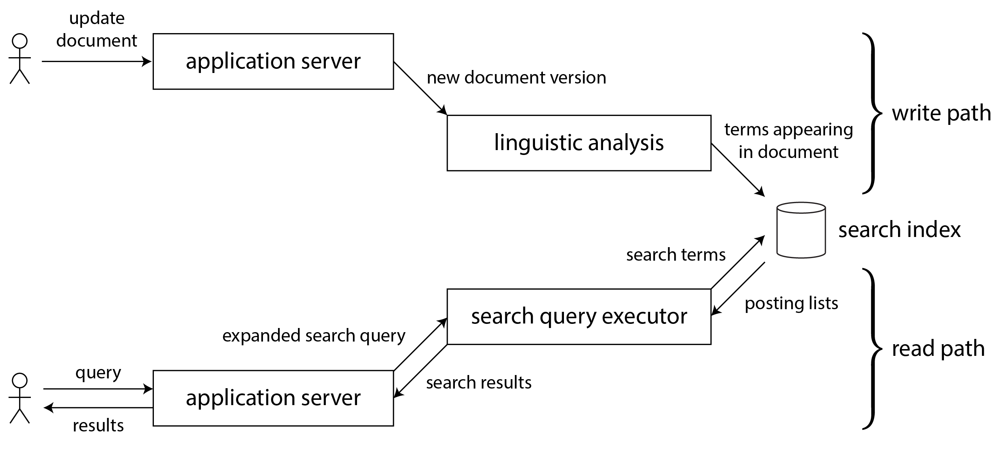
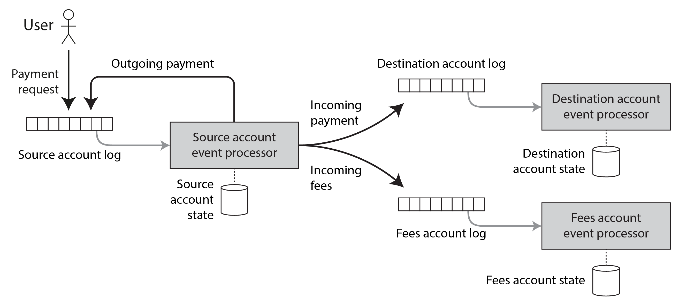

# Chapter 13: A Philosophy of Streaming Systems

> "If a thing be ordained to another as to its end, its last end cannot consist in the preservation of its being. Hence a captain does not intend as a last end, the preservation of the ship entrusted to him... If the highest aim of a captain was to preserve his ship, he would keep it in port forever." 
> — St. Thomas Aquinas (1265–1274)

This final chapter brings together the overarching themes of the book—building **Reliable, Scalable, and Maintainable** applications—by deeply exploring the philosophy of streaming and event-driven architectures. 

## 1. Data Integration
Throughout the book, we've seen that there is no single "silver bullet" database. 
*   B-Trees are great for OLTP queries, but Column-stores are vastly superior for Analytics.
*   Single-leader replication guarantees consistency, but Multi-leader replication is required for global availability.

Because no single tool can perfectly satisfy every access pattern, a complex application inevitably requires cobbling together multiple specialized systems (e.g., Postgres as the source of truth, Elasticsearch for the full-text search bar, and Redis for caching). The hardest architectural challenge is integrating these deeply diverse data systems.

### Combining Specialized Tools by Deriving Data
When you have a piece of data that must physically exist in three different databases, you must be incredibly strict about your dataflows. 
*   **The Anti-Pattern (Dual Writes):** Allowing the backend application code to directly connect and write to both Postgres and Elasticsearch simultaneously invites catastrophic race conditions (as seen in Figure 12-4). Neither system is "in charge" of the sorting order, inevitably leading to permanent divergence.
*   **The Solution (Deriving Data):** You must establish a single "System of Record" that dictates the total order of writes. By funneling all user input into a single append-only log, you can use **Change Data Capture (CDC)** or **Event Sourcing** to mathematically *derive* the caches and search indexes by processing the writes in a strictly deterministic sequence.

## 2. Derived Data vs. Distributed Transactions
Historically, if an enterprise wanted to keep two different databases perfectly in sync, they used **Distributed Transactions (Two-Phase Commit / XA)**. Today, the modern approach is using **Derived Data (Log-based streaming)**. Let's compare them:

| Feature | Distributed Transactions (XA) | Derived Data (Log-based CDC) |
| :--- | :--- | :--- |
| **Ordering Mechanism** | Uses **Locks** for mutual exclusion. | Uses an **Append-Only Log** for total ordering. |
| **Fault Tolerance** | **Atomic Commit** (all or nothing success). | **Deterministic Retry & Idempotence**. |
| **Consistency Scope** | Guarantees immediate "Read Your Own Writes". | Inherently Asynchronous (Eventual Consistency). |
| **Performance** | Terrible throughput and catastrophic failure modes. | Highly scalable and massively fault-tolerant. |

While Distributed Transactions provide beautiful guarantees (you can immediately read your own writes), their physical performance overhead and vulnerability to partial network failures make them practically unusable at massive scale. Log-based derived data is the clear winner for the future, but architects must learn to build applications that operate safely on top of asynchronous "eventual consistency."

## 3. The Limits of Total Ordering
Relying on a single Kafka partition (a single totally ordered log) to synchronize your entire architecture is an incredibly powerful paradigm—until your company gets too big. There are fundamental physical limits to maintaining a totally ordered log:

1.  **Scale / Sharding:** A single leader node can only ingest so much throughput. Once you are forced to shard the log across multiple machines, the mathematical ordering of events *between* two different shards becomes fundamentally ambiguous.
2.  **Global Deployment:** If you have datacenters in New York and Tokyo, forcing all writes to perfectly sync through a single global leader is far too slow (due to the speed of light). Multi-leader setups intentionally sacrifice strict total ordering.
3.  **Microservices:** In a true microservice architecture, each service strictly encapsulates its own isolated durable database. There is no central, global log that perfectly orders events jumping strictly between independent, bounded domain contexts.

*(Note: In computer science terms, mathematically deciding on a perfect total order of events across a distributed system is known as **Total Order Broadcast**, which is formally equivalent to achieving consensus via algorithms like Raft or Paxos).*

### Ordering Events to Capture Causality
If a large system loses total ordering, does it matter? If events are completely isolated, no. However, in the real world, hidden **Causal Dependencies** exist everywhere.

**The "Unfriend" Anomaly:**
Imagine a devastatingly subtle race condition on a social network:
1. Two users get into a fight. User A clicks **"Unfriend"** on User B.
2. Immediately afterward, User A posts a mean message complaining about User B. 
3. *The Intent:* User B must not see the message, because they are no longer friends. 

If the "Unfriend" event is routed to Shard 1, and the "Message Post" event is routed to Shard 2, the absolute time-ordering is lost. If the downstream Notification Service consumes Shard 2 slightly faster than Shard 1, it will see the "New Post" event *before* it processes the "Unfriend" event, and disastrously email User B the mean message!

This is a failure to capture causality. Solving this without a massive, slow, global total-order log is an open research problem. Current starting points include:
1.  **Logical Timestamps:** Propagating metadata (like Lamport Clocks or Vector Clocks) inside the events so downstream consumers can mathematically detect if they received something out of order.
2.  **Referential Context:** When a user takes an action, the application explicitly logs the unique ID of the exact state the user *saw* on their screen before acting, allowing backends to reconstruct the exact causal chain.
3.  **Conflict Resolution:** Utilizing algorithms (like CRDTs) that are mathematically designed to elegantly self-heal and merge data that arrives sequentially out-of-order. They do not help if actions have external side effects

---

## 4. Batch and Stream Processing
The ultimate goal of data integration is ensuring data ends up in all the right places, in the right formats. The dual engines powering this dataflow are Batch Processing and Stream Processing.
As established in Chapters 11 and 12, Batch and Streaming are fundamentally identical paradigms. The only difference is that batch processing operates on finite, bounded datasets, while stream processing operates on infinite, unbounded datasets.

### Maintaining Derived State
Both processing paradigms strongly encourage a functional programming philosophy: 
Data pipelines should be constructed from **Deterministic, Pure Functions** with explicitly defined inputs and outputs.
Inputs are treated as strictly immutable, and outputs are strictly append-only. There should be no hidden side-effects.

If a data pipeline is perfectly deterministic, maintaining derived state becomes incredibly robust and failure-tolerant. If your entire Elasticsearch index crashes and burns, you do not panic. You simply restart the pure function from the beginning of the immutable input log and mathematically rebuild the cache perfectly from scratch.
Furthermore, asynchronous pipelines inherently contain faults. If the pipeline updating the Elasticsearch index crashes, the rest of the company (e.g., the Postgres database and the Redis cache) keeps running flawlessly. Distributed transactions, by contrast, amplify failures by forcing the entire system to abort if a single index node goes down.

### Reprocessing Data for Application Evolution
In the real world, applications evolve. A company might suddenly realize their old data pipeline is generating useless analytics, and they want to completely restructure how the data is modeled. 

**Reprocessing** is the superpower that makes this possible. 
Because you possess an immutable append-only log of all historical events, you can create a *brand new*, completely restructured view of the data by simply writing a new functional pipeline and replaying the entire history into it from the beginning!

#### 🚂 Schema Migrations on Railways
To understand why gradual reprocessing is so powerful, look at railway migrations. In 19th-century England, competing railway companies built tracks with different widths (gauges).
When the government finally standardized a single gauge, companies couldn't just shut down the entire country's economy for two years to rebuild the tracks. 
Instead, they laid down a **Third Rail**. This created a "mixed gauge" track where both old trains and new trains could run simultaneously. Over decades, as old trains were retired and replaced with standard-gauge trains, they finally ripped up the old rail.

This is exactly how you perform zero-downtime database schema migrations! 
1. You keep the old pipeline running and perfectly serving the legacy users.
2. You spin up the new, redesigned pipeline side-by-side, reprocessing historical data to catch up to the present.
3. You slowly route 5% of your users to the new system to test for bugs.
4. Once all 100% of users are safely migrated, you delete the old pipeline.

This process is entirely reversible at any stage, completely removing the terror of migrating a live production database.

### Unifying Batch and Stream Processing
Historically, developers had to write one set of code for Batch (e.g. Hadoop) and a completely separate set of code for Streams (e.g. Storm). 

*   **Lambda Architecture:** An older concept that suggested keeping both systems. Run a fast, approximate stream processor for real-time views, and a slow, accurate batch processor overnight to correct the stream's mistakes. This was notoriously hated because developers had to maintain two completely separate codebases for the exact same logic.
*   **Kappa Architecture:** The modern approach. It argues that *Batch is just a specialized case of Streaming*. You can build a single, unified codebase that handles both. 

With systems like Apache Flink or Google Cloud Dataflow, you write the logic once. 
If you point the engine at a historical log on disk, it acts like a blistering fast Batch processor. If you point that exact same code at a live Kafka topic, it acts like a real-time Stream processor. Achieving this unification requires ensuring the engine natively handles **Event Time** windowing (so historical data isn't stamped with today's execution clock) and provides strict **Exactly-Once Semantics**.

---

## 5. Unbundling Databases
At their core, Databases, Stream Processors, and Unix Operating Systems all do the exact same thing: they are "Information Management Systems" that store data and let you query it. 

Historically, Unix and SQL took two completely opposing philosophies to this problem:
*   **The Unix Way:** Provide bare-metal, low-level abstractions (files and pipes). Expose the raw mechanics to the engineer and let them compose small, sharp tools together.
*   **The Relational DB Way:** Hide the entire frightening reality of the hardware. Provide an incredibly high-level, declarative abstraction (`SQL`) so the programmer doesn't have to think about B-Trees, disk concurrency, or crash recovery.

For decades, these two philosophies warred (the NoSQL movement was essentially an attempt to bring Unix-style low-level abstractions to distributed storage). Modern data architectures are finally attempting to reconcile and combine both worlds.

### Composing Data Storage Technologies
When you run `CREATE INDEX` in PostgreSQL, the database scans the table, sorts the data, writes it to disk, and then permanently subscribes to a stream of new writes to keep the index continuously synchronized. 
Notice how this built-in database feature is physically identical to configuring a Kafka CDC stream to derive an external Elasticsearch index!

### The Meta-Database of Everything
When you zoom out, an entire modern enterprise architecture is literally just **One Giant Distributed Database**.
*   Kafka is the Write-Ahead Log.
*   Flink is the internal trigger/stored-procedure engine.
*   Elasticsearch, Redis, and Snowflake are nothing more than specialized secondary indexes maintained by the log!

Instead of buying a single massive "Oracle" monolith that tightly couples all these features under one roof, modern organizations are building the exact same capabilities by composing bespoke, best-in-class software together.

If no single database can do everything, how do we stitch these disparate tools together into a cohesive system? There are two avenues:

#### 1. Federated Databases (Unifying Reads)
If you have data in Postgres, Mongo, and Kafka, you can place a **Federated Query Engine** (like Trino or Presto) over all of them. 
This engine acts like a massive SQL router. The user writes a single SQL query, and the Federated Engine breaks it apart, translates it, sends the pieces to Postgres and Mongo, and merges the results. 
This perfectly follows the SQL Philosophy: it gives the user one beautiful, high-level querying abstraction, hiding the terrifying complexity underneath. However, federation only solves *reading* data; it does absolutely nothing to help you *write* data across systems safely.

#### 2. Unbundled Databases (Unifying Writes)
The alternative is embracing the Unix Philosophy. 
Instead of trying to hide the complexity under a magic federated query engine, you expose the raw event streams using Change Data Capture. You meticulously compose the architecture by having small, sharp components (Stream Processors) "pipe" the data from the source of truth into the various distinct databases. 
This "Unbundled" approach guarantees that all writes confidently sync across the company's entire infrastructure, perfectly preserving fault tolerance.

### Making Unbundling Work
Synchronizing writes across heterogeneous storage systems via distributed transactions (XA protocol) is a notorious infrastructure nightmare because there is no standardized protocol between vastly different databases.
The "Unbundled" solution—an ordered asynchronous event log with idempotent consumers—is a far superior abstraction for cross-system integration.

This log-based **loose coupling** provides two massive advantages:
1. **System-Level Robustness:** If Elasticsearch crashes, the synchronous distributed transaction approach would force Postgres to abort its writes too! With an asynchronous log, the Kafka broker simply buffers the messages. Postgres keeps writing flawlessly, and Elasticsearch just catches up hours later when it comes back online. The fault is perfectly contained locally.
2. **Human-Level Independence:** Unbundling allows different software teams to work entirely independently. The Database team only cares about emitting the CDC log. The Search team only cares about pulling from that log. The strict, durable event stream acts as the perfect, decoupled API boundary between teams.

### Unbundled vs. Integrated Systems
Does the Unix-philosophy of "Unbundled Databases" mean you should never use a single monolithic database again? Absolutely not.
If a single technology (like PostgreSQL) perfectly satisfies all your requirements, **you should just use it.** 

Stitching together Kafka, Flink, Postgres, and Elasticsearch carries immense operational cost. You have to deploy, patch, and monitor four different distributed systems with four different learning curves. Building a massively scalable unbundled architecture when you only have a gigabyte of data is classic *Premature Optimization*. A single integrated Postgres database will give you vastly better and more predictable performance on a single machine than an unbundled rig.

The goal of Unbundling is not to compete with individual databases on pure performance. The goal is entirely about **breadth**. 
When your application requirements grow so diverse that *no single database on Earth can physically handle all your workloads*, unbundling provides the only robust architectural framework to safely stitch specialized tools together.

---

## 6. Designing Applications Around Dataflow
The concept of automatically updating derived views when the underlying data changes is a concept we've already had since 1979: **Spreadsheets** (like VisiCalc or Excel). 
In Excel, you type a formula in cell `C1` (`=A1+B1`). When you mutate `A1`, `C1` automatically and instantaneously recalculates. You don't have to manually tell `C1` to update, and you don't care *how* it happens—you just trust the reactive dataflow.

Modern stream processors are essentially trying to build a fault-tolerant, planetary-scale version of Excel. When a user updates their profile in the database, the search index and frontend UI cache should react and correctly recalculate on their own.

### Application Code as a Derivation Function
The logic that connects a source dataset to a derived dataset is the **Derivation Function**.
*   **Simple Functions:** For a standard exact-match B-Tree index, the function is just "pluck the column and sort it." This is so mundane that databases natively provide it via the `CREATE INDEX` command.
*   **Complex Functions:** For a Machine Learning model or a recommendation engine, the derivation function requires immense statistical analysis, specific feature extraction, and unique business logic. 

Relational databases have historically attempted to support custom derivation functions using **Stored Procedures and Triggers**. However, embedding complex business logic *inside* the database has proven to be an architectural nightmare. Relational databases are notoriously bad environments for arbitrary code execution (lacking dependency management, version control, modern monitoring, and network call capabilities).

### Separation of Application Code and State
Instead of putting application code inside the database (via Triggers/Stored Procedures), modern engineering relies on a strict separation:
> *"We believe in the separation of Church and state."* 
> — Functional Programming Joke (referencing Alonzo Church, creator of the immutable boolean Lambda calculus).

**The Modern Architecture:**
*   **State Management:** Handled purely by the Databases/Brokers (Kafka, Postgres). Their only job is durability, concurrency, and fault tolerance.
*   **Application Code:** Handled purely by Stateless Services deployed on Kubernetes, Mesos, or Docker. These orchestrators are immensely better at tracking versions, managing packages, and scaling compute horizontally than any database plugin could ever be.

In this model, the database acts as a massive global *Mutable Variable*. The stateless web servers connect via the network to read and write to it. 
However, this exposes a massive shortcoming of modern programming languages. In Java or Python, if another node mutates a variable, you cannot easily mathematically *subscribe* to that change. You are forced to passively **poll** it (querying `SELECT *` every 5 seconds to see if anything changed). 

Databases inherited this passive polling approach from programming languages. Only recently, with the rise of tools like Kafka and CDC streams, are databases finally exposing the ability to actively *subscribe* to changes.

### Dataflow: Interplay Between State Changes and Application Code
Once you have the ability to *subscribe* to state changes, you fundamentally renegotiate how your application runs. 
Instead of treating Postgres as a dumb, passive variable that your Java code manually pushes updates into, your Java code **collaborates** with Postgres. Application code reacts to state changes in one place by deterministically triggering state changes in another place. 

If we unbundle the database and rely on stream processing to do this, we need the log to provide two massive guarantees:
1.  **Stable Ordering:** The exact chronological sequence of events is perfectly preserved so that all downstream views remain mathematically consistent.
2.  **Fault Tolerance (Durable Delivery):** Dropping a single message causes a derived cache to go permanently out of sync with its source.

Fortunately, modern Kafka + Flink setups provide these stringent guarantees effortlessly. It is immensely faster and more practically robust to rely on durable, totally ordered event logs than to attempt synchronous distributed transactions. 

### Stream Processors and Services (REST vs. Dataflow)
Currently, the dominant architectural paradigm is Microservices communicating via **Synchronous REST APIs or RPC Calls**.
Like the Dataflow approach, Microservices achieve great organizational scalability by loosely coupling teams. However, the exact way the servers talk to each other is profoundly different.

Imagine a user is purchasing an item on your eCommerce platform, and your code needs the current foreign exchange rate to complete the checkout.

1.  **The REST / RPC Approach:**
    When the user clicks "Buy", your `Purchase Service` makes a synchronous HTTP network call over the internet to the `Exchange Rate Service`. 
    *The Nightmare:* If the Exchange Rate Service goes down, your Purchase Service crashes. If the network drops the packet, your Purchase Service hangs.

2.  **The Dataflow / Streaming Approach:**
    The `Purchase Service` permanently *subscribes* to a Kafka stream of Exchange Rate updates ahead of time. It stores the latest exchange rates sequentially inside its own isolated, local database on the exact same physical machine. 
    When the user clicks "Buy," the `Purchase Service` simply runs a 0.1-millisecond `SELECT` query against its own local Hard Drive!

Not only is the Dataflow approach infinitely faster (because you physically eliminated the network round-trip), but it is perfectly robust. If the Exchange Rate Service crashes entirely, your users can still successfully check out because the `Purchase Service` simply uses the last known cached rate from its local database!

*The fastest and most reliable network request is no network request at all.* 
By embracing event streams, we completely eliminate devastating synchronous dependencies and move toward a spreadsheet-like model of reactive dataflow.

---

## 7. Observing Derived State
At a high level, the dataflow systems we've explored provide a mechanism to constantly compute and update derived datasets. The entire journey of a piece of data can be split into two fundamental halves:

1.  **The Write Path (Eager Evaluation):** The journey data takes from the moment the user makes a change until it is fully processed through the streams and mathematically materialized into various derived caches ready to be served. This work happens *eagerly*, ahead of time, regardless of whether anyone ever actually asks to see it.
2.  **The Read Path (Lazy Evaluation):** The journey the data takes from the derived cache to the screen of the final end-user who requested it. This work happens *lazily*, occurring exactly at the millisecond the user asks for it.

The **Derived Dataset** (e.g., the Search Index or the Redis Cache) is specifically the exact border wall where the Write Path finally collides with the Read Path!


*Figure 13-1: The search index acts as the exact boundary where background precomputation (Write Path) meets on-demand user queries (Read Path).*

### Materialized Views and Caching (Shifting the Boundary)
Architecting a database system simply involves negotiating *where* to draw the boundary between the Write Path and the Read Path. 
Consider a Search Engine:
*   **Maximum Read-Path Work:** You do not build an index at all. When a user searches for a term, your system must literally `grep` scan scanning every document on earth to find it. The Write Path is instantly fast (you just save the file), but the Read Path is brutally slow.
*   **Maximum Write-Path Work:** You attempt to pre-compute the full search results for every single possible theoretical keyword search on earth. The Read Path is instantly fast, but the Write Path is mathematically impossible (exponential permutations).
*   **The Cache / Materialized View Compromise:** You pre-calculate the exact search results for the Top 1,000 most common searches (the Write Path) and store them in a Cache. You let the other unique searches hit the standard index (the Read Path). 

The entire purpose of any cache, index, or materialized view is to intentionally force your backend systems to work vastly harder on the Write Path in order to save precious milliseconds on the Read Path when the user finally requests it. We saw this previously in the Twitter Home Timeline cache. 

### Stateful, Offline-Capable Clients
We can extend this philosophy of "Shifting the Boundary" all the way to the user's physical cell phone!

Historically, web browsers were completely stateless clients. If you lost WiFi, the website completely stopped working because every click required a network round-trip. 
Today, modern Single-Page Applications (SPAs) and highly robust Mobile Apps rely on a radically different architecture: **Local-First Software**.
Instead of forcing the app to wait for a 500-millisecond REST API call to fetch data, we literally shift a massive replica of the Cloud Database directly onto the phone's internal storage! 

This achieves two massive paradigm shifts:
1.  **Offline Capability:** The user interface reacts instantly to local taps, perfectly functioning inside a subway with zero network connection. It seamlessly syncs the data stream to the cloud lazily in the background when the phone catches a WiFi signal.
2.  **The Ultimate Cache:** The local SQLite database running physically inside the user's iPhone is effectively the absolute furthest edge of the *Derived Dataset* boundary. The App's UI pixels on the screen are merely a materialized view reacting to the phone's local database replica!

### Pushing State Changes to Clients
Historically, browsers only ever downloaded data once. If a user was looking at an article and the server updated it, the browser would never know unless the user explicitly hit "Refresh". 
The browser's state was essentially a *Stale Cache* that had to be manually polled.

Modern protocols like **WebSockets** and **Server-Sent Events (SSE)** completely change this. They hold an open TCP connection to the browser, allowing the server to proactively *push* database changes directly into the user's screen without them clicking refresh.
By doing this, we extend the "Write Path" all the way out of the datacenter and directly into the end-user's physical device!

If the user's phone temporarily loses cellular connection, it simply behaves identically to a Kafka Consumer that crashed: when the phone reconnects to WiFi, it simply tells the server its last known "Offset" and safely downloads all the events it missed while in the tunnel.

### End-to-End Event Streams
Modern frontend Javascript frameworks (like React, Vue, and Elm) are natively built to react to state changes. 
Combining "Server-Sent Events" with "React" creates an absolutely beautiful **End-to-End Event Pipeline**:
1. User A clicks a button.
2. The Database writes it to the Log.
3. The Stream Processor derives the new Cache.
4. The WebSocket pushes the new Cache to User B's laptop.
5. User B's React framework automatically updates the DOM pixels on their screen.

This entire pipeline happens in less than a second, creating a spreadsheet-like dataflow across the entire planet. Real-time apps (like Slack or Multiplayer Games) already do this, so why don't we build *all* applications this way?

Because the legacy "Stateless Request/Response" paradigm is still deeply baked into our libraries and languages. Transitioning the entire global software industry from synchronous RPC calls to asynchronous Publish/Subscribe dataflows is a massive paradigm shift that will take years of effort.

### Reads are Events Too
Throughout the book, we've treated **Writes** as immutable events that flow through a stream, while treating **Reads** as ephemeral network requests that hit a database and are immediately forgotten.

But what if we treated *Reads* as events too?
Imagine routing both your Write Stream and your Read Stream into the same stream processor! The processor simply performs a **Stream-Table Join**: it takes the Read Event, joins it with the current State, and emits the query result.
In this paradigm, a one-off `SELECT` query is just a transient stream-join that forgets the user immediately. A `Subscribe` query is simply a persistent stream-join that remembers the user and keeps feeding them results.

Recording every single user "Read" into an immutable disk log provides immense analytical value. In an eCommerce store, the only way to know *why* a customer abandoned their cart is to look at exactly what Inventory Status and Shipping Date was rendering on their screen at the exact second they clicked away. Capturing causality requires logging both what the user did (writes) and what the user saw (reads).

### Multi-Shard Data Processing
Treating Reads as a stream of events seems like overkill for a standard single-database query. However, it becomes incredibly powerful when performing massively distributed joins.
Imagine a Fraud Prevention system: to determine if a checkout event is fraudulent, the system must check the user's IP reputation, Email reputation, and Billing Address reputation. Each of these three datasets is massively sharded across different clusters.
Instead of making synchronous RPC calls to three different sharded databases, you can simply feed the "Checkout Event" into a Stream Processor, which automatically routes and joins the event across the differently sharded reputation streams! 

---

## 8. Aiming for Correctness
If a stateless web-server crashes, no one cares. You reboot it, and life moves on. 
If a stateful *database* corrupts data, that corruption might last forever. Building applications that remain mathematically correct in the face of network partitions, hardware destruction, and concurrency is the hardest challenge in computer science.

Historically, the industry's default answer to Correctness was **Distributed Transactions (ACID Atomicity and Isolation)**. 
However, after four decades, these foundations are proving incredibly shaky at global scale:
*   Weak Isolation levels (like Read Committed) are notoriously confusing and riddled with subtle race-condition bugs.
*   The "Jepsen" tests have repeatedly proven that major databases literally lie about their safety guarantees when network cables are physically unplugged.
*   Strict Serializability (the gold standard of transactions) is physically impossible to run efficiently across multi-datacenter, geographically distributed architectures.

As companies dropped transactions in favor of horizontally scalable NoSQL systems, they were told to "embrace Weak Consistency"—which translates to simply crossing your fingers, tolerating data loss, and hoping for the best. 

If Strict Transactions are too slow, and Weak Consistency is too dangerous, where do we go? The final section of this book explores how to achieve rigorous Correctness *without* relying on legacy Distributed Transactions, by utilizing Dataflow and Event-Driven architectures.

### The End-to-End Argument for Databases
Even if you are using the most meticulously engineered Serializable Database in the world, your data is not safe. 
If a junior engineer pushes a buggy `DELETE` statement, the database will happily, flawlessly, and serializably execute it and obliterate your entire production dataset. Strict Transactions alone cannot save you from fundamentally flawed application code.
This is the ultimate argument for **Immutable, Append-Only** data architectures. If you physically remove the ability for buggy code to *destroy* good data, recovery is infinitely easier. 

### Exactly-Once Execution
When dealing with message brokers and event streams, "Exactly-Once" processing is a holy grail. 
If a stream processor attempts to deduct $11 from a customer's bank account, but crashes right before sending the "Acknowledgment", it will restart and try again. If the first attempt actually succeeded, the system is about to brutally overcharge the customer.
"Exactly-Once" means configuring the system so that the final effect mathematically mimics a single flawless execution, *even if* the network forced the system to physically retry the operation 5 times. 

The easiest and safest way to achieve this is making all operations **Idempotent**.

### Duplicate Suppression (Why TCP and 2PC aren't enough)
Idempotence sounds simple, but dealing with duplicates is exceptionally tricky because it requires End-to-End coordination. 
Consider standard TCP connections. TCP natively suppresses duplicate packets. But what happens if a Java Application sends a `COMMIT` to Postgres, and then the entire TCP connection drops? The Java app has absolutely no idea if Postgres committed the transaction, so it reconnects and blindly resends the queries. Because it's on a *new* TCP connection, the built-in TCP deduplication is useless, and the customer might get charged $22 instead of $11!

Distributed Transactions (Two-Phase Commit) attempt to solve this between the App and the Database. But they completely ignore the most fragile link: **The End User.**
If a user is on their phone trying to wire money, and their cellular signal drops right after they tap "Send", the browser spins. The user gets impatient and taps "Submit" again! From the Web Server's perspective, this is a completely brand new, legitimate HTTP POST. No amount of database transaction locks or TCP routing will prevent the database from charging the user twice. 

#### Uniquely Identifying Requests (The Solution)
You cannot rely on the Database to magically solve duplicate requests; you must implement an **End-to-End Request ID**.
1. When the user loads the webpage, the browser statically generates a unique `UUID` hidden in the DOM.
2. When they tap "Submit", the payload includes this `UUID`. Even if they tap it 15 times on a bad connection, all 15 POST requests carry the exact same UUID.
3. The Database transaction contains an `INSERT` statement into a `requests` table with a strict `UNIQUE` constraint on the UUID column. 
4. If the database receives the second payload, the transaction violates the Uniqueness Constraint and gracefully aborts.

```sql
-- Example 13-2: Suppressing duplicate requests using an End-to-End UUID
BEGIN TRANSACTION;
INSERT INTO requests (request_id, amount) VALUES ('0286FDB8-D7E1...', 11.00);
UPDATE accounts SET balance = balance - 11.00 WHERE account_id = 4321;
UPDATE accounts SET balance = balance + 11.00 WHERE account_id = 1234;
COMMIT;
```

With this mechanism, you ensure *exactly-once* processing not just at the database level, but across the entire physical arc of the system (from the user's phone to the final Hard Drive).

### The End-to-End Argument
Duplicate suppression via a client-generated UUID is just one manifestation of a famous 1984 systems engineering principle: **The End-to-End Argument**.

> *"The function in question can completely and correctly be implemented only with the knowledge and help of the application standing at the endpoints of the communication system."*
> — Saltzer, Reed, and Clark (1984)

The core principle is that low-level infrastructure (like TCP or Databases) can *assist* with reliability, but they cannot guarantee absolute correctness on their own. 
*   **Duplicate Suppression:** TCP deduplicates network packets, but cannot prevent a user from rage-clicking "Submit" twice on a bad connection. Only an end-to-end UUID guarantees exactly-once processing.
*   **Data Integrity:** Ethernet and TCP have built-in checksums to prevent network corruption, but cannot prevent a software bug from corrupting the data *before* it hits the network. Only end-to-end cryptographic checksums guarantee data hasn't been altered.
*   **Security (Encryption):** Your home WiFi password protects you from the neighbor, and SSL/TLS protects you from the ISP, but neither protects you if the server itself is hacked. Only *End-to-End Encryption* completely secures the data.

### Applying End-to-End Thinking in Data Systems
Because traditional distributed transactions are overwhelmingly expensive at scale, many companies abandoned them entirely. But reasoning about race conditions and partial failures is incredibly counterintuitive, so application-level error handling almost always has subtle bugs resulting in lost or corrupted data.

We need fault-tolerance abstractions that are stronger and more reliable than "crossing our fingers" with Weak Consistency, but vastly more scalable than locking the entire database with Two-Phase Commit. By relying on Immutable Event Logs, Idempotent Consumers, and strict End-to-End Request IDs, we can finally architect highly scalable, globally distributed systems that are fundamentally, mathematically correct.

### Enforcing Constraints
Beyond suppressing duplicates, databases must also enforce **Constraints**. 
*   **Uniqueness:** Two users cannot claim the exact same username, or book the exact same airline seat.
*   **Boundaries:** An account balance cannot dip below zero, or an inventory count below zero.

#### Why Uniqueness Requires Consensus
In a distributed system, enforcing a uniqueness constraint formally requires **Consensus**. If two users on opposite sides of the earth click "Claim Username 'Batman'" at the exact same millisecond, the distributed system must somehow mathematically agree on who won and who lost.

Historically, this meant funneling all writes through a Single Leader Node. Multi-Leader replication cannot solve this (both leaders would accept the username, sync an hour later, and realize they violated the uniqueness constraint).

#### Uniqueness in Log-Based Messaging
If you adopt the "Unbundled" approach, you can actually solve the Consensus/Uniqueness problem flawlessly using a shared event log and sharding!

Because a Stream Processor consumes from a single Kafka partition sequentially, single-threaded, it is mathematically guaranteed to process conflicting events in a perfectly unambiguous chronological order. 

Here is how you build a massively scalable, distributed username-claimer *without* legacy Distributed Transactions:
1. **Sharded Logging:** Both users click "Claim 'Batman'". The web server hashes the word 'Batman' and guarantees both requests are pushed into the exact same log shard (e.g., Partition 4).
2. **Sequential Processing:** The Stream Processor reads Partition 4. It sees User A's claim arrived 10 milliseconds before User B's. 
3. **Deterministic Choice:** It records 'Batman' as owned by User A, emits a "Success" event for User A, and explicitly emits a "Rejected: Already Taken" event for User B.

This architecture fundamentally relies on exactly one principle: **Any writes that might conflict must be routed to the exact same log shard and processed sequentially.** 
By doing this, you can infinitely scale out by simply adding more shards, achieving total correctness without relying on expensive synchronous Two-Phase Commit locks!

#### Multi-Shard Request Processing
Ensuring correctness on a single shard is easy. But what happens when an operation span across multiple shards?
Imagine a Bank Transfer:
1. Deduct $11 from Payer (Shard A)
2. Add $11 to Payee (Shard B)
3. Deduct $1 from Payer for Fees (Shard C)

A traditional SQL database would achieve this via atomic cross-shard committing. But because cross-shard locks absolutely destroy throughput, we can achieve identical correctness using **Event Logs and Stream Processors** instead.


*Figure 13-2: A complex multi-shard atomic transfer implemented entirely with asynchronous, deterministic stream processors and End-to-End Request IDs.*

**The Stream Workflow:**
1. The user's phone generates a UUID and submits the Transfer Request. It is routed to the Payer's log shard.
2. The Stream Processor for the Payer shard reads the request, verifies the balance, reserves the $12, and emits three brand new events to the network: An Outgoing Event, an Incoming Event (routed to Payee shard), and a Fee Event (routed to Fee shard). *All three events proudly carry the exact same original UUID.*
3. Independent Stream Processors read the Payee and Fee shards. They receive the Incoming/Fee events, safely update their balances, and record the UUID to ensure they never process it twice.

This is a profoundly different way to build systems. Atomicity does not come from locking the three shards together! 
Atomicity comes solely from **the very first atomic write of the Request Event to the Payer Log**. 
Because the downstream processors are strictly deterministic, once that first parent event is successfully logged, it is mathematically guaranteed that the three child events will eventually be emitted and sequentially processed by the Payee and Fee shards, no matter how many times the servers crash in between!

### Timeliness and Integrity
In traditional database transactions, as soon as a `COMMIT` finishes, the new data is instantly visible to the next `SELECT` query. This is called *Strict Serializability*. 
However, in asynchronous stream processing, this is lost. The sender does not wait for the downstream views to update. The user might submit a payment, quickly hit refresh on their account balance page, and successfully see the *old* un-deducted balance because the read happened before the stream updated the cache.

To understand why this is acceptable, we must split "Consistency" into two completely separate concepts:
1.  **Timeliness:** Ensuring the user observes an up-to-date state. If timeliness is violated (the user sees an old balance), it is just *annoying*. It fixes itself if they wait 3 seconds and hit refresh again. This is "Eventual Consistency".
2.  **Integrity:** Ensuring there is no data loss or contradictory corruption. If integrity is violated (a $10 payment vanishes entirely), it is *catastrophic*. Waiting 3 seconds will not magically bring the money back. This is "Perpetual Inconsistency".

For 99% of business applications, **Integrity is vastly more important than Timeliness**. It is perfectly acceptable for a Credit Card charge to take 24 hours to appear on a statement (slow timeliness) as long as it mathematically adds up perfectly at the end of the month (strict integrity).

#### Correctness of Dataflow Systems
Traditional ACID transactions violently forced both Timeliness and Integrity together via synchronous locks. 
Event-driven Dataflow proudly *decouples* them:
*   We completely abandon Timeliness (Stream processing is inherently asynchronous).
*   We absolutely double down on Integrity! By utilizing Exactly-Once semantics, Idempotence, and End-to-End UUIDs, streaming systems achieve flawless mathematical integrity without needing Distributed Transactions.

### Loosely Interpreted Constraints (Apology Workflows)
We established earlier that enforcing hard uniqueness constraints (like "You cannot sell more items than you have in stock") requires sharding all requests sequentially through a single stream-processor node. 

However, in the real world, strict hard constraints are often bad for business!
*   **Airlines overbook flights** fully expecting someone to cancel. 
*   **Warehouses accept back-orders** knowing a forklift might accidentally run over some stock tomorrow anyway. 
*   **Banks allow you to overdraft** into the negative so they can explicitly penalize you with a lucrative $35 overdraft fee!

In business, constraints are often *loosely interpreted*. It is highly profitable to optimistically accept a write that technically violates a constraint, and then just issue an **Apology** (a "Compensating Transaction") later!
If an airline accidentally double-books a seat, the business doesn't crash like a C++ program with a Segmentation Fault. The airline simply prints out an apology letter, gives one passenger a $500 flight voucher, and puts them in a hotel. 

If your business is perfectly comfortable running an "Apology Workflow", then insisting on blocking a customer checkout behind a massive synchronous Two-Phase Commit transaction just to prevent a temporary negative inventory count is incredibly foolish. We can achieve massive scale by embracing Optimistic Asynchronous Writes, and relying on compensating events to patch up any rare conflicts after the fact.

### Coordination-Avoiding Data Systems
By piecing together everything we've learned, we arrive at two powerful conclusions:
1. **Integrity is Possible Without Atomicity:** Dataflow systems can provably ensure permanent, mathematical integrity (no lost data, no duplicate charges) *without* needing Strict Serializability, Linearizability, or expensive cross-shard Two-Phase Commits.
2. **Constraints Can Be Loose:** While perfect strict Unique Constraints structurally *require* a single node to establish Consensus, most businesses actually prefer to break constraints and execute "apology workflows" later anyway.

Combining these two facts unlocks the ultimate holy grail of distributed databases: **Coordination-Avoiding Systems**.
By entirely removing the need for servers to synchronously pause and talk to each other (Coordinate) before accepting a write, you can achieve unparalleled performance and infinite scale.

You can have a Multi-Leader database stretched across 10 regions around the entire globe. Each Datacenter can independently accept writes on its own without *ever* needing to synchronously check with the other 9 datacenters first. The system will inherently suffer from terrible *Timeliness* (because they only asynchronously sync logs later), but will flawlessly uphold *Integrity*. 

We cannot reduce the number of apologies to zero. But by avoiding coordination, we massively increase Availability and Performance. Building modern data systems means finding the sweet spot: giving up just enough traditional transaction features to avoid outages, while establishing enough event-driven integrity to ensure you don't ruin the customer experience!

---

## 9. Trust, But Verify
All of our discussion around Fault Tolerance inherently assumes a *System Model*: we assume the network might drop packets, machines might crash, and hard drives might fail. But we simultaneously assume that the CPU executes mathematics correctly, and that data successfully `fsync`'d to disk stays there unharmed.
Traditionally, system models treat faults as binary: some things *can* happen, other things *never* happen. 
But at a large enough scale, the impossible happens all the time. Cosmic rays flip bits in RAM. Unlikely network corruptions bypass CRC checksums. Silent data corruption on hard drives occurs. 

### Maintaining Integrity in the Face of Software Bugs
Beyond hardware, we must also acknowledge the terrifying reality of Software Bugs.
Even the most robust, battle-tested databases in the world have catastrophic bugs. Past versions of MySQL have mathematically failed to uphold Unique Constraints. Past versions of Postgres’ Strict Serializable Isolation have exhibited write-skew anomalies.
If the database engine itself makes a mistake, your perfect application code won't save you. 

Furthermore, relying purely on ACID Transactions to guarantee your system is "Consistent" is a dangerous fallacy. ACID guarantees that the database transitions from one valid state to another, *assuming your application code has zero bugs*. If a junior developer incorrectly sets a weak isolation level, the integrity of your entire company's data is corrupted, and ACID won't stop them.

### Don't Just Blindly Trust What They Promise (Auditing)
If we accept that both Hardware and Software will eventually fail at scale, data corruption is a mathematical certainty. Therefore, we absolutely must design systems that can detect when they are corrupted.
This process is called **Auditing**.

In financial applications, auditing is a non-negotiable legal requirement because humans implicitly know that mistakes happen. But this philosophy should apply everywhere.
Massive storage systems like HDFS and Amazon S3 explicitly do *not* trust their hard drives. They continually run background scanning processes that physically read back stored files, hash them, and compare them against replicas specifically to detect and repair "Silent Corruption". 

If you want to be sure your backups actually work, you have to physically restore them. If you want to know if your database is corrupted, you must constantly read the data and mathematically verify the double-entry accounting. 
Currently, the industry relies far too heavily on "Blind Trust" (assuming that because a vendor claims they are 'Correct', the data is safe). In the future, building robust Distributed Systems will require building more **Self-Validating and Self-Auditing Systems**, where continuous background integrity-checking is a first-class citizen!

### Designing for Auditability
If a traditional SQL Transaction mutates 5 different tables, it is extraordinarily difficult to look at the database tomorrow and know *why* that mutation happened. The application logic that triggered the `UPDATE` statement is transient and gone forever.

By contrast, **Event-Based Systems are natively Auditable**.
If you use Event Sourcing, the user's raw input is saved forever as an immutable event. The current state is just a deterministic derivation. 
If structural corruption is discovered, you can perfectly trace the provenance of the data. You can run the exact log of past events through your derivation code and see *exactly* where the system made a mistake. It provides a flawless "Time-Travel Debugging" capability that makes discovering the root cause of corruption infinitely easier.

### The End-to-End Argument, Again
If we assume that hardware will fail, and software will have bugs, then relying on isolated low-level safety nets is not enough. 

Checking the integrity of data is best done **End-to-End**.
The more system components you include in your integrity check, the less chance corruption has to hide. 
If you can build a system that mathematically verifies an entire data pipeline from the initial end-user click, through the network, through the Kafka stream, through the processing, and onto the final Hadoop hard drive... then all the network cards, algorithms, and disks along that path are implicitly verified!

Ironically, building strict, continuous end-to-end auditing actually allows engineering teams to move *faster*. Just like having comprehensive Unit Tests allows you to deploy code fearlessly, having mathematical Auditing in production allows you to aggressively swap out huge database clusters without the paralyzing fear that you might be secretly destroying data.

### Tools for Auditable Data Systems
Currently, very few databases make Auditability a top-level feature. 
Most teams just write custom `audit_logs` tables in Postgres, but guaranteeing the mathematical integrity of those tables is hard.

The concepts that power **Blockchains** (like Bitcoin and Ethereum) are actually hyper-auditable distributed dataflow systems. They are basically just shared, append-only Event Logs where "Smart Contracts" act as Stream Processors. 
*   They use consensus protocols to agree on the exact order of events.
*   They use **Merkle Trees** (cryptographic hash trees) to efficiently prove that a record exists and hasn't been tampered with.
*   They are uniquely *Byzantine Fault Tolerant*, meaning they mathematically assume that some nodes in the cluster are actively malicious or corrupted.

While building a full Blockchain for a standard business application has vastly too much overhead, the underlying concepts (like Cryptographically signed Event Logs and Merkle Trees) are incredibly powerful. Tools like **Certificate Transparency** already use Merkle trees to ensure no one is secretly faking SSL certificates. 

In the future, we may see these cryptographic auditing algorithms applied to standard enterprise databases, allowing us to build systems that automatically prove their own mathematical correctness without the crushing performance overhead of traditional distributed locks! 

***
*End of Chapter 13 Notes!*
