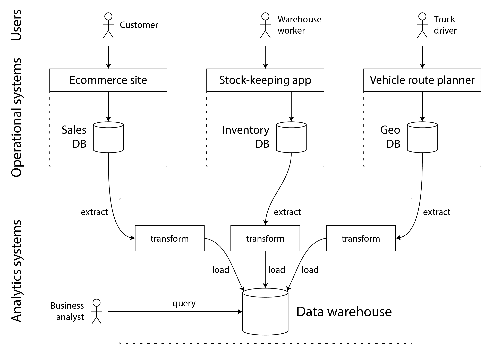
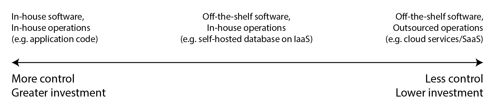

### Chapter 1: Trade-offs in Data Systems Architecture - Summary

This chapter introduces the core challenges of building **data-intensive applications**, where data management, rather than computation, is the primary difficulty. It establishes that there are no perfect solutions, only a series of **trade-offs**. The chapter's goal is to equip engineers with the terminology and mental models needed to evaluate different data systems and architectures.

The chapter explores several fundamental dichotomies:
1.  **Operational vs. Analytical Systems:** It distinguishes between **OLTP** (Online Transaction Processing) systems, which handle real-time user-facing requests (point queries, low-latency writes), and **OLAP** (Online Analytic Processing) systems, which are used for business intelligence and reporting (aggregations over large datasets). This leads to the concept of the **Data Warehouse** and **Data Lake**, populated via **ETL (Extract-Transform-Load)** processes. It also introduces the critical distinction between a **System of Record** (the authoritative source of truth) and **Derived Data Systems** (caches, indexes, materialized views).
2.  **Cloud vs. Self-Hosting:** It examines the trade-offs between using managed cloud services and operating your own software. Cloud services offer elasticity and operational ease but come with risks of vendor lock-in and loss of control. The chapter highlights the architectural shift towards **cloud-native** designs, characterized by the **separation of storage and compute**.
3.  **Distributed vs. Single-Node Systems:** It outlines the reasons for moving to a distributed architecture (scalability, fault tolerance, low latency) while cautioning against its inherent complexities, such as network unreliability and difficulties in troubleshooting. This section touches on modern architectures like **Microservices** and **Serverless**.
4.  **Business Needs vs. Societal Responsibility:** Finally, it addresses the growing importance of legal and ethical considerations in data system design. Regulations like **GDPR** and concepts like **data minimization** are presented not just as legal hurdles but as fundamental design constraints that challenge traditional data storage paradigms.

---

### Key Concepts

#### Data-Intensive Applications
An application is data-intensive if its primary challenges are related to the quantity, complexity, and changing nature of data. These applications are built from standard components:
*   **Databases:** Store data for later retrieval.
*   **Caches:** Remember results of expensive operations to speed up reads.
*   **Search Indexes:** Allow searching and filtering by keyword.
*   **Stream Processing:** Handle events and data changes as they occur.
*   **Batch Processing:** Periodically crunch large amounts of accumulated data.

---

### Operational Versus Analytical Systems

A primary distinction in data systems is between those that serve live user traffic and those used for analysis and reporting.

*   **Operational Systems (OLTP):**
    *   Handle **Online Transaction Processing**.
    *   Serve end-users of applications (web, mobile).
    *   Characterized by **point queries** (looking up a small number of records by key) and frequent, low-latency writes.
    *   Represents the latest state of data.
*   **Analytical Systems (OLAP):**
    *   Handle **Online Analytic Processing**.
    *   Serve internal business analysts and data scientists for decision support.
    *   Characterized by large, complex queries that **aggregate** over a huge number of records.
    *   Represents a history of events over time.

**Table 1-1. Comparing characteristics of operational and analytic systems**

| Property | Operational systems (OLTP) | Analytical systems (OLAP) |
| :--- | :--- | :--- |
| **Main read pattern** | Point queries (fetch individual records by key) | Aggregate over large number of records |
| **Main write pattern** | Create, update, and delete individual records | Bulk import (ETL) or event stream |
| **Human user** | End user of web/mobile application | Internal analyst, for decision support |
| **Machine use example** | Checking if an action is authorized | Detecting fraud/abuse patterns |
| **Type of queries** | Fixed set of queries, predefined by application | Analyst can make arbitrary queries |
| **Data represents** | Latest state of data (current point in time) | History of events that happened over time |
| **Dataset size** | Gigabytes to terabytes | Terabytes to petabytes |

#### Data Warehousing and Data Lakes
To avoid impacting operational systems, analytics are run on a separate database called a **data warehouse**.

*   **ETL (Extract-Transform-Load):** The process of getting data from various OLTP systems into the data warehouse. Data is extracted, transformed into an analysis-friendly schema, and loaded.
    *   **Description**: This diagram provides a simplified outline of the ETL process. Data from multiple OLTP databases and application servers is extracted, transformed into a consistent format, and then loaded into a central data warehouse, which is then used by business analysts for reporting and analysis.
    

*   **Data Lake:** An evolution of the data warehouse, designed to accommodate the needs of data scientists. It's a centralized repository that holds a copy of data in its **raw file format**, without imposing a rigid schema. This flexibility is better for machine learning and complex data transformations. It follows the **sushi principle**: "raw data is better".

#### Systems of Record and Derived Data
This distinction clarifies the flow of data through a complex system.

*   **System of Record (Source of Truth):** Holds the authoritative, canonical version of data. Each fact is typically represented exactly once (**normalized**). If there is a discrepancy, the value in the system of record is considered correct.
*   **Derived Data System:** Data in this system is the result of transforming or processing data from another system. It is redundant but essential for performance. If lost, it can be recreated from the source.
    *   **Examples:** Caches, search indexes, materialized views, and models trained on a dataset.

---

### Cloud Versus Self-Hosting

This section discusses the "build vs. buy" decision for software and infrastructure.

*   **Description**: This diagram shows a spectrum of choices for software development and operations. At one end is fully bespoke software, written and run in-house. At the other end are SaaS products, where both development and operations are handled by a vendor. In the middle lies off-the-shelf software (like open-source databases) that a company chooses to self-host.

#### Pros and Cons of Cloud Services
*   **Pros:**
    *   Can be faster and easier to get started.
    *   Outsources operational expertise.
    *   **Elasticity:** Valuable for variable workloads, allowing resources to scale up and down.
*   **Cons:**
    *   **Lack of control:** Can't add missing features or easily diagnose deep performance issues.
    *   **Vendor Lock-in:** High cost of switching if the service's API is not standard.
    *   **Security & Compliance:** Requires trusting the provider with your data.

#### Cloud-Native System Architecture
This architecture is designed from the ground up to leverage cloud services.
*   **Key Idea:** Build higher-level services upon lower-level cloud primitives (like object storage).
*   **Separation of Storage and Compute:** A core principle where storage (e.g., Amazon S3) and computation (e.g., EC2 instances) are handled by separate, independently scalable services. This contrasts with traditional architectures where the same machine is responsible for both.
*   **Multitenancy:** Data and computation from several different customers are handled on the same shared hardware by the same service. This enables better resource utilization and easier management but requires careful engineering for isolation.

**Table 1-2. Examples of self-hosted and cloud-native database systems**

| Category | Self-hosted systems | Cloud-native systems |
| :--- | :--- | :--- |
| **Operational/OLTP** | MySQL, PostgreSQL, MongoDB | AWS Aurora, Azure SQL DB Hyperscale, Google Cloud Spanner |
| **Analytical/OLAP** | Teradata, ClickHouse, Spark | Snowflake, Google BigQuery, Azure Synapse Analytics |

#### Operations in the Cloud Era
The role of operations (DBA, Sysadmin) has evolved into **DevOps** and **Site Reliability Engineering (SRE)**, with a greater emphasis on automation, enabling frequent updates, and learning from incidents. In the cloud, capacity planning becomes financial planning, and performance optimization becomes cost optimization.

---

### Distributed Versus Single-Node Systems

A system involving several machines (nodes) communicating over a network is a distributed system.

**Reasons to Distribute:**
*   **Fault Tolerance/High Availability:** Redundancy to handle machine failures.
*   **Scalability:** Spread load across multiple machines to handle large data volumes or traffic.
*   **Latency:** Place servers geographically close to users.
*   **Elasticity:** Scale resources up or down to meet variable demand.

**Problems with Distributed Systems:**
*   **Complexity:** Dealing with network failures and timeouts is difficult.
*   **Performance:** A network call is vastly slower than a local function call.
*   **Troubleshooting:** Diagnosing problems is much harder; requires **observability** tools like distributed tracing.
*   **Consistency:** Maintaining data consistency across multiple services becomes the application's responsibility.

> If you can do something on a single machine, this is often much simpler and cheaper compared to setting up a distributed system.

#### Microservices and Serverless
*   **Microservices:** An architecture where a complex application is decomposed into multiple, independent services, each with its own database and managed by a separate team. This **data isolation** avoids tight coupling but prevents sharing databases between services. It's a technical solution to an organizational problem of scaling development teams.
*   **Serverless (FaaS):** An approach where infrastructure management is outsourced to a cloud provider, which automatically allocates and frees resources based on incoming requests. It enables a "pay-for-what-you-use" billing model for code execution.

---

### Data Systems, Law, and Society

Engineers have a responsibility to consider the societal and legal impact of the systems they build, especially those that store personal data.

*   **Privacy Regulation:** Laws like **GDPR** (Europe) and **CCPA** (California) grant users legal rights over their data.
*   **Engineering Challenges:** The "right to be forgotten" is difficult to implement in systems that rely on immutable, append-only data structures.
*   **Data Minimization (`Datensparsamkeit`):** The principle of not collecting or storing data unless it's for a specified, explicit purpose and necessary for that purpose. This runs counter to the "big data" philosophy of storing everything in case it might be useful later. It's a key principle of GDPR.
*   **Risk vs. Value:** The cost of storing data should include the risks of liability, reputational damage from leaks, and legal fines for non-compliance. Sometimes, the safest and most ethical decision is to not store the data at all.
