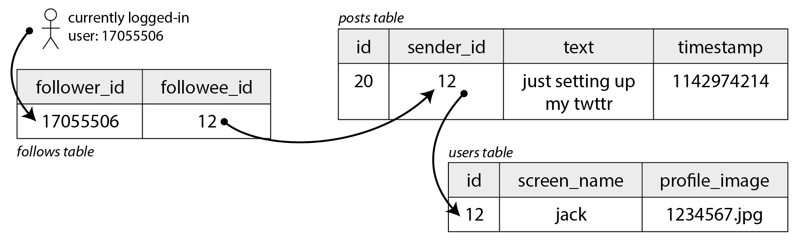
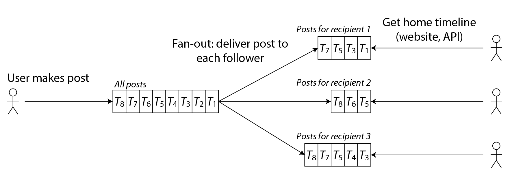
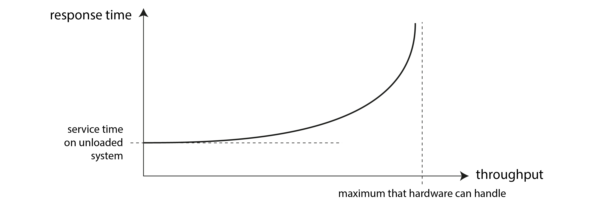
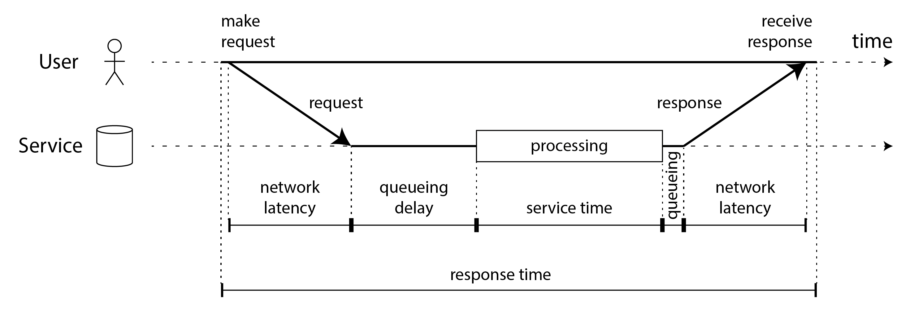

### Chapter 2: Defining Nonfunctional Requirements - Summary

This chapter shifts focus from *functional requirements* (what the system does) to **nonfunctional requirements** (how well the system does it). It asserts that requirements like **reliability**, **scalability**, and **maintainability** are just as critical as features. The chapter uses a case study of a Twitter-like social network to make these abstract concepts concrete, illustrating the challenges of **fan-out** and the trade-offs between **compute-on-write** (materialization) and **compute-on-read**.

It rigorously defines **performance**, distinguishing between **throughput** and **response time**, and explains why **percentiles** (p50, p95, p99) are superior to averages for measuring user experience. The section on **reliability** differentiates between **faults** (component errors) and **failures** (system outages), covering hardware and software faults and the importance of **blameless postmortems**. **Scalability** is framed not as a boolean label but as a system's ability to cope with increased load, contrasting **scaling up** (vertical) with **scaling out** (shared-nothing). Finally, **maintainability** is broken down into **operability**, **simplicity** (managing complexity via abstraction), and **evolvability**.

---

### Functional vs. Nonfunctional Requirements

*   **Functional Requirements:** What the application must do (e.g., "allow a user to post a message").
*   **Nonfunctional Requirements:** Quality attributes of the system (e.g., security, reliability, performance, maintainability, compliance). If these are not met, the application may be useless even if it works functionally.

---

### Case Study: Social Network Home Timelines

To illustrate performance and scalability, consider a Twitter-like system where users post messages and follow others.
*   **Scale:** 500 million posts/day (avg 5,800/sec, peak 150,000/sec).
*   **Graph:** Average user follows 200 people; celebrities have millions.

#### Approach 1: Relational Schema (Pull Model)
Data is stored in standard relational tables: `Users`, `Posts`, and `Follows`.

*   **Description**: This diagram shows a simple relational database schema for a social network. It consists of three tables: `Users` (storing user profiles), `Posts` (storing messages sent by users), and `Follows` (a many-to-many join table linking a follower to a followee).


To generating a home timeline:
```sql
SELECT posts.*, users.* FROM posts
JOIN follows ON posts.sender_id = follows.followee_id
JOIN users
ON posts.sender_id = users.id
WHERE follows.follower_id = current_user
ORDER BY posts.timestamp DESC
LIMIT 1000
```
*   **Problem:** This approach requires looking up recent posts for *every* person a user follows and merging them at read time. With 2 million active users polling, this results in huge database load.

#### Approach 2: Materialized Timelines (Push Model / Fan-out)
Instead of computing the timeline on read, we precompute it on write.
*   **Mechanism:** Each user has a "mailbox" (timeline cache). When a user posts, the system looks up all their followers and inserts the new post ID into each follower's timeline cache.
*   **Fan-out:** One write request (the post) becomes many writes to followers' timelines.
*   **Trade-off:** Fast reads (O(1)) but expensive writes. A celebrity with 100 million followers causes a massive write spike ("fan-out").

*   **Description**: This diagram illustrates the "fan-out" process. When a User posts a message, the Load Balancer sends it to a Web Server, which then inserts the post into the sender's timeline. Crucially, it also looks up the user's followers and pushes the new post into the Home Timeline Cache of *every* follower (User 2, User 3, etc.), pre-computing their view.


*   **Hybrid Solution:** Most users use the push model. For celebrities (users with huge follower counts), the system falls back to the pull model (merging their posts in at read time) to avoid the massive write penalty.

---

### Describing Performance

#### Throughput vs. Response Time
*   **Throughput:** Requests per second (RPS) or data volume per second.
*   **Response Time:** The time between a client sending a request and receiving the full response.

*   **Description**: This graph shows the relationship between throughput and response time. As the system load (throughput) increases towards its maximum capacity, the response time stays relatively flat initially but then shoots up exponentially due to queueing effects once the system becomes saturated.


> **Metastable Failure:** An overloaded system can get stuck in a degraded state even after load decreases, often due to retry storms. Strategies to avoid this include **exponential backoff**, **circuit breakers**, **load shedding**, and **backpressure**.

#### Latency vs. Response Time
*   **Latency:** The time a request is waiting to be handled (latent).
*   **Response Time:** The client's view: Service Time + Network Latency + Queueing Delays.

*   **Description**: This timeline diagram distinguishes between different time metrics. "Response time" is the total duration seen by the client. It is composed of "Network latency" (travel time), "Queueing delay" (waiting to be processed), and "Service time" (actual processing).


#### Percentiles (p50, p95, p99)
Averages (means) are often misleading because they hide outliers. **Percentiles** are better:
*   **Median (p50):** Half of users experience a faster time, half slower. Good for "typical" experience.
*   **p95, p99, p999 (Tail Latencies):** The threshold that 95%, 99%, or 99.9% of requests are faster than. These outliers are critical because they often represent the most data-heavy (and profitable) users.

*   **Description**: This bar chart visualizes a distribution of response times. While the "mean" (average) is shown, the chart highlights the "median" (p50) where 50% of requests are faster, and the "95th percentile" (p95) which captures the slower tail of requests.


*   **Tail Latency Amplification:** If a user request requires calling multiple backend services, the chance of the whole request being slow increases dramatically, as it is limited by the *slowest* backend call.

*   **Description**: This diagram shows a single end-user request triggering multiple parallel calls to backend services. Even if most backend calls are fast, one slow call (the bottom one) delays the entire response to the user, illustrating tail latency amplification.


---

### Reliability and Fault Tolerance

Reliability means "continuing to work correctly, even when things go wrong."

*   **Fault:** A component stops working (e.g., a disk crash).
*   **Failure:** The system as a whole stops providing service to the user.
*   **Fault Tolerance:** The ability to prevent faults from becoming failures.

*   **Single Point of Failure (SPOF):** A component that, if faulty, escalates to cause the failure of the entire system.
*   **Fault Injection:** Deliberately triggering faults (e.g., killing processes) to ensure the system can tolerate them.
*   **Chaos Engineering:** A discipline of experimenting on a system to build confidence in its capability to withstand turbulent conditions (like fault injection).

#### Types of Faults
1.  **Hardware Faults:** Hard disks crashing, RAM errors, power outages. Usually handled by **redundancy** (RAID, dual power supplies, multiple data centers).
2.  **Software Faults:** Bugs, cascading failures, leap second bugs. These are often **correlated** (all nodes fail at once) and harder to prevent. Solutions include process isolation, crashing and restarting, and monitoring.
3.  **Human Errors:** Configuration mistakes are the leading cause of outages. Mitigated by testing, rollbacks, and clear interfaces.

> **Blameless Postmortems:** A culture where incidents are investigated to understand the *systemic* causes rather than blaming individuals. This leads to better long-term reliability.

---

### Scalability

Scalability is not a label ("X is scalable") but a question: "If load increases, how do we cope?"

*   **Describing Load:** Identify the **load parameter** (e.g., writes/sec, concurrent users, cache hit rate).
*   **Scaling Up (Vertical):** Moving to a more powerful machine. Also known as **Shared-Memory Architecture** because multiple threads/processes share the same RAM. Simple but expensive and has hard limits.
*   **Shared-Disk Architecture:** Using multiple machines with independent CPUs/RAM but sharing an array of disks (NAS/SAN) via a fast network.
*   **Scaling Out (Horizontal/Shared-Nothing):** Distributing load across many smaller machines (nodes), each with its own CPU, RAM, and disk. Cheaper and theoretically limitless but adds complexity (distributed systems issues).
*   **Autoscaling:** Automatically adding or removing computing resources in response to changing demand. Useful for unpredictable load but can introduce operational surprises.

> **Magic Scaling Sauce:** There is no generic scalable architecture. A system designed for 100k small requests/sec is different from one designed for 3 massive requests/min. Architecture must evolve with load (usually every 10x growth).

---

### Maintainability

The majority of software cost is in maintenance, not initial development.

1.  **Operability:** Making it easy for operations teams to keep the system running (good monitoring, automation, documentation).
2.  **Simplicity:** Managing complexity.
    *   **Abstraction:** The key tool for hiding implementation details (like SQL hides disk management).
    *   Avoid **accidental complexity** (complexity arising from tools/implementation rather than the problem itself).
3.  **Evolvability:** Making it easy to change the system in the future.

