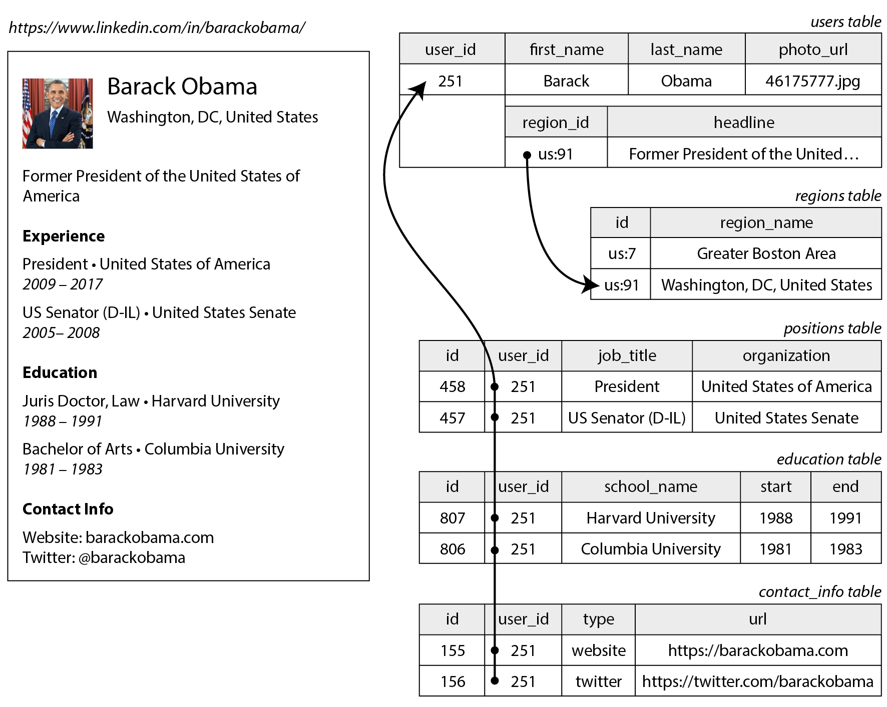
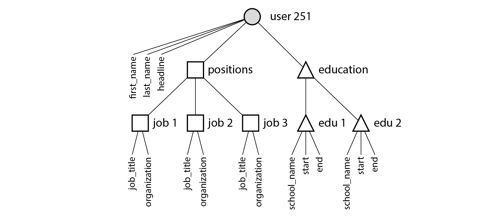
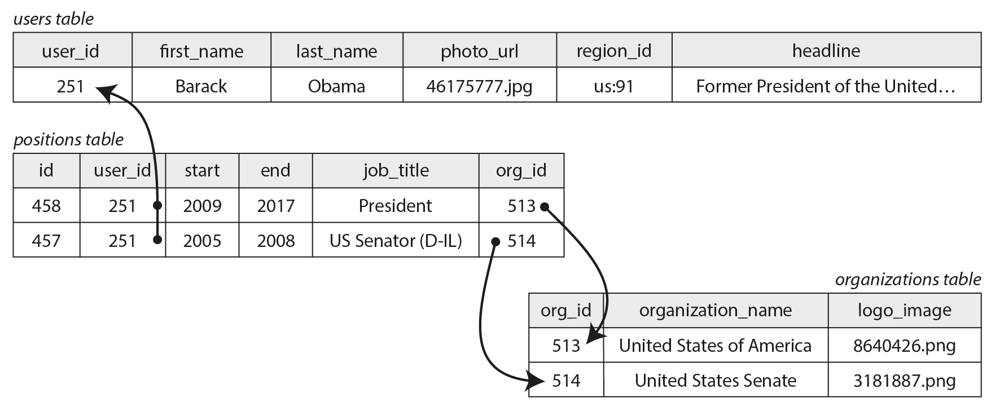
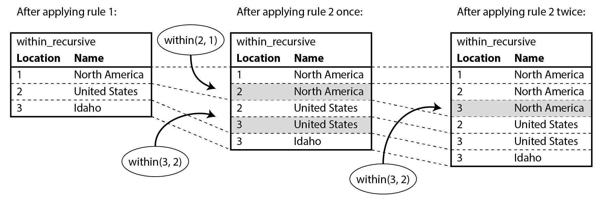
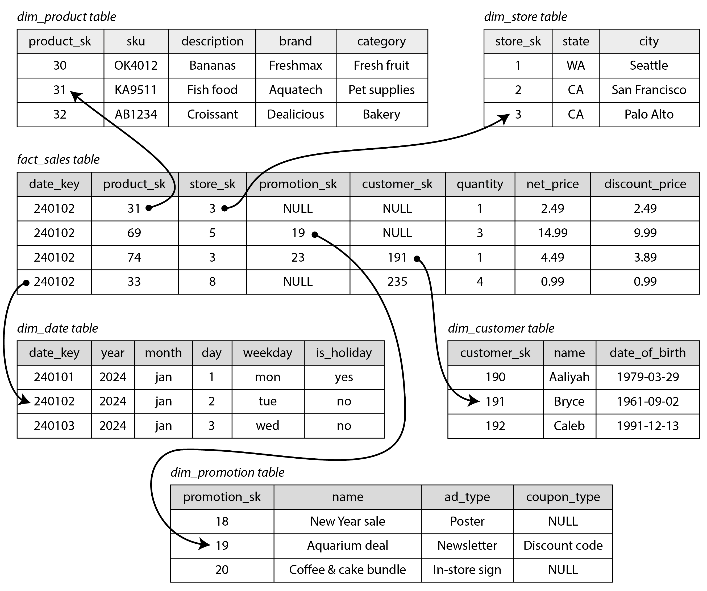
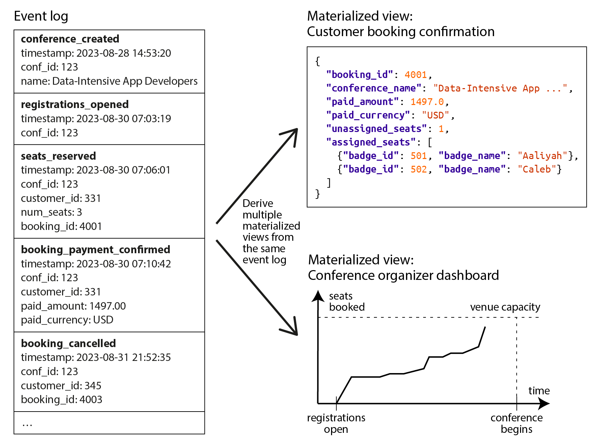
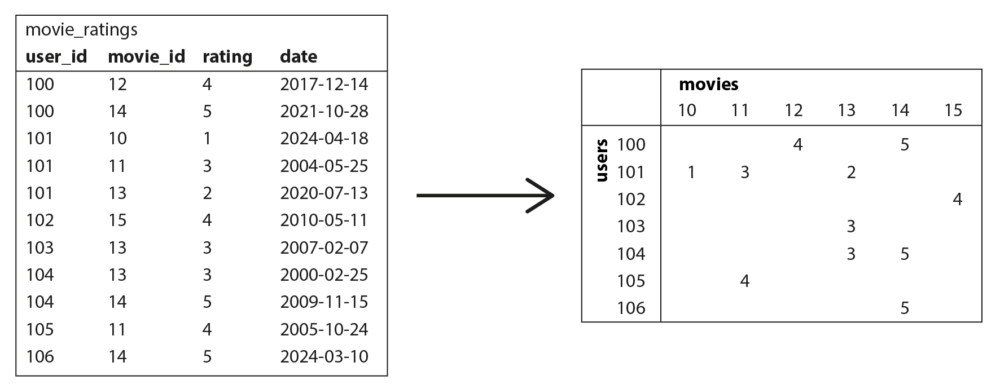

### Chapter 3: Data Models and Query Languages - Summary

This chapter explores how data models shape not only software development but also how we think about problems. It emphasizes that applications are built by layering data models (e.g., application objects -> database model -> byte storage). The chapter compares the **Relational Model** (SQL) with the **Document Model** (NoSQL/JSON) and **Graph Models** (Property Graphs, Triple-Stores), analyzing their trade-offs in terms of schema flexibility, query locality, and relationship handling.

It also introduces **declarative query languages** (like SQL and Cypher), which hide implementation details and allow for database optimization, contrasting them with imperative code. The chapter touches on **Event Sourcing** and **CQRS** as alternative ways to model data changes, and briefly discusses analytical models like **DataFrames** for scientific computing.

---

### Relational Model vs. Document Model

*   **Relational Model (SQL):** Data is organized into relations (tables) of tuples (rows). Dominant since the 1980s. Best for highly structured data with regular schemas.
*   **Document Model (NoSQL):**
    *   **Best Use Case:** Data with a document-like structure (tree of one-to-many relationships) where the **entire tree is loaded at once**.
    *   **Pros:** Better **locality** (fetch entire profile in one query), conceptually simpler for tree structures. Supports item **ordering** natively via arrays (e.g., reorderable to-do lists), whereas relational DBs require complex workarounds like renumbering or fractional indexing.
    *   **Cons:** Harder to refer to nested items directly (must say "2nd item in list" vs. direct ID). If you need to access nested items individually, relational is often better.

#### Data Locality
*   **Document Model:** Documents are stored as a single continuous string (JSON, XML, BSON).
    *   **Advantage:** If you need the *entire* document (e.g., to render a profile page), it requires only one disk seek. Splitting data across relational tables requires multiple index lookups/seeks.
    *   **Disadvantage:** The database must load the *entire* document even to access a small field. This is wasteful for large documents. Updates usually require rewriting the entire document.
    *   **Recommendation:** Keep documents fairly small and avoid frequent small updates.
*   **Relational Model:** Can also achieve locality.
    *   **Google Spanner:** Allows rows to be **interleaved** (nested) within a parent table.
    *   **Oracle:** Uses **multi-table index cluster tables** to store related rows from different tables together.
    *   **Column Families:** (Bigtable, HBase) also group related data for locality.

#### Schema Flexibility: Schema-on-Read vs. Schema-on-Write
*   **"Schemaless" is Misleading:** Document databases are often called schemaless, but there is usually an implicit schema assumed by the application code.
*   **Schema-on-Read (Document):** The structure is interpreted only when data is read (like dynamic typing).
    *   **Pros:** Great for heterogeneous data (where items have different structures) or when data structure is determined by external systems. Easy to evolve: just write new fields; handle old documents in code.
    *   **Use Case:** Ideal when there are many different types of objects, and it is not practicable to put each type of object in its own table, or when the data structure is determined by external systems over which you have no control.
    *   **Cons:** Application code becomes more complex to handle multiple versions of data.
    *   **Migration Example:** To split `name` into `first_name` and `last_name`:
        ```javascript
        if (user && user.name && !user.first_name) {
            // Handle old documents on read
            user.first_name = user.name.split(" ")[0];
        }
        ```
*   **Schema-on-Write (Relational):** The schema is explicit and enforced by the database (like static typing).
    *   **Pros:** Documents and enforces structure, ensuring all data conforms.
    *   **Cons:** Schema changes (migrations) can be slow and operationally challenging on large tables. Better use `DEFAULT` SQL keyowrd with some default valuw
    *   **Migration Example:** Requires an explicit migration.
        ```sql
        ALTER TABLE users ADD COLUMN first_name text DEFAULT NULL;
        UPDATE users SET first_name = split_part(name, ' ', 1); -- Slow on large tables!
        ```

#### The Object-Relational Mismatch
*   **Impedance Mismatch:** The friction between object-oriented code and relational tables.
*   **Shredding:** The relational technique of splitting a document-like structure into multiple tables (e.g., `positions`, `education`). This can lead to cumbersome schemas and complex application code.
*   **ORMs (Object-Relational Mapping):** Frameworks like Hibernate reduce boilerplate but can't fully hide the mismatch. They often lead to inefficient queries (e.g., the **N+1 query problem**).

#### One-to-Many Relationships
Consider a LinkedIn profile. A user has *many* jobs, *many* schools, etc.

**Relational Approach:**
*   **Description**: This diagram shows a relational schema for a LinkedIn profile. It normalizes data by separating `users`, `positions`, `education`, and `contact_info` into distinct tables. Foreign keys (like `user_id`) link the tables together.


**Document Approach (JSON):**
*   Stores the entire profile as a single JSON document.
*   **Pros:** Better **locality** (fetch entire profile in one query), conceptually simpler for tree structures.
*   **Cons:** Harder to refer to nested items directly.

*   **Description**: This diagram illustrates how one-to-many relationships naturally form a tree structure. The root "User" branches out into multiple "Positions", "Education" history, and "Contact Info" nodes, matching the structure of a JSON document.


#### Many-to-One and Many-to-Many Relationships
*   **One-to-Many:** one résumé has several positions, but each position belongs only to one résumé
*   **Many-to-One:** many people live in the same region, but we assume that each person lives in only one region at any one time
*   **Many-to-Many:** A person can work at many companies; a company has many employees.

**Relational Approach:** Uses a join table (associative table).
*   **Normalized Representation:** The relationship is stored in only one place (the join table).
*   **Indexing:** To query efficiently in both directions (e.g., "find all employees of Company X" AND "find all companies Employee Y worked for"), **secondary indexes** are created on both the `user_id` and `org_id` columns of the `positions` table.

*   **Description**: This diagram shows a many-to-many relationship in a relational database. A `positions` table acts as a join table, linking `users` to `organizations` via foreign keys (`user_id`, `org_id`).


**Document Approach:** References other documents by ID (similar to foreign keys). The application must run multiple queries to "join" them.
*   **Indexing in Documents:** In the document model (like the JSON example below), the database needs to index the `org_id` field inside the `positions` array. Most modern document databases (and relational DBs with JSON support) can create indexes on values nested inside documents or arrays.

*   **Description**: This diagram shows how the document model handles many-to-many relationships. The main document contains the user's details, but for organizations and schools, it stores references (IDs) to separate organization/school documents, rather than embedding the full data.


```json
{
    "user_id": 251,
    "first_name": "Barack",
    "last_name": "Obama",
    "positions": [
        {"start": 2009, "end": 2017, "job_title": "President", "org_id": 513},
        {"start": 2005, "end": 2008, "job_title": "US Senator (D-IL)", "org_id": 514}
    ],
    ...
}
```
So entries in `positions` field may be duplicated across `organization` and `user` documents. It may lead to incosisteny. 

#### Normalization vs. Denormalization
*   **Normalization (IDs):** Storing `region_id` (e.g., `us:91`) instead of the plain string "Washington, DC".
    *   **Benefits:**
        *   **Consistent Style:** Eliminates spelling variations.
        *   **Avoids Ambiguity:** Distinguishes between cities with the same name.
        *   **Ease of Updating:** If a name changes, you only update one record in the `regions` table, not millions of user profiles.
        *   **Localization:** The ID can be translated into the user's language at runtime.
        *   **Better Search:** Hierarchical data (Washington is in the USA) can be encoded in the region table.
    *   **Cons:** Requires **joins** to resolve IDs into names, which can be slower for reads.
*   **Denormalization (Strings):** Storing "Washington, DC" directly in the user record.
    *   **Pros:** Faster reads (no joins required). Better **data locality** (all info is in one document).
    *   **Cons:** Harder to update (must update every record), potential for data inconsistency and duplication

*   **Hydrating IDs:** In large-scale systems (like Twitter's timeline), joins can be too expensive. Instead, the application fetches a list of IDs (only IDs e.g., Post IDs) and then "hydrates" them by fetching the content in parallel from a separate cache or service. This effectively moves the join from the database to the application layer.
    *   **Example Query:** Fetching only IDs for a timeline.
        ```sql
        SELECT posts.id, posts.sender_id FROM posts
        JOIN follows ON posts.sender_id = follows.followee_id
        WHERE follows.follower_id = current_user
        ORDER BY posts.timestamp DESC LIMIT 1000
        ```
    *   The application then looks up the full post content (from posts table) and user profiles (user table) for these IDs in a second step.

> **Rule of Thumb:** Normalized data is faster to write (one copy). Denormalized data is faster to read (no joins). Document databases are good for 1-to-many. Relational databases are better for many-to-many.

---

### Query Languages for Data

*   **Declarative (SQL):** You specify *what* you want (e.g., "users named 'Alice' sorted by age"), not *how* to get it. The database optimizer decides the best algorithm (indexes, join methods).
*   **Imperative (Code):** You specify the exact steps (loops, variables). Harder to optimize and parallelize.

**MapReduce** (used in MongoDB) is a hybrid: a declarative framework that accepts imperative code snippets (JavaScript functions).

---

### Graph-Like Data Models

If your data is highly interconnected (many-to-many relationships are the norm), a **Graph Model** is best. Graphs are good for evolvability: as you add features to your application, a graph can easily be extended to accommodate changes in your application’s data structures.
*   **Examples:** Social graphs, fraud detection, road networks.
*   **Components:** Vertices (nodes/entities) and Edges (relationships/arcs).

*   **Description**: This is an example graph dataset showing two people, "Lucy" and "Alain", and various locations. Vertices represent people and places (e.g., "Idaho", "United States"). Edges represent relationships like "BORN_IN", "LIVES_IN", "MARRIED_TO", and "WITHIN".


#### Property Graphs (e.g., Neo4j, Cypher)
*   Vertices and edges both have properties (key-value pairs).
*   **Cypher Query Language:** Uses ASCII art to represent patterns.
    ```cypher
    (person) -[:BORN_IN]-> () -[:WITHIN*0..]-> (us:Location {name:'United States'})
    ```

#### Triple-Stores (e.g., SPARQL, RDF)
*   **Data Model:** All information is stored as simple three-part statements: `(Subject, Predicate, Object)`.
    *   **Subject:** Equivalent to a vertex in a graph.
    *   **Object:** Can be a primitive value (string, number) or another vertex.
    *   **Predicate:** If the object is a primitive, the predicate is like a property key (e.g., `(lucy, age, 33)`). If the object is a vertex, the predicate is like an edge (e.g., `(lucy, marriedTo, alain)`).
*   **Turtle Format:** A concise format for RDF data. Allows grouping multiple predicates for the same subject using semicolons.
    ```turtle
    @prefix : <urn:example:>.
    _:lucy a :Person; :name "Lucy"; :bornIn _:idaho.
    ```
*   **RDF (Resource Description Framework):** Uses URIs (e.g., `http://my-company.com/namespace#within`) for subjects, predicates, and objects to avoid naming conflicts when combining data from different sources.
*   **SPARQL:** Standard query language for RDF data (Semantic Web).
    *   **Example Query:** Find people who moved from the US to Europe.
        ```sparql
        PREFIX : <urn:example:>
        SELECT ?personName WHERE {
          ?person :name ?personName.
          ?person :bornIn / :within* / :name "United States".
          ?person :livesIn / :within* / :name "Europe".
        }
        ```

#### Datalog
*   An older, logic-based language (subset of Prolog).
*   **Data Model:** Built on facts (like rows in a relational table). E.g., `location(2, "United States", "country").`
*   **Rules:** Queries are built by defining rules that derive new facts (virtual tables) from existing ones. Great for complex recursive queries.
*   **Example:** Recursively finding locations within North America.
    ```prolog
        location(1, "North America", "continent").
        location(2, "United States", "country").
        location(3, "Idaho", "state").
        within(2, 1)./* US is in North America */
        within(3, 2)./* Idaho is in the US
        */
        person(100, "Lucy").
        born_in(100, 3). /* Lucy was born in Idaho */
    ```
    ```prolog
    within_recursive(LocID, PlaceName) :- location(LocID, PlaceName, _). /* Rule 1 */
    within_recursive(LocID, PlaceName) :- within(LocID, ViaID), /* Rule 2 */
                                          within_recursive(ViaID, PlaceName).
    migrated(PName, BornIn, LivingIn) :- person(PersonID, PName),
                                         born_in(PersonID, BornID), /* Rule 3 */
                                         within_recursive(BornID, BornIn),
                                         lives_in(PersonID, LivingID),
                                         within_recursive(LivingID, LivingIn).
    us_to_europe(Person) :- migrated(Person, "United States", "Europe"). /* Rule 4 */
    /* us_to_europe contains the row "Lucy". */
    ```
    *   **Explanation:** Rule 1 says "If a location exists, it is within itself." Rule 2 says "If location A is within B, and B is within C, then A is within C." By applying these rules repeatedly, the database can traverse the entire hierarchy.

*   **Description**: This diagram illustrates how Datalog rules derive new facts. Rule 1 infers `within_recursive(1, "North America")`. Rule 2 combines `within(2,1)` with the previous fact to infer `within_recursive(2, "North America")` (US is in North America). This recursion continues to infer that Idaho is also in North America.


---

### Data Warehousing (Analytics) Schemas

Analytics databases use different schemas than operational (OLTP) ones.

*   **Star Schema:** A central **Fact Table** (events, e.g., sales) references many **Dimension Tables** (who, what, where).
    *   **Description**: This diagram shows a classic Star Schema. The central `fact_sales` table contains metrics (quantity, price) and foreign keys. Surrounding it are dimension tables: `dim_date`, `dim_product`, `dim_store`, `dim_customer`, and `dim_promotion`.
    

*   **Snowflake Schema:** Dimensions are normalized into sub-dimensions (e.g., Product -> Brand -> Manufacturer). Each dimensions is split into several subdomains. Harder for analysts to use.
*   **One Big Table (OBT):** A completely denormalized schema where dimension tables are removed entirely, and all attributes are stored directly in the fact table (essentially pre-computing the joins). While this uses more storage, it can sometimes enable faster queries by avoiding joins altogether.

---

### Other Data Models

#### Event Sourcing
*   **Definition:** Using an **append-only log** of immutable events as the primary **source of truth**. Every state change is recorded as an event (named in the past tense, e.g., `seatsBooked`).
*   **CQRS (Command Query Responsibility Segregation):** Separates the write model (event log) from the read model (materialized views). The read models are derived from the event log.
*   **Pros:**
    *   **Intent:** Events capture *why* something happened (e.g., "booking cancelled" vs. just a deleted row).
    *   **Reproducibility:** You can delete and rebuild materialized views from the log to fix bugs or change logic.
    *   **Flexibility:** Multiple read views can be optimized for different queries. New features can process the old event history.
    *   **Auditability:** The log serves as a perfect audit trail.
    *   **Performance:** High write throughput due to sequential appending.
    *   **Reversibility:** Errors are fixed by appending a correction event, rather than destructively updating data.
*   **Cons:**
    *   **External Info:** Processing must be deterministic. If an event relies on external data (e.g., exchange rates), that data must be stored with the event or queried historically.
    *   **Deletion (GDPR):** Immutability makes "right to be forgotten" hard. Solutions include deleting the user's specific log or **crypto-shredding** (encrypting data and deleting the key).
    *   **Side Effects:** Reprocessing events shouldn't trigger external actions (like sending emails) again.
    *   **Ordering:** The system must guarantee that views process events in the exact order they appear in the log.

*   **Description**: This diagram shows the Event Sourcing pattern. User requests are validated and written as immutable "Events" to an "Event Log". This log is the source of truth. "Materialized Views" (like a Booking Status or Dashboard) are derived by processing the event log.


#### DataFrames (Matrix/Array)
*   Used in scientific computing and machine learning (e.g., Python Pandas, R).
*   Transforms relational data into matrices for linear algebra operations.

*   **Description**: This diagram demonstrates transforming data for machine learning. On the left is a relational table of movie ratings (User, Movie Title, Rating). On the right, this is pivoted into a sparse matrix where rows are Users, columns are Movies, and cells contain the ratings.


---

### Summary of Query Languages

1.  **SQL:** The standard for relational and analytical data. Powerful but awkward for graph traversal.
2.  **Cypher:** Specialized for property graphs. Concise for variable-length path traversal.
3.  **SPARQL:** Specialized for RDF triple-stores.
4.  **GraphQL:** Designed for client-side data fetching. Returns JSON matching the query structure. Not a database query language per se, but an API layer.
    *   **Use when:** You have a complex UI that needs to fetch specific nested data structures efficiently (avoids over-fetching). Great for decoupling frontend from backend.
    *   **Avoid when:** You need to perform complex analytical queries, recursive searches, or arbitrary filtering (unless explicitly implemented). It can be harder to optimize and secure against expensive queries than REST.
5.  **Datalog:** Powerful logic language for recursive queries.

