### Chapter 4: Storage and Retrieval - Summary

This chapter explores how databases handle storage and retrieval internally. A database essentially needs to do two things: store data when you give it, and return the data when you ask for it.

The chapter differentiates between **transactional workloads (OLTP)** and **analytical workloads (OLAP)**, and examines two families of storage engines for OLTP: log-structured storage (immutable data files) and update-in-place storage (like B-trees).

---

### Storage and Indexing for OLTP

#### The Simplest Database
Consider a simple key-value store implemented with two Bash functions:
*   `db_set`: Appends a key-value pair to a text file (like CSV).
*   `db_get`: Scans the file and returns the most recent value for a key.

**Performance Characteristics:**
*   **Writes:** Very efficient. Appending to a file (a log) is the simplest and fastest possible write operation. Many real databases use append-only logs internally.
*   **Reads:** Terrible performance for a large number of records. Needs to scan the entire file (O(n) cost).

#### Indexes
To efficiently find the value for a specific key, we need an **index**. An index is an additional data structure derived from the primary data, structured in a way (e.g., sorted) that makes locating data faster.

**The Crucial Trade-off:**
*   Well-chosen indexes speed up read queries.
*   Every index consumes additional disk space.
*   Indexes slow down writes, because the index must be updated every time data is written.
*   Databases generally require manual index selection based on the application's query patterns.

---

### Log-Structured Storage

One way to speed up reads on an append-only log is to keep an **in-memory hash map** where every key is mapped to the byte offset in the file where the most recent value is located. This requires zero disk I/O if the offset is already in the filesystem cache.

*   **Description**: This diagram illustrates a log of key-value pairs stored in an append-only file, indexed by an in-memory hash map that points to the byte offset of each key. 
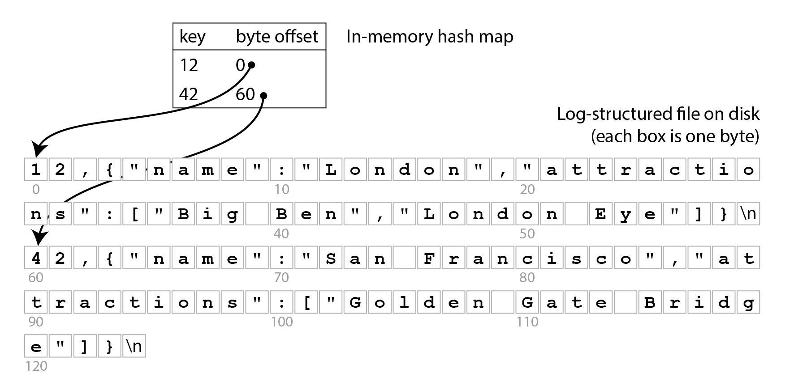

**Limitations of the Hash Map Approach:**
*   **Memory Bound:** Entire hash table must fit in memory. On-disk hash maps perform poorly (random access I/O, expensive to grow).
*   **Range Queries:** Not efficient (e.g., cannot easily scan keys between `10000` and `19999`).
*   **Rebuilding:** Hash map is not persisted and must be rebuilt on restart.
*   **Disk Space:** Old overwritten log entries take up space without periodic compaction.

#### SSTables (Sorted String Tables)
Instead of relying purely on hash tables, a common optimization is to require the sequence of key-value pairs to be **sorted by key** and ensure each key only appears once. This format is called a **Sorted String Table (SSTable)**.

*   **Description**: This diagram depicts an SSTable containing compressed blocks of key-value pairs sorted by key. A sparse in-memory index stores offsets for the first key of each block, allowing queries to quickly jump to the right block without keeping every key in memory.
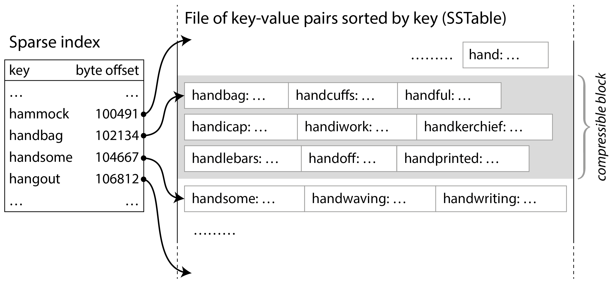

**Advantages of SSTables:**
1.  **Sparse Index:** You do not need to keep all keys in memory. You can group records into blocks and keep an index to the start of each block.
2.  **Fast Lookups:** If you look for `handiwork`, and know it sits between `handbag` and `handsome` (which are in the sparse index), you can just jump to `handbag`'s offset and scan a small block.
3.  **Compression:** Blocks of records can be compressed before writing to disk, saving space and reducing I/O bandwidth usage.

#### Constructing and Merging SSTables (LSM-Trees)
While SSTables are great for reading, appending directly to a sorted file is impossible if keys are written in random order. Rewriting the whole file for every insertion is far too expensive.

The solution is a log-structured approach (a hybrid between append-only logs and sorted files), forming the basis of **LSM-Trees (Log-Structured Merge-Trees)**:

1. **Memtable (In-Memory Tree):** When a write comes in, it is added to an in-memory balanced tree structure (like a red-black tree, skip list, or trie). This keeps the incoming keys sorted. This structure is called a **memtable**.
2. **Writing to Disk (SSTable Segment):** When the memtable reaches a size threshold (e.g., a few megabytes), it is written to disk as a new SSTable file. This becomes the most recent segment. While it's writing to disk, new writes go to a new active memtable instance.
3. **Reading:** To find a key, first check the active memtable. If not found, check the most recent on-disk SSTable segment, then the next-older segment, and so on until the oldest segment is reached.
4. **Compaction and Merging:** Periodically, a background process merges segment files and discards overwritten or deleted values (using an algorithm similar to *mergesort*).

*   **Description:** This figure shows the merging of several SSTable segments in the background. The process looks at the first key in each input file, copies the lowest key to the output, and if the same key appears multiple times, it keeps only the most recent value.
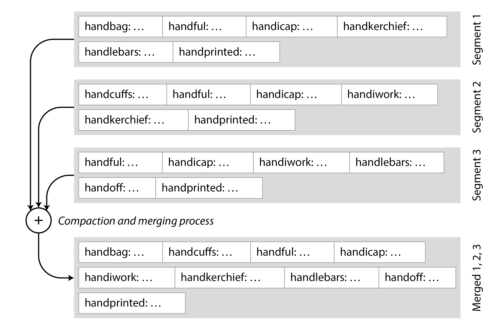

**Handling Deletions and Crashes:**
*   **Tombstones:** To delete a key, a special deletion marker called a **tombstone** is appended. During the merge/compaction process, the tombstone instructs the database to discard any earlier values for that key.
*   **Write-Ahead Log (WAL):** To prevent data loss if the database crashes before the memtable is flushed to disk, every write is also immediately appended to an unsorted log file. This unsorted log's only purpose is to restore the memtable after a crash. Once the memtable is written as an SSTable, the corresponding section of this unsorted log can be discarded.

**Performance and Design Advantages of Immutable Segments:**
*   **Write-Optimized:** Segment files are written in a single sequential pass, which is significantly faster than random write I/O.
*   **Immutability:** Once written, SSTables are never modified. This greatly simplifies concurrency and crash recovery (if a crash happens during merging, just delete the unfinished output file; no data corruption).
*   **Background Maintenance:** Merging and compaction happen in the background without blocking ongoing reads and writes.

Storage engines based on this principle of merging and compacting sorted files are known as **LSM storage engines**. This architecture powers databases like RocksDB, Cassandra, Scylla, and HBase.

#### Bloom Filters for Fast Rejections
A problem with LSM-trees is that looking up a key that does not exist can be slow, because the database must check the memtable and every single SSTable segment all the way back to the oldest one.

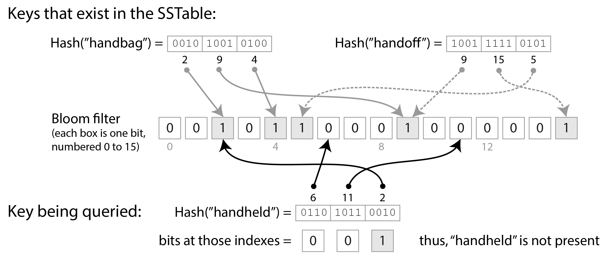

To optimize this, LSM storage engines include a **Bloom filter**, a space-efficient probabilistic data structure used to check if an element is in a set.
*   **How it Works:** It uses a bit array and multiple hash functions. If you want to check if a key is present, you hash it. If any of the bits corresponding to those hashes are `0`, the key is **definitely not in the SSTable** (true negative). If all bits are `1`, the key is **probably in the SSTable** (possible false positive), so the database will go and read the block.
*   **Result:** It saves many unnecessary disk reads for non-existent keys.

#### Compaction Strategies
Compaction is necessary to clean up deleted/overwritten data and keep the number of SSTables low. There are two common strategies:

1.  **Size-tiered Compaction (e.g., Cassandra default):** Newer and smaller SSTables are merged into older and larger ones. Great for **write-heavy workloads** but can require a lot of temporary disk space for merges and slower for reads (must check more SSTables).
2.  **Leveled Compaction (e.g., RocksDB, LevelDB):** SSTables are organized into "levels" (L0, L1, L2...). Each level is exponentially larger than the previous and contains non-overlapping keyed SSTables (except L0). When a level fills up, files are merged into the next level. This is much better for **read-heavy workloads** and more predictable disk space usage.

---

### Embedded Storage Engines
Many databases are run as separate server processes accessed over a network. However, **embedded databases** are built as a library that runs in the same process as your application code. They access the local disk directly via regular function calls.
*   **Examples:** SQLite, RocksDB, LMDB, DuckDB.
*   **Use Cases:** Local mobile app storage, web browsers, edge devices, or multi-tenant backends where each tenant gets its own isolated embedded DB instance.

---

### B-Trees
While log-structured indexes (LSM-trees) are popular, the **B-tree** remains the most widely used index structure and is the standard for almost all relational databases.

Like SSTables, B-trees keep key-value pairs sorted by key. However, their design philosophy is completely different:
*   **Log-structured (LSM-tree):** Breaks the database into variable-size segments that are written sequentially and are strictly immutable.
*   **Update-in-place (B-tree):** Breaks the database into **fixed-size blocks or pages** (traditionally 4 KiB, though often 8 KiB or 16 KiB now) and reads/writes one page at a time. It updates pages by overwriting them *in-place*.

#### How B-Trees Work
Pages can be identified by a page number, which acts like a pointer on disk. These pointers are used to construct a tree of pages.

*   **Lookups:** You start at the **root page**, which contains keys and references to child pages. You scan the keys to find the boundaries that encompass the key you are looking for, and follow the reference down to the next level. This continues until you reach a **leaf page**, which contains either the inline value or a reference to where the value is stored.

*   **Description:** This figure shows how a B-tree lookup works. Starting from the root, we follow the pointer to the range 200–300, then the pointer for the range 250–270, eventually reaching the leaf node for key 251.
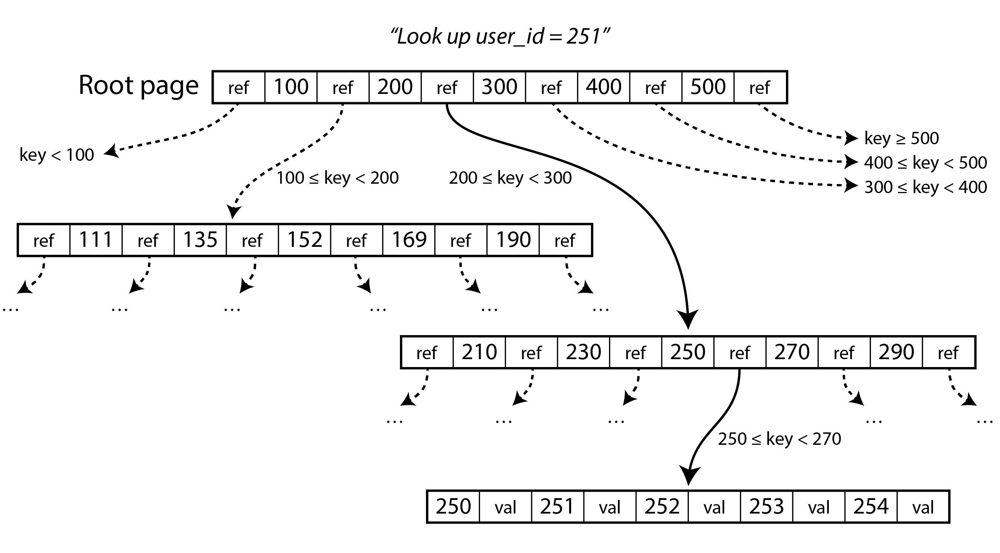

*   **Branching Factor:** The number of references to child pages in one page is called the branching factor. It is typically several hundred, allowing a B-tree to be very shallow (usually 3-4 levels deep even for huge datasets). $O(\log n)$ depth keeps lookups fast.
*   **Inserts and Splits:** To insert a new key, you find the leaf page whose range encompasses the key. If the page doesn't have enough free space, it is **split** into two half-full pages, and the parent page is updated to point to both new children.

*   **Description:** This figure shows what happens when a B-tree page gets full. To insert key 334, the page covering the range 333–345 is split into two, and the parent page is updated to add the new boundary key (337).
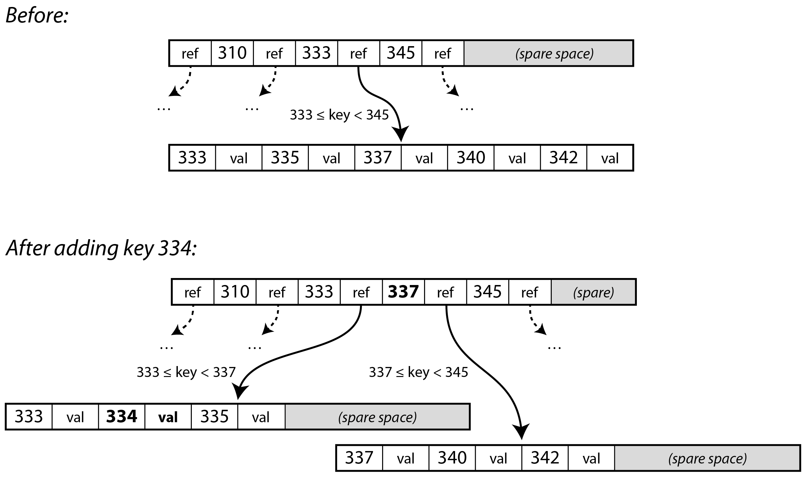

#### Making B-Trees Reliable (Crash Recovery)
B-trees overwrite pages in-place, which is dangerous: what if the database crashes halfway through writing a split page? It would result in corrupted pointers and orphan pages.

To ensure resilience, B-tree implementations use a **Write-Ahead Log (WAL)** (sometimes called a *redo log* or *journal* in filesystems).
1.  **WAL First:** The WAL is an append-only file. Any modification to the tree must be written and flushed to the WAL *before* the actual tree pages are modified.
2.  **Recovery:** If the database crashes, the WAL is read to restore the B-tree to a consistent state.

#### B-tree Optimizations and Variants
Decades of optimization have produced many variants:
1.  **Copy-on-Write (LMDB):** Instead of overwriting pages and using a WAL, modified pages are written to a *new* location, and new parent pages are created to point to them (useful for concurrency).
2.  **Key Abbreviation:** Not storing entire keys, especially in interior pages, just enough to act as boundaries. This compresses pages and increases the branching factor.
3.  **Leaf Page Layout:** Trying to lay out the tree so that leaf pages appear sequentially on disk, optimizing large scan queries (hard to maintain as the tree grows).
4.  **Sibling Pointers:** Adding pointers to sibling pages (left and right) in leaf nodes, allowing sequential range scans without jumping back up to the parent page (sometimes called a B+ Tree).

---

### Comparing B-Trees and LSM-Trees
As a general rule of thumb: **LSM-trees are typically faster for writes, whereas B-trees are thought to be faster for reads.** However, this depends heavily on the specific workload. 

#### 1. Read Performance and Range Queries
*   **B-Trees (Reads):** Generally faster and have more predictable latency. You typically only need to follow a few pointers to read a single page at each level.
*   **LSM-Trees (Reads):** Can be slower because the engine must check the memtable and potentially several SSTable segments at different stages of compaction. (Bloom filters help mitigate this).
*   **Range Queries:** Easy and fast on B-trees due to their inherent sorting and traversal pointers. On LSM-trees, range queries require scanning and combining results from all SSTable segments in parallel, making them more expensive.

#### 2. Write Performance: Sequential vs. Random Writes
*   **B-Trees (Random Writes):** B-trees update pages in place. If keys are scattered, the disk writes will also be scattered across the disk, leading to random I/O.
*   **LSM-Trees (Sequential Writes):** LSM-trees strictly append to logs and write out large, contiguous SSTable segments. They turn random incoming writes into **sequential writes** on disk.
*   *Note on SSDs:* While SSDs don't have mechanical seek times like HDDs, they still perform sequential writes much faster than random writes because of how their internal garbage collection works. Random writes on SSDs result in higher wear and tear and slower performance due to moving valid data around before erasing blocks.

#### 3. Write Amplification
**Write amplification** is the ratio of actual bytes written to the disk versus the bytes the application requested to write. A high ratio means you hit the disk bandwidth bottleneck faster.

*   **LSM-Trees:** Suffer from write amplification because data must be rewritten multiple times during background compaction. However, they only write sequential data and use efficient compression. Latency spikes can occur if the write rate exceeds the background compaction rate.
*   **B-Trees:** Also suffer from write amplification because every write must first go to the WAL, and then to the tree page. Further, if a page is dirtied, the *entire page* (e.g., 4 KiB or 16 KiB) often must be rewritten to disk, even if only a few bytes changed.
*   **Conclusion:** For write-heavy workloads, LSM-trees generally have lower write amplification overall and can handle higher write throughput on the same hardware.

#### 4. Disk Space Usage and Fragmentation
*   **B-Trees (Fragmentation):** Suffer from fragmentation. When pages are split or data is deleted, empty space is left inside pages that cannot easily be returned to the OS. 
*   **LSM-Trees (More Compact):** Do not suffer from internal fragmentation. Background compaction continually re-packs data into tight files. Due to linear block writing, SSTables often achieve better compression ratios than B-tree pages.
*   **Snapshots:** LSM-Trees make taking point-in-time snapshots very easy—just flush the memtable and keep references to the immutable SSTable files. B-Trees make point-in-time snapshots more complex.

---

### Other Indexing Considerations

#### Secondary Indexes
While primary key indexes enforce uniqueness, **secondary indexes** allow searching by other columns (e.g., `user_id` in an `orders` table). 
*   Because values in a secondary index are not necessarily unique, they are typically implemented by appending a row identifier to make the entry unique, or by making each value a list of matching row identifiers.
*   Both B-trees and log-structured storage can be used for secondary indexes.

**Storing Values in Secondary Indexes:**
1.  **Clustered Index:** The actual row data is stored directly within the index structure (e.g., MySQL InnoDB's primary key).
2.  **Heap File (Non-Clustered/Reference Index):** The index only stores a reference to the actual row data, which lives in an unordered "heap file" (PostgreSQL does this). This avoids duplicating data when multiple secondary indexes are present.
3.  **Covering Index (Include Columns):** A middle ground. The index stores a copy of some of the table's columns alongside the index key. If a query only needs those columns, the index "covers" the query, avoiding a hit to the heap file.

#### In-Memory Databases
Disks are durable and cheap, but dealing with them adds overhead. As RAM becomes cheaper, keeping datasets entirely in memory becomes feasible, leading to **in-memory databases**.
*   Some are only for caching (e.g., Memcached), while others offer durability via battery-powered RAM, write-ahead logs (WAL), or periodic disk snapshots (e.g., Redis, VoltDB, SingleStore).
*   **Performance:** Counterintuitively, the performance advantage isn't solely because they avoid reading from disk (the OS caches disk files in RAM anyway). They are faster because they avoid the CPU overhead of encoding/serializing data structures into a format suitable for disk storage.
*   **Capabilities:** They can easily provide data structures like sets and priority queues that are hard to implement on disk.

---

### Data Storage for Analytics (OLAP)

OLAP involves scanning large volumes of records to calculate aggregates (sums, counts, averages) for business intelligence, rather than fetching specific individual user records.

#### Data Warehouses vs. OLTP
While data warehouses often use a SQL interface (making them look like relational databases on the surface), their internals are drastically different and optimized for analytic queries. Some systems attempt hybrid approaches (HTAP), but separating OLTP and OLAP is common.

#### Cloud Data Warehouses
Modern analytics has moved toward **cloud data warehouses** (like Amazon Redshift, Google BigQuery, Snowflake) and **Data Lakes**.
*   **Decoupled Architecture:** They separate compute engines from the storage layer. Data is inherently stored on scalable object storage (like S3 or GCS).
*   **Elasticity:** Storage capacity and compute resources can be scaled completely independently.
*   **Data Lake Evolution (Open Source):** Tools like Apache Hive have evolved. Storage and computation are now typically split into distinct components:
    1. **Query Engine:** (e.g., Trino, Presto) Parses SQL and coordinates distributed execution against data.
    2. **Storage Format:** (e.g., Parquet, ORC) Determines how data bytes are physically structured in object storage.
    3. **Table Format:** (e.g., Apache Iceberg, Delta Lake) Sits on top of the immutable storage files to provide ACID transactions, schema evolution, inserts/deletes, and time travel. 
    4. **Data Catalog:** Acts as the central metadata repository mapping tables to files and providing governance.

---

### Column-Oriented Storage
In analytics, **fact tables** are often very wide (e.g., over 100 columns), but a typical data warehouse query (like calculating the sum of quantities sold) accesses only a small handful of them at a time (e.g., 3-5 columns). `SELECT *` is rarely used.

**The Problem with Row-Oriented Storage:**
*   Most OLTP databases (and Document databases) are **row-oriented**: they store all values from one row contiguously on disk.
*   To answer an analytical query referencing 3 columns, a row-oriented database still has to load all 100+ columns from disk into memory, parse them, and filter them. This is very slow and wastes disk bandwidth.

**The Columnar Solution:**
*   **Column-oriented (columnar) storage** stores all the values for *each column* together in separate files or blocks.
*   A query only needs to load and read the specific columns it actually uses, saving a massive amount of disk I/O.
*   To reconstruct a row, the database relies on the fact that every column stores the rows in the exact same order (e.g., the 23rd entry in the `date_key` column belongs to the same record as the 23rd entry in the `quantity` column).

*   **Description:** This figure contrasts row-oriented vs. column-oriented storage physically. Instead of storing entire rows together, it shows separate blocks holding just the `date_key`, just the `product_sk`, etc.
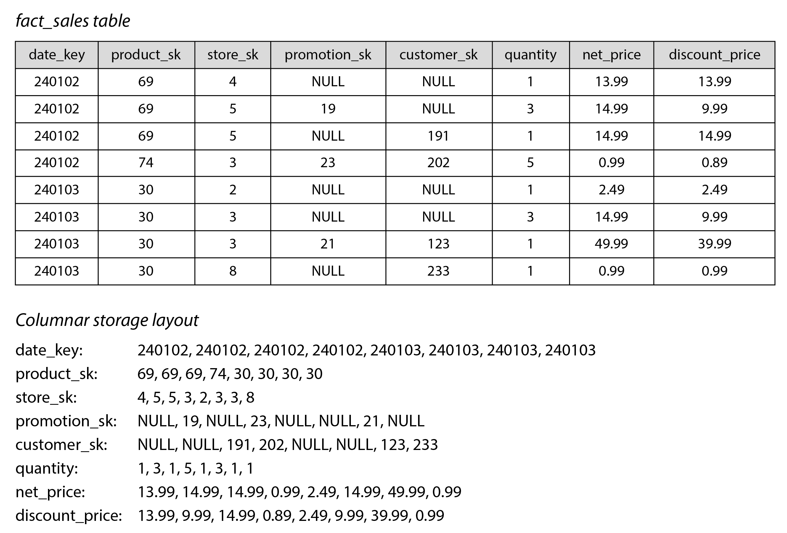

Columnar storage powers data warehouses (Snowflake, BigQuery), embedded DBs (DuckDB), and storage formats (Parquet, ORC, Apache Arrow). *(Note: Do not confuse this with "wide-column" databases like Cassandra or Bigtable, which are actually row-oriented under the hood).*

#### Column Compression
Another massive benefit of columnar storage is that it lends itself beautifully to compression. Because a single column contains values of the exact same data type (often highly repetitive), compression algorithms work extremely well.

**Bitmap Encoding:**
A common and highly effective technique in data warehouses is **bitmap encoding**.
*   If a column has a small number of distinct values compared to the number of rows (e.g., 100,000 products vs. billions of sales), the database can create a separate bitmap for each distinct value.
*   Each bitmap contains one bit per row: `1` if the row has that value, `0` if it does not.

*   **Description:** This figure shows how bitmap encoding works on a repetitive column. It maps the distinct values to their own bit arrays, which can then be tightly run-length encoded.
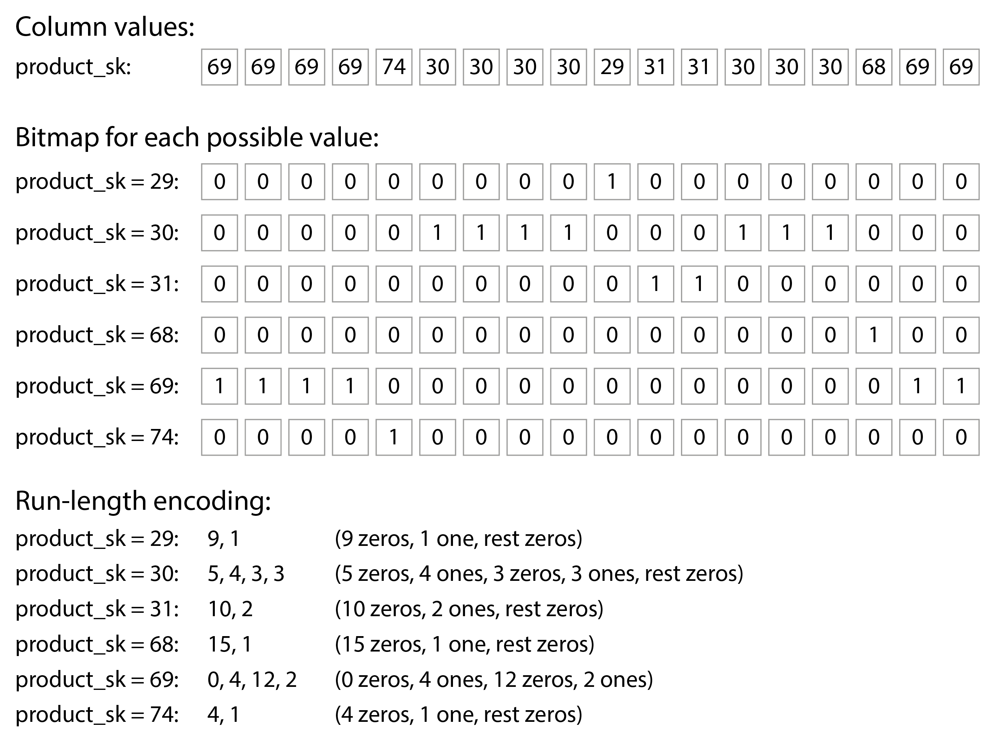

**Run-length Encoding:**
Because these bitmaps will contain mostly zeros, they are considered *sparse* and can be further compressed using **run-length encoding** (e.g., storing "15 zeros, then a 1, then 30 zeros"). Techniques like roaring bitmaps switch representations automatically to keep it as compact as possible.

**Speeding up Queries with Bitmaps:**
Bitmap indexes make evaluating `WHERE` clauses incredibly fast using vector/bitwise operations directly on the CPU:
*   `WHERE product_sk IN (31, 68)` translates to a bitwise **OR** operation between the bitmaps for 31 and 68.
*   `WHERE product_sk = 30 AND store_sk = 3` translates to a bitwise **AND** operation between the respective bitmaps for those two columns.

#### Sort Order in Column Storage
In a column store, it is crucial that the kth item in one column belongs to the same row as the kth item in another column. Therefore, **we cannot sort each column independently**. The data must be sorted an entire row at a time.

*   **Primary Sort Key:** The database administrator can choose columns to sort by, optimizing for common queries. For example, sorting by `date_key` first makes queries targeting date ranges extremely fast (scanning only the relevant contiguous block).
*   **Secondary Sort Key:** A second column (e.g., `product_sk`) can dictate the sort order of rows that share the same primary sort key. 

**Sorting Boosts Compression:**
Sorting brings an enormous secondary benefit: it dramatically improves compression. 
*   If the table is sorted by `date_key`, there will be massive contiguous stretches of rows with the exact same date. 
*   A simple run-length encoding can compress billions of rows down to a few kilobytes for that sorted column. The compression effect is strongest on the first sort key and diminishes for subsequent sort keys as values become more "jumbled up".

#### Writing to Column-Oriented Storage
Column-oriented storage, compression, and sorting are optimized for reads (analytics). 
*   **The Write Problem:** Inserting a single record into the middle of a sorted, compressed columnar table is disastrous—you would have to rewrite every massive, compressed column file from the insertion point to the end.
*   **The Solution (Bulk & LSM):** Writes in data warehouses are typically executed as bulk imports (ETL processes). 
*   To handle this, analytics databases often borrow the **log-structured approach (LSM-trees)**:
    1.  New writes go into an **in-memory, row-oriented store** where they are immediately sorted.
    2.  When the in-memory store fills up, the data is dumped in bulk to disk as compressed columnar files (often to object storage).
    3.  Queries must merge data from the on-disk columnar files and the in-memory recent writes, but the query engine handles this transparently for the user.

---

### Query Execution: Compilation and Vectorization
Analyzing millions of rows means CPU time becomes a major bottleneck, not just reading from disk. 
A naive query executor acts like an interpreter: it iterates over each row one by one, checking conditions iteratively. This is far too slow for analytics. Two alternative approaches make execution much faster:

#### 1. Query Compilation (JIT)
*   The query engine takes a SQL query and dynamically generates efficient machine code specifically for that exact query (often using LLVM).
*   It operates like a Just-In-Time (JIT) compiler. The generated code has tight loops that directly evaluate conditions and copy values to an output buffer, avoiding the overhead of interpreting abstract operators row by row.

#### 2. Vectorized Processing
*   Instead of compiling the query, the query relies on an "interpreter" but makes it fast by processing a **batch of values (a vector) at a time** rather than one row at a time.
*   For example, an equality operator takes an *entire column* and a target value (e.g. "bananas"), and returns an entire bitmap of matches.

*   **Description:** This figure shows how a bitwise AND between two bitmaps maps perfectly to vectorized execution, enabling high-speed processing without branching.
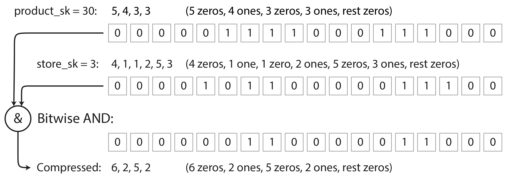

*   **Advantages of both approaches:** Both optimize heavily for modern CPUs by utilizing SIMD (Single-Instruction-Multi-Data) instructions, operating directly on compressed data, staying within tight CPU inner loops (avoiding branch mispredictions), and preferencing continuous memory accesses.

---

### Materialized Views and Data Cubes
In relational databases, a *virtual view* is just a shortcut for a query—when you query the view, the database expands your query into the underlying SQL on the fly. 

A **materialized view**, however, is an actual *cached copy of the query results* written to disk. If the underlying data changes, the materialized view must be updated, incurring a write overhead but vastly speeding up repetitive read queries.

#### Data Cubes (OLAP Cubes)
A common type of materialized view in data warehouses is the **Data Cube** (or OLAP Cube). It is a grid of aggregates grouped by various dimensions.

*   **How it Works:** Rather than crunching through raw transaction data every time someone asks for "Total Sales", the database precomputes the `SUM` (or count/avg) grouped by key dimensions (e.g. date and product).
*   **Advantage:** Queries that match the cube's dimensions become extremely fast since the data has effectively been precomputed.
*   **Disadvantage:** Cubes lack the flexibility of raw data. If you suddenly need to calculate a percentage based on an attribute that *wasn't* defined as a dimension in the cube, you can't use the cube. For this reason, data warehouses use cubes merely as performance boosters, while still retaining the raw underlying data.

*   **Description:** This figure shows a two-dimensional data cube aggregating data by summing values dynamically across the 'Date' and 'Product' axes, allowing for instant lookups of the intersections.
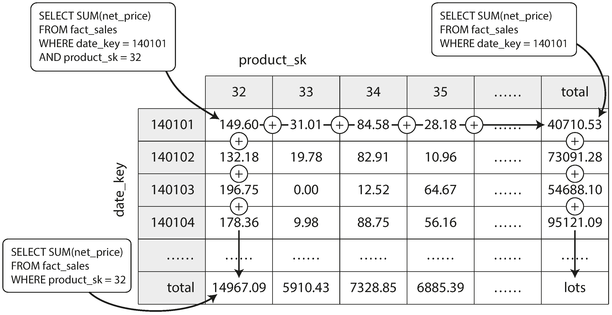

---

### Multidimensional and Full-Text Indexes
Standard B-trees and LSM-trees natively support range queries over a single attribute. For example, finding all users whose name starts with an "L". However, they are insufficient for more complex queries.

**Concatenated Indexes vs. Multidimensional Indexes**
The core difference lies in how they process multi-column data and how rigidly they require you to format your queries.

*   **Concatenated Indexes (The "Phone Book" Approach):** Takes the values of multiple columns and literally sticks them together in a strict, predefined order (e.g., `lastname` + `firstname`, yielding `SmithJohn`).
    *   *Strength:* Incredibly fast if you search using the *exact order* of the index, or just the *prefix* (e.g., find all people whose last name is "Smith").
    *   *Flaw (Order Dependency):* Completely useless if you want to search skipping the first column (e.g., find everyone whose first name is "John", regardless of last name). It also struggles to do optimal range queries on *both* metrics at exactly the same time.

*   **Multidimensional Indexes (The "Coordinate Plane" Approach):** Treats your columns not as a single string, but as independent axes (dimensions) in space.
    *   *Strength:* Allows you to query multiple variables simultaneously *without* worrying about their order. You can ask for dynamic ranges across both dimensions at once.
    *   *Use Case:* Mandatory for things like geospatial data (e.g. `latitude BETWEEN 10 AND 20` AND `longitude BETWEEN 50 AND 60`) or multidimensional combinations like searching for all weather observations in the year 2013 where the temperature was exactly between 25 and 30℃.

#### R-Trees (Region Trees)
Because standard 1D B-trees fail when trying to sort data that has simultaneous horizontal and vertical properties, databases use specialized spatial indexes like **R-trees** (Region Trees).
*   **Bounding Boxes:** R-Trees solve this by dividing multidimensional space into **bounding boxes** (or rectangles/regions). It groups nearby data points together and draws a minimal bounding box around them. It then groups those boxes into even larger parent boxes, building a tree structure.
*   **Execution:** When you run a query like "find all coffee shops in this map square," the database starts at the top of the R-Tree and checks the largest bounding boxes. If a box does not overlap with your query square, the R-tree instantly ignores everything inside it, only descending into boxes that intersect with your search area.
*   **Adoption:** R-trees are the standard underlying data structure for advanced spatial database extensions, most notably **PostGIS** for PostgreSQL.

#### Full-Text Search (Inverted Indexes)
Full-text search goes beyond simple equality, supporting search for words inside large blocks of text, handling typos, synonyms, and grammatical variations.

At its core, full-text search is a multidimensional query where *every possible word* is a dimension.
*   **Inverted Index:** The primary data structure for full-text search. It is a key-value store where the key is a term (word), and the value is a **postings list** (a list of completely distinct document IDs that contain that word).
*   **Vectorized Execution:** If document IDs are continuous integers, the postings list acts precisely like the bitmaps from column-oriented storage. Finding documents that contain both "red" AND "apples" is just a high-speed bitwise AND operation between the two bitmaps.
*   **Handling Typos:** Modern engines like Apache Lucene (Elasticsearch) handle typos within a certain "edit distance" by representing the terms not just as a hash dictionary, but as a finite state automaton (like a trie that transforms into a Levenshtein automaton).

---

### Vector Embeddings and Semantic Search
Semantic search is a massive leap beyond traditional full-text search. Instead of looking for identical words or substrings, semantic search tries to match **concepts and meaning**. If a user searches "terminate contract", they should find the page titled "cancelling your subscription".

#### Vector Embeddings
To match concepts, semantic search models (like BERT, GPT, or Word2Vec) translate sentences, documents, images, or audio into abstract floating-point arrays called **vector embeddings**.
*   A vector represents a distinct point in a multi-dimensional space (often consisting of over 1,000 dimensions).
*   If two documents are semantically similar (in human meaning), the machine learning model will generate vectors that reside very close to each other in this abstract space.

*Note: Do not confuse this with "vectorized processing". In execution engines, vectors are batches of bits processed via SIMD. In semantic search, vectors are mathematical coordinates representing concepts.*

#### Distance/Similarity Metrics
Search engines determine how similar two items are by mathematically measuring the distance between their vectors using calculating techniques:
*   **Cosine Similarity:** Measures the angle between two vectors.
*   **Euclidean Distance:** Measures the straight-line physical distance between two points in space.

#### Vector Indexes
When a user provides a search query, the system generates a vector embedding for the query string on the fly, and must find the "nearest neighbor" vectors inside the database. Because standard R-trees cannot handle 1,000+ dimensions, databases use specialized vector indexes:

1.  **Flat Indexes:** Performs an exact, brute-force comparison of the query vector against every single vector in the database. 100% accurate, but incredibly slow.
2.  **Inverted File (IVF) Indexes:** Clusters the vector space into partitions (centroids). The system only measures vectors inside nearby partitions. Faster, but approximate (might miss a match sitting right on the border of a partition).
3.  **Hierarchical Navigable Small World (HNSW):** An approximate algorithm representing the vector space as a multi-layered graph. The top layer has few nodes, while bottom layers are dense. The query rapidly descends the layers, following proximity edges to hone in on the closest match.

*   **Description:** This figure visualizes the HNSW algorithm. It shows a query vector dropping down through progressively denser graph layers to locate the nearest matching entry without needing to scan every node.
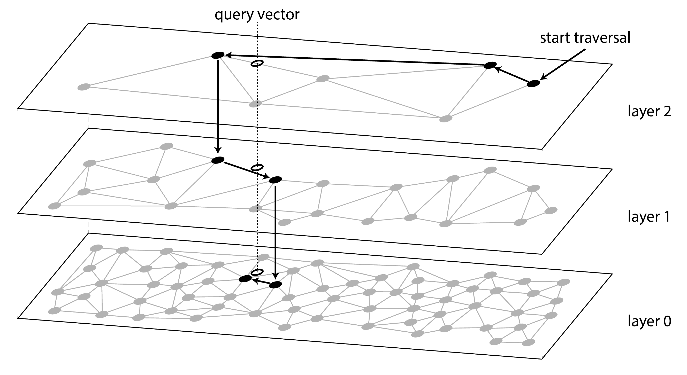
