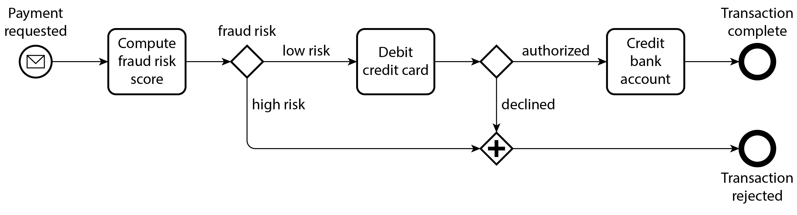

### Chapter 5: Encoding and Evolution - Summary

Applications inevitably change over time (features added, requirements better understood). Good system design should make it easy to adapt to these changes (evolvability). Changes to features often require changes to the data format or schema.

Different data models handle schema changes differently:
*   **Relational Databases:** Enforce a single schema at any time, which must be updated via schema migrations (`ALTER`).
*   **Schema-on-Read (Document/Schemaless):** Don't enforce a strict schema, allowing old and new data formats to co-exist in the database seamlessly.

When data formats change, application code must change. For large applications, these updates rarely happen instantaneously due to:
*   **Server-side:** Rolling upgrades (staged rollouts) where a new version is deployed node-by-node to prevent downtime.
*   **Client-side:** Users updating their apps at different times.

Because of this, different versions of code and data models will co-exist in the same system simultaneously. To keep the system running smoothly, we must maintain compatibility in two directions:
1.  **Backward Compatibility:** Newer code can read data written by older code. (Generally easier, as the author of the new code knows the old format).
2.  **Forward Compatibility:** Older code can read data written by newer code. (Trickier, as older code must gracefully ignore unknown new additions).

*Warning on Forward Compatibility:* If older code reads data written by newer code, updates it, and writes it back, it is crucial that the older code preserves the new, unknown fields rather than stripping them out (preventing data loss).

---

### Formats for Encoding Data

Programs interact with data in two main representations:
1.  **In-Memory:** Objects, structs, lists, arrays, hash tables. Optimized for CPU access via pointers.
2.  **Network/Disk (Byte Sequence):** Self-contained sequence of bytes (e.g., a JSON document) that any process can understand without relying on memory pointers.

The translation from the in-memory representation to a byte sequence is called **Encoding** (also Serialization or Marshalling). The reverse is **Decoding** (Parsing, Deserialization, Unmarshalling).
*(Note: "Serialization" is a loaded term that also refers to transaction isolation, so "Encoding" is preferred here to avoid confusion).*

#### Language-Specific Formats
Many languages feature built-in encoding (e.g., Java's `java.io.Serializable`, Python's `pickle`, Ruby's `Marshal`). While convenient for quick saves, they suffer from deep flaws:
*   **Language lock-in:** Data is tied strictly to one language, making integration with other systems nearly impossible.
*   **Security risks:** Decoding arbitrary byte sequences requires instantiating arbitrary classes, which attackers exploit to execute arbitrary code.
*   **Versioning neglected:** Forward and backward compatibility are usually an afterthought.
*   **Inefficiency:** E.g., Java's built-in serialization is notorious for bloated encoding size and poor performance.
*   *Conclusion:* Never use language-built-in encoding for anything other than transient, temporary purposes.

#### Textual Formats: JSON, XML, and CSV
When seeking standardized encodings readable by many languages, JSON, XML, and CSV are the primary textual choices. While incredibly widely used (especially as data interchange formats between organizations), they have subtle problems:

*   **Number Parsing Ambiguity:** 
    *   XML/CSV cannot distinguish between a number and a string composed of digits without an external schema.
    *   JSON distinguishes strings vs. numbers, but fails to distinguish integers vs. floating-point numbers or specify precision.
    *   *Real-World Issue:* Integers larger than 2^53 aren't exact in standard IEEE 754 floats. Twitter has to send 64-bit post IDs as both integer *and* decimal-string formats in JSON so languages like JavaScript can parse them correctly avoiding precision loss.
*   **No Native Binary Strings:** JSON/XML don't support raw binary byte sequences. Developers work around this by encoding binary data as text via Base64, inflating file size by 33%.
*   **Schema Complexity:** True JSON/XML Schemas exist but are quite complex to learn/implement, so many apps hardcode encoding logic instead.
*   **CSV Ambiguity:** CSV lacks any schema entirely. Dealing with new columns requires manual app updates, and edge cases (like commas inside values) are often handled poorly by parsers.

Despite these flaws, getting different organizations to agree on a format is harder than dealing with the flaws of JSON or XML, ensuring their continued dominance for data interchange.

#### JSON Schema
**JSON Schema** is widely adopted to model data exchanged between systems or written to storage (found in OpenAPI, Schema Registries, and DB validators like `pg_jsonschema`).
*   **Validation:** Schema includes standard primitives (strings, numbers, booleans) and allows developers to overlay constraints (e.g., `port` between 1 and 65535).
*   **Content Models:**
    *   *Open Content Model (Default):* Permits any field not explicitly defined in the schema to exist with any data type (`additionalProperties: true`). This means JSON schemas typically define *what isn't permitted* rather than what *is* permitted.
    *   *Closed Content Model:* Only allows explicitly defined fields.
*   **Complexity:** Features like open/closed models, conditional if/else logic, and remote references make JSON Schema powerful but unwieldy. Reasoning about schemas and evolving them forward/backward compatibly is notoriously challenging. Example: defining a map from integer IDs to strings requires convoluted syntax since JSON objects only support string keys.

#### Binary Encoding
While JSON is less verbose than XML, textual formats use a lot of space. This led to binary encodings for JSON (e.g., MessagePack, CBOR, BSON) and XML (e.g., WBXML).
*   **How they work:** Some extend the datatypes (distinguishing floats vs integers, or adding native binary arrays), but otherwise maintain the exact JSON/XML data model.
*   **The Flaw (No Schema):** Because they don't prescribe a strict schema, these binary formats still have to include all the object **field names** within the encoded data itself. For example, the literal string "userName" must be embedded in every single binary encoded record.
*   **Verdict:** MessagePack and similar JSON binary encodings generally only save a trivial amount of space compared to the raw text (e.g. 66 bytes binary vs 81 bytes minified text JSON). It's debatable whether this small space reduction is worth losing human-readability.
*   *Note:* The text notes that there are better formats that can compress this same record into just 32 bytes (covered in the next sections).

---

### Protocol Buffers
**Protocol Buffers (protobuf)** is a binary encoding library (similar to Apache Thrift) that requires a schema for any data being encoded. 
*   **Compilation:** You write a schema in IDL (Interface Definition Language), and a code generation tool produces classes in your programming language of choice to quickly encode/decode records.
*   **Space Savings (Field Tags):** The secret to its tiny size (compressing the previous 66-byte MessagePack record into just 33 bytes) is **omitting field names entirely**. Instead of embedding the string "userName", the encoded binary simply uses the number `1` (the **Field Tag**) defined in the schema.
*   **Variable-length integers:** To save even more space, it uses variable-length integers (e.g. standard integers between -64 and 63 only take up one byte).
*   **Arrays:** There is no specific array datatype. Instead, the `repeated` modifier simply means the same field tag can appear multiple times sequentially in the encoding.

#### Field Tags and Schema Evolution in Protobuf
Because field tags are aliased numbers representing the field, **you can change the name of a field in your schema safely, but you can NEVER change a field's tag number.** Changing the tag number invalidates all old data.

How Protobuf handles Evolutions:
*   **Forward Compatibility (Adding a Field):** You add a new field with a new, unique tag number. If *older* code reads a record generated by *newer* code containing this new tag number, the old code's parser simply uses the datatype annotation to skip the correct number of bytes, ignoring the unknown field while preserving it when rewriting.
*   **Backward Compatibility (Reading old data):** Because field tags are immutable, new code has no problem reading old data. If new code reads an old record that is missing a newly-added field, it simply drops a default value into that field.
*   **Removing Fields:** You can remove fields, but you can *never* recycle that tag number later.
*   **Changing Data Types:** Risky. If you change a 32-bit integer to a 64-bit integer, new code can read old data (padding with zeros). But old code reading new data will truncate the value if it exceeds 32 bits, destroying data.

---

### Avro
**Apache Avro** is another binary format, distinctly different from Protobuf. It was born out of the Hadoop ecosystem because Protobuf wasn't a good fit. 
*   **Schema Specs:** It uses two flavors of schema: one for human editing (Avro IDL) and one machine-readable (JSON-based). Like Protobuf, it only specifies fields/types, no complex validation rules.
*   **The Difference (No Field Tags):** Unlike Protobuf, Avro's schema **does not use field tags/numbers**. 
*   **Tiny Size:** Compresses the example record into just **32 bytes** (the most compact format). 

**How it works (and why it's so small):**
Because there are no tags or field identifiers, the encoded Avro binary is literally just the raw concatenated values in a row. It doesn't even tell you the datatype. A string is just a length prefix followed by UTF-8 bytes; it could just as easily be an integer as far as the raw binary is concerned.

To decode it, **you must read through the fields in the exact order they appear in your schema**. This means the binary data can *only* be decoded if the code reading it handles the exact same schema structure as the code that wrote it.

#### The Writer's Schema vs The Reader's Schema
Since Avro binaries lack tags and types, how does it handle schema evolution if the structures must match? It uses two schemas simultaneously during decoding:
1.  **The Writer's Schema:** The exact schema that the authoring application used to encode the byte sequence.
2.  **The Reader's Schema:** The schema the receiving application is expecting to process.

If they are different, Avro performs **Schema Resolution** by looking at them side by side. It matches up fields *by field name*. 
*   If the reader expects a field the writer didn't include, the reader fills it with a **default value** defined in the reader's schema.
*   If the writer includes a field the reader wasn't expecting, the reader simply ignores it.
*   Field order doesn't matter, as long as the names match.

#### Avro Schema Evolution Rules
Because resolution relies on filling in blanks with default values, the rule for Avro schema evolution is strict:
*   **To maintain compatibility, you may ONLY add or remove a field that has a default value.**
*   *Forward Compatibility:* If you remove a field that has no default, old readers won't be able to read data written by new writers.
*   *Backward Compatibility:* If you add a field that has no default, new readers won't be able to read data written by old writers.

*Note on Nulls:* Unlike some languages, Avro fields aren't inherently nullable. To allow `null`, you use a union type (e.g., `union { null, long, string } field;`). `null` must be the first branch to be used as a default value. This verbosity prevents accidental null-reference bugs. Changing the datatype of a field is possible, provided that Avro can convert the type. Changing the name
of a field is possible but a little tricky: the reader’s schema can contain aliases for field names, so it can
match an old writer’s schema field names against the aliases. This means that changing a field name is
backward compatible but not forward compatible. Similarly, adding a branch to a union type is back-
ward compatible but not forward compatible.

#### Where does the Writer's Schema come from?
Since Avro records are so small, attaching the full schema to every single record would defeat the purpose. So how does the reader get the Writer's Schema?
1.  **Large Files (Hadoop/Object Storage):** Millions of records are packed into one file. The writer's schema is simply included once at the very top of the file (Avro Object Container Files).
2.  **Database Records:** Different records might be written at different times with different schema versions. Systems prefix the binary record with a tiny **version number**. The system maintains a separate "schema registry" database mapping version numbers to schemas. The reader fetches the registry schema based on the version number. (e.g., Confluent Schema Registry for Kafka).
3.  **Network/RPC Connections:** Two processes connecting over a network negotiate the schema version during the connection handshake and use it for the lifetime of that connection.

#### Dynamically Generated Schemas (Avro's Superpower)
You might wonder why Avro's omission of tag numbers is considered an advantage over Protobuf's tags. The answer is that **Avro is vastly superior for dynamically generated schemas.**

Imagine writing a script to dump an entire relational database into a binary file:
*   **With Avro:** You can write a script that looks at the database, generate an Avro JSON schema on the fly (where DB columns = Avro fields), and encode the data automatically. If the DB schema changes tomorrow (a column is dropped), the script runs again, generates a totally new Avro schema on the fly, and exports the data. No human intervention needed. Existing Readers simply map the new writer's schema fields to their expected fields by name.
*   **With Protobuf:** Because field tags are strictly mapped to fields and immutable, you would likely need an administrator to manually assign and track "Database Column X = Protobuf Tag #3" every time the database changed to ensure a tag was never accidentally recycled or mismatched. Dynamically generating schemas simply wasn't a design goal for Protobuf, whereas it was a core goal for Avro.

---

### The Merits of Schemas
While textual formats like JSON and XML are widespread, binary encodings based on simple schemas (like Avro and Protobuf) are incredibly viable and offer massive advantages:
1.  **Compactness:** They omit field names from the encoded bytes, saving significant space over binary JSON variants (like MessagePack).
2.  **Guaranteed Documentation:** The schema serves as a valuable form of documentation. Because the schema is physically *required* to decode the data, you can be 100% sure the documentation is up-to-date and hasn't drifted from reality.
3.  **Compatibility Validation:** Maintaining a schema registry allows your CI/CD pipelines to automatically check forward and backward compatibility *before* you deploy an application change.
4.  **Type Checking:** For statically typed languages, generating domain classes directly from the schema enables compile-time type-checking.

In short, schema evolution gives you the exact same flexibility as schemaless/JSON document databases, but with strictly better guarantees, smaller storage footprints, and better tooling.

---

### Modes of Dataflow
Compatibility is simply a relationship between one process that encodes data and another process that decodes it. There are many architectural ways data flows from one process to another:
1.  Via Databases
2.  Via Service Calls (REST and RPC)
3.  Via Workflow Engines
4.  Via Asynchronous Messages (Event-Driven Architectures/Message Queues)

#### Dataflow Through Databases
In a database, the process writing the data encodes it, and the process reading it decodes it. 
*   **A message to your future self:** If only one process is accessing the database, writing data is just sending a message to a future version of your own code. Thus, *Backward Compatibility* is absolutely mandatory, otherwise your future code couldn't read your past data.
*   **Rolling Upgrades:** In modern systems with zero-downtime rolling upgrades, multiple versions of your app might be accessing the database simultaneously. An old node might read a record that a newly-upgraded node just wrote. Thus, *Forward Compatibility* is also strictly required.

**Data Outlives Code**
When you deploy a new version of your server application, the old code is entirely replaced within minutes. However, a five-year-old database row will still be sitting there locally in its original 5-year-old encoding format unless you explicitly rewrote it. This is summarized by the phrase: **"Data outlives code."**
*   *Migrations:* Rewriting an entire massive dataset during a schema change is too expensive. Therefore most relational databases allow simple changes (like adding a column with a default `null`) instantly without touching existing rows on disk. When an old row is read, the DB just fills in the missing column with `null` on the fly. 
*   *Compaction:* LSM-trees (like those discussed in Chapter 4) take care of older schema migrations organically; when the engine performs background compaction to merge SSTables, it naturally rewrites the data into the newest format.

**Archival Storage**
When you take a periodic database snapshot for backup or to load into a Data Warehouse, you don't copy the mix of historic schema formats. Instead, the data extraction process is a great time to dump everything consistently using the *latest* schema. Because this archival data is written in one massive go and becomes immutable, formats like **Avro Object Container Files** or analytics-focused columnar formats like **Parquet** are the perfect fit.

---

### Dataflow Through Services: REST and RPC
When processes communicate over a network, the most common arrangement is **clients and servers**. The servers expose an API, known as a **service**.
*   **Encapsulation:** Unlike databases which allow arbitrary SQL queries, services expose predetermined APIs that lock down inputs and outputs based on business logic. This allows fine-grained restriction on what clients can do.
*   **Microservices Architecture:** A key goal is to make services independently deployable and evolvable by separate teams. This implies that old and new versions of client and server code will be running simultaneously across the network. Thus, data encodings across service APIs must be heavily backward and forward compatible.

#### Web Services
When HTTP is the underlying transport protocol for a service, it is called a "web service". Web services are not just for the public web; they are used in:
1.  **Client-to-Server:** User devices (mobile/web apps) making requests over the public internet.
2.  **Service-to-Service (Intra-organization):** Microservices talking to each other within the same private datacenter.
3.  **Service-to-Service (Inter-organization):** Public APIs exchanging data between different companies (e.g., Stripe, OAuth).

**REST vs RPC**
Two main design philosophies dominate web services: **REST** and **RPC**.

**REST (Representational State Transfer)**
*   A design philosophy built intensely upon the native principles of HTTP.
*   It emphasizes simple data formats (like JSON), using URLs to identify resources, and leveraging built-in HTTP features for cache control, authentication, and content-type negotiation. An API following these rules is *RESTful*.

**Interface Definition Languages (IDLs) & Frameworks**
To document and evolve APIs, developers use IDLs:
*   **OpenAPI (Swagger):** The standard IDL for RESTful web services sending/receiving JSON.
*   **gRPC:** The standard IDL for services sending/receiving Protocol Buffers.
Using an IDL allows you to automatically generate API documentation, client SDKs in various languages, and base server scaffolding (which you then fill in using frameworks like Spring Boot or FastAPI).

#### The Problems with Remote Procedure Calls (RPCs)
RPC is an older model (originating in the 1970s) that attempts to make a network request look *exactly* like calling a local function in your programming language (location transparency). Successors included EJB, RMI, DCOM, CORBA, and SOAP.

However, trying to make a network call look like a local function is **fundamentally flawed** because they are radically different things:
1.  **Unpredictability:** Local functions succeed or fail predictably. Network requests are entirely unpredictable (responses drop, remote machines crash, switches fail).
2.  **Ambiguity on Timeout:** If a local function hangs, you know. If a network request times out, you have no idea if the remote service processed your request before the connection died, or if it never received the request at all.
3.  **Retries and Idempotence:** If you retry a local function, it just runs. If you retry a network request because the *response* was dropped, the server will execute the action multiple times (e.g., double-charging a credit card) unless the API is built with a deduplication mechanism (*idempotence*).
4.  **Variable Latency:** A local function is uniformly fast. A network request fluctuates wildly depending on internet congestion.
5.  **Pass by Reference:** You can pass a large object pointer to a local function efficiently. Over a network, all parameters must be painstakingly encoded into a byte sequence.
6.  **Data Type Translation:** Since client and server might be written in completely different languages, the RPC framework has to translate types under the hood (which breaks down on edge cases, like JS 64-bit integers and floats).

*Conclusion:* A remote service is a fundamentally different beast than a local function. REST's appeal is largely that its design inherently acknowledges that network state transfer is a distinct, explicit process, rather than trying to hide it behind a fake local function call.

---

### Load Balancers, Service Discovery, and Service Meshes
For a client to communicate with a server, it must know the server's IP address and port (**Service Discovery**). Hardcoding this is fragile (servers crash, move, or get overloaded). To guarantee high availability, multiple instances of a service are run, and requests are spread across them via **Load Balancing**:

1.  **Hardware Load Balancers:** Physical data-center appliances. Clients connect to a single IP, and the appliance routes it to healthy downstream servers.
2.  **Software Load Balancers:** Applications (like Nginx or HAProxy) running on standard commodity machines, functioning similarly to hardware balancers.
3.  **DNS Load Balancing:** The client's network layer resolves a domain name into a list of multiple IPs and picks one. *Drawback:* DNS is heavily cached and propagates slowly, meaning clients might try to hit old/dead IP addresses if instances change too frequently.
4.  **Service Discovery Systems:** Central registry databases (like ZooKeeper or etcd). New service instances register their IP/port on startup and send continuous "heartbeats." If they crash, the registry delists them. Clients query the registry dynamically before connecting, making it far superior to DNS for highly dynamic environments.
5.  **Service Meshes:** A hyper-sophisticated combination of load balancing and service discovery (e.g., Istio, Linkerd). Often deployed as "sidecar" containers sitting directly next to both the client and the server. The client talks to its local sidecar -> which intelligently routes and encrypts the traffic to the server's sidecar -> which passes it to the server. This abstracts away TLS/SSL logic entirely and provides massive real-time network observability.

---

### Data Encoding and Evolution for RPC/Services
Unlike databases (where data outlives code and you need massive forward & backward compatibility), dataflow across services allows for a simplifying assumption: **You can assume servers will be updated first, and clients will be updated second.**

Therefore, in an RPC environment:
*   You only need **Backward Compatibility** on requests (Server can accept old client requests).
*   You only need **Forward Compatibility** on responses (Client can gracefully ignore new data from the server's response).

The exact rules follow whatever encoding method is used (Protobuf, Avro, JSON).

*   **REST/JSON API Evolution:** Adding optional request parameters, or adding new fields to a response object, usually maintains compatibility perfectly.

**The Public API Versioning Problem:**
If your RPC/API crosses organizational boundaries (e.g. a public API), you simply cannot force your clients to upgrade. Compatibility must be maintained indefinitely. If a breaking change is inevitable, the provider must host multiple versions side-by-side. 
There is no universal agreement on how REST API versioning should occur. The three most common approaches are:
1.  Version number strictly embedded in the URL (e.g. `/v1/users`).
2.  Version passed in the HTTP `Accept` header.
3.  Configured via API Key: A client's API key locks them into the version they had when they signed up, until they manually upgrade via an admin dashboard.

---

### Durable Execution and Workflows
In service-based architectures, complex processes (like processing a payment) often require coordinating multiple services (e.g. Fraud Detection -> Credit Card API -> Bank API). 
*   **Workflows:** This sequence of service calls is called a *workflow* (a graph of tasks). Depending on the framework, tasks are also called "activities" or "durable functions".
*   **Workflow Engines:** Systems that execute these workflows. They consist of an **Orchestrator** (which triggers the workflow on a schedule or via web request and delegates tasks) and an **Executor** (which physically runs the tasks).
    *   *Types:* Some focus on data ETLs (Airflow, Dagster), some allow non-engineers to build visual Business Process Models (Camunda), and others focus heavily on code-based durable execution (Temporal, Restate).

*   **Description:** This figure shows an example workflow for payment processing utilizing Business Process Model and Notation (BPMN) to visually map out task sequences and conditionals.

#### Durable Execution (Exactly-Once Semantics)
When dealing with distributed systems (like payments), you want your workflow to run **exactly once**. However, you cannot wrap three separate microservices and a third-party gateway into a single database transaction. If the server crashes right after charging the credit card but before depositing the funds, you are left with a broken state.

**How Durable Execution Solves This:**
Frameworks like **Temporal** provide transaction-like safety across distributed services.
*   **The WAL (Write-Ahead Log):** The framework rigorously logs every single RPC call, state change, and returned result to durable backend storage as it happens.
*   **Replay on Crash:** If the server running the workflow crashes halfway through, a new machine picks up the workflow and completely re-executes the code from the very top.
*   **Skipping the Logged Steps:** However, when the code reaches an RPC call that it ALREADY completed before the crash, the framework *intercepts the call*. Instead of actually hitting the credit card API a second time, it just reads the result from its durable log and hands it back to the code instantly, allowing the code to proceed to the incomplete steps.

**The Challenges of Durable Execution:**
While powerful, these frameworks require strict discipline:
1.  **Idempotence is still required:** You still need to pass unique IDs to external APIs so they don't double-charge if a network timeout occurs mid-call.
2.  **Code changes are extremely brittle:** Because the framework replays the code and expects it to match the historical log in exact sequence, you generally cannot re-order or modify function calls in an existing workflow script. If an in-flight workflow wakes up and the script looks different, it will fail. You must deploy massive changes as entirely separate, newly-versioned workflows.
3.  **Strict Determinism:** Replay systems break if your code is non-deterministic (meaning the same inputs produce different outputs). You cannot use standard random number generators or system clocks in a durable workflow. You must use the framework's custom, deterministic implementations of those limits, and rely on their static analysis tools to ensure you haven't broken the determinism rules.

---

### Event-Driven Architectures
Another way encoded data flows between processes is via an *Event-Driven Architecture*. Here, a process sends a "message" or "event", but unlike RPC, the sender **does not wait for the recipient to process it**. 
Furthermore, instead of a direct network connection, the message is sent through an intermediary called a **Message Broker** (or event broker / message queue).

**Advantages of Message Brokers over direct RPC:**
1.  **Buffering:** Acts as a buffer if the recipient is unavailable, overloaded, or dead, improving total system reliability.
2.  **Redelivery:** Automatically redelivers messages to a crashed process to prevent data loss.
3.  **No Service Discovery:** Senders don't need to know the IP address or port of the recipients.
4.  **Fan-out:** Allows the exact same message to be delivered to multiple separate recipients.
5.  **Decoupling:** Logically separates the sender from the recipient. The sender publishes a message and does not care who consumes it.

#### Message Brokers
Historically dominated by commercial suites (TIBCO, IBM WebSphere), the landscape is now dominated by open-source implementations (RabbitMQ, Apache Kafka, NATS, Redpanda) and cloud services (AWS Kinesis, Google Cloud Pub/Sub).

**Message Distribution Patterns:**
1.  **Named Queue:** Multiple consumers listen to a single queue. *One* of them receives the message.
2.  **Named Topic (Pub/Sub):** Multiple subscribers listen to a topic. *All* of them receive a copy of the message.

**Data Encoding in Brokers:**
Message brokers don't enforce data models; a message is just a blob of bytes. Therefore, it's common to use JSON, Protobuf, or Avro and deploy a **Schema Registry** right alongside the broker to manage schema versions. 
*(Note: If a consumer reads a message, mutates it, and republishes it to a new topic, it must be careful to preserve any unknown fields to maintain Forward Compatibility, exactly as warned in the Database section).*

#### Distributed Actor Frameworks
The **Actor Model** is a programming paradigm designed to solve concurrency in a single process without dealing directly with threads, race conditions, or deadlocks.
*   Logic is grouped into "Actors" (e.g. representing a single client or entity). Every actor has its own private, isolated local state.
*   Actors communicate with each other exclusively by sending and receiving asynchronous messages.
*   Since each actor processes strictly one message at a time sequentially, you never have to worry about thread safety or locks.

**Distributed Actors (Akka, Orleans, Erlang/OTP):**
In these frameworks, this exact same message-passing model is used to scale across *multiple machines*.
*   If Actor A and Actor B are on different servers, the framework transparently intercepts the message, encodes it into bytes, sends it over the network, and decodes it on the other side.
*   *Why this works better than RPC:* RPC tries to pretend network calls are perfectly safe local functions (which is a lie). The Actor model natively assumes that messages can be lost anyway, even within a local process. Thus, the fundamental mismatch between local and remote communication is drastically minimized.
*   **Compatibility:** Because distributed actors essentially integrate a message broker directly into the runtime, you still have to worry about Forward and Backward Compatibility (using schemas like Avro/Protobuf) during rolling upgrades when Old-Actor-Nodes are sending messages to New-Actor-Nodes.