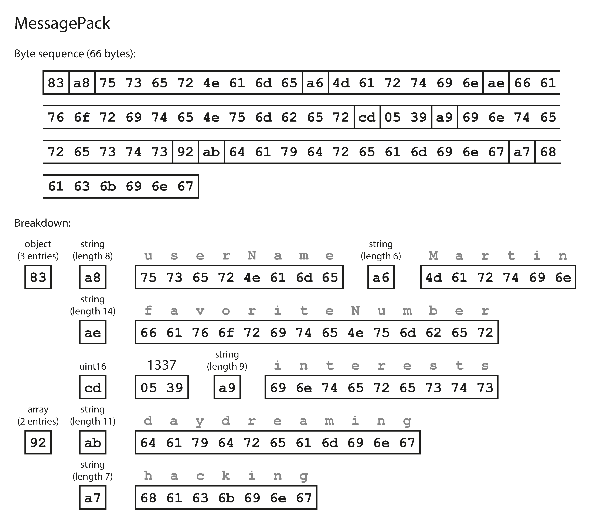
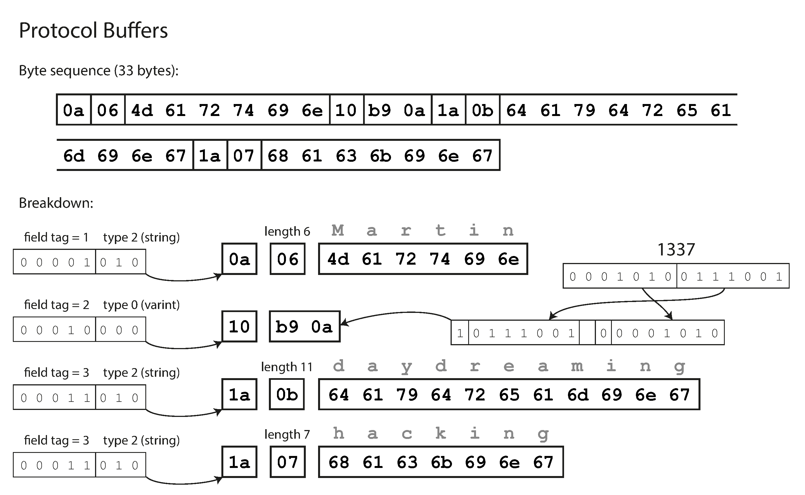
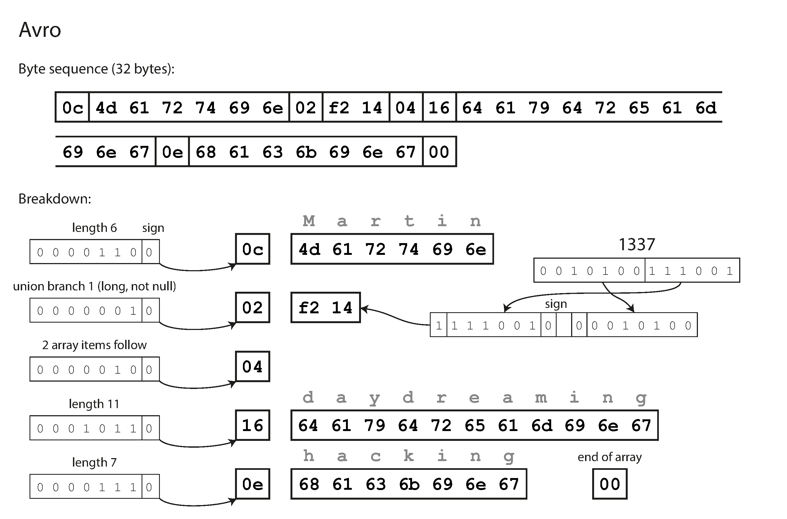
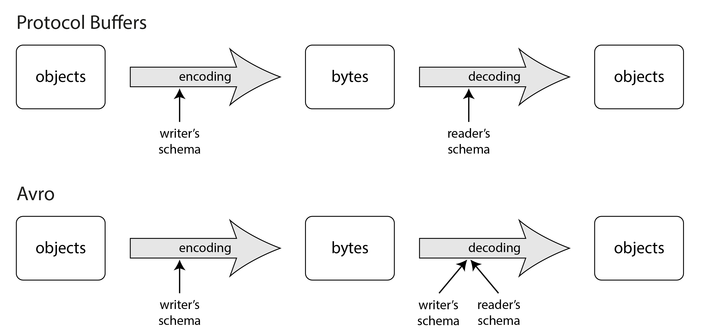
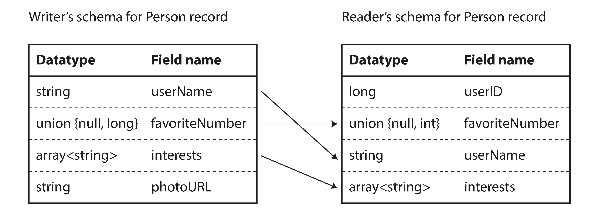

### Chapter 5: Encoding and Evolution - Summary

Applications inevitably change over time (features added, requirements better understood). Good system design should make it easy to adapt to these changes (evolvability). Changes to features often require changes to the data format or schema.

Different data models handle schema changes differently:
*   **Relational Databases:** Enforce a single schema at any time, which must be updated via schema migrations (`ALTER`).
*   **Schema-on-Read (Document/Schemaless):** Don't enforce a strict schema, allowing old and new data formats to co-exist in the database seamlessly.

When data formats change, application code must change. For large applications, these updates rarely happen instantaneously due to:
*   **Server-side:** Rolling upgrades (staged rollouts) where a new version is deployed node-by-node to prevent downtime.
*   **Client-side:** Users updating their apps at different times.

Because of this, different versions of code and data models will co-exist in the same system simultaneously. To keep the system running smoothly, we must maintain compatibility in two directions:
1.  **Backward Compatibility:** Newer code can read data written by older code. (Generally easier, as the author of the new code knows the old format).
2.  **Forward Compatibility:** Older code can read data written by newer code. (Trickier, as older code must gracefully ignore unknown new additions).

*Warning on Forward Compatibility:* If older code reads data written by newer code, updates it, and writes it back, it is crucial that the older code preserves the new, unknown fields rather than stripping them out (preventing data loss).

---

### Formats for Encoding Data

Programs interact with data in two main representations:
1.  **In-Memory:** Objects, structs, lists, arrays, hash tables. Optimized for CPU access via pointers.
2.  **Network/Disk (Byte Sequence):** Self-contained sequence of bytes (e.g., a JSON document) that any process can understand without relying on memory pointers.

The translation from the in-memory representation to a byte sequence is called **Encoding** (also Serialization or Marshalling). The reverse is **Decoding** (Parsing, Deserialization, Unmarshalling).
*(Note: "Serialization" is a loaded term that also refers to transaction isolation, so "Encoding" is preferred here to avoid confusion).*

#### Language-Specific Formats
Many languages feature built-in encoding (e.g., Java's `java.io.Serializable`, Python's `pickle`, Ruby's `Marshal`). While convenient for quick saves, they suffer from deep flaws:
*   **Language lock-in:** Data is tied strictly to one language, making integration with other systems nearly impossible.
*   **Security risks:** Decoding arbitrary byte sequences requires instantiating arbitrary classes, which attackers exploit to execute arbitrary code.
*   **Versioning neglected:** Forward and backward compatibility are usually an afterthought.
*   **Inefficiency:** E.g., Java's built-in serialization is notorious for bloated encoding size and poor performance.
*   *Conclusion:* Never use language-built-in encoding for anything other than transient, temporary purposes.

#### Textual Formats: JSON, XML, and CSV
When seeking standardized encodings readable by many languages, JSON, XML, and CSV are the primary textual choices. While incredibly widely used (especially as data interchange formats between organizations), they have subtle problems:

*   **Number Parsing Ambiguity:** 
    *   XML/CSV cannot distinguish between a number and a string composed of digits without an external schema.
    *   JSON distinguishes strings vs. numbers, but fails to distinguish integers vs. floating-point numbers or specify precision.
    *   *Real-World Issue:* Integers larger than 2^53 aren't exact in standard IEEE 754 floats. Twitter has to send 64-bit post IDs as both integer *and* decimal-string formats in JSON so languages like JavaScript can parse them correctly avoiding precision loss.
*   **No Native Binary Strings:** JSON/XML don't support raw binary byte sequences. Developers work around this by encoding binary data as text via Base64, inflating file size by 33%.
*   **Schema Complexity:** True JSON/XML Schemas exist but are quite complex to learn/implement, so many apps hardcode encoding logic instead.
*   **CSV Ambiguity:** CSV lacks any schema entirely. Dealing with new columns requires manual app updates, and edge cases (like commas inside values) are often handled poorly by parsers.

Despite these flaws, getting different organizations to agree on a format is harder than dealing with the flaws of JSON or XML, ensuring their continued dominance for data interchange.

#### JSON Schema
**JSON Schema** is widely adopted to model data exchanged between systems or written to storage (found in OpenAPI, Schema Registries, and DB validators like `pg_jsonschema`).
*   **Validation:** Schema includes standard primitives (strings, numbers, booleans) and allows developers to overlay constraints (e.g., `port` between 1 and 65535).
*   **Content Models:**
    *   *Open Content Model (Default):* Permits any field not explicitly defined in the schema to exist with any data type (`additionalProperties: true`). This means JSON schemas typically define *what isn't permitted* rather than what *is* permitted.
    *   *Closed Content Model:* Only allows explicitly defined fields.
*   **Complexity:** Features like open/closed models, conditional if/else logic, and remote references make JSON Schema powerful but unwieldy. Reasoning about schemas and evolving them forward/backward compatibly is notoriously challenging. Example: defining a map from integer IDs to strings requires convoluted syntax since JSON objects only support string keys.

#### Binary Encoding
While JSON is less verbose than XML, textual formats use a lot of space. This led to binary encodings for JSON (e.g., MessagePack, CBOR, BSON) and XML (e.g., WBXML).
*   **How they work:** Some extend the datatypes (distinguishing floats vs integers, or adding native binary arrays), but otherwise maintain the exact JSON/XML data model.
*   **The Flaw (No Schema):** Because they don't prescribe a strict schema, these binary formats still have to include all the object **field names** within the encoded data itself. For example, the literal string "userName" must be embedded in every single binary encoded record.
*   **Verdict:** MessagePack and similar JSON binary encodings generally only save a trivial amount of space compared to the raw text (e.g. 66 bytes binary vs 81 bytes minified text JSON). It's debatable whether this small space reduction is worth losing human-readability.
*   *Note:* The text notes that there are better formats that can compress this same record into just 32 bytes (covered in the next sections).

---

### Protocol Buffers
**Protocol Buffers (protobuf)** is a binary encoding library (similar to Apache Thrift) that requires a schema for any data being encoded. 
*   **Compilation:** You write a schema in IDL (Interface Definition Language), and a code generation tool produces classes in your programming language of choice to quickly encode/decode records.
*   **Space Savings (Field Tags):** The secret to its tiny size (compressing the previous 66-byte MessagePack record into just 33 bytes) is **omitting field names entirely**. Instead of embedding the string "userName", the encoded binary simply uses the number `1` (the **Field Tag**) defined in the schema.
*   **Variable-length integers:** To save even more space, it uses variable-length integers (e.g. standard integers between -64 and 63 only take up one byte).
*   **Arrays:** There is no specific array datatype. Instead, the `repeated` modifier simply means the same field tag can appear multiple times sequentially in the encoding.

#### Field Tags and Schema Evolution in Protobuf
Because field tags are aliased numbers representing the field, **you can change the name of a field in your schema safely, but you can NEVER change a field's tag number.** Changing the tag number invalidates all old data.

How Protobuf handles Evolutions:
*   **Forward Compatibility (Adding a Field):** You add a new field with a new, unique tag number. If *older* code reads a record generated by *newer* code containing this new tag number, the old code's parser simply uses the datatype annotation to skip the correct number of bytes, ignoring the unknown field while preserving it when rewriting.
*   **Backward Compatibility (Reading old data):** Because field tags are immutable, new code has no problem reading old data. If new code reads an old record that is missing a newly-added field, it simply drops a default value into that field.
*   **Removing Fields:** You can remove fields, but you can *never* recycle that tag number later.
*   **Changing Data Types:** Risky. If you change a 32-bit integer to a 64-bit integer, new code can read old data (padding with zeros). But old code reading new data will truncate the value if it exceeds 32 bits, destroying data.

---

### Avro
**Apache Avro** is another binary format, distinctly different from Protobuf. It was born out of the Hadoop ecosystem because Protobuf wasn't a good fit. 
*   **Schema Specs:** It uses two flavors of schema: one for human editing (Avro IDL) and one machine-readable (JSON-based). Like Protobuf, it only specifies fields/types, no complex validation rules.
*   **The Difference (No Field Tags):** Unlike Protobuf, Avro's schema **does not use field tags/numbers**. 
*   **Tiny Size:** Compresses the example record into just **32 bytes** (the most compact format). 

**How it works (and why it's so small):**
Because there are no tags or field identifiers, the encoded Avro binary is literally just the raw concatenated values in a row. It doesn't even tell you the datatype. A string is just a length prefix followed by UTF-8 bytes; it could just as easily be an integer as far as the raw binary is concerned.

To decode it, **you must read through the fields in the exact order they appear in your schema**. This means the binary data can *only* be decoded if the code reading it handles the exact same schema structure as the code that wrote it.

#### The Writer's Schema vs The Reader's Schema
Since Avro binaries lack tags and types, how does it handle schema evolution if the structures must match? It uses two schemas simultaneously during decoding:
1.  **The Writer's Schema:** The exact schema that the authoring application used to encode the byte sequence.
2.  **The Reader's Schema:** The schema the receiving application is expecting to process.

If they are different, Avro performs **Schema Resolution** by looking at them side by side. It matches up fields *by field name*. 
*   If the reader expects a field the writer didn't include, the reader fills it with a **default value** defined in the reader's schema.
*   If the writer includes a field the reader wasn't expecting, the reader simply ignores it.
*   Field order doesn't matter, as long as the names match.

#### Avro Schema Evolution Rules
Because resolution relies on filling in blanks with default values, the rule for Avro schema evolution is strict:
*   **To maintain compatibility, you may ONLY add or remove a field that has a default value.**
*   *Forward Compatibility:* If you remove a field that has no default, old readers won't be able to read data written by new writers.
*   *Backward Compatibility:* If you add a field that has no default, new readers won't be able to read data written by old writers.

*Note on Nulls:* Unlike some languages, Avro fields aren't inherently nullable. To allow `null`, you use a union type (e.g., `union { null, long, string } field;`). `null` must be the first branch to be used as a default value. This verbosity prevents accidental null-reference bugs. Changing the datatype of a field is possible, provided that Avro can convert the type. Changing the name
of a field is possible but a little tricky: the reader’s schema can contain aliases for field names, so it can
match an old writer’s schema field names against the aliases. This means that changing a field name is
backward compatible but not forward compatible. Similarly, adding a branch to a union type is back-
ward compatible but not forward compatible.

#### Where does the Writer's Schema come from?
Since Avro records are so small, attaching the full schema to every single record would defeat the purpose. So how does the reader get the Writer's Schema?
1.  **Large Files (Hadoop/Object Storage):** Millions of records are packed into one file. The writer's schema is simply included once at the very top of the file (Avro Object Container Files).
2.  **Database Records:** Different records might be written at different times with different schema versions. Systems prefix the binary record with a tiny **version number**. The system maintains a separate "schema registry" database mapping version numbers to schemas. The reader fetches the registry schema based on the version number. (e.g., Confluent Schema Registry for Kafka).
3.  **Network/RPC Connections:** Two processes connecting over a network negotiate the schema version during the connection handshake and use it for the lifetime of that connection.

#### Dynamically Generated Schemas (Avro's Superpower)
You might wonder why Avro's omission of tag numbers is considered an advantage over Protobuf's tags. The answer is that **Avro is vastly superior for dynamically generated schemas.**

Imagine writing a script to dump an entire relational database into a binary file:
*   **With Avro:** You can write a script that looks at the database, generate an Avro JSON schema on the fly (where DB columns = Avro fields), and encode the data automatically. If the DB schema changes tomorrow (a column is dropped), the script runs again, generates a totally new Avro schema on the fly, and exports the data. No human intervention needed. Existing Readers simply map the new writer's schema fields to their expected fields by name.
*   **With Protobuf:** Because field tags are strictly mapped to fields and immutable, you would likely need an administrator to manually assign and track "Database Column X = Protobuf Tag #3" every time the database changed to ensure a tag was never accidentally recycled or mismatched. Dynamically generating schemas simply wasn't a design goal for Protobuf, whereas it was a core goal for Avro.