### Chapter 6: Replication - Summary

Replication means keeping a copy of the same data on multiple machines that are connected via a network. We assume the dataset is small enough to fit on a single machine (datasets too big require sharding, covered in Chapter 7).

**Why do we replicate data?**
1.  **Latency:** Keep data geographically close to users.
2.  **Availability & Durability:** Allow the system to continue working even if parts of it fail.
3.  **Read Throughput:** Scale out the number of machines that can serve read queries.

If data never changed, replication would be trivial (just copy it once). All the complexity comes from handling *changes* to replicated data. There are three main algorithms for this: **Single-leader**, **Multi-leader**, and **Leaderless** replication.

#### Backups vs. Replication
Replication is *not* a substitute for backups. 
*   **Replication** instantly propagates changes across nodes. If you accidentally execute `DELETE FROM users`, that deletion is instantly replicated everywhere, and you lose the data.
*   **Backups** store immutable snapshots of past states that allow you to roll back in time to recover from human error.
They are complementary: replication archives can even be stored in cold object storage to act as backups.

---

### Single-Leader Replication
The most common solution for database replication is **Leader-based replication** (also called primary-backup, active/passive).
*   **The Leader (Primary/Source):** One replica is designated as the leader. Whenever a client writes to the database, it *must* send its request to the leader.
*   **The Followers (Read Replicas/Secondaries):** The other replicas are followers. When the leader writes data to its local storage, it streams the changes to all followers via a replication log. The followers apply the writes in the exact same order.
*   **Reads:** Clients can query the leader OR any follower for read-only queries. **Writes** only go to the leader.

*Note:* If the database is sharded, each shard has its own leader. Leader-based replication is the standard in almost every major system: PostgreSQL, MySQL, SQL Server, MongoDB, Kafka, and consensus algorithms like Raft.

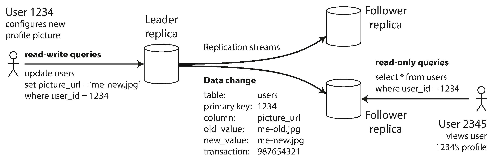

---

### Synchronous vs. Asynchronous Replication

When the leader receives a write, it must decide whether to wait for its followers to copy the data before telling the user the write was "Successful".

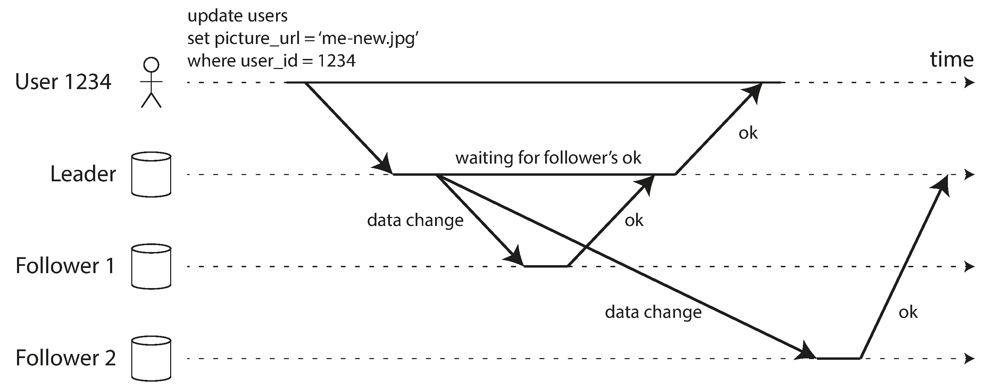

#### Synchronous Replication
The leader waits until the follower formally confirms it received and wrote the data before reporting success to the client.
*   **Advantage:** Guarantees the follower has an up-to-date copy. If the leader instantly dies, no data is lost; the follower can safely take over.
*   **Disadvantage:** If the synchronous follower crashes, or the network is slow, the leader physically *cannot process any writes*. It must block all writes until the follower recovers.

**Semi-Synchronous Configuration**
Because making *all* followers synchronous would cause the entire database to grind to a halt the moment *one* node hiccups, databases use a hybrid approach. Usually, **one** follower is made synchronous, and the rest are asynchronous. If the synchronous follower slows down or dies, one of the asynchronous followers is instantly promoted to be the new synchronous follower. This guarantees the data lives on at least two nodes at all times without crippling the system.

#### Asynchronous Replication
The leader sends the replication log to the followers but does not wait for any response before telling the client "Success".
*   **Advantage:** The leader can continue processing non-stop writes at maximum speed, even if all followers fall minutes or hours behind.
*   **Disadvantage (Lost Data):** If the leader fails and is irrecoverable, any writes that had not yet streamed to the followers are permanently lost, even though the client was told they were successful. This weakens durability.

Despite the risk of data loss, fully asynchronous replication is widely used, especially for applications with many followers or geographically distributed nodes across the globe where network latency is high.

---

### Setting Up New Followers
When increasing the number of replicas or replacing a dead node, how do you ensure the new follower gets an accurate copy of the leader's data?
You cannot simply copy the data files from disk. The database is constantly in flux, so a standard file copy would get different parts of the database at different points in time, resulting in a corrupted, nonsensical file. You *could* lock the database to do this, but that would cause massive downtime.

The standard zero-downtime process is:
1.  **Consistent Snapshot:** Take a consistent snapshot of the leader's database without locking the entire system.
2.  **Copy Dataset:** Copy the snapshot over to the new follower node.
3.  **Request Backlog:** The new follower connects to the leader and requests all data changes that happened *since the exact moment* the snapshot was taken. (This requires the snapshot to be associated with an exact position in the leader's replication log, e.g., PostgreSQL's log sequence number, or MySQL's binlog coordinates).
4.  **Catch Up:** Once the follower processes this backlog, it has "caught up" and can begin processing live streams of changes like a normal follower.

---

### Databases Backed by Object Storage
Many modern databases are shifting to use cloud object storage (AWS S3, Google Cloud Storage, Azure Blob Storage) not just for backups, but for serving live query data.

**Benefits of Object Storage:**
1.  **Cost:** It is dramatically less expensive than SSDs/NVMe or attached virtual block storage (AWS EBS). This enables "tiered storage" where hot data is kept on fast disks/memory, and cold data sits on cheap S3.
2.  **Built-in High Availability:** Cloud object stores natively provide multi-region replication with near-perfect durability guarantees without inter-zone network fees.
3.  **Transactions/Election via CAS:** Databases can leverage the object store's own Compare-and-Set (CAS) features (like S3 conditional writes) to easily implement split-brain-proof transaction coordination and leader election.
4.  **Data Lake Integration:** Storing database files in open formats (like Apache Parquet or Iceberg) directly on S3 makes integrating data across entirely different systems incredibly easy.

**Trade-offs and Mitigation:**
1.  **Latency & File Structure:** Object storage has much higher read/write latency than local disks. They also charge a per-API-call fee, requiring databases to batch operations aggressively. Furthermore, they are immutable and lack POSIX filesystem features (like non-sequential writes), meaning databases must be entirely re-architected to write in large, immutable chunks rather than modifying in-place.
2.  **Tiered vs. Zero-Disk Architectures (ZDA):** 
    *   *Tiered Storage:* Keep fast, small WALs (Write-Ahead Logs) on low-latency virtual disks (EBS), and periodically flush cold data to Object Storage.
    *   *Zero-Disk Architecture (ZDA):* Systems like WarpStream, Confluent Freight, and Turbopuffer push everything to S3, using local disks and RAM *strictly* as temporary caches. This means the actual compute nodes are completely stateless, making operations and scaling drastically simpler.

---

### Handling Node Outages
Nodes fail constantly (due to crashes or routine patch reboots). The goal of replication is to keep the system running despite individual node deaths.

#### Follower Failure: Catch-up Recovery
If a follower crashes or loses its network connection, recovering is easy:
1.  On its local disk, the follower keeps a log of data changes it has received.
2.  Upon reboot, it checks its log to see the very last transaction it successfully processed before dying.
3.  It connects to the leader and requests all transactions that occurred *after* that specific point.
4.  Once it finishes applying this backlogged stream of writes, it is "caught up" and resumes normal operation.
*(Performance Note: This recovery places high load on both the follower and the leader. If a follower is dead for a long time, the leader must choose to either keep the giant backlog of logs (wasting disk space) or delete them (forcing the follower to rebuild from a backup when it returns).)*

#### Leader Failure: Failover
Handling a dead leader is vastly more complex. One of the followers needs to be promoted, clients need to be reconfigured to send writes to the new leader, and remaining followers need to consume from the new leader. This process is called **Failover**.

An automatic failover process typically involves:
1.  **Determining the leader failed:** Since there is no foolproof way to detect a crash, systems rely on a **timeout**. Nodes constantly ping each other; if a node doesn't respond for 'X' seconds, it's presumed dead.
2.  **Choosing a new leader:** This is a *consensus* problem. The remaining replicas hold an election, usually picking the follower with the most up-to-date data (e.g., the greatest log sequence number in async replication) to minimize data loss.
3.  **Reconfiguring the system:** Clients are routed to the new leader. Crucially, the system must ensure the old leader recognizes it has been demoted and becomes a follower if it ever wakes back up.

**Why Failover is Dangerous:**
Automatic failover is fraught with terrifying edge cases:
*   **Discarded Data (Asynchronous Replication):** If the old leader died before replicating its most recent writes, the newly promoted leader won't have them. If the old leader wakes up, those old writes are usually just discarded to prevent conflicts. *This means writes you confirmed to the user as successful were actually permanently lost.*
*   **External System Corruption:** Discarding those writes is catastrophic if other external systems coordinate with them. For example: GitHub had a MySQL DB using auto-increment primary keys and a Redis cache looking at those keys. An out-of-date follower was promoted and reused discarded primary keys for new data. Redis became entirely out of sync with MySQL, exposing private data to the wrong users.
*   **Split Brain:** If a network partition occurs, you could end up with *two* nodes actively believing they are the leader simultaneously. Both accept writes, guaranteeing massive data corruption. Systems try to prevent this by forcing old leaders offline (a mechanism known as **STONITH:** *Shoot The Other Node In The Head*). But a buggy STONITH configuration could accidentally shoot *both* nodes, bringing down the entire database.
*   **Timeout Tuning:** If your timeout is too long, failover takes forever and the system is down for writes. If it's too short, a temporary load spike will trigger unnecessary failovers, making the system's performance *substantially worse* while it struggles to elect a new leader and catch up.

Because of these sheer complexities and catastrophic risks, many operations teams disable automatic failover entirely and mandate that a human administrator performs the failover manually.

---

### Implementation of Replication Logs
Under the hood, how does the leader actually send a stream of changes to the followers? There are a few different methodologies used:

**1. Statement-based Replication**
The leader physically logs every SQL statement (`INSERT`, `UPDATE`, `DELETE`) it executes and sends the exact SQL string to the followers to execute.
*   *The Problem:* This breaks down completely if the SQL relies on **nondeterminism**. For example, `UPDATE users SET last_login = NOW()`. When the follower parses and runs `NOW()`, it will insert a different hardware timestamp than the leader did! Similar issues occur with `RAND()`, auto-incrementing columns, or triggers.
*   MySQL used this before v5.1, but due to determinism nightmares, it is largely abandoned in favor of row-based replication.

**2. Write-Ahead Log (WAL) Shipping**
As discussed in Chapter 4, every modification first hits a low-level append-only WAL before touching the B-Tree. The leader simply copies this exact WAL bytes over the network to the followers.
*   *The Problem:* The WAL is an extremely low-level mapping of physical bytes to specific disk blocks. Because of this, it is **tightly coupled** to the specific storage engine and database version.
*   This makes zero-downtime upgrades nearly impossible. You cannot have a follower running Postgres v13 while the leader runs Postgres v12, because the physical disk WAL format likely changed between versions.

**3. Logical (Row-based) Log Replication**
To solve the tight-coupling of WAL shipping, databases create a separate log exclusively for replication, known as a **Logical Log** (e.g. MySQL's `binlog`).
*   Instead of writing "Modify disk block 583", it writes "Row ID 52 was updated over in the Users table. Column X changed to Y".
*   Because it strictly defines *logical rows* rather than *physical disk bytes*, it is completely decoupled from the storage engine. This seamlessly allows leaders and followers to run entirely different database versions, enabling zero-downtime rolling upgrades.
*   *(Bonus: Logical logs are incredibly easy for external systems to read, enabling Change Data Capture (CDC) to stream live database edits into a Data Warehouse).*

---

### Problems with Replication Lag
While replication adds fault tolerance, many massive online architectures use it purely for **Read Scaling**. 
If your app is 95% reads, you can simply spin up 50 asynchronous followers, distribute the read-load across them, and leave the Leader to only handle the 5% write traffic.

However, this only works if the replication is *asynchronous* (making 50 servers completely synchronous would violently crash the database). The inherent flaw of asynchronous read-heavy systems is **Replication Lag**:
*   If a user writes something to the leader, and then immediately reads from an async follower, the follower might not have received that write log yet. The user will see outdated data.
*   This creates a terrifying logical anomaly: if you query the Leader and the Follower at the exact same physical millisecond, you get two different results back!
*   This state is called **Eventual Consistency**. It just means that if you stop writing and wait a few seconds, eventually the followers will catch up and the system will achieve consistent harmony.

Usually, replication lag is fractions of a millisecond and completely unnoticeable. But during peak load or network congestion, replication lag can stretch into SECONDS or MINUTES, creating massive real-world problems for applications.

#### 1. Reading Your Own Writes (Read-After-Write Consistency)
Imagine a user updates their profile picture, hits 'Save', and is immediately redirected to their profile page. 
*   The 'Save' (Write) was routed to the Leader.
*   The 'View Profile' (Read) was routed to an async Follower.
*   Because of replication lag, the Follower hasn't received the new picture yet. To the user, it looks like their save action was completely lost, causing extreme frustration.
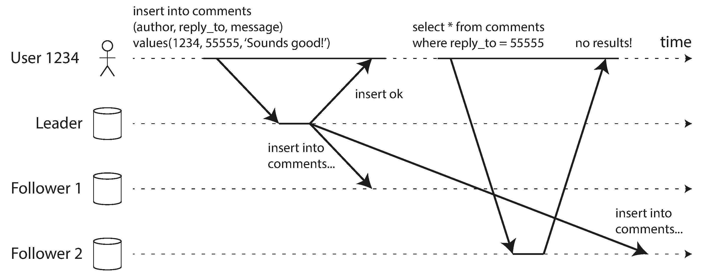

To prevent this, databases implement **Read-Your-Writes Consistency** (guaranteeing a user always sees their own updates, making no promises about seeing *other* users' updates).
Solutions include:
*   **Routing by editability:** If something can only be edited by the owner (like a profile), route all requests for the user's *own* profile to the Leader, and let them read *other* users' profiles from the Followers.
*   **Time-based routing:** The client remembers the timestamp of its last write. For the next 1 minute, all read requests from that specific client are forced to go to the Leader.
*   *Cross-device challenges:* This gets exponentially harder if the user edits their profile on their desktop, but immediately checks it on their mobile phone. Since the phone doesn't know the desktop's "last write timestamp", the database needs centralized metadata and region-aware routing to solve this.

#### Regions and Availability Zones (Sidebar)
*   **Region:** A physical geographic location (e.g., "US-East"). 
*   **Availability Zone (Zone):** A specific datacenter within that Region, with its own dedicated power and cooling. Regions consist of multiple Zones connected by ultra-fast networks.
Spreading nodes across Zones protects against a single datacenter burning down. Spreading across Regions protects against an earthquake destroying the entire US-East coast, but introduces extreme latency to the system.

#### 2. Monotonic Reads (Time Traveling Backward)
The second massive anomaly of replication lag occurs if a user makes multiple reads in sequence and hits *different* followers.
1.  User views a comment thread. Their read hits **Follower A** (which has 0 lag). They see a brand new comment by John.
2.  User refreshes the page. The load balancer routes this new read to **Follower B** (which has 10 seconds of lag).
3.  Because Follower B hasn't received John's comment yet, the comment suddenly vanishes from the screen!
To the user, time literally moved backward. They saw the future, and then reverted to the past.
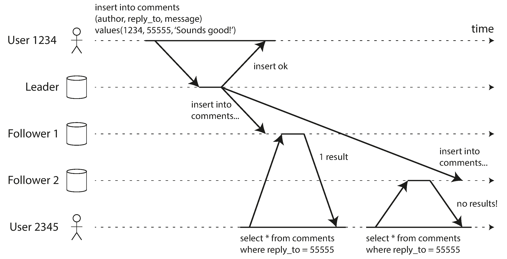

**Monotonic Reads** is a guarantee that this never happens. It promises that if you read newer data, your subsequent reads will never be served by a replica holding older data. 
*   *Solution:* The simplest way to achieve this is to ensure a specific user is *always* routed to the exact same replica for all their reads (e.g., routing based on a hash of their User ID, rather than random load balancing). If that replica dies, the user is re-routed to a new one.

#### 3. Consistent Prefix Reads (Violation of Causality)
The third anomaly involves causality and the order of operations. Imagine a conversation consisting of a question and an answer:
1.  **Mr. Poons:** "How far into the future can you see?" *(Write 1)*
2.  **Mrs. Cake:** "About ten seconds." *(Write 2)*

If an observer is reading from a sharded, asynchronous database, **Follower A** (holding Mr. Poons's shard) might have a huge replication lag, while **Follower B** (holding Mrs. Cake's shard) might have zero lag. 
The observer would see Mrs. Cake's answer appear *before* Mr. Poons's question is ever asked, making her look psychic!
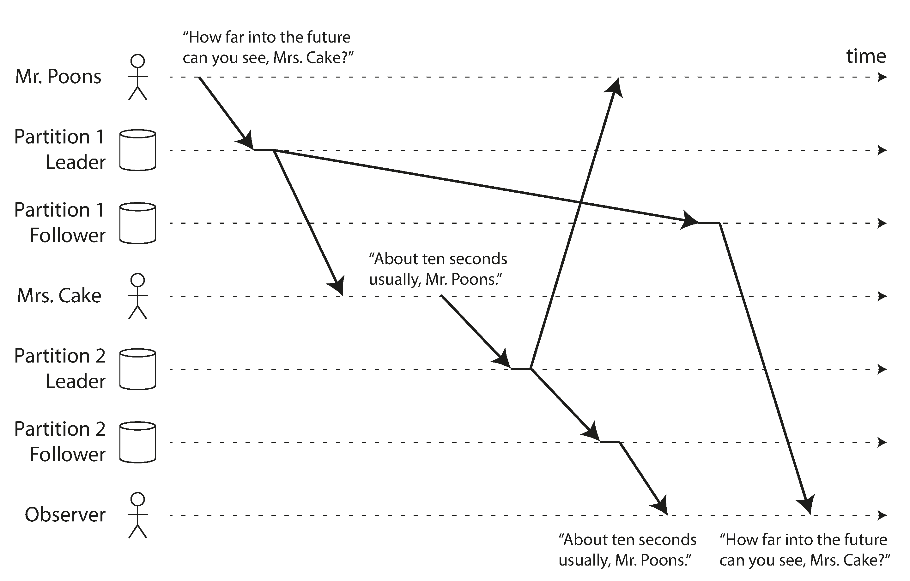

This happens in sharded/partitioned databases because different shards operate completely independently. There is no global ordering of writes across them.

**Consistent Prefix Reads** is a guarantee that prevents this. It ensures that if a sequence of writes happens in a specific order, anyone reading those writes will see them appear in that exact same order.
*   *Solution:* The main workaround is to ensure that any writes that are causally related to each other are written to the exact same partition/shard. (However, in complex applications, this can be extremely inefficient).

---

### Solutions for Replication Lag (The Rise of NewSQL)
When building an eventually consistent application, developers must actively consider what happens if replication lag balloons to minutes or hours. If an application requires guarantees like Read-Your-Writes, pretending that asynchronous replication is synchronous will eventually lead to catastrophic UX bugs. 

**The Burden on Developers:**
Fixing these replication lag anomalies in application code (e.g., manually timestamping client requests, enforcing leader-routing rules, and handling region-aware device sync) is incredibly complex and error-prone. 

**The NoSQL vs NewSQL Debate:**
*   **The NoSQL Era:** In the early 2010s, the NoSQL movement told everyone that to achieve massive scale, you *had* to abandon ACID transactions and accept Eventual Consistency. Developers were forced to handle these terrible anomalies in their application code.
*   **The NewSQL Movement:** Recently, engineers realized this burden was unfair. Systems dubbed "NewSQL" (like CockroachDB, TiDB, or Spanner) emerged. These databases offer the massive fault tolerance, high availability, and horizontal scalability of distributed NoSQL databases, but implement brilliant consensus algorithms to provide **Strong Consistency and ACID Transactions**. They allow developers to treat the massive distributed cluster exactly like a single, perfectly consistent machine.

Despite NewSQL's power, weaker consistency models (Eventual Consistency) remain highly popular because they offer unparalleled resilience to network partitions and possess lower computational overhead than strict transactional systems.

---

### Multi-Leader Replication
The biggest flaw of a Single-Leader architecture is simple: if you cannot connect to the single Leader (due to a network glitch), you cannot write to the database *at all*.

A natural extension is to allow *more than one node* to accept writes. This is called a **Multi-Leader** (or Active-Active / Bidirectional) configuration. 
*   Each Leader acts as a Leader for client writes, but simultaneously acts as a Follower to *other* Leaders to accept their replicated changes.
*   *Note on Synchronous behavior:* A synchronous multi-leader setup defeats its own purpose. If you have two synchronous leaders and the network between them breaks, neither can write. Therefore, you should always assume Multi-Leader replication is **asynchronous**.

#### Geographically Distributed Operation (Multi-Region)
A multi-leader setup rarely makes sense within a single datacenter. The added algorithmic complexity heavily outweighs the benefits. 
However, it shines in a **Geo-distributed** architecture, where you deploy one Leader per geographic region (e.g., one in US-East, one in Europe).

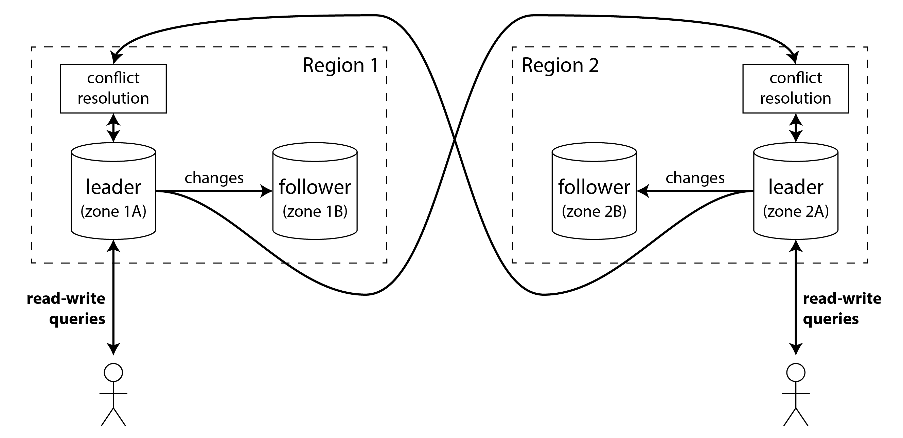

**Comparing Single-Leader vs Multi-Leader in Multi-Region:**

| Feature | Single-Leader (1 Global Leader) | Multi-Leader (1 Leader per Region) |
| :--- | :--- | :--- |
| **Performance** | **Bad:** Every single write by a European user must travel across the Atlantic ocean to hit the US-East leader, adding massive latency. | **Excellent:** European users write instantly to the European leader. The inter-regional network delay is hidden because the replication to the US happens asynchronously in the background. |
| **Tolerance of Outages** | **Moderate:** If the US-East region goes offline, a human must manually perform failover and elevate a European follower to become the new global leader. | **Excellent:** If the US-East region goes offline, the European region simply ignores it and continues operating flawlessly. When the US comes back online, it naturally catches up. |
| **Tolerance of Network Problems** | **Bad:** If the trans-Atlantic undersea cable gets severed, European users are 100% blocked from writing data. | **Excellent:** If the cable is severed, both regions continue taking writes locally. The data syncs whenever the cable is repaired. |
| **Consistency Guarantees** | **Excellent:** A single leader fundamentally prevents you from registering two users with the exact same username, or spending the same bank account balance twice. | **Terrible:** Because both leaders accept writes concurrently, two users could register the exact same username simultaneously on different continents. Both leaders accept the mathematically correct write locally, but cause a major conflict when they try to sync together globally. |

**The Danger of Multi-Leader:**
Because resolving these asynchronous write conflicts is mathematically treacherous, many databases (like MySQL or SQL Server) only support Multi-Leader as a retrofitted or bolt-on feature. Due to the surprising ways it breaks standard database features (like auto-incrementing keys or integrity constraints), operations teams often consider Multi-Leader setups to be dangerous territory to avoid unless absolutely vital for regional latency/availability.

#### Multi-Leader Replication Topologies
A "topology" describes the communication paths writes take to get from one node to another. 
With only two leaders, the topology is simple: Leader 1 sends to Leader 2, and vice versa. With 3 or more leaders, it gets complicated:
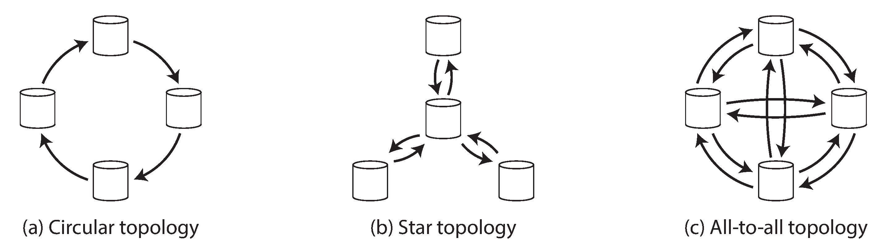

1.  **Circular Topology:** Each node receives writes from one specific node, and forwards them to exactly one other node.
2.  **Star (Tree) Topology:** A central root node broadcasts writes to all other nodes.
3.  **All-to-All Topology:** Every leader sends its writes to every other leader directly.

*Note on Infinite Loops:* In Circular and Star topologies, nodes must forward writes they didn't originate. To prevent an infinite loop where a single write circles the cluster forever, each write is tagged with the unique ID of every node it passes through. If a node receives a write tagged with its own ID, it ignores it.

**Problems with Different Topologies:**
*   **The Single Point of Failure (Circular & Star):** If just *one* node crashes in a Circular or Star topology, it severs the replication chain, leaving the other healthy nodes entirely unable to communicate until the dead node is fixed or manually bypassed.
*   **Causality Problems (All-to-All):** All-to-All is much more fault-tolerant, but suffers from severe causality issues if network links have different speeds. A write might "overtake" another write.
    *   *Example:* Client A sends an `INSERT`. Client B immediately sends an `UPDATE` to that new row. However, due to network congestion, Leader 3 receives the `UPDATE` *before* it receives the `INSERT`, crashing because it is trying to update a row that doesn't exist yet!
    *   *Solution:* This is the exact same problem as Consistent Prefix Reads. Attaching a standard timestamp isn't enough (clocks drift). It requires complex "Version Vectors" to track causality.
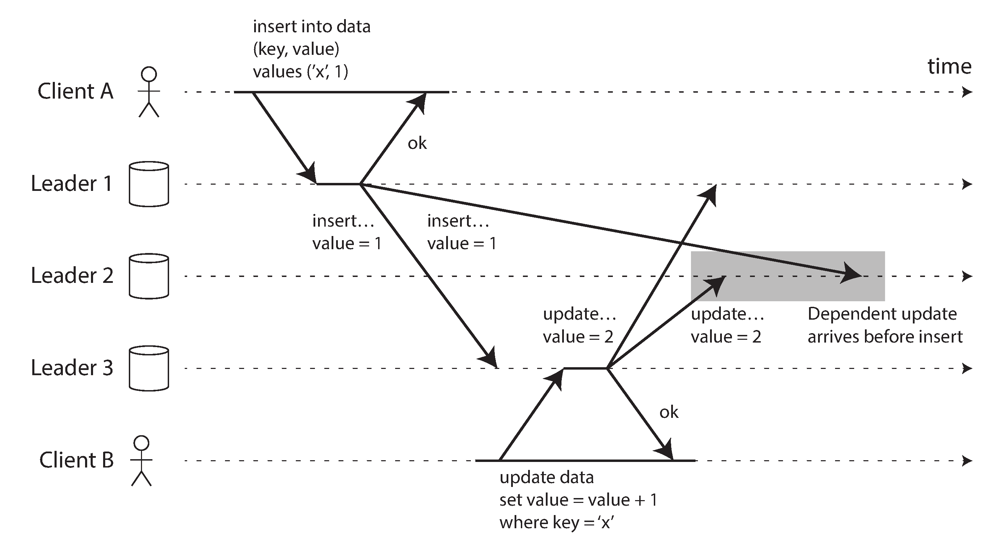

---

### Sync Engines and Local-First Software
You use a multi-leader architecture every single day without realizing it: **offline-capable apps** (like Calendar apps, Notes, Google Docs, Figma).

If you are on an airplane with no Wi-Fi, you can still open your Calendar app, view events, and write a new event. When you land and get Wi-Fi, the app syncs those changes to the cloud server, which then syncs them to your laptop.
*   **The Architecture:** In this scenario, **every single device you own is a "Leader"**. It contains a local database replica that accepts writes.
*   **The Network:** It is literally a Multi-Leader geo-distributed architecture taken to the extreme: every phone is its own "Region", and the network connection between them is measured in *days* of Replication Lag.

#### Real-time Collaboration & Local-First Philosophy
Even when online, apps like Google Docs or Figma use this architecture. When you type a word in Google Docs, your browser doesn't wait for a slow network round-trip to the Google servers to display the letter; the UI updates instantly. Your browser tab acts as a local "Leader", applying the edit locally and simultaneously streaming the replication data to the cloud to be merged with your peers' edits.

**Terminology:**
*   **Sync Engine:** The software library that magically handles capturing these offline edits, waiting for network availability, pushing them to peers, receiving peer edits, merging them locally, and cleanly handling conflicting edits.
*   **Offline-First:** An app deliberately designed to use a Sync Engine so the user can continue full operation when the internet dies.
*   **Local-First Software:** A modern philosophy that takes Offline-First further. Local-first apps are designed so that even if the developer *goes out of business and permanently shuts down their cloud servers*, your app (and your data) will continue to work perfectly forever, because the primary source of truth was always your local device's database, not the cloud. (Git is a perfect example of local-first software).

**Pros and Cons of Sync Engines:**
*   *Pros:*
    *   **Blazing UI Speed:** Reads and writes hit the local disk instantly (rendering data within 16ms), completely hiding network latency.
    *   **Zero Error Handling:** You never have to write UI code to handle HTTP 500 errors or network timeouts when saving data. Local writes almost never fail.
    *   **No "Offline Mode":** Being offline doesn't require separate application logic; the sync engine just treats it as a very long network delay.
*   *Cons:*
    *   **Data Volume Limit:** It is impossible to use a Sync Engine for an e-commerce website where the database contains 10 million products. It strictly requires the entire working dataset to fit on the client's local disk.

---

### Dealing with Conflicting Writes
The absolute biggest nightmare of Multi-Leader replication (whether in massive Geo-distributed datacenters or small Sync Engines on mobile phones) is **Write Conflicts**.

When two leaders concurrently modify the exact same record, a conflict arises that the database must somehow resolve. (This is impossible in Single-Leader databases, because the single leader would simply process one write first, and block or reject the second write).

**Example of a Write Conflict:**
Two users are concurrently editing the same Wiki title. 
1.  User 1 successfully saves the title "B" to their local Leader 1.
2.  User 2 successfully saves the title "C" to their local Leader 2.
3.  Both Leaders asynchronously replicate their changes to each other. When they receive the replication log, they realize they both modified the same field differently. A massive conflict is detected!
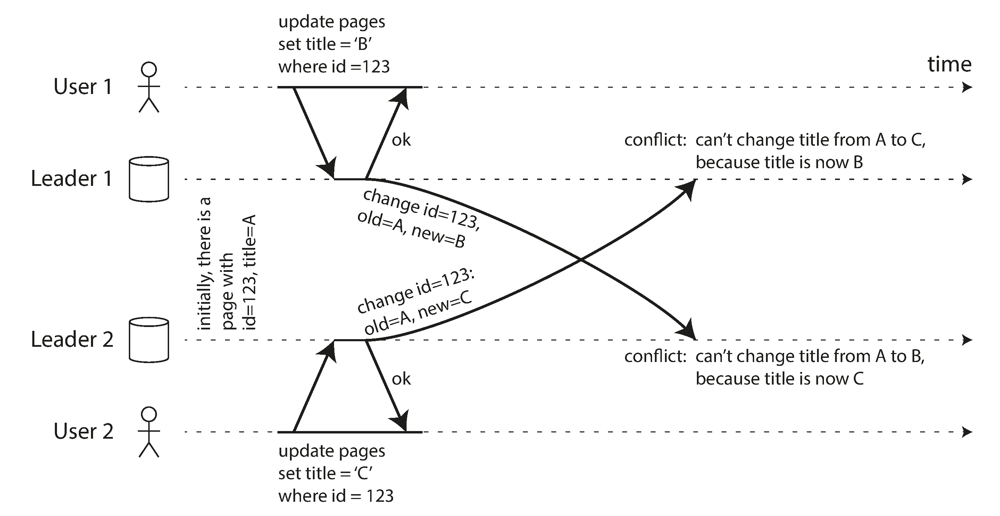

#### Conflict Avoidance
The simplest and most highly recommended strategy for dealing with conflicts is simply *avoiding them from occurring in the first place*.

How do you avoid conflicts in a Multi-Leader Database?
*   **Sticky Routing:** Ensure that all writes for a specific record *always* go through the exact same designated Leader. For example, if a user can only edit their own profile, ensure that User A is *always* routed to the US-East leader, and User B is *always* routed to the Europe leader. From the user's perspective, this acts exactly like a safe, Single-Leader database.
*   *The flaw with Avoidance:* Avoidance completely breaks down if a datacenter fails and you have to re-route User A to the Europe leader while their US-East edits are still propagating across the network.
*   **ID Partitioning:** If you need an auto-incrementing ID in a multi-leader setup, standard incrementing (1, 2, 3) will result in huge conflicts where both leaders assign ID #5 concurrently. You can avoid this by partitioning the work: Leader A strictly assigns odd numbers (1, 3, 5), and Leader B strictly assigns even numbers (2, 4, 6).

#### Last Write Wins (LWW)
If conflicts cannot be avoided, the system is forced to resolve them. The simplest computational method is **Last Write Wins (LWW)**.
*   The database attaches a timestamp to every write. When a conflict occurs between two concurrent writes (e.g. one user wrote "B" and another wrote "C"), the database strictly chooses the write with the highest timestamp as the "winner," and silently discards the other.
*   *The Danger:* LWW guarantees data loss. Because the writes were "concurrent" (happening without knowledge of each other), timestamp order is practically arbitrary. You are actively deleting successfully-committed data.
*   LWW is only safe if you strictly structure your database to *never update records*, and only ever insert unique keys (like UUIDs).

#### Manual Conflict Resolution
Instead of silently dropping data, another approach is to keep both conflicting writes as "Siblings" and force a human to resolve the conflict (exactly how Git merge conflicts work).
*   **Application Code:** When you query the record, the database returns *both* "B" and "C" simultaneously. Your application code can try to merge them mathematically, or surface a UI asking the user to manually pick the correct version to save.
*   *The Flaw:* It is incredibly annoying to force app developers to build complex merging UI, and it often confuses end-users. 
*   *Amazon's Shopping Cart Anomaly:* If you try to manually write a merge algorithm, you can cause wild bugs. Amazon's cart used to merge conflicts by taking the "set union" of both carts. However, if a user deleted a Book on their phone, but simultaneously added a DVD on their laptop, the merging of the two conflicting sibling carts caused the previously-deleted Book to magically reappear!
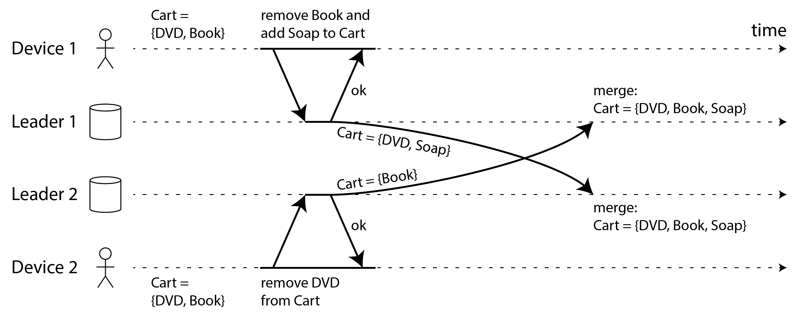

#### Automatic Conflict Resolution
Because building custom merging logic usually introduces new bugs, brilliant computer scientists created algorithms to merge standard data types safely and automatically. Combining eventual consistency with a convergence guarantee is known as **strong eventual consistency**:
*   **Text (CRDTs):** By tracking exact character insertions and deletions (instead of treating the whole text block as one string), concurrent text edits can be flawlessly merged without data loss (this is how Google Docs works).
*   **Collections:** Algorithms can securely merge lists/collections by heavily tracking *deletes* using "Tombstones" (invisible markers saying an item was deleted). This permanently solves the Amazon Shopping Cart bug where deleted items resurrect.
*   **Counters:** Databases can merge distributed counters (like a Tweet's Like button) by mathematically adding/subtracting the exact deltas performed across all nodes, guaranteeing it never double-counts.

If you are building any collaborative Offline-First or Local-First software, relying on these robust Automatic Conflict Resolution algorithms is an absolute necessity.

---

### CRDTs and Operational Transformation (OT)
The two leading families of algorithms used to perform these automatic, flawless merges are **Conflict-free Replicated Datatypes (CRDTs)** and **Operational Transformation (OT)**.

Both algorithms can perfectly merge concurrent edits to text, but they use different philosophies to achieve "strong eventual consistency."

**Example:** Two replicas start with the text "ice". 
*   Replica 1 prepends an "n" (making "nice").
*   Replica 2 appends an "!" (making "ice!").
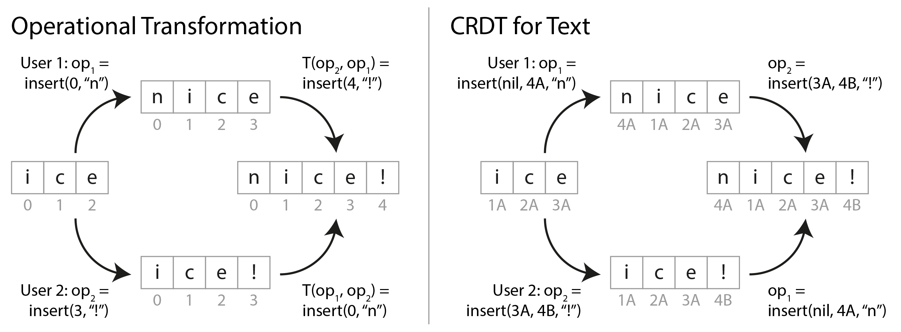

How do the algorithms correctly merge this into "nice!"?

**1. Operational Transformation (OT)**
*   OT tracks edits via **Indexes**.
    *   Replica 1 says: "Insert 'n' at index 0".
    *   Replica 2 says: "Insert '!' at index 3".
*   When they sync, if they just applied the raw indexes, Replica 1 would apply the "!" to "nice" at index 3, resulting in the corrupted string "nic!e".
*   To fix this, the OT algorithm *transforms* the operations. It mathematically calculates that because Replica 1 added a character *before* index 3, Replica 2's target index must be shifted by +1. So it transforms the edit to: "Insert '!' at index 4".
*   *Usage:* Google Docs heavily relies on OT via a central server coordinating the transformations.

**2. Conflict-free Replicated Datatypes (CRDTs)**
*   CRDTs abandon indexes entirely and instead assign a **Unique Immutable ID** to every single character (e.g., "i" is 1A, "c" is 2A, "e" is 3A).
*   Instead of saying "insert at index 3," Replica 2 says: "Insert '!' immediately after character ID 3A".
*   Because the insertion target is a globally unique ID rather than a shifting numerical index, the replicas can sync and apply the edits perfectly without needing to calculate any "transformations" at all.
*   *Usage:* Found heavily in distributed databases (Riak, Cosmos DB, Redis Enterprise) and Sync Engines (Automerge, Yjs).

---

### Types of Conflict
Not all conflicts are as inherently obvious as two users editing the exact same text field or clicking the exact same checkbox. Some conflicts are incredibly subtle.

**The "Booking Room" Anomaly:**
Imagine deeply complex application logic for a Meeting Room Booking System. Discarding the idea of updating a specific "row", let's assume every new booking is simply a new `INSERT` into the database.
1. User A wants to book Room 1 at 10 AM. The app quickly reads the DB, sees no bookings, and issues an `INSERT` to Leader A.
2. User B simultaneously wants to book Room 1 at 10 AM. The app quickly reads the DB, sees no bookings, and issues an `INSERT` to Leader B.

Neither user overwrote the same record. There are no sibling records. To the database, these are perfectly valid, non-colliding `INSERT` operations. However, this is a **massive conflict** because it violates a logical business rule: *Two people cannot physical occupy the same room at the same time.*

There is no quick, ready-made algorithm (like a CRDT or OT) that can automatically resolve this "Phantom" logical conflict. Properly scaling and resolving these types of deep, subtle conflicts requires vastly more complex architectural solutions (which will be heavily covered in later chapters on Transactions).

---

### Leaderless Replication
Thus far, we've discussed replication utilizing Leaders. A totally different architectural approach is to abandon the concept of a "Leader" entirely and allow *any replica* to directly accept writes from clients.

This **Leaderless Replication** model fell out of fashion during the era of Relational Databases, but was heavily resurrected in 2007 when Amazon published the paper on their internal *Dynamo* system. Today, databases inspired by this model (Riak, Cassandra, ScyllaDB) are known as **Dynamo-style** databases.
*(Note: Amazon's modern cloud offering 'DynamoDB' actually uses strictly single-leader replication, despite the name).*

#### Writing to the Database When a Node is Down
In a Single-Leader architecture, if the Leader reboots, you must perform a complex Failover. In a Leaderless architecture, failover simply does not exist.

If you have 3 replicas, and Replica 3 is offline updating its kernel:
*   The client sends their `write` to all 3 replicas in parallel.
*   Replica 1 and 2 accept the write and respond "OK". Replica 3 misses it entirely.
*   The client receives the two "OKs", considers the write successful, and entirely ignores the fact that Replica 3 missed it.
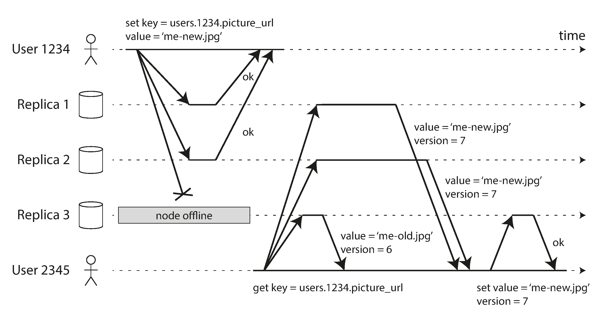

#### Reading & Version Numbers (Solving Stale Data)
When Replica 3 finishes updating and comes back online, it is missing the new data. If a client queries it, they will receive stale, outdated data.
To solve this, clients in a Leaderless system never read from a single node. **Read requests are also sent to several nodes in parallel.**

*   The client receives multiple responses (e.g., getting the new value from Replica 1, and the stale value from Replica 3).
*   *How does it know which is correct?* Every value written must be mathematically tagged with a **Version Number**. The client simply discards the response with the lower version number.

#### Catching up on Missed Writes
Since there is no "Leader", how does Replica 3 ever catch up and receive the data it missed? Dynamo-style databases use several mechanisms:
1.  **Read Repair:** When a client does a parallel read and notices that Replica 3 returned a stale version 6 (while Replicas 1 and 2 returned version 7), the *client itself* turns around and writes version 7 back into Replica 3 to fix it. This works wonderfully for frequently-read data.
2.  **Hinted Handoff:** While Replica 3 was down, Replica 2 accepted the writes on its behalf, storing them in a temporary "hint" file. When Replica 3 comes back online, Replica 2 acts as a good neighbor, hands over the hint file to push the updates, and deletes local hints.
3.  **Anti-Entropy Process:** A continuous background process on the servers that constantly compares the mathematical differences in data between replicas and quietly copies over missing data (this process doesn't care about order, and can have significant delays).

#### Quorums for Reading and Writing
In the example above, we considered the write "successful" because 2 out of 3 replicas accepted it. How far can we push this? Can we get away with only 1 replica accepting it?

This brings us to **Quorums**. If you know that every write is physically guaranteed to live on *at least* 2 out of 3 nodes, you can safely deduce that if you read from *at least* 2 nodes, it's mathematically impossible to miss the latest data. 

**The Quorum Formula:**
If you have **n** total replicas:
*   Let **w** = the number of nodes that must confirm a write for it to be successful.
*   Let **r** = the number of nodes you must query during a read to consider it successful.

As long as **w + r > n**, you are mathematically guaranteed to get an up-to-date value when reading, because the set of nodes you wrote to and the set of nodes you read from MUST overlap. These are called **Quorum Reads and Writes** (effectively, the minimum "votes" required).

*   *Typical configuration:* If `n=3`, a common setup is `w=2` and `r=2`. 
*   *Tolerating Outages:* Because `2 < 3`, you can successfully process writes even if an entire node is dead and unreachable.
*   *Tuning for Speed:* If you have massive read-heavy traffic, you could configure `w=3` and `r=1`. Reading from 1 node is incredibly fast! However, the trade-off is brutal: if a single node dies, your `w=3` requirement can't be met, meaning your entire database is paralyzed and cannot accept any writes until the node is fixed.
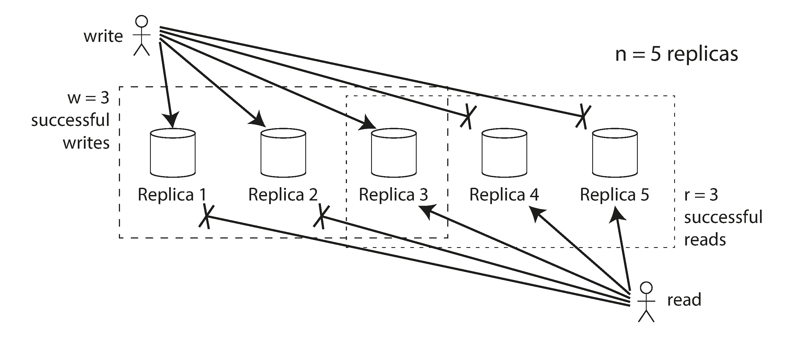
