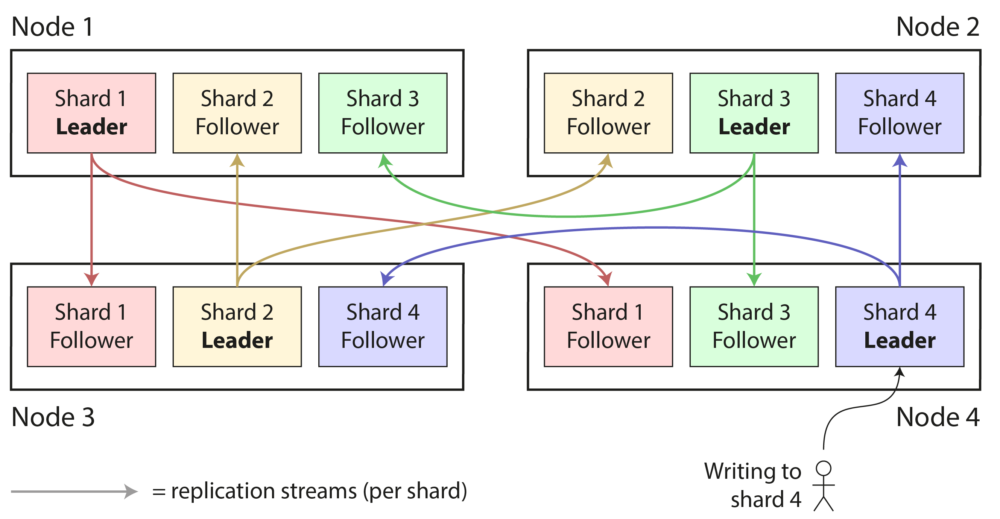
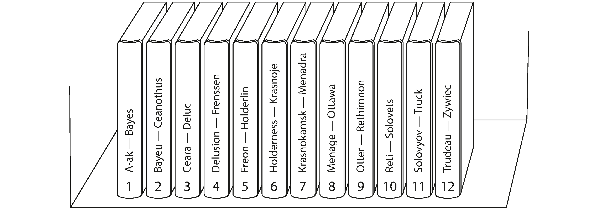
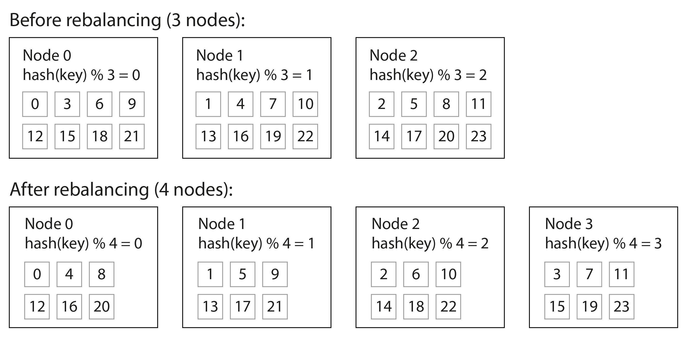
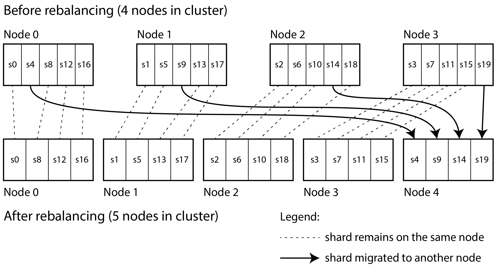
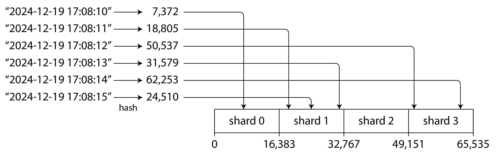
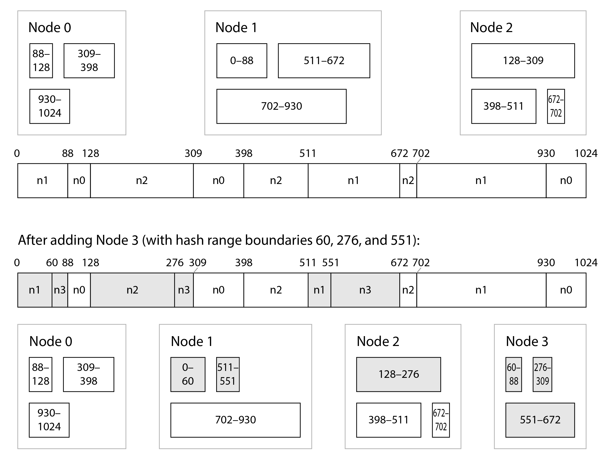
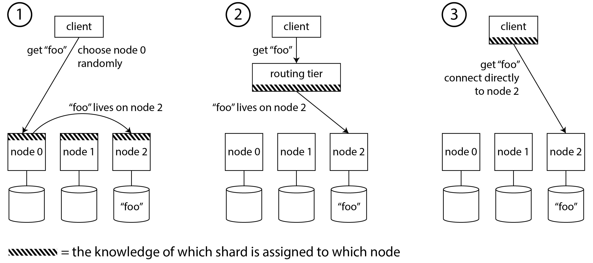
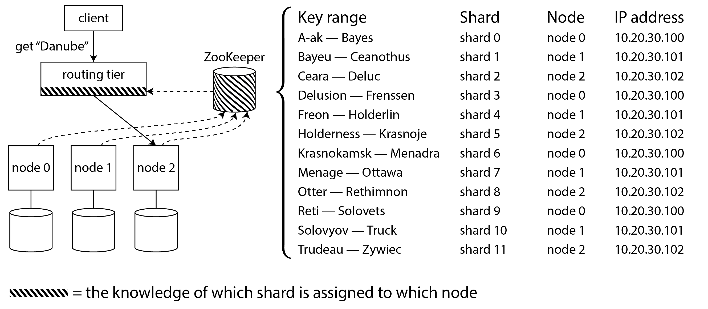
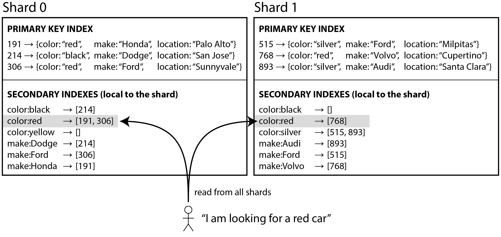
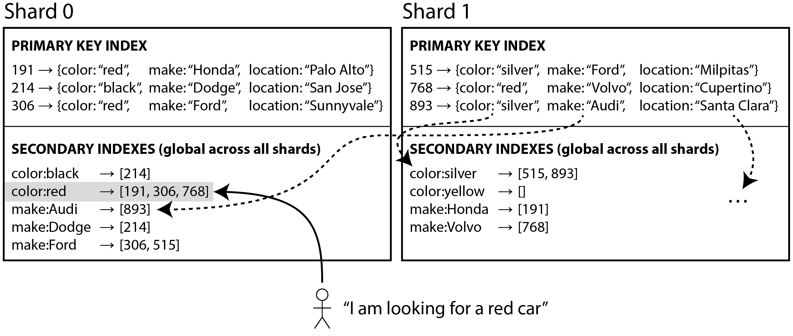

# Chapter 7: Sharding

At a certain scale, adding more replication doesn't help if your database is fundamentally too large or handles too many writes for a single machine. The solution is **Sharding** (also known as Partitioning).

*   **Replication** = Having a copy of the *same* data on multiple nodes.
*   **Sharding** = Splitting up a large dataset into smaller chunks (shards) and assigning them to *different* nodes. Every piece of data belongs to exactly one shard.

Usually, sharding and replication are combined. A single physical node might act as the "Leader" for Shard A, but simultaneously act as a generic "Follower" for Shard B.

#### Terminology
What this book calls a "Shard" goes by many different names depending on the database:
*   **Partition:** Kafka
*   **Region:** HBase, TiDB
*   **Tablet:** Bigtable, Cassandra, Spanner
*   **vNode / Token-Range / vBucket:** Riak, Cassandra, Couchbase

*(Note: "Partitioning" data has absolutely nothing to do with "Network Partitions", which are a type of fault where nodes lose connection to each other).*

---

### Pros and Cons of Sharding
*   **Pros:**
    *   **Massive Scalability (Scale-out):** Allows your database to handle infinite data volume and write throughput via horizontal scaling (adding thousands of cheap machines) rather than vertical scaling (buying one incredibly expensive supercomputer).
    *   **Hardware Parallelism:** You can even use sharding on a single physical machine (e.g. running one shard per CPU core) to maximize parallel processing in modern NUMA architectures (e.g., Redis, VoltDB).
*   **Cons (The Complexity Tax):**
    *   **The Partition Key:** You must cleanly decide exactly how to route data to shards by choosing a Partition Key. If you know the key, queries are blazing fast. If your query *doesn't* include the partition key, you are forced to inefficiently search *every single shard* in the cluster.
    *   **Joins and Transactions:** Relational joins become a nightmare. Furthermore, if a single transaction needs to update data living on two different shards, it requires a "Distributed Transaction", which is notoriously slow, complex, and often completely unsupported.

***Recommendation:*** Sharding introduces massive architectural complexity. Unless your data volume or write throughput is so gargantuan that it literally cannot fit into a single modern machine, you should avoid sharding and stick to a simpler, single-shard database if possible.

---

### Sharding for Multitenancy
In modern SaaS applications, you often have hundreds of completely independent corporate customers (Tenants). You can utilize sharding by assigning each Tenant its own dedicated logical shard (or grouping small tenants into shared shards).

**Advantages of Tenant-based Sharding:**
*   **Resource Isolation:** A heavy algorithmic query run by Tenant A won't consume the CPU of Tenant B (preventing the "Noisy Neighbor" problem).
*   **Permission Isolation:** A severe security bug in the application logic is much less likely to accidentally leak Tenant A's private data to Tenant B if they are physically isolated in different databases.
*   **Cell-based Architecture:** You can group tenants into isolated "cells." If an infrastructure layer crashes, the blast radius is contained. Only one cell goes down, leaving the rest of your customers perfectly online.
*   **Per-Tenant Administration:** You can take a snapshot backup of a single customer, or instantly export/delete a customer's entire dataset to perfectly comply with GDPR "Right to be Forgotten" regulations.
*   **Data Residency:** You can strictly bind a European tenant's shard to a German datacenter to easily comply with local data sovereignty laws.
*   **Gradual Rollouts:** Schema migrations can be rolled out to exactly 1% of tenants to test for bugs before affecting the entire company.

**Disadvantages of Tenant-based Sharding:**
*   **The "Whale" Tenant:** If one massive enterprise customer grows so large that their data exceeds the capacity of a single machine, the entire tenant-sharding model breaks down. You must now painfully shard data *within* that specific tenant's shard.
*   **Overhead:** Giving millions of tiny "freemium" user-tenants their own dedicated shards creates massive, unjustifiable administrative overhead.
*   **Cross-Tenant Analytics:** Running a global ML model across all customers becomes excruciatingly difficult if the data is hard-siloed across hundreds of separate physical shards.

---

### Sharding of Key-Value Data
How do you actually decide which record goes to which shard? 
The goal is to spread the load perfectly evenly. If 10 nodes share the load equally, you can handle 10x the traffic.
*   **Skew & Hot Spots:** If the sharding algorithm is unfair, one shard might receive 90% of the traffic while the other 9 nodes sit idle. This unbalanced scenario is called **Skew**. The overloaded node is called a **Hot Spot** (and if it's caused by a single heavily-accessed record like a celebrity's social media profile, it's called a **Hot Key**).
*   **The Partition Key:** To achieve balance, the database passes a specific column/field (the Partition Key) into an algorithm to determine its destination shard.

#### 1. Sharding by Key Range
The simplest method is assigning a continuous range of keys to each shard (exactly like how volumes of a physical encyclopedia are broken up: Vol 1 is A-B, Vol 2 is C-D, etc.).

*   *Advantages:* Because keys are kept in sorted order within the shard, **Range Scans** are incredibly fast and easy. If your Partition Key is a timestamp, querying "Get all events from July 1st to July 31st" is blazing fast because they are all physically located next to each other on the exact same shard.
*   *Disadvantages:* Range sharding guarantees **Hot Spots** if your partition key is a timestamp. If you shard by Day, all write traffic for *Today* goes to exactly one shard, perfectly overloading it while yesterday's shards sit completely idle. 
    *   *Workaround:* Prefix the timestamp with another value (like Sensor ID). Write load is spread across shards by Sensor ID, but querying a specific Sensor's historical data remains fast.

**Rebalancing Key Ranges**
As a database grows, ranges must adapt:
*   *Pre-splitting:* If you know your data mathematically, you can manually define the shard boundaries on day 1 (used by HBase/MongoDB).
*   *Dynamic Splitting:* The database monitors the shards. If a shard reaches a hard limit (e.g. 10 GB), the database automatically splits it down the middle into two smaller shards (just like a B-Tree). This elegantly adapts to data volume.
*   *The Catch:* Splitting a shard is a brutally intensive background operation. It forces a massive amount of disk I/O at the exact moment the shard is already cracking under high load. It requires all of its data to be rewritten into new files, similarly to a compaction in a log-structured storage engine

#### 2. Sharding by Hash of Key
If your app doesn't require Range Scans, the absolute best way to eliminate Skew and uniformly distribute data is to run the Partition Key through a Hash Function.

A good 32-bit hash function takes incredibly similar input strings and outputs wildly different, perfectly uniform random numbers. (It doesn't need to be cryptographically secure; MongoDB uses MD5, Cassandra uses Murmur3). For example, in Java’s `Object.hashCode()` and Ruby’s `Object#hash`, the same key may have a different hash value in different processes, making them unsuitable for sharding

**The Modulo N Problem**
Once you have the hash, how do you map it to a node?
The amateur attempt is to take `hash(key) % N` (where N is the total number of nodes). If you have 10 nodes, this neatly spits out a node ID from `0-9`.
*   **The Disadvantage:** Modulo N is a catastrophic design flaw if the cluster ever changes size. If you add an 11th node, `hash % 10` evaluates entirely differently than `hash % 11`. Almost every single piece of data in the entire database will suddenly belong to the wrong node, triggering a massive, unnecessary reshuffling of terabytes of data across the network just to rebalance.

#### 3. Fixed Number of Shards
Since Modulo N is broken, a popular alternative (used by Elasticsearch, Riak, Couchbase) is to create drastically more shards than there are physical nodes right on day 1.
*   *How it works:* You have 10 nodes. You immediately create 1,000 shards. Each node gets exactly 100 shards. You assign keys to shards using `hash(key) % 1000`. 
*   *Rebalancing:* When you add an 11th node, the math (`hash % 1000`) *doesn't change.* The system simply plucks 9 existing shards from each of the old nodes and hands them to the new node so everyone has roughly ~90 shards. You are just moving the physical location of the shards, not changing the mathematical mapping of keys to shards.

**The Downside of Fixed Shards:**
You must guess your final massive scale perfectly on Day 1. If you guessed 1,000 shards, you can never scale beyond 1,000 nodes.
*   If your dataset stays tiny, you have 1,000 microscopic shards creating immense administrative overhead.
*   If your dataset grows monstrous, your 1,000 shards become physically too massive, making transferring them to a new node painstakingly slow. 

#### 4. Sharding by Hash Range
To get the best of both worlds (eliminating hotspots with hashes, but dynamically scaling like key ranges), databases like DynamoDB and MongoDB offer **Hash Range Sharding**.

Instead of assigning a *continuous block of keys* to a shard, you assign a *continuous block of hashes* to a shard.
*   Shard 0 handles hashes `0000` to `1111`
*   Shard 1 handles hashes `1112` to `2222`

Like standard Key-Range sharding, when a shard gets too large, it automatically splits down the middle. This allows the cluster to handle infinite growth without you needing to perfectly guess the shard count on Day 1.

The downside compared to key-range sharding is that range queries over the partition key are not efficient, as keys in the range are now scattered across all the shards. However, if keys consist of two or more columns, and the partition key is only the first of these columns, you can still perform efficient range queries over the second and later columns: as long as all records in the range query have the same partition key, they will be in the same shard.

**The Cassandra / ScyllaDB Variant:**
Cassandra takes this further. Instead of having cleanly split, evenly distributed hash boundaries, Cassandra splits the entire hash circle into random boundaries, resulting in many small and large ranges. It then gives each physical node *dozens* of these random ranges (vNodes). Since each node possesses so many random ranges, the statistical law of averages guarantees that every node holds an effectively equal amount of data, while vastly simplifying the math regarding how to redistribute data when a node crashes or is added.

*(Sidebar: Remember that using a Hash obliterates Range Scans. If your partition key is hashed, finding "Dates between July 1 and July 3" requires scanning the entire global cluster. Databases mitigate this by using a Compound Key. The first column is hashed to determine the Shard. The second column is used to sort the data strictly within that one Shard, enabling rapid range scans as long as you filter by the exact first column).*

---

### Consistent Hashing
**Consistent Hashing** is an algorithm designed to fix the Modulo N problem. It distributes data in a way that satisfies two rules:
1.  Keys are distributed roughly equally across shards.
2.  When the number of shards changes (a node crashes or is added), *only the absolute minimum number of keys are moved*. 

*(Note: "Consistent" here has absolutely nothing to do with Replica Consistency from Chapter 6, or ACID Consistency from Chapter 8. It simply implies the key consistently stays in its assigned shard unless absolutely forced to move).*

There are several competing algorithms to achieve this, including Rendezvous Hashing, Jump Consistent Hash, and Cassandra's token-ring variant. 

---

### Skewed Workloads and Relieving Hot Spots
Having a perfect Consistent Hashing algorithm guarantees that your *Keys* are uniformly distributed across servers. However, this does NOT guarantee your *Load* will be uniformly distributed. 

**The Celebrity Problem:**
If there are 1,000,000 normal users on Shard A, and exactly 1 Celebrity with 50 million active followers on Shard B, Shard B will melt down under extreme read/write load despite holding only 1 "key". This is a severe Hot Spot caused by highly skewed application behavior.

**Application-Level Mitigations:**
If a specific key is known to be astronomically hot, you can't rely on the database's automatic hashing. You must intervene at the application code level via **Key Splitting**:
1.  *Salt the Key:* Append a random 2-digit number (00-99) to the end of the celebrity's ID before writing. `User_402_99`.
2.  *The Result:* This splits the single celebrity's writes perfectly evenly across 100 different physical keys, which hash to dozens of different independent physical shards. The brutal write bottleneck is eliminated.
3.  *The Downside:* To read the celebrity's profile, the application must run 100 simultaneous parallel reads across the global cluster, combine all 100 responses, and serve them to the user. This severely degrades read performance.

This technique is messy. You must maintain bookkeeping logic to know *which* keys are currently hot enough to require splitting, and hot keys change dynamically over time. Cloud providers like Amazon offer automated "Heat Management" algorithms to dynamically scale and partition these unpredictable spikes behind the scenes.

---

### Operations: Automatic or Manual Rebalancing
When a shard becomes too large and splits, or when a node is added/removed, the database must **Rebalance** by transferring massive gigabytes of data between nodes over the network. Should this happen automatically?

**Fully Automatic Rebalancing**
*   *Pros:* Extremely convenient. Cloud systems like DynamoDB can detect a sudden traffic spike and automatically spin up new shards and rebalance data within minutes without any human intervention.
*   *Cons (The Danger):* Rebalancing is a brutally intensive network and CPU operation. If the automation triggers during peak traffic due to a false alarm (e.g., a node is temporarily slow, the cluster assumes it is dead, and frantically begins reshuffling terabytes of data to "save" it), the massive network load of the rebalance can actually crash the remaining healthy nodes, triggering a catastrophic cascading failure across the entire datacenter.

**Manual (Human-in-the-loop) Rebalancing**
Systems like Couchbase or Riak will automatically *calculate* the optimal new shard layout, but will halt and require a human administrator to click "Commit" before the gigabytes of data begin moving.
*   *Pros:* Significantly safer. It prevents automated cascading failures. It also allows Ops teams to preemptively rebalance a cluster *before* a scheduled traffic spike (like Cyber Monday or the World Cup) rather than a totally reactive automatic algorithm panicking mid-spike.

---

### Request Routing
Once you have split your data into hundreds of shards across dozens of nodes, a final glaring issue remains: When a client wants to read or write a specific key, how do they actually know which physical IP address and Port holds that specific shard?

Unlike generic web application servers (where a Load Balancer can blindly send a request to *any* stateless server), database routing must be highly precise. 

There are three high-level architectures for Routing:
1.  **Node Forwarding (Gossip):** The client sends a request to a completely random node. If that node owns the shard, it handles it. If not, it forwards the request to the correct node, receives the reply, and passes it back to the client. (Used by Cassandra/Riak).
2.  **Routing Tier (Proxy):** The client sends all requests to a dedicated Routing Proxy. The proxy itself doesn't store data; it just acts as a shard-aware load balancer that instantly forwards the request to the correct IP. (Used by MongoDB's `mongos`).
3.  **Client-Aware Routing:** The database driver installed directly inside the client application downloads the routing map. The client connects perfectly directly to the correct node without any intermediary hops. (Used by Redis Cluster).

#### Service Discovery and ZooKeeper
Regardless of which of the 3 architectures you use, *something* in the system needs to maintain the authoritative map of exactly which shard currently lives on which physical node. And this map constantly changes as nodes reboot or shards rebalance.

To track this routing map perfectly without encountering Split Brain or fatal desyncs, many databases rely on a separate, dedicated Coordination Service (like **Apache ZooKeeper** or **etcd**).
*   ZooKeeper utilizes incredibly strict Consensus Algorithms (discussed later in Chapter 10) to maintain an uncorruptible, highly available mapping of shards to nodes.
*   Every database node registers itself with ZooKeeper.
*   The Routing Tier (or a Client-Aware driver) simply subscribes to ZooKeeper. Whenever a shard changes ownership or a node reboots, ZooKeeper instantly notifies the routing tier to update its internal maps.

*(Note: While HBase, Solr, Kafka, and Kubernetes rely heavily on separate coordinators like ZooKeeper or etcd, some modern databases like TiDB, YugabyteDB, and ScyllaDB have now effectively embedded these Consensus Coordination algorithms directly into their own internal architecture, removing the need to manage a separate ZooKeeper cluster).*

---

### Sharding and Secondary Indexes
Thus far, we've discussed looking up records specifically by their Primary Key (Partition Key). This is easy because the partition key determines exactly which shard holds the data.

However, the situation degrades rapidly if your application requires **Secondary Indexes** (e.g., "Find all red cars" or "Find all articles by user 123"). Secondary indexes are the backbone of relational databases and search engines, but they do not map neatly to shards because a secondary index tracks *searchable values*, not primary keys.

There are two main approaches to handling secondary indexes in a sharded database:

#### 1. Local Secondary Indexes (Document-Partitioned)
In this model, every single shard acts completely independently. It maintains its own internal secondary index covering *only* the data stored inside itself. It doesn't know or care what the other shards are doing.

*   **Writing (Blazing Fast):** If you add a "Red Car" to Shard 1, Shard 1 instantly updates its own internal `color:red` index. No network coordination with other shards is required.
*   **Reading (Scatter-Gather / Extremely Slow):** Because the query "Find all red cars" doesn't specify a primary key, the routing tier has absolutely no idea which shard holds red cars. Therefore, it fires the query at *every single shard* in the entire global cluster in parallel. It must wait for all shards to respond, gather their local results, merge them, and return them.
    *   *The Problem:* This is called "Scatter-Gather" querying. Because querying requires hitting every shard, this query suffers heavily from **Tail Latency Amplification**. Just one slow shard out of 100 will drastically slow down the entire search. Even though you add more nodes, your overall query throughput does not improve because every node is forced to process every search.
*(Used by: MongoDB, Riak, Cassandra, Elasticsearch).*

#### 2. Global Secondary Indexes (Term-Partitioned)
Rather than each shard keeping a localized index, the database maintains a single **Global Index** covering data from all nodes. However, since a global index would instantly melt a single machine, the global index itself is *also sharded*.

It gets sharded by the Search Term (e.g., Colors A-R go to Shard 0, Colors S-Z go to Shard 1).

*   **Reading (Blazing Fast):** A query for "Find all red cars" hashes the word "red" and instantly routes the query to exactly one shard (Shard 0) which contains the complete, authoritative list of all red car IDs globally.
*   **Writing (Slow and Error-Prone):** Because the index is global, adding a single new car might involve updating the main data on Shard 0, updating the Make index on Shard 2, and updating the Color index on Shard 4. These distributed writes are complex and very difficult to keep in perfect sync mathematically. Many databases (like DynamoDB) only update global indexes *asynchronously*, meaning a user might add a Red Car but then momentarily be unable to see it in the search results until the global index catches up (Replication Lag).

*Global secondary indexes are incredibly powerful for read-heavy apps, but the complexity of keeping them synchronized during writes forces engineers to explicitly orchestrate distributed transactions or accept eventual consistency.*
