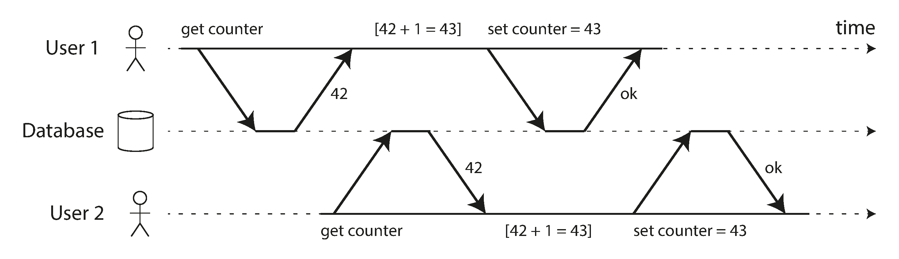
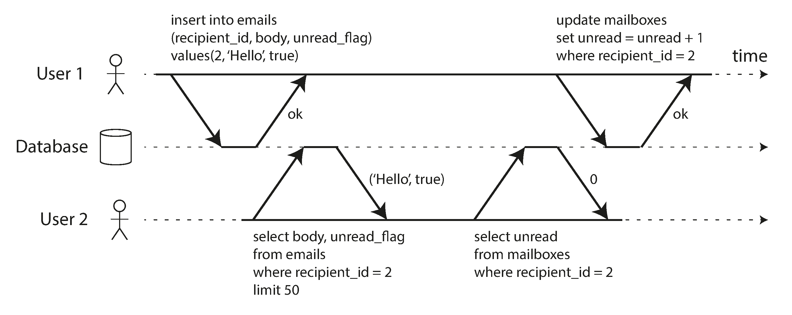
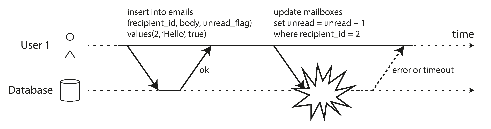

# Chapter 8: Transactions

In the harsh reality of distributed data systems, things constantly go wrong:
*   Databases or hardware can fail mid-write.
*   Applications can crash halfway through a complex operation.
*   Network interruptions can suddenly sever connections.
*   Multiple clients can concurrently write to the exact same data, overwriting each other.
*   Clients can read data that is only partially updated and makes no logical sense.

Handling all of these potential failures perfectly in application code is an impossible amount of work. To simplify this, databases offer **Transactions**.

### What Exactly is a Transaction?
A transaction is a way for an application to group several reads and writes together into a single, logical unit. 
Conceptually, all operations in a transaction are executed as *one single operation*:
1.  **Commit:** Everything succeeds perfectly.
2.  **Abort / Rollback:** If *anything* fails, the entire transaction is cancelled, and the database perfectly unwinds any partial writes that occurred. 

Because of this, the application never needs to worry about "partial failures" (where money was deducted from Account A, but the database crashed before adding it to Account B). If it fails, the application simply retries blindly, knowing the database kept things safe. 

*(Note: Transactions are not laws of physics. They are simply an artificial programming model built by database engineers to provide "safety guarantees" so application developers don't have to code around hardware failures).*

#### A Brief History of Transactions
*   **The Relational Era (1975+):** Almost all modern SQL databases built their transactional engines directly matching the style established by IBM System R in 1975.
*   **The NoSQL Rebellion (Late 2000s):** As developers demanded massive horizontal scalability and sharding, a popular myth emerged that Transactions were "fundamentally unscalable." The NoSQL movement abandoned transactions completely, forcing developers to handle race conditions and partial failures manually in application code.
*   **The NewSQL Renaissance (Modern):** The myth was shattered. Systems dubbed "NewSQL" (such as Google Spanner, CockroachDB, TiDB, Yugabyte) proved that you *can* have both. By combining massive global sharding with strict Consensus protocols, they provide ironclad ACID transactions at planetary scale.

---

### The Meaning of ACID
The safety guarantees provided by transactions are universally described by the acronym **ACID** (Atomicity, Consistency, Isolation, Durability), coined in 1983. 
*(Note: Today, "ACID compliant" has sadly become a vague marketing term. Different databases implement "Isolation" entirely differently. Systems that explicitly abandon ACID are sometimes called BASE—Basically Available, Soft state, Eventual consistency—which essentially just means "Not ACID").*

#### A: Atomicity (Abortability)
In multi-threaded programming, "atomic" means a thread cannot see half-finished work. In the context of ACID databases, **Atomicity has nothing to do with concurrency**.

ACID Atomicity describes what happens if a client executes a sequence of writes, and a fault occurs halfway through (e.g., the network drops, or a disk fills up). 
*   If grouped in a transaction, the database guarantees it will **Abort / Rollback** the entire transaction, flawlessly discarding every partial write that occurred before the crash. 
*   Because of this, the application natively knows that if a transaction returns an error, *absolutely nothing* was changed in the database, meaning it is 100% safe to blindly retry the transaction without fear of accidentally duplicating data.
*(A far better word for this would have been "Abortability").*

#### C: Consistency
The word "Consistency" is the most terribly overloaded term in computer science (Replica Consistency, Consistent Hashing, CAP Theorem Consistency). 

In the context of ACID, **Consistency refers to application-specific Invariants** (statements about your data that must always be true).
*   *Example:* In an accounting system, credits and debits across all accounts must always balance to zero.
*   If a transaction starts in a valid state, and completes in a valid state, the database has maintained "Consistency."
*   *The Catch:* The database has no idea what your business logic is. While it can enforce basic rules (like Foreign Keys or Uniqueness constraints), the C in ACID largely relies on the application developer writing correct transactions. It is not a property of the database alone.

#### I: Isolation
Most databases are accessed concurrently by dozens of clients. If two clients try to access the exact same record simultaneously, you get a "Race Condition."
*   *Example:* Two users simultaneously read a counter at `42`, add 1 in their app, and write back `43`. The counter should be `44`. 

**Isolation** guarantees that concurrently executing transactions cannot step on each other's toes. 
*   In classic database theory, perfect isolation is called **Serializability**. It guarantees that even if 100 transactions are running perfectly in parallel, the final result will be identical as if they had run *serially* (queued up one at a time).
*   *The Catch:* Perfect serializability is incredibly slow. Because of the performance cost, almost all databases (even Oracle) use weaker isolation levels (like "Snapshot Isolation") by default, intentionally allowing some obscure race conditions to occur in exchange for blazing speed.

#### D: Durability
**Durability** is the promise that once a transaction successfully reports "Committed," the data will never be lost, even if someone immediately unplugs the database from the wall.
*   *Single-Node DBs:* It means the data has been physically written to non-volatile disk/SSD, usually by forcing an `fsync()` system call, and appending it to a Write-Ahead Log to repair corrupted files upon reboot.
*   *Replicated DBs:* It means the data has been successfully copied across the network to multiple nodes.

**The Reality of Perfect Durability:**
"Perfect" durability does not exist; there are only risk-reduction techniques:
1.  If you write strictly to one disk, and that physical disk's controller dies, the data is unrecoverable until the hardware is manually fixed.
2.  If you replicate across the network to memory but don't force it to disk, a datacenter-wide power outage wipes everything instantly.
3.  SSDs have notorious firmware bugs where `fsync` silently fails, or where disconnected SSDs bleed data away after a few months.
4.  Data on disks can experience silent "Bit Rot", slowly corrupting active replicas and backups over years.
5. Subtle interactions between the storage engine and the filesystem implementation can lead to bugs that are hard to track down, and may cause files on disk to be corrupted after a crash. Filesystem errors on one replica can sometimes spread to other replicas as well.
6. Data on disk can gradually become corrupted without this being detected. If data has been corrupted for some time, replicas and recent backups may also be corrupted. In this case, you will need to try to restore the data from a historical backup.

True durability requires a layered defense: `fsync` to disks + network replication + offsite historical backups.

---

### Single-Object and Multi-Object Operations
To recap, Atomicity and Isolation are deeply tied to the concept of a **Multi-Object Transaction**. 

A Multi-Object Transaction is required when your application needs to modify several pieces of data that *must* be kept in sync. 
Example: An email application where you insert a new Email record into the `emails` table, but also must update a denormalized `unread_count` integer on the `users` table.

**Why Isolation is Needed:**
If you don't use a transaction, User 2 might refresh their screen at the exact millisecond after the email was inserted, but *before* the counter was incremented. They see the email in their inbox, but their notification badge incorrectly says 0. The database is in an inconsistent halfway state.

**Why Atomicity is Needed:**
If a system crash or network error occurs the instant after the email is inserted but *before* the counter is incremented, the write fails. In a non-ACID database, you are permanently left with phantom emails and a permanently corrupt notification counter. With an Atomic transaction, the database safely rolls back the inserted email.

#### Grouping Operations Together
To perform a multi-object transaction, the database needs a way to know exactly which writes belong together.
*   **Relational Databases:** The grouping is bound to the client's physical TCP connection. Everything sent between a `BEGIN TRANSACTION` and a `COMMIT` statement is tracked as a single unit. If the TCP connection unexpectedly drops mid-way, the DB automatically aborts the transaction.
*   **Non-Relational (NoSQL):** Finding a `BEGIN TRANSACTION` command in NoSQL is rare. Even if a Key-Value store provides a "multi-put" API to update several keys at once, you must read the documentation carefully. Often, these APIs lack true transaction semantics; if it fails, some keys may have successfully updated while others failed, abandoning you in a corrupted state.

---

### Single-Object Writes
Atomicity and Isolation don't just apply to updating *multiple* records; they are absolutely critical when modifying a *single* object.

Imagine writing a 20 KB JSON document to a database, and the power fails after exactly 10 KB is written. If the database didn't have Atomicity at the single-record level, a subsequent read would return half a document (an unparseable corrupted mess). 
To prevent this, storage engines go to great lengths to ensure single objects are written automatically (e.g., using a Write-Ahead Log) and isolated (e.g., placing a temporary lock on the row so nobody reads it while it is actively being overwritten).

**Advanced Single-Object Operations:**
Many databases provide advanced operations that act atomically on a single record to prevent race conditions:
1.  **Atomic Increments:** Removes the need for the dangerous "read-modify-write" logic shown in Figure 8-1. The database natively handles the math atomically.
2.  **Compare-and-Set (CAS):** A conditional write. "Update this JSON document, but *only* if nobody else has touched it since the last time I read it."

*(Note: These single-object guarantees are sometimes marketed heavily by NoSQL databases—like Aerospike's "strong consistency" or Cassandra's "lightweight transactions"—but these are NOT true multi-object transactions).*

### The Need for Multi-Object Transactions
Could we build an application completely without true multi-object transactions, relying solely on single-record updates? Technically yes, but it is incredibly difficult because most data paradigms require coordinating multiple objects:
1.  **Relational:** `Foreign Keys`. If inserting a child, the parent must exist.
2.  **Document:** `Denormalization`. If you lack `JOINs`, you denormalize your data (like the unread counter in Figure 8-2). Denormalized data inherently requires updating several separate documents in sync.
3.  **Indexes:** `Secondary Indexes`. Every time you change a value, the underlying data *and* the secondary index must both be updated. Without transactions, the index can go out of sync with the raw data.

### Handling Errors and Aborts (Retries)
The entire philosophical point of an ACID Transaction is that it is safe to **Abort**. If the database is in danger of violating ACID, it would rather abandon the entire transaction than let it remain half-finished.

Because of this safety net, an application's primary error-handling mechanism should simply be to **Retry** the aborted transaction. Unfortunately, many popular ORMs (like Django or Ruby on Rails) do not auto-retry aborted transactions; they simply throw an exception and discard the user's input.

**The Danger of Blind Retries:**
While simple, blindly retrying transactions in code isn't perfect:
1.  **Network Timeouts:** The transaction *succeeded* in the database, but the network crashed before the "Success" message reached your app. If your code blindly retries, it will accidentally execute the command a second time (requiring idempotency mechanisms).
2.  **Cascading Overload:** If the database threw an error because it was completely out of memory and melting down under heavy contention, 100 clients instantly and aggressively "retrying" their transactions will immediately kill the database completely. (Use Exponential Backoff).
3.  **Permanent Errors:** If the attempt failed because of a Constraint Violation (e.g. Username Already Exists), retrying will never work.
4.  **External Side Effects:** If your transaction logic includes shooting off an email via the SendGrid API, and the database transaction aborts and retries 3 times, you just accidentally sent 3 identical emails to the customer.
