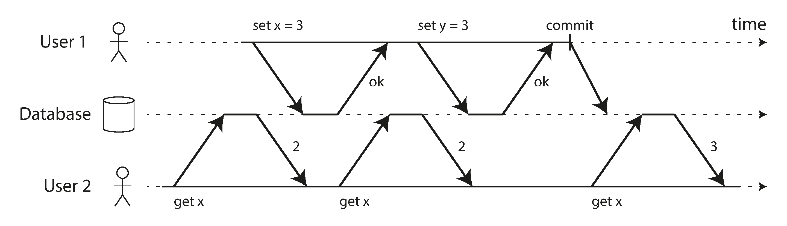
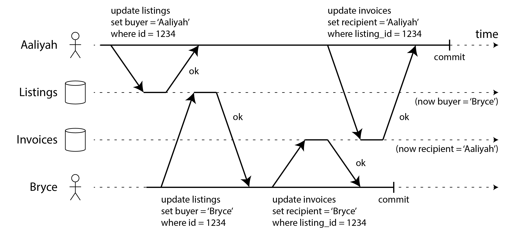
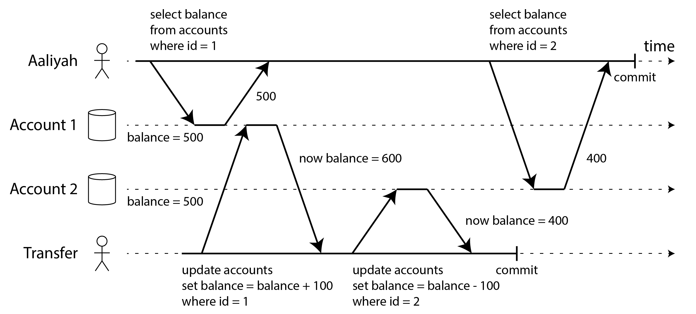
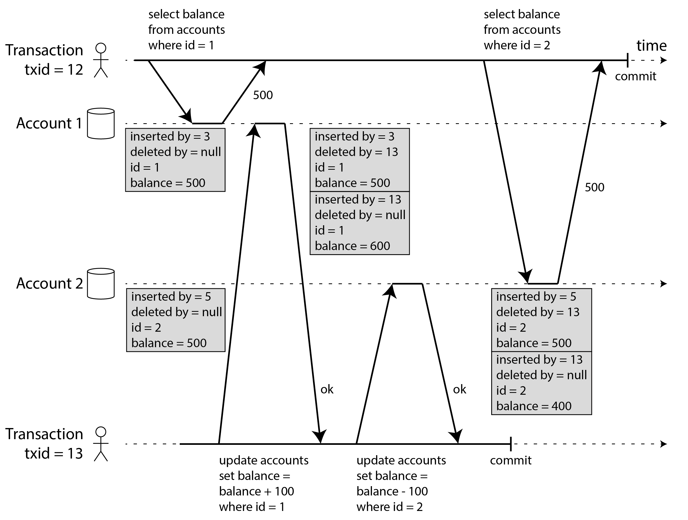
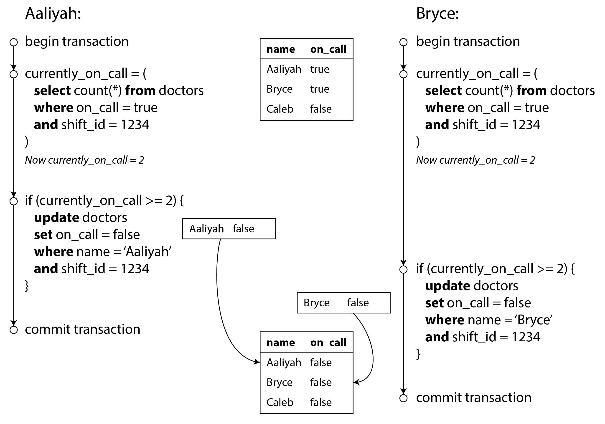

# Chapter 8: Transactions

In the harsh reality of distributed data systems, things constantly go wrong:
*   Databases or hardware can fail mid-write.
*   Applications can crash halfway through a complex operation.
*   Network interruptions can suddenly sever connections.
*   Multiple clients can concurrently write to the exact same data, overwriting each other.
*   Clients can read data that is only partially updated and makes no logical sense.

Handling all of these potential failures perfectly in application code is an impossible amount of work. To simplify this, databases offer **Transactions**.

### What Exactly is a Transaction?
A transaction is a way for an application to group several reads and writes together into a single, logical unit. 
Conceptually, all operations in a transaction are executed as *one single operation*:
1.  **Commit:** Everything succeeds perfectly.
2.  **Abort / Rollback:** If *anything* fails, the entire transaction is cancelled, and the database perfectly unwinds any partial writes that occurred. 

Because of this, the application never needs to worry about "partial failures" (where money was deducted from Account A, but the database crashed before adding it to Account B). If it fails, the application simply retries blindly, knowing the database kept things safe. 

*(Note: Transactions are not laws of physics. They are simply an artificial programming model built by database engineers to provide "safety guarantees" so application developers don't have to code around hardware failures).*

#### A Brief History of Transactions
*   **The Relational Era (1975+):** Almost all modern SQL databases built their transactional engines directly matching the style established by IBM System R in 1975.
*   **The NoSQL Rebellion (Late 2000s):** As developers demanded massive horizontal scalability and sharding, a popular myth emerged that Transactions were "fundamentally unscalable." The NoSQL movement abandoned transactions completely, forcing developers to handle race conditions and partial failures manually in application code.
*   **The NewSQL Renaissance (Modern):** The myth was shattered. Systems dubbed "NewSQL" (such as Google Spanner, CockroachDB, TiDB, Yugabyte) proved that you *can* have both. By combining massive global sharding with strict Consensus protocols, they provide ironclad ACID transactions at planetary scale.

---

### The Meaning of ACID
The safety guarantees provided by transactions are universally described by the acronym **ACID** (Atomicity, Consistency, Isolation, Durability), coined in 1983. 
*(Note: Today, "ACID compliant" has sadly become a vague marketing term. Different databases implement "Isolation" entirely differently. Systems that explicitly abandon ACID are sometimes called BASE—Basically Available, Soft state, Eventual consistency—which essentially just means "Not ACID").*

#### A: Atomicity (Abortability)
In multi-threaded programming, "atomic" means a thread cannot see half-finished work. In the context of ACID databases, **Atomicity has nothing to do with concurrency**.

ACID Atomicity describes what happens if a client executes a sequence of writes, and a fault occurs halfway through (e.g., the network drops, or a disk fills up). 
*   If grouped in a transaction, the database guarantees it will **Abort / Rollback** the entire transaction, flawlessly discarding every partial write that occurred before the crash. 
*   Because of this, the application natively knows that if a transaction returns an error, *absolutely nothing* was changed in the database, meaning it is 100% safe to blindly retry the transaction without fear of accidentally duplicating data.
*(A far better word for this would have been "Abortability").*

#### C: Consistency
The word "Consistency" is the most terribly overloaded term in computer science (Replica Consistency, Consistent Hashing, CAP Theorem Consistency). 

In the context of ACID, **Consistency refers to application-specific Invariants** (statements about your data that must always be true).
*   *Example:* In an accounting system, credits and debits across all accounts must always balance to zero.
*   If a transaction starts in a valid state, and completes in a valid state, the database has maintained "Consistency."
*   *The Catch:* The database has no idea what your business logic is. While it can enforce basic rules (like Foreign Keys or Uniqueness constraints), the C in ACID largely relies on the application developer writing correct transactions. It is not a property of the database alone.

#### I: Isolation
Most databases are accessed concurrently by dozens of clients. If two clients try to access the exact same record simultaneously, you get a "Race Condition."
*   *Example:* Two users simultaneously read a counter at `42`, add 1 in their app, and write back `43`. The counter should be `44`. 


**Isolation** guarantees that concurrently executing transactions cannot step on each other's toes. 
*   In classic database theory, perfect isolation is called **Serializability**. It guarantees that even if 100 transactions are running perfectly in parallel, the final result will be identical as if they had run *serially* (queued up one at a time).
*   *The Catch:* Perfect serializability is incredibly slow. Because of the performance cost, almost all databases (even Oracle) use weaker isolation levels (like "Snapshot Isolation") by default, intentionally allowing some obscure race conditions to occur in exchange for blazing speed.

#### D: Durability
**Durability** is the promise that once a transaction successfully reports "Committed," the data will never be lost, even if someone immediately unplugs the database from the wall.
*   *Single-Node DBs:* It means the data has been physically written to non-volatile disk/SSD, usually by forcing an `fsync()` system call, and appending it to a Write-Ahead Log to repair corrupted files upon reboot.
*   *Replicated DBs:* It means the data has been successfully copied across the network to multiple nodes.

**The Reality of Perfect Durability:**
"Perfect" durability does not exist; there are only risk-reduction techniques:
1.  If you write strictly to one disk, and that physical disk's controller dies, the data is unrecoverable until the hardware is manually fixed.
2.  If you replicate across the network to memory but don't force it to disk, a datacenter-wide power outage wipes everything instantly.
3.  SSDs have notorious firmware bugs where `fsync` silently fails, or where disconnected SSDs bleed data away after a few months.
4.  Data on disks can experience silent "Bit Rot", slowly corrupting active replicas and backups over years.
5. Subtle interactions between the storage engine and the filesystem implementation can lead to bugs that are hard to track down, and may cause files on disk to be corrupted after a crash. Filesystem errors on one replica can sometimes spread to other replicas as well.
6. Data on disk can gradually become corrupted without this being detected. If data has been corrupted for some time, replicas and recent backups may also be corrupted. In this case, you will need to try to restore the data from a historical backup.

True durability requires a layered defense: `fsync` to disks + network replication + offsite historical backups.

---

### Single-Object and Multi-Object Operations
To recap, Atomicity and Isolation are deeply tied to the concept of a **Multi-Object Transaction**. 

A Multi-Object Transaction is required when your application needs to modify several pieces of data that *must* be kept in sync. 
Example: An email application where you insert a new Email record into the `emails` table, but also must update a denormalized `unread_count` integer on the `users` table.

**Why Isolation is Needed:**
If you don't use a transaction, User 2 might refresh their screen at the exact millisecond after the email was inserted, but *before* the counter was incremented. They see the email in their inbox, but their notification badge incorrectly says 0. The database is in an inconsistent halfway state.


**Why Atomicity is Needed:**
If a system crash or network error occurs the instant after the email is inserted but *before* the counter is incremented, the write fails. In a non-ACID database, you are permanently left with phantom emails and a permanently corrupt notification counter. With an Atomic transaction, the database safely rolls back the inserted email.


#### Grouping Operations Together
To perform a multi-object transaction, the database needs a way to know exactly which writes belong together.
*   **Relational Databases:** The grouping is bound to the client's physical TCP connection. Everything sent between a `BEGIN TRANSACTION` and a `COMMIT` statement is tracked as a single unit. If the TCP connection unexpectedly drops mid-way, the DB automatically aborts the transaction.
*   **Non-Relational (NoSQL):** Finding a `BEGIN TRANSACTION` command in NoSQL is rare. Even if a Key-Value store provides a "multi-put" API to update several keys at once, you must read the documentation carefully. Often, these APIs lack true transaction semantics; if it fails, some keys may have successfully updated while others failed, abandoning you in a corrupted state.

---

### Single-Object Writes
Atomicity and Isolation don't just apply to updating *multiple* records; they are absolutely critical when modifying a *single* object.

Imagine writing a 20 KB JSON document to a database, and the power fails after exactly 10 KB is written. If the database didn't have Atomicity at the single-record level, a subsequent read would return half a document (an unparseable corrupted mess). 
To prevent this, storage engines go to great lengths to ensure single objects are written automatically (e.g., using a Write-Ahead Log) and isolated (e.g., placing a temporary lock on the row so nobody reads it while it is actively being overwritten).

**Advanced Single-Object Operations:**
Many databases provide advanced operations that act atomically on a single record to prevent race conditions:
1.  **Atomic Increments:** Removes the need for the dangerous "read-modify-write" logic shown in Figure 8-1. The database natively handles the math atomically.
2.  **Compare-and-Set (CAS):** A conditional write. "Update this JSON document, but *only* if nobody else has touched it since the last time I read it."

*(Note: These single-object guarantees are sometimes marketed heavily by NoSQL databases—like Aerospike's "strong consistency" or Cassandra's "lightweight transactions"—but these are NOT true multi-object transactions).*

### The Need for Multi-Object Transactions
Could we build an application completely without true multi-object transactions, relying solely on single-record updates? Technically yes, but it is incredibly difficult because most data paradigms require coordinating multiple objects:
1.  **Relational:** `Foreign Keys`. If inserting a child, the parent must exist.
2.  **Document:** `Denormalization`. If you lack `JOINs`, you denormalize your data (like the unread counter in Figure 8-2). Denormalized data inherently requires updating several separate documents in sync.
3.  **Indexes:** `Secondary Indexes`. Every time you change a value, the underlying data *and* the secondary index must both be updated. Without transactions, the index can go out of sync with the raw data.

### Handling Errors and Aborts (Retries)
The entire philosophical point of an ACID Transaction is that it is safe to **Abort**. If the database is in danger of violating ACID, it would rather abandon the entire transaction than let it remain half-finished.

Because of this safety net, an application's primary error-handling mechanism should simply be to **Retry** the aborted transaction. Unfortunately, many popular ORMs (like Django or Ruby on Rails) do not auto-retry aborted transactions; they simply throw an exception and discard the user's input.

**The Danger of Blind Retries:**
While simple, blindly retrying transactions in code isn't perfect:
1.  **Network Timeouts:** The transaction *succeeded* in the database, but the network crashed before the "Success" message reached your app. If your code blindly retries, it will accidentally execute the command a second time (requiring idempotency mechanisms).
2.  **Cascading Overload:** If the database threw an error because it was completely out of memory and melting down under heavy contention, 100 clients instantly and aggressively "retrying" their transactions will immediately kill the database completely. (Use Exponential Backoff).
3.  **Permanent Errors:** If the attempt failed because of a Constraint Violation (e.g. Username Already Exists), retrying will never work.
4.  **External Side Effects:** If your transaction logic includes shooting off an email via the SendGrid API, and the database transaction aborts and retries 3 times, you just accidentally sent 3 identical emails to the customer.

---

### Weak Isolation Levels
If two transactions are completely independent, the database runs them safely in parallel. But what if one transaction modifies data exactly while another one reads or modifies it? That is a **Race Condition**.

In a perfect world, databases would simply hide these race conditions by relying on **Serializable Isolation** (the database mathematically ensures that transactions have the exact same effect as if they were forced to run sequentially: one at a time, completely eliminating race conditions). 

However, forcing a global distributed database to run everything sequentially is agonizingly slow. Because of the massive performance penalty, almost all databases (even "ACID" relational ones like Oracle) use **Weak Isolation Levels** by default. These weaker levels provide *some* protection, but intentionally allow certain bugs to leak through in exchange for speed.

*(Note: Weak isolation causes catastrophic real-world bugs, including bankrupting a Bitcoin exchange in 2014 when attackers mathematically exploited a race condition allowing them to overdraw their balances).*

#### 1. Read Committed
The most basic, baseline level of isolation that most databases provide is **Read Committed**. 
It guarantees exactly two things:
1.  **No Dirty Reads:** When reading, you will only see committed data.
2.  **No Dirty Writes:** When writing, you will only overwrite committed data.

**What is a Dirty Read?**
Imagine Transaction A modifies a user's balance from $10 to $20, but the transaction hasn't officially *Committed* yet. Can Transaction B "peek" and see that uncommitted $20?
If yes, that is a **Dirty Read**. 

*Read Committed isolation explicitly forbids this.* Transaction B will continue to see $10 until Transaction A fully commits.

*Why preventing Dirty Reads is vital:*
1.  If Transaction A was updating multiple rows (e.g., adding an email AND updating an unread counter), a Dirty Read means Transaction B might see a halfway state (the email, but an empty counter).
2.  **Cascading Aborts:** If Transaction B reads the $20, makes business decisions based on the $20, and then Transaction A suddenly *Aborts* (crashing back to $10), Transaction B is now hopelessly corrupted because it based its logic on data that mathematically never existed.

**What is a Dirty Write?**
Imagine Transaction A edits a user's shopping cart, adding an "Apple". Before it commits, Transaction B swoops in and maliciously edits the *same* cart, adding a "Banana". Which write wins?

If a database allows Transaction B to blindly overwrite an *uncommitted* value currently held by Transaction A, that is a **Dirty Write**.

*Read Committed isolation explicitly forbids this.* It prevents Dirty Writes by enforcing a Row Lock. Transaction B must sit patiently and wait for Transaction A to either Commit or Abort before it is allowed to touch the object.


*Why preventing Dirty Writes is vital:*
Without it, transactions that modify multiple identical rows interleave incorrectly. Imagine Alice and Bob both click "Buy Car" at the exact same millisecond. 
*   Alice updates the `listings` table.
*   Bob updates the `listings` table (overwriting Alice).
*   Alice updates the `invoices` table.
*   Bob updates the `invoices` table (overwriting Alice).
Without Read Committed locks, you end up with a mix: Bob wins the car listing, but Alice wins the invoice (paying for a car she didn't get). Read Committed safely prevents this by forcing whoever acts second to wait until the first buyer's transaction completely finishes.

#### Implementing Read Committed
How do databases (like Postgres, Oracle, and SQL Server) actually enforce this isolation level under the hood?

**Preventing Dirty Writes (Row-Level Locks)**
Databases almost universally prevent dirty writes by using **Row-Level Locks**. 
If Transaction A wants to modify a row, it must acquire the lock for that specific row. It holds that lock until it officially Commits or Aborts. If Transaction B wants to write to that exact same row, it physically cannot; it must wait in line for the lock to be released.

**Preventing Dirty Reads (Remembering the Old Value)**
You *could* use a read-lock to prevent dirty reads (forcing Transaction B to wait for the write-lock to release before it's allowed to *read* the data). 
However, **Read Locks perform terribly**. One massive, long-running write transaction would freeze every single read in the system, crippling the application's response time.

Instead, almost all modern databases prevent Dirty Reads by **Versioning** the data:
*   When Transaction A acquires the write-lock and modifies the row, the database *remembers* the old, officially committed value.
*   While Transaction A is still working, any other transaction that asks to read the row is simply handed the old value. 
*   The instant Transaction A commits, the database switches over and starts handing out the new value.

*(Sidebar: Some databases offer an ultra-weak isolation level called **Read Uncommitted**. This prevents Dirty Writes using locks, but completely allows Dirty Reads. This avoids storing two versions of a row, making it slightly faster at the cost of exposing users to partially-finished corrupted data).*

---

### Snapshot Isolation and Repeatable Read
Read Committed is great, but it still allows a dangerous concurrency bug called **Read Skew** (also known as a Nonrepeatable Read).

**The Read Skew Anomaly:**
Imagine Aaliyah has $1,000 split across two bank accounts ($500 each). A transaction begins transferring $100 from Account 1 to Account 2. 
If Aaliyah opens her banking app at the exact wrong millisecond, her app might query Account 1 *before* the transfer hits it (saying $500), but then query Account 2 *after* the transfer has left it (saying $400). 
To Aaliyah, it appears she only has $900. $100 has vanished into thin air.


This is completely legal under "Read Committed" isolation! Both the $500 and the $400 were officially committed values at the exact millisecond her app queried them. If she refreshes the page, it will fix itself, so for a banking app, Read Skew is usually an acceptable temporary side effect.

**When Read Skew is Unacceptable:**
However, temporary Read Skew is completely catastrophic for:
1.  **Backups:** A backup can take 10 hours. If a backup copies Account 1 at hour 1, and Account 2 at hour 9 (after the transfer), the backup is permanently corrupted with vanished money. 
2.  **Analytics:** If an analytical query takes 20 minutes to aggregate global revenue, and active transactions are actively shifting money around while the query runs, the final revenue report will be mathematically nonsensical.

#### The Solution: Snapshot Isolation
To fix Read Skew, databases use **Snapshot Isolation**. 
When a transaction begins, it takes a "Snapshot" of the database. For the entire duration of that transaction, it will *only* see the data exactly as it existed at that specific moment in time. Even if 10,000 other transactions actively change data underneath it, the query is completely isolated in its frozen snapshot in the past. 
*(This is a massively popular feature used by Postgres, MySQL InnoDB, Oracle, and Data Warehouses like BigQuery).*

#### Multi-Version Concurrency Control (MVCC)
To guarantee Snapshot Isolation, a database can't just keep 2 versions of a row (Old and New) like Read Committed does. Because an analytical query might run for 2 hours, the database might need to keep dozens of historical versions of the exact same row alive simultaneously.

This mechanism is called **MVCC (Multi-Version Concurrency Control)**.
*   **The Golden Rule of MVCC:** Readers never block writers, and writers never block readers.
*   **How it Works (PostgreSQL Example):** Every single transaction is given a permanent, unique Auto-Incrementing ID (`txid`). 
    *   Every row on disk has an `inserted_by` field and a `deleted_by` field.
    *   When you `UPDATE` a row, Postgres doesn't overwrite it! It actually marks the old row's `deleted_by` field with your `txid`, and inserts a brand new row with your `txid` in the `inserted_by` field.
    *   Both the old and new rows physically exist on disk side-by-side as a linked list.
    *   Any other transaction reading the database simply looks at their own `txid`, compares it to the rows, and mathematically ignores any row that was inserted "after" they started their snapshot.


*(Eventually, when the database knows for a fact that the oldest ongoing analytical query has finally finished, a garbage collection process—like Postgres's `VACUUM`—will sweep through the disk and physically delete all the obsolete historical rows to free up space).*

#### Visibility Rules for MVCC Snapshots
How does the database actually decide which historical row a transaction legally gets to see? It relies on the `txid` math:
1.  **Ignore Active Contemporaries:** The exact millisecond your transaction starts, the database writes down a list of every other transaction currently in progress globally. Anything written by those transactions is completely ignored (even if they happen to commit 5 seconds later).
2.  **Ignore the Future:** Any transaction that started *after* you is mathematically from "the future." Every row stamped with their `txid` is completely invisible to you.
3.  **Ignore the Aborted:** Any writes made by an aborted transaction are obviously ignored (which is brilliantly efficient, because Abort no longer requires actively deleting the bad rows; the database just flags the `txid` as aborted and everyone mathematically ignores it).
4.  **Accept the Rest:** The only rows you see are those that were successfully committed *before* your specific `txid` began.

#### Indexes and Snapshot Isolation
How do Indexes work if there are 5 different versions of the exact same row on the disk simultaneously?
*   **The Postgres Approach:** The Index simply points to *every* version of the row. When the query uses the index to jump to the row, it must quickly glance at the `txid` linked-list to figure out which specific version it is legally allowed to see.
*   **The Append-Only B-Tree (CouchDB, Datomic):** Instead of pointing to multiple rows, the database uses an *Immutable Copy-on-Write* B-Tree. When a row changes, the database creates a brand new copy of that leaf node, and a new copy of its parent node, all the way up to creating a brand new root node. To query a snapshot, you just hold a pointer to the "Root Node" that existed at your exact point in time, and those pointers naturally ignore all future writes (which spin off into new tree branches).

#### Snapshot Isolation vs. "Repeatable Read" (Naming Confusion)
Because Snapshot Isolation is so incredibly useful, you would think the SQL standard would clearly define it. 
Unfortunately, the official SQL standard was written in 1992, based on IBM's 1975 papers, *before Snapshot Isolation was fully invented*.

Therefore, the SQL standard doesn't mention Snapshot Isolation; instead, it defines a flawed, extremely vague isolation level called **Repeatable Read**. 

Because of this, database marketing is completely chaotic and non-standardized:
*   **PostgreSQL** offers true Snapshot Isolation, but explicitly calls it `Repeatable Read` just so they can legally claim they comply with the SQL standard.
*   **MySQL (InnoDB)** also calls it `Repeatable Read`, but implements it very differently with weaker consistency than Postgres.
*   **Oracle** offers true Snapshot Isolation, but falsely calls it `Serializable` (the highest possible isolation level).
*   **IBM Db2** uses the phrase `Repeatable Read`, but actually maps it to true `Serializable`.

*Conclusion: Nobody actually knows what "Repeatable Read" means anymore. You must read the specific documentation for your database to understand what anomalies it actually protects you against.*

---

### Preventing Lost Updates
The isolation levels discussed so far (Read Committed, Snapshot Isolation) primarily protect *Read-Only* transactions from concurrent writers. But what happens when two transactions actively try to **write** to the exact same object concurrently? 

The most famous write-write conflict is the **Lost Update Problem**.

**What is a Lost Update?**
It occurs almost exclusively during a **Read-Modify-Write** cycle.
1.  Transaction A reads a counter (value: 42).
2.  Transaction B reads the same counter (value: 42).
3.  Transaction A adds 1 and writes back 43.
4.  Transaction B adds 1 (to its local snapshot of 42) and writes back 43.
*The Result:* The counter is 43 instead of 44. Transaction A's modification was completely "clobbered" (lost). 

This happens constantly when:
*   Incrementing account balances.
*   Updating a value deep inside a complex JSON document.
*   Two users editing the same Wiki page simultaneously.

#### Solutions to the Lost Update Problem
Because this is incredibly common, databases offer several mechanisms to completely eliminate it:

**1. Atomic Write Operations (Let the DB do the math)**
The best solution is to completely remove the Read-Modify-Write logic from your application code.
Many databases provide custom commands that natively perform the math inside the database atomically (by briefly applying an exclusive write-lock while the math executes).
*Example:* `UPDATE counters SET value = value + 1 WHERE key = 'foo';`
*(Warning: ORM frameworks like Django or Ruby on Rails often foolishly abstract this away, silently executing a dangerous Read-Modify-Write cycle behind the scenes instead of using the database's native atomic increment).*

**2. Explicit Locking (`FOR UPDATE`)**
If your application logic is too complex for a standard Atomic Increment (e.g., "Move this game piece, but only after mathematically verifying the move is legal against the rules engine"), your application can explicitly order the database to lock the row.
*Example (SQL):* `SELECT * FROM figures WHERE name = 'robot' FOR UPDATE;`
The `FOR UPDATE` clause places an ironclad lock on the row. If a second player attempts to grab the robot, they are forced to wait patiently until the first player finishes their entire complex Read-Modify-Write cycle.

**3. Automatically Detecting Lost Updates**
Instead of forcing developers to remember to type `FOR UPDATE` manually, some advanced databases allow transactions to execute perfectly in parallel. However, right before they Commit, the Database Transaction Manager rapidly checks the math. 
If it detects that a Lost Update is about to happen, it **Aborts** the offending transaction and forces the application to retry. 
*   *Advantage:* It is vastly less error-prone because developers don't have to write any special locking code; the database just catches the math errors automatically.
*   *Implementation:* PostgreSQL (`Repeatable Read`) and Oracle (`Serializable`) automatically detect and block lost updates. However, **MySQL InnoDB (`Repeatable Read`) does NOT**. (Many authors argue MySQL shouldn't even be allowed to claim it offers Snapshot Isolation because of this).

**4. Conditional Writes (Compare-And-Set)**
If your database doesn't offer true transactions, it might offer a conditional write built to mimic a hardware CPU's "compare-and-swap" (CAS) instruction. This forces an update to ONLY occur if the database row *still matches* the exact state you saw when you first read it.
*Example (SQL):* `UPDATE wiki_pages SET content = 'new' WHERE id = 123 AND content = 'old';`
If another user already changed the content to 'different', the `WHERE` clause mathematically fails, the update has zero effect, and the application must retry.
*(Sidebar: Sometimes, developers use an auto-incrementing `version` column instead of comparing the entire text content. This is commonly known as **Optimistic Locking**).*

#### Conflict Resolution and Replication
Everything discussed so far (Row Locks, Compare-and-Set, Atomic Increments) makes one giant assumption: **That there is only ONE authoritative copy of the data.** 

In Replicated databases (like Multi-Leader or Leaderless architectures), these solutions completely break down. 
Because multiple geographically separated nodes accept writes concurrently and blindly replicate them in the background later, there is no "Single Authority" to hold a lock or instantly verify a `Compare-and-Set`. 

How do Replicated databases handle write-write conflicts then?
Instead of preventing conflicts, they intentionally let them happen. They allow concurrent writes to create multiple conflicting versions of the exact same record simultaneously (called **Siblings**). 
It is then the responsibility of the application (or a special data structure) to merge those siblings after the fact.
*   **Commutative Math (Safe):** If the conflicting writes are mathematically Commutative (like incrementing a counter), they can be merged flawlessly later. E.g., Node A gets `+1`, Node B gets `+2`. When they finally sync over the network, the total is naturally `+3`. (This is the underlying principle behind CRDTs).
*   **Last Write Wins (Dangerous):** If the database simply relies on LWW (using timestamps to blindly pick a "winner" and aggressively delete the other), it is completely prone to Lost Updates. *Unfortunately, LWW is the default setting in many modern replicated databases.*

---

### Write Skew and Phantoms
So far, protecting against Write-Write Conflicts focused on protecting *a single object* (e.g. locking a specific `counter` row). 
There is an incredibly subtle race condition where two transactions modify *different objects* simultaneously, leading to a catastrophic logic error collectively. This is called **Write Skew**.

**The Write Skew Anomaly (The On-Call Doctors):**
Imagine a hospital rule: "There must always be strictly >= 1 doctor on call." 
Aaliyah and Bryce are currently both on-call. They both get sick, and click "Request Leave" at the exact same millisecond. 
1.  Transaction A completes a `SELECT` count and sees 2 doctors on call. 
2.  Transaction B completes a `SELECT` count and sees 2 doctors on call.
3.  Because "2 > 1", both transactions calculate that it is perfectly legal to drop their respective doctor's status.
4.  Transaction A updates Aaliyah's row to `on_call = false`.
5.  Transaction B updates Bryce's row to `on_call = false`.
*The Result:* The hospital has zero doctors on call. The business logic constraint was completely mathematically circumvented. 


*Why previous defenses fail here:*
*   This is not a "Dirty Write" (they didn't update the same row).
*   This is not a "Lost Update" (no data was clobbered or written over).
*   Automatic Lost-Update Detection does nothing here because two completely different rows were modified.

#### Characterizing Write Skew
Write Skew is a generalization of the lost update problem. It occurs when two conflicting transactions:
1.  Read the same shared dataset (the total count of doctors).
2.  Make a decision based on that data (it's safe to take leave).
3.  Separately write data that fundamentally invalidates the original premise the decision was based on.

Because they touched *different* rows, weak isolation levels (like Snapshot Isolation) mathematically see no conflict and allow both to commit happily. 

#### Solutions to Write Skew
Preventing Write Skew is incredibly difficult:
1.  **Atomic Operations don't work**, because multiple separate rows are involved.
2.  **Database Constraints (e.g., Uniqueness, Foreign Keys) rarely help**, because creating a complex trigger-based constraint like "COUNT(doctors) where shift=123 must be >=1" is very difficult to build correctly in most SQL databases.
3.  **True Serializable Isolation:** Running transactions sequentially perfectly eliminates this, but at a huge performance cost.
4.  **Explicit Locking (The practical workaround):** If you can't use Serializable isolation, the second-best option is explicitly locking the rows the transaction mathematically relied upon:
    ```sql
    BEGIN TRANSACTION;
    -- Explicitly place a lock on ALL doctors currently working this shift
    SELECT * FROM doctors WHERE on_call = true AND shift_id = 1234 FOR UPDATE;
    
    UPDATE doctors SET on_call = false WHERE name = 'Aaliyah' AND shift_id = 1234;
    COMMIT;
    ```

#### More Examples of Write Skew
This sounds esoteric, but it is extremely prevalent in modern web apps:
1.  **Meeting Room Booking System:** 
    *User 1 and User 2 both try to book Room A at 12:00 PM.* 
    Transaction A and B both `SELECT` to check if a conflicting meeting exists. Both return zero rows. Both perfectly insert their own brand-new `booking` rows. (Room is double booked).
2.  **Claiming a Username:** 
    *User 1 and 2 try to register 'Alice' simultaneously.* 
    Transactions A and B both `SELECT` and see the username is free, and both attempt to create the account. (Fortunately, a simple `UNIQUE` constraint perfectly fixes this specific scenario). 
3.  **Preventing Double-Spending:** 
    *User has $10 and buys both Item A ($8) and Item B ($8) at the exact same millisecond.*
    Transaction A and B both SELECT the total balance, see $10, and legally insert their $8 purchases into the `purchases` ledger. The user's account drops to -$6, completely skipping the insufficient funds check.
