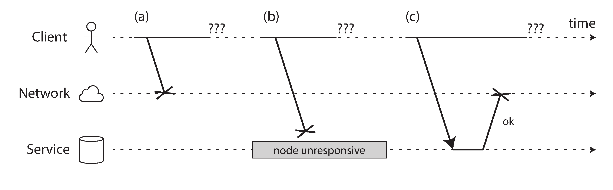
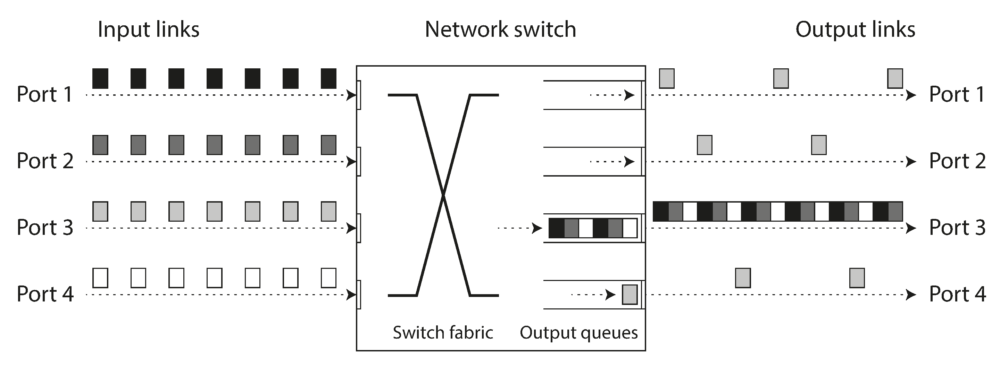
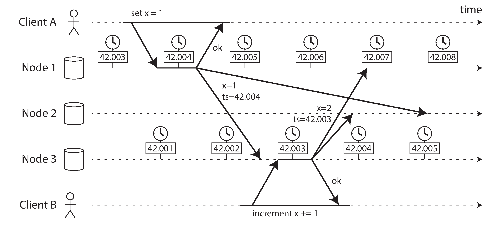
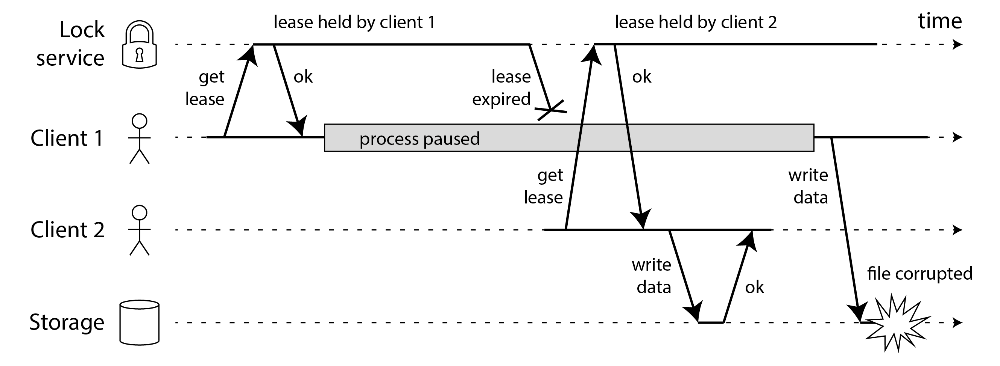
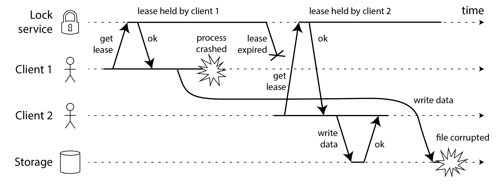
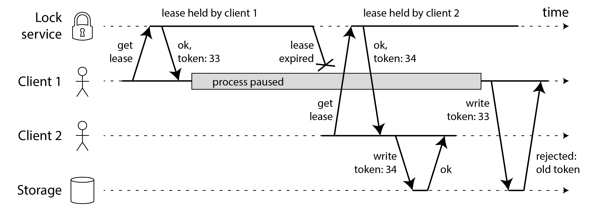
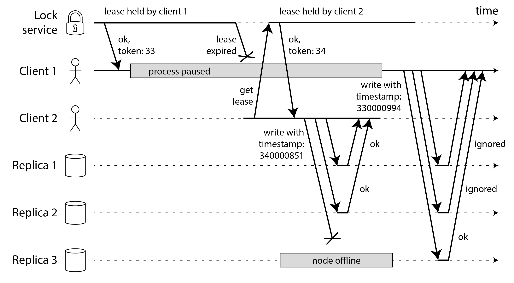

# Chapter 9: The Trouble with Distributed Systems

## 1. Introduction: The Pessimistic Mindset
Building reliable distributed systems requires a radical shift in mindset. As developers, we typically focus on the "happy path" because things usually work perfectly. 

However, in large distributed systems, **"anything that can go wrong, will go wrong."** Even a fault with a one-in-a-million probability will happen every single day when operating at scale. To build reliable systems, you must embrace pessimism and paranoia, anticipating unpredictable failures at all layers.

## 2. Faults and Partial Failures
When you write software for a single computer, the operating system goes out of its way to present an idealized, mathematically perfect reality. **Single-node computers are deterministic:** they either work perfectly, or they crash completely (kernel panic, blue screen of death). They are specifically designed *not* to operate in a halfway-broken state because that causes confusing errors.

**Distributed systems are fundamentally different.**
Because they span multiple machines connected by cables in the physical world, they are subject to **Partial Failures**. 
In a partial failure, one part of your system breaks in an unpredictable way while the rest of the system continues functioning fine. 

Because partial failures are entirely **nondeterministic**, a request might work, it might fail, or—worst of all—you might not even know if it succeeded or not. However, if we accept and design around partial failures, we can achieve something incredible: **Fault Tolerance**. We can build a perfectly reliable system constructed entirely out of inherently unreliable physical hardware.

## 3. Unreliable Networks
Modern distributed databases use a "shared-nothing" architecture. Dozens of computers have their own CPU, memory, and disk. They share absolutely nothing except a network cable.

The internet and datacenter networks are **Asynchronous Packet Networks**. They offer absolutely zero guarantees about when a packet will arrive, or if it will fundamentally arrive at all.

If you send a request over the network and do not receive a response, here is everything that could have happened:
1.  **Request Lost:** The packet was dropped (someone tripped over a cable).
2.  **Request Delayed:** The packet is still sitting in a queue waiting to be processed.
3.  **Remote Node Dead:** The server crashed or lost power.
4.  **Remote Node Suspended:** The server is temporarily frozen (e.g., executing a massive Garbage Collection pause) and will respond eventually.
5.  **Response Lost:** The server successfully did the work, but the network switch dropped its reply packet.
6.  **Response Delayed:** The server did the work, but its reply is stuck in a queue.

**The Crux:** It is mathematically impossible to distinguish between these 6 scenarios. The sender only knows one thing: "I have not received a response yet." 
The only practical way to handle this is by implementing a **Timeout**, though even when a timeout triggers, you still have no idea *why* it triggered or if the remote node successfully processed your request before timing out.

### The Limitations of TCP
Doesn't the Transmission Control Protocol (TCP) promise "reliable delivery"? Yes, but only to a certain extent. 
TCP breaks large data strings into packets, puts them in the correct order, detects corruption, and handles network congestion (backpressure). 

When you “send” some data by writing it to a socket, it actually doesn’t get sent immediately, but it’s only placed in a buffer managed by your operating system. The congestion control algorithm decides that it has capacity to send a packet

However, TCP does not change the physical reality of the network:
*   TCP will retry lost packets, but if the network cable is actually unplugged, TCP will eventually just throw an error. TCP’s deduplication and retransmission capabilities only apply to a single connection, so if the application reconnects and retransmits, data could be duplicated.
*   If a TCP connection drops, you have absolutely no idea how much of your data the receiving application actually processed. 
*   Even if TCP successfully delivered the packet to the remote node's operating system, the remote application itself might have crashed a millisecond before looking at it. 

*Conclusion:* TCP guarantees packets reach the remote machine's kernel network buffers. But if you want to know if an application actually successfully processed your business logic, the *only* way is to receive a positive application-level response back from the remote server.

### Network Faults in Practice
We’ve been building networks for decades; haven't we solved this? No.
Even in modern, tightly controlled datacenters, network faults are surprisingly common:
*   Human error is a massive cause of outages (misconfigured switches). Adding redundant networking gear often doesn't help because human misconfiguration can take down both paths.
*   Hardware fails constantly: power distribution unit failures, switch failures, accidental power loops.
*   Submarine cables get severed by sharks, cows, or backhoes.
*   **Asymmetric faults:** Node A can reach Node B, but Node B cannot reach Node A. (Often a switch drops outbound packets but passes inbound ones).
*   **Arbitrary delays:** During a switch software upgrade, packet routing can be delayed by more than a minute while topology is re-computed.

Because networks will fail, your software *must* be able to handle it. If you don't define the error handling for network faults, the software may lock up, deadlock the cluster, or silently delete user data when an unexpected interrupt happens.

Testing is vital here. You should deliberately sever network links in your testing environments to observe how your system reacts (known as **Fault Injection**). 

*(Note: When a network fault completely cuts off one part of the network from another, it is called a **Network Partition** or "netsplit".)*

### Detecting Faults
Because networks are totally asynchronous, it is incredibly difficult to reliably detect if another node has actually died. Many systems (like load balancers routing traffic, or a database needing to elect a new leader) desperately need to know if a remote node is actually dead.

Sometimes, the network or OS will give you a helpful hint:
*   **Connection Refused:** If the machine is alive but the application process crashed, the OS will aggressively reject your TCP connection (sending an `RST` or `FIN` packet).
*   **Process Notifications:** If a database node crashes (like HBase) but the OS survives, a background script can quickly ping the rest of the cluster to tell them the node died.
*   **Switch Management Interfaces:** In a private datacenter, you can query the hardware switches themselves to see if the link to a specific server is powered down.
*   **ICMP Unreachable:** If a router knows an IP address is dead, it *might* send back an "ICMP Destination Unreachable" packet.

However, you *cannot rely on any of these hints.* If a switch is misconfigured or a server loses power entirely, you won't get an explicit rejection. You will get *nothing*. You will just sit there waiting for a response that will never arrive.

Because of this, the universal gold standard for detecting faults is the **Timeout**:
You try to ping the remote node. If it doesn't respond within X seconds, you declare it dead.
This creates a critical balancing act:
*   **Too Short:** You get false positives. You declare a perfectly healthy (but temporarily slow) node dead. If it was the Leader, you force an expensive, unnecessary Leader Election that slows down your whole system. Worse, if the node is actually alive and executing an action (like sending an email), declaring it dead and re-assigning its work might cause the action to happen twice.
*   **Too Long:** You get false negatives. Your system sits completely paralyzed for minutes waiting on a server that is literally unplugged.

### Timeouts and Unbounded Delays
If you must use a timeout, exactly how long should it be? 
In a perfect universe, we could mathematically calculate it. If we knew the absolute maximum time it takes a packet to cross the network ($d$), and we knew the maximum time the server takes to process the request ($r$), a perfect timeout would be $2d + r$. 
If it took any longer than $2d + r$, we would absolutely guarantee the node was dead.

Unfortunately, our universe has **unbounded delays**. 
1. Asynchronous networks have no maximum limit on how long a packet can take. 
2. Servers usually cannot guarantee a maximum processing time limit.

#### Network Congestion and Queueing (Why Delays are Unbounded)
Why do packets take varying amounts of time to travel? Just like driving a car, it mostly comes down to traffic jams—or in networking terms, **Queueing**. 
*   **Switch Queues:** If multiple servers all try to send data to the same destination simultaneously, the network switch becomes a bottleneck. It must put the packets in a memory queue and feed them to the destination link one by one. If the queue gets completely full, the switch just drops the newly arriving packets entirely.

*   **OS Queues:** When the packet finally arrives at the server, but all CPU cores are busy, the operating system puts the packet in a queue until the application has time to read it.
*   **VM Pauses:** If the server is a Virtual Machine on a public cloud, the hypervisor might literally pause the VM for tens of milliseconds to let another tenant use the CPU. While paused, incoming packets just sit buffered. 
*   **TCP Congestion Control:** Before the packet even leaves the sender, TCP intentionally throttles your send rate to avoid congesting the network further, keeping the data buffered on your own OS.

*(Note: **TCP vs. UDP**. TCP forces reliable delivery, so if a packet drops, it silently re-transmits it, hiding the loss from the application but massively increasing the delay variance. Applications like VoIP videoconferencing use UDP instead because they prioritize speed over reliability; if a packet drops, UDP ignores it, creating a brief glitch in audio, rather than pausing the entire video call while waiting for a retransmission.)*

Because of "noisy neighbors" in public cloud datacenters maxing out shared router links, you have virtually zero control over network queueing. So how do you pick a timeout?

You cannot just guess a number. The best strategy is continuous experimentation. **Dynamic Timeouts** (like the *Phi Accrual failure detector* used in Akka and Cassandra) automatically measure the jitter and response times of the network in real-time. By observing the distribution dynamically, the system constantly adjusts its own timeout threshold to find the perfect mathematical balance between false positives and false negatives for your actual current network weather.

### Synchronous vs. Asynchronous Networks
Why is the internet so flaky? Old-school fixed-line telephone networks are incredibly reliable. When you place a voice call, you don't experience random buffering or dropped audio packets. Why can't datacenter networking be built like telephone networks?

The difference lies in how the networks are structured: **Synchronous** vs **Asynchronous**.

#### Telephone Networks: Circuit Switching (Synchronous)
When you dial a phone, the network establishes a **Circuit**. 
A circuit physically reserves a fixed, guaranteed amount of bandwidth along the *entire* route between the two callers for the entire duration of the call.
*   Because the space along the wire is perfectly reserved just for you, nobody else can use it.
*   Because nobody else can use it, your data **never enters a queue**.
*   Because there are zero queues, the network has a mathematically **Bounded Delay**. The maximum end-to-end latency is fixed and guaranteed.

#### The Internet: Packet Switching (Asynchronous)
The internet and datacenters do *not* use circuits; they use **Packet Switching**. 
TCP doesn't reserve bandwidth; it opportunistically grabs whatever bandwidth happens to be free that exact millisecond. If the wire is busy, TCP data is forced to wait in a queue.

Why did we design the internet this way? **Burstiness**. 
A voice call needs a constant, exact stream of data (e.g., exactly 16 bits every 250 microseconds).
But internet traffic is incredibly "bursty." When you request a web page, you need zero bandwidth for a while, and then suddenly you need an intensive burst of bandwidth to download an image file as quickly as possible. 
If you tried to download a file over a Synchronous Circuit, you'd have to guess how much bandwidth to reserve. Guess too low, and it's slowly bottlenecked. Guess too high, and you permanently lock up network capacity that someone else could have used.

### Latency vs. Resource Utilization
The fundamental reason we suffer from unbounded delays and variable network latency is because we prioritized **Cheap Resource Utilization**.

There is a direct mathematical trade-off:
*   **Static Resource Partitioning (Circuits):** Achieves perfectly stable latency (no queueing), but suffers from terrible utilization. If you reserve a circuit and remain silent on the phone, that bandwidth is entirely wasted. Because it wastes resources, it is **expensive**.
*   **Dynamic Resource Partitioning (Packets):** Suffers from unpredictable latency (queueing), but achieves incredible utilization. Senders jostle and shove each other dynamically to cram as many packets onto the wire as possible at every given nanosecond. Because it maximizes exactly how much data fits on the wire, each byte sent is vastly **cheaper**.

The same trade-off applies to CPU Cores (Static allocation vs Dynamic OS Thread Scheduling) and Cloud Computing (Dedicated Hardware vs Multi-tenant Virtual Machines).
We *could* build computer networks with latency guarantees if we statically partitioned them with exclusive bandwidth. But the industry has unanimously decided that the immense cost savings of multitenancy and dynamic packet switching are worth the headache of variable delays. 

Therefore, variable network delays are not a law of physics—they are a deliberate, system-wide cost/benefit trade-off. We chose cheap and bursty over reliable and stable. As software engineers, it is now our job to handle the resulting chaos.

## 4. Unreliable Clocks
Clocks and time are critically important in distributed systems. We rely on them to determine if a timeout has expired, measure the 99th percentile response time, or figure out the exact date and time an article was published.

However, time is a tricky business across multiple machines for two reasons:
1.  **Communication is not instantaneous:** A message is always received *after* it was sent, but because of unbounded network delays, we have no idea exactly *how much* later. This makes reasoning about the order of events incredibly difficult.
2.  **Hardware is imperfect:** Every machine has its own physical quartz crystal oscillator clock. Because crystals vibrate at slightly different frequencies depending on temperature and manufacturing, their clocks inevitably drift apart. Even if synchronized via the Network Time Protocol (NTP), machines will always possess slightly different notions of what time it actually is.

Because of this, modern computers expose two completely different types of clocks to developers:

### 1. Time-of-Day Clocks (Wall-Clock Time)
A Time-of-Day clock answers the question: **"What is the exact date and time right now?"** 
*(e.g., `CLOCK_REALTIME` in Linux or `System.currentTimeMillis()` in Java).*
It returns the number of milliseconds since the UNIX epoch (Jan 1, 1970 UTC).

These clocks are synchronized globally via NTP, making them useful for recording timestamps across different machines. However, they have a massive, fatal flaw for software engineers: **They can jump backwards.**
*   If your local clock drifts too far ahead of the global NTP server, NTP will forcibly reset your local clock.
*   To the application, time will suddenly jump backwards.
*   Leap seconds also cause time-of-day clocks to jump or repeat a second.

*Conclusion:* Because Time-of-Day clocks can jump backwards in time, you must **never** use them to measure elapsed durations or calculate timeouts! If the clock jumps backwards while you are measuring a timeout, the math will yield a negative elapsed time, breaking your application logic.

### 2. Monotonic Clocks (Stopwatches)
A Monotonic clock answers the question: **"Exactly how much time has elapsed between Point A and Point B?"**
*(e.g., `CLOCK_MONOTONIC` in Linux or `System.nanoTime()` in Java).*

Monotonic clocks act exactly like a stopwatch. You check the clock before an event, check the clock after the event, and calculate the difference.
Unlike a Wall-Clock, Monotonic clocks mathematically guarantee they **always move forward**. They will never jump backwards, even if NTP realizes the local time is completely wrong. (NTP is allowed to slightly tweak the *speed* of the monotonic clock—slewing it by up to 0.05%—but it can never force it to jump backwards).

However, the absolute value of a monotonic clock is completely meaningless. It might just be the number of nanoseconds since the server recently booted. 
*Conclusion:* You should always use Monotonic clocks for measuring timeouts and response times. But because the starting point is arbitrary, you cannot compare a Monotonic clock value on Server A with a Monotonic clock value on Server B.

### Clock Synchronization and Accuracy
While Monotonic Clocks don't need synchronization, Time-of-Day Clocks are useless unless they are synchronized globally. We use the Network Time Protocol (NTP) to sync computers to external servers (which themselves sync to GPS receivers or atomic clocks).

Unfortunately, hardware clocks are surprisingly bad at keeping time, and NTP synchronization is incredibly fragile:
*   **Hardware Drift:** The quartz crystal inside a computer naturally drifts depending on its physical temperature. Even with perfect conditions, a standard server drifts about 17 seconds per day without synchronization.
*   **Forced Resets:** If a local clock drifts too far (because of drift, or a broken internal battery), NTP will forcibly snap the clock back, making time jump backward.
*   **Network Delays:** NTP relies on calculating the network round-trip time to figure out the exact global time. However, as we covered earlier, internet delays are unbounded. If the network experiences massive congestion, NTP's calculations become inaccurate by up to a full second (or the client might just give up entirely).
*   **Leap Seconds:** When a leap second is added, an artificial minute occurs that is 61 seconds long. Historically, this has crashed massive global systems (like Reddit and airline booking systems) because developers' code made incorrect assumptions about time. Many major companies now "Smear" the leap second—lying to the clock by running it slightly slower over the entire day to absorb the extra second, rather than forcing a violent jump. 
*   **Virtual Machine Jumps:** In a VM environment, when the hypervisor pauses a VM to give CPU time to a noisy neighbor, the time-of-day clock appears to freeze. When the VM wakes up 100ms later, the clock "jumps" forward instantaneously.
*   **Malicious Users:** If you are building mobile apps or edge devices, you can never trust the client's clock. End-users deliberately change the clocks on their smartphones all the time (e.g., to cheat in mobile games like Candy Crush).

**Can we get perfect accuracy?**
Yes, but it requires insane amounts of money. High-Frequency Trading (HFT) firms are legally required by financial regulations (like MiFID II) to sync all servers to within 100 *microseconds* of UTC to detect "flash crashes" and market manipulation. They achieve this using dedicated physical hardware (GPS antennas bolted to the roof of the datacenter, local Atomic Clocks), Precision Time Protocol (PTP), and intense monitoring. For regular software engineering, this is usually entirely out of reach.

### Relying on Synchronized Clocks
Because networks drop packets, we write robust error handling for them. Surprisingly, developers rarely write error handling for incorrect clocks. 

The problem with bad clocks is that they **fail silently**. If a CPU breaks or a network cable is unplugged, the system loudly crashes. But if an NTP client is misconfigured and the clock slowly drifts into the future, the server will continue operating perfectly fine—it will just silently corrupt data that relies on the time. 
*Conclusion:* If your software requires synchronized clocks to function, you must aggressively monitor the clock offsets between all machines. If any node drifts too far from the rest of the cluster, you must deliberately crash it (declare it dead) to prevent data corruption.

#### Timestamps for Ordering Events (The Danger of LWW)
It is incredibly tempting to use Wall Clocks to answer queries like: *"Two users updated the same record simultaneously, which one happened last?"*

Many systems (like Cassandra) use **Last Write Wins (LWW)** to resolve editing conflicts. When a write occurs, it is tagged with the timestamp of the client's local clock. If two writes conflict, the database simply keeps the one with the highest timestamp and drops the other.

This is a dangerous trap:
1.  **Silent Data Dropping:** Imagine Client A writes $x=1$, but their local clock is accidentally 50ms slow. Client B then comes along 10ms later and writes $x=2$, but their clock is accurate. Even though $x=2$ happened *after* $x=1$ in reality, Client B's timestamp will mathematically be smaller. The database will drop the new write entirely without throwing any errors.
2.  **Violating Causality:** It is entirely possible to send a packet from Server A (Timestamp: 100ms) and have it arrive at Server B (Timestamp: 99ms). Did the packet arrive before it was sent? No, the clocks are just misaligned, but LWW logic will become hopelessly confused.

You cannot just "make NTP better" to fix this. To guarantee perfect event ordering with physical clocks, your NTP synchronization error must be mathematically smaller than your network delay. Because internet delays are unbounded, this is physically impossible.

**The Solution: Logical Clocks**
Instead of using physical quartz oscillators to order events, distributed systems use **Logical Clocks** (like Version Vectors or Lamport Timestamps). 
A Logical Clock is simply an incrementing integer counter. It doesn't care about the time of day or how many seconds have elapsed. It only tracks the relative ordering of events (e.g., Event 45 happened before Event 46). If you need to establish a strict ordering of causality ("Did A happen before B?"), Logical Clocks are the mathematically safe alternative to Wall Clocks.

### Clock Readings with a Confidence Interval
Even if an API lets you read the time down to the nanosecond, that does not mean the time is actually accurate to the nanosecond. 
Because of quartz drift and network delays, a server's time-of-day clock is always slightly wrong. 

Therefore, it makes no sense to think of a clock reading as a single point in time. You must think of a clock reading as a **Confidence Interval**. 
A system shouldn't say *"It is exactly 10.300 seconds."* It should say *"I am 95% confident that the time right now is somewhere between 10.3 and 10.5 seconds."*

Unfortunately, standard APIs (like `System.currentTimeMillis()`) do not expose this uncertainty to the developer. It just hands you a single number and hides the fact that its confidence interval might be as wide as 5 seconds.

However, Google's Spanner database uses a custom API called **TrueTime**, which explicitly exposes the confidence interval. 
When you ask TrueTime what time it is, it returns an array of two values: `[earliest, latest]`. Spanner calculates its exact clock drift since its last NTP sync and mathematically guarantees the true current time is somewhere within that interval. 

#### Synchronized Clocks for Global Snapshots
Why did Google invent the TrueTime API for Spanner? To generate global Transaction IDs.

To provide Serializable Snapshot Isolation (SSI), databases need to generate monotonically increasing Transaction IDs. In a single-node database, you just use an auto-incrementing counter. But across a distributed database spanning multiple datacenters, coordinating a single global integer counter becomes a massive bottleneck. 

Google wanted to use Spanner's local Wall Clocks to generate Transaction IDs instead, but ran into the exact problem described above: what if Server A's clock is 5ms faster than Server B's clock?

Spanner solved this brilliantly by leveraging TrueTime's confidence intervals. 
If Transaction 1 produces timestamp interval $A = [A_{earliest}, A_{latest}]$ and Transaction 2 produces $B = [B_{earliest}, B_{latest}]$, Spanner can compare the intervals:
*   **No Overlap:** If $A_{latest} < B_{earliest}$, then Spanner mathematically guarantees that Transaction 1 definitively happened before Transaction 2. 
*   **Overlap:** If the intervals overlap, Spanner is unsure. 

To ensure intervals *never* overlap, Spanner does something radical: **It intentionally sleeps.**
Before Spanner commits a write, it calculates the raw TrueTime confidence interval (say, 7 milliseconds). Spanner then forces the write to wait for exactly 7 milliseconds before finally committing. 
By deliberately waiting out the uncertainty, Spanner ensures that no future read transaction could ever possibly have an overlapping interval. 

*Conclusion:* In order to keep this mandatory waiting time as short as possible, Google installed GPS receivers and Atomic Clocks directly into every Spanner datacenter. This hardware isn't strictly necessary—you could run Spanner on the public internet—but the Atomic Clocks keep the confidence interval under 7ms, which means Spanner transactions only have to pause for 7ms instead of pausing for an entire second.

### Process Pauses
Let's look at another hidden trap of clocks. 
Imagine a single-leader database. To prove it is still the leader, it routinely renews a 10-second "lease" (like a lock). The code looks like this:

1.  Check the clock to ensure the lease has at least 10 seconds remaining.
2.  If the lease is valid, process a user's write request.

We already know this is dangerous if we use a Wall Clock, because Wall Clocks can jump around. So we switch to a Monotonic Clock to perfectly measure the 10-second interval. Are we safe now? 
**No. Because of Process Pauses.**

The code above assumes that step 1 and step 2 occur back-to-back instantaneously. 
But what if the entire application thread is paused by the operating system *in between* checking the clock and processing the request? If the thread is paused for 15 seconds, by the time Step 2 resumes, the lease has unknowingly expired. Another node has taken over as leader, but the paused thread awakens and unknowingly writes the data anyway, creating a horrific split-brain scenario.

**Why do threads suddenly pause for 15 seconds?**
In distributed systems, you must assume your execution thread can be completely frozen at any given millisecond for many reasons:
*   **Contention among threads:** Accessing a shared resource, such as a lock or queue, can cause threads to spend a lot of their time waiting.
*   **Garbage Collection (GC):** "Stop-the-world" garbage collectors (like older Java VMs) will literally freeze all running threads to manage memory. This can take tens of seconds or even minutes.
*   **Virtual Machine Suspension:** Hypervisors will often completely pause a VM, save its memory to disk, and migrate it to a completely different physical server without rebooting. During this, the VM is totally frozen.
*   **Context Switching (Steal Time):** If the OS or Hypervisor switches to another thread/tenant, your thread gets put in a queue waiting for CPU time.
*   **Synchronous Disk Access:** If you touch a file—or even if Java triggers an unexpected Lazy Classload—and the disk is a network drive (like AWS EBS), you get blocked by unbounded network I/O latency.
*   **Swapping to Disk:** If memory is full and the OS "page faults", the thread freezes while reading memory from a slow hard drive.
*   **SIGSTOP:** A human admin accidentally hits Ctrl-Z in the terminal, suspending the process.

During all of these pauses, the node has no idea it went to sleep. The rest of the distributed system keeps moving, assumes the frozen node is dead, and reorganizes.

When writing multi-threaded software on a single computer, we use Mutexes and Semaphores to handle this uncertainty. But distributed systems don't have shared memory to place a Mutex in. 
A node in a distributed cluster must assume its thread could be yanked away *at any point*, and when it wakes up, it can no longer trust any assumptions it made before it went to sleep.

#### Response Time Guarantees 
Can we prevent these process pauses? Yes, but only if you build a **Hard Real-Time System**.

In software that controls aircraft, airbags, or pacemakers, a delayed response isn't an annoyance—it's catastrophic. These systems use **Real-Time Operating Systems (RTOS)** that mathematically guarantee a specific CPU allocation at strict intervals. They disable dynamic memory allocation to prevent GC pauses, and they use extremely tight, strictly documented libraries.

Building this is incredibly expensive, slow, and severely limits the tools you can use. 
*(Note: Do not confuse "Real-Time" with "Fast". RTOS prioritizes guaranteed timeliness, which usually means it actually has much lower throughput than a standard OS).* 

For standard server-side web systems, this level of strict CPU partitioning is simply not economical. We use standard operating systems that optimize for dynamic throughput instead. Therefore, server-side data processing must suffer unpredictable pauses, and our distributed algorithms must be designed to survive them.

#### Limiting the Impact of Garbage Collection
Since we cannot eliminate process pauses in standard operating systems, can we at least mitigate the worst offender (Garbage Collection)?
Modern GC algorithms (like Java's ZGC or Shenandoah) have improved massively, usually keeping pauses under a few milliseconds. But if we want to aggressively limit GC pauses, there are a few strategies:

1.  **Avoid GC entirely:** Use a language that tracks memory lifetimes at compile-time (like Rust or C++) or uses automatic reference counting (like Swift), completely eliminating the need for a runtime Garbage Collector.
2.  **Object Pools / Off-heap memory:** If using a GC language, allocate memory manually off the heap or reuse objects from a pre-allocated pool to prevent the GC from ever needing to clean them up.
3.  **Treat GC like a planned outage:** If the language runtime can warn the application that it is about to run a massive "Stop-the-world" GC pause, the application can route all new incoming traffic to other nodes in the cluster, finish its current requests, and *then* run the GC without dropping any active user traffic. This completely hides the GC pause from the end-user.
4.  **Restart instead of Full GC:** Use the GC only for fast, short-lived objects. Before the slow, long-lived object heap fills up (which requires a massive pause to clean), proactively reboot the entire node one at a time using a rolling upgrade strategy.

## 5. Knowledge, Truth, and Lies
So far, we've established that distributed systems are plagued by partial failures, unreliable networks, wildly inaccurate clocks, and arbitrary process pauses.
Because of these issues, a node in a network can never actually *know* anything for sure. It can only make educated guesses based on the messages it receives.

If a remote node doesn't respond to a ping, there is no physical way to distinguish between "the network cable is unplugged," "the remote node crashed," or "the remote node is currently paused by its garbage collector."
The resulting system borders on the philosophical: What is the "truth" in a system where perception and measurement are entirely unreliable? 

### The Majority Rules (Quorums)
Because a node cannot even trust its own local clock or its own execution thread, a distributed system must never rely on a single node's judgment. 

Imagine an asymmetric network fault where a node can receive messages but cannot send any outgoing messages. The node feels perfectly fine and continues processing work, but from the outside perspective, it is completely silent. After a timeout, the rest of the cluster declares the node dead. The node protests ("I'm still alive!"), but nobody hears it. 
In a distributed system, individual nodes must surrender their autonomy to the cluster. If a **Quorum** (usually an absolute majority of nodes) votes that a node is dead, then that node is legally dead, even if it feels alive inside. The node itself must abide by the quorum's decision and step down.

Voting guarantees safety because there can only ever be one absolute majority in a cluster at any given time, inherently preventing split-brain scenarios.

### Distributed Locks and Leases
This lack of absolute knowledge is exactly why **Distributed Locks (Leases)** frequently cause horrific data corruption bugs. 
If an application requires that only one node does a specific task (e.g., writing to a shared file), we use a Distributed Lock. However, holding a lock does not make a node immune to process pauses or network delays!

**Bug 1: Process Pauses**
1. Client 1 obtains a 10-second lease from a Lock Service to write to a file.
2. Suddenly, Client 1 experiences a 15-second Garbage Collection pause.
3. The lease expires on the server.
4. Client 2 correctly requests and obtains the newly available lease, and begins writing to the file.
5. Client 1 finally wakes up from its GC pause. It still *believes* it holds the valid lock because it hasn't checked its clock yet. It immediately writes to the file.
6. **Result:** Both clients write simultaneously. The file is corrupted.

**Bug 2: Network Delays**
1. Client 1 obtains a 10-second lease.
2. Just before the lease expires, Client 1 sends an HTTP request to write to the file.
3. The HTTP packet gets backed up in a congested network switch queue and is delayed by a full minute.
4. The lease expires on the server.
5. Client 2 obtains the lease and writes to the file.
6. Suddenly, Client 1's extremely delayed packet finally escapes the network switch and arrives at the database. 
7. **Result:** The database blindly applies the old packet. The file is corrupted.

In both cases, we see the mortal danger of distributed systems: A node's internal perception of "Truth" (thinking it holds the lock) does not match the objective reality of the cluster.

### Fencing Off Zombies and Delayed Requests
When a node loses its lease but continues acting as if it is the leaseholder (because of a process pause or dropped network packet), it is effectively a **Zombie**. 

To prevent these zombies from destroying our data, we cannot just try to forcibly shut them down (a technique called *STONITH: Shoot The Other Node In The Head*). STONITH cannot stop a packet that is already delayed in a network switch (Figure 9-5), and sometimes nodes end up aggressively shooting *each other* in the head.

Instead, we must design the storage service itself to actively reject anything the zombie tries to do. This technique is called **Fencing**.

#### Fencing Tokens
To implement Fencing, we add a simple integer counter to the lock service.
Every time the lock service grants a lease to a client, it hands the client a **Fencing Token** (an incrementing number, e.g., 33).

When a client goes to the storage server to perform its work, it *must* include its Fencing Token in the HTTP write request.
Here is how it safely prevents the zombie split-brain:
1. Client 1 obtains a lease and receives **Token 33**.
2. Client 1 goes into a 15-second GC pause.
3. The lease expires. Client 2 obtains the new lease and receives **Token 34**.
4. Client 2 writes to the storage server, passing Token 34. The server successfully saves the data, and records that the highest token it has seen so far is `34`.
5. Client 1 (the Zombie) wakes up from its GC pause. Believing it still holds the lock, it tries to write to the storage server using its old **Token 33**.
6. The storage server compares Token 33 to the highest token it has seen (34). Because $33 < 34$, the server immediately rejects the write with an error. The zombie is successfully fenced off!

*Note: Fencing tokens go by many names. In ZooKeeper, they are the `zxid` or `cversion`. In Kafka, they are called `epoch` numbers. In consensus algorithms (Paxos/Raft), they are called `ballot` or `term` numbers.*

#### Fencing with Multiple Replicas
Fencing tokens are incredibly powerful because they even work across Leaderless Replicated databases (like Cassandra). 

If a client needs to write data to 3 different replicas, it simply places its Fencing Token in the most significant bits of the timestamp. 
Because Client 2's token (34) is mathematically larger than Client 1's token (33), *any* timestamp starting with 34 will always definitively crush any timestamp generated by Client 1. 

Even if the Zombie (Client 1) successfully manages to slip a late write into Replica 3 (because Client 2's write failed to reach Replica 3), it doesn't matter. The next time the system performs a read quorum, it will compare the timestamps. Client 2's `34...` timestamp will always beat Client 1's `33...` timestamp. The zombie write is safely overwritten during Read Repair. 

*Conclusion:* Never assume a distributed lock gives you exclusive access. You must *always* assume that multiple nodes believe they hold the lock at the same time. The only way to prevent data corruption is by enforcing objective reality at the storage tier using incrementing Fencing Tokens.

### Byzantine Faults
Everything we have discussed so far assumes that nodes are unreliable, but **Honest**. 
We assume a node might crash, or pause, or experience network drops. But we absolutely trust that when a node finally does send a message, it is telling the truth. It is playing by the rules of the protocol to the best of its knowledge.

But what if a node deliberately lies? What if it intentionally sends a fake fencing token to subvert the system?
This brings us to the **Byzantine Generals Problem**.

A **Byzantine Fault** occurs when a node maliciously malfunctions or deliberately tries to deceive the rest of the cluster. A system is considered "Byzantine Fault-Tolerant" (BFT) if it can mathematically guarantee consensus even when active traitors are infiltrating the network.

**Do we need to worry about Byzantine Faults?**
In standard server-side software engineering: **No.**
In this book, we assume your datacenter is filled with mutually trusting nodes running the same software. Achieving Byzantine Fault Tolerance is extraordinarily expensive and complicated. It typically requires a supermajority of nodes to function correctly (e.g., you would need 4 identical copies of an entire system just to tolerate 1 traitor). 

We only require actual Byzantine Fault Tolerance in two incredibly specific domains:
1.  **Aerospace/Hardware Embedded Systems:** In space, radiation literally flips bits in the RAM, causing the software to behave insanely and unpredictably (which mathematically looks exactly like a lying traitor).
2.  **Cryptocurrencies (Blockchains):** A global network composed entirely of mutually untrusting, anonymous clients who actively want to defraud the system to steal money. Bitcoin is essentially just an algorithm solving the Byzantine Generals problem.

For normal software bugs or hackers compromising your servers, BFT will not save you (because if an attacker hacks Node A, they will just use the same exploit to hack Nodes B, C, and D simultaneously). We rely on standard firewalls, TLS, and access control instead.

#### Weak Forms of Lying
Even though we don't build full Byzantine Fault-Tolerant systems, we do still protect our applications against "weak" forms of lying (hardware glitches, driver bugs, or user errors):
*   **Checksums:** Network packets can get corrupted by bad routers along the way. We use Application-level checksums, TCP checksums, and TLS to detect physically corrupted data.
*   **Input Sanitization:** We assume end-users are malicious liars. We heavily sanitize web inputs to prevent SQL Injection or XSS attacks.
*   **NTP Outlier Detection:** We configure our NTP client to talk to multiple servers. If 4 servers tell us it's 3:00 PM, and 1 server tells us it's 8:00 AM, the NTP client realizes the 5th server is "lying" (misconfigured) and safely ignores it as an outlier.
