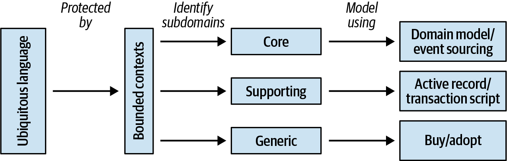
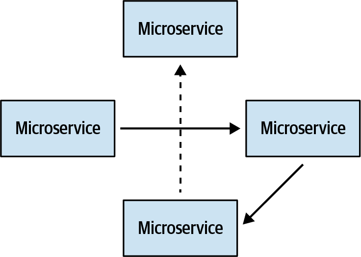

### Appendix A: Applying DDD - A Case Study Summary

This appendix presents a real-world case study of a startup, "Marketnovus," that used Domain-Driven Design from its inception. It candidly shares the team's journey, including their early misunderstandings, significant mistakes, and eventual successes. The narrative follows the evolution of five key bounded contexts, demonstrating how the team's understanding of DDD matured from a narrow focus on tactical patterns ("aggregates everywhere") to a more holistic, strategic approach. The core message is that **Ubiquitous Language** is the most critical DDD pattern, that designs must evolve as subdomains evolve, and that pragmatism—choosing the right pattern for the actual complexity of the problem—is essential for success.

---

### The Five Bounded Contexts of Marketnovus

Marketnovus's business domain was outsourced marketing services, from creating campaigns to managing sales leads. The case study follows the evolution of their system through five key bounded contexts.

#### Bounded Context #1: Marketing
*   **Problem:** Build the initial system for managing contracts, creative materials, and ad campaigns.
*   **Initial Design:** A single monolithic bounded context with an "aggregates everywhere" approach. Every noun became an "aggregate." In reality, this was an **Anemic Domain Model** with all logic in a large service layer (effectively the Active Record pattern).
*   **Key Mistake:** Misunderstanding aggregates and focusing only on tactical patterns.
*   **The "Magic" (Why it Succeeded Anyway):** The team successfully developed a robust **Ubiquitous Language** with domain experts. This smooth communication compensated for the architectural flaws and allowed them to deliver a working product on an aggressive timeline.
*   **Lesson:** A strong Ubiquitous Language can salvage a project even with a flawed technical design.

#### Bounded Context #2: Customer Relationship Management (CRM)
*   **Problem:** Build a custom CRM to manage incoming sales leads, as no off-the-shelf product fit their complex needs (e.g., lead distribution, commission calculations).
*   **Initial Design:** The team tried to add more "anemic" aggregates to the existing monolith. They noticed naming conflicts (`MarketingLead` vs. `CRMLead`) and realized they were missing a key concept.
*   **Design, Take Two (The Revelation):** The team learned about **Bounded Contexts** to protect the Ubiquitous Language and true **Aggregates** as consistency boundaries. They split the monolith into two logical contexts (Marketing and CRM) and committed to building a "proper" Domain Model in the new CRM context.
*   **Key Mistake:** The team got stuck in analysis paralysis trying to perfect the Domain Model, slowing development to a crawl. To speed things up, management offloaded some logic to the DBA team, who implemented it in **stored procedures**. This disastrously **split the `Lead` aggregate** across two teams and two implicit contexts.
*   **Outcome:** The project was late, full of bugs, and led to corrupted data due to inconsistent models and duplicated logic. It required a complete, costly rewrite years later.
*   **Lesson:** Never split an aggregate's logic across boundaries. A shared understanding (Ubiquitous Language) is non-negotiable between teams working on the same logic.

#### Bounded Context #3: Event Crunchers
*   **Problem:** Logic for handling incoming customer events was spread across both the Marketing and CRM contexts. The team decided to extract it into a dedicated bounded context.
*   **Initial Design:** The team correctly identified this as a **Supporting Subdomain** (no competitive advantage, simple logic). They pragmatically implemented it with a simple Layered Architecture and Transaction Scripts.
*   **The Evolution:** Over time, the business added more complex rules and logic to this context. Simple flags evolved into complex invariants. The Supporting Subdomain **morphed into a Core Subdomain**.
*   **Key Mistake:** The team didn't adapt the design to match the growing complexity. The simple architecture devolved into a **Big Ball of Mud**.
*   **Outcome:** The codebase became unmaintainable. It was eventually rewritten from scratch using an **Event-Sourced Domain Model** to handle the now-evident complexity.
*   **Lesson:** Subdomains are not static. Pain during development is a crucial signal that a subdomain's type may have changed, requiring a corresponding evolution in the technical design.

#### Bounded Context #4: Bonuses
*   **Problem:** Automate the calculation of sales agent commissions.
*   **Initial Design:** Again, correctly identified as a **Supporting Subdomain** and implemented with a simple Active Record pattern.
*   **The Evolution:** Just like Event Crunchers, the business got creative, and the commission logic grew immensely complex. The subdomain evolved into a **Core Subdomain**.
*   **Key Difference from Event Crunchers:** This time, the team had maintained a strong **Ubiquitous Language**. As the business logic grew more complex, the language became more sophisticated. The team recognized that the simple Active Record pattern could no longer express the rich business language.
*   **Outcome:** Because the Ubiquitous Language acted as an early warning system, the team identified the need to refactor much earlier. They successfully rewrote the context as an Event-Sourced Domain Model before it became an unmanageable mess.
*   **Lesson:** The Ubiquitous Language is a powerful tool for detecting when a design no longer fits the domain's complexity.

#### Bounded Context #5: The Marketing Hub
*   **Problem:** Create a new business vertical to sell generated leads to smaller clients. Management considered this a **Core Subdomain**.
*   **Initial Design:** The team pulled out all the stops: Event Sourcing, CQRS, and **Microservices**. They created a service for each aggregate.
*   **Key Mistake 1 (Microservices):** Making services too small (one per aggregate) led to a **distributed monolith**. The services were extremely "chatty" and highly coupled.
*   **Key Mistake 2 (Over-engineering):** The business's competitive advantage was in its existing relationships, not in complex technology. The actual business logic was trivial. The team had built a technically complex solution for a simple business problem, resulting in massive **accidental complexity**.
*   **Outcome:** A massively over-engineered system that was difficult to maintain.
*   **Lesson:** Do not confuse business importance with technical complexity. A Core Subdomain doesn't automatically require a complex technical implementation. Choose the pattern that fits the *actual* complexity of the business logic.

---

### Key Lessons Learned from the Case Study

> **1. Ubiquitous Language is the Core Subdomain of DDD.** It is the single most important pattern. It builds shared understanding, compensates for other design flaws, and acts as an early warning system when complexity outgrows a design. Invest in it early and always.

> **2. Match the Design to the Subdomain's *Actual* Complexity.** Don't over-engineer. A "Core" business priority might have very simple technical logic. Use the simplest pattern that can solve the problem (e.g., Transaction Script, Active Record). Save complex patterns like Domain Model and Event Sourcing for problems that are genuinely complex.

> **3. Never Ignore Pain.** When a codebase becomes difficult to change, it's a critical signal. It often means the subdomain's nature has evolved (e.g., from Supporting to Core), and the existing design is no longer adequate. It's time to refactor to a more suitable pattern.

> **4. Subdomains Evolve.** A system's design is not static. Be prepared for subdomains to change types (e.g., Supporting to Core, Core to Generic) and be ready to evolve the architecture accordingly.

> **5. Start with Wider Bounded Context Boundaries.** When domain knowledge is low, it is safer to start with larger, coarser-grained bounded contexts. It is much easier to decompose a well-understood monolith later than it is to merge incorrectly-bounded services that form a distributed big ball of mud.

> **6. Reverse-Engineer Subdomain Type as a Sanity Check.** After choosing a technical pattern based on the requirements, map it back to a subdomain type. If the business thinks something is Core but you can implement it with a simple Transaction Script, question the business's assumption. This dialogue creates valuable alignment.

> **7. Never, Ever Split an Aggregate.** An aggregate is a transactional consistency boundary. Splitting its logic across teams, technologies (e.g., C# and Stored Procedures), or services guarantees duplicated logic, data corruption, and maintenance chaos. 