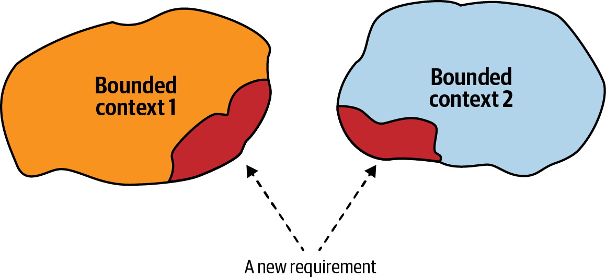
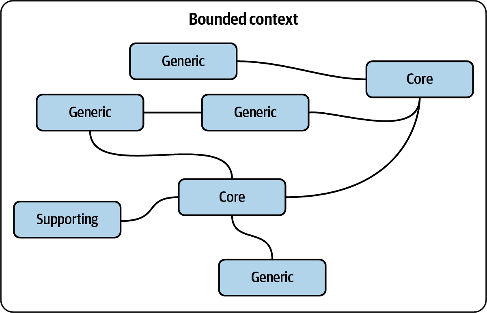
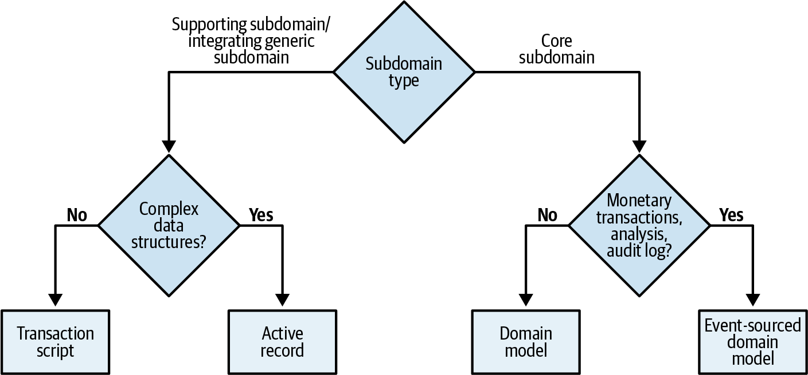
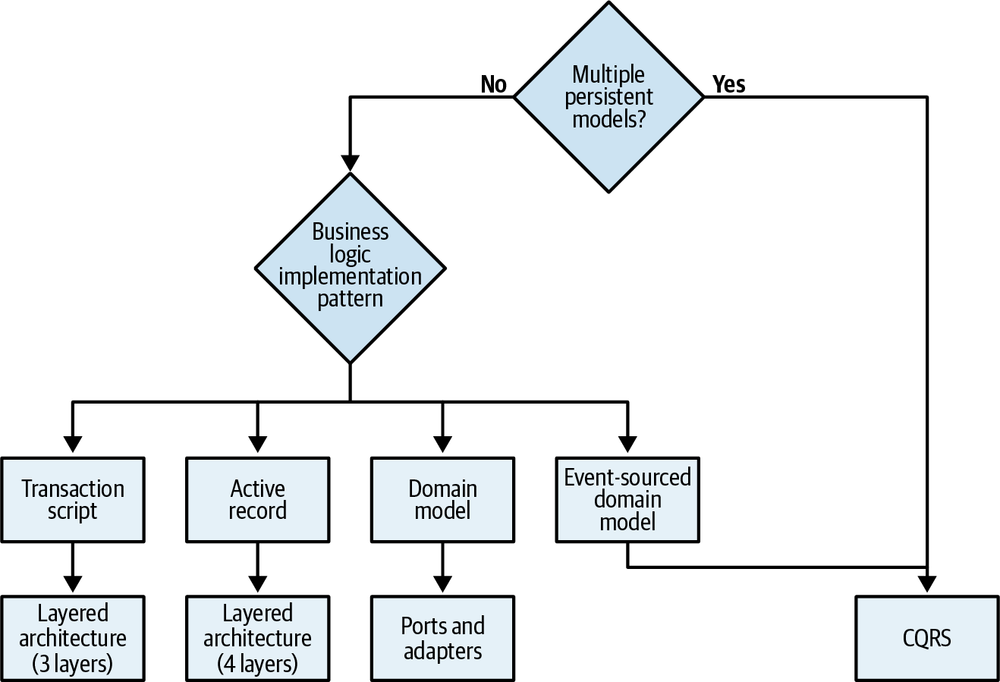
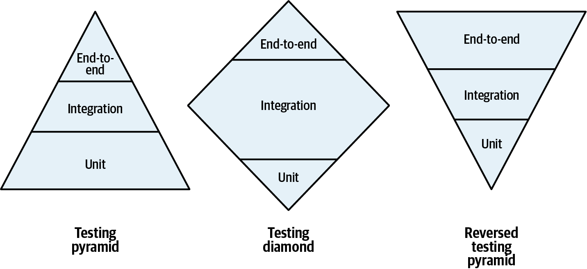
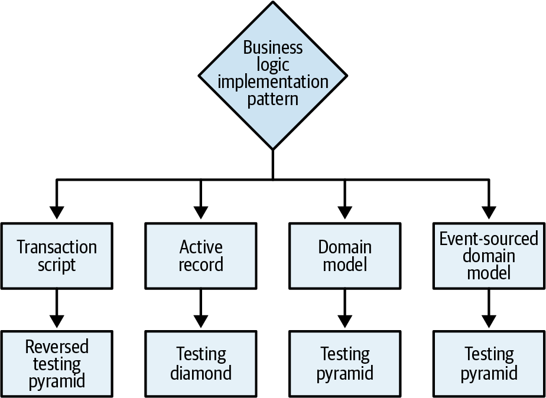
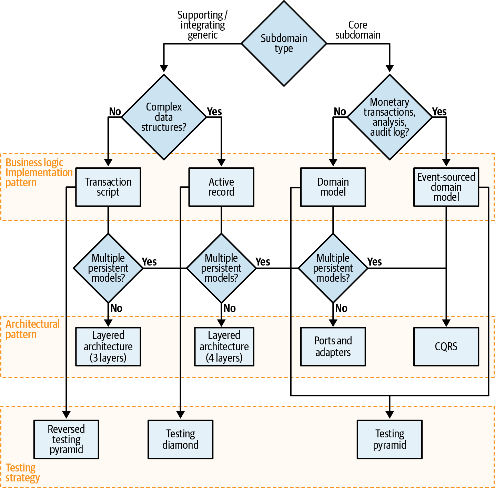

### Chapter 10: Design Heuristics - Summary

This chapter provides a bridge between the strategic analysis of a business domain (Part I) and the tactical design patterns used for implementation (Part II). It introduces a series of **heuristics**—practical rules of thumb—to guide technical design decisions based on the properties of the subdomains being implemented. The goal is to make informed choices about bounded context boundaries, business logic patterns, architectural patterns, and testing strategies.

---

### Heuristics for Bounded Contexts

The size of a bounded context should be a function of the model it contains, not an arbitrary goal (like "microservices should be small").

*   **The Problem:** Changes that span multiple bounded contexts are expensive and indicate poorly designed boundaries. This is especially common in volatile and uncertain **core subdomains**.
*   **The Heuristic:** **Start with wider bounded context boundaries, especially for core subdomains.** It is much cheaper to refactor logical boundaries within a single service than to refactor physical boundaries between multiple services. As domain knowledge increases and models stabilize, these larger contexts can be decomposed into smaller, more focused ones if necessary.

---

### Heuristics for Business Logic Implementation

The choice of how to implement business logic should be driven by the complexity and specific needs of the subdomain.

*   **The Heuristic (A Decision Tree):**
    1.  Does the subdomain track money, require a legal audit log, or need deep behavioral analysis?
        *   **Yes:** Use the **Event-Sourced Domain Model**.
    2.  If not, is the business logic complex (involving complicated rules, invariants, and a rich ubiquitous language)?
        *   **Yes:** Use the **Domain Model**.
    3.  If not, does the subdomain involve complex data structures?
        *   **Yes:** Use the **Active Record** pattern.
    4.  If not, the logic is simple.
        *   **Use a Transaction Script.**

This decision process can also validate your initial subdomain analysis. If a supposed "core" subdomain fits a Transaction Script, or a "supporting" subdomain seems to require a Domain Model, it's a signal to reassess your strategic assumptions.

---

### Heuristics for Architectural Patterns

Once the business logic pattern is chosen, the architectural pattern often follows naturally.

*   **The Heuristic:**
    *   If you chose **Event-Sourced Domain Model**, you **require CQRS** to create queryable read models.
    *   If you chose **Domain Model**, you **require Ports & Adapters** to keep the model free from infrastructure concerns.
    *   If you chose **Active Record**, use a **Layered Architecture with a Service Layer** to orchestrate the logic.
    *   If you chose **Transaction Script**, a simple **3-Layer Architecture** is sufficient.
*   **The Exception:** CQRS can be beneficial for *any* pattern if the subdomain needs to represent its data in multiple different ways for querying.

---

### Heuristics for Testing Strategy

The chosen architecture and business logic pattern can guide the emphasis of your testing efforts.

*   **The Heuristic:**
    *   **Testing Pyramid (Emphasis on Unit Tests):** Best for **Domain Model** and **Event-Sourced Domain Model**. The business logic is encapsulated in aggregates and value objects, which are perfect for unit testing.
    *   **Testing Diamond (Emphasis on Integration Tests):** Best for **Active Record**. The logic is spread between the service layer and the data objects, so testing their integration is key.
    *   **Reversed Testing Pyramid (Emphasis on End-to-End Tests):** Best for **Transaction Script**. The logic is simple and linear, making it efficient to verify the entire workflow from beginning to end.

---

### The Unified Tactical Design Decision Tree

These heuristics can be combined into a single decision tree that flows from subdomain analysis to a complete tactical design plan.

**Key Caveat:** These are heuristics, not laws. They provide a solid starting point based on preferring simpler tools unless complexity demands more advanced patterns. Your team's context and experience may lead you to different conclusions, and that's okay. Always use these heuristics as a guide, not a replacement for critical thinking.

---

### Actionable Tips from Chapter 10

> **1. Start with Wider Bounded Contexts for Core Subdomains.** To manage the high volatility and uncertainty of core domains, begin with broader boundaries. It is far less costly to refactor a logical model inside one service than to redraw the physical boundaries between multiple services.

> **2. Let Subdomain Complexity Drive Your Logic Pattern.** Use the decision tree heuristic to match the implementation pattern to the problem. Don't use a complex Domain Model for simple CRUD logic, and don't try to manage complex invariants with a Transaction Script.

> **3. Align Your Architecture with Your Business Logic.** The choice of business logic pattern strongly implies an appropriate architectural pattern. An Event-Sourced model needs CQRS; a Domain Model needs the isolation of Ports & Adapters.

> **4. Tailor Your Testing Strategy to Your Architecture.** Don't use a one-size-fits-all testing approach. Focus on unit tests for a rich domain model, integration tests for active record, and end-to-end tests for simple transaction scripts.

> **5. Use Heuristics as a Guide, Not a Mandate.** The provided decision tree is a powerful starting point, but it's based on a "prefer simplicity" mindset. If your team has deep expertise in a specific pattern (like event sourcing), it might be more efficient for you to use it more broadly. Always adapt the heuristics to your specific context. 