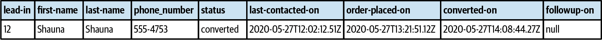

### Chapter 11: Evolving Design Decisions - Summary

This chapter addresses the reality that software design is not a one-time activity. As businesses, organizations, and domain knowledge evolve, so too must the system's design. The chapter provides heuristics for managing change across four key vectors: the business domain itself, organizational structure, domain knowledge, and system growth. The core message is to treat design as a continuous process and use changes in the project's environment as signals to re-evaluate and adapt technical decisions.

---

### Changes in Domains

The classification of subdomains (Core, Supporting, Generic) is not static. As the business and market landscape change, subdomains can morph from one type to another. Recognizing these shifts is crucial for keeping the design aligned with business strategy.

*   **Core to Generic:** A company's unique competitive advantage becomes a commodity when a superior off-the-shelf product becomes available.
*   **Generic to Core:** A company decides to build a custom solution for a previously generic function (e.g., inventory management) to gain a new competitive edge.
*   **Supporting to Generic:** A simple in-house tool is replaced by a more powerful open source or commercial solution.
*   **Supporting to Core:** The logic in a supporting subdomain becomes more complex and starts generating profit or significantly cutting costs, turning it into a competitive advantage.
*   **Core to Supporting:** A core feature is no longer profitable, and its complexity is stripped down to the minimum necessary.
*   **Generic to Supporting:** An off-the-shelf solution is deemed too complex for the value it provides, and the company reverts to a simpler in-house implementation.

---

### Impact on Strategic and Tactical Design

A change in a subdomain's type has direct consequences for both high-level architecture and low-level implementation.

#### Strategic Design Concerns
*   **Integration Patterns:** A subdomain becoming Core requires stronger protection, like an **Anticorruption Layer** and a **Published Language**. The **Separate Ways** pattern is no longer viable for a Core subdomain.
*   **Implementation Strategy:** A change may require moving development from an outsourced team to an in-house one (e.g., Supporting to Core) or vice-versa (e.g., Core to Supporting).

#### Tactical Design Concerns
The primary signal for a needed design change is **pain**: the existing implementation pattern can no longer handle the business logic's complexity.

*   **Transaction Script → Active Record:** When data handling in a procedural script becomes too complex, encapsulate the data structures into Active Record objects.
*   **Active Record → Domain Model:** When business logic within services becomes complex and leads to inconsistencies, refactor by:
    1.  Identifying and creating immutable **Value Objects**.
    2.  Making entity setters `private` to locate all external state modifications.
    3.  Moving this state-modifying logic into methods on the entity itself.
    4.  Identifying **Aggregates** based on transactional boundaries to ensure consistency.
    5.  Defining an **Aggregate Root** for each aggregate.
*   **Domain Model → Event-Sourced Domain Model:** Migrating an existing state-based model requires a strategy for its history.
    1.  **Generating Past Transitions:** Create a best-effort, approximate stream of past events that results in the current state. This is testable but provides an incomplete history.
    
    2.  **Modeling Migration Events:** Create a single `migrated-from-legacy` event that captures the full state at the time of migration. This is honest about the lack of history but requires all future projections to handle this special event type.

---

### Organizational Changes

A system's design is heavily influenced by the structure of the teams building it (Conway's Law).

*   **Growing Teams:** A wide bounded context may need to be split into smaller ones so that new teams can work autonomously.

*   **Changes in Collaboration:**
    *   **Partnership → Customer-Supplier:** If teams can no longer collaborate closely (e.g., due to geographical distance), a more formal customer-supplier relationship is needed.
    *   **Customer-Supplier → Separate Ways:** If integration issues become too costly due to poor communication, it may be more effective to duplicate the functionality of a generic or supporting subdomain.

---

### Changes in Domain Knowledge

Modeling is an ongoing process of discovery.

*   **Incomplete Knowledge:** When starting in a complex, volatile domain, it's often wise to begin with **broader bounded context boundaries**. It is cheaper to refactor a logical model within a single deployable unit than to change the physical boundaries between multiple services.
*   **Knowledge Loss:** Over time, domain knowledge can degrade as documentation becomes stale and original team members leave. Proactively preventing this is key. Tools like **Event Storming** can help recover lost knowledge.

---

### Growth

Unmanaged growth is the primary cause of a **"Big Ball of Mud."** The key is to distinguish between essential (domain) complexity and accidental (technical) complexity and to eliminate the latter.

*   **Subdomains:** As a system grows, revisit subdomain boundaries. A large subdomain may contain finer-grained subdomains that, if identified, can be implemented with more appropriate patterns.

*   **Bounded Contexts:** Prevent contexts from losing focus. "Chatty" contexts that are highly dependent on each other are a sign of poorly drawn boundaries that need to be refactored to increase autonomy.
*   **Aggregates:** Adhere strictly to the principle of keeping aggregates small. As new features are added, resist the temptation to bloat existing aggregates. Extracting new, focused aggregates simplifies the model and can even reveal hidden bounded contexts.

---

### Actionable Tips from Chapter 11

> **1. Treat Design as a Continuous Process.** Regularly re-evaluate your design decisions against the current state of the business domain, its subdomains, and your organizational structure.
 
> **2. Use Pain as a Design Signal.** When it becomes difficult to evolve a model, recognize it as a sign that the current implementation pattern no longer fits the domain's complexity. Use this as a trigger to refactor to a more suitable pattern.

> **3. Adapt Your Architecture to Organizational Reality.** Bounded context boundaries are social as much as they are technical. Split contexts to accommodate growing teams or change integration patterns when team collaboration dynamics shift.

> **4. Start with Broader Boundaries in Uncertain Domains.** In a volatile core subdomain where knowledge is low, avoid premature decomposition. It is much easier to split a single, larger service later than to merge multiple, incorrectly-bounded services.

> **5. Actively Fight Growth-Driven Complexity.** As a system grows, regularly revisit the boundaries of subdomains, bounded contexts, and aggregates. Eliminate accidental complexity by refactoring and extracting new, more focused components.

> **6. Keep Your Aggregates Small.** Continuously enforce the rule that an aggregate should only contain what must be strongly consistent. Refactor growing aggregates to extract new, smaller ones, which simplifies the model and reduces contention.

> **7. Be Explicit When Migrating to Event Sourcing.** When moving from a state-based model, a `Migration Event` that explicitly captures the legacy state is often a safer and more honest approach than trying to generate a potentially inaccurate history of past events.

> **8. Proactively Manage Domain Knowledge.** Knowledge is a key asset that can be lost. Use techniques like Event Storming to capture, refresh, and recover domain knowledge to prevent your system from degrading into a legacy state. 