### Chapter 12: Event Storming - Summary

This chapter shifts focus from specific design patterns to **Event Storming**, a collaborative, low-tech workshop designed to rapidly model a business process. It is presented as a powerful tool for knowledge sharing, building a ubiquitous language, and aligning the understanding of various stakeholders. The chapter details the "what, who, and how" of facilitating an Event Storming session, walking through its 10-step process, discussing its variations, and outlining when it is most effective. The core value of Event Storming is emphasized not as the final model produced, but as the shared learning and discovery that happens among participants during the process itself.

---

### What is Event Storming?

Event Storming is a group brainstorming activity where participants model a business process as a series of **domain events** plotted along a timeline. The model is progressively enriched with other concepts like commands, actors, policies, and read models. Its main purpose is to serve as a tactical tool for sharing and synchronizing business domain knowledge among a diverse group of people.

#### Who Should Participate?
*   A diverse group of stakeholders: engineers, domain experts, product owners, testers, UI/UX designers, support staff, etc.
*   The more diverse the backgrounds, the more knowledge is uncovered.
*   The ideal group size is **under 10 participants** to ensure everyone can contribute effectively.

#### What Do You Need?
*   **Modeling Space:** A very large wall covered with butcher paper or a massive whiteboard.
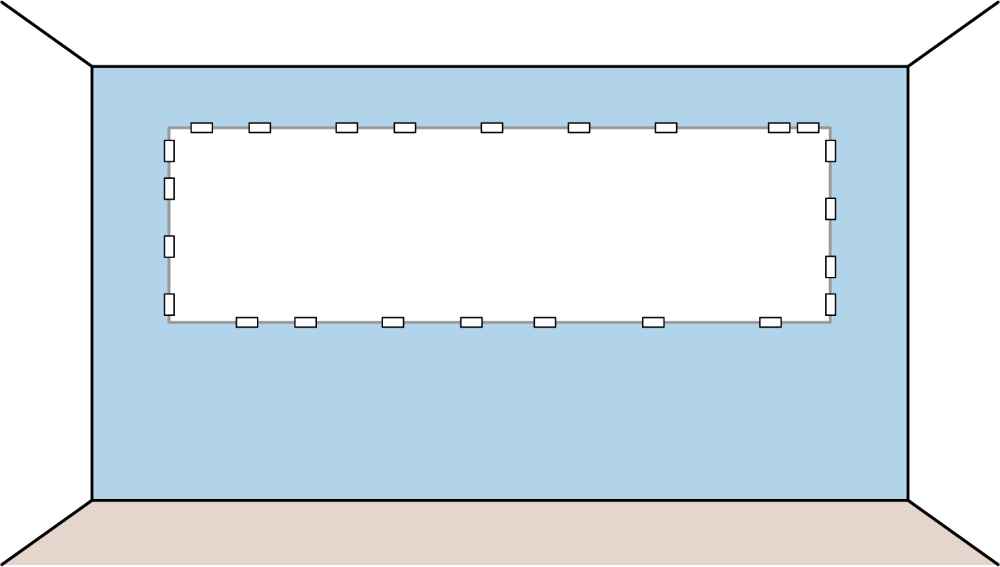
*   **Sticky Notes:** Lots of them, in various specific colors.
*   **Markers:** Enough for all participants.
*   **A Spacious Room:** With no large table in the middle and ideally no chairs, to encourage movement and participation.
*   **Snacks:** Sessions can last 2-4 hours and require energy.

---

### The Event Storming Process

The workshop typically follows 10 steps, where the model is gradually enriched.

**Step 1: Unstructured Exploration**
*   All participants brainstorm **domain events**—interesting things that have happened in the business.
*   Events are written on **orange sticky notes** and must be in the **past tense** (e.g., "Order Submitted").
*   They are placed randomly on the modeling surface. The goal is a brain dump, not organization.
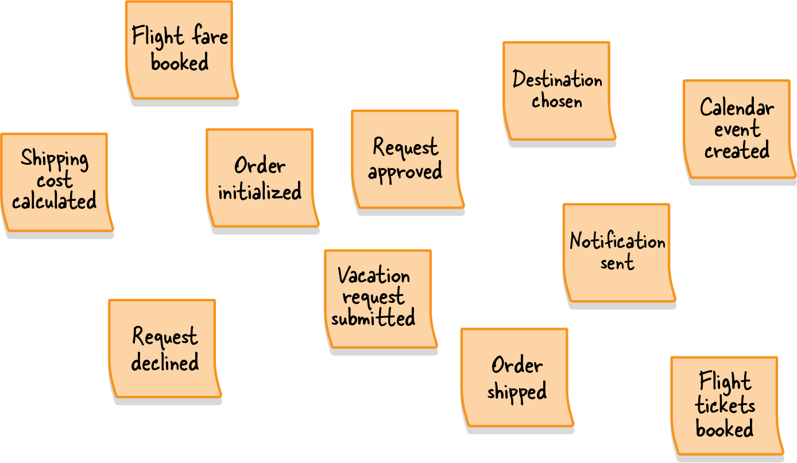

**Step 2: Timelines**
*   The group organizes the orange notes into a chronological timeline from left to right.
*   Start with the "happy path" (successful scenario), then add alternative paths and error flows.
*   Duplicates are removed, and missing events are added.
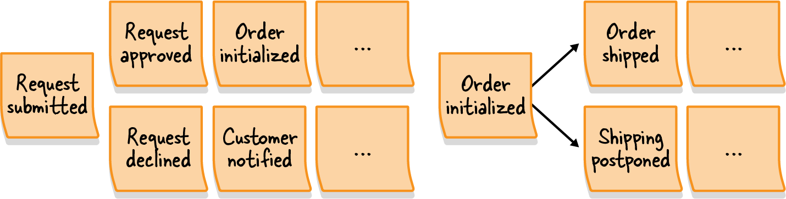

**Step 3: Pain Points**
*   Using the high-level view, the group identifies bottlenecks, missing knowledge, or process inefficiencies.
*   These are marked with rotated (diamond-shaped) **pink sticky notes**.
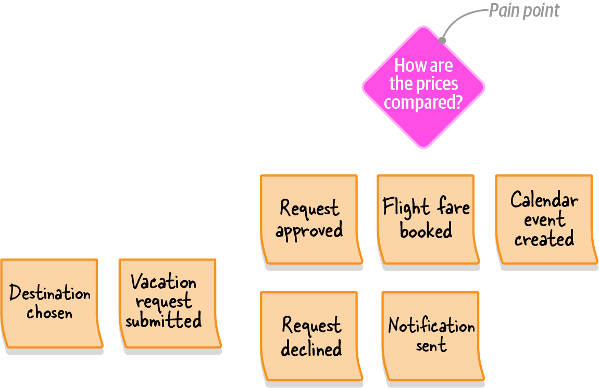

**Step 4: Pivotal Events**
*   The group identifies significant business events that mark a change in context or phase (e.g., "Order Shipped," "Order Returned").
*   These are marked with a vertical line on the modeling surface.
*   Pivotal events are strong indicators of potential **bounded context** boundaries.
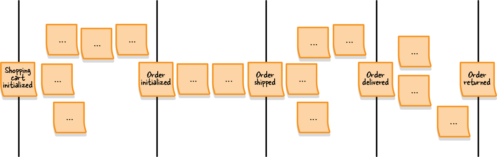

**Step 5: Commands**
*   A **command** is what triggers an event. It describes a system operation and is written in the **imperative tense** (e.g., "Submit Order").
*   Commands are written on **light blue sticky notes** and placed before the event(s) they cause.
*   If a command is initiated by a person, an **actor** (a user persona like "Customer") is added on a small **yellow sticky note**.
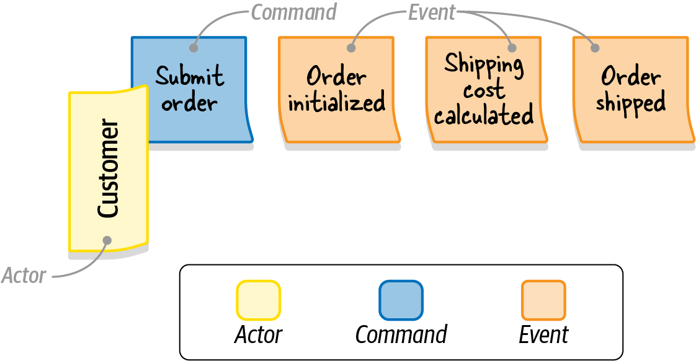

**Step 6: Policies**
*   A policy describes automation, where an event automatically triggers a command.
*   Policies are represented by **purple sticky notes**, often linking an event to a command.
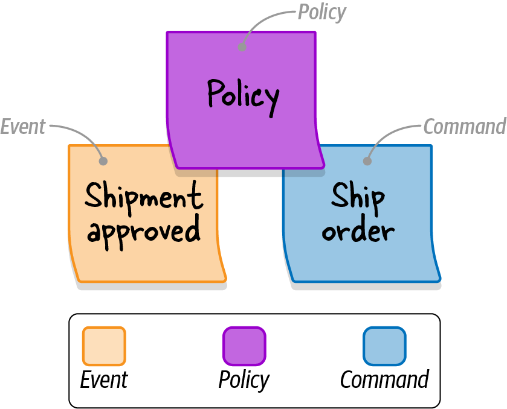

**Step 7: Read Models**
*   A **read model** is the view of data an actor needs to make a decision and execute a command (e.g., a screen, a report).
*   They are written on **green sticky notes** and placed before the command they inform.
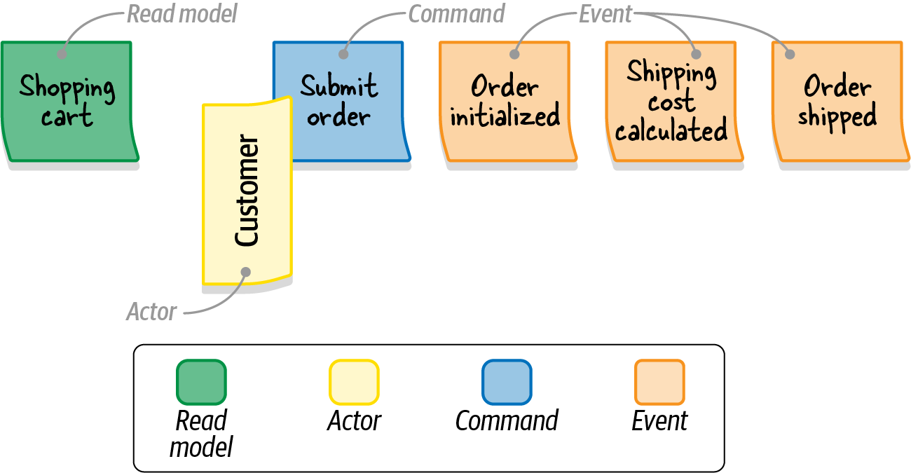

**Step 8: External Systems**
*   An external system is any system outside the domain being modeled that can either trigger a command (input) or be notified of an event (output).
*   They are represented by **pink sticky notes**.
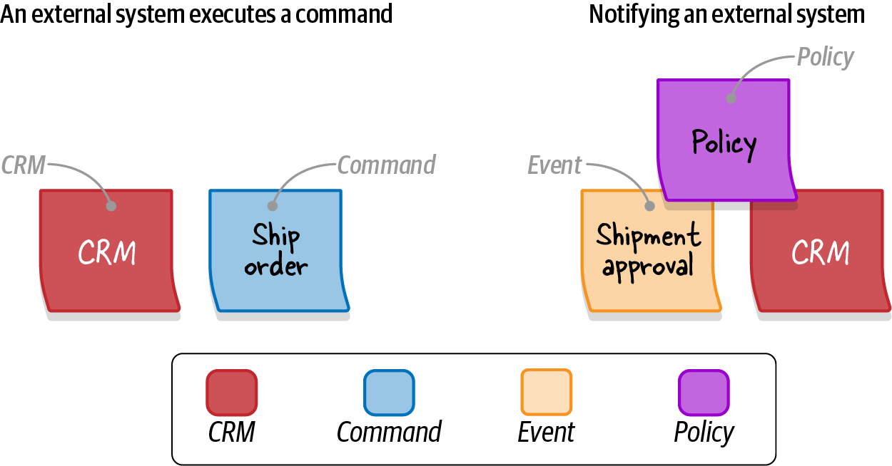

**Step 9: Aggregates**
*   Participants group related commands and events into **aggregates**—the components that receive commands and produce events.
*   Aggregates are drawn on large **yellow sticky notes**, enclosing their respective commands and events.
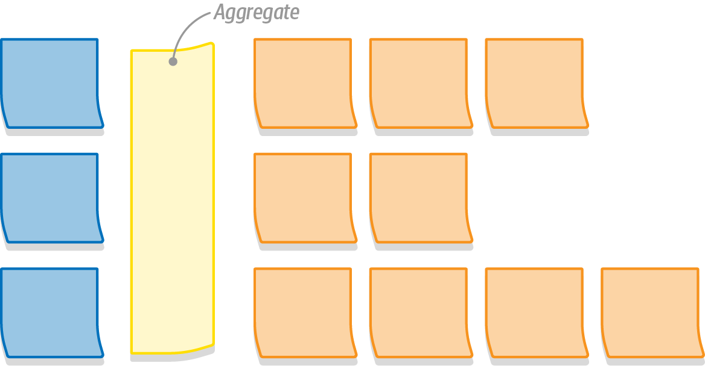

**Step 10: Bounded Contexts**
*   Finally, the group looks for clusters of related aggregates. These clusters are natural candidates for **bounded context** boundaries.
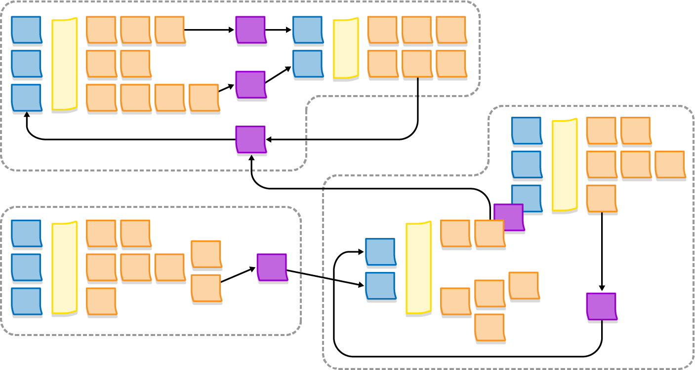

---

### Variants and Facilitation

*   **Big Picture First:** A common variant is to first run a high-level session covering only steps 1-4 to map the entire business landscape. Then, run dedicated, full-process sessions for each key area discovered.
*   **Create a Legend:** Before starting, create a visual legend of the sticky note color code so all participants can remember what each element represents.
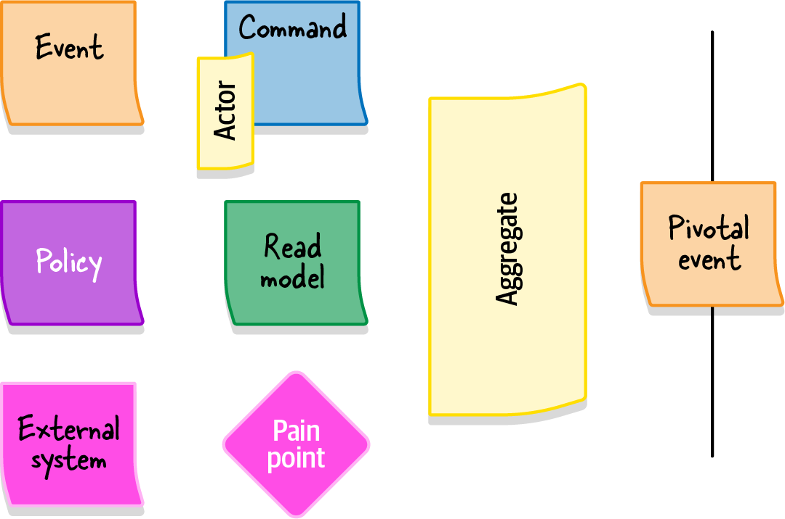
*   **Remote Event Storming:** While in-person is strongly preferred, remote sessions can be done with tools like Miro. They are less effective, require more patience, and work best with smaller groups (max 5 people).

### When to Use Event Storming
*   To build a **ubiquitous language**.
*   To model a complex **business process** and discover aggregates/bounded contexts.
*   To explore new **business requirements** and uncover edge cases.
*   To **recover lost domain knowledge**, especially in legacy systems.
*   To find opportunities to **improve an existing process**.
*   To **onboard new team members** quickly.

**Do not** use it for simple, sequential business processes with little to no complexity.

---

### Actionable Tips from Chapter 12

> **1. Assemble a Diverse Team (But Keep It Small).** Involve stakeholders from all parts of the business (devs, experts, UX, support) but keep the group under 10 people to ensure everyone can actively contribute.

> **2. Prepare the Right Environment.** Use a large, open physical space with a massive modeling surface. Remove chairs to encourage participation and movement. Have plenty of colored sticky notes and markers ready.

> **3. Start with a Chaotic Brain-Dump.** Begin by having everyone silently write and post all possible domain events (orange notes, past tense). Don't worry about order or duplicates; the goal is to get all ideas onto the wall.

> **4. Use Pivotal Events to Find Bounded Contexts.** As you build the timeline, identify the major business milestones or phase changes. These "pivotal events" are strong indicators of where the boundaries between bounded contexts might lie.

> **5. Create and Display a Sticky Note Legend.** Use the standard color code and create a visual legend (like Figure 12-12) so all participants understand what each color represents (Event, Command, Actor, Read Model, etc.).

> **6. Focus on the Process, Not Just the Artifact.** The main goal is collaborative knowledge sharing, building a ubiquitous language, and aligning mental models. The final diagram is a valuable artifact, but the shared understanding gained during its creation is the real prize.

> **7. Know When (and When Not) to Use It.** Event Storming excels at exploring complex business processes, recovering lost knowledge, and onboarding teams. Avoid it for simple, linear processes where there's little complexity to uncover.

> **8. Adapt the Process to Your Needs.** The 10 steps are a guideline, not a rigid law. For a high-level overview, you might only perform steps 1-4. Feel free to adapt the recipe to fit your team and goals.

> **9. Facilitate Actively.** As a facilitator, watch the group's energy. Reignite discussions with questions, ensure quieter members are included, and know when it's time for a break or to move to the next step.

> **10. Be Cautious with Remote Sessions.** While tools like Miro make remote Event Storming possible, it's less effective. If you must do it remotely, keep groups smaller (<= 5 people), be more patient, and return to in-person sessions when possible. 